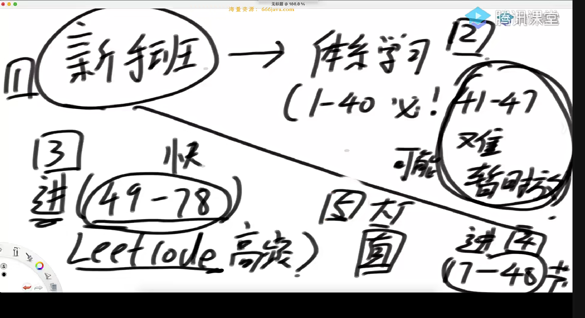

###### 节奏



###### 选择排序

思路：每次把i到n-1之间的最小的数放到i位置，i的最大边界是leng-1， 

代码如下

```java
import java.util.Arrays;
import java.util.Random;

public class code01_SelectSort {
    public static void selectSort(int[] arr){
        if (arr == null || arr.length < 2){
            return;
        }
        for (int i = 0; i < arr.length - 1; i++){
            int minIndex = i;
            for (int j = i + 1; j < arr.length; j++){
                minIndex = arr[j] < arr[minIndex] ? j : minIndex;
            }
            swap(arr,i,minIndex);
        }
    }

    public static void swap(int[] arr, int i, int tmp) {
        int num;
        num = arr[i];
        arr[i] = arr[tmp];
        arr[tmp] = num;
    }

    public static void test(int[] arr){
        Arrays.sort(arr);
    }

    public static int[] generateRandomArray(int maxSize, int maxValue){
        Random random = new Random();
        int size = random.nextInt(maxSize + 1);
        int[] arr = new int[size];
        for (int i = 0; i< arr.length; i++){
            arr[i] = random.nextInt(maxValue*2 + 1) - maxValue;
        }
        return arr;
    }


    public static int[] copyArray(int[] arr){
        if (arr == null){
            return null;
        }
        int[] newArray = new int[arr.length];
        for (int i = 0; i < arr.length; i++){
            newArray[i] = arr[i];
        }
        return newArray;
    }

    public static boolean isEqual(int[] arr1, int[] arr2){
        if (arr1 != null && arr2 !=null){
            int length = arr1.length;
            for(int i = 0; i < length; i++){
                if (arr1[i] != arr2[i]){
                    return false;
                }
            }
            return true;
        }
        return false;
    }


    public static void  printArray(int[] arr){
        if (arr == null){
            return;
        }
        for (int i = 0; i < arr.length; i++){
            System.out.print(arr[i] + " ");
        }
        System.out.println();
    }
    public static void main(String[] args) {
        int testTime = 10000;
        int maxValue = 500;
        int maxSize = 20;
        for (int i =0; i < testTime; i++){
            int[] arr1 = generateRandomArray(maxSize,maxValue);
            int[] arr2 = copyArray(arr1);
            selectSort(arr1);
            test(arr2);
            if (!isEqual(arr1, arr2)){
                printArray(arr1);
                printArray(arr2);
                break;
            }
        }
        return;
    }


}

```

###### 冒泡算法

```java
public static void BubbleSort(int[] arr){
    if (arr == null || arr.length < 2){
        return;
    }

    for(int e = arr.length - 1; e > 0; e--){
        for (int i = 0; i < e; i--){
            if (arr[i] > arr[i + 1]){
                swap(arr, i, i+1);
            }
        }
    }
}
```

###### 插入排序

```java
public static void insertSort(int[] arr){
    if (arr == null || arr.length < 2){
        return;
    }
    for (int i = 1; i < arr.length; i ++){
        for (int j = i - 1; j >= 0 && arr[j] > arr[j+1]; j--){
            swap(arr, j , j+1);
        }
    }
}
```

###### 二分查找

```java
import java.util.Arrays;
import java.util.Random;

public class BSExist {

    public static boolean BSExist(int[] arr, int num){
        if (arr == null || arr.length == 0){
            return false;
        }
        int l = 0;
        int r = arr.length - 1;
        while (l < r){
            int mid = l + (r - l)/2;
            if (arr[mid] == num){
                return true;
            }else if (arr[mid] > num){
                r = mid - 1;
            }else if (arr[mid] < num){
                l = mid + 1;
            }
        }
        return arr[l] == num;
    }

    public static void main(String[] args) {
        int testTime = 5000;
        int maxSize = 20;
        int maxValue = 20;
        for (int i = 0 ; i < testTime; i++){
            int[] arr = generateRandomArray(maxValue, maxSize);
            Arrays.sort(arr);
            Random random = new Random();
            int value = (int)random.nextInt(maxValue * 2 + 1) - maxValue;
            if (BSExist(arr, value) != test(arr, value)){
                System.out.println("no");
                break;
            }
        }
    }

    private static boolean test(int[] arr, int value) {
        if (arr == null || arr.length == 0){
            return false;
        }
        for (int i = 0; i < arr.length; i++) {
            if (arr[i] == value){
                return true;
            }
        }
        return false;
    }

    private static int[] generateRandomArray(int maxValue, int maxSize) {
        Random random = new Random();
        int size = random.nextInt(maxSize + 1);
        int [] arr = new int[size];
        for (int i = 0; i < size; i++){
            arr[i] = (int)random.nextInt(maxValue * 2 + 1) - maxValue;
        }
        return arr;
    }
}

```

###### 找出有序数列里>=value值的最左面的数的位置

```java
import java.util.Arrays;
import java.util.Random;

public class BSNearLeft {

    public static void main(String[] args) {
        int testTime = 5000;
        int maxValue = 20;
        int maxSize = 20;
        for (int i = 0; i < testTime; i++){
            int[] arr = generateRandomArray(maxValue, maxSize);
            Arrays.sort(arr);
            Random random = new Random();
            int value = (int)random.nextInt(2*maxValue + 1) - maxValue;
            if (BSNearLeft(arr, value) != test(arr, value)){
                printArray(arr);
                System.out.println(value);
                System.out.println(BSNearLeft(arr, value));
                System.out.println(test(arr,value));
            }
        }
    }

    private static void printArray(int[] arr) {
        if (arr == null){
            return;
        }
        for (int i = 0; i < arr.length; i++){
            System.out.print(arr[i] + " ");
        }
        System.out.println();
    }

    private static int test(int[] arr, int value) {
        if (arr == null || arr.length == 0){
            return -1;
        }
        for(int i = 0; i < arr.length; i++){
            if (arr[i] >= value){
                return i;
            }
        }
        return -1;
    }

    private static int[] generateRandomArray(int maxValue, int maxSize) {
        Random random = new Random();
        int size = (int)random.nextInt(maxSize + 1);
        int[] arr = new int[size];
        for (int i = 0; i < size; i++){
            arr[i] = (int)random.nextInt(maxValue * 2 + 1) - maxValue;
        }
        return arr;
    }

    public static int BSNearLeft(int[] arr, int value){
        if (arr == null || arr.length == 0){
            return -1;
        }

        int l = 0;
        int r = arr.length - 1;
        int index = -1;
        while (l <= r){
            int mid = l + (r - l) / 2;
            if (arr[mid] >= value){
                index = mid;
                r = mid - 1;
            }else{
                l = mid + 1;
            }
        }
        return index;
    }
}

```

###### 找出有序数列里<=value值的最右面的数的位置

```java
import java.util.Arrays;
import java.util.Random;

public class BSNearRight {
    public static void main(String[] args) {
        int testTime = 5000;
        int maxValue = 20;
        int maxSize = 20;
        for (int i = 0; i < testTime; i++){
            int[] arr = generateRandomArray(maxValue, maxSize);
            Arrays.sort(arr);
            Random random = new Random();
            int value = (int)random.nextInt(2*maxValue + 1) - maxValue;
            if (BSNearRight(arr, value) != test(arr, value)){
                printArray(arr);
                System.out.println(value);
                System.out.println(BSNearRight(arr, value));
                System.out.println(test(arr,value));
                break;
            }
        }
    }

    private static void printArray(int[] arr) {
        if (arr == null){
            return;
        }
        for (int i = 0; i < arr.length; i++){
            System.out.print(arr[i] + " ");
        }
        System.out.println();
    }

    private static int test(int[] arr, int value) {
        if (arr == null || arr.length == 0){
            return -1;
        }
        for(int i = arr.length - 1; i >= 0; i--){
            if (arr[i] <= value){
                return i;
            }
        }
        return -1;
    }

    private static int[] generateRandomArray(int maxValue, int maxSize) {
        Random random = new Random();
        int size = (int)random.nextInt(maxSize + 1);
        int[] arr = new int[size];
        for (int i = 0; i < size; i++){
            arr[i] = (int)random.nextInt(maxValue * 2 + 1) - maxValue;
        }
        return arr;
    }

    public static int BSNearRight(int[] arr, int value){
        if (arr == null || arr.length == 0){
            return -1;
        }

        int l = 0;
        int r = arr.length - 1;
        int index = -1;
        while (l <= r){
            int mid = l + (r - l) / 2;
            if (arr[mid] <= value){
                index = mid;
                l = mid + 1;
            }else{
                r = mid - 1;
            }
        }
        return index;
    }
}

```

###### 数列的局部最小值

问题描述

在数组中找到一个位置 i，使得 arr[i] 小于其相邻的两个元素（即 arr[i-1] 和 arr[i+1]）。如果数组只有一个元素或者该元素小于其唯一相邻的元素，则该元素也是局部最小值。

```java
public class BSAweSome {

    public static int BSAweSome(int[] arr){
        if (arr == null || arr.length == 0){
            return -1;
        }
        if (arr.length == 0 || arr[0] < arr[1]){
            return 0;
        }
        if (arr[arr.length-2] > arr[arr.length - 1]){
            return arr.length - 1;
        }
        int l = 1;
        int r = arr.length - 1;
        while(l < r){
            int mid = l + (r - l) / 2;
            if (arr[mid] > arr[mid - 1]){
                r = mid - 1;
            }else if(arr[mid] > arr[mid + 1]){
                l = mid + 1;
            }else{
                return mid;
            }
        }
        return l;
    }
}

```