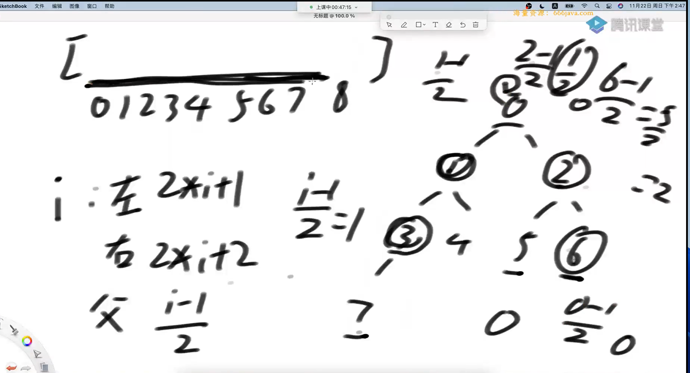
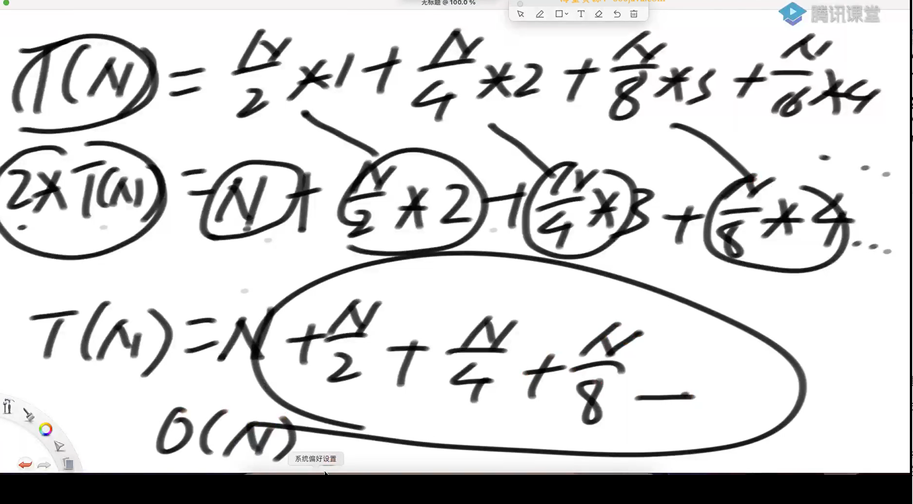

比较器

返回负数，认为第一个参数应该排到前面

返回正数，认为第二个参数应该排到前面

返回0，谁在前都行

堆结构

1 堆结构就是用数组实现的完全二叉树结构

2 完全二叉树中如果每课子树的最大值都在顶部就是大根堆

3 完全二叉树中如果每课子树的最小值都在顶部就是小根堆

4 堆结构的heapinsert与heapify操作

5 堆结构的增大和减少

6 优先级队列结构，就是堆结构

用一个数组表示完全二叉树



```java
package class06;

import java.util.Objects;
import java.util.PriorityQueue;
import java.util.Random;

public class code02_heap {

    public static class MyMaxHeap{
        private int[] heap;
        private final int limit;
        private int heapSize;


       public MyMaxHeap(int size){
           heap = new int[size];
           this.limit = size;
           heapSize = 0;
       }

       public boolean isEmpty(){
           return heapSize == 0;
       }


       public boolean isFull(){
           return heapSize == limit;
       }


       public void push(int value){
          if (heapSize == limit){
              throw new RuntimeException("heap is full");
          }
          heap[heapSize] = value;
          heapInfUp(heap, heapSize++);

       }


       public int pop(){
           if (heapSize == 0){
               throw new RuntimeException("heap is empty");
           }
           int ans = heap[0];
           swap(heap, 0, --heapSize);
           heapIfyDown(heap, 0, heapSize);

           return ans;
       }


        //新加进来的数移动到了index
       private void heapInfUp(int[] arr, int index){
            while (arr[index] > arr[(index - 1) / 2]){
                swap(arr, index, (index - 1) / 2);
                index = (index - 1) / 2;
            }
       }

        private void swap(int[] arr, int i, int j) {
           int temp = arr[i];
           arr[i] = arr[j];
           arr[j] = temp;
        }

        private void heapIfyDown(int[] heap, int index, int heapSize) {
            int left = 2 * index + 1;
            while(left < heapSize){
                int maxChildIndex = left;

                if (left + 1 < heapSize){
                    maxChildIndex = heap[left] > heap[left + 1] ? left : left + 1;
                }

                if (heap[index] > heap[maxChildIndex]){
                    break;
                }
                swap(heap, index, maxChildIndex);
                index = maxChildIndex;
                left = 2 * index + 1;
            }
       }
    }

    public static class easyMaxHeap{
        private int[] heap;
        private final int limit;
        private int heapSize;

        public easyMaxHeap(int size){
            heap = new int[size];
            limit = size;
            heapSize = 0;
        }

        public boolean isEmpty(){
            return heapSize == 0;
        }

        public boolean isFull(){
            return heapSize == limit;
        }

        public int pop(){
            if (heapSize == 0){
                throw new RuntimeException("heap is empty");
            }
            int max = 0;
            for(int i = 1; i < heapSize; i++){
                if (heap[max] < heap[i]){
                    max = i;
                }
            }
            int ans = heap[max];
            swap(heap, max, --heapSize);
            return ans;
        }


        public void push(int value){
            if (heapSize == limit){
                throw new RuntimeException("heap is full");
            }
            heap[heapSize++] = value;
        }

        private void swap(int[] heap, int i, int j) {
            int temp = heap[i];
            heap[i] = heap[j];
            heap[j] = temp;
        }
    }


    public static void main(String[] args) {
        int testTimes = 50000;
        int maxValue = 10;
        int maxLimit = 10;
        int oneTestTimes = 10;

        for (int i = 0; i < testTimes; i++){
            Random random = new Random();
            int limit = random.nextInt(maxLimit) + 1;
            MyMaxHeap my = new MyMaxHeap(limit);
            easyMaxHeap test = new easyMaxHeap(limit);
            for (int j = 0; j < oneTestTimes; j++){
                int value = random.nextInt(maxValue * 2 + 1) - maxValue;
                if (my.isEmpty() || test.isEmpty()){
                    if (my.isEmpty() != test.isEmpty()){
                        System.out.println("oops1");
                        break;
                    }
                    my.push(value);
                    test.push(value);

                }else if (my.isFull() || test.isFull()){
                    if (my.isFull() != test.isFull()){
                        System.out.println("oops2");
                        break;
                    }
                    if (my.pop() != test.pop()){
                        System.out.println("oops3");
                        break;
                    }
                }else{
                    double n = random.nextDouble();
                    if (n < 0.5){
                        my.push(value);
                        test.push(value);
                    }else{
                        if (my.pop() != test.pop()){
                            System.out.println("oops4");
                            break;
                        }
                    }
                }
            }

        }
        return;
    }
}

```

堆排序

1 先让整个数组都变成大根堆结构，建立堆的过程：

1 从上到下的方法，时间复杂度为o（n*logn）

2 从下到上的方法，时间复杂度o（n）

2 把堆的最大值和堆末尾的值交换，然后减少堆的大小之后，再去调整堆，一直周而复始，时间复杂度为ologn

3 堆的大小减少成0之后，排序完成

```java
package class06;

import java.util.Arrays;
import java.util.Random;

public class code03_heapSort {

    public static void heapSort(int[] arr){
        if (arr == null || arr.length < 2){
            return;
        }

//        建立大根堆
        for (int i = 0; i < arr.length; i++){
            heapIfyUp(arr, i);
        }
        int N = arr.length;
        while(N > 0){
            swap(arr, 0, N--);
            heapIfyDown(arr, 0, N);
        }
    }

    public static void heapIfyUp(int[] arr, int index){
        while(arr[index] > arr[(index - 1) / 2]){
            swap(arr, index, (index - 1) / 2);
            index = (index - 1) / 2;
        }
    }


    public static void heapIfyDown(int[] arr, int index, int heapSize){
            int left = 2 * index + 1;
            while(left < heapSize){
                int maxChildIndex = left;

                if (left + 1 < heapSize){
                    maxChildIndex = arr[left] > arr[left + 1] ? left : left + 1;
                }

                if (arr[index] > arr[maxChildIndex]){
                    break;
                }
                swap(arr, index, maxChildIndex);
                index = maxChildIndex;
                left = 2 * index + 1;
            }
    }


    public static void swap(int[] arr, int i, int j){
        int temp = arr[i];
        arr[i] = arr[j];
        arr[j] = temp;
    }


    private static int[] generateRandomArray(int maxLen, int maxValue) {
        Random random = new Random();
        int len = random.nextInt(maxLen + 1);
        if (len == 0) {
            return null;
        }
        int[] arr = new int[len];
        for (int i = 0; i < len; i++) {
            int num = random.nextInt(maxValue * 2 + 1) - maxValue;
            arr[i] = num;
        }
        return arr;
    }


    private static int[] copyArray(int[] arr) {
        if (arr == null) {
            return null;
        }
        int[] list = new int[arr.length];
        for (int i = 0; i < arr.length; i++) {
            list[i] = arr[i];
        }
        return list;
    }


    public static boolean test(int[] arr1, int[] arr2){
        for (int i = 0 ; i < arr1.length; i++){
            if (arr1[i] != arr2[i]){
                return false;
            }
        }
        return true;
    }


    public static void main(String[] args) {
        int testTimes = 5000;
        int maxValue = 10;
        int maxLen = 10;
        for (int i = 0 ; i < testTimes; i++){
            int[] arr = generateRandomArray(maxLen, maxValue);
            int[] copy = copyArray(arr);

            if (arr == null){
                continue;
            }

            heapSort(arr);
            Arrays.sort(copy);

            if (!test(arr, copy)){
                System.out.println("oops!");
            }

        }
    }
}

```

这段代码的时间复杂度的计算



```java
	// O(N*logN)
//		for (int i = 0; i < arr.length; i++) { // O(N)
//			heapInsert(arr, i); // O(logN)
```

已知一个几乎有序的数组。几乎有序是指，如果把数组排行顺序的话，每个元素移动的距离一定不超过k，并且k相对于数组长度来说是比较小的

请选择一个合适的排序策略，对这个数组进行排序

```java
package class06;

import java.util.Arrays;
import java.util.PriorityQueue;
import java.util.Random;

public class code03_sortArrayDistanceLessK {


    public static void sortArrayLessK(int[] arr, int k){
        if (arr == null || arr.length < 2){
            return;
        }

        if (k == 0){
            return;
        }
        PriorityQueue<Integer> heap = new PriorityQueue<>();
        int index = 0;
        for(; index <= Math.min(arr.length - 1, k - 1); index++){
            heap.add(arr[index]);
        }
        int i = 0;
        for (; index < arr.length; index++){
            heap.add(arr[index]);
            arr[i++] = heap.poll();
        }

        while(!heap.isEmpty()){
            arr[i++] = heap.poll();
        }
    }

    public static int[] generateRandomArray(int maxLen, int maxValue, int k){
        Random random = new Random();
        int len = random.nextInt(maxLen + 1);

        int[] arr = new int[len];
        for (int i = 0 ; i < len; i++){
            arr[i] =  random.nextInt(2 * maxValue + 1) - maxValue;
        }

        Arrays.sort(arr);

        boolean[] isSwap = new boolean[len];
        for (int i = 0; i < arr.length; i++){
            int j = Math.min(i + random.nextInt(k + 1), arr.length - 1);
            if (!isSwap[i] && !isSwap[j]){
                isSwap[i] = true;
                isSwap[j] = true;
                int temp = arr[i];
                arr[i] = arr[j];
                arr[j] = temp;
            }
        }

        return arr;

    }


    private static int[] copyArray(int[] arr) {
        if (arr == null) {
            return null;
        }
        int[] list = new int[arr.length];
        for (int i = 0; i < arr.length; i++) {
            list[i] = arr[i];
        }
        return list;
    }


    public static boolean test(int[] arr1, int[] arr2){
        for (int i = 0 ; i < arr1.length; i++){
            if (arr1[i] != arr2[i]){
                return false;
            }
        }
        return true;
    }


    public static void main(String[] args) {
        int testTimes = 5000;
        int maxValue = 10;
        int maxLen = 10;
        for (int i = 0; i < testTimes; i++){
            Random random = new Random();
            int k = random.nextInt(maxLen + 1);
            int[] arr = generateRandomArray(maxLen, maxValue, k);
            int[] copy = copyArray(arr);

            if (arr == null){
                continue;
            }

            sortArrayLessK(arr, k);
            Arrays.sort(copy);

            if (!test(arr, copy)){
                System.out.println("oops");
            }
        }
    }
}

```