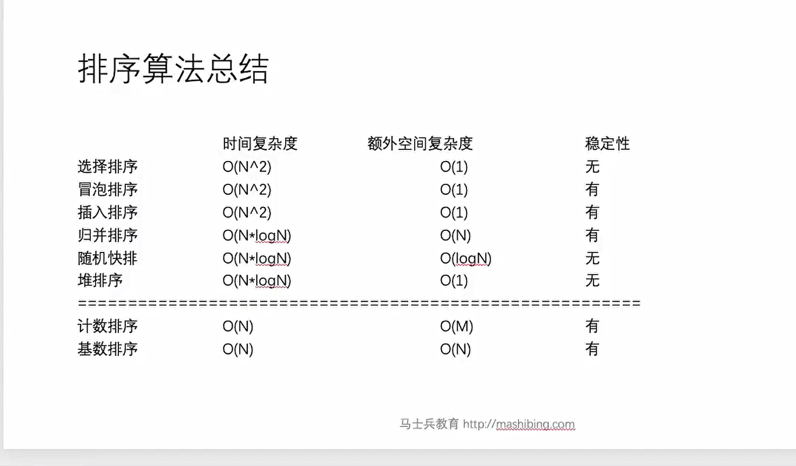
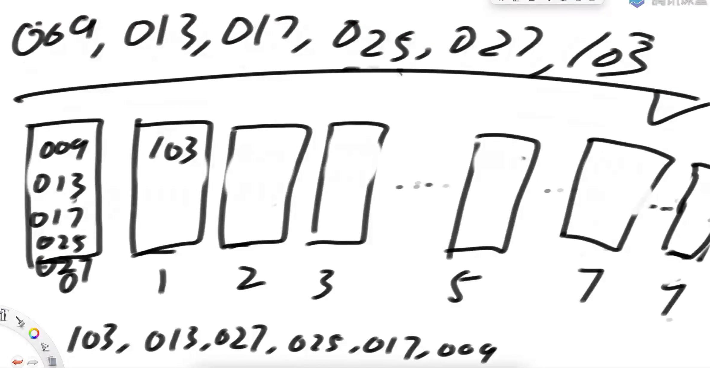
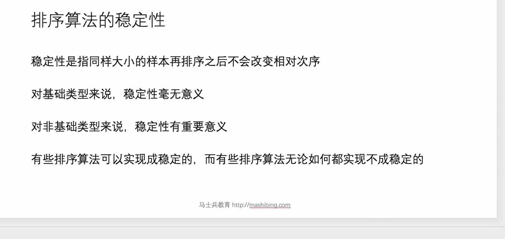

排序算法复杂度



前缀树

其实就是一个树

其中树的边为字符，节点为字符串经过的节点

```java
package class08;

import java.util.HashMap;
import java.util.Random;

public class code01_TrieTree {


    public static class Node1{
        private int pass;
        private int end;
        private Node1[] nexts;

        public Node1(){
            pass = 0;
            end = 0;
            nexts = new Node1[26];
        }
    }

    public static class Trie1{
        private Node1 root;

        public Trie1(){
            root = new Node1();
        }

        public void insert(String word){
            if (word == null){
                return;
            }
            char[] chs = word.toCharArray();
            Node1 node = root;
            node.pass++;
            for (int i = 0; i < chs.length; i++){
                int path = chs[i] - 'a';
                if (node.nexts[path] == null){
                    node.nexts[path] = new Node1();
                }
                node = node.nexts[path];
                node.pass++;
            }
            node.end++;
        }
        //出现过几次
        public int search(String word){
            if (word == null){
                return 0;
            }
            char[] chs = word.toCharArray();
            Node1 node = root;
            for (int i = 0; i < chs.length; i++){
                int path = chs[i] - 'a';
                if (node.nexts[path] == null){
                    return 0;
                }
                node = node.nexts[path];
            }
            return node.end;
        }

        public void delete(String word){
            if (search(word) == 0){
                return;
            }

            Node1 node = root;
            char[] chs = word.toCharArray();
            node.pass--;

            for (int i = 0; i < chs.length; i++){
                int path = chs[i] - 'a';
                if (--node.nexts[path].pass == 0){
                    node.nexts[path] = null;
                    return;
                }
                node = node.nexts[path];
            }
            node.end--;
        }

        public int prefixNumber(String word){

            Node1 node = root;
            char[] chs = word.toCharArray();
            for (int i = 0; i < chs.length; i++){
                int path = chs[i] - 'a';
                if (node.nexts[path] == null){
                    return 0;
                }
                node = node.nexts[path];
            }
            return node.pass;
        }
    }

    public static class Node2{
        private int pass;
        private int end;
        private HashMap<Integer, Node2> nexts;

        public Node2(){
            pass = 0;
            end = 0;
            nexts = new HashMap<>();
        }

    }

    public static class Trie2{
        private Node2 root;

        public Trie2(){
            root = new Node2();
        }


        public void insert(String word){
            if (word == null){
                return;
            }
            char[] chs = word.toCharArray();
            Node2 node = root;
            node.pass++;
            for (int i = 0; i < chs.length; i++){
                int path = chs[i] - 'a';
                if (node.nexts.get(path) == null){
                    node.nexts.put(path, new Node2());
                }
                node = node.nexts.get(path);
                node.pass++;
            }
            node.end++;
        }
        //出现过几次
        public int search(String word){
            if (word == null){
                return 0;
            }
            char[] chs = word.toCharArray();
            Node2 node = root;
            for (int i = 0; i < chs.length; i++){
                int path = chs[i] - 'a';
                if (node.nexts.get(path) == null){
                    return 0;
                }
                node = node.nexts.get(path);
            }
            return node.end;
        }

        public void delete(String word){
            if (search(word) == 0){
                return;
            }

            Node2 node = root;
            char[] chs = word.toCharArray();
            node.pass--;

            for (int i = 0; i < chs.length; i++){
                int path = chs[i];
                if (--node.nexts.get(path).pass == 0){
                    node.nexts.remove(path);
                    return;
                }
                node = node.nexts.get(path);
            }
            node.end--;
        }

        public int prefixNumber(String word){

            Node2 node = root;
            char[] chs = word.toCharArray();
            for (int i = 0; i < chs.length; i++){
                int path = chs[i] - 'a';
                if (node.nexts.get(path) == null){
                    return 0;
                }
                node = node.nexts.get(path);
            }
            return node.pass;
        }
    }

    public static class testTrimTree{
        private HashMap<String, Integer> map;

        public testTrimTree(){
            map = new HashMap<>();
        }

        public void insert(String word){
            if (!map.containsKey(word)){
                map.put(word, 1);
                return;
            }
            map.put(word, map.get(word) + 1);
        }

        public void delete(String word){
           if (map.containsKey(word)){
               if (map.get(word) == 1){
                   map.remove(word);
               }else{
                   map.put(word, map.get(word) - 1);
               }
           }
        }

        public int search(String word){
            if (map.containsKey(word)){
                return map.get(word);
            }else{
                return 0;
            }
        }

        public int prefixNumber(String word){
            int count = 0;
            for (String cur : map.keySet()){
                if (cur.startsWith(word)){
                    count++;
                }
            }
            return count;
        }
    }


    public static String[] generateRandomWordsArray(int nums, int size){
        Random random = new Random();
        int wordNums = random.nextInt(nums + 1);
        String[] arr = new String[wordNums];
        for (int i = 0; i < arr.length; i++){
            int len = random.nextInt(size + 1);
            char[] chs = new char[len];
            for (int j = 0; j < len; j++){
                chs[j] = (char)(random.nextInt(26) + 'a');
            }
            arr[i] = new String(chs);
        }
        return arr;

    }

    public static void main(String[] args) {
        int testTimes = 5000;
        int wordSize = 10;
        int wordNums = 100;

        for (int i = 0; i < testTimes; i++){
            String[] arr = generateRandomWordsArray(wordNums, wordSize);
            for (int j = 0; j < arr.length; j++){
                Trie1 trie1 = new Trie1();
                Trie2 trie2 = new Trie2();
                testTrimTree testTrimTree = new testTrimTree();
                Random random = new Random();
                double v = random.nextDouble();
                if (v < 0.25){
                    trie1.insert(arr[j]);
                    trie2.insert(arr[j]);
                    testTrimTree.insert(arr[j]);
                }else if (v < 0.5){
                    trie1.delete(arr[j]);
                    trie2.delete(arr[j]);
                    testTrimTree.delete(arr[j]);
                }else if (v < 0.75){
                    int ans1 = trie1.search(arr[j]);
                    int ans2 = trie2.search(arr[j]);
                    int testAns = testTrimTree.search(arr[j]);
                    if (testAns != ans1 || testAns != ans2){
                        System.out.println("oops");
                        return;
                    }
                }else{
                    int ans1 = trie1.prefixNumber(arr[j]);
                    int ans2 = trie2.prefixNumber(arr[j]);
                    int testAns = testTrimTree.prefixNumber(arr[j]);
                    if (testAns != ans1 || testAns != ans2){
                        System.out.println("oops");
                        return;
                    }
                }
            }
        }
    }
}

```

基数排序  时间复杂度为o（n*logn）

也叫桶排序

每次桶排序的时候 ，倒出来的时候都是按照数组原顺序到出来



基本思路

设置一个count数组用来表示某个数n的某位数为i时，其对应的count[i]中有num个数，num代表数n第i位的数在桶排序中其之前有num个数

所以数n在help数组中的位置为count[j] - 1;

基数排序代码实现

```java
package class08;

import java.util.Arrays;
import java.util.Random;

public class code02_radixSort {


    public static void radix_sort(int[] arr){
        if (arr == null || arr.length < 2){
            return;
        }
        operate(arr, 0, arr.length - 1);
    }

    public static void operate(int[] arr, int L, int R){
        int minNum = getMinArray(arr, L, R);

        if (minNum < 0){
            for (int i = 0; i < arr.length; i++){
                arr[i] += Math.abs(minNum);
            }
        }

        //具体操作

        int[] help = new int[R - L + 1];
        int digit = getMaxDigit(arr, L, R);
        int radix = 10;
        for (int d = 1; d <= digit; d++){

            int[] count = new int[radix];
            for (int i = L; i <= R; i++){
                int index = getIndexDigit(arr[i], d);
                count[index]++;
            }

            for (int i = 1; i < radix; i++){
                count[i] = count[i] + count[i - 1];
            }

            for (int i = R; i >= L; i--){
                 int index = getIndexDigit(arr[i], d);
                 help[count[index] - 1] = arr[i];
                 count[index]--;
            }

            for (int i = L; i <= R; i++){
                arr[i] = help[i - L];
            }
        }
        //..

        if (minNum < 0){
            for (int i = 0; i < arr.length; i++){
                arr[i] -= Math.abs(minNum);
            }
        }

    }

    public static int getMinArray(int[] arr, int L, int R){
        int min = Integer.MAX_VALUE;
        for (int i = L; i <= R; i++){
            min = Math.min(arr[i], min);
        }
        return min;
    }

    public static int getMaxDigit(int[] arr, int L, int R){
        int max = Integer.MIN_VALUE;
        for (int i = L; i <= R; i++){
            max = Math.max(arr[i], max);
        }
        int count = 0;
        if (max == 0){
            return 1;
        }else{
            while(max != 0){
                max /= 10;
                count++;
            }
        }

        return count;
    }

    public static int getIndexDigit(int num, int d){
        return (num / (int)Math.pow(10, d - 1) ) % 10;
    }

    private static int[] generateRandomArray(int maxLen, int maxValue) {
        Random random = new Random();
        int len = random.nextInt(maxLen + 1);
        if (len == 0) {
            return null;
        }
        int[] arr = new int[len];
        for (int i = 0; i < len; i++) {
            int num = random.nextInt(maxValue * 2 + 1) - maxValue;
            arr[i] = num;
        }
        return arr;
    }

    private static int[] copyArray(int[] arr) {
        if (arr == null) {
            return null;
        }
        int[] list = new int[arr.length];
        for (int i = 0; i < arr.length; i++) {
            list[i] = arr[i];
        }
        return list;
    }

    public static boolean test(int[] arr1, int[] arr2){
        for (int i = 0 ; i < arr1.length; i++){
            if (arr1[i] != arr2[i]){
                return false;
            }
        }
        return true;
    }


    public static void main(String[] args) {
        int testTimes = 5000;
        int maxValue = 10;
        int maxLen = 10;
        for (int i = 0 ; i < testTimes; i++){
            int[] arr = generateRandomArray(maxLen, maxValue);
            int[] copy = copyArray(arr);

            if (arr == null){
                continue;
            }

            radix_sort(arr);
            Arrays.sort(copy);

            if (!test(arr, copy)){
                System.out.println("oops!");
                break;
            }

        }
    }
}

```

排序的稳定性

