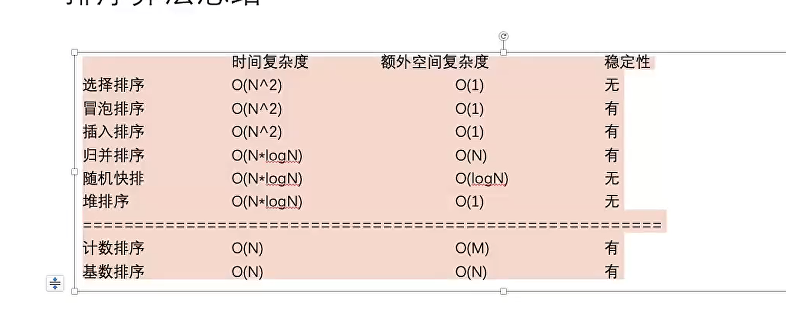
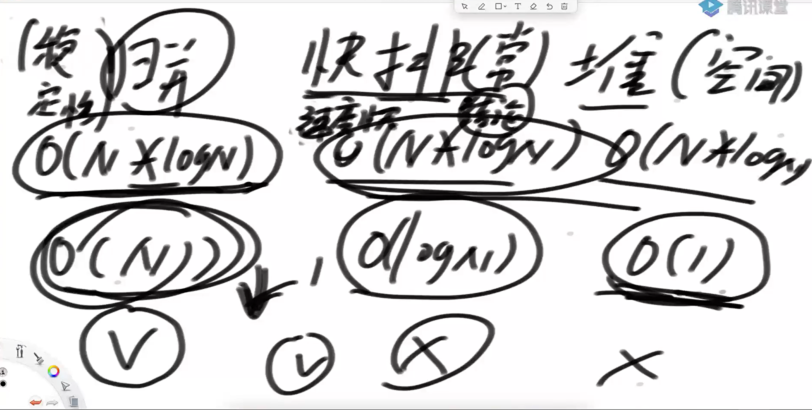
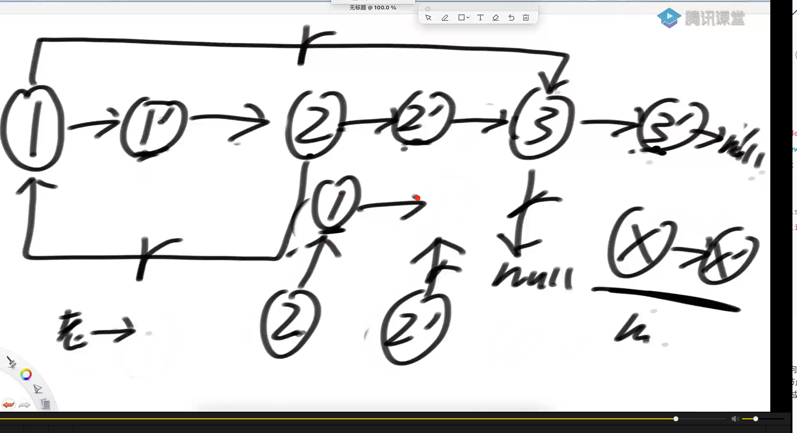
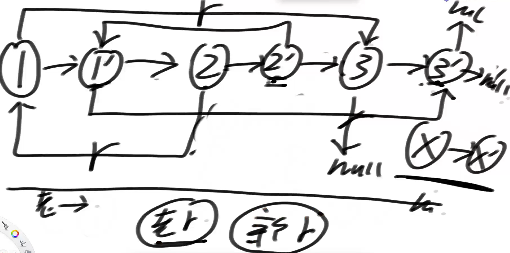

算法适用场景



快慢指针

1 输入链表头节点，奇数长度返回中点，偶数长度返回上中点

2 输入链表头节点，奇数长度返回中点，偶数长度返回下中点

3 输入链表头节点，奇数长度返回中点前一个，偶数长度返回上中点前一个

4 输入链表头节点，奇数长度返回中点前一个，偶数长度返回下中点前一个

```java
package class09;

public class LinklistMid {
//    1 输入链表头节点，奇数长度返回中点，偶数长度返回上中点
//    2 输入链表头节点，奇数长度返回中点，偶数长度返回下中点
//    3 输入链表头节点，奇数长度返回中点前一个，偶数长度返回上中点前一个
//    4 输入链表头节点，奇数长度返回中点前一个，偶数长度返回下中点前一个


    public static class Node{
        public int value;
        public Node next;


        public Node(int v){
            this.value = v;
            this.next = null;
        }
    }


//    奇数长度返回中点，偶数长度返回前中点
    public static Node findMidOrUpperMid(Node head){
        if (head == null){
            return null;
        }
        Node cur = head;
        Node doubleCur = head;
        //只有1个节点的时候
        if (cur != null && cur.next == null){
            return head;
        }
        //只有2个节点的时候
        if (cur != null && cur.next != null && cur.next.next == null){
            return head;
        }
        //至少有3个节点
        while(doubleCur.next != null && doubleCur.next.next != null){
            doubleCur = doubleCur.next.next;
            cur = cur.next;
        }

        return cur;
    }

//    奇数长度返回中点，偶数长度返回后中点
    public static Node findMidOrLowerMid(Node head){
        if (head == null){
            return null;
        }
        Node cur = head;
        Node doubleCur = head;
        int count = 0;
        //只有1个节点的时候
        if (cur != null && cur.next == null){
            return head;
        }
        //只有2个节点的时候
        if (cur != null && cur.next != null && cur.next.next == null){
            return cur.next;
        }
        //至少有3个节点

        Node c = head;
        while(c != null){
            count++;
            c = c.next;
        }
        while(doubleCur.next != null && doubleCur.next.next != null){
            doubleCur = doubleCur.next.next;
            cur = cur.next;
        }

        return count % 2 == 1 ? cur : cur.next;
    }
//    奇数长度返回中点前一个，偶数长度返回前中点前一个
    public static Node findPrevMidOrPrevUpperMid(Node head){
        if (head == null){
            return null;
        }

        Node cur = head;
        Node doubleCur = head;
        Node pre = null;
        int count = 0;
        //只有1个节点
        if (cur != null && cur.next == null){
            return null;
        }
        //只有2个节点
        if (cur != null && cur.next != null && cur.next.next == null){
            return null;
        }
        //至少有3个节点
//        Node c = head;
//        while(c != null){
//            count++;
//            c = c.next;
//        }
        while(doubleCur.next != null && doubleCur.next.next != null){
            doubleCur = doubleCur.next.next;
            pre = cur;
            cur = cur.next;
        }

        return pre;
    }
//    奇数长度返回中点前一个，偶数长度返回后中点前一个
    public static Node findPrevMidOrPrevLowerMid(Node head){
        if (head == null){
            return null;
        }

        Node cur = head;
        Node doubleCur = head;
        Node pre = null;
        int count = 0;
        //只有1个节点
        if (cur != null && cur.next == null){
            return null;
        }
        //只有2个节点
        if (cur != null && cur.next != null && cur.next.next == null){
            return cur;
        }
        //至少有3个节点
        Node c = head;
        while(c != null){
            count++;
            c = c.next;
        }

        while(doubleCur.next != null && doubleCur.next.next != null){
            doubleCur = doubleCur.next.next;
            pre = cur;
            cur = cur.next;
        }

        return count % 2 == 1 ? pre : cur;
    }


    public static void main(String[] args) {


        Node test = null;
        test = new Node(0);
        test.next = new Node(1);
        test.next.next = new Node(2);
        test.next.next.next = new Node(3);
        test.next.next.next.next = new Node(4);
        test.next.next.next.next.next = new Node(5);
        test.next.next.next.next.next.next = new Node(6);
        test.next.next.next.next.next.next.next = new Node(7);
//        test.next.next.next.next.next.next.next.next = new Node(8);
        //3 4 2 2
        System.out.println(findMidOrUpperMid(test).value);
        System.out.println(findMidOrLowerMid(test).value);
        System.out.println(findPrevMidOrPrevUpperMid(test).value);
        System.out.println(findPrevMidOrPrevLowerMid(test).value);

    }

}

```

采用快慢指针方法

```java
package class09;

import java.util.ArrayList;

public class Code01_LinkedListMid {

	public static class Node {
		public int value;
		public Node next;

		public Node(int v) {
			value = v;
		}
	}

	// head 头
	public static Node midOrUpMidNode(Node head) {
		if (head == null || head.next == null || head.next.next == null) {
			return head;
		}
		// 链表有3个点或以上
		Node slow = head.next;
		Node fast = head.next.next;
		while (fast.next != null && fast.next.next != null) {
			slow = slow.next;
			fast = fast.next.next;
		}
		return slow;
	}

	public static Node midOrDownMidNode(Node head) {
		if (head == null || head.next == null) {
			return head;
		}
		Node slow = head.next;
		Node fast = head.next;
		while (fast.next != null && fast.next.next != null) {
			slow = slow.next;
			fast = fast.next.next;
		}
		return slow;
	}

	public static Node midOrUpMidPreNode(Node head) {
		if (head == null || head.next == null || head.next.next == null) {
			return null;
		}
		Node slow = head;
		Node fast = head.next.next;
		while (fast.next != null && fast.next.next != null) {
			slow = slow.next;
			fast = fast.next.next;
		}
		return slow;
	}

	public static Node midOrDownMidPreNode(Node head) {
		if (head == null || head.next == null) {
			return null;
		}
		if (head.next.next == null) {
			return head;
		}
		Node slow = head;
		Node fast = head.next;
		while (fast.next != null && fast.next.next != null) {
			slow = slow.next;
			fast = fast.next.next;
		}
		return slow;
	}

	public static Node right1(Node head) {
		if (head == null) {
			return null;
		}
		Node cur = head;
		ArrayList<Node> arr = new ArrayList<>();
		while (cur != null) {
			arr.add(cur);
			cur = cur.next;
		}
		return arr.get((arr.size() - 1) / 2);
	}

	public static Node right2(Node head) {
		if (head == null) {
			return null;
		}
		Node cur = head;
		ArrayList<Node> arr = new ArrayList<>();
		while (cur != null) {
			arr.add(cur);
			cur = cur.next;
		}
		return arr.get(arr.size() / 2);
	}

	public static Node right3(Node head) {
		if (head == null || head.next == null || head.next.next == null) {
			return null;
		}
		Node cur = head;
		ArrayList<Node> arr = new ArrayList<>();
		while (cur != null) {
			arr.add(cur);
			cur = cur.next;
		}
		return arr.get((arr.size() - 3) / 2);
	}

	public static Node right4(Node head) {
		if (head == null || head.next == null) {
			return null;
		}
		Node cur = head;
		ArrayList<Node> arr = new ArrayList<>();
		while (cur != null) {
			arr.add(cur);
			cur = cur.next;
		}
		return arr.get((arr.size() - 2) / 2);
	}

	public static void main(String[] args) {
		Node test = null;
		test = new Node(0);
		test.next = new Node(1);
		test.next.next = new Node(2);
		test.next.next.next = new Node(3);
		test.next.next.next.next = new Node(4);
		test.next.next.next.next.next = new Node(5);
		test.next.next.next.next.next.next = new Node(6);
		test.next.next.next.next.next.next.next = new Node(7);
		test.next.next.next.next.next.next.next.next = new Node(8);

		Node ans1 = null;
		Node ans2 = null;

		ans1 = midOrUpMidNode(test);
		ans2 = right1(test);
		System.out.println(ans1 != null ? ans1.value : "无");
		System.out.println(ans2 != null ? ans2.value : "无");

		ans1 = midOrDownMidNode(test);
		ans2 = right2(test);
		System.out.println(ans1 != null ? ans1.value : "无");
		System.out.println(ans2 != null ? ans2.value : "无");

		ans1 = midOrUpMidPreNode(test);
		ans2 = right3(test);
		System.out.println(ans1 != null ? ans1.value : "无");
		System.out.println(ans2 != null ? ans2.value : "无");

		ans1 = midOrDownMidPreNode(test);
		ans2 = right4(test);
		System.out.println(ans1 != null ? ans1.value : "无");
		System.out.println(ans2 != null ? ans2.value : "无");

	}

}

```

给定一个单链表的头节点head，请判断该链表是否为回文结构

1 哈希表方法（笔试用)

2 该原链表的方法就需要注意边界了（面试用）

实现逻辑

```java
package class09;

import java.util.LinkedList;
import java.util.Objects;
import java.util.Stack;

public class code02_isPalindromeList {


    public static final LinkedList<Object> OBJECTS = new LinkedList<>();

    public static class Node{
        private int value;
        private Node next;

        public Node(int data){
            this.value = data;
        }
    }


    public static boolean isPalindromeLinkList(Node head){
        //无节点或只有一个节点
        if (head == null || (head != null && head.next == null)){
            return true;
        }
        //只有两个节点
        if (head != null && head.next != null && head.next.next == null){
            if (Objects.equals(head.value, head.next.value)){
                return true;
            }else{
                return false;
            }
        }
        //有3个或3个以上节点
        Node cur = head;
        Node doubleCur = head;
        while(doubleCur.next != null && doubleCur.next.next != null){
            doubleCur = doubleCur.next.next;
            cur = cur.next;
        }

        //如果是奇数链表cur是中间点，如果是偶数链表cur是前节点
        //将链表部分逆转
        Node end = reverseLinklist(cur);

        Node start = head;

        while(start != null && end != null){
            if (!Objects.equals(start.value, end.value)){
                return false;
            }
            start = start.next;
            end = end.next;
        }
        return true;
    }


    public static Node reverseLinklist(Node head){
        Node pre = null;
        Node next = null;
        Node cur = head;
        while (cur != null){
            next = cur.next;
            cur.next = pre;
            pre = cur;
            cur = next;
        }

        return pre;
    }

    public static boolean isPalindromeLinkListByStack(Node head){
        if (head == null){
            return true;
        }
        Stack<Node> stack = new Stack<>();
        Node cur = head;
        while(cur != null){
            stack.push(cur);
            cur = cur.next;
        }
        cur = head;
        while (cur != null){
            if (!Objects.equals(cur.value, stack.pop().value)){
                return false;
            }
            cur = cur.next;
        }
        return true;
    }


    public static void main(String[] args) {
        Node head = new Node(1);
        head.next = new Node(2);
        head.next.next = new Node(3);


        Node s = new Node(1);
        s.next = new Node(2);
        s.next.next = new Node(3);


        System.out.println(isPalindromeLinkList(head));
        System.out.println(isPalindromeLinkListByStack(s));
    }
}

```

课程实现的代码

package class09;

import java.util.Stack;

public class Code02_IsPalindromeList {

```java
package class09;
import java.util.Stack;
public class Code02_IsPalindromeList {
    

        public static class Node {
        	public int value;
        	public Node next;
        
        	public Node(int data) {
        		this.value = data;
        	}
        }
        
        // need n extra space
        public static boolean isPalindrome1(Node head) {
        	Stack<Node> stack = new Stack<Node>();
        	Node cur = head;
        	while (cur != null) {
        		stack.push(cur);
        		cur = cur.next;
        	}
        	while (head != null) {
        		if (head.value != stack.pop().value) {
        			return false;
        		}
        		head = head.next;
        	}
        	return true;
        }
        
        // need n/2 extra space
        public static boolean isPalindrome2(Node head) {
        	if (head == null || head.next == null) {
        		return true;
        	}
        	Node right = head.next;
        	Node cur = head;
        	while (cur.next != null && cur.next.next != null) {
        		right = right.next;
        		cur = cur.next.next;
        	}
        	Stack<Node> stack = new Stack<Node>();
        	while (right != null) {
        		stack.push(right);
        		right = right.next;
        	}
        	while (!stack.isEmpty()) {
        		if (head.value != stack.pop().value) {
        			return false;
        		}
        		head = head.next;
        	}
        	return true;
        }
        
        // need O(1) extra space
        public static boolean isPalindrome3(Node head) {
        	if (head == null || head.next == null) {
        		return true;
        	}
        	Node n1 = head;
        	Node n2 = head;
        	while (n2.next != null && n2.next.next != null) { // find mid node
        		n1 = n1.next; // n1 -> mid
        		n2 = n2.next.next; // n2 -> end
        	}
        	// n1 中点
        	
        	
        	n2 = n1.next; // n2 -> right part first node
        	n1.next = null; // mid.next -> null
        	Node n3 = null;
        	while (n2 != null) { // right part convert
        		n3 = n2.next; // n3 -> save next node
        		n2.next = n1; // next of right node convert
        		n1 = n2; // n1 move
        		n2 = n3; // n2 move
        	}
        	n3 = n1; // n3 -> save last node
        	n2 = head;// n2 -> left first node
        	boolean res = true;
        	while (n1 != null && n2 != null) { // check palindrome
        		if (n1.value != n2.value) {
        			res = false;
        			break;
        		}
        		n1 = n1.next; // left to mid
        		n2 = n2.next; // right to mid
        	}
        	n1 = n3.next;
        	n3.next = null;
        	while (n1 != null) { // recover list
        		n2 = n1.next;
        		n1.next = n3;
        		n3 = n1;
        		n1 = n2;
        	}
        	return res;
        }
        
        public static void printLinkedList(Node node) {
        	System.out.print("Linked List: ");
        	while (node != null) {
        		System.out.print(node.value + " ");
        		node = node.next;
        	}
        	System.out.println();
        }
        
        public static void main(String[] args) {
        
        	Node head = null;
        	printLinkedList(head);
        	System.out.print(isPalindrome1(head) + " | ");
        	System.out.print(isPalindrome2(head) + " | ");
        	System.out.println(isPalindrome3(head) + " | ");
        	printLinkedList(head);
        	System.out.println("=========================");
        
        	head = new Node(1);
        	printLinkedList(head);
        	System.out.print(isPalindrome1(head) + " | ");
        	System.out.print(isPalindrome2(head) + " | ");
        	System.out.println(isPalindrome3(head) + " | ");
        	printLinkedList(head);
        	System.out.println("=========================");
        
        	head = new Node(1);
        	head.next = new Node(2);
        	printLinkedList(head);
        	System.out.print(isPalindrome1(head) + " | ");
        	System.out.print(isPalindrome2(head) + " | ");
        	System.out.println(isPalindrome3(head) + " | ");
        	printLinkedList(head);
        	System.out.println("=========================");
        
        	head = new Node(1);
        	head.next = new Node(1);
        	printLinkedList(head);
        	System.out.print(isPalindrome1(head) + " | ");
        	System.out.print(isPalindrome2(head) + " | ");
        	System.out.println(isPalindrome3(head) + " | ");
        	printLinkedList(head);
        	System.out.println("=========================");
        
        	head = new Node(1);
        	head.next = new Node(2);
        	head.next.next = new Node(3);
        	printLinkedList(head);
        	System.out.print(isPalindrome1(head) + " | ");
        	System.out.print(isPalindrome2(head) + " | ");
        	System.out.println(isPalindrome3(head) + " | ");
        	printLinkedList(head);
        	System.out.println("=========================");
        
        	head = new Node(1);
        	head.next = new Node(2);
        	head.next.next = new Node(1);
        	printLinkedList(head);
        	System.out.print(isPalindrome1(head) + " | ");
        	System.out.print(isPalindrome2(head) + " | ");
        	System.out.println(isPalindrome3(head) + " | ");
        	printLinkedList(head);
        	System.out.println("=========================");
        
        	head = new Node(1);
        	head.next = new Node(2);
        	head.next.next = new Node(3);
        	head.next.next.next = new Node(1);
        	printLinkedList(head);
        	System.out.print(isPalindrome1(head) + " | ");
        	System.out.print(isPalindrome2(head) + " | ");
        	System.out.println(isPalindrome3(head) + " | ");
        	printLinkedList(head);
        	System.out.println("=========================");
        
        	head = new Node(1);
        	head.next = new Node(2);
        	head.next.next = new Node(2);
        	head.next.next.next = new Node(1);
        	printLinkedList(head);
        	System.out.print(isPalindrome1(head) + " | ");
        	System.out.print(isPalindrome2(head) + " | ");
        	System.out.println(isPalindrome3(head) + " | ");
        	printLinkedList(head);
        	System.out.println("=========================");
        
        	head = new Node(1);
        	head.next = new Node(2);
        	head.next.next = new Node(3);
        	head.next.next.next = new Node(2);
        	head.next.next.next.next = new Node(1);
        	printLinkedList(head);
        	System.out.print(isPalindrome1(head) + " | ");
        	System.out.print(isPalindrome2(head) + " | ");
        	System.out.println(isPalindrome3(head) + " | ");
        	printLinkedList(head);
        	System.out.println("=========================");
        
        }

}
```

将单向链表按某值划分为左边小、中间相等、右边大的形式

1 把链表放入数组中，在数组中左partition（笔试）

2 分成小、中、大三部分，再把各个部分之间串起来。

```java
package class09;

public class code03_smallEqualBigger {

    public static class Node{
        public int value;
        public Node next;


        public Node(int data){
            this.value = data;
        }

        public Node(){
            value = 0;
            next = null;
        }
    }


    public static Node getSmallEqualBiggerLinkList(Node head, int v){
        Node sH = null;
        Node sT = null;
        Node eH = null;
        Node eT = null;
        Node bH = null;
        Node bT = null;
        Node next = null;
        while(head != null){
            next = head.next;
            head.next = null;
            if (head.value < v){
                if (sH == null){
                    sH = head;
                    sT = head;
                }else{
                    sT.next = head;
                    sT = head;
                }
            }else if (head.value == v){
                if (eH == null){
                    eH = head;
                    eT = head;
                }else{
                    eT.next = head;
                    eT = head;
                }
            }else if (head.value > v){
                if (bH == null){
                    bH = head;
                    bT = head;
                }else{
                    bT.next = head;
                    bT = head;
                }
            }
            head = next;
        }

        //如果有小于区域
        if (sT != null){
            sT.next = eH;
            eT = eT == null ? sT : eT;
        }

        //有等于区域eT接bH
        //无等于区域eT就为sT;
        if (eT != null){
            eT.next = bH;
        }

        return sH != null ? sH : (eH != null ? eH : bH);

    }


    public static Node getgetSmallEqualBiggerLinkListByArray(Node head, int v){
        if (head == null){
            return head;
        }
        int i = 0;
        Node cur = head;
        while(cur != null){
            i++;
            cur = cur.next;
        }
        Node[] arr = new Node[i];
        cur = head;
        for (i = 0; i < arr.length; i++){
            arr[i] = cur;
            cur = cur.next;
        }
        arrPartition(arr, v);
        for (i = 1; i < arr.length; i++){
            arr[i-1].next = arr[i];
        }
        arr[arr.length - 1].next = null;
        return arr[0];
    }

    public static void arrPartition(Node[] arr, int v){
        int small = -1;
        int bigger = arr.length;
        int index = 0;
        while (index < bigger){
            if (arr[index].value < v){
                swap(arr, small+1, index);
                small++;
                index++;
            }else if (arr[index].value == v){
                index++;
            }else if (arr[index].value > v){
                swap(arr, index, bigger-1);
                bigger--;
            }
        }
    }

    public static void swap(Node[] arr, int i, int j){
        Node temp = arr[i];
        arr[i] = arr[j];
        arr[j] = temp;
    }


    public static void printLinkedList(Node node) {
        System.out.print("Linked List: ");
        while (node != null) {
            System.out.print(node.value + " ");
            node = node.next;
        }
        System.out.println();
    }

    public static void main(String[] args) {
        Node head1 = new Node(7);
        head1.next = new Node(9);
        head1.next.next = new Node(1);
        head1.next.next.next = new Node(8);
        head1.next.next.next.next = new Node(5);
        head1.next.next.next.next.next = new Node(2);
        head1.next.next.next.next.next.next = new Node(5);

        printLinkedList(head1);
//        head1 = getSmallEqualBiggerLinkList(head1, 5);
        head1 = getgetSmallEqualBiggerLinkListByArray(head1, 5);
        printLinkedList(head1);
    }
}

```

rand指针是单链表节点结构中新增的指针，rand可能指向链表中的任意一个节点，也可能指向null，给定一个由node节点类型组成的无环单链表的头结点head，请实现一个函数完成这个链表的复制，并返回复制的新链表的头节点

不需要辅助空间的方法



其实就是建立一个旧节点和新节点之间的映射



代码实现如下

```java
package class09;

import java.util.HashMap;

public class code04_copyListWithRandom {


    public static class Node{
        public int value;
        public Node next;
        public Node random;

        public Node(int data){
            this.value = data;
        }
    }


    public static Node getCopyListWithRandomByMap(Node head){
        if (head == null){
            return head;
        }
        HashMap<Node, Node> map = new HashMap<>();
        Node cur = head;
        while(cur != null){
            map.put(cur, new Node(cur.value));
            cur = cur.next;
        }

        cur = head;
        while(cur != null){
            map.get(cur).next = map.get(cur.next);
            map.get(cur).random = map.get(cur.random);
            cur = cur.next;
        }

        return map.get(head);
    }

    public static Node getgetCopyListWithRandomNoBy(Node head){
        if (head == null){
            return head;
        }

        Node cur = head;
        Node next = null;
        //新旧链接
        while(cur != null){
            next = cur.next;
            cur.next = new Node(cur.value);
            cur.next.next = next;
            cur = next;
        }
        //random部分对应链接
        Node copyNode;
        cur = head;
        while(cur != null){
            copyNode = cur.next;
            copyNode.random = cur.random != null ? cur.random.next : null;
            cur = cur.next.next;
        }
        //分开
        cur = head;
        copyNode = null;
        next = null;
        Node res = head.next;
        while(cur != null){
            next = cur.next.next;
            copyNode = cur.next;
            cur.next = next;
            copyNode.next = next != null ? next.next : null;
            cur = next;
        }

        return res;
    }

    public static void printRandLinkedList(Node head) {
        Node cur = head;
        System.out.print("order: ");
        while (cur != null) {
            System.out.print(cur.value + " ");
            cur = cur.next;
        }
        System.out.println();
        cur = head;
        System.out.print("rand:  ");
        while (cur != null) {
            System.out.print(cur.random == null ? "- " : cur.random.value + " ");
            cur = cur.next;
        }
        System.out.println();
    }


    public static void main(String[] args) {
        Node head = null;
        Node res1 = null;
        Node res2 = null;


        head = new Node(1);
        head.next = new Node(2);
        head.next.next = new Node(3);
        head.next.next.next = new Node(4);
        head.next.next.next.next = new Node(5);
        head.next.next.next.next.next = new Node(6);

        head.random = head.next.next.next.next.next; // 1 -> 6
        head.next.random = head.next.next.next.next.next; // 2 -> 6
        head.next.next.random = head.next.next.next.next; // 3 -> 5
        head.next.next.next.random = head.next.next; // 4 -> 3
        head.next.next.next.next.random = null; // 5 -> null
        head.next.next.next.next.next.random = head.next.next.next; // 6 -> 4

        System.out.println("原始链表");
        printRandLinkedList(head);
        System.out.println("=========================");
        res1 = getCopyListWithRandomByMap(head);
        System.out.println("方法一的拷贝链表：");
        printRandLinkedList(res1);
        System.out.println("=========================");
        res2 = getgetCopyListWithRandomNoBy(head);
        System.out.println("方法二的拷贝链表：");
        printRandLinkedList(res2);
        System.out.println("=========================");
        System.out.println("经历方法二拷贝之后的原始链表：");
        printRandLinkedList(head);
        System.out.println("=========================");
    }
}

```