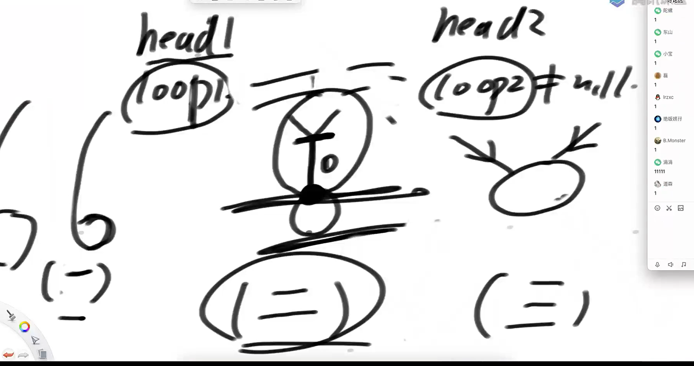
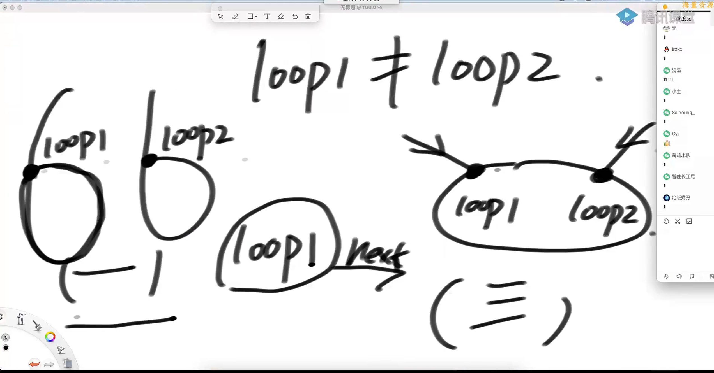
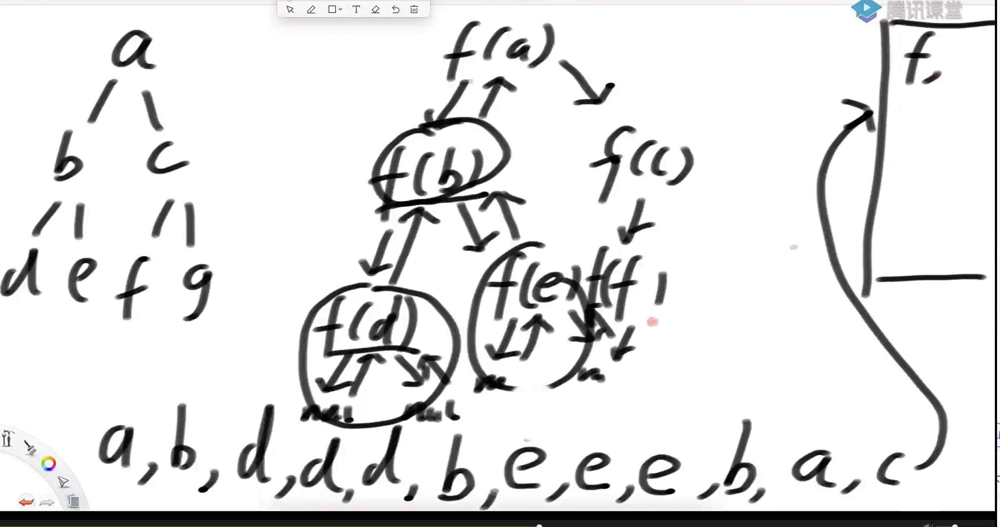
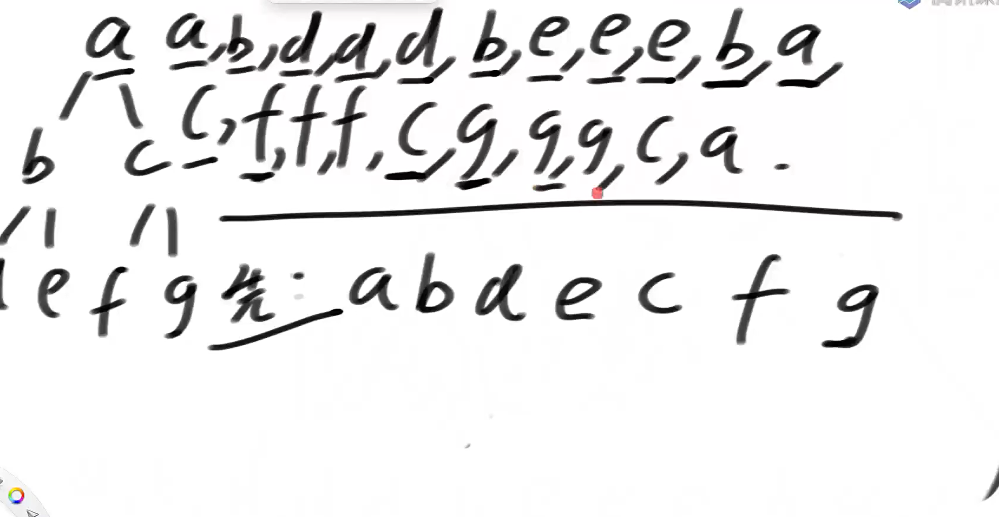
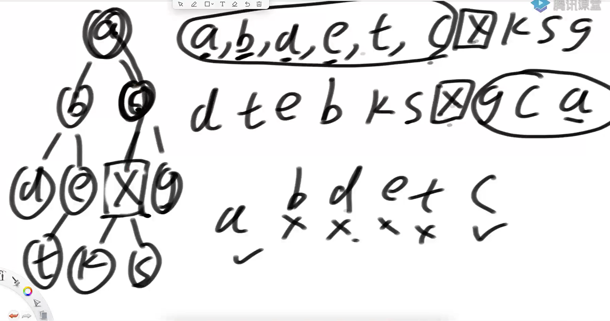
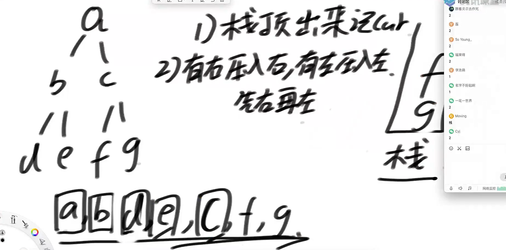
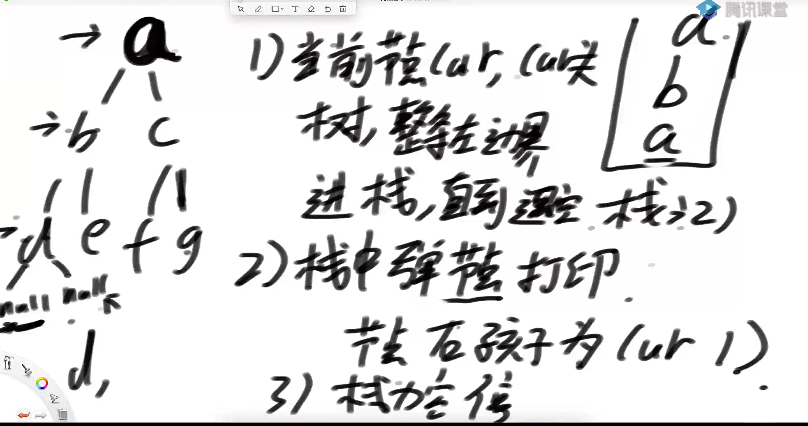

给定两个可能有环也可能无环的单链表，头节点为head1和head2.请实现一个函数，如果两个链表相交，请返回相交的第一个节点。如果不相交，返回null

要求：如果两个链表长度只和为N，时间复杂度请达到o(N)，额外空间复杂度请达到O（1）

 有环的三种情况



如何分辨第一种和第三种情况



代码实现如下

```java
package class010;

import java.util.HashSet;

public class code01_FindFistIntersectNode {

    public static class Node{
        public int value;
        public Node next;

        public Node(int data){
            this.value = data;
        }
    }

    //相交的前提是都无环，或都有环
    public static Node FindFistIntersectNode(Node head1, Node head2){
        if (head1 == null || head2 == null){
            return null;
        }
        Node loop1 = getLoopNode(head1);
        Node loop2 = getLoopNode(head2);

        if (loop1 == null && loop2 == null){
            return noLoop(head1, head2);
        }
        if (loop1 != null && loop2 != null){
            return bothLoop(head1, head2, loop1, loop2);
        }
        return null;
    }
    //得到入环头节点
    public static Node getLoopNode(Node head){
        if (head == null || head.next == null || head.next.next == null){
            return null;
        }
        //快慢指针先走一步
        Node slow = head.next;
        Node fast = head.next.next;
        while(slow != fast){
            //如果有环fast会在环里打转 否则fast会为空
            if (fast.next == null || fast.next.next == null){
                return null;
            }
            slow = slow.next;
            fast = fast.next.next;
        }
        fast = head;
        while(slow != fast){
            fast = fast.next;
            slow = slow.next;
        }
        return slow;
    }

    public static Node getLoopNodeBySet(Node head){
        if (head == null || head.next == null || head.next.next == null){
            return null;
        }
        HashSet<Node> set = new HashSet<>();
        Node cur = head;
        while(cur != null){
            if (set.contains(cur)){
                return cur;
            }
            cur = cur.next;
        }

        return null;

    }


    public static Node noLoop(Node head1, Node head2){
        if (head1 == null || head2 == null){
            return null;
        }

        Node cur1 = head1;
        int n = 0;
        while(cur1.next != null){
            cur1 = cur1.next;
            n++;
        }
        Node cur2 = head2;
        while (cur2.next != null){
            cur2 = cur2.next;
            n--;
        }

        if (cur1 != cur2){
            return null;
        }

        cur1 = n > 0 ? head1 : head2;
        cur2 = cur1 == head1 ? head2 : head1;

        n = Math.abs(n);

        while(n != 0){
            cur1 = cur1.next;
            n--;
        }
        while(cur1 != cur2){
            cur1 = cur1.next;
            cur2 = cur2.next;
        }
        return cur1;
    }

    public static Node bothLoop(Node head1, Node head2, Node loop1, Node loop2){
        if (loop1 == loop2){
            Node cur1 = head1;
            Node cur2 = head2;
            int n = 0;
            while(cur1 != loop1){
                cur1 = cur1.next;
                n++;
            }
            while(cur2 != loop1){
                cur2 = cur2.next;
                n--;
            }
            cur1 = n > 0 ? head1 : head2;
            cur2 = cur1 == head1 ? head2 : head1;
            n = Math.abs(n);
            while(n != 0){
                cur1 = cur1.next;
                n--;
            }
            while(cur1 != cur2){
                cur1 = cur1.next;
                cur2 = cur2.next;
            }
            return cur1;
        }else{
           Node cur = loop1.next;
           while(cur != loop1){
               if (cur == loop2){
                   return loop1;
               }
               cur = cur.next;
           }
           return null;
        }
    }


    public static void main(String[] args) {
        // 1->2->3->4->5->6->7->null
        Node head1 = new Node(1);
        head1.next = new Node(2);
        head1.next.next = new Node(3);
        head1.next.next.next = new Node(4);
        head1.next.next.next.next = new Node(5);
        head1.next.next.next.next.next = new Node(6);
        head1.next.next.next.next.next.next = new Node(7);

        // 0->9->8->6->7->null
        Node head2 = new Node(0);
        head2.next = new Node(9);
        head2.next.next = new Node(8);
        head2.next.next.next = head1.next.next.next.next.next; // 8->6
        System.out.println(FindFistIntersectNode(head1, head2).value);

        // 1->2->3->4->5->6->7->4...
        head1 = new Node(1);
        head1.next = new Node(2);
        head1.next.next = new Node(3);
        head1.next.next.next = new Node(4);
        head1.next.next.next.next = new Node(5);
        head1.next.next.next.next.next = new Node(6);
        head1.next.next.next.next.next.next = new Node(7);
        head1.next.next.next.next.next.next = head1.next.next.next; // 7->4

        // 0->9->8->2...
        head2 = new Node(0);
        head2.next = new Node(9);
        head2.next.next = new Node(8);
        head2.next.next.next = head1.next; // 8->2
        Node node = FindFistIntersectNode(head1, head2);
        System.out.println(node.value);

        // 0->9->8->6->4->5->6..
        head2 = new Node(0);
        head2.next = new Node(9);
        head2.next.next = new Node(8);
        head2.next.next.next = head1.next.next.next.next.next; // 8->6
        System.out.println(FindFistIntersectNode(head1, head2).value);
    }
}

```

二叉树的先序、中序、后序遍历

先序：任何子树的处理顺序都是，先头节点，再左子树，然后右子树

中序：任何子树的处理顺序都是，先左子树，再头节点，然后右子树

后序：任何子树的处理顺序都是，先左子树，再右子树，然后头节点

递归序





树的先中后续遍历

```java
package class10;

public class recursiveTraversalBT {


    public static class Node{
        public int value;
        public Node left;
        public Node right;


        public Node(int v){
            this.value = v;
        }
    }


    public static void pre(Node head){
        if (head == null){
            return;
        }
        System.out.println(head.value);
        pre(head.left);
        pre(head.right);
    }


    public static void in(Node head){
        if (head == null){
            return;
        }

        in(head.left);
        System.out.println(head.value);
        in(head.right);
    }


    public static void pos(Node head){
        if (head == null){
            return;
        }
        pos(head.left);
        pos(head.right);
        System.out.println(head.value);
    }


    public static void main(String[] args) {
        Node head = new Node(1);
        head.left = new Node(2);
        head.right = new Node(3);
        head.left.left = new Node(4);
        head.left.right = new Node(5);
        head.right.left = new Node(6);
        head.right.right = new Node(7);

        pre(head);
        System.out.println("========");
        in(head);
        System.out.println("========");
        pos(head);
        System.out.println("========");

    }
}

```

一个结论



x的先序遍历前的节点集合A和后序遍历后的节点集合B的交集是x的祖先节点的集合

非递归方式实现二叉树的先序、中序、后序遍历

1）任何递归函数都可以改成非递归

2）自己设计压栈来实现

先序遍历非递归实现



非递归中序遍历的逻辑



非递归实现代码

```java
package class10;

import java.util.Stack;

public class code03_UnrecursiveTraversalBT {

    public static class Node{
        public int value;
        public Node left;
        public Node right;


        public Node(int v){
            this.value = v;
        }
    }


    public static void pre(Node head){
        System.out.println("pre-order: ");
        if (head != null){
            Stack<Node> stack = new Stack<Node>();
            stack.add(head);
            //头 左 右
            while(!stack.isEmpty()){
                head = stack.pop();
                System.out.print(head.value + " ");
                if (head.right != null){
                    stack.push(head.right);
                }
                if (head.left != null){
                    stack.push(head.left);
                }
            }
            System.out.println();
        }
    }

    public static void ins(Node cur){
        System.out.println("in-order: ");
        if (cur != null){
            Stack<Node> stack = new Stack<>();
            while (!stack.isEmpty() || cur != null){
                if (cur != null){
                    stack.push(cur);
                    cur = cur.left;
                }else{
                    cur = stack.pop();
                    System.out.print(cur.value + " ");
                    cur = cur.right;
                }
            }
        }
        System.out.println();
    }

    public static void pos(Node head){
        System.out.println("pos-order: ");
        if (head != null){
            Stack<Node> stack1 = new Stack<>();
            Stack<Node> stack2 = new Stack<>();
            stack1.add(head);
            //头 右 左 逆序就是 左 右 头
            while(!stack1.isEmpty()){
                head = stack1.pop();
                stack2.push(head);
                if (head.left != null){
                    stack1.push(head.left);
                }
                if (head.right != null){
                    stack1.push(head.right);
                }
            }
            while(!stack2.isEmpty()){
                System.out.print(stack2.pop().value + " ");
            }
            System.out.println();
        }
    }

    public static void main(String[] args) {
        Node head = new Node(1);
        head.left = new Node(2);
        head.right = new Node(3);
        head.left.left = new Node(4);
        head.left.right = new Node(5);
        head.right.left = new Node(6);
        head.right.right = new Node(7);

        pre(head);
        System.out.println("========");
        ins(head);
        System.out.println("========");
        pos(head);
        System.out.println("========");

    }


}

```