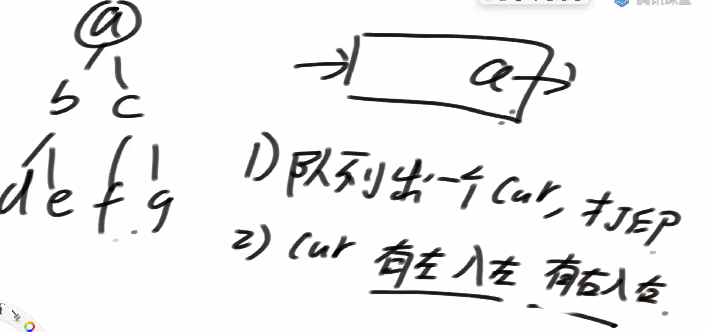
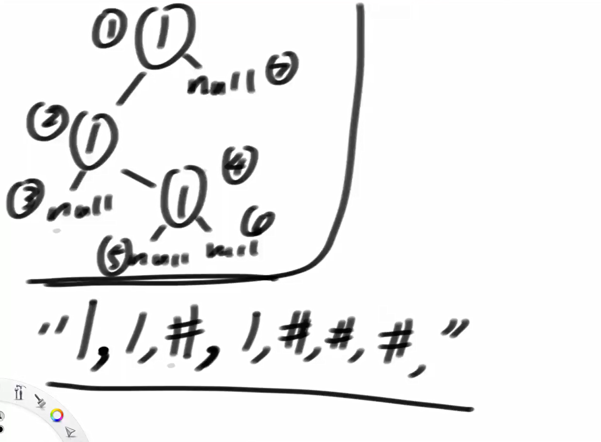
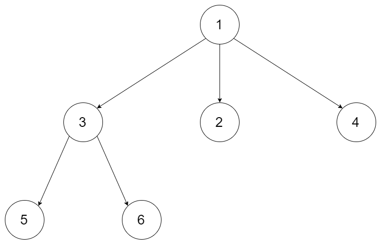
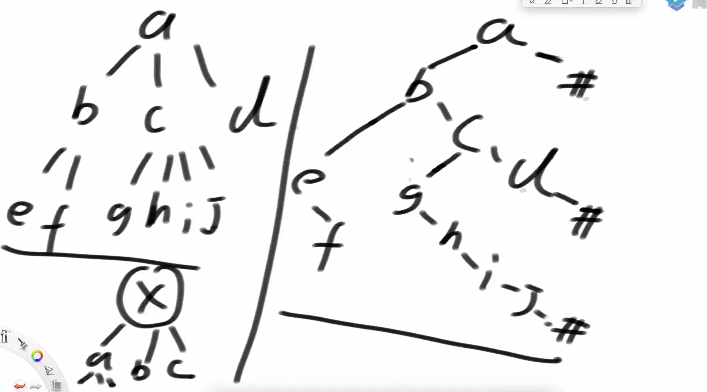
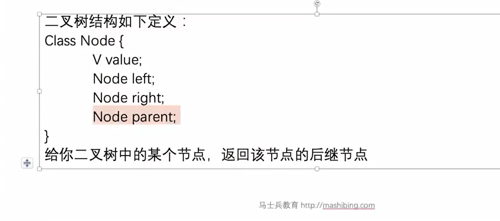
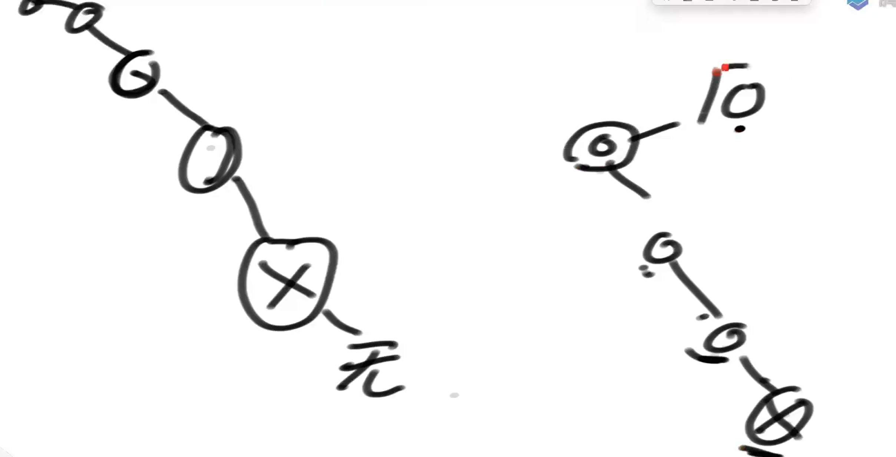
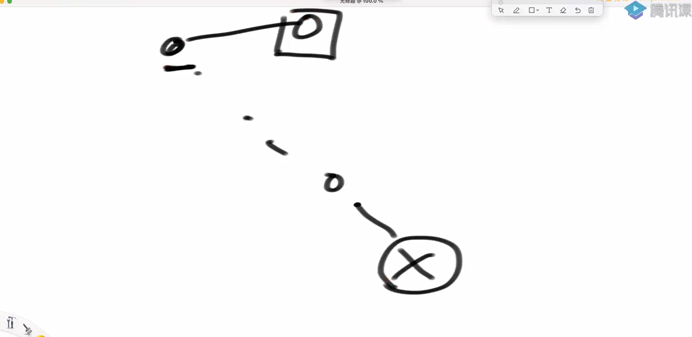
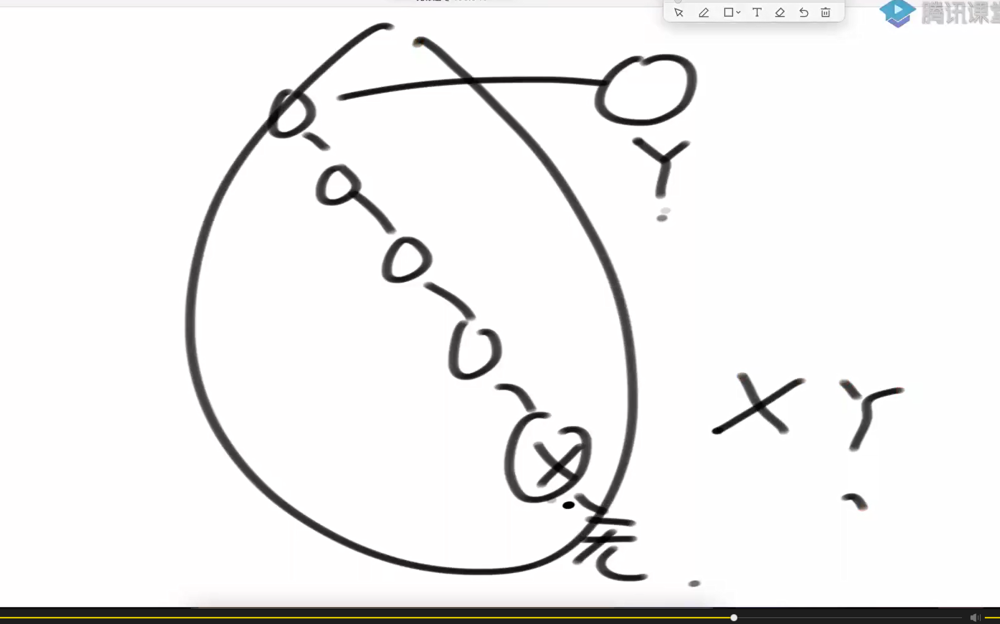

实现二叉树的按层遍历

1 其实就是宽度优先遍历，用队列

2 可以通过设置flag变量的方式，来发现某一层的结束（按题目情况）

层序遍历



代码实现

```java
package class11;

import java.util.LinkedList;
import java.util.Queue;

public class LevelTraversalBT {


    public static class Node{
        public int value;
        public Node left;
        public Node right;

        public Node(int data){
            this.value = data;
        }
    }


    public static void level(Node head){
        if (head == null){
            return;
        }
        Queue<Node> queue = new LinkedList<>();
        queue.add(head);
        while(!queue.isEmpty()){
            Node cur = queue.poll();
            System.out.print(cur.value + " ");
            if(cur.left != null){
                queue.add(cur.left);
            }
            if (cur.right != null){
                queue.add(cur.right);
            }
        }
        System.out.println();
    }

    public static void main(String[] args) {
        Node head = new Node(1);
        head.left = new Node(2);
        head.right = new Node(3);
        head.left.left = new Node(4);
        head.left.right = new Node(5);
        head.right.left = new Node(6);
        head.right.right = new Node(7);

        level(head);
        System.out.println("========");
    }
}

```

实现二叉树的序列化和反序列化

1） 先序方式序列化和反序列化

2）按层方式序列化和反序列化

先序序列化



只有先序和后序序列化

没有中序序列化，中序序列化有歧义

前中后序列化代码实现

```java
package class11;

import java.util.LinkedList;
import java.util.Queue;
import java.util.Random;
import java.util.Stack;

public class code02_SerializeAndReconstructTree {

    public static class Node{
        public int value;
        public Node left;
        public Node right;

        public Node(int value){
            this.value = value;
        }
    }

    public static Queue<String> preSerialize(Node head){
        Queue<String> ans = new LinkedList<>();
        pres(head, ans);
        return ans;
    }

    public static void pres(Node head, Queue<String> ans){
        if (head == null){
            ans.add(null);
            return;
        }
        ans.add(String.valueOf(head.value));
        pres(head.left, ans);
        pres(head.right, ans);
    }


    public static Node buildTreeByPreQueue(Queue<String> preList){
        if (preList == null || preList.size() == 0){
            return null;
        }
        return preb(preList);
    }

    public static Node preb(Queue<String> preList){
        //中 左 右
        String value = preList.poll();
        if (value == null){
            return null;
        }
        Node head = new Node(Integer.valueOf(value));
        head.left = preb(preList);
        head.right = preb(preList);

        return head;
    }

    public static Queue<String> posSerialize(Node head){
        Queue<String> ans = new LinkedList<>();
        pose(head, ans);
        return ans;
    }

    public static void pose(Node head, Queue<String> ans){
        if (head == null){
            ans.add(null);
            return;
        }
        pose(head.left, ans);
        pose(head.right, ans);
        ans.add(String.valueOf(head.value));
    }

    public static Node buildTreeByPoseQueue(Queue<String> posList){
        if (posList == null || posList.size() == 0){
            return null;
        }
        //左右中 逆转 中右左
        Stack<String> stack = new Stack<>();
        while(!posList.isEmpty()){
            stack.push(posList.poll());
        }
        return poseb(stack);
    }

    public static Node poseb(Stack<String> stack){
        //左右中
        String value = stack.pop();
        if (value == null){
            return null;
        }
        Node head = new Node(Integer.valueOf(value));
        head.right = poseb(stack);
        head.left = poseb(stack);

        return head;
    }

    public static Queue<String> levelSerialize(Node head){
        Queue<String> ans = new LinkedList<>();
        if (head == null){
            ans.add(null);
        }else {
            Queue<Node> queue = new LinkedList<>();
            queue.add(head);
            ans.add(String.valueOf(head.value));
            while(!queue.isEmpty()){
                head = queue.poll();
                if (head.left != null){
                    queue.add(head.left);
                    ans.add(String.valueOf(head.left.value));
                }else{
                    ans.add(null);
                }

                if (head.right != null){
                    queue.add(head.right);
                    ans.add(String.valueOf(head.right.value));
                }else{
                    ans.add(null);
                }
            }
        }
        return ans;
    }

    public static Node buildTreeByLevelQueue(Queue<String> levelList){
       if (levelList == null || levelList.size() == 0){
           return null;
       }
       Node head = generateNode(levelList.poll());
       Queue<Node> queue = new LinkedList<>();
       if (head != null){
           queue.add(head);
       }
       Node node = null;
       while (!queue.isEmpty()){
           node = queue.poll();
           node.left = generateNode(levelList.poll());
           node.right = generateNode(levelList.poll());
           if (node.left != null){
               queue.add(node.left);
           }
           if (node.right != null){
               queue.add(node.right);
           }
       }
       return head;
    }


    private static Node generateNode(String value) {
        if (value == null){
            return null;
        }
        return new Node(Integer.valueOf(value));
    }

    public static Node generateRandomBST(int level, int maxLevel, int maxValue){
        if (level > maxLevel || new Random().nextDouble() < 0.5){
            return null;
        }
        Node head = new Node(new Random().nextInt(maxValue));
        head.left = generateRandomBST(level + 1, maxLevel, maxValue);
        head.right = generateRandomBST(level + 1, maxLevel, maxValue);
        return head;
    }

    //for test
    public static boolean isSameValueStructure(Node head1, Node head2){
        if (head1 == null && head2 != null){
            return false;
        }
        if (head1 != null && head2 == null){
            return false;
        }
        if (head1 == null && head2 == null){
            return true;
        }
        if (head1.value != head2.value){
            return false;
        }
        return isSameValueStructure(head1.left, head2.left)
                && isSameValueStructure(head1.right, head2.right);
    }

    public static void main(String[] args) {
        int testTimes = 1000;
        int maxLevel = 5;
        int maxValue = 10;
        for (int i = 0; i < testTimes; i++) {
            Node head = generateRandomBST(1, maxLevel, maxValue);
            Queue<String> pre = preSerialize(head);
            Queue<String> pos = posSerialize(head);
            Queue<String> level = levelSerialize(head);
            Node preHead = buildTreeByPreQueue(pre);
            Node poseHead = buildTreeByPoseQueue(pos);
            Node levelHead = buildTreeByLevelQueue(level);

            if (!isSameValueStructure(preHead, poseHead) && !isSameValueStructure(poseHead, levelHead)) {
                System.out.println("oops");
                break;
            }

        }
        System.out.println("finish");
    }


}

```

将一个多叉树转换为一个二叉树 或  将二叉树转回为多叉树

[https://leetcode.com/problems/encode-n-ary-tree-to-binary-tree](https://leetcode.com/problems/encode-n-ary-tree-to-binary-tree)

设计一个算法，可以将 N 叉树编码为二叉树，并能将该二叉树解码为原 N 叉树。一个 N 叉树是指每个节点都有不超过 N 个孩子节点的有根树。类似地，一个二叉树是指每个节点都有不超过 2 个孩子节点的有根树。你的编码 / 解码的算法的实现没有限制，你只需要保证一个 N 叉树可以编码为二叉树且该二叉树可以解码回原始 N 叉树即可。

例如，你可以将下面的 3-叉 树以该种方式编码：



注意，上面的方法仅仅是一个例子，可能可行也可能不可行。你没有必要遵循这种形式转化，你可以自己创造和实现不同的方法。

注意：

- N 的范围在 [1, 1000]

- 不要使用类成员 / 全局变量 / 

静态变量来存储状态。你的编码和解码算法应是无状态的。

思路：将多叉树x的孩子节点放到二叉树x的左树右边界上



实现代码

```java
package class11;


import java.util.ArrayList;
import java.util.List;

public class code03_encodeNaryTreeToBinaryTree {

    public static class NaryNode{
        public int value;
        public List<NaryNode> children;

        public NaryNode(){

        }

        public NaryNode(int data){
            this.value = data;
            children = new ArrayList<>();
        }

        public NaryNode(int value, List<NaryNode> children) {
            this.value = value;
            this.children = children;
        }
    }

    public static class BinaryNode{
        public int value;
        public BinaryNode left;
        public BinaryNode right;

        public BinaryNode(){

        }

        public BinaryNode(int data){
            this.value = data;
        }
    }


    public static BinaryNode NaryTreeToBinaryNode(NaryNode root){
        if (root == null){
            return null;
        }
        BinaryNode head = new BinaryNode(root.value);
        head.left = en(root.children);
        return head;
    }


    public static BinaryNode en(List<NaryNode> children){

        BinaryNode head = null;
        BinaryNode cur = null;
        for (NaryNode child : children){
            BinaryNode tNode = new BinaryNode(child.value);
            if (head == null){
                head = tNode;
            }else{
                cur.right = tNode;
            }
            cur = tNode;
            tNode.left = en(child.children);
        }
        return head;
    }

    public static NaryNode BinaryNodeToNaryNode(BinaryNode root){
        if (root == null){
            return null;
        }
        return new NaryNode(root.value, de(root));
    }

    public static List<NaryNode> de(BinaryNode root){
        List<NaryNode> children = new ArrayList<>();
        while(root != null){
            NaryNode cur = new NaryNode(root.value, de(root.left));
            children.add(cur);
            root = root.right;
        }
        return children;
    }
}

```

找到二叉树最宽层

思路 设定两个变量当前节点的结束curEnd, 和下一层节点的结束nextEnd

和一个节点宽度max

代码实现如下

```java
package class11;

import java.util.HashMap;
import java.util.LinkedList;
import java.util.Queue;
import java.util.Random;

public class TreeMaxWidth {


    public static class Node{
        public int value;
        public Node left;
        public Node right;

        public Node(int data){
            this.value = data;
        }
    }

    public static int getTreeMaxWidth(Node root){
        if (root == null){
            return 0;
        }
        Node curEnd = null;
        Node nextEnd = null;
        int max = 0;
        Queue<Node> queue = new LinkedList<>();
        curEnd = root;
        queue.add(root);
        Node cur = null;
        int curLevelNodes = 0;
        while(!queue.isEmpty()){
            cur = queue.poll();
            if (cur.left != null){
                queue.add(cur.left);
                nextEnd = cur.left;
            }
            if (cur.right != null){
                queue.add(cur.right);
                nextEnd = curEnd.right;
            }
            curLevelNodes++;
            if (cur == curEnd){
                max = Math.max(curLevelNodes, max);
                curEnd = nextEnd;
                curLevelNodes = 0;
                nextEnd = null;
            }
        }
        return max;
    }

    public static int getTreeMaxWidthByMap(Node root){
        if (root == null){
            return 0;
        }
        HashMap<Node, Integer> map = new HashMap<>();
        map.put(root, 1);
        Queue<Node> queue = new LinkedList<>();
        queue.add(root);
        Node cur = null;
        int max = 0;
        int curLevelNodes = 0;
        int curLevel = 1;
        while (!queue.isEmpty()){
            cur = queue.poll();
            int curNodeLevel = map.get(cur);
            if (cur.left != null){
                queue.add(cur.left);
                map.put(cur.left, curLevel + 1);
            }
            if (cur.right != null){
                queue.add(cur.right);
                map.put(cur.right, curLevel + 1);
            }
            if (curNodeLevel == curLevel){
                curLevelNodes++;
            }else {
                max = Math.max(curLevelNodes, max);
                curLevel++;
                curLevelNodes = 1;
            }
        }
        return Math.max(max, curLevelNodes);
    }


    public static Node generateRandomBST(int level, int maxLevel, int maxValue){
        if (level > maxLevel || new Random().nextDouble() < 0.5){
            return null;
        }
        Node head = new Node(new Random().nextInt(maxValue));
        head.left = generateRandomBST(level + 1, maxLevel, maxValue);
        head.right = generateRandomBST(level + 1, maxLevel, maxValue);
        return head;
    }


    public static void main(String[] args) {
        int testTimes = 5000;
        int maxLevel = 5;
        int maxValue = 10;
        for (int i = 0; i < testTimes; i++){
            Node head = generateRandomBST(1, maxLevel, maxValue);
            if (getTreeMaxWidth(head) != getTreeMaxWidthByMap(head)){
                System.out.println("oops");
                break;
            }
        }
        System.out.println("finish!");
    }
}

```

给定二叉树中某个节点，返回该节点的后继结点



二叉树的中序遍历的下一个节点就是该节点的后继结点

思路

1 如果x有右子树，则其右子树的最左孩子为其后继节点

2 如果x无右树，如果x是父节点的右孩子，就继续往上看，某个时刻该节点是其父节点的左孩子，x的父节点就是







如果y为空 ，则说明没有后继节点

代码实现

```java
package class11;

import java.util.ArrayList;
import java.util.List;
import java.util.Random;
import java.util.Stack;

public class code05_successorNode {

    public static class Node{
        public int value;
        public Node left;
        public Node right;
        public Node parent;

        public Node(int data){
            this.value = data;
        }
    }


    public static Node getSuccessorNode(Node node){
        if (node == null){
            return node;
        }
        //有右子树 则得其右子树的最左节点
        if (node.right != null){
            return getMostLeft(node.right);
        }
        //无右子树，则回找
        Node parent = node.parent;
        while(parent != null && parent.right == node){
            node = parent;
            parent = node.parent;
        }
        return parent;
    }

    public static Node getMostLeft(Node node){
        if (node == null){
            return node;
        }
        while (node.left != null){
            node = node.left;
        }
        return node;
    }


    public static Node getgetSuccessorNodeByIns(Node node){
        if (node == null){
            return node;
        }
        //得到根节点
        Node cur = node;
        while(cur.parent != null){
            cur = cur.parent;
        }
        Node root = cur;
        List<Node> arr = getInsArray(root);
        Node ans = null;
        for (int i = 0; i < arr.size(); i++){
            if (arr.get(i) == node){
               ans = i == arr.size() - 1 ? null : arr.get(i+1);
            }
        }
        return ans;
    }

    public static List<Node> getInsArray(Node cur){
        List<Node> arr = new ArrayList<>();
        if (cur != null){
            Stack<Node> stack = new Stack<>();
            while (!stack.isEmpty() || cur != null){
                if (cur != null){
                    stack.push(cur);
                    cur = cur.left;
                }else{
                    cur = stack.pop();
                    arr.add(cur);
                    cur = cur.right;
                }
            }
        }
        return arr;
    }


    public static Node generateRandomBST(int level, int maxLevel, int maxValue){
        if (level > maxLevel || new Random().nextDouble() < 0.5){
            return null;
        }
        Node head = new Node(new Random().nextInt(maxValue));

        head.left = generateRandomBST(level + 1, maxLevel, maxValue);
        if (head.left != null){
            head.left.parent = head;
        }
        head.right = generateRandomBST(level + 1, maxLevel, maxValue);
        if (head.right != null){
            head.right.parent = head;
        }
        return head;
    }


    public static Node getRandomNode(Node head){
        if (head == null){
            return null;
        }
        List<Node> arr = getInsArray(head);
        int index = new Random().nextInt(arr.size());
        return arr.get(index);
    }

    public static void main(String[] args) {
        int testTimes = 5000;
        int maxLevel = 5;
        int maxValue = 10;

        for (int i = 0; i < testTimes; i++){
            Node head = generateRandomBST(1, maxLevel, maxValue);
            if (head == null){
                continue;
            }
            Node node = getRandomNode(head);
            if (getSuccessorNode(node) != getgetSuccessorNodeByIns(node)){
                System.out.println("oops");
                break;
            }
        }
        System.out.println("finish!");
    }
}

```