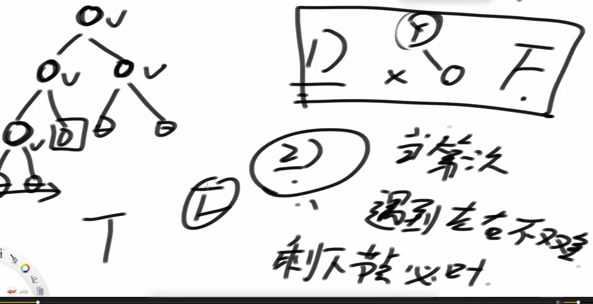
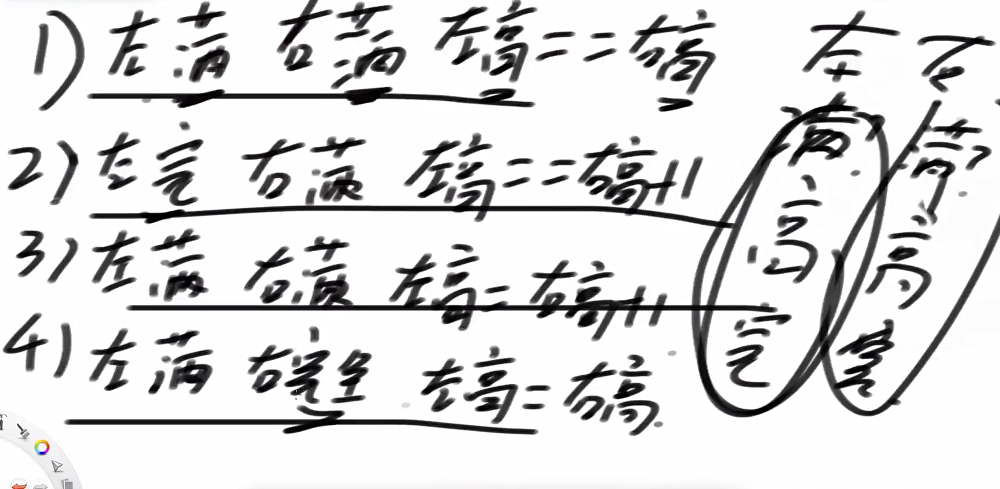
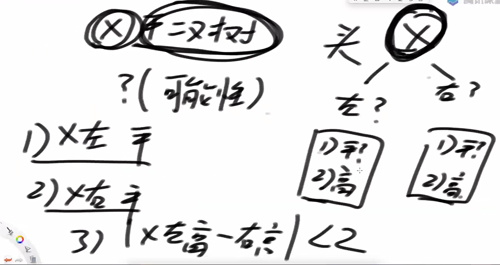
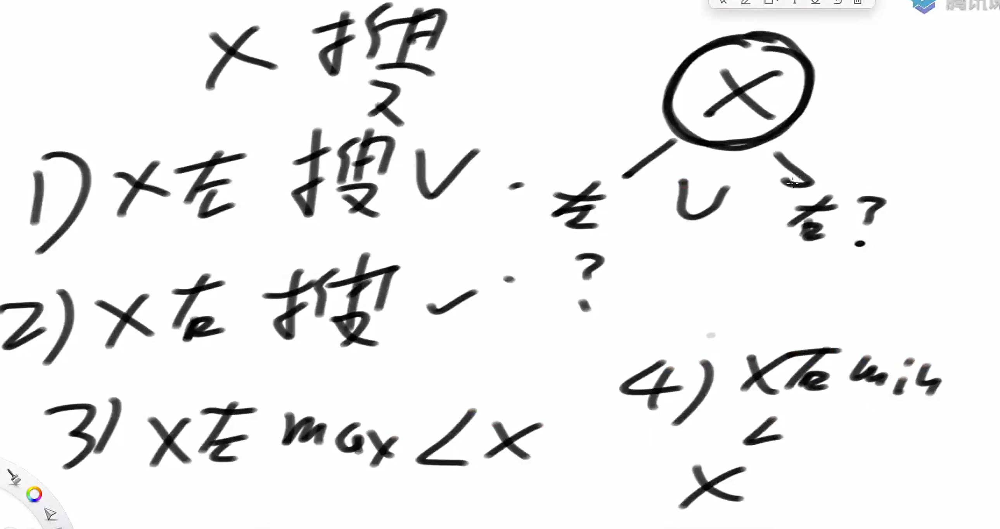
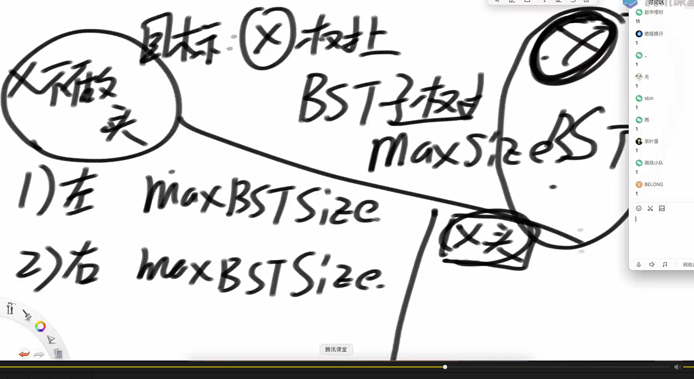
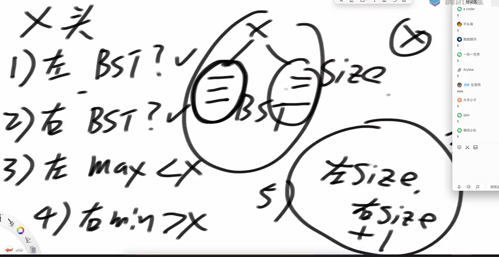
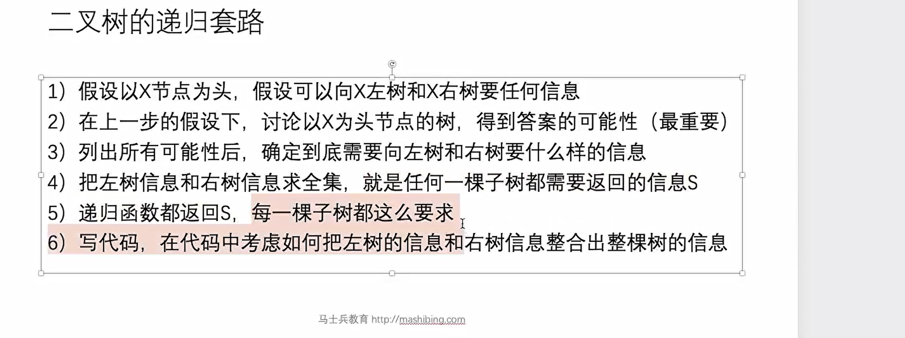

判断一棵树是否是完全二叉树



递归方法完全二叉树判定逻辑



代码实现

```java
package class12;

import java.util.LinkedList;
import java.util.Queue;
import java.util.Random;

public class code01_isCBT {


    public static class Node{
        public int value;
        public Node left;
        public Node right;

        public Node(int data){
            this.value = data;
        }
    }

    public static boolean isCBT(Node cur){
        if (cur == null){
            return true;
        }
        Queue<Node> queue = new LinkedList<>();
        queue.add(cur);
        boolean fondNonFullNode = false;
        while(!queue.isEmpty()){
            cur = queue.poll();
            if (cur.left != null){
                if (fondNonFullNode){
                    return false;
                }
                queue.add(cur.left);
            }else{
                fondNonFullNode = true;
            }
            if (cur.right != null){
                if (fondNonFullNode){
                    return false;
                }
                queue.add(cur.right);
            }else {
                fondNonFullNode = true;
            }
        }
        return true;
    }

    public static class Info{
        public boolean isFull;
        public boolean isCBT;
        public int height;

        public Info(boolean isFull, boolean isCBT, int height){
           this.isFull = isFull;
           this.isCBT = isCBT;
           this.height = height;
        }
    }


    public static boolean isCBT2(Node head){
        if (head == null){
            return true;
        }
        return process(head).isCBT;
    }

    public static Info process(Node head){
        if (head == null){
            return new Info(true, true, 0);
        }
        Info leftInfo = process(head.left);
        Info rightInfo = process(head.right);

        boolean isFull = leftInfo.isFull && rightInfo.isFull && leftInfo.height == rightInfo.height;
        int height = Math.max(leftInfo.height, rightInfo.height) + 1;

        boolean isCBT = false;
        if (isFull){
            isCBT = true;
        }else{
           if (leftInfo.isCBT && rightInfo.isCBT){
               if (leftInfo.isFull && rightInfo.isFull && leftInfo.height == rightInfo.height + 1){
                   isCBT = true;
               }
               //左满 又不满
               if (leftInfo.isFull && rightInfo.isCBT && leftInfo.height == rightInfo.height){
                   isCBT = true;
               }
               //左不满，右满
               if (leftInfo.isCBT && rightInfo.isFull && leftInfo.height == rightInfo.height + 1){
                   isCBT = true;
               }
           }
        }
        return new Info(isFull,isCBT,height);
    }

    public static Node generateRandomBST(int level, int maxLevel, int maxValue){
        if (level > maxLevel || new Random().nextDouble() < 0.5){
            return null;
        }
        Node head = new Node(new Random().nextInt(maxValue));
        head.left = generateRandomBST(level + 1, maxLevel, maxValue);
        head.right = generateRandomBST(level + 1, maxLevel, maxValue);
        return head;
    }
    public static void printTree(Node root) {
        System.out.println("Binary Tree:");
        if (root == null) {
            System.out.println("  <empty>");
            return;
        }
        printNode(root, "", true);
    }

    private static void printNode(Node node, String prefix, boolean isTail) {
        if (node != null) {
            System.out.println(prefix + (isTail ? "└── " : "├── ") + node.value);

            String newPrefix = prefix + (isTail ? "    " : "│   ");

            // 先右后左，保证打印顺序看起来更自然
            if (node.right != null) {
                printNode(node.right, newPrefix, node.left == null);
            }
            if (node.left != null) {
                printNode(node.left, newPrefix, node.right == null);
            }
        }
    }
    public static void main(String[] args) {
        int testTimes = 5000;
        int maxLevel = 5;
        int maxValue = 10;
        for (int i = 0 ; i < testTimes; i ++){
            Node head = generateRandomBST(1, maxLevel, maxValue);
            if (isCBT(head) != isCBT2(head)){
                System.out.println("oops");
                System.out.println(isCBT(head) + " " + isCBT2(head));
                printTree(head);
                break;
            }
        }
    }
}

```

如何判断一棵树是否是平衡二叉树



代码实现

```java
package class12;


import java.util.Random;

public class code03_isBalance {

    public static class Node{
        public int value;
        public Node left;
        public Node right;

        public Node(int data){
            this.value = data;
        }
    }


    public static class Info{
        public int height;
        public boolean isBalance;

        public Info(int height, boolean isBalance){
            this.height = height;
            this.isBalance = isBalance;
        }
    }

    public static boolean isBalance1(Node head){
        return process1(head).isBalance;
    }

    public static Info process1(Node head){
        if (head == null){
            return new Info(0, true);
        }
        Info leftInfo = process1(head.left);
        Info rightInfo = process1(head.right);

        int height = Math.max(leftInfo.height, rightInfo.height) + 1;
        boolean isBalance = true;
        if (!leftInfo.isBalance || !rightInfo.isBalance || Math.abs(leftInfo.height - rightInfo.height) > 1){
            isBalance = false;
        }
        return new Info(height, isBalance);
    }

    public static boolean isBalance2(Node head){
        boolean[] ans = new boolean[1];
        ans[0] = true;
        process2(head, ans);
        return ans[0];
    }

    public static int process2(Node head, boolean[] ans){
        if (!ans[0] || head == null){
            return -1;
        }
        int leftHeight = process2(head.left, ans);
        int rightHeight = process2(head.right, ans);

        if (Math.abs(leftHeight - rightHeight) > 1){
            ans[0] = false;
        }
        return Math.max(leftHeight, rightHeight) + 1;
    }

    public static Node generateRandomBST(int level, int maxLevel, int maxValue){
        if (level > maxLevel || new Random().nextDouble() < 0.5){
            return null;
        }
        Node head = new Node(new Random().nextInt(maxValue));
        head.left = generateRandomBST(level + 1, maxLevel, maxValue);
        head.right = generateRandomBST(level + 1, maxLevel, maxValue);
        return head;
    }

    public static void main(String[] args) {
        int testTimes = 5000;
        int maxLevel = 5;
        int maxValue = 10;
        for (int i = 0; i < testTimes; i++){
            Node head = generateRandomBST(1, maxLevel, maxValue);
            if (isBalance1(head) != isBalance2(head)){
                System.out.println("oops!");
                break;
            }
        }
        System.out.println("finish!");
    }
}

```

判断是否是搜索二叉树

是搜索二叉树的条件



```java
package class12;

import java.util.ArrayList;
import java.util.List;
import java.util.Random;
import java.util.Stack;

public class code02_isBST {

    public static class Node{
        public int value;
        public Node left;
        public Node right;

        public Node(int data){
            this.value = data;
        }
    }


    public static class Info{
        public boolean isBST;
        public int max;
        public int min;

        public Info(boolean isBST, int max, int min){
            this.isBST = isBST;
            this.max = max;
            this.min = min;
        }
    }


    public static boolean isBST1(Node head){
        if (head == null){
            return true;
        }
        return process1(head).isBST;
    }

    public static Info process1(Node head){
        if (head == null){
            return null;
        }

        Info leftInfo = process1(head.left);
        Info rightInfo = process1(head.right);

        int max = head.value;
        int min = head.value;
        if (leftInfo != null){
            max = Math.max(max, leftInfo.max);
            min = Math.min(min, leftInfo.min);
        }
        if (rightInfo != null){
            max = Math.max(max, rightInfo.max);
            min = Math.min(min, rightInfo.min);
        }

        boolean isBST = true;

        // 先判断子树是否是 BST
        if ((leftInfo != null && !leftInfo.isBST) ||
                (rightInfo != null && !rightInfo.isBST)) {
            isBST = false;
        }

        // 再判断当前节点是否符合 BST 性质
        if ((leftInfo != null && leftInfo.max >= head.value) ||
                (rightInfo != null && rightInfo.min <= head.value)) {
            isBST = false;
        }

        return new Info(isBST, max, min);
    }


    public static boolean isBST2(Node head){
        if (head == null){
            return true;
        }
        List<Node> list = getInsArray(head);
        for (int i = 1; i < list.size(); i++){
            if (list.get(i).value <= list.get(i-1).value){
                return false;
            }
        }
        return true;
    }

    public static List<Node> getInsArray(Node cur){
        List<Node> ans = new ArrayList<>();
        if (cur != null){
            Stack<Node> stack = new Stack<>();
            while(!stack.isEmpty() || cur != null){
                if (cur != null){
                    stack.push(cur);
                    cur = cur.left;
                }else{
                    cur = stack.pop();
                    ans.add(cur);
                    cur = cur.right;
                }
            }
        }
        return ans;
    }

    public static Node generateRandomBST(int level, int maxLevel, int maxValue){
        if (level > maxLevel || new Random().nextDouble() < 0.5){
            return null;
        }
        Node head = new Node(new Random().nextInt(maxValue));
        head.left = generateRandomBST(level + 1, maxLevel, maxValue);
        head.right = generateRandomBST(level + 1, maxLevel, maxValue);
        return head;
    }
    public static void printTree(Node root) {
        System.out.println("Binary Tree:");
        printNode(root, "", true);
    }

    private static void printNode(Node node, String prefix, boolean isLeft) {
        if (node != null) {
            System.out.print(prefix);
            System.out.print(isLeft ? "├── " : "└── ");
            System.out.println(node.value);

            // 对右子节点使用不同的前缀
            String newPrefix = prefix + (isLeft ? "│   " : "    ");
            printNode(node.right, newPrefix, false);
            printNode(node.left, newPrefix, true);
        }
    }

    public static void main(String[] args) {
        int testTime = 5000;
        int maxLevel = 5;
        int maxValue = 10;
        for (int i = 0; i < testTime; i++){
            Node head = generateRandomBST(1, maxLevel, maxValue);
            if (isBST1(head) != isBST2(head)){
                System.out.println("oops!");
                printTree(head);
                return;
            }
        }
        System.out.println("finish!");
    }
}

```

如何判断满二叉树

```java
package class12;

import java.util.Random;

public class code04_isFull {

    public static class Node{
        public int value;
        public Node left;
        public Node right;

        public Node(int data){
            this.value = data;
        }
    }

    //判断是否是满二叉树的逻辑是 2 ^(height - 1) = nodes 否

    public static boolean isFull(Node head){
        if (head == null){
            return true;
        }
        int height = h(head);
        int nodes = n(head);

        return (int)Math.pow(2, height - 1) == nodes;
    }

    public static int h(Node head){
        if (head == null){
            return 0;
        }
        int left = h(head.left);
        int right = h(head.right);

        int height = Math.max(left, right) + 1;
        return height;
    }

    public static int n(Node head){
        if (head == null){
            return 0;
        }
        int left = n(head.left);
        int right = n(head.right);

        int nodes = left + right + 1;

        return nodes;
    }

    public static class Info{
        public int height;
        public int nodes;

        public Info(int h, int n){
            height = h;
            nodes = n;
        }
    }

    public static boolean isFull2(Node head){
        if (head == null){
            return true;
        }
        Info all = process(head);

        return (int)Math.pow(2, all.height - 1) == all.nodes;
    }

    public static Info process(Node head){
        if (head == null){
            return new Info(0, 0);
        }
        Info left = process(head.left);
        Info right = process(head.right);

        int height = Math.max(left.height, right.height) + 1;
        int nodes = left.nodes + right.nodes + 1;

        return new Info(height, nodes);
    }

    public static Node generateRandomBST(int level, int maxLevel, int maxValue){
        if (level > maxLevel || new Random().nextDouble() < 0.5){
            return null;
        }
        Node head = new Node(new Random().nextInt(maxValue));
        head.left = generateRandomBST(level + 1, maxLevel, maxValue);
        head.right = generateRandomBST(level + 1, maxLevel, maxValue);
        return head;
    }

    public static void main(String[] args) {
        int testTimes = 5000;
        int maxLevel = 5;
        int maxValue = 10;
        for (int i = 0; i < testTimes; i++){
            Node head = generateRandomBST(1, maxLevel,maxValue);
            if (isFull(head) != isFull2(head)){
                System.out.println("oops");
                break;
            }
        }
    }
}

```

二叉树的递归套路实践

给定一棵二叉树的头节点head，任何两个节点之间都存在距离，返回整棵二叉树的最大距离

两种可能性

有x和无x

有x

1 左树最大距离

2 右树最大距离

无x

3x左树最远与x最远 + x右树与x最远 + 1

暴力方法是找到两个节点之间的最低的公共祖先

然后算出最大距离

这里需要注意的是，两个节点之间的距离是节点的数量，而不是边的数量

```java
package class12;

import java.util.*;

public class code05_maxDistance {

    public static class Node{
        public int value;
        public Node left;
        public Node right;

        public Node(int data){
            this.value = data;
        }
    }

    public static class Info{
        public int maxDistance;
        public int height;

        public Info(int m, int h){
            maxDistance = m;
            height = h;
        }
    }

    public static int maxDistance1(Node head){
        return process(head).maxDistance;
    }

    public static Info process(Node root){
        if (root == null){
            return new Info(0, 0);
        }
        Info leftInfo = process(root.left);
        Info rightInfo = process(root.right);

        int height = Math.max(leftInfo.height, rightInfo.height) + 1;

        int p1 = leftInfo.maxDistance;
        int p2 = rightInfo.maxDistance;
        int p3 = leftInfo.height + rightInfo.height + 1;
        int maxDistance = Math.max(p1,Math.max(p2, p3));
        return new Info(maxDistance, height);
    }

    public static int maxDistance2(Node root){
        if (root == null){
            return 0;
        }
        List<Node> list = preList(root);
        HashMap<Node, Node> parentMap = getParentMap(root);
        int max = 0;
        for (int i = 0; i < list.size(); i++){
            for (int j = i; j < list.size(); j++){
                max = Math.max(max, distance(parentMap, list.get(i), list.get(j)));
            }
        }
        return max;
    }

    public static List<Node> preList(Node head){
        List<Node> arr = new ArrayList<>();
        fillPreList(head, arr);
        return arr;
    }

    public static void fillPreList(Node head, List<Node> arr){
        if (head == null){
            return;
        }
        arr.add(head);
        fillPreList(head.left, arr);
        fillPreList(head.right, arr);
    }


    public static HashMap<Node, Node> getParentMap(Node root) {
        HashMap<Node, Node> parentMap = new HashMap<>();
        parentMap.put(root, null);
        fillParentMap(root, parentMap);
        return parentMap;
    }

    public static void fillParentMap(Node root, HashMap<Node, Node> parentMap) {
        if (root == null){
            return;
        }

        if (root.left != null){
            parentMap.put(root.left, root);
            fillParentMap(root.left, parentMap);
        }

        if (root.right != null){
            parentMap.put(root.right, root);
            fillParentMap(root.right, parentMap);
        }
    }

    public static int distance(HashMap<Node, Node> parentMap, Node o1, Node o2) {
        Node cur = o1;
        HashSet<Node> o1Set = new HashSet<>();
        while (cur != null){
            o1Set.add(cur);
            cur = parentMap.get(cur);
        }
        cur = o2;
        while (!o1Set.contains(cur) && cur != null){
            cur = parentMap.get(cur);
        }

        if (cur == null) return 0;
        
        Node lowestNode = cur;

        int distance1 = 1;
        cur = o1;
        while(cur != lowestNode){
            cur = parentMap.get(cur);
            distance1++;
        }

        int distance2 = 1;
        cur = o2;
        while (cur != lowestNode){
            cur = parentMap.get(cur);
            distance2++;
        }

        return distance1 + distance2 - 1;
    }


    public static Node generateRandomBST(int level, int maxLevel, int maxValue){
        if (level > maxLevel || new Random().nextDouble() < 0.5){
            return null;
        }
        Node head = new Node(new Random().nextInt(maxValue));
        head.left = generateRandomBST(level + 1, maxLevel, maxValue);
        head.right = generateRandomBST(level + 1, maxLevel, maxValue);
        return head;
    }

    public static void main(String[] args) {
        int testTimes = 5000;
        int maxLevel = 5;
        int maxValue = 10;
        for (int i = 0; i < testTimes; i++){
            Node head = generateRandomBST(1, maxLevel, maxValue);
            if (maxDistance1(head) != maxDistance2(head)){
                System.out.println("oops!");
                break;
            }
        }
    }

}

```

获取一棵树中最大的为搜索二叉树的子树的大小（节点多少）

分两种情况

x作头和x不作头

x不作头



x作头



代码实现

```java
package class12;

import java.util.ArrayList;
import java.util.List;
import java.util.Random;

public class code06_maxSubBSTSize {

    public static class Node{
        public int value;
        public Node left;
        public Node right;

        public Node(int data){
            this.value = data;
        }
    }

    public static int maxSubBSTSize1(Node head){
        if (head == null){
            return 0;
        }

        int h = getBSTSize(head);
        if (h != 0){
            return h;
        }
        return Math.max(maxSubBSTSize1(head.left), maxSubBSTSize1(head.right));
    }


    public static List<Node> getPreList(Node head){
        List<Node> list = new ArrayList<>();
        ins(head, list);
        return list;
    }

    public static void ins(Node head, List<Node> list){
        if (head == null){
            return;
        }
        ins(head.left, list);
        list.add(head);
        ins(head.right, list);

    }
    public static int getBSTSize(Node head) {
        if (head == null){
            return 0;
        }
        List<Node> preList = getPreList(head);
        for (int i = 1; i < preList.size(); i++){
            if (preList.get(i-1).value >= preList.get(i).value){
                return 0;
            }
        }
        return preList.size();
    }


    public static class Info{
        public int maxSubBSTSize;
        public int allSize;
        public int max;
        public int min;

        public Info(int maxSubBSTSize, int allSize, int max, int min) {
            this.maxSubBSTSize = maxSubBSTSize;
            this.allSize = allSize;
            this.max = max;
            this.min = min;
        }


    }


    public static int maxSubBSTSize2(Node head){
        if (head == null){
            return 0;
        }
        return process(head).maxSubBSTSize;
    }

    public static Info process(Node x){
        if (x == null){
            return null;
        }

        Info leftInfo = process(x.left);
        Info rightInfo = process(x.right);


        int allSize = 1;

        int max = x.value;
        int min = x.value;


        if (leftInfo != null){
            max = Math.max(max, leftInfo.max);
            min = Math.min(min, leftInfo.min);
            allSize += leftInfo.allSize;
        }
        if (rightInfo != null){
            max = Math.max(max, rightInfo.max);
            min = Math.min(min, rightInfo.min);
            allSize += rightInfo.allSize;
        }

        int p1 = leftInfo == null ? 0 : leftInfo.maxSubBSTSize;
        int p2 = rightInfo == null ? 0 : rightInfo.maxSubBSTSize;

        int p3 = -1;
        boolean leftBST = leftInfo == null ? true : leftInfo.maxSubBSTSize == leftInfo.allSize;
        boolean rightBST = rightInfo == null ? true : rightInfo.maxSubBSTSize == rightInfo.allSize;
        if (leftBST && rightBST){
            boolean leftFlag = leftInfo == null ? true : leftInfo.max < x.value;
            boolean rightFlag = rightInfo == null ? true : rightInfo.min > x.value;
            if (leftFlag && rightFlag){
                int leftSize = leftInfo == null ? 0 : leftInfo.allSize;
                int rightSize = rightInfo == null ? 0 : rightInfo.allSize;
                p3 = leftSize + rightSize + 1;
            }
        }
        return new Info(Math.max(p1, Math.max(p2, p3)),allSize, max, min);
    }

    public static Node generateRandomBST(int level, int maxLevel, int maxValue){
        if (level > maxLevel || new Random().nextDouble() < 0.5){
            return null;
        }
        Node head = new Node(new Random().nextInt(maxValue));
        head.left = generateRandomBST(level + 1, maxLevel, maxValue);
        head.right = generateRandomBST(level + 1, maxLevel, maxValue);
        return head;
    }


    // 打印二叉树
    public static void printTree(Node root) {
        if (root == null) {
            System.out.println("Empty tree");
            return;
        }

        List<List<String>> lines = new ArrayList<>();
        int height = getTreeHeight(root);
        int[] colWidths = new int[height];
        fillWidths(root, colWidths, 0);

        buildTreeLines(root, lines, 0, 0, colWidths);

        for (List<String> line : lines) {
            StringBuilder sb = new StringBuilder();
            for (String s : line) {
                sb.append(s);
            }
            System.out.println(sb.toString().replaceAll("\\s+$", ""));
        }
    }

    // 获取树的高度
    private static int getTreeHeight(Node node) {
        if (node == null) return 0;
        return 1 + Math.max(getTreeHeight(node.left), getTreeHeight(node.right));
    }

    // 填充每一层的最大宽度
    private static int fillWidths(Node node, int[] widths, int depth) {
        if (node == null) return 0;
        String val = Integer.toString(node.value);
        int w = val.length();

        int leftW = fillWidths(node.left, widths, depth + 1);
        int rightW = fillWidths(node.right, widths, depth + 1);
        widths[depth] = Math.max(widths[depth], leftW + w + rightW);

        return widths[depth];
    }

    // 构建每一行的内容
    private static void buildTreeLines(Node node, List<List<String>> lines, int x, int depth, int[] colWidths) {
        if (node == null) return;

        String val = Integer.toString(node.value);
        int width = colWidths[depth];

        // 如果当前深度还没有对应的行，则新建一行
        while (lines.size() <= depth) {
            lines.add(new ArrayList<>());
        }

        List<String> line = lines.get(depth);
        // 补全前面的空格
        while (line.size() < x) {
            line.add(" ");
        }

        // 添加当前节点值
        line.add(val);

        // 左右子树连接线
        int leftPos = x - val.length() / 2;
        int rightPos = x + val.length() / 2 + 1;

        if (node.left != null) {
            drawLine(lines, depth + 1, leftPos, x, '/');
        }
        if (node.right != null) {
            drawLine(lines, depth + 1, x + val.length(), rightPos, '\\');
        }

        // 递归构建左右子树
        int leftOffset = 0;
        if (node.left != null) {
            leftOffset = colWidths[depth + 1] / 2;
        }
        buildTreeLines(node.left, lines, x - leftOffset - val.length(), depth + 1, colWidths);

        int rightOffset = 0;
        if (node.right != null) {
            rightOffset = colWidths[depth + 1] / 2;
        }
        buildTreeLines(node.right, lines, x + rightOffset + val.length(), depth + 1, colWidths);
    }

    // 绘制连接线
    private static void drawLine(List<List<String>> lines, int depth, int from, int to, char c) {
        if (depth >= lines.size()) {
            lines.add(new ArrayList<>());
        }

        List<String> line = lines.get(depth);
        while (from > to) {
            swap(from, to);
        }

        for (int i = from; i <= to; i++) {
            while (i >= line.size()) {
                line.add(" ");
            }
            if (i == from || i == to) {
                line.set(i, Character.toString(c));
            } else {
                line.set(i, "-");
            }
        }
    }

    private static void swap(int a, int b) {
        int temp = a;
        a = b;
        b = temp;
    }

    public static void main(String[] args) {
        int testTimes = 5000;
        int maxLevel = 5;
        int maxValue = 10;
        for (int i = 0; i < testTimes; i++){
            Node head = generateRandomBST(1, maxLevel, maxValue);
            if (maxSubBSTSize1(head) != maxSubBSTSize2(head)){
                System.out.println(maxSubBSTSize1(head) + " " + maxSubBSTSize2(head));
                printTree(head);
                System.out.println("oops");
                break;
            }
        }

    }

}

```

