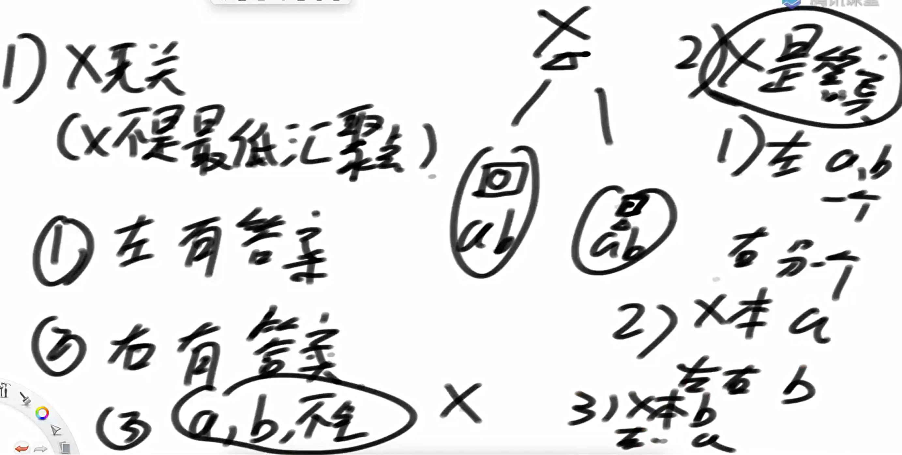
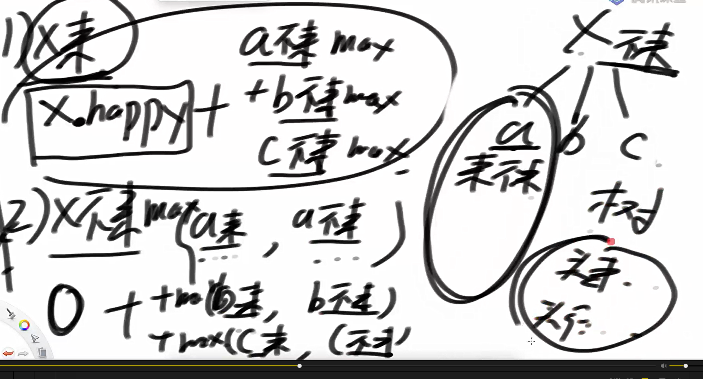
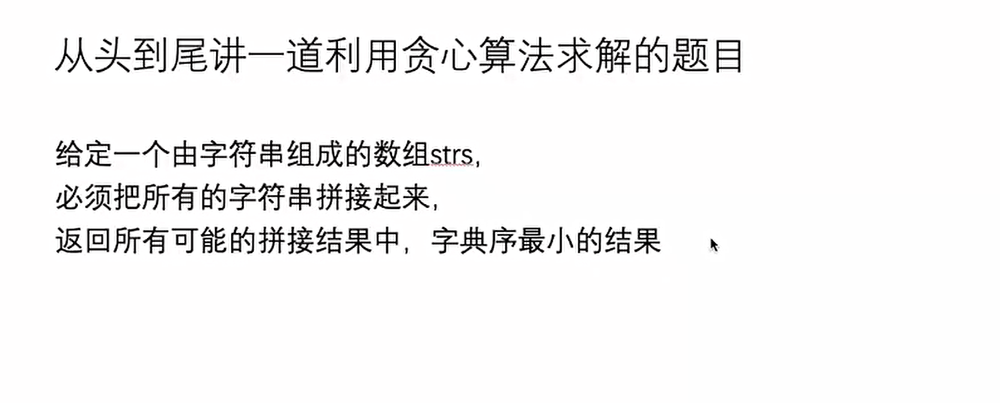
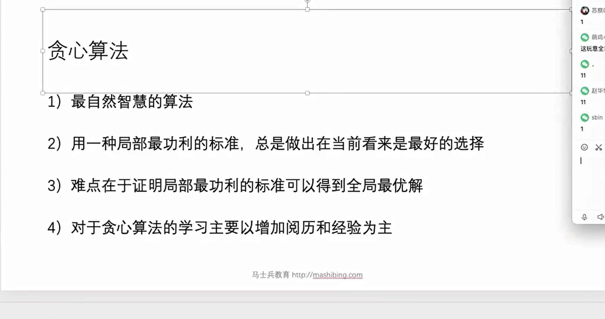
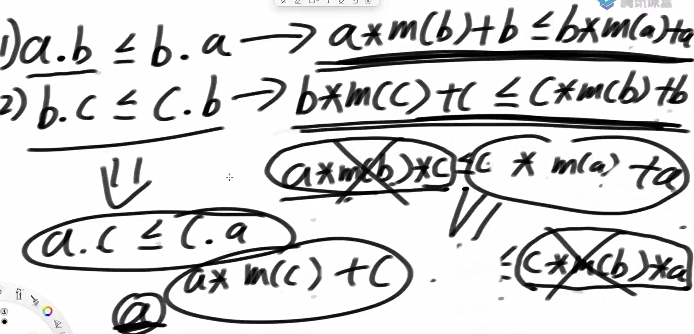
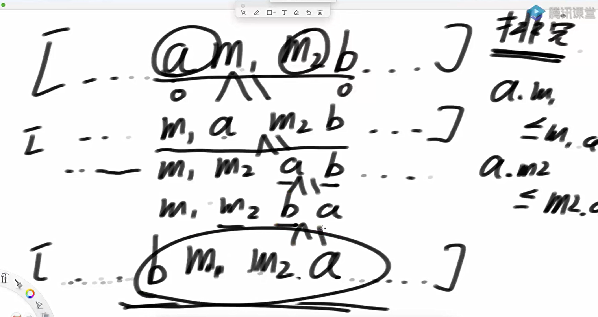

给定一颗二叉树的头节点，返回这课二叉树中最大的二叉搜索子树的头节点

发现：使用递归套路更容易解决

其实只需要在找最大搜索二叉树子树的基础上在info中加上一个bstHead即可

```java
package class13;


import java.util.ArrayList;
import java.util.List;
import java.util.Random;


public class code01_findLargestBSTSubtreeHead {

    public static class Node{
        public int value;
        public Node left;
        public Node right;

        public Node(int data){
            this.value = data;
        }
    }

    public static Node findLargestBSTSubtreeHead1(Node head){
        if (head == null){
            return null;
        }
        if (getBSTSize(head) != 0){
            return head;
        }
        Node leftAns = findLargestBSTSubtreeHead1(head.left);
        Node rightAns = findLargestBSTSubtreeHead1(head.right);

        return  getBSTSize(leftAns) >= getBSTSize(rightAns) ? leftAns : rightAns;
    }

    public static int getBSTSize(Node root){
        if (root == null){
            return 0;
        }
        List<Node> arr = new ArrayList<>();
        ins(root, arr);
        for (int i = 1; i < arr.size(); i++){
            if (arr.get(i-1).value >= arr.get(i).value){
                return 0;
            }
        }
        return arr.size();
    }

    public static void ins(Node root, List<Node> arr){
        if (root == null){
            return;
        }
        ins(root.left, arr);
        arr.add(root);
        ins(root.right, arr);
    }


    public static class Info{
        public int maxSubBSTSize;
        public Node maxSubBSTHead;
        public int max;
        public int min;

        public Info(int maxSubBSTSize, Node maxSubBSTHead, int max, int min) {
            this.maxSubBSTSize = maxSubBSTSize;
            this.maxSubBSTHead = maxSubBSTHead;
            this.max = max;
            this.min = min;
        }
    }

    public static Node findLargestBSTSubtreeHead2(Node head){
       if (head == null){
           return head;
       }
       return process(head).maxSubBSTHead;
    }

    public static Info process(Node X){
        if (X == null){
            return null;
        }
        Info leftInfo = process(X.left);
        Info rightInfo = process(X.right);


       int maxSubBSTSize = 0;
       Node maxSubBSTHead = null;
       int max = X.value;
       int min = X.value;
        if (leftInfo != null){
            max = Math.max(max, leftInfo.max);
            min = Math.min(min, leftInfo.min);
            maxSubBSTSize = leftInfo.maxSubBSTSize;
            maxSubBSTHead = leftInfo.maxSubBSTHead;
        }

        if (rightInfo != null){
            max = Math.max(max, rightInfo.max);
            min = Math.min(min, rightInfo.min);
            if (rightInfo.maxSubBSTSize > maxSubBSTSize){
                maxSubBSTSize = rightInfo.maxSubBSTSize;
                maxSubBSTHead = rightInfo.maxSubBSTHead;
            }
        }

        if (
                (leftInfo == null ? true : (leftInfo.maxSubBSTHead == X.left && leftInfo.max < X.value))
                &&
                (rightInfo == null ? true : (rightInfo.maxSubBSTHead == X.right && rightInfo.min > X.value))
        ){
            maxSubBSTHead = X;
            maxSubBSTSize = (leftInfo == null ? 0 : leftInfo.maxSubBSTSize)
                    + (rightInfo == null ? 0 : rightInfo.maxSubBSTSize)
                    + 1;
        }
        return new Info(maxSubBSTSize, maxSubBSTHead, max, min);
    }


    public static Node generateRandomBST(int level, int maxLevel, int maxValue){
        if (level > maxLevel || new Random().nextDouble() < 0.5){
            return null;
        }
        Node head = new Node(new Random().nextInt(maxValue));
        head.left = generateRandomBST(level + 1, maxLevel, maxValue);
        head.right = generateRandomBST(level + 1, maxLevel, maxValue);
        return head;
    }


    public static void main(String[] args) {
        int testTimes = 5000;
        int maxValue = 10;
        int maxLevel = 5;
        for (int i = 0; i < testTimes; i++){
            Node head = generateRandomBST(1, maxLevel, maxValue);
            if (findLargestBSTSubtreeHead2(head) != findLargestBSTSubtreeHead1(head)){
                System.out.println("oops");
                break;
            }
        }
    }


}


```

最低公共祖先节点

思路



代码实现

```java
package class13;

import java.util.*;

public class code02_findLowestAncestor {

    public static class Node{
        public int value;
        public Node left;
        public Node right;

        public Node(int data){
            this.value = data;
        }
    }

    public static class Info{
        public boolean findA;
        public boolean findB;
        public Node ans;

        public Info(boolean findA, boolean findB, Node ans) {
            this.findA = findA;
            this.findB = findB;
            this.ans = ans;
        }
    }

    public static Node findLowestAncestor1(Node head, Node a, Node b){
        return process(head, a, b).ans;
    }

    public static Info process(Node x, Node a, Node b){
        if (x == null){
            return new Info(false, false, null);
        }
        Info leftInfo = process(x.left, a, b);
        Info rightInfo = process(x.right, a, b);

        boolean findA = x == a || leftInfo.findA || rightInfo.findA;
        boolean findB = x == b || leftInfo.findB || rightInfo.findB;

        Node ans = null;
        if (leftInfo.ans != null){
            ans = leftInfo.ans;
        }else if (rightInfo.ans != null){
            ans = rightInfo.ans;
        }else{
            if (findA && findB){
                ans = x;
            }
        }
        return new Info(findA, findB, ans);
    }

    public static Node findLowestAncestor2(Node head, Node a, Node b){
        if (head == null){
            return null;
        }
        HashMap<Node, Node> parentMap = new HashMap<>();
        parentMap.put(head, null);
        fillParentMap(head, parentMap);
        HashSet<Node> Aset = new HashSet<>();
        Node cur = a;
        Aset.add(cur);
        while(parentMap.get(cur) != null){
             cur = parentMap.get(cur);
             Aset.add(cur);
        }
        
        cur = b;
        while(!Aset.contains(cur)){
            cur = parentMap.get(cur);
        }

        Node lowestAncestor = cur;

        return cur;
    }

    public static void fillParentMap(Node root, HashMap<Node, Node> map){
        if (root.left != null){
            map.put(root.left, root);
            fillParentMap(root.left, map);
        }
        if (root.right != null){
            map.put(root.right, root);
            fillParentMap(root.right, map);
        }
    }

    public static Node generateRandomBST(int level, int maxLevel, int maxValue){
        if (level > maxLevel || new Random().nextDouble() < 0.5){
            return null;
        }
        Node head = new Node(new Random().nextInt(maxValue));
        head.left = generateRandomBST(level + 1, maxLevel, maxValue);
        head.right = generateRandomBST(level + 1, maxLevel, maxValue);
        return head;
    }

    public static Node getOneNode(Node head){
        if (head == null){
            return null;
        }
        List<Node> arr = new ArrayList<>();
        preList(arr, head);
        return arr.get(new Random().nextInt(arr.size()));
    }

    public static void preList(List<Node> arr, Node head){
        if (head == null){
            return;
        }
        arr.add(head);
        preList(arr, head.left);
        preList(arr, head.right);
    }

    public static void main(String[] args) {
        int testTimes = 5000;
        int maxValue = 10;
        int maxLevel = 5;
        for (int i = 0; i < testTimes; i++){
            Node head = generateRandomBST(1, maxLevel, maxValue);
            Node a = getOneNode(head);
            Node b = getOneNode(head);

            if (findLowestAncestor1(head, a, b) != findLowestAncestor2(head, a, b)){
                System.out.println("oops");
                break;
            }
        }
    }
}


```

最大happy值



代码实现

```java
package class13;

import java.util.ArrayList;
import java.util.List;
import java.util.Random;

public class code03_maxHappy {

    public static class Node{
        public int happy;
        public List<Node> nexts;

        public Node(int h){
            happy = h;
            nexts = new ArrayList<>();
        }
    }


    public static int maxHappy1(Node head){
        if (head == null){
            return 0;
        }
        return Math.max(process1(head,false), process1(head,true));
    }

    public static int process1(Node head, boolean come){
       if (head == null){
           return 0;
       }

       if (come){
           int ans = 0;
           for (Node n : head.nexts){
               ans += process1(n, false);
           }
           return head.happy + ans;
       }else {
           int ans = 0;
           for (Node n : head.nexts){
               ans += Math.max(process1(n, true), process1(n, false));
           }
           return ans;
       }
    }

    public static class Info{
        public int yes;
        public int no;

        public Info(int yes, int no) {
            this.yes = yes;
            this.no = no;

        }
    }
    public static int maxHappy(Node head){
        if (head == null){
            return 0;
        }
        Info info = process(head);
        return Math.max(info.yes, info.no);
    }

    public static Info process(Node x){
        if (x == null){
            return new Info(0 ,0);
        }
        int no = 0;
        int yes = x.happy;
        for (Node next : x.nexts){
            Info nextInfo = process(next);
            yes += nextInfo.no;
            no += Math.max(nextInfo.no, nextInfo.yes);
        }
        return new Info(yes, no);
    }

    public static Node generateBoss(int level, int maxLevel, int maxNexts,int maxHappy){
        Random random = new Random();
        if (random.nextDouble() < 0.22){
            return null;
        }
        int happy = random.nextInt(maxHappy + 1);
        Node boss = new Node(happy);
        genarateNexts(boss, level, maxLevel, maxNexts, maxHappy);

        return boss;
    }
    
    
    public static void genarateNexts( Node e, int level, int maxLevel, int maxNexts, int maxHappy) {
        if (level > maxLevel) {
            return;
        }
        int nextsSize = (int) (Math.random() * (maxNexts + 1));
        for (int i = 0; i < nextsSize; i++) {
             Node next = new  Node((int) (Math.random() * (maxHappy + 1)));
            e.nexts.add(next);
            genarateNexts(next, level + 1, maxLevel, maxNexts, maxHappy);
        }
    }


    /**
     * 打印整棵多叉树结构
     */
    public static void printTree(Node root) {
        if (root == null) {
            System.out.println("空树");
            return;
        }
        System.out.println("树结构：");
        printTree(root, "", true);
    }

    /**
     * 递归打印树结构
     *
     * @param node      当前节点
     * @param prefix    当前缩进字符串
     * @param isTail    是否是当前层最后一个子节点
     */
    private static void printTree(Node node, String prefix, boolean isTail) {
        if (node != null) {
            System.out.println(prefix + (isTail ? "└── " : "├── ") + "Happy: " + node.happy);

            for (int i = 0; i < node.nexts.size(); i++) {
                Node child = node.nexts.get(i);
                boolean isLast = i == node.nexts.size() - 1;

                String newPrefix = prefix + (isTail ? "    " : "│   ");
                printTree(child, newPrefix, isLast);
            }
        }
    }
    public static void main(String[] args) {
        int testTimes = 5000;
        int maxValue = 10;
        int maxLevel = 5;
        int maxNexts = 3;
        for (int i = 0; i < testTimes; i++){
                Node head = generateBoss(1, maxLevel, maxNexts, maxValue);
                if (maxHappy(head) != maxHappy1(head)) {
//                    System.out.println(maxHappy(head) + " " + maxHappy1(head));
//                    printTree(head);
                    System.out.println("oops");
                    break;
                }
        }
    }
}

```

拼接字符串的最小字典序



贪心算法



字符串的传递性



交换a,b后字典序一路上升



需要注意的地方

| (a + b).compareTo(b + a) | 按照拼接后字符串升序排列（拼接结果小的排前面） | 


```java
package class13;

import java.util.Arrays;
import java.util.Comparator;
import java.util.TreeSet;

public class code04_lowestlLexicography {


    public static class myComparator implements Comparator<String>{

        @Override
        public int compare(String a, String b) {
            return (a + b).compareTo(b + a);
        }
    }


    public static String getowestlLexicography1(String[] strs){
        if (strs == null || strs.length == 0){
            return "";
        }
        Arrays.sort(strs, new myComparator());
        String res = "";
        for (int i = 0; i < strs.length; i++){
            res += strs[i];
        }
        return res;
    }


    public static String getowestlLexicography2(String[] strs){
        if (strs == null || strs.length == 0){
            return "";
        }
        TreeSet<String> ans = process(strs);
        return ans.size() == 0 ? "" : ans.first();
    }

    public static TreeSet<String> process(String[] strs){
        TreeSet<String> ans = new TreeSet<>();
        if (strs.length == 0){
            ans.add("");
            return ans;
        }
        for (int i = 0; i < strs.length; i++){
            String first = strs[i];
            String[] nexts = removeIndexStrs(strs, i);
            TreeSet<String> next = process(nexts);
            for (String cur : next){
                ans.add(first + cur);
            }
        }
        return ans;
    }

    public static String[] removeIndexStrs(String[] strs, int index){
        String[] ans = new String[strs.length - 1];
        int cur = 0;
        for(int i = 0; i < strs.length; i++){
            if (i == index){
                continue;
            }else{
                ans[cur++] = strs[i];
            }
        }
        return ans;
    }
    // for test
    public static String generateRandomString(int strLen) {
        char[] ans = new char[(int) (Math.random() * strLen) + 1];
        for (int i = 0; i < ans.length; i++) {
            int value = (int) (Math.random() * 5);
            ans[i] = (Math.random() <= 0.5) ? (char) (65 + value) : (char) (97 + value);
        }
        return String.valueOf(ans);
    }


    // for test
    public static String[] generateRandomStringArray(int arrLen, int strLen) {
        String[] ans = new String[(int) (Math.random() * arrLen) + 1];
        for (int i = 0; i < ans.length; i++) {
            ans[i] = generateRandomString(strLen);
        }
        return ans;
    }

    // for test
    public static String[] copyStringArray(String[] arr) {
        String[] ans = new String[arr.length];
        for (int i = 0; i < ans.length; i++) {
            ans[i] = String.valueOf(arr[i]);
        }
        return ans;
    }


    public static void main(String[] args) {
        int arrLen = 6;
        int strLen = 5;
        int testTimes = 10000;
        System.out.println("test begin");
        for (int i = 0; i < testTimes; i++) {
            String[] arr1 = generateRandomStringArray(arrLen, strLen);
            String[] arr2 = copyStringArray(arr1);
            if (!getowestlLexicography1(arr1).equals(getowestlLexicography2(arr2))) {
                for (String str : arr1) {
                    System.out.print(str + ",");
                }
                System.out.println();
                System.out.println("Oops!");
                break;
            }
        }
        System.out.println("finish!");
    }
}

```

这里的全排列必须有ans.add（）不然就没办法拼接字符串