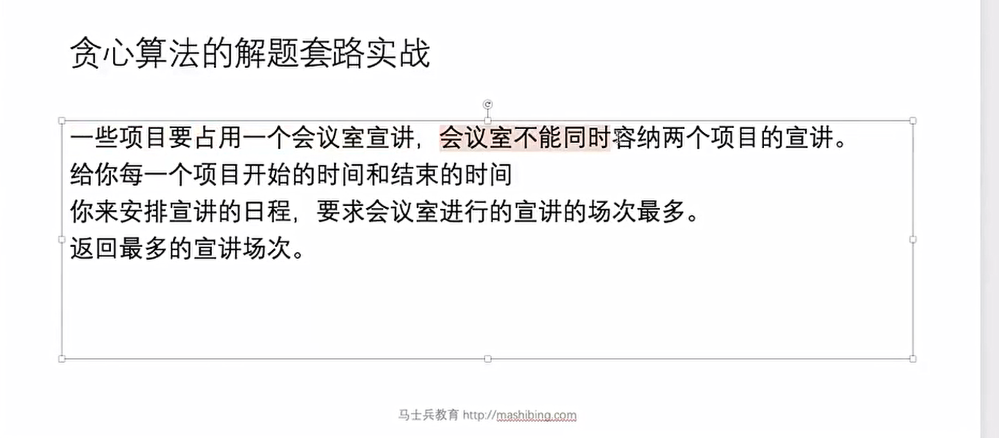
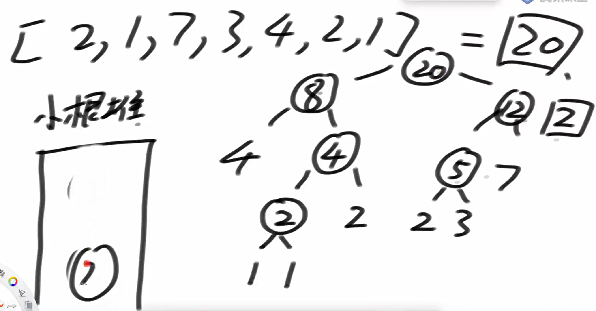
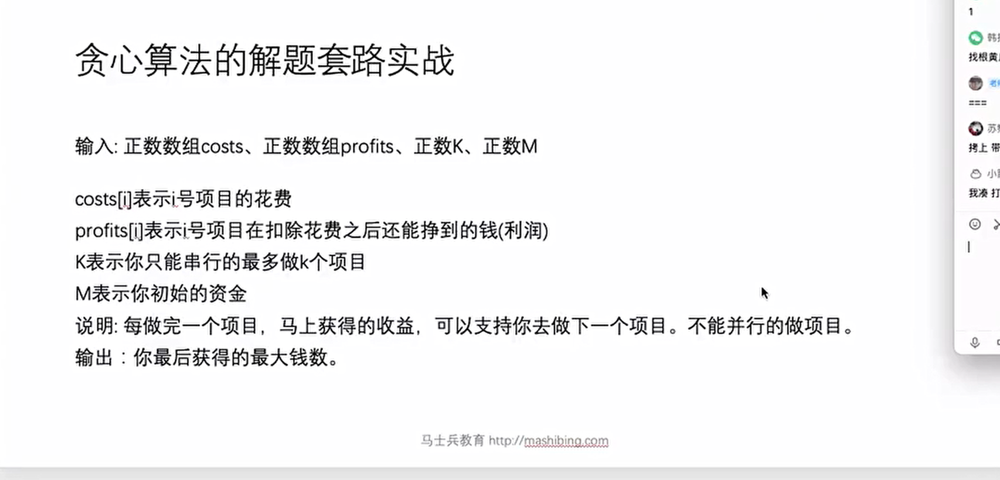
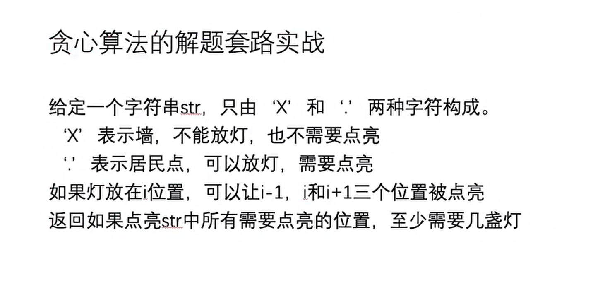
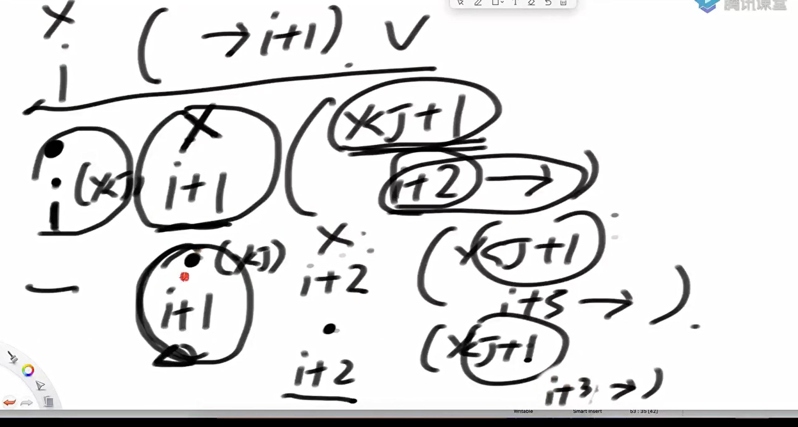

会议室占用



贪心尝试

1 最早来的 x

2 最短会议 x

3 最早结束 √

通过对数器验证而无需证明

代码如下

```java
package class14;

import java.util.Arrays;
import java.util.Comparator;
import java.util.Random;

public class code01_bestArrange {


    public static class Program{
        public int start;
        public int end;

        public Program(int start, int end) {
            this.start = start;
            this.end = end;
        }
    }

    public static class myComparator implements Comparator<Program>{


        @Override
        public int compare(Program o1, Program o2) {
            return o1.end - o2.end;
        }
    }

    public static int getBestArrange1(Program[] programs){
        if (programs == null || programs.length == 0){
            return 0;
        }

        Arrays.sort(programs, new myComparator());
        int result = 0;
        int testline = 0;
        for (int i = 0; i < programs.length; i++){
            if (testline <= programs[i].start){
                testline = programs[i].end;
                result++;
            }
        }
        return result;
    }

    public static int getBestArrange2(Program[] programs){
        if (programs == null || programs.length == 0){
            return 0;
        }
        return process(programs, 0, 0);
    }


    //done 是已经开了多少个会了， timeLine是上一个会议结束的时间
    public static int process(Program[] programs, int done, int timeLine){
        if (programs.length == 0){
            return done;
        }
        int max = done;
        for (int i = 0; i < programs.length; i++){
            if (programs[i].start >= timeLine){
                Program[] next = copyAndExcept(programs, i);
                max = Math.max(max, process(next, done + 1, programs[i].end));
            }
        }
        return max;
    }

    public static Program[] copyAndExcept(Program[] programs, int index){
        Program[] ans = new Program[programs.length - 1];
        int cur = 0;
        for (int i = 0; i < programs.length; i++){
            if (i != index){
                ans[cur++] = programs[i];
            }
        }
        return ans;
    }

    public static Program[] generateRandomArray(int maxValue, int maxSize){
        Random random = new Random();
        int size = random.nextInt(maxSize) + 1;
        Program[] ans = new Program[size];
        for (int i = 0; i < size; i++){
            int a = random.nextInt(maxValue);
            int b = random.nextInt(maxValue);
            if (a == b){
                ans[i] = new Program(a, a + 1);
            }else{
                ans[i] = new Program(Math.min(a, b), Math.max(a, b));
            }
        }
        return ans;
    }

    public static Program[] copyPrograms(Program[] programs){
        Program[] copyProgram = new Program[programs.length];
        for (int i = 0; i < programs.length; i++){
            copyProgram[i] = programs[i];
        }
        return copyProgram;
    }

    public static void main(String[] args) {
        int testTimes = 10000;
        int maxSize = 10;
        int maxValue = 20;
        for (int i = 0 ; i < testTimes; i++){
            Program[] programs = generateRandomArray(maxValue, maxSize);
            Program[] copyPrograms = copyPrograms(programs);
            if (getBestArrange1(programs) != getBestArrange2(programs)){
                System.out.println("oops");
                break;
            }
        }
    }
}

```

合并金块 也叫哈夫曼编码问题

切金条

给你一个数组，每个数代表一块金子的重量。


每次你可以**合并两块金子**，合并的代价是这两块金子的重量之和。


最终要把所有金子合并成一块，求 **总的最小合并代价**。

```
arr = [10, 20, 30]
```

可能的合并方式：

1. 先合并 10 + 20 = 30，代价 30

1. 再合并 30 + 30 = 60，代价 60

1. 总代价：30 + 60 = 90

这是最优解，其他合并方式代价更大。

最优分割逻辑



代码实现

```java
package class14;

import java.util.PriorityQueue;
import java.util.Random;

public class code02_lessMoneySplitGold {


    public static int lessMoneySplitGold1(int[] arr){
        if (arr == null || arr.length == 0){
            return 0;
        }
        PriorityQueue<Integer> queue = new PriorityQueue<>();
        for (int a : arr){
            queue.add(a);
        }

        int sum = 0;
        int cur = 0;
        while (queue.size() > 1){
            cur = queue.poll() + queue.poll();
            sum += cur;
            queue.add(cur);
        }
        return sum;
    }

    //pre 是之前的代价
    public static int lessMoneySplitGold2(int[] arr){
        if (arr == null || arr.length == 0){
            return 0;
        }
        return process(arr, 0);
    }

    public static int process(int[] arr, int pre){
        if (arr.length == 1){
            return pre;
        }
        int min = Integer.MAX_VALUE;
        for (int i = 0; i < arr.length; i++){
            for (int j = i + 1; j < arr.length; j++){
                min = Math.min(min,process(copyAndMergeTwo(arr, i, j), pre + arr[i] + arr[j]));
            }
        }
        return min;
    }

    public static int[] copyAndMergeTwo(int[] arr, int i, int j){
        int[] ans = new int[arr.length - 1];
        int cur = 0;
        for (int index = 0; index < arr.length; index++){
            if (index != i && index != j){
                ans[cur++] = arr[index];
            }
        }
        ans[cur] = arr[i] + arr[j];
        return ans;
    }


    public static int[] generateRandomArray(int maxSize, int maxValue){
        Random random = new Random();
        int size = random.nextInt(maxSize) + 1;
        int[] ans = new int[size];

        for (int i = 0; i < size; i++){
            ans[i] = random.nextInt(maxValue);
        }

        return ans;
    }

    public static void main(String[] args) {
        int testTimes = 5000;
        int maxSize = 5;
        int maxValue = 5;
        for (int i = 0; i < testTimes; i++){
            int[] ints = generateRandomArray(maxSize, maxValue);
            if (lessMoneySplitGold1(ints) != lessMoneySplitGold2(ints)){
                System.out.println("oops");
                break;
            }
        }
    }


}

```

贪心算法解题



代码实现

```java
package class14;

import java.util.ArrayList;
import java.util.Comparator;
import java.util.List;
import java.util.PriorityQueue;

public class code03_IPO {

    public static class Program{
        public int cost;
        public int profit;

        public Program(int cost, int profit){
            this.cost = cost;
            this.profit = profit;
        }
    }


    public static class MinComparator implements Comparator<Program>{

        @Override
        public int compare(Program o1, Program o2) {
            return o1.cost - o2.cost;
        }
    }

    public static class MaxComparator implements Comparator<Program>{

        @Override
        public int compare(Program o1, Program o2) {
            return o2.profit - o1.profit;
        }
    }

    public static int getIPO1(int[] cost, int[] profit, int W, int K){

        PriorityQueue<Program> minCost = new PriorityQueue<>(new MinComparator());
        PriorityQueue<Program> maxProfit = new PriorityQueue<>(new MaxComparator());

        for (int i = 0; i < cost.length; i++){
            minCost.add(new Program(cost[i], profit[i]));
        }

        for (int i = 0; i < K; i++){

            while(!minCost.isEmpty() && minCost.peek().cost <= W){
                maxProfit.add(minCost.poll());
            }

            if (maxProfit.isEmpty()){
                return W;
            }

            W += maxProfit.poll().profit;
        }
        return W;
    }

    public static int getIPO2(int[] cost, int[] profit, int W, int K){
        List<Program> arr = new ArrayList<>();
        for (int i = 0; i < cost.length; i++){
            arr.add(new Program(cost[i], profit[i]));
        }
        return Process(arr, W, K);
    }

    public static List<Program> CopyAndExcept(List<Program> arr, int index){
        List<Program> list = new ArrayList<>();
        for (int i = 0; i < arr.size(); i++){
            if (i != index){
                list.add(arr.get(i));
            }
        }
        return list;
    }

    public static int Process(List<Program> arr, int W, int K){
        if (K == 0 || arr.isEmpty()){
            return W;
        }

        int max = W;
        for (int i = 0; i < arr.size(); i++){
            Program first = arr.get(i);
            if (first.cost <= W){
                List<Program> nexts = CopyAndExcept(arr, i);
                max = Math.max(max, Process(nexts, W- first.cost + first.profit, K - 1));
            }
        }
        return max;
    }

    public static void main(String[] args) {
        int testTimes = 1000;     // 测试次数
        int maxProject = 5;       // 每次最多多少个项目
        int maxValue = 100;       // 成本和利润最大值
        int maxW = 200;           // 初始资金最大值
        int maxK = 3;             // 最多投资项目数

        System.out.println("测试开始");

        for (int i = 0; i < testTimes; i++) {
            // 随机项目数量
            int projectNum = (int) (Math.random() * maxProject) + 1;

            // 随机生成成本和利润数组
            int[] cost = new int[projectNum];
            int[] profit = new int[projectNum];

            for (int j = 0; j < projectNum; j++) {
                cost[j] = (int) (Math.random() * maxValue);      // 成本范围 [0, maxValue)
                profit[j] = (int) (Math.random() * maxValue);    // 收益范围 [0, maxValue)
            }

            // 随机初始资金 W 和最多投资次数 K
            int W = (int) (Math.random() * maxW);
            int K = (int) (Math.random() * maxK) + 1;

            // 拷贝一份用于测试
            int ans1 = getIPO1(cost, profit, W, K);

            // 注意：getIPO2 修改了 List 的内容，所以不能直接复用原数据
            int ans2 = getIPO2(cost, profit, W, K);

            if (ans1 != ans2) {
                System.out.println("Oops!");
                System.out.println("W = " + W + ", K = " + K);
                System.out.print("cost = ");
                printArray(cost);
                System.out.print("profit = ");
                printArray(profit);
                System.out.println("getIPO1 = " + ans1);
                System.out.println("getIPO2 = " + ans2);
                break;
            }
        }

        System.out.println("测试结束");
    }

    // 打印数组辅助方法
    private static void printArray(int[] arr) {
        for (int num : arr) {
            System.out.print(num + " ");
        }
        System.out.println();
    }
}

```

其中递归的时候要保证每一部的独立性。

贪心解题套路实践



分析



递归的时候存在回溯

回溯要返回之前的状态

```java
package class14;

import java.util.HashSet;

public class code04_light {

    public static int minLight1(String road){
        char[] str = road.toCharArray();

        int i = 0;
        int light = 0;
        while(i < str.length){
            if (str[i] == 'X'){
                i++;
            }else{
                light++;
                if (i + 1 == str.length){
                    break;
                }else if (str[i + 1] == 'X'){
                    i = i + 2;
                }else{
                    i = i + 3;
                }
            }
        }
        return light;
    }


    public static int minLight2(String road){
        if (road == null || road.length() == 0){
            return 0;
        }
        return process(road.toCharArray(), 0, new HashSet<Integer>());
    }

    public static int process(char[] str, int index, HashSet<Integer> lights){
        if (index == str.length){
            for (int i = 0; i < str.length; i++){
                if (str[i] != 'X'){
                    if (!lights.contains(i - 1) && !lights.contains(i) && !lights.contains(i + 1)){
                        return Integer.MAX_VALUE;
                    }
                }
            }
            return lights.size();
        }else{
            int yes = Integer.MAX_VALUE;
            int no = process(str, index+1, lights);
            if (str[index] == '.'){
                lights.add(index);
                yes = process(str, index + 1, lights);
                lights.remove(index);
            }
            return Math.min(yes, no);
        }
    }
    public static String randomString(int len) {
        char[] res = new char[(int) (Math.random() * len) + 1];
        for (int i = 0; i < res.length; i++) {
            res[i] = Math.random() < 0.5 ? 'X' : '.';
        }
        return String.valueOf(res);
    }

    public static void main(String[] args) {
        int len = 20;
        int testTime = 100000;
        for (int i = 0; i < testTime; i++) {
            String test = randomString(len);
            int ans1 = minLight1(test);
            int ans2 = minLight2(test);
            if (ans1 != ans2) {
                System.out.println("oops!");
                break;
            }
        }
        System.out.println("finish!");
    }
}

```

并查集

代码实现

```java
package class14;

import java.util.HashMap;
import java.util.List;
import java.util.Stack;

public class code05_UnionFind {

    public static class Node<V>{
        V value;

        public Node(V data){
            this.value = data;
        }
    }

    public static class UnionFind1<V>{
        public HashMap<V, Node<V>> nodes;
        public HashMap<Node<V>, Node<V>> parentMaps;
        //sizeMap表示的是根节点的数量
        public HashMap<Node<V>, Integer> sizeMaps;

        public UnionFind1(List<V> list){
            nodes = new HashMap<>();
            parentMaps = new HashMap<>();
            sizeMaps = new HashMap<>();
            for (V cur : list){
                Node<V> node = new Node<>(cur);
                nodes.put(cur, node);
                parentMaps.put(node, node);
                sizeMaps.put(node, 1);
            }
        }

//        给一个节点，一直往上找，找到不能找为止，把代表返回
        public Node<V> findFather(Node<V> cur){
            Stack<Node> stack = new Stack<>();
            while(cur != parentMaps.get(cur)){
                stack.push(cur);
                cur = parentMaps.get(cur);
            }
            while(!stack.isEmpty()){
                parentMaps.put(stack.pop(), cur);
            }

            return cur;
        }

        public boolean isSameSet(V a, V b){
            return findFather(nodes.get(a)) == findFather(nodes.get(b));
        }

        public void union(V a, V b){
            Node<V> aHead = findFather(nodes.get(a));
            Node<V> bHead = findFather(nodes.get(b));
            if (aHead != bHead){
                int aSize = sizeMaps.get(aHead);
                int bSize = sizeMaps.get(bHead);
                Node<V> bigNode = aSize > bSize ? aHead : bHead;
                Node<V> smallNode = bigNode == aHead ? bHead : aHead;
                parentMaps.put(smallNode, bigNode);
                sizeMaps.put(bigNode, aSize + bSize);
                //保证根节点大小的唯一性
                sizeMaps.remove(smallNode);
            }
        }

        public int setSize(){
            return sizeMaps.size();
        }
    }


    public static class UnionFind2 {
        // parent[i] = k ： i的父亲是k
        private int[] parent;
        // size[i] = k ： 如果i是代表节点，size[i]才有意义，否则无意义
        // i所在的集合大小是多少
        private int[] size;
        // 辅助结构
        private int[] help;
        // 一共有多少个集合
        private int sets;

        public UnionFind2(int N) {
            parent = new int[N];
            size = new int[N];
            help = new int[N];
            sets = N;
            for (int i = 0; i < N; i++) {
                parent[i] = i;
                size[i] = 1;
            }
        }

        // 从i开始一直往上，往上到不能再往上，代表节点，返回
        // 这个过程要做路径压缩
        private int find(int i) {
            int hi = 0;
            while (i != parent[i]) {
                help[hi++] = i;
                i = parent[i];
            }
            for (hi--; hi >= 0; hi--) {
                parent[help[hi]] = i;
            }
            return i;
        }

        public void union(int i, int j) {
            int f1 = find(i);
            int f2 = find(j);
            if (f1 != f2) {
                if (size[f1] >= size[f2]) {
                    size[f1] += size[f2];
                    parent[f2] = f1;
                } else {
                    size[f2] += size[f1];
                    parent[f1] = f2;
                }
                sets--;
            }
        }

        public int sets() {
            return sets;
        }
    }
}

```