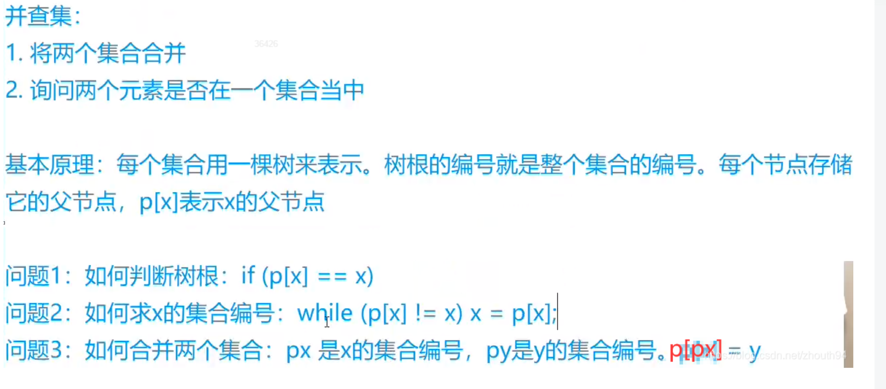
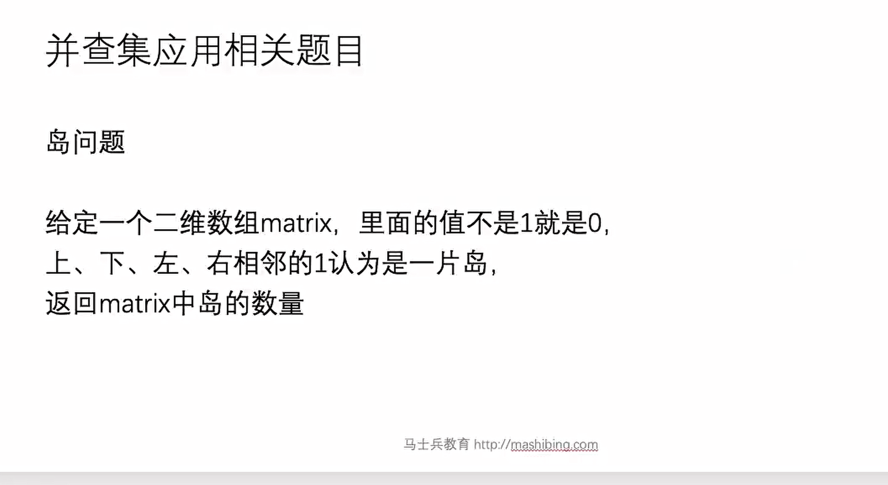

朋友圈

[547. 省份数量 - 力扣（LeetCode）](https://leetcode.cn/problems/number-of-provinces/description/)



代码实现（并查集）

```java
package class15;

public class code01_friend_circle {


    public static int findFriendCircle(int[][] M){
        int N = M.length;
        UnionFind unionFind = new UnionFind(N);
        for (int i = 0; i < N; i ++){
            for (int j = i + 1; j < N; j++){
                unionFind.union(i, j);
            }
        }
        return unionFind.setSize();
    }


    public static class UnionFind {
        private int[] parent;  //i为parent[i] = k i的代表节点为k
        private int[] sizes; //i必须为代表节点，size[i]为代表节点所代表集合的数量
        private int[] help; //路径压缩所需要的栈
        private int sets;


        public UnionFind(int N){
            parent = new int[N];
            sizes = new int[N];
            help = new int[N];
            sets = N;
            for (int i = 0; i < N; i++){
                parent[i] = i;
                sizes[i] = 1;
            }
        }

        //从index一直往上找，过程中需要路径压缩
        public int find(int index){
            int cur = 0;
            while (index != parent[index]){
                help[cur++] = index;
                index = parent[index];
            }
            //cur-- 是因为上面index = parent[index]的时候， cur多加了一次  index此时为代表节点
            //路径压缩完毕后 需要将所有路径上的节点的代表节点都改为index
            for(cur--; cur >= 0; cur--){
                parent[help[cur]] = index;
            }

            return index;
        }


        public void union(int i ,int j){
            int iHead = find(i);
            int jHead = find(j);
            if (iHead != jHead){
                if (sizes[i] >= sizes[j]){
                    sizes[iHead] += sizes[jHead];
                    parent[jHead] = iHead;
                }else{
                    sizes[jHead] += sizes[iHead];
                    parent[iHead] = jHead;
                }
                sets--;
            }
        }

        public int setSize(){
            return sets;
        }
    }
}

```

岛屿数量

[200. 岛屿数量 - 力扣（LeetCode）](https://leetcode.cn/problems/number-of-islands/description/)



代码实现

```java
package class15;


import java.util.ArrayList;
import java.util.HashMap;
import java.util.List;
import java.util.Stack;

public class code02_NumberOfIslans {


    public static int numsIsIslands1(char[][] boards){
        int islands = 0;
        for (int i = 0; i < boards.length; i++){
            for (int j = 0; j < boards[0].length; j++){
                if (boards[i][j] == '1'){
                    islands++;
                    infect(boards, i, j);
                }
            }
        }
        return islands;
    }

    //把所有连成一片的字符变为0
    public static void infect(char[][] boards, int i, int j){
        if (i < 0 || i == boards.length || j < 0 || j == boards[0].length || boards[i][j] != '1'){
            return;
        }
        boards[i][j] = 0;
        infect(boards, i - 1, j);
        infect(boards, i + 1, j);
        infect(boards, i, j - 1);
        infect(boards, i, j + 1);
    }


    public static int numsIsIslands2(char[][] boards){
        int row = boards.length;
        int col = boards[0].length;
        Dot[][] dots = new Dot[row][col];
        List<Dot> doList = new ArrayList<>();
        for (int i = 0; i < row; i++){
            for (int j = 0; j < col; j++){
                if (boards[i][j] == '1'){
                    dots[i][j] = new Dot();
                    doList.add(dots[i][j]);
                }
            }
        }
        UnionFind1<Dot> union = new UnionFind1<Dot>(doList);

        for (int j = 1; j < col; j++){
            if (boards[0][j-1] == '1' && boards[0][j] == '1'){
                union.union(dots[0][j-1], dots[0][j]);
            }
        }

        for (int i = 1; i < row; i++){
            if (boards[i-1][0] == '1' && boards[i][0] == '1'){
                union.union(dots[i-1][0], dots[i][0]);
            }
        }

        for (int i = 1; i < row; i++){
            for (int j = 1; j < col; j++){
                if (boards[i-1][j] == '1' && boards[i][j] == '1'){
                    union.union(dots[i-1][j], dots[i][j]);
                }
                if (boards[i][j-1] == '1' && boards[i][j] == '1'){
                    union.union(dots[i][j-1], dots[i][j]);
                }
            }
        }
        return union.setSize();
    }


    public static class Dot{

    }


    public static class Node<V>{
        V value;

        public Node(V data){
            this.value = data;
        }
    }
    public static class UnionFind1<V>{
        public HashMap<V,  Node<V>> nodes;
        public HashMap< Node<V>,  Node<V>> parentMaps;
        //sizeMap表示的是根节点的数量
        public HashMap< Node<V>, Integer> sizeMaps;

        public UnionFind1(List<V> list){
            nodes = new HashMap<>();
            parentMaps = new HashMap<>();
            sizeMaps = new HashMap<>();
            for (V cur : list){
                 Node<V> node = new  Node<>(cur);
                nodes.put(cur, node);
                parentMaps.put(node, node);
                sizeMaps.put(node, 1);
            }
        }

        //        给一个节点，一直往上找，找到不能找为止，把代表返回
        public  Node<V> findFather( Node<V> cur){
            Stack< Node> stack = new Stack<>();
            while(cur != parentMaps.get(cur)){
                stack.push(cur);
                cur = parentMaps.get(cur);
            }
            while(!stack.isEmpty()){
                parentMaps.put(stack.pop(), cur);
            }

            return cur;
        }

        public boolean isSameSet(V a, V b){
            return findFather(nodes.get(a)) == findFather(nodes.get(b));
        }

        public void union(V a, V b){
             Node<V> aHead = findFather(nodes.get(a));
             Node<V> bHead = findFather(nodes.get(b));
            if (aHead != bHead){
                int aSize = sizeMaps.get(aHead);
                int bSize = sizeMaps.get(bHead);
                 Node<V> bigNode = aSize > bSize ? aHead : bHead;
                 Node<V> smallNode = bigNode == aHead ? bHead : aHead;
                parentMaps.put(smallNode, bigNode);
                sizeMaps.put(bigNode, aSize + bSize);
                //保证根节点大小的唯一性
                sizeMaps.remove(smallNode);
            }
        }

        public int setSize(){
            return sizeMaps.size();
        }
    }


   public static class UnionFind2{
        private int[] parent;
        private int[] size;
        private int[] help;
        private int col;
        private int sets;

       public UnionFind2(char[][] boards){
           col = boards[0].length;
           int row = boards.length;
           int len = col * row;

           parent = new int[len];
           size = new int[len];
           help = new int[len];

           // 初始全部设为无效
           //如果不做这一步会导致把无效点也进行合并  所有合并必须是有效点  比如0,0处 parent[0] = 0,   那其他的i,j处也为0的话 两个parent都为0，就
           //会被视为同一个集合
           for (int i = 0; i < len; i++) {
               parent[i] = -1;
               size[i] = 0;
           }

           sets = 0;
           for (int i = 0; i < row; i++) {
               for (int j = 0; j < col; j++) {
                   if (boards[i][j] == '1') {
                       int idx = index(i, j);
                       parent[idx] = idx;
                       size[idx] = 1;
                       sets++;
                   }
               }
           }
       }


       public int find(int i){
           if (parent[i] == -1) {
               return -1;  // 无效点不能参与查找
           }
           int cur = 0;
           while(i != parent[i]){
               help[cur++] = i;
               i = parent[i];
           }
           for (cur-- ; cur >= 0; cur--){
               parent[help[cur]] = i;
           }
           return i;
       }

       public void union(int r1, int c1, int r2, int c2){
           int index1 = index(r1, c1);
           int index2 = index(r2, c2);

           if (parent[index1] == -1 || parent[index2] == -1) {
               return;
           }

           int f1 = find(index1);
           int f2 = find(index2);

           if (f1 != f2 && f1 != -1 && f2 != -1) {
               if (size[f1] >= size[f2]) {
                   size[f1] += size[f2];
                   parent[f2] = f1;
               } else {
                   size[f2] += size[f1];
                   parent[f1] = f2;
               }
               sets--;
           }
       }

        public int sets(){
            return sets;
        }

        public int index(int r, int c){
            return r * col + c;
        }
   }

    public static int numsIsIslands3(char[][] boards){
        int row = boards.length;
        int col = boards[0].length;

        UnionFind2 union = new UnionFind2(boards);

        for (int j = 1; j < col; j++){
            if (boards[0][j-1] == '1' && boards[0][j] == '1'){
                union.union(0, j-1, 0, j);
            }
        }

        for (int i = 1; i < row; i++){
            if (boards[i-1][0] == '1' && boards[i][0] == '1'){
                union.union(i-1, 0, i, 0);
            }
        }

        for (int i = 1; i < row; i++){
            for (int j = 1; j < col; j++){
                 if (boards[i][j] == '1'){
                     if (boards[i][j-1] == '1'){
                         union.union(i, j - 1, i, j);
                     }
                     if (boards[i-1][j] == '1'){
                         union.union(i-1, j, i, j);
                     }
                 }
            }
        }

        return union.sets;
    }

    // 为了测试
    public static char[][] generateRandomMatrix(int row, int col) {
        char[][] board = new char[row][col];
        for (int i = 0; i < row; i++) {
            for (int j = 0; j < col; j++) {
                board[i][j] = Math.random() < 0.5 ? '1' : '0';
            }
        }
        return board;
    }

    // 为了测试
    public static char[][] copy(char[][] board) {
        int row = board.length;
        int col = board[0].length;
        char[][] ans = new char[row][col];
        for (int i = 0; i < row; i++) {
            for (int j = 0; j < col; j++) {
                ans[i][j] = board[i][j];
            }
        }
        return ans;
    }

    public static void main(String[] args) {
        int row = 0;
        int col = 0;
        char[][] board1 = null;
        char[][] board2 = null;
        char[][] board3 = null;
        long start = 0;
        long end = 0;

        row = 1000;
        col = 1000;
        board1 = generateRandomMatrix(row, col);
        board2 = copy(board1);
        board3 = copy(board1);

        System.out.println("感染方法、并查集(map实现)、并查集(数组实现)的运行结果和运行时间");
        System.out.println("随机生成的二维矩阵规模 : " + row + " * " + col);

        start = System.currentTimeMillis();
        System.out.println("感染方法的运行结果: " + numsIsIslands1(board1));
        end = System.currentTimeMillis();
        System.out.println("感染方法的运行时间: " + (end - start) + " ms");

        start = System.currentTimeMillis();
        System.out.println("并查集(map实现)的运行结果: " + numsIsIslands2(board2));
        end = System.currentTimeMillis();
        System.out.println("并查集(map实现)的运行时间: " + (end - start) + " ms");

        start = System.currentTimeMillis();
        System.out.println("并查集(数组实现)的运行结果: " + numsIsIslands3(board3));
        end = System.currentTimeMillis();
        System.out.println("并查集(数组实现)的运行时间: " + (end - start) + " ms");

        System.out.println();


    }
}

```

岛屿数量2

[https://leetcode-cn.com/problems/number-of-islands-ii](https://cloud.tencent.com/developer/tools/blog-entry?target=https%3A%2F%2Fleetcode-cn.com%2Fproblems%2Fnumber-of-islands-ii&objectId=1659658&objectType=1&isNewArticle=undefined)

```java
示例:
输入: m = 3, n = 3, 
	positions = [[0,0], [0,1], [1,2], [2,1]]
输出: [1,1,2,3]
解析:
起初，二维网格 grid 被全部注入「水」。（0 代表「水」，1 代表「陆地」）
0 0 0
0 0 0
0 0 0

操作 #1：addLand(0, 0) 将 grid[0][0] 的水变为陆地。
1 0 0
0 0 0   Number of islands = 1
0 0 0

操作 #2：addLand(0, 1) 将 grid[0][1] 的水变为陆地。
1 1 0
0 0 0   岛屿的数量为 1
0 0 0

操作 #3：addLand(1, 2) 将 grid[1][2] 的水变为陆地。
1 1 0
0 0 1   岛屿的数量为 2
0 0 0

操作 #4：addLand(2, 1) 将 grid[2][1] 的水变为陆地。
1 1 0
0 0 1   岛屿的数量为 3
0 1 0

拓展：
你是否能在 O(k log mn) 的时间复杂度程度内完成每次的计算？
（k 表示 positions 的长度）
```

区别于lc200的一次性给定的地图，lc305是一个一个的操作

代码实现

```java
package class15;

import java.util.*;

public class code03_NumberOfIslandsII {


    public static List<Integer> numIsLandsII1(int m, int n, int[][] positions){
        List<Integer> ans = new ArrayList<>();
        UnionFind1 uf1 = new UnionFind1(m, n);
        for (int i = 0; i < positions.length; i++){
            ans.add(uf1.connect(positions[i][0], positions[i][1]));
        }
        return ans;

    }

    public static class UnionFind1{
        private int[] parents;
        private int[] sizes;
        private int[] help;
        private int col; //列数
        private int row; //行数
        private int sets;


        public UnionFind1(int m, int n){
            row = m;
            col = n;
            int len = m * n;
            parents = new int[len];
            sizes = new int[len];
            help = new int[len];
            sets = 0;

            for (int i = 0; i < len; i++){
                parents[i] = -1;
                sizes[i] = 0;
            }
        }


        public int index(int r, int c){
            return r * col + c;
        }

        public int find(int i){
            if (parents[i] == -1){
                return -1;
            }

            int cur = 0;
            while(i != parents[i]){
                help[cur++] = i;
                i = parents[i];
            }

            for (cur--; cur >= 0; cur--){
                parents[help[cur]] = i;
            }
            return i;
        }


        public void union(int r1, int c1, int r2, int c2){
            if (r1 < 0 || r1 >= row || r2 < 0 || r2 >= row || c1 < 0 || c1 >= col || c2 < 0 || c2 >= col) {
                return;
            }
            int i1 = index(r1, c1);
            int i2 = index(r2, c2);

            if (sizes[i1] == 0 || sizes[i2] == 0){
                return;
            }

            int f1 = find(i1);
            int f2 = find(i2);
            while(f1 != f2 && f1 != -1 && f2 != -1){
                if (sizes[f1] >= sizes[f2]) {
                    sizes[f1] += sizes[f2];
                    parents[f2] = f1;
                } else {
                    sizes[f2] += sizes[f1];
                    parents[f1] = f2;
                }
                sets--;
            }
        }

        public int connect(int r, int c){
            int index = index(r, c);
            if (sizes[index] > 0){
                return sets;
            }

            parents[index] = index;
            sizes[index] = 1;
            sets++;

            union(r - 1, c, r, c);
            union(r + 1, c, r, c);
            union(r, c - 1, r, c);
            union(r, c + 1, r, c);

            return sets;
        }
    }

    public static List<Integer> numIsLandsII2(int m, int n, int[][] positions){
        List<Integer> ans = new ArrayList<>();
        UnionFind1 uf2 = new UnionFind1(m, n);
        for (int i = 0; i < positions.length; i++){
            ans.add(uf2.connect(positions[i][0], positions[i][1]));
        }
        return ans;
    }

    public static class UnionFind2{
        private HashMap<String, String> parents;
        private HashMap<String, Integer> sizes;
        private List<String> help;
        private int  sets;

        public UnionFind2(){
            parents = new HashMap<>();
            sizes = new HashMap<>();
            help = new ArrayList<>();
            sets = 0;
        }


        public String find(String cur){
            while (cur.equals(parents.get(cur))){
                help.add(cur);
                cur = parents.get(cur);
            }

            for (String str : help){
                parents.put(str, cur);
            }

            return cur;
        }

        public void union(String s1, String s2){
            if (parents.containsKey(s1) && parents.containsKey(s2)){
                String f1 = find(s1);
                String f2 = find(s2);
                int size1 = sizes.get(s1);
                int size2 = sizes.get(s2);
                String  big = size1 > size2 ? f1 : f2;
                String  small = big == f1 ? f2 : f1;
                parents.put(small, big);
                sizes.put(big, size1 + size2);
                sizes.remove(small);
                sets--;
            }
        }


        public int connect(int r, int c){
            String key = String.valueOf(r) + "_" + String.valueOf(c);
            if (!parents.containsKey(key)){
                parents.put(key, key);
                sizes.put(key, 1);
                sets++;
                String up = String.valueOf(r - 1) + "_" + String.valueOf(c);
                String down = String.valueOf(r + 1) + "_" + String.valueOf(c);
                String left = String.valueOf(r) + "_" + String.valueOf(c - 1);
                String right = String.valueOf(r) + "_" + String.valueOf(c + 1);

                union(up, key);
                union(down, key);
                union(left, key);
                union(right, key);
            }
            return sets;
        }
    }

    public static void main(String[] args) {
        System.out.println("开始测试...");

        int testTime = 1000; // 测试次数
        boolean success = true;

        Random random = new Random();

        for (int i = 0; i < testTime; i++) {
            int m = random.nextInt(50) + 1; // 地图行数
            int n = random.nextInt(50) + 1; // 地图列数
            int k = random.nextInt(100);    // 添加陆地的操作次数

            Set<String> used = new HashSet<>();
            int[][] positions = new int[k][2];

            for (int j = 0; j < k; j++) {
                int r = random.nextInt(m);
                int c = random.nextInt(n);
                String key = r + "_" + c;
                while (used.contains(key)) {
                    r = random.nextInt(m);
                    c = random.nextInt(n);
                    key = r + "_" + c;
                }
                used.add(key);
                positions[j][0] = r;
                positions[j][1] = c;
            }

            List<Integer> ans1 =  numIsLandsII1(m, n, positions);
            List<Integer> ans2 =  numIsLandsII2(m, n, positions);

            if (!ans1.equals(ans2)) {
                System.out.println("❌ 不一致 ❌");
                System.out.println("m = " + m + ", n = " + n + ", k = " + k);
                System.out.println("ans1: " + ans1);
                System.out.println("ans2: " + ans2);
                success = false;
                break;
            }
        }

        if (success) {
            System.out.println("✅ 所有测试通过！");
        }

    }

}

```