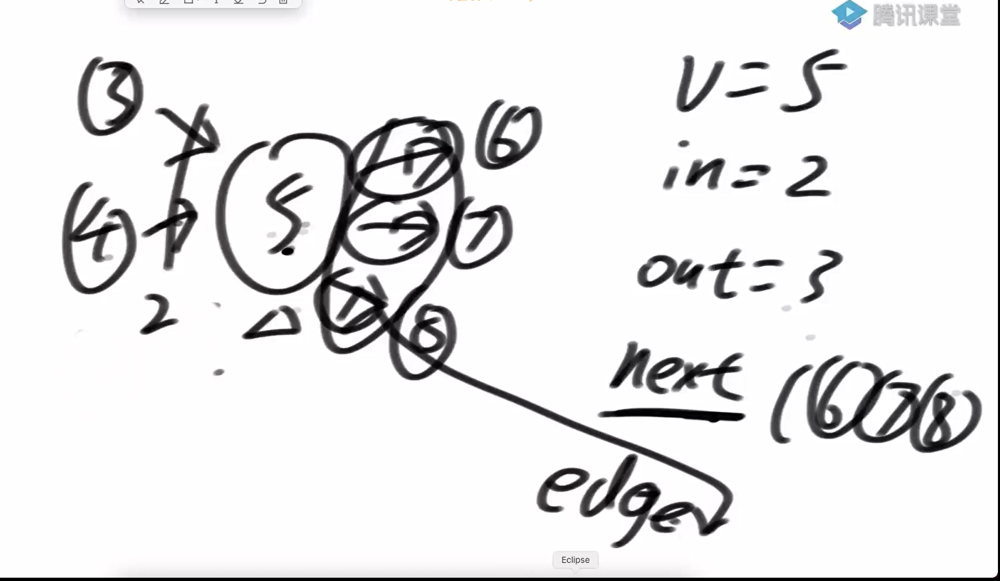
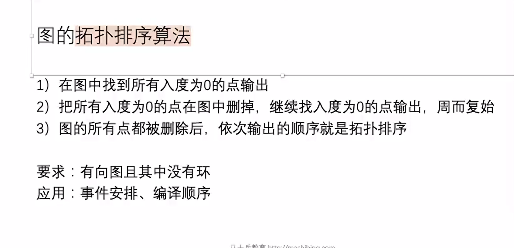
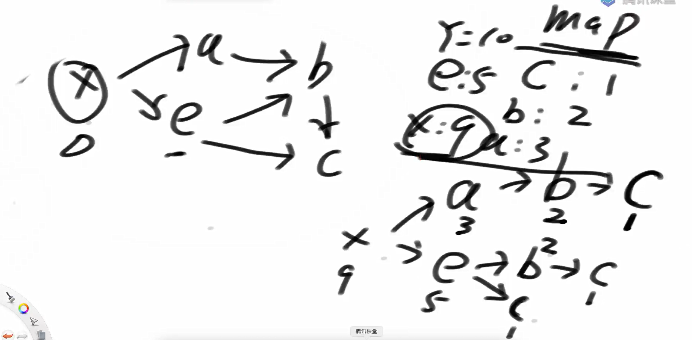
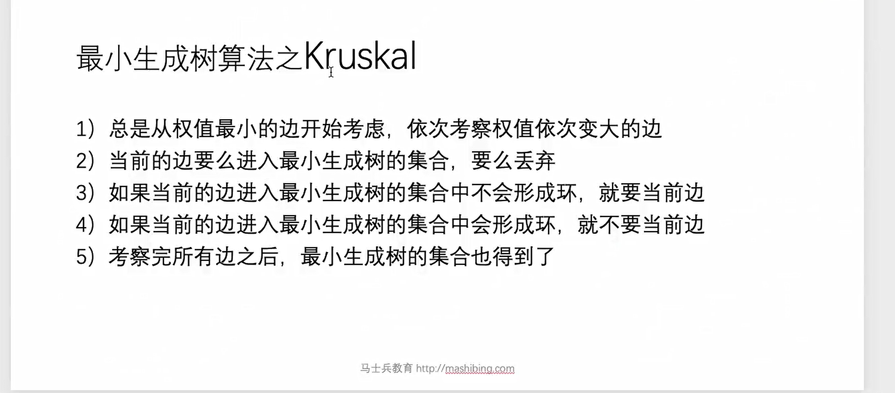
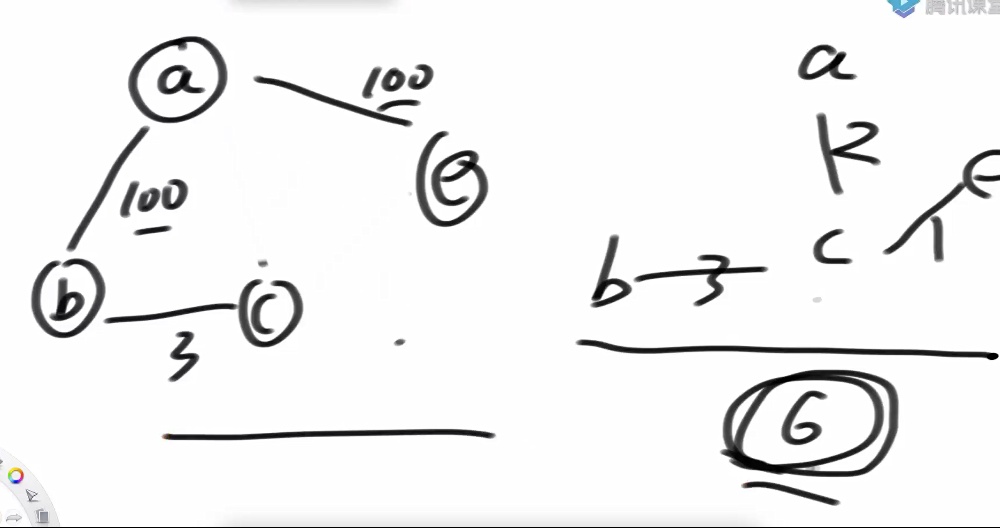
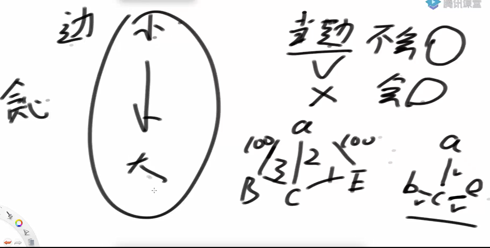

图



代码实现

深度和广度优先遍历

```java
package class16;

import java.util.HashSet;
import java.util.Stack;

public class code02_DFS {

    public static void DFS(Node start){
        if (start == null){
            return;
        }
        Stack<Node> stack = new Stack<>();
        HashSet<Node> set = new HashSet<>();
        stack.push(start);
        set.add(start);
        System.out.println(start.value);
        while (!stack.isEmpty()){
            Node cur = stack.pop();
            for (Node next : cur.nexts){
                if (!set.contains(next)){
                    stack.push(cur);
                    stack.push(next);
                    System.out.println(next.value);
                    break;
                }
            }
        }
    }
}

```

图的拓扑排序算法

什么是拓扑排序



代码实现1 

基于入度

```java
package class16;

import java.util.*;

public class code03_TopologySort {

    public static List<Node> sortedTopology(Graph graph) {
        HashMap<Node, Integer> inMap = new HashMap<>();
        Queue<Node> zeroInqQueue = new LinkedList<>();
        for (Node node : graph.nodes.values()){
            inMap.put(node, node.in);
            if (node.in == 0){
                zeroInqQueue.add(node);
            }
        }
        List<Node> result = new ArrayList<>();
        while(!zeroInqQueue.isEmpty()){
            Node cur = zeroInqQueue.poll();
            for (Node next : cur.nexts){
                inMap.put(next, inMap.get(next) - 1);
                if (inMap.get(next) == 0){
                    zeroInqQueue.add(next);
                }
            }
        }

        return  result;
    }
}

```

基于深度优先遍历的拓扑排序

OJ链接：[https://www.lintcode.com/problem/topological-sorting](https://www.lintcode.com/problem/topological-sorting)

图的拓扑排序（Topological Sorting）是对一个**有向无环图（Directed Acyclic Graph, DAG）**的所有节点进行线性排序，使得对于每一条有向边 u → v，在排序后的序列中节点 u 都出现在节点 v 之前。换句话说，如果存在从节点 x 到节点 y 的路径，则 x 在拓扑排序中的位置必须在 y 之前。

经过次数的方法实现

如果x的经过此次大于y的经过次数，则x的拓扑序一定在y之前



代码实现

```java
package class16;

import java.util.ArrayList;
import java.util.Comparator;
import java.util.HashMap;

public class code03_TopologicalOrderDFS2 {
    // 不要提交这个类
    public static class DirectedGraphNode {
        public int label;
        public ArrayList<DirectedGraphNode> neighbors;

        public DirectedGraphNode(int x) {
            label = x;
            neighbors = new ArrayList<DirectedGraphNode>();
        }
    }

    // 提交下面的
    public static class Record {
        public DirectedGraphNode node;
        public long nodes;

        public Record(DirectedGraphNode node, long nodes) {
            this.node = node;
            this.nodes = nodes;
        }
    }


    public static class MyComparator implements Comparator<Record> {


        @Override
        public int compare(Record o1, Record o2) {
            return o1.nodes == o2.nodes ? 0 : o1.nodes > o2.nodes ? -1 : 1;
        }
    }
    public static ArrayList<  DirectedGraphNode> topSort(ArrayList<  DirectedGraphNode> graph){
        HashMap<  DirectedGraphNode, Record> order = new HashMap<>();
        for (  DirectedGraphNode cur : graph){
            f(cur, order);
        }
        ArrayList<Record> recordArray = new ArrayList<>();
        for (Record r : order.values()){
            recordArray.add(r);
        }
        recordArray.sort(new MyComparator());

        ArrayList<  DirectedGraphNode> ans = new ArrayList<>();
        for (Record r : recordArray){
            ans.add(r.node);
        }
        return ans;
    }


    public static Record f(DirectedGraphNode cur, HashMap<DirectedGraphNode, Record> order){
        if (order.containsKey(cur)){
            return order.get(cur);
        }
        long nodes = 0;
        for (DirectedGraphNode next : cur.neighbors){
            nodes += f(next, order).nodes;
        }
        Record ans = new Record(cur, nodes+1);
        order.put(cur, ans);
        return ans;
    }
}

```

最小生成树算法



比如



实现思路



代码实现

```java
package class16;

import java.util.*;

public class code04_Code04_Kruskal {

    public static class UnionFind1{
        private HashMap<Node, Node> parents;
        private HashMap<Node, Integer> sizes;


        public UnionFind1(){
            parents = new HashMap<>();
            sizes = new HashMap<>();
        }

        public void makeSets(Collection<Node> nodes){
            parents.clear();
            sizes.clear();
            for (Node cur : nodes){
                parents.put(cur, cur);
                sizes.put(cur, 1);
            }
        }

        private Node findParent(Node cur){
            Stack<Node> path = new Stack<>();
            while(cur != parents.get(cur)){
                path.push(cur);
                cur = parents.get(cur);
            }
            while(!path.isEmpty()){
                parents.put(path.pop(), cur);
            }

            return cur;
        }


        public boolean isSameUnion(Node a, Node b){
            return findParent(a) == findParent(b);
        }

        public void union(Node a, Node b){
            if (a == null || b == null){
                return;
            }
            Node aHead = findParent(a);
            Node bHead = findParent(b);

            if (aHead != bHead){
                int aSize = sizes.get(aHead);
                int bSize = sizes.get(bHead);
                if (aSize <= bSize){
                    parents.put(aHead, bHead);
                    sizes.put(bHead, aSize + bSize);
                    sizes.remove(aHead);
                }else{
                    parents.put(bHead, aHead);
                    sizes.put(aHead, aSize + bSize);
                    sizes.remove(bHead);
                }
            }

        }
    }

    public static class EdgeComparator implements Comparator<Edge> {

        @Override
        public int compare(Edge o1, Edge o2) {
            return o1.weight - o2.weight;
        }
    }

    public static Set<Edge> getKruska(Graph graph){
        UnionFind1 unf = new UnionFind1();
        unf.makeSets(graph.nodes.values());

        PriorityQueue<Edge> queue = new PriorityQueue<>(new EdgeComparator());
        for (Edge e : graph.edges){
            queue.add(e);
        }

        Set<Edge> result = new HashSet<>();
        while(!queue.isEmpty()){
            Edge e = queue.poll();
            if (!unf.isSameUnion(e.from, e.in)){
                result.add(e);
                unf.union(e.from, e.in);
            }
        }
        return result;
    }
}

```

最小生成树算法Prim

```java
package class16;

import java.util.Comparator;
import java.util.HashSet;
import java.util.PriorityQueue;
import java.util.Set;

public class code05_Prim {


    public static class mstComparator implements Comparator<Edge> {

        @Override
        public int compare(Edge o1, Edge o2) {
            return o1.weight - o2.weight;
        }
    }

    public static Set<Edge> PrimMST(Graph graph){
        PriorityQueue<Edge> queue = new PriorityQueue<>(new mstComparator());
        HashSet<Node> set = new HashSet<>();
        HashSet<Edge> result = new HashSet<>();
        for (Node cur : graph.nodes.values()){
            if (!set.contains(cur)){
                set.add(cur);
                for (Edge edge : cur.edges){
                    queue.add(edge);
                }

                while (!queue.isEmpty()){
                    Edge edge = queue.poll();
                    Node toNode = edge.to;
                    if (!set.contains(toNode)){
                        result.add(edge);
                        set.add(toNode);
                        for (Edge toEdge : toNode.edges){
                            queue.add(toEdge);
                        }
                    }
                }
            }
        }
        return result;
    }


//    Prim 算法要求图中每条边的权重都必须是非负数。这意味着 graph[i][j] >= 0
//    必须对所有有效的 i 和 j 成立。如果两个节点之间没有直接连接，
//    则可以将它们之间的权重视为无穷大（例如，可以使用一个非常大的整数值来表示这种情况，
//    如 Integer.MAX_VALUE

    public static int Prim(int[][] graph){
        int nodeNum = graph.length;
        int[] distance = new int[nodeNum];
        boolean[] visted = new boolean[nodeNum];


        // 0 到各个点的距离
        visted[0] = true;
        for (int i = 0; i < nodeNum; i++){
            distance[i] = graph[0][i];
        }
        int sum = 0;

        //此时mst中只有节点0；
        for (int j = 1; j < nodeNum; j++){
            //当前mst中最小代价的路
            int minPath = Integer.MAX_VALUE;
            //最小代价路的节点是
            int minIndex = -1;
            for (int i = 0; i < nodeNum; i++){
                if (!visted[i] && minPath > distance[i]){
                    //找到当前mst的联通的最小的路
                    minPath = distance[i];
                    minIndex = i;
                }
            }
            //如果当前mst没有联通的点了返回sum
            if (minIndex == -1){
                return sum;
            }
            //将最小路对应的节点加入到mst中
            visted[minIndex] = true;
            sum += minPath;
            //更新新的mst对应的distance
            for (int i = 0; i < nodeNum; i++){
                if (!visted[i] && distance[i] > graph[minIndex][i]){
                    distance[j] = graph[minIndex][i];
                }
            }
        }
        return sum;
    }
}

```

迪杰特斯拉的算法在这里不处理负权重，原本要求是不处理负的环

代码实现

```java
package class16;

import java.util.ArrayList;
import java.util.HashMap;
import java.util.HashSet;
import java.util.Map;

public class code06_Dijkstra {


    public static class Node {
        public int value;
        public ArrayList<Edge> edges;

        public Node(int value) {
            this.value = value;
            this.edges = new ArrayList<>();  // ⚠️ 必须初始化！
        }
    }

    public static class Edge {
        public int weight;
        public Node from;
        public Node to;

        public Edge(int weight, Node from, Node to) {
            this.weight = weight;
            this.from = from;
            this.to = to;  // ⚠️ 必须包含这一行！
        }
    }

    public static HashMap<Node, Integer> dijkstra1(Node from){
        HashMap<Node, Integer> distanceMap = new HashMap<>();
        distanceMap.put(from, 0);
        HashSet<Node> selectedNode = new HashSet<>();
        Node minNode = getMinDistanceAndUnselectedNode(distanceMap, selectedNode);
        while(minNode != null){
            //minNode 是跳转点 也是刷新后的参考点
            int distance = distanceMap.get(minNode);
            for (Edge edge : minNode.edges){
                Node toNode = edge.to;
                if (!distanceMap.containsKey(toNode)){
                    distanceMap.put(toNode, distance + edge.weight);
                }else{
                    distanceMap.put(toNode, Math.min(distanceMap.get(toNode), distance + edge.weight));
                }
            }
            selectedNode.add(minNode);
            minNode = getMinDistanceAndUnselectedNode(distanceMap, selectedNode);
        }
        return distanceMap;
    }


    public static Node getMinDistanceAndUnselectedNode(HashMap<Node, Integer> selectedMap, HashSet<Node> selectedNode){
        Node minNode = null;
        int minDistance = Integer.MAX_VALUE;
        for (Map.Entry<Node, Integer> entry : selectedMap.entrySet()){
            Node node = entry.getKey();
            int distance = entry.getValue();
            if (!selectedNode.contains(node) && distance < minDistance){
                minNode = node;
                minDistance = distance;
            }
        }
        return minNode;
    }


    public static class NodeRecord{
        public Node node;
        public int distance;

        public NodeRecord(Node node, int distance){
            this.node = node;
            this.distance = distance;
        }
    }

    public static class NodeHeap{
        public Node[] nodes;
        public HashMap<Node, Integer> heapIndexMap; //节点在索引中的位置
        public HashMap<Node, Integer> distanceMap;
        public int size;

        public NodeHeap(int size){
            nodes = new Node[size];
            heapIndexMap = new HashMap<>();
            distanceMap = new HashMap<>();
            this.size = 0;
        }

        public boolean isEmpty(){
            return size == 0;
        }

       private boolean isEntered(Node node){
            return heapIndexMap.containsKey(node);
       }

//      private boolean inHeap(Node node){
//            return isEntered(node) && distanceMap.get(node) != -1;
//       }

       private boolean inHeap(Node node){
            return isEntered(node) && distanceMap.containsKey(node) && distanceMap.get(node) != -1;
        }

       private void heapIfy_up(Node node, int index){
            while(distanceMap.get(nodes[index]) < distanceMap.get(nodes[(index - 1) / 2])){
                swap(index, (index - 1) / 2);
                index = (index - 1) / 2;
            }
       }


       private void heapIfy_down(int index, int size){
            int left = index * 2 + 1;
            while(left < size){
                int smallIndex = left + 1 < size && distanceMap.get(nodes[left + 1]) < distanceMap.get(nodes[left]) ? left + 1: left;
                smallIndex = distanceMap.get(nodes[smallIndex]) < distanceMap.get(nodes[index]) ? smallIndex : index;
                if (smallIndex == index) break;
                swap(smallIndex, index);
                index = smallIndex;
                left = index * 2 + 1;
            }
       }

       private void swap(int index1, int index2){
            heapIndexMap.put(nodes[index1], index2);
            heapIndexMap.put(nodes[index2], index1);
            Node temp = nodes[index1];
            nodes[index1] = nodes[index2];
            nodes[index2] = temp;
       }

       public NodeRecord pop(){
            NodeRecord nodeRecord = new NodeRecord(nodes[0], distanceMap.get(nodes[0]));
            swap(0, size-1);
            //标记为以移除
            heapIndexMap.put(nodes[size - 1], -1);
            distanceMap.remove(nodes[size - 1]);
            nodes[size - 1] = null;
            heapIfy_down(0, size-1);
            this.size--;
            return nodeRecord;
       }

       public void addOrUpdateOrIngore(Node node, int distance){
            if (inHeap(node)){
                distanceMap.put(node, Math.min(distanceMap.get(node), distance));
                heapIfy_up(node, heapIndexMap.get(node));
            }
            if (!isEntered(node)){
                nodes[size] = node;
                heapIndexMap.put(node, size);
                distanceMap.put(node, distance);
                heapIfy_up(node, size++);
            }
       }
    }

    public static HashMap<Node, Integer> dijkstra2(Node head, int size) {

        NodeHeap nodeHeap = new NodeHeap(size);
        nodeHeap.addOrUpdateOrIngore(head, 0);
        HashMap<Node, Integer> result = new HashMap<>();
        while(!nodeHeap.isEmpty()){
            NodeRecord record = nodeHeap.pop();
            Node cur = record.node;
            int distance = record.distance;
            for (Edge edge : cur.edges) {
                System.out.println("Processing edge from " + cur.value + " to " + edge.to.value + " with weight " + edge.weight);
                if (edge.to == null) {
                    System.out.println("Error: Found an edge with a null 'to' node.");
                }
                nodeHeap.addOrUpdateOrIngore(edge.to, edge.weight + distance);
            }
            result.put(cur, distance);
        }
        return result;
    }
    // 判断两个 HashMap 是否相等
    private static boolean isEqual(HashMap<Node, Integer> map1, HashMap<Node, Integer> map2) {
        if (map1.size() != map2.size()) return false;
        for (Node node : map1.keySet()) {
            if (!map2.containsKey(node)) return false;
            if (!map1.get(node).equals(map2.get(node))) return false;
        }
        return true;
    }


    private static void printGraph(HashMap<Integer, Node> nodeMap) {
        for (Node node : nodeMap.values()) {
            System.out.println("Node " + node.value + " connects to:");
            for (Edge edge : node.edges) {
                if (edge.to != null)
                    System.out.println("  -> " + edge.to.value + " (weight: " + edge.weight + ")");
                else
                    System.out.println("  -> NULL NODE");
            }
        }
    }
    // 主测试函数
    public static void main(String[] args) {
        int testTime = 100;     // 测试次数
        int maxNodes = 20;      // 每个图最多节点数
        int maxEdges = 50;      // 每个图最多边数
        int maxValue = 100;     // 边权最大值

        System.out.println("开始对拍测试...");

        for (int i = 1; i <= testTime; i++) {
            // 随机生成图
            int nodeNum = (int)(Math.random() * maxNodes) + 1;
            HashMap<Integer, Node> nodeMap = new HashMap<>();
            for (int j = 0; j < nodeNum; j++) {
                nodeMap.put(j, new Node(j));
            }

            int edgeNum = (int)(Math.random() * maxEdges) + 1;
            for (int j = 0; j < edgeNum; j++) {
                int from = (int)(Math.random() * nodeNum);
                int to = (int)(Math.random() * nodeNum);
                int weight = (int)(Math.random() * maxValue) + 1;
                if (from == to) continue;

                Node fromNode = nodeMap.get(from);
                Node toNode = nodeMap.get(to);

                // ⚠️ 增加 null 检查，防止构造 null 边
                if (fromNode != null && toNode != null) {
                    fromNode.edges.add(new Edge(weight, fromNode, toNode));
                }
            }

            Node start = nodeMap.get(0);
          

            printGraph(nodeMap); // 放在 main 中生成完图之后、运行算法之前
            // 运行两个算法
            HashMap<Node, Integer> res1 = dijkstra1(start);
            HashMap<Node, Integer> res2 = dijkstra2(start, nodeNum);

            // 比较结果
            if (isEqual(res1, res2)) {
                System.out.println("第 " + i + " 次测试通过 ✅");
            } else {
                System.out.println("第 " + i + " 次测试失败 ❌");
                System.out.println("暴力版结果：" + res1);
                System.out.println("堆优化版结果：" + res2);
                break;
            }
        }
    }

}


```