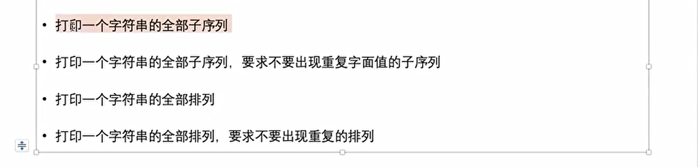

尝试



打印全部子序列

```java
package class17;

import java.util.ArrayList;
import java.util.HashSet;
import java.util.List;

public class code03_printSubString {

    public static List<String> getSubString(String str){
        char[] arr = str.toCharArray();
        List<String> ans = new ArrayList<>();
        String path = "";
        process1(arr, ans, 0, path);
        return ans;
    }


    public static void process1(char[] arr, List<String> ans, int index, String path){
        if (index == arr.length){
            ans.add(path);
            return;
        }
        String no = path;
        process1(arr, ans, index + 1, no);
        String yes = path + String.valueOf(arr[index]);
        process1(arr, ans, index + 1, yes);
    }

    public static HashSet<String> getSubStringNoRepeat(String str){
        char[] arr = str.toCharArray();
        HashSet<String> ans = new HashSet<>();
        String path = "";
        process2(arr, ans, 0, path);
        return ans;
    }


    public static void process2(char[] arr, HashSet<String> ans, int index, String path){
        if (index == arr.length){
            ans.add(path);
            return;
        }
        String no = path;
        process2(arr, ans, index+1, no);
        String yes = path + String.valueOf(arr[index]);
        process2(arr, ans, index + 1, yes);
    }


    public static void main(String[] args) {
        String str = "abcd";
        List<String> subString = getSubString(str);
        HashSet<String> subStringNoRepeat = getSubStringNoRepeat(str);


        for (String s : subString){
            System.out.print(s + " ");
        }
        System.out.println();
        for (String s: subStringNoRepeat){
            System.out.print(s + " ");
        }
    }


}

```

全排列

```java
package class17;

import java.util.ArrayList;
import java.util.List;

public class code04_PrintAllPermutations {

    public static List<String> permutation1(String s){
        List<String> ans = new ArrayList<>();
        char[] str = s.toCharArray();
        List<Character> rest = new ArrayList<>();
        for (char c : str){
            rest.add(c);
        }
        String path = "";
        f(rest, ans, path);
        return ans;
    }

   public static void f(List<Character> rest, List<String> ans,String path){
        if (rest.isEmpty()){
            ans.add(path);
        }else{
            int N = rest.size();
            for (int i = 0; i < N; i++){
                char cur = rest.get(i);
                rest.remove(i);
                f(rest, ans,path + cur);
                rest.add(i, cur);
            }
        }
   }


   public static List<String> permutation2(String s){
        List<String> ans = new ArrayList<>();
        if (s == null || s.length() == 0){
            return ans;
        }
        char[] str = s.toCharArray();
        f2(str, 0, ans);
        return ans;

   }

   public static void f2(char[] str, int index, List<String> ans){
        if (index == str.length){
            ans.add(String.valueOf(str));
            return;
        }else{
            for (int i = index; i < str.length ; i++){
                swap(str, index, i);
                f2(str, index+ 1, ans);
                swap(str, index, i);
            }
        }
   }

    public static List<String> permutation3(String s){
        List<String> ans = new ArrayList<>();
        if (s == null || s.length() == 0){
            return ans;
        }
        char[] str = s.toCharArray();
        f3(str, 0, ans);
        return ans;

    }

    public static void f3(char[] str, int index, List<String> ans){
        if (index == str.length){
            ans.add(String.valueOf(str));
            return;
        }else{
            boolean[] visted = new boolean[256];
            for (int i = index; i < str.length ; i++){
                if (!visted[i]){
                    visted[i] = true;
                    swap(str, index, i);
                    f2(str, index+ 1, ans);
                    swap(str, index, i);
                }
            }
        }
    }


   public static void swap(char[] str, int i, int j){
        char temp = str[i];
        str[i] = str[j];
        str[j] = temp;
   }

    public static void main(String[] args) {
        String str = "aabc";
        List<String> strings1 = permutation1(str);

        for (String s: strings1){
            System.out.print(s + " ");
        }
        System.out.println();


        List<String> strings2 = permutation2(str);

        for (String s: strings2){
            System.out.print(s + " ");
        }
        System.out.println();

        List<String> strings3 = permutation3(str);

        for (String s: strings3){
            System.out.print(s + " ");
        }
        System.out.println();
    }
}

```

逆序一个栈但不使用额外空间

思路，用递归得到栈底元素，然后通过回溯得到逆序

```java
package class17;

import java.util.Stack;

public class code05_ReverseStackUsingRecursive {


    //得到栈底元素(栈底元素已移除)
    public static int f(Stack<Integer> stack){
        int result = stack.pop();
        if (stack.isEmpty()){
            return result;
        }else{
            int last = f(stack);
            stack.push(result);
            return last;
        }
    }

    public static void reverse(Stack<Integer> stack){
        if (stack.isEmpty()){
            return;
        }
        int i = f(stack);
        reverse(stack);
        stack.push(i);
    }

    public static void main(String[] args) {
        Stack<Integer> test = new Stack<Integer>();
        test.push(1);
        test.push(2);
        test.push(3);
        test.push(4);
        test.push(5);
        reverse(test);
        while (!test.isEmpty()) {
            System.out.println(test.pop());
        }
    }
}

```