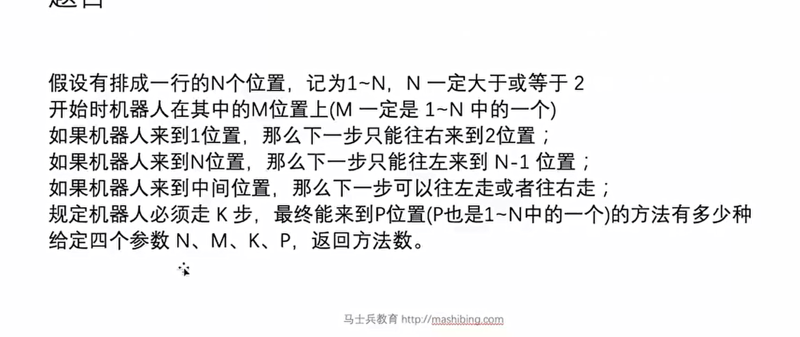
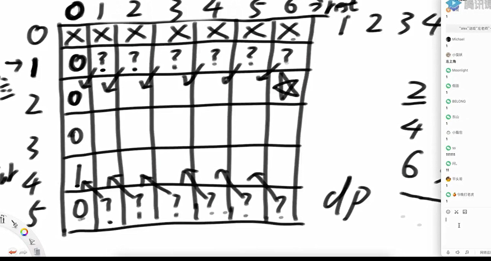
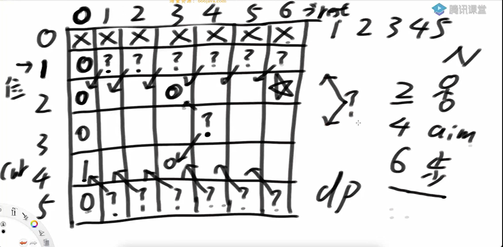
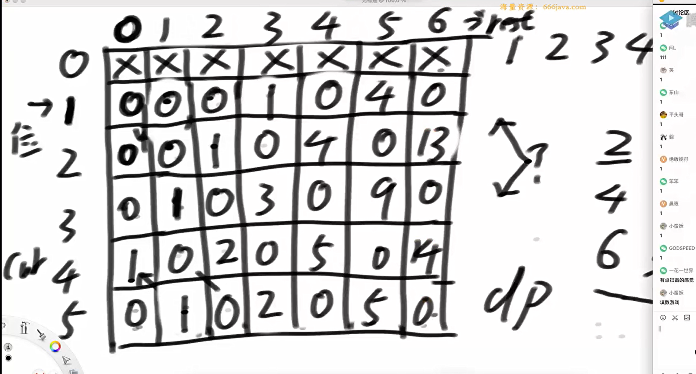
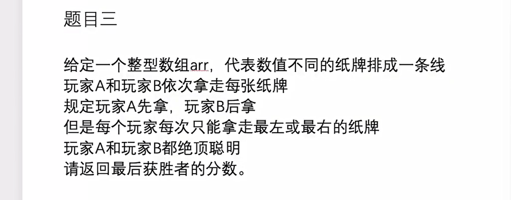
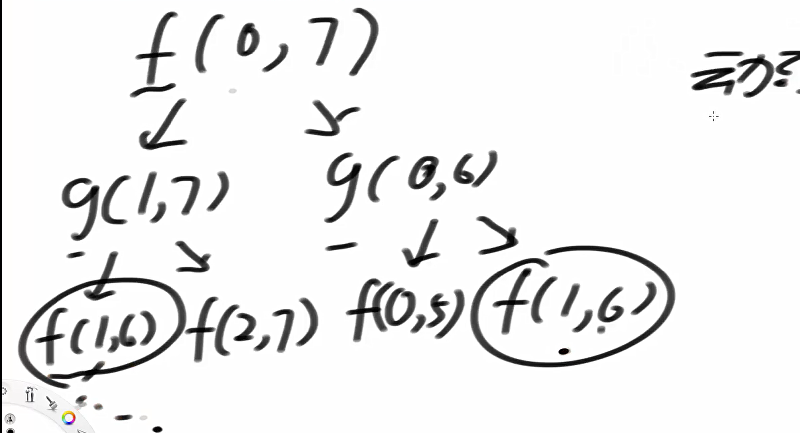
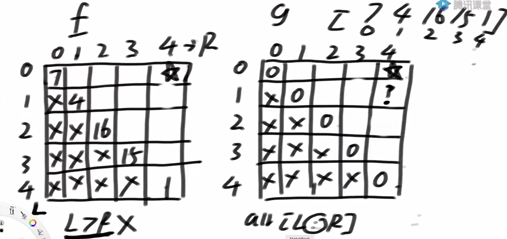
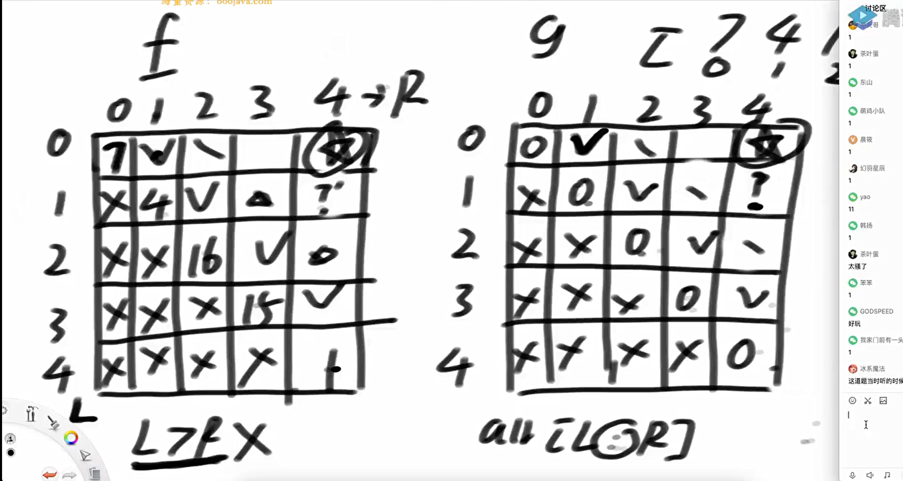
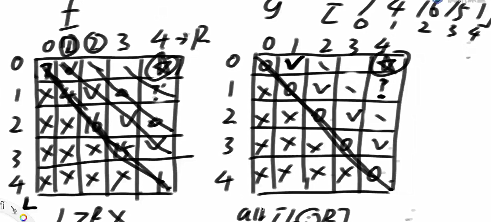

机器人



dp依赖逻辑





怎么填这张表



怎么实现

```java
package class18;

public class code01_robotWalk {


//    假设有排成一行的N个位置，记为1~N，N一定大于或等于2。
//    开始时机器人在其中的M位置上（M一定是1~N中的一个）。
//    如果机器人来到1位置，那么下一步只能往右来到2位置；
//    如果机器人来到N位置，那么下一步只能往左来到N-1位置；
//    如果机器人来到中间位置，那么下一步可以往左走或者往右走；
//    规定机器人必须走K步，最终能来到P位置（P也是1~N中的一个）的方法有多少种？
//    给定四个参数N、M、K、P，返回方法数。

    //常规递归方法

    public static int  ways1(int N, int start, int aim, int K){
        if (N < 2 || start < 1 || start > N || aim < 1 || aim > N || K < 1){
            return -1;
        }
        return process1(start, K, aim, N);
    }

    //cur是当前走到哪里了，rest是剩余的步数，aim是目标，N要走多少步
    public static int process1(int cur, int rest, int aim, int N){
        if (rest == 0){
            return cur == aim ? 1 : 0;
        }
        if (cur == 1){ //1 -> 2
            return process1(2, rest - 1, aim, N);
        }
        if (cur == N){//N -> N-1
            return process1(N-1, rest-1, aim, N);
        }
        return process1(cur-1, rest-1, aim, N) + process1(cur+1, rest-1, aim, N);
    }


    //增加一个缓存表
    public static int  ways2(int N, int start, int aim, int K){
        if (N < 2 || start < 1 || start > N || aim < 1 || aim > N || K < 1){
            return -1;
        }
        //行为cur 列为rest (cur != 0 rest可以为0 所以第一行无效)
        int[][] dp = new int[N+1][K+1];
        for (int i = 0; i <= N; i++) {
            for (int j = 0; j <= K; j++) {
                dp[i][j] = -1;
            }
        }
        return process2(start, K, aim, N, dp);
    }

    public static int process2(int cur, int rest, int aim, int N, int[][] dp){
        if (dp[cur][rest] != -1){
            return dp[cur][rest];
        }
        int ans = 0;
        if (rest == 0){
           ans = cur == aim ? 1 : 0;
        }else if (cur == 1){ //1 -> 2
           ans = process2(2, rest - 1, aim, N, dp);
        }else if (cur == N){//N -> N-1
            ans = process2(N-1, rest-1, aim, N,dp);
        }else {
            ans = process2(cur-1, rest-1, aim, N, dp) + process2(cur+1, rest-1, aim, N, dp);
        }
        dp[cur][rest] = ans;
        return ans;
    }

    public static int ways3(int N, int start, int aim, int K){
        if (N < 2 || start < 1 || start > N || aim < 1 || aim > N || K < 1){
            return -1;
        }
        int[][] dp = new int[N+1][K+1];
        dp[aim][0] = 1;

        for (int rest = 1; rest <= K; rest++){
            dp[1][rest] = dp[2][rest-1];
            for (int cur=2; cur <= N-1; cur++){
                dp[cur][rest] = dp[cur-1][rest-1] + dp[cur+1][rest-1];
            }
            dp[N][rest] = dp[N-1][rest-1];
        }

        return dp[start][K];
    }


    public static void main(String[] args) {
        System.out.println(ways1(5, 2, 4, 6));
        System.out.println(ways2(5, 2, 4, 6));
        System.out.println(ways3(5, 2, 4, 6));
    }

}

```

纸牌



抽象问题要转换为具体问题进行分析

比如先规定一个小的数据范围，然后找依赖关系。

进行展开之后，发现可合并的部分，就可以使用dp



动态规划起始位置和目标位置



得到起始位置目标位置之后，通过递归函数得到依赖



循环数据的参考



确定其实状态，目标状态，依赖逻辑后

打表就可以了

代码实现如下

```java
package class18;

public class code02_CardsInLine {

    public static int win1(int[] arr){
        if (arr == null || arr.length == 0){
            return 0;
        }
        int first = f1(arr, 0, arr.length - 1);
        int second = g1(arr, 0, arr.length - 1);
        return Math.max(first, second);
    }
    //f1是先手
    public static int f1(int[] arr, int L, int R){
        if (L == R){
            return arr[L];
        }
        //做先手取左面。然后在[L+1, R]中做后手
        int p1 = arr[L] + g1(arr, L+1, R);
        //做先手取右面。然后在[L, R-1]中做后手
        int p2 = arr[R] + g1(arr, L, R-1);
        //取最大值
        return Math.max(p1, p2);
    }

    //g1作为后手
    public static int g1(int[] arr, int L, int R){
        //只剩一个单位的时候，g1作为后手取不到。
        if (L == R){
            return 0;
        }
        //g1取后手，先手取了L
        int p1 = f1(arr, L+1, R);
        //g1取后手，先手取了R
        int p2 = f1(arr, L, R-1);
        //由于先手最优，那么后手获得的一定是先手取完数后的较小数
        return Math.min(p1, p2);
    }

    public static int win2(int[] arr){
        if (arr == null || arr.length == 0){
            return 0;
        }
        int N = arr.length;
        int[][] fmp = new int[N][N];
        int[][] gmp = new int[N][N];
        for (int i=0; i < N; i++){
            for (int j=0; j < N; j++){
                fmp[i][j] = -1;
                gmp[i][j] = -1;
            }
        }

        int first = f2(arr, 0, arr.length - 1, fmp, gmp);
        int second = g2(arr, 0, arr.length - 1, fmp, gmp);
        return Math.max(first, second);
    }

    public static int f2(int[] arr, int L, int R, int[][] fmp, int[][] gmp){
        if (fmp[L][R] != -1){
            return fmp[L][R];
        }
        int ans = 0;
        if (L == R){
            ans = arr[L];
        }else {
            int p1 = arr[L] + g2(arr, L+1, R, fmp, gmp);
            int p2 = arr[R] + g2(arr, L, R-1, fmp, gmp);
            ans = Math.max(p1, p2);
        }
        fmp[L][R] = ans;
        return ans;
    }

    public static int g2(int[] arr, int L, int R, int[][] fmp, int[][] gmp){
        if (gmp[L][R] != -1){
            return gmp[L][R];
        }
        int ans = 0;
        if (L == R){
            ans = 0;
        }else{
            int p1 = f2(arr, L+1, R, fmp, gmp);
            int p2 = f2(arr, L, R-1, fmp, gmp);
            ans = Math.min(p1, p2);
        }
        gmp[L][R] = ans;
        return ans;
    }


    public static int win3(int[] arr){
        if (arr == null || arr.length == 0){
            return 0;
        }
        int N = arr.length;
        int[][] fmp = new int[N][N];
        int[][] gmp = new int[N][N];
        for(int startCol = 1; startCol < N; startCol++){
            int L = 0;
            int R = startCol;
            while(R < N){
                fmp[L][R] = Math.max(arr[L] + gmp[L+1][R], arr[R] + gmp[L][R-1]);
                gmp[L][R] = Math.min(fmp[L+1][R], fmp[L][R-1]);
                L++;
                R++;
            }
        }
        return Math.max(fmp[0][N-1], gmp[0][N-1]);

    }
    public static void main(String[] args) {
        int[] arr = { 5, 7, 4, 5, 8, 1, 6, 0, 3, 4, 6, 1, 7 };
        System.out.println(win1(arr));
        System.out.println(win2(arr));
        System.out.println(win3(arr));
    }

}

```