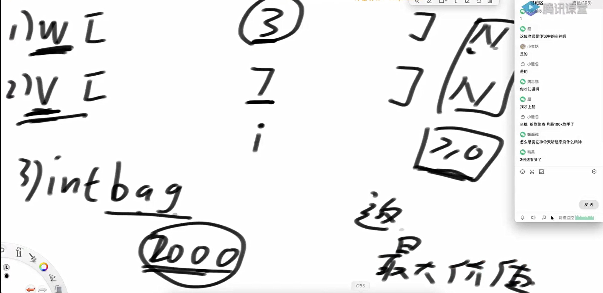
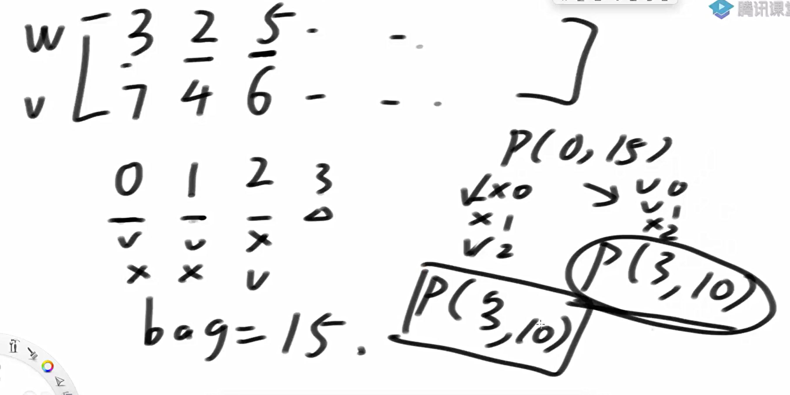
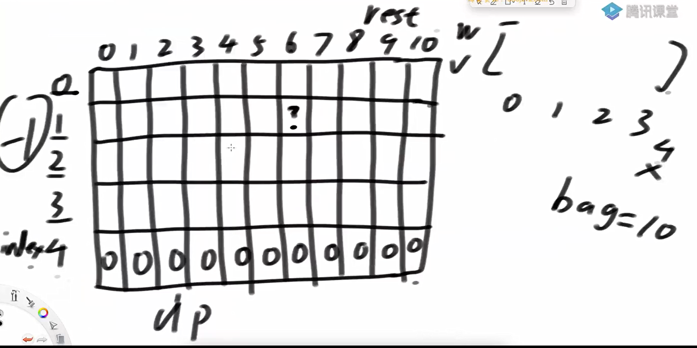
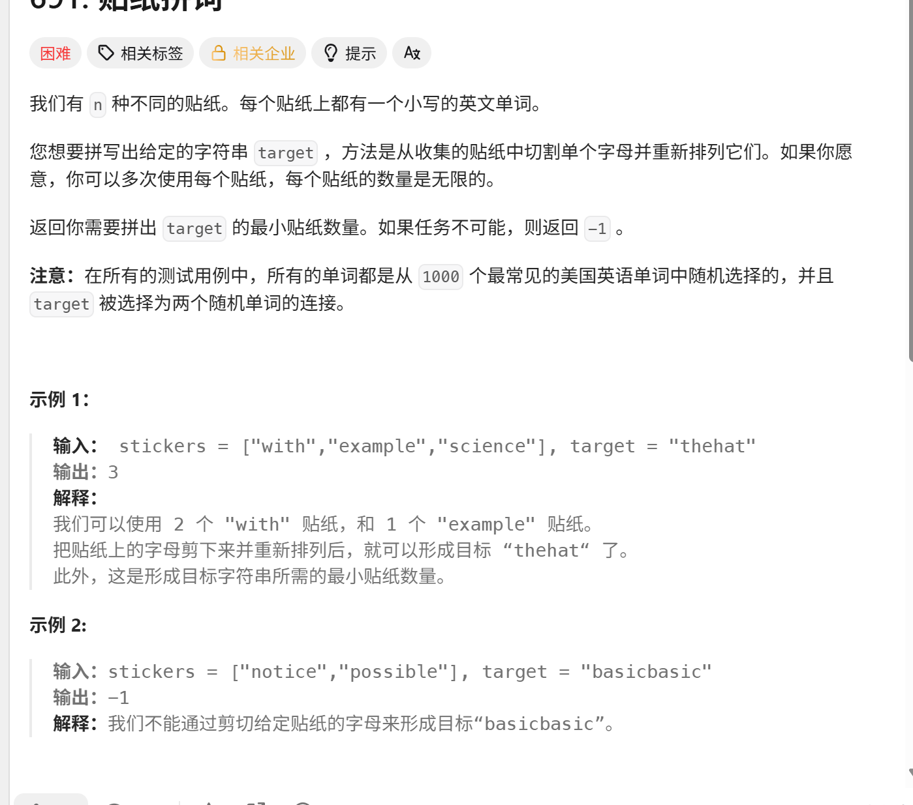
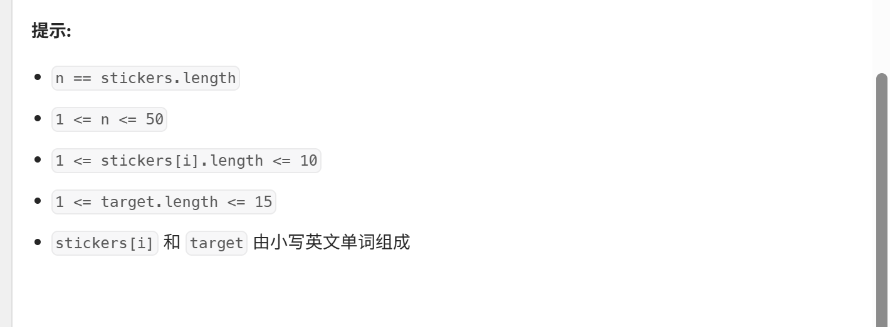
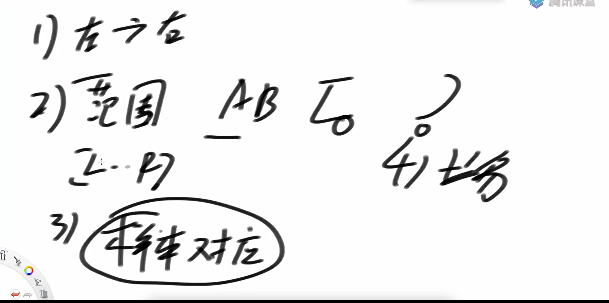

给定固定的背包容量



最大价值是多少

重复过程发现



动态转移方程就是尝试策略



代码实现

```java
package class19;

public class code01_Knapsack {

    public static int maxValue1(int[] w, int[] v, int bag){
        if (w == null || v == null || w.length != v.length || w.length == 0) {
            return 0;
        }
        return process1(w, v, 0, bag);
    }

    public static int process1(int[] w, int[] v, int index, int rest){
        if (rest < 0){
            return -1;
        }
        if (index == w.length){
            return 0;
        }
        //index不要货
        int p1 = process1(w, v, index+1, rest);
        //index要货
        int p2 = 0;
        int next = process1(w, v, index+1, rest - w[index]);
        if (next != -1){
            p2 = v[index] + next;
        }
        return Math.max(p1, p2);
    }


    public static int maxValue2(int[] w, int[] v, int bag){
        if (w == null || v == null || w.length != v.length || w.length == 0) {
            return 0;
        }
        int N = w.length;
        //index rest为变量 index的范围0-N-1；rest的范围 负数-bag
        int[][] dp = new int[N+1][bag+1];

        for (int index=N-1; index>=0; index--){
            for (int rest=0; rest <= bag; rest++){
                //index不要货
                int p1 = dp[index+1][rest];
                //index要货
                int p2 = 0;
                int next = rest - w[index] < 0 ? -1 : dp[index+1][rest-w[index]];
                if (next != -1){
                    p2 = v[index] + next;
                }
                dp[index][rest] = Math.max(p1, p2);
            }
        }
        return dp[0][bag];
    }
    public static void main(String[] args) {
        int[] weights = { 3, 2, 4, 7, 3, 1, 7 };
        int[] values = { 5, 6, 3, 19, 12, 4, 2 };
        int bag = 15;
        System.out.println(maxValue1(weights, values, bag));
        System.out.println(maxValue2(weights, values, bag));
    }
}

```

规定1和A对应、2和B对应、3和C对应...那么一个数字字符串比如"111"就可以转化为:"AAA"、"KA"和"AK"给定一个只有数字字符组成的字符串str，返回有多少种转化结果

代码实现

老方法

先确定index的范围是0-N

然后确定边界dp[N] = 1;

arr[index] == '0' dp[index] = 0;

确定目标dp[0];

然后递归路径就是状态转移方法

```java
package class19;

public class code02_ConvertToLetterString {
//    规定1和A对应、2和B对应、3和C对应...
//    那么一个数字字符串比如"111"就可以转化为:"AAA"、"KA"和"AK"
//    给定一个只有数字字符组成的字符串str，返回有多少种转化结果

    public static int ways1(String str){
        if (str == null || str.length() == 0){
            return 0;
        }
        return process1(str.toCharArray(), 0);
    }

    public static int process1(char[] str, int index){
        //说明到最后了，算一种方法
        if (index == str.length){
            return 1;
        }
        //index独自面对'0',说明之前的判断有问题
        if (str[index] == '0'){
            return 0;
        }

        //可能性一 str[i] 转换为字符 str[i] != '0'
        int ways = process1(str, index+1);


        if (index + 1 < str.length){
            int twoDigit = (str[index] - '0') * 10 + str[index+1] - '0';
            if (twoDigit < 27 && twoDigit > 9){
                ways += process1(str, index+2);
            }
        }
        return ways;
    }


    public static int ways2(String str){
        if (str == null || str.length() == 0){
            return 0;
        }
        char[] arr = str.toCharArray();
        int N = arr.length;
        //index的范围0~N
        int[] dp = new int[N+1];
        dp[N] = 1;
        for (int i = N-1; i>=0; i--){
            //可能性一 str[i] 转换为字符 str[i] != '0'
            if (arr[i] == '0'){
                dp[i] = 0;
                continue;
            }

            int ways = dp[i+1];

            if (i + 1 < arr.length){
                int twoDigit = (arr[i] - '0') * 10 + arr[i+1] - '0';
                if (twoDigit < 27 && twoDigit > 9){
                    ways += dp[i+2];
                }
            }
            dp[i] = ways;
        }
        return dp[0];
    }
    public static void main(String[] args) {
        System.out.println(ways1("7210231231232031203123"));
        System.out.println(ways2("7210231231232031203123"));
    }
}

```

[691. 贴纸拼词 - 力扣（LeetCode）](https://leetcode.cn/problems/stickers-to-spell-word/description/)





由于这道题临界难以找到，和前面的单纯的int型的下标不一致，所以采用记忆化搜索

代码实现

```java
package class19;

import java.util.HashMap;
import java.util.Random;

public class code03_StickersToSpellWord {


    public static int minStickers1(String[] stickers, String target){
        int ans = process1(stickers, target);
        return ans == Integer.MAX_VALUE ? -1 : ans;
    }

    public static int process1(String[] strings, String target){
        if (target.length() == 0){
            return 0;
        }
        int min = Integer.MAX_VALUE;
        for (String first : strings){
            String rest = minus(first, target);
            if (rest.length() != target.length()){
                min = Math.min(min, process1(strings, rest));
            }
        }
//        if (min == Integer.MAX_VALUE){
//            return Integer.MAX_VALUE;
//        }else{
//            min += 1;
//        }
        return  min + (min == Integer.MAX_VALUE ? 0 : 1);
    }

    public static String minus(String s1, String s2){
        char[] str1 = s1.toCharArray();
        char[] str2 = s2.toCharArray();
        int[] count = new int[26];
        for (char c : str1){
            count[c - 'a']++;
        }
        for (char c : str2){
            count[c - 'a']--;
        }
        StringBuilder rest = new StringBuilder();
        for (int i = 0; i < 26; i++){
            if (count[i] > 0){
                rest.append((char)(i + 'a'));
            }
        }

        return rest.toString();
    }

    public static int minStickers2(String[] stickers, String target){
        int N = stickers.length;
        int[][] count = new int[N][26];

        for (int i = 0; i < N; i++){
            char[] str = stickers[i].toCharArray();
            for (int j = 0; j < str.length; j++){
                count[i][str[j] - 'a']++;
            }
        }

        int ans = process2(count, target);
        return ans == Integer.MAX_VALUE ? -1 : ans;
    }

    public static int process2(int[][] stickers, String t){
        if (t.length() == 0){
            return 0;
        }
        char[] target = t.toCharArray();
        int[] tcounts = new int[26];
        for (char cha : target){
            tcounts[cha - 'a']++;
        }

        int N = stickers.length;
        int min = Integer.MAX_VALUE;
        for (int i = 0; i < N; i++){
            int[] sticker = stickers[i];
            //t第一个位置的字符在sticker中不存在，略去
            if (sticker[target[0] - 'a'] > 0){
                StringBuilder builder = new StringBuilder();
                for (int j = 0; j < 26; j++){
                    if (tcounts[j] > 0){
                        int nums = tcounts[j] - sticker[j];
                        for (int k=0; k < nums; k++){
                            builder.append((char)(j + 'a'));
                        }
                    }
                }
                String rest = builder.toString();
                min = Math.min(min, process2(stickers, rest));
            }
        }
        return min + (min == Integer.MAX_VALUE ? 0 : 1);
    }
    public static int minStickers3(String[] stickers, String target){
        int N = stickers.length;
        int[][] count = new int[N][26];
        for (int i = 0; i < N; i++){
            char[] str = stickers[i].toCharArray();
            for (int j = 0; j < str.length; j++){
                count[i][str[j] - 'a']++;
            }
        }
        HashMap<String, Integer> dp = new HashMap<>();
        dp.put("", 0);
        int ans = process3(count, target, dp);
        return ans == Integer.MAX_VALUE ? -1 : ans;
    }


    public static int process3(int[][] stickers, String t, HashMap<String, Integer> dp){
        if (dp.containsKey(t)){
            return dp.get(t);
        }
        char[] target = t.toCharArray();
        int[] tcounts = new int[26];
        for (char cha : target){
            tcounts[cha - 'a']++;
        }

        int N = stickers.length;
        int min = Integer.MAX_VALUE;
        for (int i = 0; i < N; i++){
            int[] sticker = stickers[i];
            //t第一个位置的字符在sticker中不存在，略去
            if (sticker[target[0] - 'a'] > 0){
                StringBuilder builder = new StringBuilder();
                for (int j = 0; j < 26; j++){
                    if (tcounts[j] > 0){
                        int nums = tcounts[j] - sticker[j];
                        for (int k=0; k < nums; k++){
                            builder.append((char)(j + 'a'));
                        }
                    }
                }
                String rest = builder.toString();
                min = Math.min(min, process3(stickers, rest, dp));
            }
        }

        int ans = min + ( min == Integer.MAX_VALUE ? 0 : 1);
        dp.put(t, ans);
        return ans;
    }
    public static void main(String[] args) {
        int testTime = 10000; // 测试次数
        System.out.println("开始进行 " + testTime + " 次对拍测试...");

        for (int i = 1; i <= testTime; i++) {
            System.out.println("\n--- Test Case #" + i + " ---");

            // 随机生成贴纸数组
            String[] stickers = generateRandomStickers(5, 10); // 最多5张贴纸，每张贴纸最多10个字符
            String target = generateRandomTarget(10); // 目标字符串最长10个字符

            System.out.print("Stickers: ");
            for (String s : stickers) System.out.print(s + " ");
            System.out.println("\nTarget: " + target);

            // 分别运行三个函数
//            int ans1 = minStickers1(stickers, target);
            int ans2 = minStickers2(stickers, target);
            int ans3 = minStickers3(stickers, target);


            System.out.println("ans2: " + ans2);
            System.out.println("ans3: " + ans3);

            if (ans2 != ans3) {
                System.out.println("❌ 不一致！测试失败！");
                return;
            } else {
                System.out.println("✅ 所有结果一致，测试通过！");
            }
        }

        System.out.println("\n🎉 所有测试通过！");
    }

    // 生成随机贴纸数组
    public static String[] generateRandomStickers(int maxCount, int maxLen) {
        Random rand = new Random();
        int count = rand.nextInt(maxCount) + 1;
        String[] res = new String[count];
        for (int i = 0; i < count; i++) {
            StringBuilder sb = new StringBuilder();
            int len = rand.nextInt(maxLen) + 1;
            for (int j = 0; j < len; j++) {
                char c = (char) ('a' + rand.nextInt(26));
                sb.append(c);
            }
            res[i] = sb.toString();
        }
        return res;
    }

    // 生成随机目标字符串
    public static String generateRandomTarget(int maxLen) {
        Random rand = new Random();
        int len = rand.nextInt(maxLen) + 1;
        StringBuilder sb = new StringBuilder();
        for (int j = 0; j < len; j++) {
            char c = (char) ('a' + rand.nextInt(26));
            sb.append(c);
        }
        return sb.toString();
    }


}

```

基本尝试模型



最长公共子序列

给定两个字符串 text1 和 text2，返回这两个字符串的最长 **公共子序列** 的长度。如果不存在 **公共子序列** ，返回 0 。

一个字符串的 **子序列*** *是指这样一个新的字符串：它是由原字符串在不改变字符的相对顺序的情况下删除某些字符（也可以不删除任何字符）后组成的新字符串。

- 例如，"ace" 是 "abcde" 的子序列，但 "aec" 不是 "abcde" 的子序列。

两个字符串的 **公共子序列** 是这两个字符串所共同拥有的子序列。

 

**示例 1：**

**输入：**text1 = "abcde", text2 = "ace" **输出：**3  **解释：**最长公共子序列是 "ace" ，它的长度为 3 。

**示例 2：**

**输入：**text1 = "abc", text2 = "abc"**输出：**3**解释：**最长公共子序列是 "abc" ，它的长度为 3 。

**示例 3：**

**输入：**text1 = "abc", text2 = "def"**输出：**0**解释：**两个字符串没有公共子序列，返回 0 。

 

**提示：**

- 1 <= text1.length, text2.length <= 1000

- text1 和 text2 仅由小写英文字符组成。

由于范围是0~N， 和0~M 所以可以直接用dp表

然后确定边界，初始条件，然后填数即可

代码实现

```java
package class19;

import java.util.Random;

public class LongestCommonSubsequence {


    public static int longestCommonSubsequence1(String s1, String s2){
        if (s1 == null || s2 == null || s1.length() == 0 || s2.length() == 0) {
            return 0;
        }
        char[] str1 = s1.toCharArray();
        char[] str2 = s2.toCharArray();
        return process1(str1, str2, str1.length-1, str2.length-1);
    }

    public static int process1(char[] str1, char[] str2, int i, int j){
        if (i == 0 && j == 0){
            return str1[i] == str2[j] ? 1 : 0;
        }else if (i == 0){ //i = 0 j != 0
            if (str1[i] == str2[j]){
                return 1;
            }else{
                return process1(str1, str2, i, j-1);
            }
        }else if (j == 0){
            if (str1[i] == str2[j]){
                return 1;
            }else{
                return process1(str1, str2, i-1, j);
            }
        }else{
            int p1 = process1(str1, str2, i-1, j);
            int p2 = process1(str1, str2, i, j-1);
            int p3 = str1[i] == str2[j] ? (1 + process1(str1, str2, i-1, j-1)) : 0;
            return Math.max(p1, Math.max(p2, p3));
        }
    }

    public static int longestCommonSubsequence2(String s1, String s2){
        if (s1 == null || s2 == null || s1.length() == 0 || s2.length() == 0) {
            return 0;
        }
        char[] str1 = s1.toCharArray();
        char[] str2 = s2.toCharArray();
        int N = str1.length;
        int M = str2.length;
        int[][] dp = new int[N][M];
        dp[0][0] = str1[0] == str2[0] ? 1 : 0;
        for (int i=1; i < M; i++){
            dp[0][i] = str1[0] == str2[i] ? 1 : dp[0][i-1];
        }

        for (int i=1; i < N; i++){
            dp[i][0] = str1[i] == str2[0] ? 1: dp[i-1][0];
        }

        for (int i = 1; i < N; i++){
            for (int j = 1; j < M; j++){
                int p1 = dp[i - 1][j];
                int p2 = dp[i][j - 1];
                int p3 = str1[i] == str2[j] ? (1 + dp[i - 1][j - 1]) : 0;
                dp[i][j] = Math.max(p1, Math.max(p2, p3));
            }
        }

        return dp[N-1][M-1];
    }

    public static void main(String[] args) {
        int testTime = 100; // 测试次数
        System.out.println("开始进行 " + testTime + " 次对拍测试...");

        for (int i = 1; i <= testTime; i++) {
            System.out.println("\n--- Test Case #" + i + " ---");

            // 随机生成两个字符串
            String s1 = generateRandomString(10); // 最长10个字符
            String s2 = generateRandomString(10); // 最长10个字符

            System.out.print("s1: " + s1);
            System.out.println(", s2: " + s2);

            // 分别运行两个函数
            int ans1 = longestCommonSubsequence1(s1, s2);
            int ans2 = longestCommonSubsequence2(s1, s2);

            System.out.println("ans1: " + ans1);
            System.out.println("ans2: " + ans2);

            if (ans1 != ans2) {
                System.out.println("❌ 不一致！测试失败！");
                return;
            } else {
                System.out.println("✅ 所有结果一致，测试通过！");
            }
        }

        System.out.println("\n🎉 所有测试通过！");
    }

    // 生成随机字符串
    public static String generateRandomString(int maxLen) {
        Random rand = new Random();
        int len = rand.nextInt(maxLen) + 1;
        StringBuilder sb = new StringBuilder();
        for (int j = 0; j < len; j++) {
            char c = (char) ('a' + rand.nextInt(26));
            sb.append(c);
        }
        return sb.toString();
    }


}

```