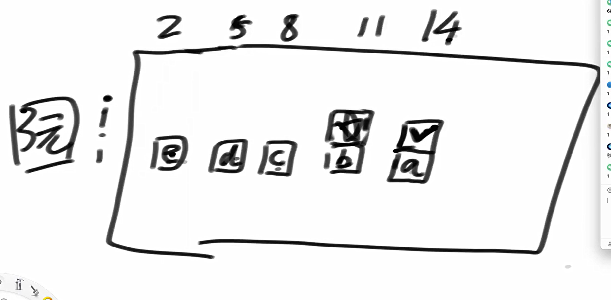

题目一

给定一个二维数组matrix，一个人必须从左上角出发，最后到达右下角。沿途只可以向下或者向右走，沿途的数字都累加就是距离累加和。返回最小距离累加和。

代码实现

```java
package class21;

public class code01_MinPathSum {

//    题目一
//    给定一个二维数组matrix，一个人必须从左上角出发，
//    最后到达右下角。沿途只可以向下或者向右走，
//    沿途的数字都累加就是距离累加和。
//    返回最小距离累加和。


    public static int minPathSum1(int[][] m){
        if (m == null || m.length == 0 || m[0] == null || m[0].length == 0) {
            return 0;
        }
        int row = m.length;
        int col = m[0].length;
        int[][] dp = new int[row][col];

        dp[0][0] = m[0][0];


        for (int i = 1; i < col; i++){
            dp[0][i] = dp[0][i-1] + m[0][i];
        }

        for (int j = 1; j < row; j++){
            dp[j][0] = dp[j-1][0] + m[j][0];
        }

        for (int i = 1; i < row; i++){
            for (int j = 1; j < col; j++){
                dp[i][j] = Math.min(dp[i][j-1], dp[i-1][j]) + m[i][j];
            }
        }

        return dp[row-1][col-1];
    }

    public static int minPathSum2(int[][] m){
        if (m == null || m.length == 0 || m[0] == null || m[0].length == 0) {
            return 0;
        }
        int row = m.length;
        int col = m[0].length;
        int[] dp = new int[col];
        dp[0] = m[0][0];
        for (int i = 1; i < col; i++){
            dp[i] = dp[i-1] + m[0][i];
        }

        for (int i = 1; i < row; i++){

            dp[0] += m[i][0];
            for (int j = 1; j < col; j++){
                dp[j] = Math.min(dp[j], dp[j-1]) + m[i][j];
            }
        }
        return dp[col-1];
    }
    // for test
    public static int[][] generateRandomMatrix(int rowSize, int colSize) {
        if (rowSize < 0 || colSize < 0) {
            return null;
        }
        int[][] result = new int[rowSize][colSize];
        for (int i = 0; i != result.length; i++) {
            for (int j = 0; j != result[0].length; j++) {
                result[i][j] = (int) (Math.random() * 100);
            }
        }
        return result;
    }

    // for test
    public static void printMatrix(int[][] matrix) {
        for (int i = 0; i != matrix.length; i++) {
            for (int j = 0; j != matrix[0].length; j++) {
                System.out.print(matrix[i][j] + " ");
            }
            System.out.println();
        }
    }

    public static void main(String[] args) {
        int rowSize = 10;
        int colSize = 10;
        int[][] m = generateRandomMatrix(rowSize, colSize);
        System.out.println(minPathSum1(m));
        System.out.println(minPathSum2(m));

    }

}

```

启发是，通过观察依赖关系实现dp的压缩

题目二

arr是货币数组，其中的值都是正数。再给定一个正数aim。

每个值都认为是一张货币，

即便是值相同的货币也认为每一张都是不同的，

返回组成aim的方法数

例如：arr = {1,1,1}, aim = 2

第0个和第1个能组成2，第1个和第2个能组成2，第0个和第2个能组成2

一共就3种方法，所以返回3

代码实现

```java
package class21;

import java.util.Random;

public class code02_CoinsWayEveryPaperDifferent {

//    题目二
//    arr是货币数组，其中的值都是正数。再给定一个正数aim。
//    每个值都认为是一张货币，
//    即便是值相同的货币也认为每一张都是不同的，
//    返回组成aim的方法数
//    例如：arr = {1,1,1}, aim = 2
//    第0个和第1个能组成2，第1个和第2个能组成2，第0个和第2个能组成2
//    一共就3种方法，所以返回3


    public static int ways1(int[] arr, int aim){
        return process1(arr, 0, aim);
    }

    public static int process1(int[] arr, int index, int rest){
        if (rest < 0){
            return 0;
        }
        if (index == arr.length){
            return rest == 0 ? 1: 0;
        }
        return process1(arr, index + 1, rest) + process1(arr, index + 1, rest-arr[index]);
    }

    public static int ways2(int[] arr, int aim){
        if (aim == 0){
            return 1;
        }
        int N = arr.length;
        int[][] dp = new int[N+1][aim+1];

        dp[N][0] = 1;


        for (int index = N-1; index >= 0; index--){
            for (int rest = 0; rest <= aim; rest++){
                //不选当前硬币
                dp[index][rest] = dp[index+1][rest];
                //选当前硬币
                if (rest - arr[index] >= 0){
                    dp[index][rest] += dp[index+1][rest - arr[index]];
                }
            }
        }

        return dp[0][aim];
    }

    // 随机生成数组
    public static int[] generateRandomArray(int maxLength, int maxValue) {
        Random random = new Random();
        int length = random.nextInt(maxLength);
        int[] arr = new int[length];

        for (int i = 0; i < length; i++) {
            arr[i] = random.nextInt(maxValue) + 1; // 确保值大于0
        }

        return arr;
    }

    // 打印数组
    public static void printArray(int[] arr) {
        for (int value : arr) {
            System.out.print(value + " ");
        }
        System.out.println();
    }

    // 测试主函数
    public static void main(String[] args) {
        int testTime = 1000; // 测试次数
        int maxLength = 10; // 数组最大长度
        int maxValue = 20; // 数组元素最大值
        boolean succeed = true;

        for (int i = 0; i < testTime; i++) {
            int[] arr = generateRandomArray(maxLength, maxValue);
            int aim = new Random().nextInt(maxValue * maxLength); // aim 最大值可以更大一些

            int res1 = ways1(arr, aim);
            int res2 = ways2(arr, aim);

            if (res1 != res2) {
                succeed = false;
                System.out.println("Test failed!");
                System.out.println("Array:");
                printArray(arr);
                System.out.println("Aim: " + aim);
                System.out.println("ways1 result: " + res1);
                System.out.println("ways2 result: " + res2);
                break;
            }
        }

        System.out.println(succeed ? "All tests passed!" : "Some tests failed.");
    }
}

```

题目三

给定一个正整数数组 arr（代表不同面值的货币）和一个正整数 aim（目标金额），程序计算出使用这些货币组合成 aim 的总方法数。每种货币可以使用任意张数。

例如：

当 arr = {1, 2} 和 aim = 3 时，可能的组合方式有：

- 1 + 1 + 1

- 1 + 2所以返回结果是 **2**。

```java
package class21;

import java.util.Random;

public class code03_CoinsWayNoLimit {

//    题目三
//    给定一个正整数数组 arr（代表不同面值的货币）和一个正整数 aim（
//    目标金额），程序计算出使用这些货币组合成 aim 的总方法数。
//    每种货币可以使用任意张数。
//    例如：
//    当 arr = {1, 2} 和 aim = 3 时，可能的组合方式有：
//            - 1 + 1 + 1
//            - 1 + 2所以返回结果是 2。

    public static int ways1(int[] arr, int aim){
        return process1(arr, 0, aim);
    }

    public static int process1(int[] arr, int index, int rest){
        if (rest < 0){
            return 0;
        }
        if (index == arr.length){
            return rest == 0 ? 1 : 0;
        }

        int ways = 0;
        for (int zhang = 0; zhang * arr[index] <= rest; zhang++){
            ways += process1(arr, index+1, rest - (zhang * arr[index]));
        }
        return ways;
    }

    public static int ways2(int[] arr, int aim){
        int N = arr.length;
        int[][] dp = new int[N+1][aim+1];

        dp[N][0] = 1;

        for (int index = N - 1; index >= 0; index--) {
            for (int rest = 0; rest <= aim; rest++) {
                int ways = 0;
                for (int zhang = 0; zhang * arr[index] <= rest; zhang++) {
                    ways += dp[index + 1][rest - (zhang * arr[index])];
                }
                dp[index][rest] = ways;
            }
        }
        return dp[0][aim];
    }

    public static int ways3(int[] arr, int aim){
        int N = arr.length;
        int[][] dp = new int[N+1][aim+1];

        dp[N][0] = 1;

        for (int index = N - 1; index >= 0; index--) {
            for (int rest = 0; rest <= aim; rest++) {
               dp[index][rest] = dp[index+1][rest];
               if (rest - arr[index] >= 0){
                   dp[index][rest] += dp[index][rest - arr[index]];
               }
            }
        }
        return dp[0][aim];
    }
    // 随机生成数组
    public static int[] generateRandomArray(int maxLength, int maxValue) {
        Random random = new Random();
        int length = random.nextInt(maxLength) + 1; // 至少长度为1
        int[] arr = new int[length];

        for (int i = 0; i < length; i++) {
            arr[i] = random.nextInt(maxValue) + 1; // 确保货币面值大于0
        }

        return arr;
    }

    // 打印数组
    public static void printArray(int[] arr) {
        for (int value : arr) {
            System.out.print(value + " ");
        }
        System.out.println();
    }

    // 测试主函数
    public static void main(String[] args) {
        int testTime = 1000; // 测试次数
        int maxLength = 10;  // 数组最大长度
        int maxValue = 20;   // 货币最大面值
        int maxAim = 50;     // 目标金额最大值（避免过大导致超时）
        boolean succeed = true;

        for (int i = 0; i < testTime; i++) {
            int[] arr = generateRandomArray(maxLength, maxValue);
            int aim = new Random().nextInt(maxAim);

            int res1 = ways1(arr, aim);
            int res2 = ways2(arr, aim);
            int res3 = ways3(arr, aim);

            if (res1 != res2 || res1 != res3) {
                succeed = false;
                System.out.println("Test failed at case " + i);
                System.out.println("Array:");
                printArray(arr);
                System.out.println("Aim: " + aim);
                System.out.println("ways1 result: " + res1);
                System.out.println("ways2 result: " + res2);
                System.out.println("ways3 result: " + res3);
                break;
            }
        }

        System.out.println(succeed ? "All tests passed!" : "Some tests failed.");
    }
}

```

严格表结构可以进行优化

常规方法一般有3种

1 暴力递归

2 记忆化搜索

3 严格表结构

其中严格表结构可以继续优化



题目四

arr是货币数组，其中的值都是正数。再给定一个正数aim。每个值都认为是一张货币，认为值相同的货币没有任何不同，返回组成aim的方法数例如：arr = {1,2,1,1,2,1,2}, aim = 4方法：1+1+1+1、1+1+2、2+2一共就3种方法，所以返回3

```java
package class21;

import java.util.HashMap;
import java.util.Map;
import java.util.Random;

public class code05_CoinsWaySameValueSamePapper {

//    题目四
//    arr是货币数组，其中的值都是正数。再给定一个正数aim。
//    每个值都认为是一张货币，认为值相同的货币没有任何不同，
//    返回组成aim的方法数例如：arr = {1,2,1,1,2,1,2},
//    aim = 4方法：1+1+1+1、1+1+2、2+2一共就3种方法，
//    所以返回3


    public static class record{
        public int[] value;
        public int[] count;

        public record(int[] v, int[] c){
            value = v;
            count = c;
        }
    }
    public static record getRecord(int[] arr, int aim){
        HashMap<Integer, Integer> map = new HashMap<>();

        for (int i = 0; i < arr.length; i++){
            if (!map.containsKey(arr[i])){
                map.put(arr[i], 1);
            }else{
                map.put(arr[i], 1 + map.get(arr[i]));
            }
        }

        int[] value = new int[map.size()];
        int[] count = new int[map.size()];

        int index = 0;
        for (Map.Entry<Integer, Integer> cur : map.entrySet()){
            value[index] = cur.getKey();
            count[index++] = cur.getValue();
        }

        return new record(value, count);
    }


    public static int coinsWay1(int[] arr, int aim) {
        if (arr == null || arr.length == 0 || aim < 0) {
            return 0;
        }
        record info = getRecord(arr, aim);
        return process1(info.value, info.count, 0, aim);
    }

    public static int process1(int[] value, int[] count, int index, int rest){
        if (rest < 0){
            return 0;
        }
        if (index == value.length){
            return rest == 0 ? 1 : 0;
        }
        int ways = 0;
        for (int zhang = 0; zhang * value[index] <= rest && zhang <= count[index]; zhang++){
            ways += process1(value, count, index+1, rest - (zhang * value[index]));
        }
        return ways;
    }

    public static int coinsWay2(int[] arr, int aim) {
        if (arr == null || arr.length == 0 || aim < 0) {
            return 0;
        }
        record info = getRecord(arr, aim);

        int[] value = info.value;
        int[] count = info.count;

        int N = value.length;
        int[][] dp = new int[N+1][aim+1];

        dp[N][0] = 1;

        for (int index = N-1; index >= 0; index--){
           for (int rest = 0; rest <= aim; rest++){
               int ways = 0;
               for (int zhang = 0; zhang * value[index] <= rest && zhang <= count[index]; zhang++){
                   ways += dp[index+1][rest - (zhang * value[index])];
               }
               dp[index][rest] = ways;
           }
        }
        return dp[0][aim];
    }

    public static int coinsWay3(int[] arr, int aim) {
        if (arr == null || arr.length == 0 || aim < 0) {
            return 0;
        }
        record info = getRecord(arr, aim);

        int[] value = info.value;
        int[] count = info.count;

        int N = value.length;
        int[][] dp = new int[N+1][aim+1];

        dp[N][0] = 1;

        for (int index = N-1; index >= 0; index--){
            for (int rest = 0; rest <= aim; rest++){
                dp[index][rest] = dp[index+1][rest];
                if (rest - value[index] >= 0){
                    dp[index][rest] += dp[index][rest - value[index]];
                }
                if (rest - value[index] * (count[index] + 1) >= 0){
                    dp[index][rest] -= dp[index+1][rest - value[index] * (count[index] + 1)];
                }
            }
        }
        return dp[0][aim];
    }


    // 随机生成数组
    public static int[] generateRandomArray(int maxLength, int maxValue, int maxCount) {
        Random random = new Random();
        int length = random.nextInt(maxLength) + 1; // 至少包含一个元素
        int[] arr = new int[length];

        for (int i = 0; i < length; i++) {
            arr[i] = random.nextInt(maxValue) + 1; // 确保货币面值大于0
        }

        // 确保不会出现超出范围的数量
        if (length > maxCount) {
            int[] temp = new int[maxCount];
            System.arraycopy(arr, 0, temp, 0, maxCount);
            arr = temp;
        }

        return arr;
    }

    // 打印数组
    public static void printArray(int[] arr) {
        for (int value : arr) {
            System.out.print(value + " ");
        }
        System.out.println();
    }

    // 测试主函数
    public static void main(String[] args) {
        int testTime = 1000; // 测试次数
        int maxLength = 10;  // 数组最大长度
        int maxValue = 5;    // 单个货币最大面值
        int maxAim = 20;     // 目标金额最大值
        boolean succeed = true;

        for (int i = 0; i < testTime; i++) {
            int[] arr = generateRandomArray(maxLength, maxValue, maxLength);
            int aim = new Random().nextInt(maxAim);

            int res1 = coinsWay1(arr, aim);
            int res2 = coinsWay2(arr, aim);
            int res3 = coinsWay3(arr, aim);

            if (res1 != res2 || res1 != res3) {
                succeed = false;
                System.out.println("Test failed at case " + i);
                System.out.print("Array: ");
                printArray(arr);
                System.out.println("Aim: " + aim);
                System.out.println("Method1 result: " + res1);
                System.out.println("Method2 result: " + res2);
                System.out.println("Method3 result: " + res3);
                break;
            }
        }

        System.out.println(succeed ? "All tests passed!" : "Some tests failed.");
    }

}

```

注意：

题目二：每张货币都不一样，但只有一张；

题目三：每张货币都不一样，有无数张；

题目四：面值相同的货币的组合是一样的。

题目五

给定5个参数，N, M, row, col, k。

表示在N*M的区域上，醉汉Bob初始在(row,col)位置。Bob一共要迈出k步，且每步都会等概率向上下左右四个方向走一个单位。任何时候Bob只要离开N*M的区域，就直接死亡。返回k步之后，Bob还在N*M的区域的概率。

代码实现

```java
package class21;

import java.util.Random;

public class code05_BobDie {


//    给定5个参数，N, M, row, col, k。
//    表示在NM的区域上，醉汉Bob初始在(row,col)位置。
//    Bob一共要迈出k步，且每步都会等概率向上下左右四个方向走一个单位。
//    任何时候Bob只要离开N,M的区域，就直接死亡。返回k步之后，
//    Bob还在N*M的区域的概率。
    public static double livePosibility1(int row, int col, int k, int N, int M){
        return (double) process1(row, col, k, N, M) / Math.pow(4, k);
    }

    public static long process1(int row,int col, int rest, int N, int M){
        if (row < 0 || row == N || col < 0 || col == M) {
            return 0;
        }
        if (rest == 0){
            return 1;
        }
        long up = process1(row-1, col, rest-1, N, M);
        long down = process1(row + 1, col, rest-1, N, M);
        long left = process1(row, col-1, rest-1, N, M);
        long right = process1(row, col+1, rest-1, N, M);

        return up + down + left + right;
    }


    public static double livePosibility2(int row, int col, int k, int N, int M){
        long[][][] dp = new long[N+1][M+1][k+1];

        for (int i = 0; i < N; i++) {
            for (int j = 0; j < M; j++) {
                dp[i][j][0] = 1;
            }
        }

        for (int rest = 0; rest <= k; rest++){
            for (int r = 0; r < N; r++) {
                for (int c = 0; c < M; c++) {
                    dp[r][c][rest] = pick(dp, N, M, r - 1, c, rest - 1);
                    dp[r][c][rest] += pick(dp, N, M, r + 1, c, rest - 1);
                    dp[r][c][rest] += pick(dp, N, M, r, c - 1, rest - 1);
                    dp[r][c][rest] += pick(dp, N, M, r, c + 1, rest - 1);
                }
            }
        }
        return (double) dp[row][col][k] / Math.pow(4, k);
    }

    public static long pick(long[][][] dp, int N, int M, int r, int c, int rest) {
        if (r < 0 || r == N || c < 0 || c == M) {
            return 0;
        }
        return dp[r][c][rest];
    }

    // 随机生成测试用例
    public static void runTest() {
        int testTime = 100;         // 测试次数
        int maxN = 6;               // 最大行数
        int maxM = 6;               // 最大列数
        int maxK = 10;              // 最多步数
        double epsilon = 1e-10;     // 浮点数误差范围
        boolean succeed = true;

        Random random = new Random();

        for (int i = 0; i < testTime; i++) {
            int N = random.nextInt(maxN - 1) + 2;   // 至少是2行
            int M = random.nextInt(maxM - 1) + 2;   // 至少是2列
            int row = random.nextInt(N);            // 起始行
            int col = random.nextInt(M);            // 起始列
            int k = random.nextInt(maxK);           // 步数

            double res1 = livePosibility1(row, col, k, N, M);
            double res2 = livePosibility2(row, col, k, N, M);

            if (Math.abs(res1 - res2) > epsilon) {
                succeed = false;
                System.out.println("Test failed at case " + i);
                System.out.println("Parameters: N=" + N + ", M=" + M + ", row=" + row + ", col=" + col + ", k=" + k);
                System.out.printf("Method1 result: %.10f\n", res1);
                System.out.printf("Method2 result: %.10f\n", res2);
                break;
            }
        }

        System.out.println(succeed ? "All tests passed!" : "Some tests failed.");
    }

    // 主函数入口
    public static void main(String[] args) {
        runTest();
    }

}

```

上面这个是典型的三维dp模型