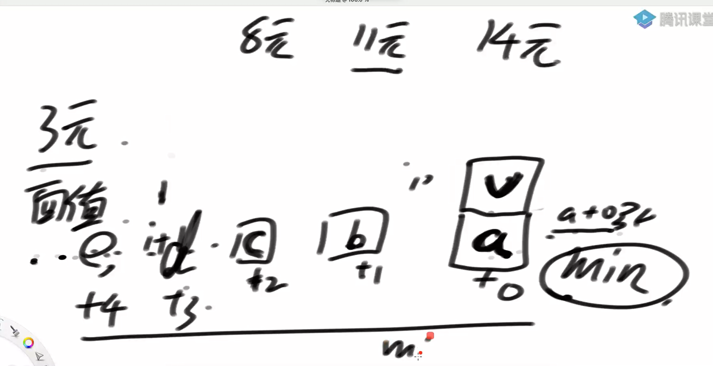
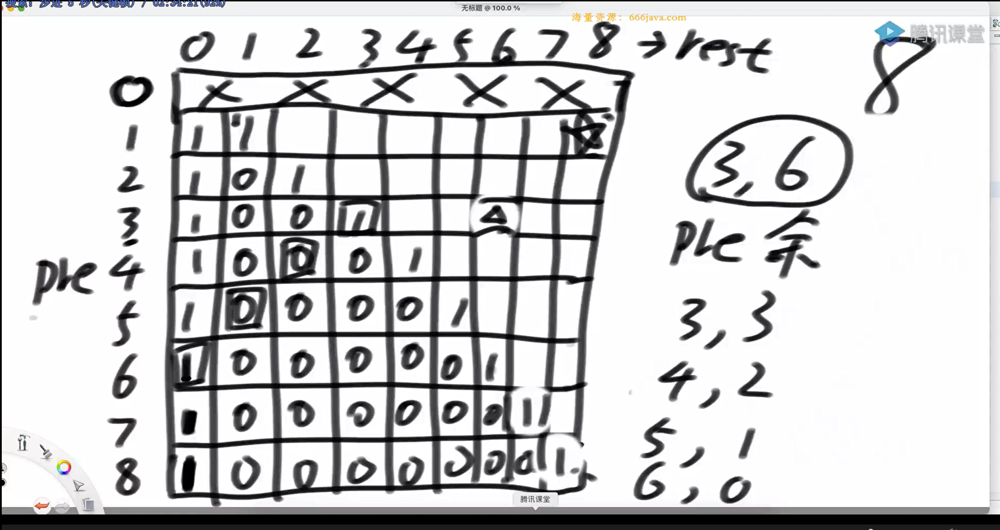
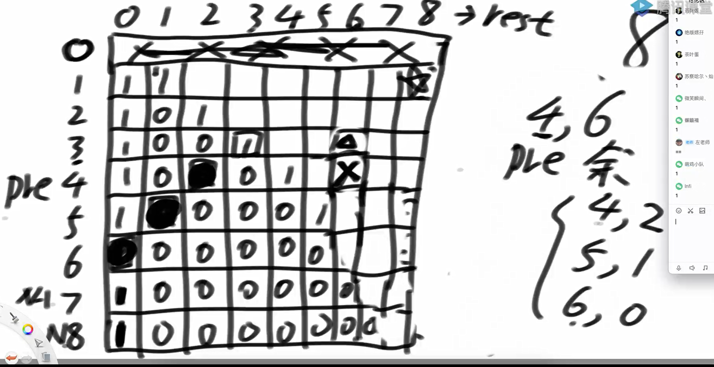

题目一

描述了一个概率问题，其中涉及到怪兽的血量、英雄每次攻击造成的随机伤害以及在一定次数攻击后杀死怪兽的概率。我们可以使用动态规划（DP）来解决这个问题。

给定参数 N*N*, M*M*, 和 K*K*：

- N*N* 是怪兽的初始血量。

- M*M* 是英雄每次攻击可能造成的最大伤害（包括0）。

- K*K* 是英雄攻击的次数。

我们需要计算在 K*K* 次攻击之后，英雄把怪兽砍死的概率。

代码实现

```java
package class22;

import java.util.Random;

public class code01_KillMonster {

//    描述了一个概率问题，其中涉及到怪兽的血量、
//    英雄每次攻击造成的随机伤害以及在一定次数攻击后杀死怪兽的概率。
//    我们可以使用动态规划（DP）来解决这个问题。
//
//    给定参数 NN, MM, 和 KK：
//            - NN 是怪兽的初始血量。
//            - MM 是英雄每次攻击可能造成的最大伤害（包括0）。
//            - KK 是英雄攻击的次数。
//    我们需要计算在 KK 次攻击之后，英雄把怪兽砍死的概率。


    public static double ways1(int hp, int killValue, int times){
        if (hp < 1 || killValue < 1 || times < 1){
            return 0;
        }
        return (double) process1(times, killValue, hp) / Math.pow(killValue + 1, times);
    }

    public static long process1(int times, int killValue, int restHp){
        if (times == 0){
            return restHp <= 0 ? 1 : 0;
        }
        if (restHp <= 0){
            return (long)Math.pow(killValue + 1, times);
        }
        int ways = 0;
        for (int i = 0; i <= killValue; i++){
            ways += process1(times - 1, killValue, restHp - i);
        }
        return ways;
    }


    public static double ways2(int hp, int killValue, int times){
        if (hp < 1 || killValue < 1 || times < 1){
            return 0;
        }
        //目标: dp[times][hp]
        long[][] dp = new long[times + 1][hp + 1];
        //times = 0, restHp = 0,  result = 1;
        dp[0][0] = 1;
        //restHp = 0, times > 0 -> restHp < 0,
        // times = 0. -> restHp = 0, times > 0,
        // mathod = (1+killvalue) ^ (times)

        for (int restTimes = 1; restTimes <= times; restTimes++){
            //times = restTimes, hp = 0 dp[restTimes][0] = Math.pow(killValue + 1, restTimes);
            dp[restTimes][0] = (long)Math.pow(killValue + 1, restTimes);
            for (int restHp = 1; restHp <= hp; restHp++){
                long ways = 0;
                for (int kill = 0; kill <= killValue; kill++){
                    if (restHp - kill >= 0){
                        ways += dp[restTimes-1][restHp - kill];
                    }else{
                        ways += Math.pow(killValue + 1, restTimes-1);
                    }
                }
                dp[restTimes][restHp] = ways;
            }
        }


        return (double) dp[times][hp] / Math.pow(killValue + 1, times);
    }


    public static void main(String[] args) {
        int testTimes = 100; // 测试次数
        int maxHp = 20;      // 最大HP值
        int maxKill = 5;     // 最大伤害值
        int maxTimes = 10;    // 最多攻击次数

        Random rand = new Random();
        System.out.println("开始进行对拍测试...");

        for (int i = 0; i < testTimes; i++) {
            int hp = rand.nextInt(maxHp) + 1;       // HP: [1, maxHp]
            int killValue = rand.nextInt(maxKill) + 1; // Kill Value: [1, maxKill]
            int times = rand.nextInt(maxTimes) + 1; // Times: [1, maxTimes]

            double ans1 = ways1(hp, killValue, times);
            double ans2 = ways2(hp, killValue, times);

            if (Math.abs(ans1 - ans2) > 1e-10) { // 浮点数比较要小心
                System.err.println("❌ 发现不一致!");
                System.err.printf("hp = %d, killValue = %d, times = %d\n", hp, killValue, times);
                System.err.printf("ways1 = %.10f, ways2 = %.10f\n", ans1, ans2);
                return;
            }
        }

        System.out.println("✅ 所有测试通过！");
    }


}

```

题目二

arr是面值数组，其中的值都是正数且没有重复。再给定一个正数aim。每个值都认为是一种面值，且认为张数是无限的。返回组成aim的最少货币数

斜率优化



代码实现

```java
package class22;

import java.util.HashSet;
import java.util.Random;

public class code02_MinCoinsNoLimit {

//    arr是面值数组，其中的值都是正数且没有重复。
//    再给定一个正数aim。每个值都认为是一种面值，
//    且认为张数是无限的。返回组成aim的最少货币数

    public static int ways1(int[] arr, int aim){
        if (arr == null || arr.length == 0 || aim < 0){
            return 0;
        }
        return process1(arr, 0, aim);
    }


    public static int process1(int[] arr, int index, int rest){
        if (index == arr.length){
            return rest == 0 ? 0 : Integer.MAX_VALUE;
        }else{
            int min = Integer.MAX_VALUE;
            for (int zhang = 0; zhang * arr[index] <= rest; zhang++){
                int next = process1(arr, index+1, rest - (zhang * arr[index]));
                if (next != Integer.MAX_VALUE){
                    min = Math.min(min, zhang + next);
                }
            }
            return min;
        }
    }

    public static int ways2(int[] arr, int aim){
        if (arr == null || arr.length == 0 || aim < 0){
            return 0;
        }

        int N = arr.length;
        int[][] dp = new int[N + 1][aim + 1];

        dp[N][0] = 0;
        for (int j = 1; j <= aim; j++){
            dp[N][j] = Integer.MAX_VALUE;
        }

        for (int index = N-1; index >= 0; index--){
            for (int rest = 0; rest <= aim; rest++){
                int min = Integer.MAX_VALUE;

                for (int zhang = 0; zhang * arr[index] <= rest; zhang++){
                    int next = dp[index+1][rest - (zhang * arr[index])];
                    if (next != Integer.MAX_VALUE){
                        min = Math.min(min, zhang + next);
                    }
                }
                dp[index][rest] = min;

            }
        }
        return dp[0][aim];
    }


    public static int ways3(int[] arr, int aim){
        if (arr == null || arr.length == 0 || aim < 0){
            return 0;
        }

        int N = arr.length;
        int[][] dp = new int[N + 1][aim + 1];

        dp[N][0] = 0;
        for (int j = 1; j <= aim; j++){
            dp[N][j] = Integer.MAX_VALUE;
        }

        for (int index = N-1; index >= 0; index--){
            for (int rest = 0; rest <= aim; rest++){
                dp[index][rest] = dp[index+1][rest];
                if (rest - arr[index] >= 0 && dp[index][rest - arr[index]] != Integer.MAX_VALUE){
                    dp[index][rest] = Math.min(dp[index][rest], dp[index][rest - arr[index]] + 1);
                }
            }
        }
        return dp[0][aim];
    }

    public static void main(String[] args) {
        int testTimes = 100;      // 测试次数
        int maxArrLength = 10;    // 数组最大长度
        int maxValue = 50;        // 面值最大值
        int maxAim = 200;         // aim 最大值
        Random rand = new Random();

        System.out.println("开始进行对拍测试...");

        for (int i = 0; i < testTimes; i++) {
            // 生成随机数组
            int arrLength = rand.nextInt(maxArrLength) + 1;
            int[] arr = new int[arrLength];
            HashSet<Integer> used = new HashSet<>();
            for (int j = 0; j < arrLength; j++) {
                int val;
                do {
                    val = rand.nextInt(maxValue) + 1;
                } while (used.contains(val));
                used.add(val);
                arr[j] = val;
            }

            int aim = rand.nextInt(maxAim);

            int ans1 = ways1(arr, aim);
            int ans2 = ways2(arr, aim);
            int ans3 = ways3(arr, aim);

            if ((ans1 != ans2 || ans2 != ans3)) {
                System.err.println("❌ 发现不一致!");
                System.err.print("arr = [");
                for (int j = 0; j < arr.length; j++) {
                    System.err.print(arr[j] + (j == arr.length - 1 ? "" : ", "));
                }
                System.err.println("]");
                System.err.printf("aim = %d\n", aim);
                System.err.printf("ways1 = %d, ways2 = %d, ways3 = %d\n", ans1, ans2, ans3);
                return;
            }
        }

        System.out.println("✅ 所有测试通过！");
    }
}

```

题目三

给定一个正整数 n，要求将它拆分成若干个 不小于1的正整数之和。

并且这些整数满足：非降序排列（即后面的数不能比前面的数小）。

问：总共有多少种不同的拆分方式？

依赖关系



两个dp之间的依赖关系



dp[pre][rest] = dp[pre + 1][rest];

dp[pre][rest] += dp[pre][rest - pre];

代码实现

```java
package class22;

import java.util.Random;

public class code03_SplitNumber {

//    题目三
//    给定一个正整数 n，要求将它拆分成若干个 不小于1的正整数之和。
//    并且这些整数满足：非降序排列（即后面的数不能比前面的数小）。
//    问：总共有多少种不同的拆分方式？


    public static int ways1(int n){
        if (n < 0){
            return 0;
        }
        if (n == 1){
            return 1;
        }
        return process1(1, n);
    }

    public static int process1(int pre, int rest){
        if (rest == 0){
            return 1;
        }
        if (pre > rest){
            return 0;
        }

        int ways = 0;
        for (int first = pre; first <= rest; first++){
            ways += process1(first, rest - first);
        }
        return ways;
    }

    public static int ways2(int n){
        if (n < 0){
            return 0;
        }
        if (n == 1){
            return 1;
        }


        int N = n;
        int[][] dp = new int[N+1][N+1];
        //dp[0][..]无用

//        dp[pre][rest]
        for (int pre = 1; pre <= n; pre++) {
            dp[pre][0] = 1;
            dp[pre][pre] = 1;
        }

        for (int pre = N-1; pre >= 1; pre--){
            for (int rest = pre + 1; rest <= N; rest++){
                int ways = 0;
                for (int first = pre; first <= rest; first++){
                    ways += dp[first][rest - first];
                }
                dp[pre][rest] = ways;
            }
        }

        return dp[1][N];
    }


    public static int ways3(int n){
        if (n < 0){
            return 0;
        }
        if (n == 1){
            return 1;
        }


        int N = n;
        int[][] dp = new int[N+1][N+1];
        //dp[0][..]无用

//        dp[pre][rest]
        for (int pre = 1; pre <= n; pre++) {
            dp[pre][0] = 1;
            dp[pre][pre] = 1;
        }

        for (int pre = N-1; pre >= 1; pre--){
            for (int rest = pre + 1; rest <= N; rest++){
                dp[pre][rest] = dp[pre + 1][rest];
                dp[pre][rest] += dp[pre][rest - pre];
            }
        }

        return dp[1][N];
    }

    public static void main(String[] args) {
        int testTimes = 100;     // 测试次数
        int maxN = 50;           // 最大拆分整数 n

        Random rand = new Random();
        System.out.println("开始进行对拍测试...");

        for (int i = 0; i < testTimes; i++) {
            int n = rand.nextInt(maxN) + 1; // [1, maxN]

            int ans1 = code03_SplitNumber.ways1(n);
            int ans2 = code03_SplitNumber.ways2(n);
            int ans3 = code03_SplitNumber.ways3(n);

            if (ans1 != ans2 || ans2 != ans3) {
                System.err.println("❌ 发现不一致!");
                System.err.printf("n = %d\n", n);
                System.err.printf("ways1 = %d, ways2 = %d, ways3 = %d\n", ans1, ans2, ans3);
                return;
            }
        }

        System.out.println("✅ 所有测试通过！");
    }
}

```