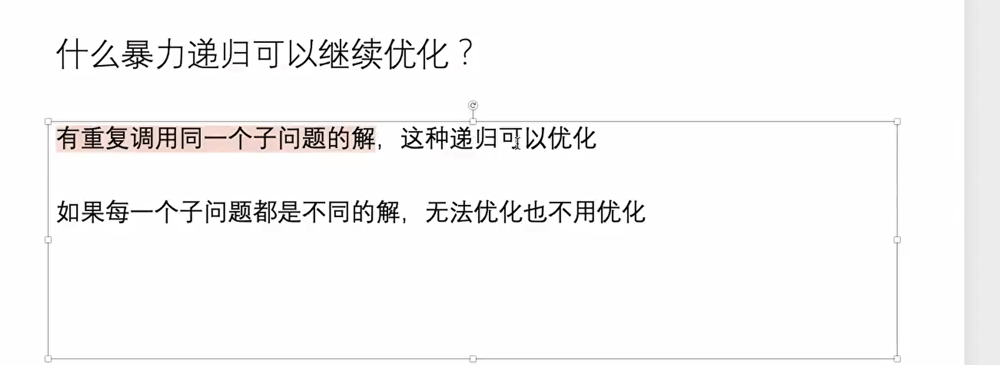
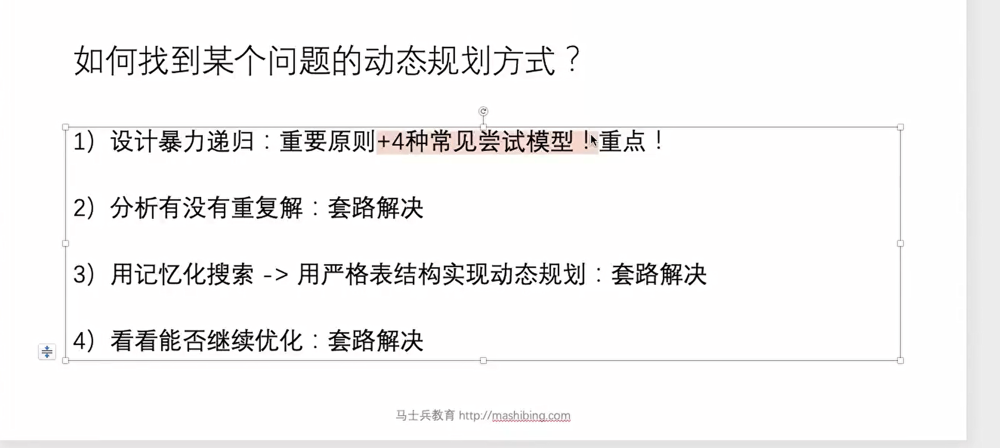
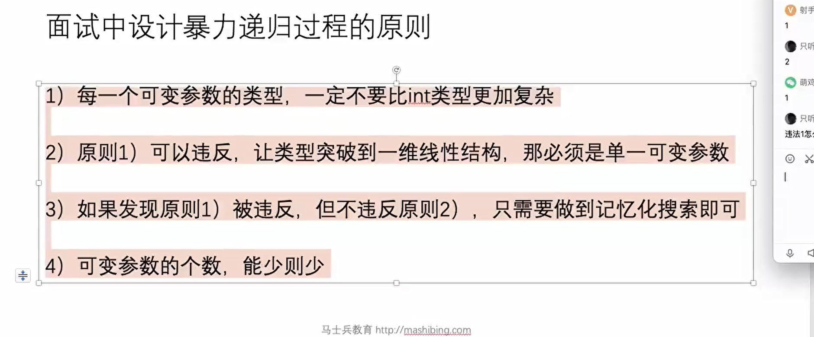
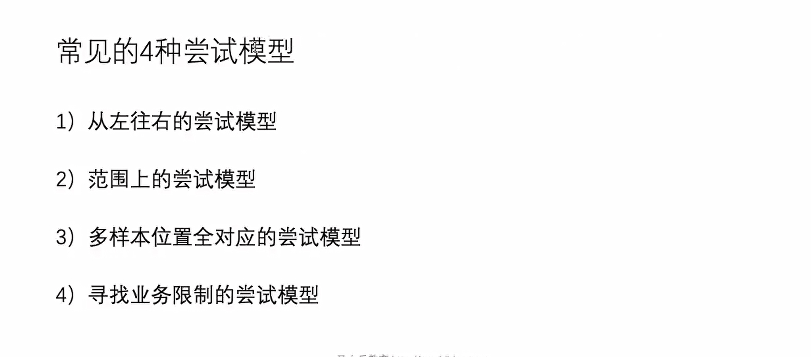
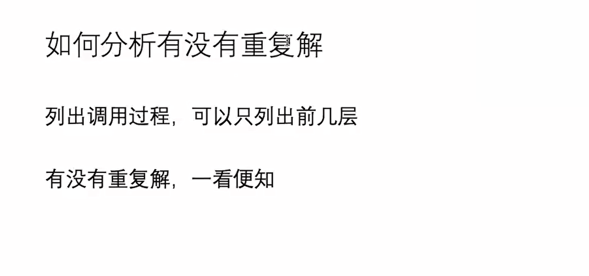
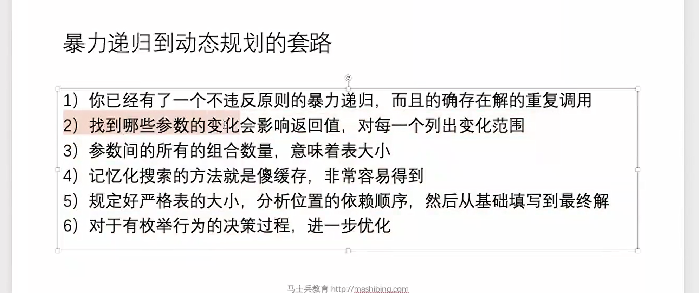
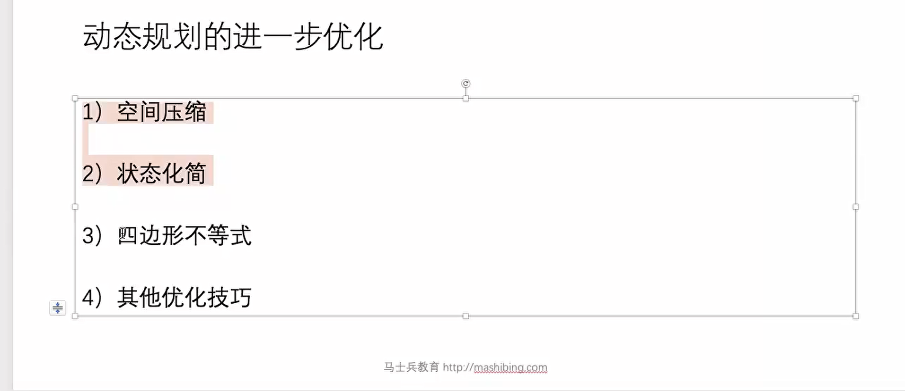

问题一

在所有合法的子集划分中，两个子集的差最小的情况下，较小的那个子集的和是多少？或 在不超过整个数组总和一半的前提下，能选出一组数的最大累加和是多少？

代码实现

```java
package class23;

import java.util.Random;

public class code01_SplitSumClosed {


//    在所有合法的子集划分中，
//    两个子集的差最小的情况下，
//    较小的那个子集的和是多少？
//    或 在不超过整个数组总和一半的前提下，
//    能选出一组数的最大累加和是多少？
    public static int ways1(int[] arr){
        if (arr == null || arr.length < 2) {
            return 0;
        }
        int sum = 0;
        for (int num : arr) {
            sum += num;
        }
        return process1(arr, 0, sum / 2);
    }


    //arr[index....] index...可以选择
    public static int process1(int[] arr, int index, int rest){
        if (index == arr.length){
            return 0;
        }else{
            int p1 = process1(arr, index+1, rest);
            int p2 = 0;
            if (arr[index] <= rest){
                p2 = arr[index] + process1(arr, index + 1, rest - arr[index]);
            }

            return Math.max(p1, p2);
        }
    }

    public static int ways2(int[] arr){
        if (arr == null || arr.length < 2) {
            return 0;
        }
        int sum = 0;
        for (int num : arr) {
            sum += num;
        }

        int N = arr.length;
        sum /= 2;
        int[][] dp = new int[N+1][sum + 1];

        //dp[N][...] = 0;

        for (int index = N-1; index >= 0; index--){
            for (int rest = 0; rest <= sum; rest++){
                int p1 = dp[index+1][rest];
                int p2 = 0;
                if (arr[index] <= rest){
                    p2 = arr[index] + dp[index+1][rest - arr[index]];
                }
                dp[index][rest] = Math.max(p1, p2);
            }
        }


        return dp[0][sum];
    }


    public static void main(String[] args) {
        int testTimes = 1000;     // 测试次数
        int maxLen = 20;          // 数组最大长度
        int maxValue = 50;        // 数组元素最大值

        Random rand = new Random();
        System.out.println("开始进行对拍测试...");

        for (int i = 0; i < testTimes; i++) {
            int len = rand.nextInt(maxLen) + 1; // [1, maxLen]
            int[] arr = new int[len];
            for (int j = 0; j < len; j++) {
                arr[j] = rand.nextInt(maxValue) + 1; // [1, maxValue]
            }

            int ans1 = code01_SplitSumClosed.ways1(arr);
            int ans2 = code01_SplitSumClosed.ways2(arr);

            if (ans1 != ans2) {
                System.err.println("❌ 发现不一致!");
                System.err.print("arr = [");
                for (int j = 0; j < arr.length; j++) {
                    System.err.print(arr[j] + (j == arr.length - 1 ? "" : ", "));
                }
                System.err.println("]");
                System.err.printf("ways1 = %d, ways2 = %d\n", ans1, ans2);
                return;
            }
        }

        System.out.println("✅ 所有测试通过！");
    }

}

```

题目二

给定一个正数数组 arr，请把 arr 中所有的数分成两个集合。具体要求如下：

- 如果 arr 的长度为偶数，两个集合包含的数的个数要一样多。

- 如果 arr 的长度为奇数，两个集合包含的数的个数必须只差一个。

- 尽量让两个集合的累加和接近。

返回：最接近的情况下，较小集合的累加和。

代码实现

```java
package class23;

import java.util.Random;

public class code02_SplitSumClosedSizeHalf {

//    题目二
//    给定一个正数数组 arr，请把 arr 中所有的数分成两个集合。具体要求如下：
//            - 如果 arr 的长度为偶数，两个集合包含的数的个数要一样多。
//            - 如果 arr 的长度为奇数，两个集合包含的数的个数必须只差一个。
//            - 尽量让两个集合的累加和接近。
//    返回：最接近的情况下，较小集合的累加和。


    public static int ways1(int[] arr){
        if (arr == null || arr.length < 2){
            return 0;
        }

        int sum = 0;
        for (int i = 0; i < arr.length; i++){
            sum += arr[i];
        }


        sum /= 2;
        if ((arr.length & 1) == 0){
            return process1(arr, 0, arr.length / 2 , sum);
        }else{
            return Math.max(
                    process1(arr, 0, arr.length / 2, sum),
                    process1(arr, 0, arr.length / 2 + 1, sum)
            );
        }
    }

    public static int process1(int[] arr, int index, int picks, int rest){
        if (index == arr.length){
            return picks == 0 ? 0 : -1;
        }else{
            int p1 = process1(arr, index + 1, picks, rest);

            int p2 = -1;
            int next = -1;


            if (arr[index] <= rest) {
                next = process1(arr, index + 1, picks - 1, rest - arr[index]);
            }

            if (next != -1){
                p2 = arr[index] + next;
            }
            return Math.max(p1, p2);
        }
    }


    public static int ways2(int[] arr){
        if (arr == null || arr.length < 2){
            return 0;
        }

        int sum = 0;
        for (int i = 0; i < arr.length; i++){
            sum += arr[i];
        }
        sum /= 2;
        int N = arr.length;
        int M = (N + 1) / 2;
        //index:0~N,  picks:0~（N+1/2）, rest: 0~sum;
        int[][][] dp = new int[N + 1][M + 1][sum + 1];

        for (int i = 0; i <= N; i++) {
            for (int j = 0; j <= M; j++) {
                for (int k = 0; k <= sum; k++) {
                    dp[i][j][k] = -1;
                }
            }
        }
        for (int rest = 0; rest <= sum; rest++) {
            dp[N][0][rest] = 0;
        }

        for (int i = N - 1; i >= 0; i--) {
            for (int picks = 0; picks <= M; picks++) {
                for (int rest = 0; rest <= sum; rest++) {
                    int p1 = dp[i + 1][picks][rest];
                    // 就是要使用arr[i]这个数
                    int p2 = -1;
                    int next = -1;
                    if (picks - 1 >= 0 && arr[i] <= rest) {
                        next = dp[i + 1][picks - 1][rest - arr[i]];
                    }
                    if (next != -1) {
                        p2 = arr[i] + next;
                    }
                    dp[i][picks][rest] = Math.max(p1, p2);
                }
            }
        }

        if ((arr.length & 1) == 0) {
            return dp[0][arr.length / 2][sum];
        } else {
            return Math.max(dp[0][arr.length / 2][sum], dp[0][(arr.length / 2) + 1][sum]);
        }
    }


    public static void main(String[] args) {
        int testTimes = 1000; // 测试次数
        int maxArrayLength = 20; // 数组最大长度
        int maxValue = 100; // 数组中元素的最大值

        Random random = new Random();

        for (int i = 0; i < testTimes; i++) {
            int length = random.nextInt(maxArrayLength) + 1;
            int[] arr = new int[length];
            for (int j = 0; j < length; j++) {
                arr[j] = random.nextInt(maxValue);
            }

            int result1 = code02_SplitSumClosedSizeHalf.ways1(arr);
            int result2 = code02_SplitSumClosedSizeHalf.ways2(arr);

            if (result1 != result2) {
                System.out.println("Test failed!");
                System.out.print("Array: ");
                for (int num : arr) {
                    System.out.print(num + " ");
                }
                System.out.println();
                System.out.println("ways1 result: " + result1);
                System.out.println("ways2 result: " + result2);
                break;
            } else {
                System.out.println("Test passed for iteration " + (i + 1));
            }
        }
    }


}

```

递归转换为dp



尝试模型



暴力尝试原则












题目三

N皇后问题是一个经典的回溯算法问题，目标是在一个N×N的棋盘上放置N个皇后，使得任意两个皇后都不能在同一行、同一列或同一条对角线上。下面是如何解决这个问题的详细步骤和代码实现。

给定一个整数n，返回n皇后的摆法有多少种。

- n=1，返回1

- n=2或3，2皇后和3皇后问题无论怎么摆都不行，返回0

- n=8，返回92

代码实现

```java
package class23;

public class code03_NQueens {
    public static int num1(int n) {
        if (n < 1) {
            return 0;
        }
        int[] record = new int[n];
        return process1(0, record, n);
    }

    // 当前来到i行，一共是0~N-1行
    // 在i行上放皇后，所有列都尝试
    // 必须要保证跟之前所有的皇后不打架
    // int[] record record[x] = y 之前的第x行的皇后，放在了y列上
    // 返回：不关心i以上发生了什么，i.... 后续有多少合法的方法数
    public static int process1(int i, int[] record, int n) {
        if (i == n) {
            return 1;
        }
        int res = 0;
        // i行的皇后，放哪一列呢？j列，
        for (int j = 0; j < n; j++) {
            if (isValid(record, i, j)) {
                record[i] = j;
                res += process1(i + 1, record, n);
            }
        }
        return res;
    }

    public static boolean isValid(int[] record, int i, int j) {
        // 0..i-1
        for (int k = 0; k < i; k++) {
            if (j == record[k] || Math.abs(record[k] - j) == Math.abs(i - k)) {
                return false;
            }
        }
        return true;
    }

    // 请不要超过32皇后问题
    public static int num2(int n) {
        if (n < 1 || n > 32) {
            return 0;
        }
        // 如果你是13皇后问题，limit 最右13个1，其他都是0
        int limit = n == 32 ? -1 : (1 << n) - 1;
        return process2(limit, 0, 0, 0);
    }

    // 7皇后问题
    // limit : 0....0 1 1 1 1 1 1 1
    // 之前皇后的列影响：colLim
    // 之前皇后的左下对角线影响：leftDiaLim
    // 之前皇后的右下对角线影响：rightDiaLim
    public static int process2(int limit, int colLim, int leftDiaLim, int rightDiaLim) {
        if (colLim == limit) {
            return 1;
        }
        // pos中所有是1的位置，是你可以去尝试皇后的位置
        int pos = limit & (~(colLim | leftDiaLim | rightDiaLim));
        int mostRightOne = 0;
        int res = 0;
        while (pos != 0) {
            mostRightOne = pos & (~pos + 1);
            pos = pos - mostRightOne;
            res += process2(limit, colLim | mostRightOne, (leftDiaLim | mostRightOne) << 1,
                    (rightDiaLim | mostRightOne) >>> 1);
        }
        return res;
    }

    public static void main(String[] args) {
        int n = 15;

        long start = System.currentTimeMillis();
        System.out.println(num2(n));
        long end = System.currentTimeMillis();
        System.out.println("cost time: " + (end - start) + "ms");

        start = System.currentTimeMillis();
        System.out.println(num1(n));
        end = System.currentTimeMillis();
        System.out.println("cost time: " + (end - start) + "ms");

    }
}

```