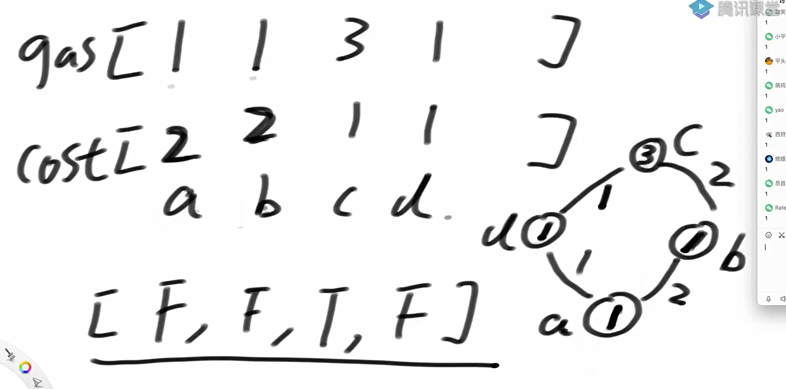

题目一

要求我们实现一个滑动窗口最大值的算法。具体来说，给定一个数组 arr 和一个窗口大小 W，我们需要返回一个数组，其中每个元素是当前窗口内的最大值。

代码实现

```java
package class24;

import java.util.LinkedList;

public class code01_SlidingWindowMaxArray {

    public static int[] right(int[] arr, int w){
        if (arr == null || w < 1 || arr.length < w) {
            return null;
        }
        int N = arr.length;
        int[] res = new int[N - w + 1];
        int index = 0;
        int windowsL = 0;
        int windowsR = w - 1;

        while (windowsR < N){
            int max = arr[windowsL];
            for (int i = windowsL + 1; i <= windowsR; i++){
                max = Math.max(max, arr[i]);
            }

            res[index++] = max;
            windowsL++;
            windowsR++;
        }

        return res;
    }

    public static int[] getMaxWindow(int[] arr, int w){
        if (arr == null || w < 1 || arr.length < w) {
            return null;
        }

        int N = arr.length;
        int index = 0;
        int[] res = new int[N - w + 1];


        //qmax内的数据必须严格从大到小
        final LinkedList<Integer> qmax = new LinkedList<>();

        for (int R = 0; R < N; R++) {
//            双端队列 qmax 的作用
//            qmax 存储的是数组 arr 中元素的索引，这些索引对应着当前窗口内的元素，
//            并且它们在 arr 中对应的值是从大到小排列的。这意味着：
//
//            qmax 队首的元素始终是当前窗口的最大值对应的索引。
//            当向窗口添加新元素时（即遍历到新的数组位置 R），需要移除所有比新元素 
//        arr[R] 小的旧元素索引，以保持 qmax 的单调递减性质。
            while (!qmax.isEmpty() && arr[qmax.peekLast()] <= arr[R]) {
                qmax.pollLast();
            }
            //维持递减规则后，就可以加入arr[R]的索引了
            qmax.addLast(R);

            //判断过期了没
            if (qmax.peekFirst() == R - w) {
                qmax.pollFirst();
            }


            //队列填满再加入
            if (R >= w - 1) {
                res[index++] = arr[qmax.peekFirst()];
            }
        }
        return res;
    }

    // for test
    public static int[] generateRandomArray(int maxSize, int maxValue) {
        int[] arr = new int[(int) ((maxSize + 1) * Math.random())];
        for (int i = 0; i < arr.length; i++) {
            arr[i] = (int) (Math.random() * (maxValue + 1));
        }
        return arr;
    }

    // for test
    public static boolean isEqual(int[] arr1, int[] arr2) {
        if ((arr1 == null && arr2 != null) || (arr1 != null && arr2 == null)) {
            return false;
        }
        if (arr1 == null && arr2 == null) {
            return true;
        }
        if (arr1.length != arr2.length) {
            return false;
        }
        for (int i = 0; i < arr1.length; i++) {
            if (arr1[i] != arr2[i]) {
                return false;
            }
        }
        return true;
    }

    public static void main(String[] args) {
        int testTime = 100000;
        int maxSize = 100;
        int maxValue = 100;
        System.out.println("test begin");
        for (int i = 0; i < testTime; i++) {
            int[] arr = generateRandomArray(maxSize, maxValue);
            int w = (int) (Math.random() * (arr.length + 1));
            int[] ans1 = getMaxWindow(arr, w);
            int[] ans2 = right(arr, w);
            if (!isEqual(ans1, ans2)) {
                System.out.println("Oops!");
                break;
            }
        }
        System.out.println("test finish");
    }
}

```

题目二

给定一个整型数组 arr，和一个整数 num。

某个 arr 中的子数组 sub，如果想达标，必须满足：

- sub 中最大值 - sub 中最小值 <= num

返回 arr 中达标子数组的数量。

代码实现

```java
package class24;

import java.util.LinkedList;
import java.util.Random;

public class code02_AllLessNumSubArray {

    public static int right(int[] arr, int sum){
        if (arr == null || arr.length == 0 || sum < 0){
            return 0;
        }
        int N = arr.length;
        int count = 0;
        for (int L = 0; L < N; L++){
            for (int R = L; R < N; R++){
                int max = arr[L];
                int min = arr[L];
                for (int i = L+1; i <= R; i++){
                    max = Math.max(max, arr[i]);
                    min = Math.min(min, arr[i]);
                }

                if (max - min <= sum){
                    count++;
                }
            }
        }
        return count;
    }

    public static int getAllLessNumSubArray(int[] arr, int sum){
        if (arr == null || arr.length == 0 || sum < 0){
            return 0;
        }

        int N = arr.length;
        int count = 0;
        int R = 0;
        LinkedList<Integer> qmax = new LinkedList<>();
        LinkedList<Integer> qmin = new LinkedList<>();
        for (int L = 0; L < N; L++){
            while (R < N){
                if (!qmax.isEmpty() && arr[qmax.peekLast()] <= arr[R]){
                    qmax.pollLast();
                }
                qmax.add(R);
                if (!qmin.isEmpty() && arr[qmin.peekLast()] >= arr[R]){
                    qmin.pollLast();
                }
                qmin.add(R);

                if (arr[qmax.peekFirst()] - arr[qmin.peekFirst()] > sum){
                    break;
                }else {
                    R++;
                }

                count += R - L;
                if (qmax.peekFirst() == L){
                    qmax.pollFirst();
                }
                if (qmin.peekFirst() == L){
                    qmin.pollFirst();
                }
            }
        }
        return count;
    }

    // 生成随机数组
    public static int[] generateRandomArray(int maxLength, int maxValue) {
        int len = (int) (Math.random() * (maxLength + 1));
        int[] arr = new int[len];
        for (int i = 0; i < len; i++) {
            // 可能正负都有
            arr[i] = (int) Math.random() * (maxValue + 1);
        }
        return arr;
    }

    // 打印数组（调试用）
    public static void printArray(int[] arr) {
        if (arr == null) {
            System.out.println("null");
            return;
        }
        for (int num : arr) {
            System.out.print(num + " ");
        }
        System.out.println();
    }

    // 测试主函数
    public static void main(String[] args) {
        int testTime = 10000;     // 测试次数
        int maxLength = 100;      // 数组最大长度
        int maxValue = 50;        // 元素最大值
        boolean succeed = true;

        System.out.println("开始测试...");

        for (int i = 0; i < testTime; i++) {
            int[] arr = generateRandomArray(maxLength, maxValue);
            int sum = new Random().nextInt(maxValue + 1);

            int ans1 = right(arr, sum);
            int ans2 = getAllLessNumSubArray(arr, sum);

            if (ans1 != ans2) {
                succeed = false;
                System.out.println("出错啦！");
                printArray(arr);
                System.out.println("sum = " + sum);
                System.out.println("暴力解法结果：" + ans1);
                System.out.println("高效解法结果：" + ans2);
                break;
            }
        }

        System.out.println(succeed ? "测试通过！" : "测试失败！");
    }
}

```

题目三



这张图片描述的是一个经典的编程问题：**加油站问题（Gas Station Problem）**。这个问题通常出现在算法和数据结构的课程中，用来讲解贪心算法或动态规划的应用。

问题描述：

假设你有一辆汽车，需要绕一个环形路线行驶一圈。这个环形路线上有若干个加油站，每个加油站提供一定数量的汽油 gas[i]，同时从当前加油站到下一个加油站需要消耗一定数量的汽油 cost[i]。

你的任务是找到一个起点，使得从该起点出发能够顺利绕行一圈回到起点，且在任何时刻油箱中的汽油都不为负数。如果找不到这样的起点，则返回 -1。

图片中的具体示例：

- 数组 gas：表示每个加油站提供的汽油量。

	- gas = [1, 1, 3, 1]

- 数组 cost：表示从当前加油站到下一个加油站所需的汽油量。

	- cost = [2, 2, 1, 1]

- 图示部分：

	- 圆圈代表加油站，圆圈内的数字代表加油站编号（a、b、c、d）。

	- 每条边上的数字代表从当前加油站到下一个加油站所需的汽油量 cost。

	- 每个圆圈旁边的数字代表该加油站提供的汽油量 gas。

- 布尔数组 [F, F, T, F]：可能表示某个算法步骤的结果，比如是否可以从某个加油站作为起点成功绕行一圈。

代码实现

```java
package class24;

import java.util.LinkedList;
import java.util.Random;

public class code03_GasStation {

    public static void main(String[] args) {
        int testTime = 1000; // 测试次数
        int maxLen = 100;    // 加油站最大数量
        int maxValue = 100;  // 汽油和油耗最大值
        boolean succeed = true;

        for (int i = 0; i < testTime; i++) {
            int N = (int) (Math.random() * maxLen) + 1;
            int[] gas = randomArray(N, maxValue);
            int[] cost = randomArray(N, maxValue);

            int expected = bruteForce(gas, cost);
            int actual = canCompleteCircuit(gas, cost);

            if (expected != actual) {
                succeed = false;
                System.out.println("Oops!");
                System.out.println("gas: " + toString(gas));
                System.out.println("cost: " + toString(cost));
                System.out.println("Expected: " + expected);
                System.out.println("Actual: " + actual);
                break;
            }
        }

        System.out.println(succeed ? "Nice!" : "Fucking fucked up!");
    }


    // 暴力解法 O(N^2)
    public static int bruteForce(int[] gas, int[] cost) {
        int N = gas.length;
        for (int start = 0; start < N; start++) {
            int fuel = 0;
            boolean ok = true;
            for (int i = 0; i < N; i++) {
                int idx = (start + i) % N;
                fuel += gas[idx] - cost[idx];
                if (fuel < 0) {
                    ok = false;
                    break;
                }
            }
            if (ok) {
                return start;
            }
        }
        return -1;
    }
    // 测试链接：https://leetcode.com/problems/gas-station
    // 这个方法的时间复杂度O(N)，额外空间复杂度O(N)
    public static int canCompleteCircuit(int[] gas, int[] cost) {
        boolean[] good = goodArray(gas, cost);
        for (int i = 0; i < gas.length; i++) {
            if (good[i]) {
                return i;
            }
        }
        return -1;
    }

    public static boolean[] goodArray(int[] gas, int[] cost){
        int N = gas.length;
        int M = N * 2;
        int[] arr = new int[M];

        for (int i = 0; i < N; i++){
            arr[i] = gas[i] - cost[i];
            arr[i + N] = gas[i] - cost[i];
        }

        for (int i = 1; i < M; i++){
            arr[i] += arr[i - 1];
        }

        LinkedList<Integer> qmin = new LinkedList<>();

        for (int i = 0; i < N; i++){
            while (!qmin.isEmpty() && arr[qmin.peekLast()] >= arr[i]){
                qmin.pollLast();
            }
            qmin.addLast(i);
        }

        boolean[] ans = new boolean[N];

        for (int offet = 0, i = 0, j = N; j < M; offet = arr[i++], j++){
            if (arr[qmin.peekFirst()] - offet >= 0){
                ans[i] = true;
            }

            if (qmin.peekFirst() == i){
                qmin.pollFirst();
            }

            while (!qmin.isEmpty() && arr[qmin.peekLast()] >= arr[j]){
                qmin.pollLast();
            }
            qmin.addLast(j);
        }

        return ans;
    }

    // 生成随机数组
    public static int[] randomArray(int len, int max) {
        int[] res = new int[len];
        Random rand = new Random();
        for (int i = 0; i < len; i++) {
            res[i] = rand.nextInt(max);
        }
        return res;
    }

    // 打印数组
    public static String toString(int[] arr) {
        StringBuilder sb = new StringBuilder();
        sb.append("[");
        for (int i = 0; i < arr.length; i++) {
            sb.append(arr[i]);
            if (i != arr.length - 1) {
                sb.append(", ");
            }
        }
        sb.append("]");
        return sb.toString();
    }
}

```