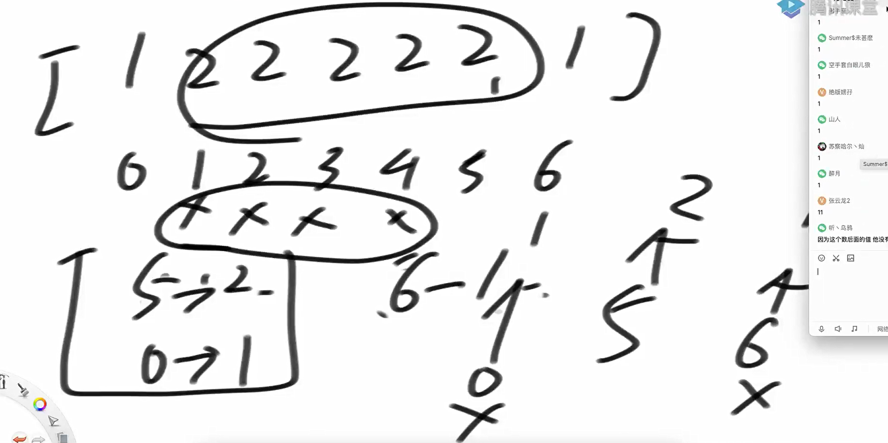
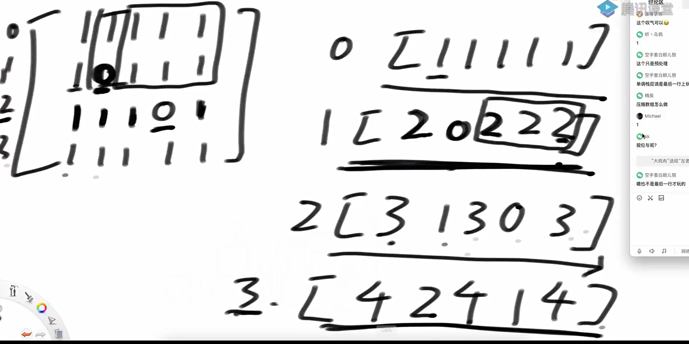
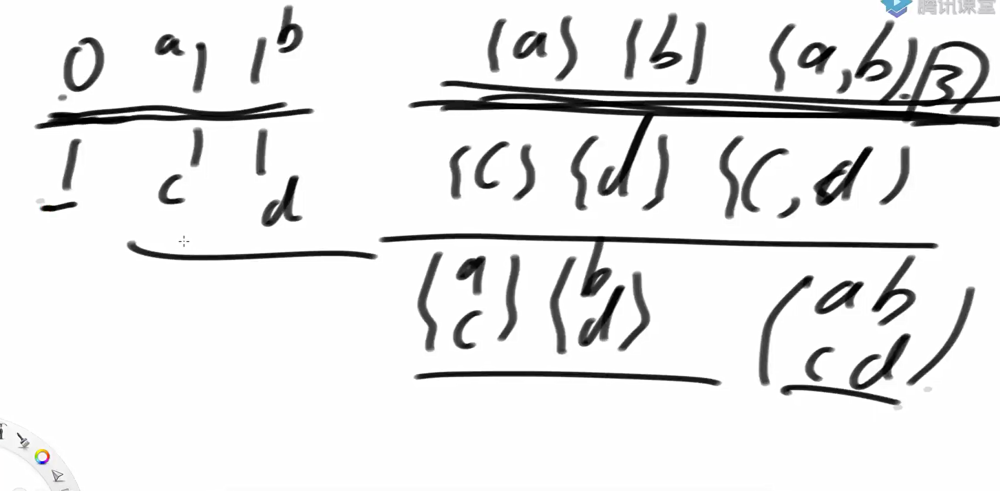

问题一：

给定一个整数数组 arr，对于每个元素 arr[i]，我们需要找出：

1.左边最近的比它小的元素的位置（left near less）

2.右边最近的比它小的元素的位置（right near less）

如果不存在这样的元素，则返回 -1。

代码实现

```java
package class25;

import java.util.ArrayList;
import java.util.List;
import java.util.Stack;

public class code01_MonotonousStack {

    public static int[][] rightWay(int[] arr){
        int[][] res = new int[arr.length][2];

        for (int i = 0; i < arr.length; i++){
            int leftIndex = -1;
            int rightIndex = -1;

            int cur = i-1;
            while(cur >= 0){
                if (arr[cur] < arr[i]){
                    leftIndex = cur;
                    break;
                }
                cur--;
            }

            cur = i + 1;
            while (cur < arr.length){
                if (arr[cur] < arr[i]){
                    rightIndex = cur;
                    break;
                }
                cur++;
            }
            res[i][0] = leftIndex;
            res[i][1] = rightIndex;
        }
        return res;
    }


    public static int[][] getNearLessNoRepeat(int[] arr){
        int[][] res = new int[arr.length][2];
        Stack<Integer> stack = new Stack<>();
        for (int i = 0; i < arr.length; i++){
            while (!stack.isEmpty() && arr[stack.peek()] > arr[i]){
                int popId = stack.pop();
                int leftIndex = stack.isEmpty() ? -1 : stack.peek();
                res[popId][0] = leftIndex;
                res[popId][1] = i;
            }
            stack.push(i);
        }
        while (!stack.isEmpty()){
            int popId = stack.pop();
            int leftIndex = stack.isEmpty() ? -1 : stack.peek();
            res[popId][0] = leftIndex;
            res[popId][1] = -1;
        }

        return res;
    }

    public static int[][] getNearLess(int[] arr){
        int[][] res = new int[arr.length][2];
        Stack<List<Integer>> stack = new Stack<>();

        for (int i = 0; i < arr.length; i++){
            while (!stack.isEmpty() && arr[stack.peek().get(0)] > arr[i]){
                List<Integer> popIds = stack.pop();
                int leftIndex = stack.isEmpty() ? -1 : stack.peek().get(stack.peek().size() - 1);
                for (Integer id : popIds){
                    res[id][0] = leftIndex;
                    res[id][1] = i;
                }
            }

            if (!stack.isEmpty() && arr[stack.peek().get(0)] == arr[i]){
                stack.peek().add(i);
            }else{
                List<Integer> list = new ArrayList<>();
                list.add(i);
                stack.push(list);
            }
        }
        while(!stack.isEmpty()){
            List<Integer> popIds = stack.pop();
            int leftIndex = stack.isEmpty() ? -1 : stack.peek().get(stack.peek().size() - 1);
            for (Integer id : popIds){
                res[id][0] = leftIndex;
                res[id][1] = -1;
            }
        }

        return res;
    }


    // for test
    public static boolean isEqual(int[][] res1, int[][] res2) {
        if (res1.length != res2.length) {
            return false;
        }
        for (int i = 0; i < res1.length; i++) {
            if (res1[i][0] != res2[i][0] || res1[i][1] != res2[i][1]) {
                return false;
            }
        }

        return true;
    }

    // for test
    public static void printArray(int[] arr) {
        for (int i = 0; i < arr.length; i++) {
            System.out.print(arr[i] + " ");
        }
        System.out.println();
    }
    // for test
    public static int[] getRandomArray(int size, int max) {
        int[] arr = new int[(int) (Math.random() * size) + 1];
        for (int i = 0; i < arr.length; i++) {
            arr[i] = (int) (Math.random() * max) - (int) (Math.random() * max);
        }
        return arr;
    }

    // for test
    public static int[] getRandomArrayNoRepeat(int size) {
        int[] arr = new int[(int) (Math.random() * size) + 1];
        for (int i = 0; i < arr.length; i++) {
            arr[i] = i;
        }
        for (int i = 0; i < arr.length; i++) {
            int swapIndex = (int) (Math.random() * arr.length);
            int tmp = arr[swapIndex];
            arr[swapIndex] = arr[i];
            arr[i] = tmp;
        }
        return arr;
    }

    public static void main(String[] args) {
        int size = 10;
        int max = 20;
        int testTimes = 2000000;
        System.out.println("测试开始");
        for (int i = 0; i < testTimes; i++) {
            int[] arr1 = getRandomArrayNoRepeat(size);
            int[] arr2 = getRandomArray(size, max);
            if (!isEqual(getNearLessNoRepeat(arr1), rightWay(arr1))) {
                System.out.println("Oops!");
                printArray(arr1);
                break;
            }
            if (!isEqual(getNearLess(arr2), rightWay(arr2))) {
                System.out.println("Oops!");
                printArray(arr2);
                break;
            }
        }
        System.out.println("测试结束");
    }
}

```

问题2

给定一个只包含正数的数组 arr，arr 中任何一个子数组 sub，一定都可以算出 (sub 累加和) * (sub 中的最小值) 是什么，那么所有子数组中，这个值最大是多少？

注意：子数组是连续的

使用单调栈+前缀和解决

先确定i位置为子数组中最小值，然后找到最左位置小于i位置的数的位置L，和最右位置小于i位置的R，那么[L+1, R-1]就是需要的部分

本题巧妙之处在于，联通的两个数共用一个左边界。

其使用的单调栈的判出逻辑是

while (!stack.isEmpty() && arr[stack.peek()] >= arr[i]) {



代码实现

```java
package class25;

import java.util.Stack;

public class code02_AllTimesMinToMax {

    public static int max1(int[] arr){

        int N = arr.length;
        int max = Integer.MIN_VALUE;
        for (int i = 0; i < N; i++){
            for (int j = i; j < N; j++){
                int minNum = Integer.MAX_VALUE;
                int sum = 0;
                for (int k = i; k <= j; k++){
                    sum += arr[k];
                    minNum = Math.min(minNum, arr[k]);
                }
                max = Math.max(max, sum * minNum);
            }
        }

        return max;
    }


    public static int max2(int[] arr){
        int N = arr.length;
        int[] sums = new int[N];

        sums[0] = arr[0];

        for (int i = 1; i < N; i++){
            sums[i] = sums[i - 1] + arr[i];
        }


        int max = Integer.MIN_VALUE;
        Stack<Integer> stack = new Stack<Integer>();
        for (int i = 0; i < N; i++){
            while (!stack.isEmpty() && arr[stack.peek()] >= arr[i]){
                int j = stack.pop();
                max  = Math.max(max, stack.isEmpty() ? sums[i-1] * arr[j] : (sums[i-1] - sums[stack.peek()]) * arr[j]);
            }
            stack.push(i);
        }

        while (!stack.isEmpty()){
            int j = stack.pop();
            max = Math.max(max, stack.isEmpty() ? sums[N-1] * arr[j] : (sums[N-1] - sums[stack.peek()]) * arr[j]);
        }
        return max;
    }

    public static int[] gerenareRondomArray() {
        int[] arr = new int[(int) (Math.random() * 20) + 10];
        for (int i = 0; i < arr.length; i++) {
            arr[i] = (int) (Math.random() * 101);
        }
        return arr;
    }

    public static void main(String[] args) {
        int testTimes = 2000000;
        System.out.println("test begin");
        for (int i = 0; i < testTimes; i++) {
            int[] arr = gerenareRondomArray();
            if (max1(arr) != max2(arr)) {
                System.out.println("FUCK!");
                break;
            }
        }
        System.out.println("test finish");
    }
}

```

问题3 [84. 柱状图中最大的矩形](https://leetcode.cn/problems/largest-rectangle-in-histogram/)

给定一个非负数组arr，代表直方图，返回直方图的最大长方形面积

给定 *n* 个非负整数，用来表示柱状图中各个柱子的高度。每个柱子彼此相邻，且宽度为 1 。

求在该柱状图中，能够勾勒出来的矩形的最大面积。

 

**示例 1:**


**输入：**heights = [2,1,5,6,2,3]**输出：**10**解释：**最大的矩形为图中红色区域，面积为 10

代码实现

```java
package class25;

import java.util.Stack;

public class code03_LargestRectangleInHistogram {


    public static int largestRectangleArea1(int[] arr){
        if (arr == null || arr.length == 0){
            return 0;
        }

        int N = arr.length;
        int maxArea = 0;
        Stack<Integer> stack = new Stack<>();
        for (int i = 0; i < N; i++){
            while (!stack.isEmpty() && arr[i] <= arr[stack.peek()]){
                int j = stack.pop();
                int k = stack.isEmpty() ? -1 : stack.peek();
                int curArea = (i - k - 1) * arr[j];
                maxArea = Math.max(curArea, maxArea);
            }
            stack.push(i);
        }
        while (!stack.isEmpty()){
            int j = stack.pop();
            int k = stack.isEmpty() ? -1 : stack.peek();
            int curArea = (N - k - 1) * arr[j];
            maxArea = Math.max(maxArea, curArea);
        }
        return maxArea;
    }
}

```

问题4 [https://leetcode.com/problems/maximal-rectangle/](https://leetcode.com/problems/maximal-rectangle/)

给定一个二维数组matrix，其中的值不是0就是1，返回全部由1组成的最大子矩形，内部有多少个1

思路：将这个问题转换为上面的第3题。



以j行作为地基，那么如果j有零，直接归零，如果j不为零，则累加上一行的结果。

代码实现

```java
public static int maximalRectangle(char[][] matrix){
    if (matrix == null || matrix.length == 0 || matrix[0].length == 0) {
        return 0;
    }
    int maxArea = 0;
    int[] height = new int[matrix[0].length];

    int rows = matrix.length;
    int cols = matrix[0].length;

    for (int i = 0; i < rows; i++){

        for (int j = 0; j < cols; j++){
            height[j] = matrix[i][j] == '0' ? 0 : height[j] + 1;
        }
        maxArea = Math.max(maxArea, maxRecFromBottom(height));
    }
    
    return maxArea;

}


public static int maxRecFromBottom(int[] arr){
    if (arr == null || arr.length == 0){
        return 0;
    }

    int N = arr.length;
    int maxArea = 0;
    Stack<Integer> stack = new Stack<>();
    for (int i = 0; i < N; i++){
        while (!stack.isEmpty() && arr[i] <= arr[stack.peek()]){
            int j = stack.pop();
            int k = stack.isEmpty() ? -1 : stack.peek();
            int curArea = (i - k - 1) * arr[j];
            maxArea = Math.max(curArea, maxArea);
        }
        stack.push(i);
    }
    while (!stack.isEmpty()){
        int j = stack.pop();
        int k = stack.isEmpty() ? -1 : stack.peek();
        int curArea = (N - k - 1) * arr[j];
        maxArea = Math.max(maxArea, curArea);
    }
    return maxArea;
}
```

问题五 [https://leetcode.com/problems/count-submatrices-with-all-ones](https://leetcode.com/problems/count-submatrices-with-all-ones)

给定一个二维数组matrix，其中的值不是0就是1，返回全部由1组成的子矩形数量

思路：以某一行做底，然后算子矩阵，然后累加。



注意这个计算的方法

```java
(n*(n + 1)) >> 1;
```

他算的是某一高度的大块矩阵的子矩阵的数量