问题一   **LeetCode 第 907 题：Sum of Subarray Minimums（子数组的最小值之和）**

**	**[907. 子数组的最小值之和 - 力扣（LeetCode）](https://leetcode.cn/problems/sum-of-subarray-minimums/description/)

给定一个整数数组 arr，找到 min(b) 的总和，其中 b 的范围为 arr 的每个（连续）子数组。

由于答案可能很大，因此 返回答案模 10^9 + 7 。

示例 1：

输入：arr = [3,1,2,4]

输出：17

解释：

子数组为 [3]，[1]，[2]，[4]，[3,1]，[1,2]，[2,4]，[3,1,2]，[1,2,4]，[3,1,2,4]。

最小值为 3，1，2，4，1，1，2，1，1，1，和为 17。

示例 2：

输入：arr = [11,81,94,43,3]

输出：444

计算方法

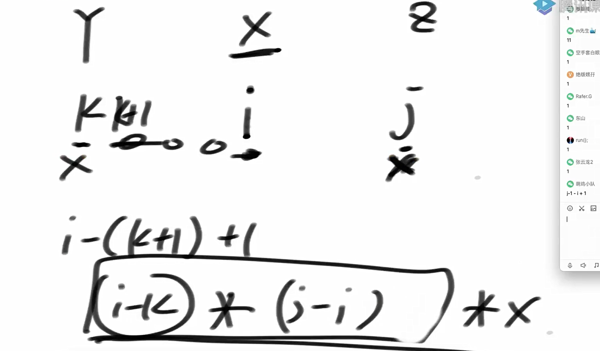

有重复值的情况如何？

左面的y是 <=x的值， 右面的z是小于x的值这样就可以保证每个最小值

比如：

```
int[] arr = {3, 1, 2, 1, 4, 1};
```

当index=1, 1做为最小值的时候。

其可以控制的区间[0, 5), left[index] = -1, right[index] = 5， res = (i - left[i]) * (right[i] - i)   。 得到(1 - (-1)) * (5 - 1) = 8

1作为开头 

3，1作为开头得到结果 {1}, {3,1}, {3,1,2}, {3,1,2,1}, {3,1,2,1,4}, {1,2}, {1,2,1}, {1,2,1,4}

当index=3,3作为最小值的时候 

当index=3,3作为最小值的时候

左边第一个小于等于 1 的是 arr[1]，所以 left[3] = 1

右边第一个小于 1 的是 arr[5]，所以 right[3] = 5

控制区间 [1, 5)，共有 (3 - 1) * (5 - 3) = 4 个子数组：

1作为开头

2,1作为开头 的数组是{1}, {2,1}, {2,1,4}, {1,4}

贡献为 4 * 1 = 4

当index=5的时候，

左边第一个小于等于 1 的是 arr[3]，所以 left[5] = 3

右边没有比它小的元素，所以 right[5] = 6

控制区间 [3, 6)，共有 (5 - 3) * (6 - 5) = 2 个子数组：

1开头

4,1开头的集合是{1}, {4,1}

贡献为 2 * 1 = 2

代码实现

```java
package class26;

import java.util.Stack;

public class code01_SumOfSubarrayMinimums {


    //暴力方法
    public static int ways1(int[] arr){
        if (arr == null || arr.length == 0){
            return 0;
        }

        int N = arr.length;
        int ans = 0;
        for (int i = 0; i < N; i++){
            for (int j = i; j < N; j++){
                int min = arr[i];
                for (int k = i+1; k <= j; k++){
                    min = Math.min(min, arr[k]);
                }
                ans += min;
            }
        }
        return ans;
    }

    //简单方法
    public static int ways2(int[] arr){
        if (arr == null || arr.length == 0){
            return 0;
        }
        int N = arr.length;
        int[] left = leftNearLessEqual2(arr);
        int[] right = rightNearLess2(arr);

        int ans = 0;
        for (int i = 0; i < N; i++){
            int start = i - left[i];
            int end = right[i] - i;
            ans += start * end * arr[i];
        }
        return ans;
    }

    public static int[] leftNearLessEqual2(int[] arr){
        int N = arr.length;
        int[] left = new int[N];

        for (int i = 0; i < N; i++){
            int ans = -1;
            for (int j = i-1; j>=0; j--){
                if (arr[j] <= arr[i]){
                    ans = j;
                    break;
                }
            }
            left[i] = ans;
        }
        return left;
    }


    public static int[] rightNearLess2(int[] arr){
        int N = arr.length;
        int[] right = new int[N];

        for (int i = 0; i < N; i++){
            int ans = N;
            for (int j = i + 1; j < N; j++) {
                if (arr[i] > arr[j]) {
                    ans = j;
                    break;
                }
            }
            right[i] = ans;
        }

        return right;
    }

    //单调栈方法
    public static int ways3(int[] arr){
        if (arr == null || arr.length == 0){
            return 0;
        }
        int N = arr.length;
        int[] left = leftNearLessEqual1(arr);
        int[] right = rightNearLess1(arr);

        int ans = 0;
        for (int i = 0; i < N; i++){
            int start = i - left[i];
            int end = right[i] - i;
            ans += start * end * arr[i];
        }
        return ans;
    }

    public static int[] leftNearLessEqual1(int[] arr){
        int N = arr.length;
        int[] left = new int[N];

        Stack<Integer> stack = new Stack<>();
        for (int i = N-1; i >=0; i--){
            while (!stack.isEmpty() && arr[i] <= arr[stack.peek()]){
                left[stack.pop()] = i;
            }
            stack.push(i);
        }

        //左面没有比它们更小的值
        while (!stack.isEmpty()){
            left[stack.pop()] = -1;
        }

        return left;
    }

    public static int[] rightNearLess1(int[] arr){
        int N = arr.length;
        int[] right = new int[N];

        Stack<Integer> stack = new Stack<>();
        for (int i = 0; i < N; i++){
            while (!stack.isEmpty() && arr[i] < arr[stack.peek()]){
                right[stack.pop()] = i;
            }
            stack.push(i);
        }
        while (!stack.isEmpty()){
            right[stack.pop()] = N;
        }

        return right;
    }


    public static int[] randomArray(int len, int maxValue) {
        int[] ans = new int[len];
        for (int i = 0; i < len; i++) {
            ans[i] = (int) (Math.random() * maxValue) + 1;
        }
        return ans;
    }

    public static void printArray(int[] arr) {
        for (int i = 0; i < arr.length; i++) {
            System.out.print(arr[i] + " ");
        }
        System.out.println();
    }

    public static void main(String[] args) {
        int maxLen = 100;
        int maxValue = 50;
        int testTime = 100000;
        System.out.println("测试开始");
        for (int i = 0; i < testTime; i++) {
            int len = (int) (Math.random() * maxLen);
            int[] arr = randomArray(len, maxValue);
            int ans1 = ways1(arr);
            int ans2 = ways2(arr);
            int ans3 = ways3(arr);
            if (ans1 != ans2 || ans1 != ans3) {
                printArray(arr);
                System.out.println(ans1);
                System.out.println(ans2);
                System.out.println(ans3);
                System.out.println("出错了！");
                break;
            }
        }
        System.out.println("测试结束");
    }
}

```

斐波那契数列矩阵

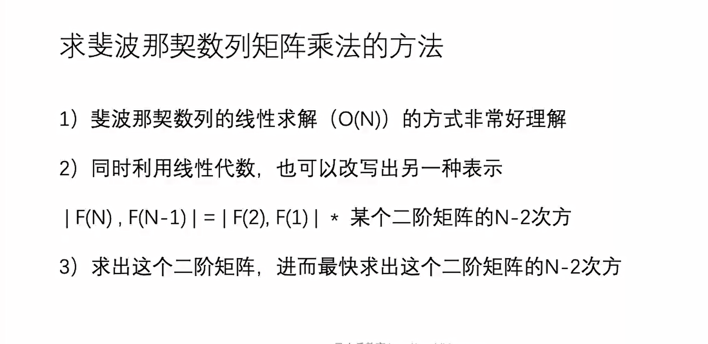

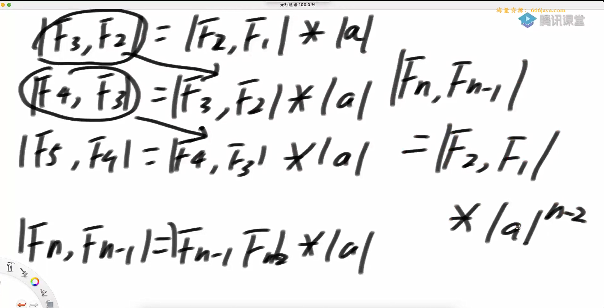

如何快速的计算a的75次方

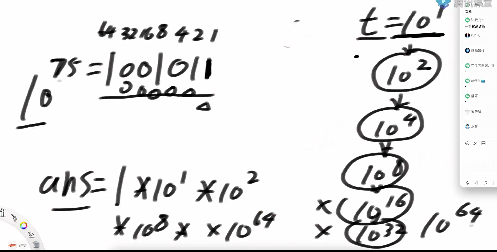

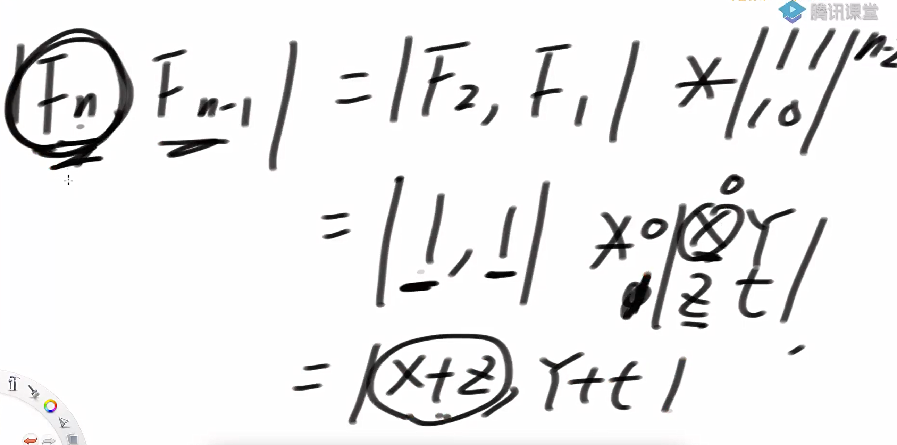

快速幂运算

代码实现

```java
public static int f1(int n) {
    if (n < 1) {
        return 0;
    }
    if (n == 1 || n == 2) {
        return 1;
    }
    return f1(n - 1) + f1(n - 2);
}

public static int f2(int n) {
    if (n < 1) {
        return 0;
    }
    if (n == 1 || n == 2) {
        return 1;
    }
    int res = 1;
    int pre = 1;
    int tmp = 0;
    for (int i = 3; i <= n; i++) {
        tmp = res;
        res = res + pre;
        pre = tmp;
    }
    return res;
}

// O(logN)
public static int f3(int n) {
    if (n < 1) {
        return 0;
    }
    if (n == 1 || n == 2) {
        return 1;
    }
    // [ 1 ,1 ]
    // [ 1, 0 ]
    int[][] base = {
            { 1, 1 },
            { 1, 0 }
    };
    int[][] res = matrixPower(base, n - 2);
    return res[0][0] + res[1][0];
}

public static int[][] matrixPower(int[][] m, int p) {
    int[][] res = new int[m.length][m[0].length];
    for (int i = 0; i < res.length; i++) {
        res[i][i] = 1;
    }
    // res = 矩阵中的1
    int[][] t = m;// 矩阵1次方
    for (; p != 0; p >>= 1) {
        if ((p & 1) != 0) {
            res = muliMatrix(res, t);
        }
        t = muliMatrix(t, t);
    }
    return res;
}

// 两个矩阵乘完之后的结果返回
public static int[][] muliMatrix(int[][] m1, int[][] m2) {
    int[][] res = new int[m1.length][m2[0].length];
    for (int i = 0; i < m1.length; i++) {
        for (int j = 0; j < m2[0].length; j++) {
            for (int k = 0; k < m2.length; k++) {
                res[i][j] += m1[i][k] * m2[k][j];
            }
        }
    }
    return res;
}
```

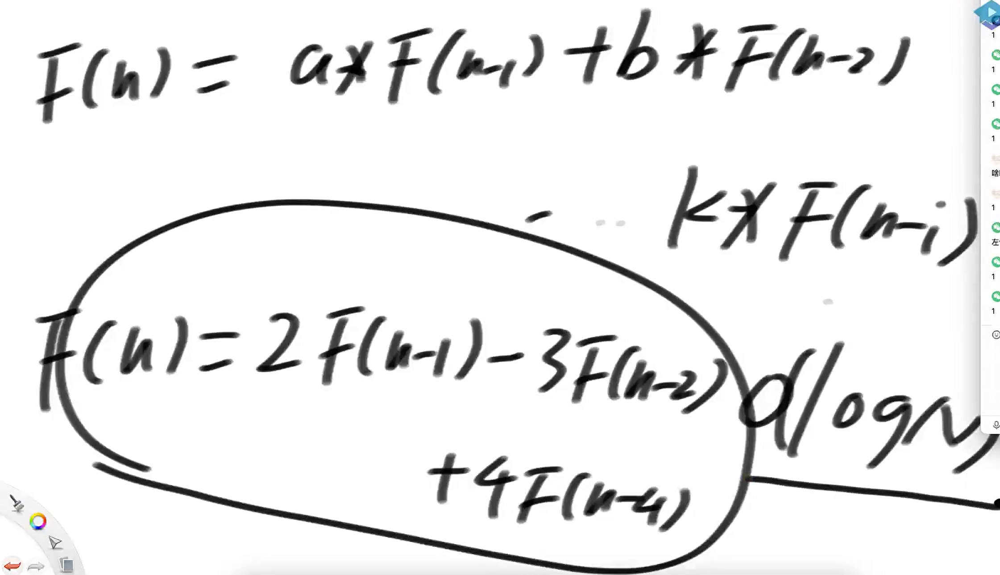

都可以划为logn的程度

推广

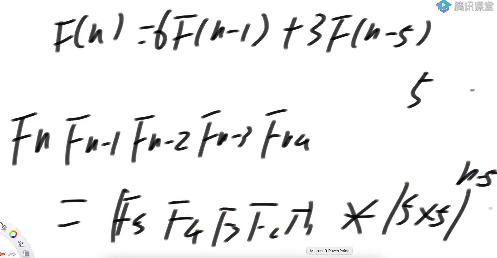

题目二

第一年农场有1只成熟的母牛A，往后的每年：1）每一只成熟的母牛都会生一只母牛2）每一只新出生的母牛都在出生的第三年成熟3）每一只母牛永远不会死

返回N年后牛的数量

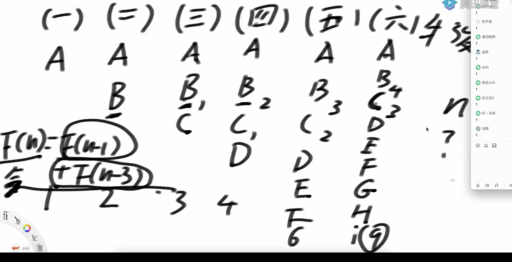

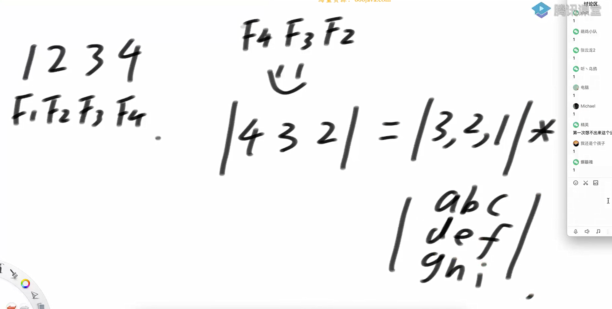

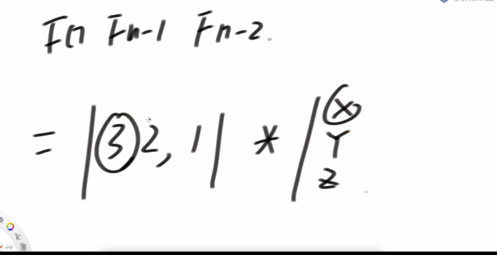

代码实现

```java
public static int c3(int n) {
    if (n < 1) {
        return 0;
    }
    if (n == 1 || n == 2 || n == 3) {
        return n;
    }
    int[][] base = {
            { 1, 1, 0 },
            { 0, 0, 1 },
            { 1, 0, 0 } };
    int[][] res = matrixPower(base, n - 3);
    return 3 * res[0][0] + 2 * res[1][0] + res[2][0];
}
```

目前为止的模型

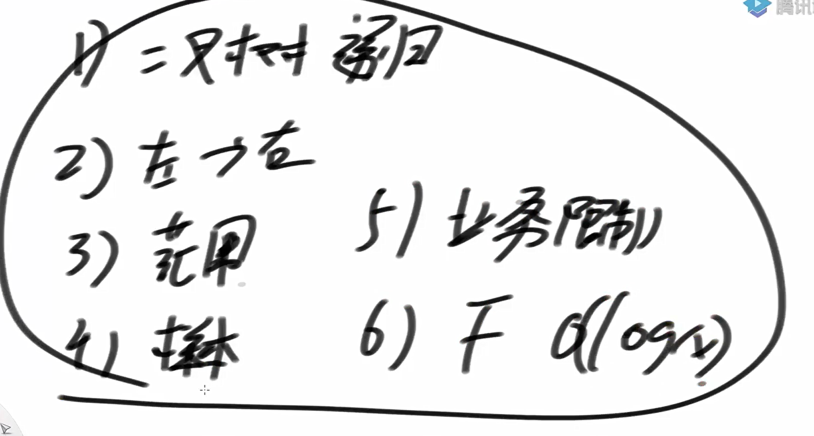

题目三

给定一个数N，想象只由0和1两种字符，组成的所有长度为N的字符串

如果某个字符串,任何0字符的左边都有1紧挨着,认为这个字符串达标

返回有多少达标的字符串

观察可知其满足斐波那契数列

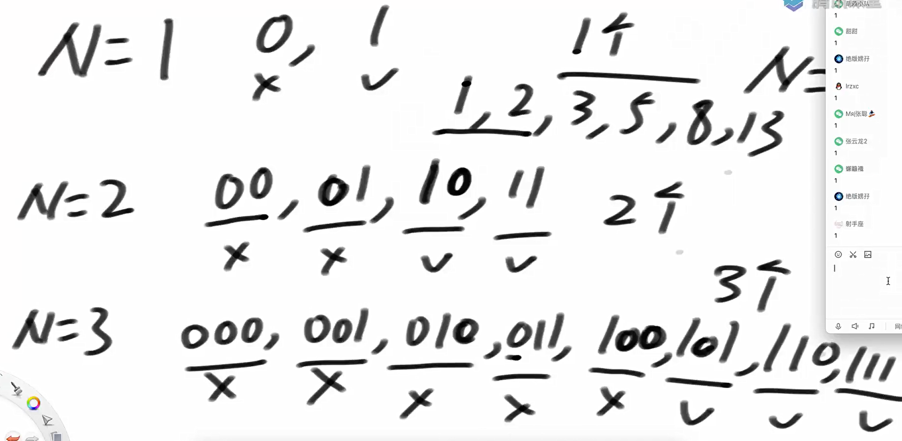

代码实现

```java
package class26;

public class code03_ZeroLeftOneStringNumber {
    public static int getNum1(int n) {
        if (n < 1) {
            return 0;
        }
        return process(1, n);
    }

    public static int process(int i, int n) {
        if (i == n - 1) {
            return 2;
        }
        if (i == n) {
            return 1;
        }
        return process(i + 1, n) + process(i + 2, n);
    }

    public static int getNum2(int n) {
        if (n < 1) {
            return 0;
        }
        if (n == 1) {
            return 1;
        }
        int pre = 1;
        int cur = 1;
        int tmp = 0;
        for (int i = 2; i < n + 1; i++) {
            tmp = cur;
            cur += pre;
            pre = tmp;
        }
        return cur;
    }

    public static int getNum3(int n) {
        if (n < 1) {
            return 0;
        }
        if (n == 1 || n == 2) {
            return n;
        }
        int[][] base = { { 1, 1 }, { 1, 0 } };
        int[][] res = matrixPower(base, n - 2);
        return 2 * res[0][0] + res[1][0];
    }


    public static int fi(int n) {
        if (n < 1) {
            return 0;
        }
        if (n == 1 || n == 2) {
            return 1;
        }
        int[][] base = { { 1, 1 },
                { 1, 0 } };
        int[][] res = matrixPower(base, n - 2);
        return res[0][0] + res[1][0];
    }


    public static int[][] matrixPower(int[][] m, int p) {
        int[][] res = new int[m.length][m[0].length];
        for (int i = 0; i < res.length; i++) {
            res[i][i] = 1;
        }
        int[][] tmp = m;
        for (; p != 0; p >>= 1) {
            if ((p & 1) != 0) {
                res = muliMatrix(res, tmp);
            }
            tmp = muliMatrix(tmp, tmp);
        }
        return res;
    }

    public static int[][] muliMatrix(int[][] m1, int[][] m2) {
        int[][] res = new int[m1.length][m2[0].length];
        for (int i = 0; i < m1.length; i++) {
            for (int j = 0; j < m2[0].length; j++) {
                for (int k = 0; k < m2.length; k++) {
                    res[i][j] += m1[i][k] * m2[k][j];
                }
            }
        }
        return res;
    }

    public static void main(String[] args) {
        for (int i = 0; i != 20; i++) {
            System.out.println(getNum1(i));
            System.out.println(getNum2(i));
            System.out.println(getNum3(i));
            System.out.println("===================");
        }

    }
}

```