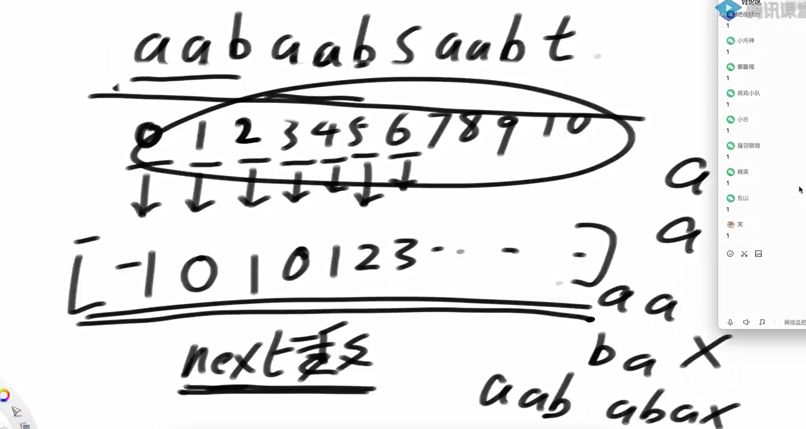
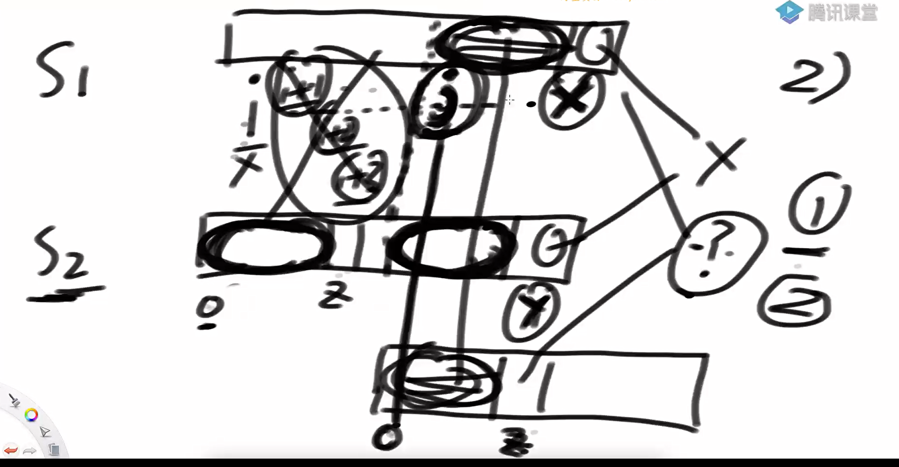
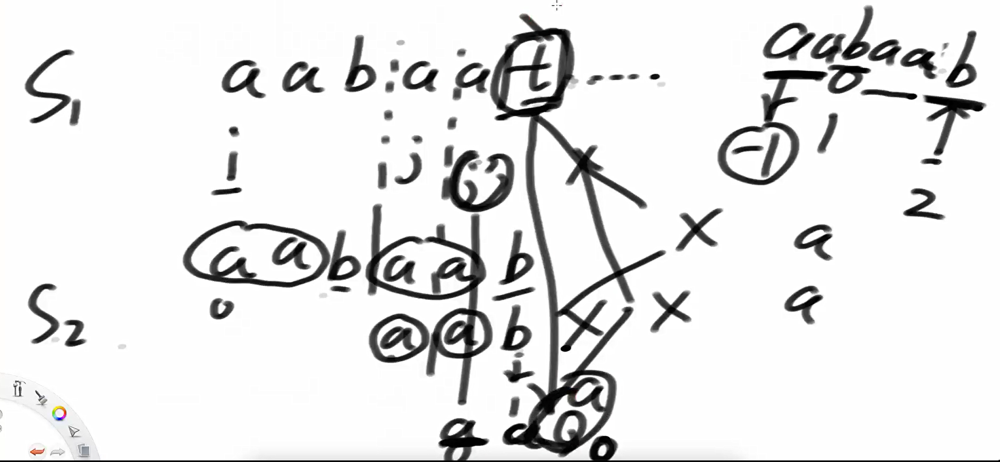
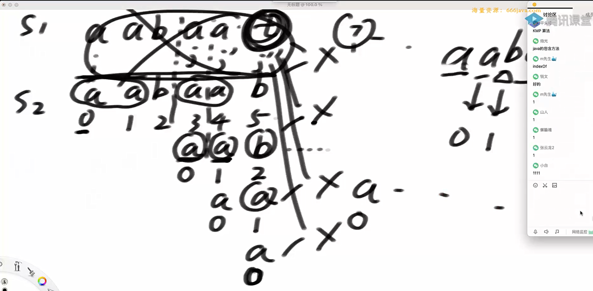
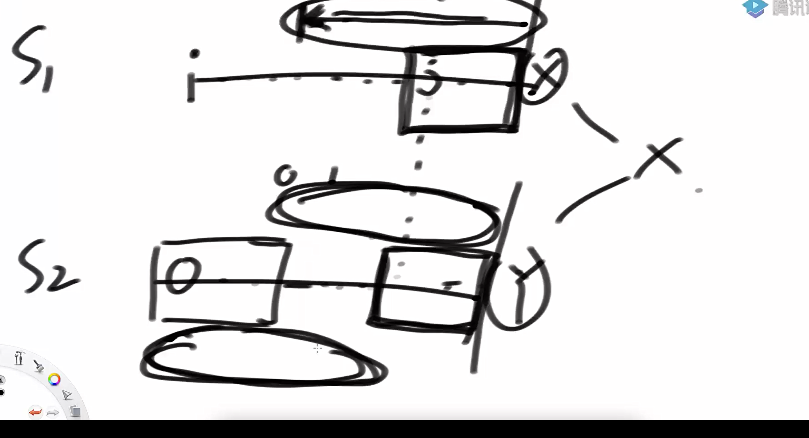
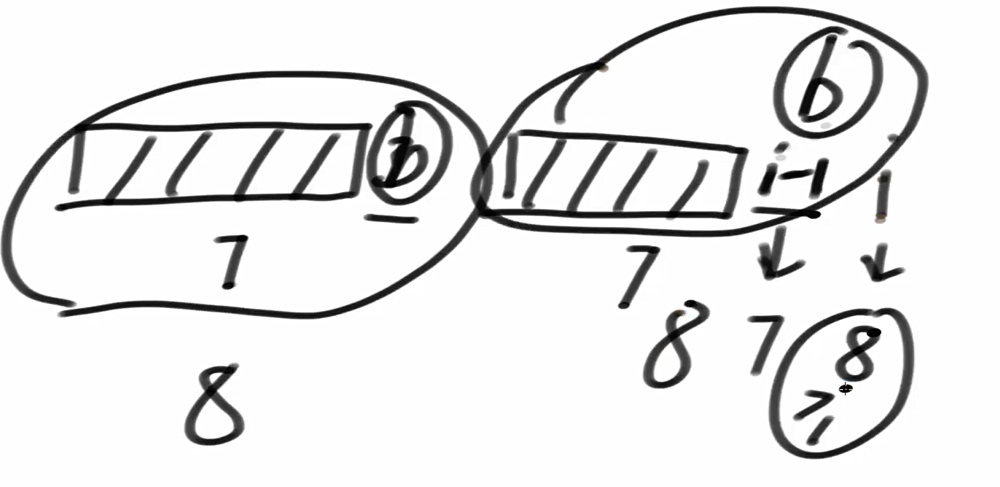
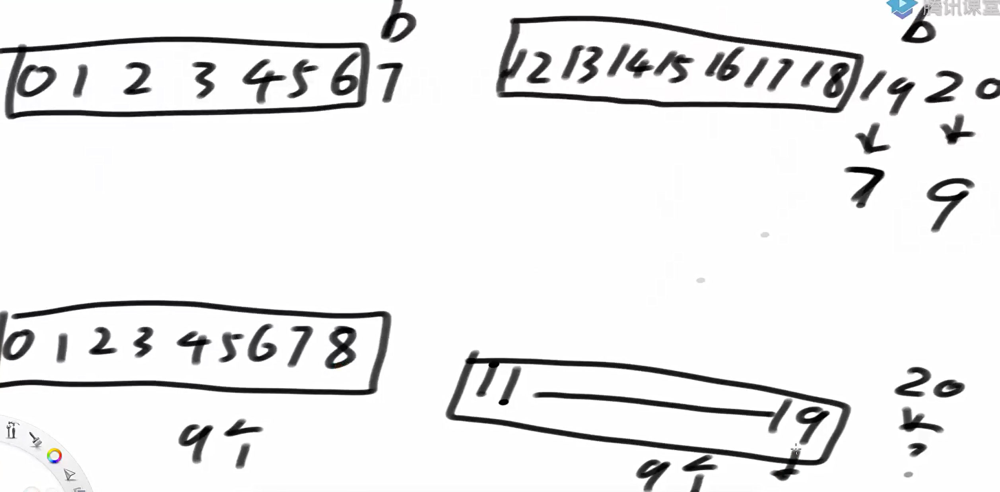
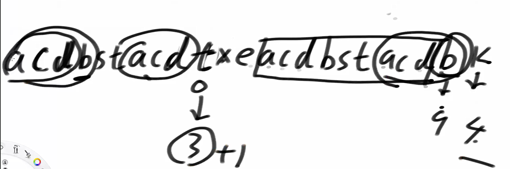

先对数据进行处理获得预处理数组



kmp算法做的事情



具体例子



kmp算法使用next数组完成短暂的加速



kmp的简单证明



k若匹配，那么s2中的相等的前后缀长度就不成立

next数组的计算方法



证明为什么i-1为b的话，8号位置也为b next[i] = 8.

假设next[i] = 9:



那么i-1位置应该为8，所以矛盾。

所以，证明成立

next的计算方法




代码实现

```java
package class27;

public class code01_KMP {
    public static int getIndexOf(String s1, String s2){
        if (s1 == null || s2 == null || s2.length() < 1 || s1.length() < s2.length()) {
            return -1;
        }

        char[] str1 = s1.toCharArray();
        char[] str2 = s2.toCharArray();

        int x = 0;
        int y = 0;
        int[] next = getNextArray(str2);
        while (x < str1.length && y < str2.length){
            if (str1[x] == str2[y]){
                x++;
                y++;
            }else if (next[y] == -1){
                x++;
            }else{
                y = next[y];
            }
        }
        return y == str2.length ? x - y : -1;
    }

    public static int[] getNextArray(char[] str){
        if (str.length == 1){
            return new int[] {-1};
        }
        int[] next = new int[str.length];
        next[0] = -1;
        next[1] = 0;
        int i = 2;
        int cn = 0;
        while(i < str.length){
            if (str[i-1] == str[cn]){
                next[i++] = ++cn;
            }else if (cn > 0){
                cn = next[cn];
            }else{
                next[i++] = 0;
            }
        }
        return next;
    }

    // for test
    public static String getRandomString(int possibilities, int size) {
        char[] ans = new char[(int) (Math.random() * size) + 1];
        for (int i = 0; i < ans.length; i++) {
            ans[i] = (char) ((int) (Math.random() * possibilities) + 'a');
        }
        return String.valueOf(ans);
    }

    public static void main(String[] args) {
        int possibilities = 5;
        int strSize = 20;
        int matchSize = 5;
        int testTimes = 5000000;
        System.out.println("test begin");
        for (int i = 0; i < testTimes; i++) {
            String str = getRandomString(possibilities, strSize);
            String match = getRandomString(possibilities, matchSize);
            if (getIndexOf(str, match) != str.indexOf(match)) {
                System.out.println("Oops!");
            }
        }
        System.out.println("test finish");
    }
}

```

问题二：

判断是否是旋转数组？

str1 和str2是否是旋转数组？ str1+str1 然后和str2 kmp比较一下即可

代码实现

```java
package class27;

public class code02_IsRotation {
    public static boolean isRotation(String a, String b) {
        if (a == null || b == null || a.length() != b.length()) {
            return false;
        }
        String b2 = b + b;
        return getIndexOf(b2, a) != -1;
    }

    public static int getIndexOf(String s1, String s2){
        if (s1 == null || s2 == null || s2.length() < 1 || s1.length() < s2.length()) {
            return -1;
        }

        char[] str1 = s1.toCharArray();
        char[] str2 = s2.toCharArray();

        int x = 0;
        int y = 0;
        int[] next = getNextArray(str2);
        while (x < str1.length && y < str2.length){
            if (str1[x] == str2[y]){
                x++;
                y++;
            }else if (next[y] == -1){
                x++;
            }else{
                y = next[y];
            }
        }
        return y == str2.length ? x - y : -1;
    }

    public static int[] getNextArray(char[] str){
        if (str.length == 1){
            return new int[] {-1};
        }
        int[] next = new int[str.length];
        next[0] = -1;
        next[1] = 0;
        int i = 2;
        int cn = 0;
        while(i < str.length){
            if (str[i-1] == str[cn]){
                next[i++] = ++cn;
            }else if (cn > 0){
                cn = next[cn];
            }else{
                next[i++] = 0;
            }
        }
        return next;
    }
    public static void main(String[] args) {
        String str1 = "yunzuocheng";
        String str2 = "zuochengyun";
        System.out.println(isRotation(str1, str2));
    }

}

```

问题三

判断big tree和 small tree ， small tree是否是big tree的子树

用前序遍历结合kmp即可(这是因为加入null可以保证前序遍历的唯一性)

代码实现

```java
package class27;

import java.util.ArrayList;

public class code03_TreeEqual {
    public static class Node {
        public int value;
        public Node left;
        public Node right;

        public Node(int v) {
            value = v;
        }
    }

    public static boolean containsTree1(Node big, Node small) {
        if (small == null) {
            return true;
        }
        if (big == null) {
            return false;
        }
        if (isSameValueStructure(big, small)) {
            return true;
        }
        return containsTree1(big.left, small) || containsTree1(big.right, small);
    }

    public static boolean isSameValueStructure(Node head1, Node head2) {
        if (head1 == null && head2 != null) {
            return false;
        }
        if (head1 != null && head2 == null) {
            return false;
        }
        if (head1 == null && head2 == null) {
            return true;
        }
        if (head1.value != head2.value) {
            return false;
        }
        return isSameValueStructure(head1.left, head2.left)
                && isSameValueStructure(head1.right, head2.right);
    }

    public static boolean containsTree2(Node big, Node small) {
        if (small == null) {
            return true;
        }
        if (big == null) {
            return false;
        }
        ArrayList<String> b = preSerial(big);
        ArrayList<String> s = preSerial(small);
        String[] str = new String[b.size()];
        for (int i = 0; i < str.length; i++) {
            str[i] = b.get(i);
        }

        String[] match = new String[s.size()];
        for (int i = 0; i < match.length; i++) {
            match[i] = s.get(i);
        }
        return getIndexOf(str, match) != -1;
    }

    public static ArrayList<String> preSerial(Node head) {
        ArrayList<String> ans = new ArrayList<>();
        pres(head, ans);
        return ans;
    }

    public static void pres(Node head, ArrayList<String> ans) {
        if (head == null) {
            ans.add(null);
        } else {
            ans.add(String.valueOf(head.value));
            pres(head.left, ans);
            pres(head.right, ans);
        }
    }

    public static int getIndexOf(String[] str1, String[] str2) {
        if (str1 == null || str2 == null || str1.length < 1 || str1.length < str2.length) {
            return -1;
        }
        int x = 0;
        int y = 0;
        int[] next = getNextArray(str2);
        while (x < str1.length && y < str2.length) {
            if (isEqual(str1[x], str2[y])) {
                x++;
                y++;
            } else if (next[y] == -1) {
                x++;
            } else {
                y = next[y];
            }
        }
        return y == str2.length ? x - y : -1;
    }

    public static int[] getNextArray(String[] ms) {
        if (ms.length == 1) {
            return new int[] { -1 };
        }
        int[] next = new int[ms.length];
        next[0] = -1;
        next[1] = 0;
        int i = 2;
        int cn = 0;
        while (i < next.length) {
            if (isEqual(ms[i - 1], ms[cn])) {
                next[i++] = ++cn;
            } else if (cn > 0) {
                cn = next[cn];
            } else {
                next[i++] = 0;
            }
        }
        return next;
    }

    public static boolean isEqual(String a, String b) {
        if (a == null && b == null) {
            return true;
        } else {
            if (a == null || b == null) {
                return false;
            } else {
                return a.equals(b);
            }
        }
    }

    // for test
    public static Node generateRandomBST(int maxLevel, int maxValue) {
        return generate(1, maxLevel, maxValue);
    }

    // for test
    public static Node generate(int level, int maxLevel, int maxValue) {
        if (level > maxLevel || Math.random() < 0.5) {
            return null;
        }
        Node head = new Node((int) (Math.random() * maxValue));
        head.left = generate(level + 1, maxLevel, maxValue);
        head.right = generate(level + 1, maxLevel, maxValue);
        return head;
    }

    public static void main(String[] args) {
        int bigTreeLevel = 7;
        int smallTreeLevel = 4;
        int nodeMaxValue = 5;
        int testTimes = 100000;
        System.out.println("test begin");
        for (int i = 0; i < testTimes; i++) {
            Node big = generateRandomBST(bigTreeLevel, nodeMaxValue);
            Node small = generateRandomBST(smallTreeLevel, nodeMaxValue);
            boolean ans1 = containsTree1(big, small);
            boolean ans2 = containsTree2(big, small);
            if (ans1 != ans2) {
                System.out.println("Oops!");
            }
        }
        System.out.println("test finish!");

    }
}

```