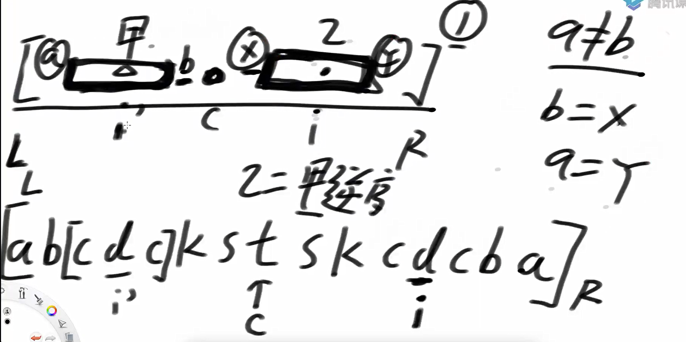
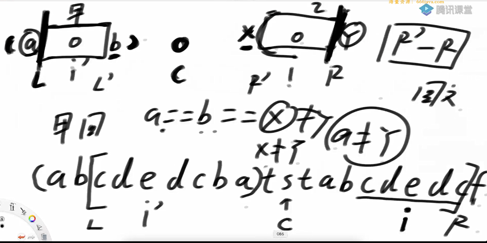
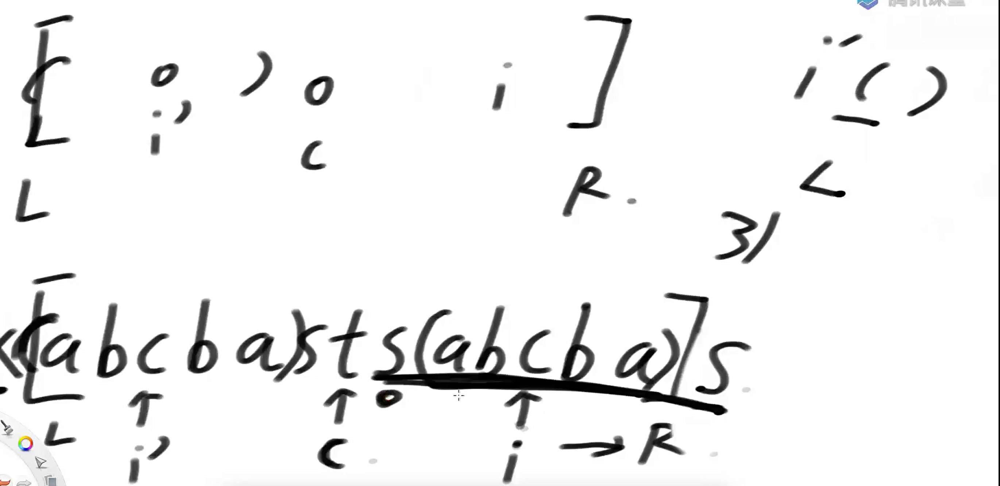
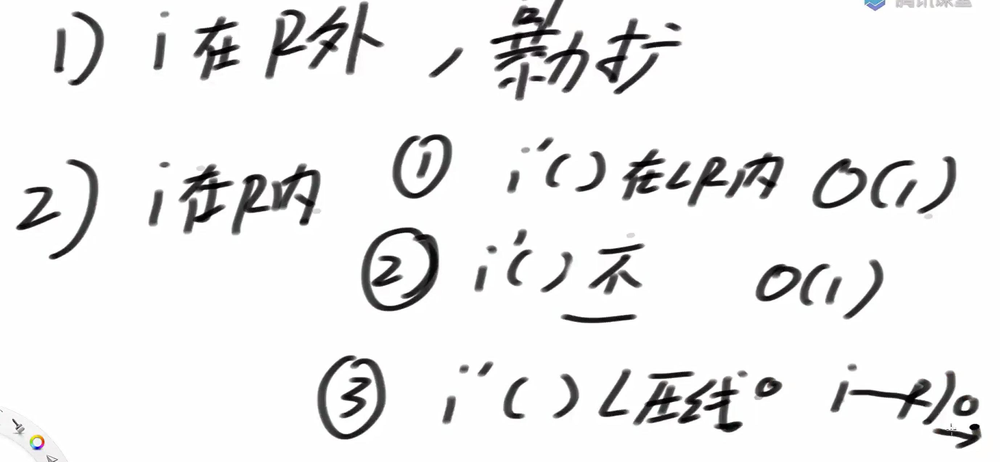
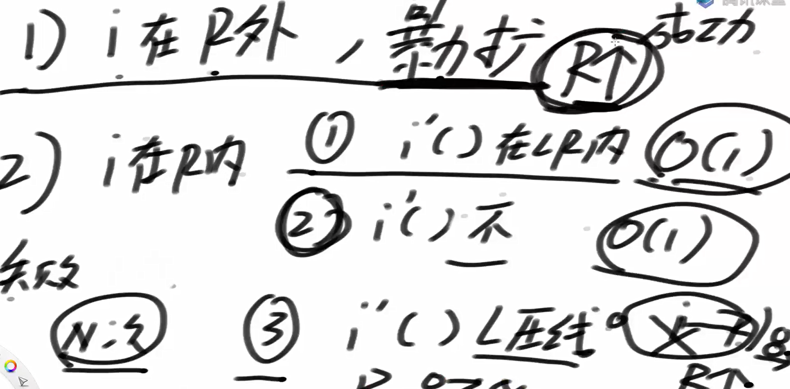
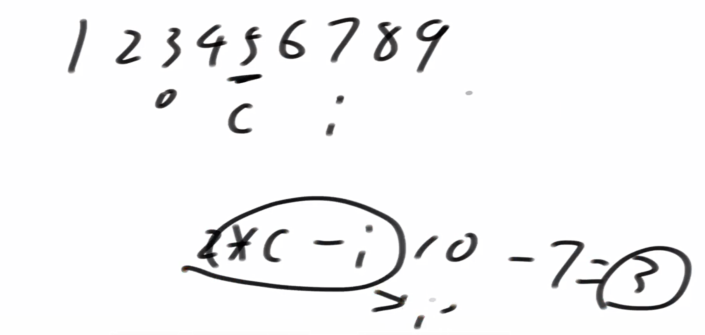

问题一：

mancher实现

mancher算法中的快速计算部分







总结情况



复杂度计算



代码实现

```java
package class28;

public class code01_Manacher {

    public static int manacher(String s){
        if (s == null || s.length() == 0){
            return 0;
        }

        char[] str = manacherString(s);
        int[] pArr = new int[str.length];

        int C = -1; //最右扩的中心点
        int R = -1; //最右的扩成功位置的，再下一个位置
        int max = Integer.MIN_VALUE;
        for (int i = 0; i < str.length; i++){
            //当前已知的回文范围是 [C - pArr[C], R)
            //R - i 表示从 i 开始，最多可以向外扩展多少步，而这个‘步数’是包括中心自己（i）在内的。
            //所以是R-i而不是R-i-1
            //在 Manacher 算法中，pArr[i] 是包括中心 i 的最大扩展步数。
            pArr[i] = i < R ? Math.min(pArr[2 * C - i], R - i) : 1;

            while (i + pArr[i] < str.length && i - pArr[i] > -1){
                if (str[i + pArr[i]] == str[i - pArr[i]]){
                    pArr[i]++;
                }else{
                    break;
                }
            }
            if (i + pArr[i] > R){
                R = i + pArr[i];
                C = i;
            }


            max = Math.max(max, pArr[i]);
        }
        //max-1是因为加了#
        return max - 1;
    }

    public static char[] manacherString(String s){
        char[] charArr = s.toCharArray();
        char[] res = new char[s.length() * 2 + 1];

        int index = 0;
        for (int i = 0; i != res.length; i++){
            res[i] = (i & 1) == 0 ? '#' : charArr[index++];
        }
        return res;
    }


    public static int right(String s){
        if (s == null || s.length() == 0){
            return 0;
        }

        char[] str = manacherString(s);
        int max = 0;
        for (int i = 0 ; i < str.length; i++){
            int L = i - 1;
            int R = i + 1;
            while (L >= 0 && R <= str.length-1 && str[L] == str[R]){
                L--;
                R++;
            }
            max = Math.max(max, R - L - 1);
        }
        return max / 2;
    }

    // for test
    public static String getRandomString(int possibilities, int size) {
        char[] ans = new char[(int) (Math.random() * size) + 1];
        for (int i = 0; i < ans.length; i++) {
            ans[i] = (char) ((int) (Math.random() * possibilities) + 'a');
        }
        return String.valueOf(ans);
    }

    public static void main(String[] args) {
        int possibilities = 5;
        int strSize = 20;
        int testTimes = 5000000;
        System.out.println("test begin");
        for (int i = 0; i < testTimes; i++) {
            String str = getRandomString(possibilities, strSize);
            if (manacher(str) != right(str)) {
                System.out.println("Oops!");
            }
        }
        System.out.println("test finish");
    }
}

```

i丿的计算



问题二

给定一个字符串 s，你需要在它的末尾添加最少数量的字符，使得整个字符串变成一个回文串。

返回这个需要添加的最短字符串（即添加的部分）。

思路：只需在mancher算法的基础上，找到一字符串末尾点为以C为中心点，该末尾点为C中心点的最右半径点，即可找到不为回文序列部分的末尾点，将其反转即可。

代码实现

```java
package class28;

public class code02_AddShortestEnd {

    public static String shortestEnd(String s) {
        if (s == null || s.length() == 0){
            return null;
        }

        char[] str = manacherString(s);
        int[] pArr = new int[str.length];

        int C = -1; //最右扩的中心点
        int R = -1; //最右的扩成功位置的，再下一个位置
        int maxContainsEnd = -1;
        for (int i = 0; i < str.length; i++){
            //当前已知的回文范围是 [C - pArr[C], R)
            //R - i 表示从 i 开始，最多可以向外扩展多少步，而这个‘步数’是包括中心自己（i）在内的。
            //所以是R-i而不是R-i-1
            //在 Manacher 算法中，pArr[i] 是包括中心 i 的最大扩展步数。
            pArr[i] = i < R ? Math.min(pArr[2 * C - i], R - i) : 1;

            while (i + pArr[i] < str.length && i - pArr[i] > -1){
                if (str[i + pArr[i]] == str[i - pArr[i]]){
                    pArr[i]++;
                }else{
                    break;
                }
            }
            if (i + pArr[i] > R){
                R = i + pArr[i];
                C = i;
            }
            if (R == str.length){
                maxContainsEnd = pArr[i];
                break;
            }
        }
        char[] res = new char[s.length() - (maxContainsEnd - 1)];
        for (int i = 0; i < res.length; i++){
            res[res.length - 1 - i] = str[i * 2 + 1];
        }
        return String.valueOf(res);
    }

    public static char[] manacherString(String s){
        char[] charArr = s.toCharArray();
        char[] res = new char[s.length() * 2 + 1];

        int index = 0;
        for (int i = 0; i != res.length; i++){
            res[i] = (i & 1) == 0 ? '#' : charArr[index++];
        }
        return res;
    }
    public static void main(String[] args) {
        String str1 = "abcd123321";
        System.out.println(shortestEnd(str1));
        System.out.println(str1 + shortestEnd(str1));
    }
}

```