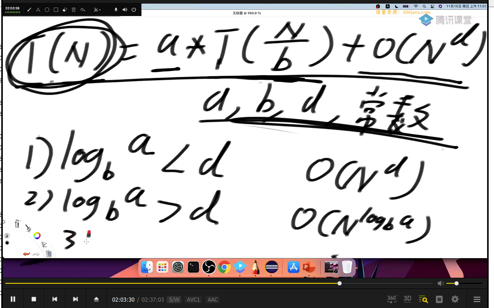
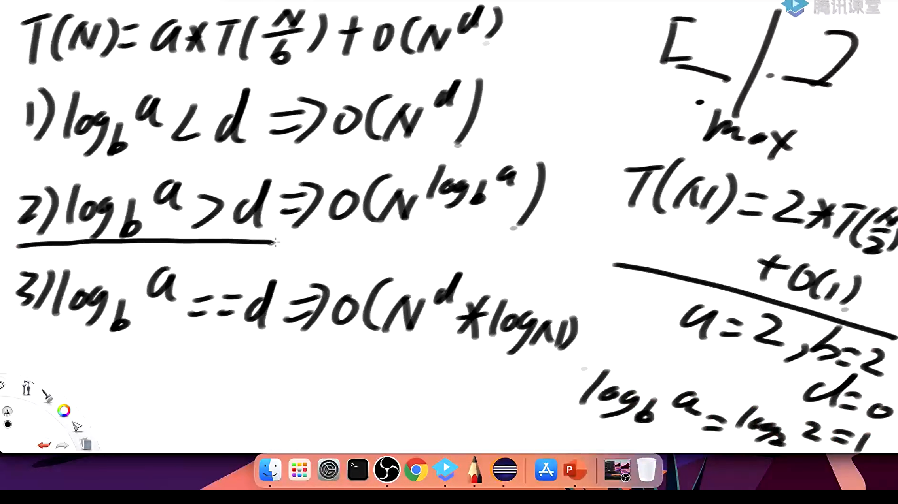

###### 逆转链表（单链表，双链表）

```java
package class03;

import javax.management.relation.RelationNotFoundException;
import java.util.ArrayList;
import java.util.List;
import java.util.Random;

public class ReverseList {

    public static class Node{
        public int value;
        public Node next;

        public Node(int data){
            this.value = value;
        }
    }

    public static class DoubleNode{
        public int value;
        public DoubleNode last;
        public DoubleNode next;

        public DoubleNode(int data){
            this.value = data;
        }
    }

    public static void main(String[] args) {
        int testTime = 5000;
        int maxValue = 100;
        int maxLen = 10;
        for (int i = 0; i < testTime; i++){
            Node list1 = generateRandomLinklist(maxLen, maxValue);
            List<Integer> origin_list1 = getLinklistOriginData(list1);
            Node reverse_list1 = reverseLinkList(list1);
            if (!checkLinkListReverse(origin_list1, reverse_list1)){
                System.out.println("oops1");
            }

            Node list2 = generateRandomLinklist(maxLen, maxValue);
            List<Integer> origin_list2 = getLinklistOriginData(list2);
            Node reverse_list2 = testReverseLinkList(list2);
            if (!checkLinkListReverse(origin_list2, reverse_list2)){
                System.out.println("oops2");
            }

            DoubleNode list3 = generateRandomDoubleList(maxLen, maxValue);
            List<Integer> origin_list3 = getDoubleListOriginData(list3);
            DoubleNode reverse_list3 = reverseDoubleList(list3);
            if (!checkDoubleListReverse(origin_list3, reverse_list3)){
                System.out.println("oops3");
            }

            DoubleNode list4 = generateRandomDoubleList(maxLen, maxValue);
            List<Integer> origin_list4 = getDoubleListOriginData(list4);
            DoubleNode reverse_list4 = testReverseDoubleList(list4);
            if (!checkDoubleListReverse(origin_list4, reverse_list4)){
                System.out.println("oops4");
            }
            break;
        }
    }

    private static DoubleNode testReverseDoubleList(DoubleNode head) {
        if (head == null){
            return null;
        }

        List<DoubleNode> arr = new ArrayList<>();
        while(head != null){
            arr.add(head);
            head = head.next;
        }

        arr.get(0).next = null;
        for (int i = 1; i < arr.size(); i++){
            arr.get(i).next = arr.get(i-1);
            arr.get(i-1).last = arr.get(i);
        }

        return arr.get(arr.size() - 1);
    }

    private static boolean checkDoubleListReverse(List<Integer> origin_list, DoubleNode head) {
        DoubleNode end = null;
        for (int i = origin_list.size() - 1; i >= 0; i--){
            if (!origin_list.get(i).equals(head.value)){
                return false;
            }
            end = head;
            head = head.next;
        }

        for (int i = 0; i < origin_list.size(); i++){
            if (!origin_list.get(i).equals(end.value)){
                return false;
            }
            end = end.last;
        }
        return true;
    }

    private static DoubleNode reverseDoubleList(DoubleNode head) {
        if (head == null){
            return null;
        }

        DoubleNode pre = null;
        DoubleNode next = null;
        while (head != null){
            next = head.next;
            head.next = pre;
            head.last = next;
            pre = head;
            head = next;
        }
        return pre;
    }

    private static List<Integer> getDoubleListOriginData(DoubleNode head) {
        List<Integer> ans = new ArrayList<>();
        while (head != null){
            ans.add(head.value);
            head = head.next;
        }
        return ans;
    }

    private static DoubleNode generateRandomDoubleList(int maxLen, int maxValue) {
        Random random = new Random();
        int size = random.nextInt(maxLen + 1);
        if (size == 0){
            return null;
        }

        DoubleNode head = new DoubleNode(random.nextInt(maxValue + 1));
        DoubleNode pre = head;
        size--;

        for (int i = 0; i < size; i++){
            DoubleNode cur = new DoubleNode(random.nextInt(maxValue + 1));
            pre.next = cur;
            cur.last = pre;
            pre = cur;
        }
        return head;
    }

    private static Node testReverseLinkList(Node head) {
        if (head == null){
            return null;
        }

        List<Node> arr = new ArrayList<>();
        while (head != null){
            arr.add(head);
            head = head.next;
        }

        for (int i = 1; i < arr.size(); i++){
            arr.get(i).next = arr.get(i-1);
        }
        return arr.get(arr.size() - 1);
    }

    private static boolean checkLinkListReverse(List<Integer> origin_list, Node head) {
        for (int i = origin_list.size() - 1; i >= 0; i--){
            if (!origin_list.get(i).equals(head.value)){
                return false;
            }
            head = head.next;
        }
        return true;
    }

    private static Node reverseLinkList(Node head) {
        if (head == null){
            return null;
        }
        Node next = null;
        Node pre = null;
        while(head != null){
            next = head.next;
            head.next = pre;
            pre = head;
            head = next;
        }
        return pre;
    }

    private static List<Integer> getLinklistOriginData(Node head) {
        List<Integer> ans = new ArrayList<>();
        while (head != null){
            ans.add(head.value);
            head = head.next;
        }
        return ans;
    }

    private static Node generateRandomLinklist(int maxLen, int maxValue) {
        Random random = new Random();
        int size = random.nextInt(maxLen + 1);
        if (size == 0){
            return null;
        }
        Node head = new Node(random.nextInt(maxLen + 1));
        size--;
        Node pre = head;
        while (size != 0){
            Node cur = new Node(random.nextInt(maxLen + 1));
            pre.next = cur;
            pre = cur;
            size--;
        }
        return head;
    }


}

```

###### 删除一个链表中所有数值为num的数

```java
package class03;

import java.util.ArrayList;
import java.util.HashSet;
import java.util.List;
import java.util.Random;

public class DeleteLinkListValue {

    public static class Node{
        public int value;
        public Node next;

        public Node(int data){
            this.value = data;
        }
    }


    public static void main(String[] args) {
        int testTime = 5000;
        int maxLen = 10;
        int maxValue = 5;
        Random random = new Random();
        for (int i = 0 ; i < testTime; i++){
            int deleteNum = random.nextInt(2 * maxValue + 1)  - maxValue;
            Node list = generateRandomLinklist(maxLen, maxValue, deleteNum);
            List<Integer> origin = getOriginList(list);
            Node delete = DeleteLinklistNum(list, deleteNum);
            if (!check(delete, origin, deleteNum)){
                System.out.println("oops1");
            }
            break;
        }
    }

    private static boolean check(Node head, List<Integer> origin, int deleteNum) {
        if (head == null){
            return true;
        }
        List<Integer> arr = new ArrayList<>();
        for (int i = 0; i < origin.size(); i++){
            if (origin.get(i) != deleteNum){
                arr.add(origin.get(i));
            }
        }
        for (int i = 0; i < arr.size(); i++){
            if (arr.get(i) != head.value){
                return false;
            }
            head = head.next;
        }
        return true;

    }


    private static Node DeleteLinklistNum(Node head, int num) {
        while (head != null){
            if (head.value != num){
                break;
            }
            head = head.next;
        }

        if (head == null){
            return null;
        }
        
        //head不为空且为等于num
        Node pre = head;
        Node cur = head.next;
        while(cur != null){
            if (cur.value == num){
                pre.next = cur.next;
            }else {
                pre = cur;
            }
            cur = cur.next;
        }
        return head;
    }

    private static List<Integer> getOriginList(Node head) {
        List<Integer> ans = new ArrayList<>();
        while(head != null){
            ans.add(head.value);
            head = head.next;
        }
        return ans;
    }

    private static Node generateRandomLinklist(int maxLen, int maxValue, int Num) {
        //先生成一个数组，把数填满，然后随机交换，然后建立链表
        Random random = new Random();
        int size = random.nextInt(maxLen);
        if (size == 0){
            return null;
        }
        int times = random.nextInt(size + 1);
        //数组中可能存在num也可能不存在
        int deleteNum = random.nextDouble() < 0.5 ? Num : random.nextInt(2 * maxValue + 1)  - maxValue;

        HashSet<Integer> set = new HashSet<>();
        List<Integer> list = new ArrayList<>();
        int num = 0;
        //数组中存在num
        if (deleteNum == Num){
            size -= times;
            while(times != 0){
                list.add(deleteNum);
                times--;
            }
            set.add(deleteNum);
        }else{
            //数组中不存在Num
            set.add(deleteNum);
            list.add(deleteNum);
            size--;
        }

        while(size != 0){
            do{
                num = random.nextInt(2 * maxValue + 1)  - maxValue;
            }while (set.contains(num));
            set.add(num);
            list.add(num);
            size--;
        }

        for(int i = 0; i < list.size();i ++){
            int j = random.nextInt(list.size());
            int temp = list.get(i);
            list.set(i, list.get(j));
            list.set(j, temp);
        }

        Node head = new Node(list.get(0));
        Node pre = head;
        for (int i = 1; i < list.size(); i++){
            Node cur = new Node(list.get(i));
            pre.next = cur;
            pre = cur;
        }

        return head;
    }
}

```

###### 用双端队列实现栈和队列

```java
package class03;

import java.util.LinkedList;
import java.util.Queue;
import java.util.Random;
import java.util.Stack;

public class DoubleEndsQueueAndStack {
    public static class Node<T>{
        public T value;
        public Node<T> last;
        public Node<T> next;

        public Node(T data){
            this.value = data;
        }
    }

    public static class DoubleEndsQueue<T>{
        public Node<T> head;
        public Node<T> tail;


        public boolean isEmpty(){
            return head == null;
        }

        public void addFromHead(T value){
            Node<T> cur = new Node<T>(value);
            if (head == null){
                head = cur;
                tail = cur;
            }else{
                cur.next = head;
                head.last = cur;
                head = cur;
            }
        }

        public void addFromBottom(T value){
            Node<T> cur = new Node<T>(value);
            if (head == null){
                head = cur;
                tail = cur;
            }else{
                tail.next = cur;
                cur.last = tail;
                tail = cur;
            }
        }

        public T popFromHead(){
            if (head == null){
                return null;
            }
            T num = head.value;
            if (head.next == null){
                head = null;
                tail = null;
            }else {
                Node<T> cur = head;
                head = head.next;
                cur.next = null;
                head.last = null;
            }
            return num;
        }

        public T popFromBottom(){
            if (head == null){
                return null;
            }
            T num = tail.value;
            if (tail.next == null){
                head = null;
                tail = null;
            }else {
                Node<T> cur = tail;
                tail = tail.last;
                tail.next = null;
                cur.last = null;
            }
            return num;
        }
    }

    public static class MyStack<T>{
        private DoubleEndsQueue<T> stack;

        public MyStack(){
            stack = new DoubleEndsQueue<>();
        }

        public boolean isEmpty(){
            return stack.isEmpty();
        }

        public void push(T value){
            stack.addFromHead(value);
        }

        public T pop(){
            return stack.popFromHead();
        }
    }

    public static class MyQueue<T>{
        private DoubleEndsQueue<T> queue;

        public MyQueue(){
            queue = new DoubleEndsQueue<>();
        }

        public boolean isEmpty(){
            return queue.isEmpty();
        }

        public void push(T value){
            queue.addFromBottom(value);
        }

        public T pop(){
           return queue.popFromHead();
        }
    }

    public static void main(String[] args) {
        int testTimes = 5000;
        int maxValue = 10;
        int oneTestTimes = 10;
        for (int i = 0; i < testTimes; i++){
            MyStack<Integer> myStack = new MyStack<Integer>();
            MyQueue<Integer> myQueue = new MyQueue<>();
            Stack<Integer> stack = new Stack<Integer>();
            Queue<Integer> queue = new LinkedList<Integer>();
            for(int j = 0; j < oneTestTimes; j++){
                Random random = new Random();
                int num = random.nextInt(2 * maxValue + 1) - maxValue;
                if (stack.isEmpty()){
                    myStack.push(num);
                    stack.push(num);
                }else{
                    if (random.nextDouble() < 0.5){
                        myStack.push(num);
                        stack.push(num);
                    }else{
                        if (!myStack.pop().equals(stack.pop())){
                            System.out.println("oops1");
                        }
                    }
                }

                num = random.nextInt(2 * maxValue + 1) - maxValue;
                if (queue.isEmpty()){
                    myQueue.push(num);
                    queue.add(num);
                }else{
                    if (random.nextDouble() < 0.5){
                        myQueue.push(num);
                        queue.offer(num);
                    }else{
                        if (!myQueue.pop().equals(queue.poll())){
                            System.out.println("oops2");
                        }
                    }
                }
            }
        }
    }


}

```

###### 用数组实现类似链表的队列

```java
package class03;

import jdk.nashorn.internal.ir.SplitReturn;

public class RingArray {


    public static class myQueue{
        private int[] arr;
        private int head;
        private int tail;
        private int size;
        private int limit;

        public myQueue(int limit){
            arr = new int[limit];
        }

        public boolean isEmpty(){
            return size == 0;
        }

        public void push(int data){
            if (size == limit){
                throw new RuntimeException("队列满了");
            }
            arr[tail] = data;
            size++;
            tail = nextIndex(tail);
        }


        public int pop(){
            if (size == 0){
                throw  new RuntimeException("队列为空");
            }
            size--;
            int ans = arr[head];
            head = nextIndex(head);
            return ans;
        }
        public int nextIndex(int index){
            return index < limit - 1 ? index++ : 0;
        }
    }
    
}

```

###### 实现一个特殊的栈，在基本功能的基础上，再实现返回栈最小元素的功能

1） pop push getMin操作的时间复杂度都是o1

2） 设计的栈类型可以使用现成的栈结构

实现思路：设置两个栈，dataStack和minStack, 如果新进来的数num 小于minStack中栈顶的数，就将该数放入minstack的栈顶，否则将minstack原来栈顶的元素再次放入该栈的栈顶

这样就实现了两个栈的同步，每层栈都对应其所处位置的最小值

```java
package class03;

import java.util.Stack;

public class GetMinStack {

    public static class MyStack{
        private Stack<Integer> dataStack;
        private Stack<Integer> minStack;

        public MyStack(){
            dataStack = new Stack<Integer>();
            minStack = new Stack<Integer>();
        }

        public void push(int data){
           if (this.minStack.isEmpty()){
               minStack.push(data);
           }else if (data <= this.getMin()){
               minStack.push(data);
           }else if (data > this.getMin()){
               minStack.push(this.getMin());
           }
           dataStack.push(data);
        }

        public int pop(){
            if (minStack.isEmpty()){
                throw new RuntimeException("stack is null");
            }
            int ans = this.dataStack.pop();
            this.minStack.pop();
            return ans;
        }

        public int getMin(){
            if (this.minStack == null){
                throw new RuntimeException("stack is null");
            }
            return minStack.peek();
        }
    }

    public static void main(String[] args) {
        MyStack stack = new MyStack();
        stack.push(5);
        stack.push(4);
        stack.push(1);
        stack.push(3);
        stack.pop();
        System.out.println(stack.getMin());

    }
}

```

###### 如何用栈结构实现队列结构

思路：两个栈push和pop栈

    pop数据的时候

pop栈中有数据

从pop栈中出数据

pop栈中无数据

将push中的数据倒入pop栈中，再从pop栈中出数据

    push数据的时候

pop栈中有数据

将数据放入push栈中

pop栈中无数据

将数据放入push栈中

```java
package class03;

import java.util.Stack;

public class twoStackImplementQueue {

    public static class myQueue{
        private Stack<Integer> pushStack;
        private Stack<Integer> pollStack;

        public myQueue(){
            pushStack = new Stack<Integer>();
            pollStack = new Stack<Integer>();
        }

        public void push(int data){
           pushStack.push(data);
        }

        public int poll(){
            if (pushStack.isEmpty() && pollStack.isEmpty()){
                throw new RuntimeException("queue is empty");
            }
            if (pollStack.isEmpty()){
                while (!pushStack.isEmpty()){
                    pollStack.push(pushStack.pop());
                }
            }

            return pollStack.pop();
        }

        public int peek(){
            if (pollStack.isEmpty() && pushStack.isEmpty()){
                throw new RuntimeException("queue is empty");
            }
            if (pollStack.isEmpty()){
                while (!pushStack.isEmpty()){
                    pollStack.push(pushStack.pop());
                }
            }
            return pollStack.peek();
        }

        public boolean isEmpty(){
            return pushStack.isEmpty() && pollStack.isEmpty();
        }
    }

    public static void main(String[] args) {
        myQueue myQueue = new myQueue();
        myQueue.push(1);
        myQueue.push(2);
        myQueue.push(3);
        myQueue.push(4);
        while (!myQueue.isEmpty()){
            System.out.print(myQueue.poll() + " ");
        }
        System.out.println();

    }
}

```

###### 如何用队列实现栈结构

思路：

两个队列q和help

获取数

把队列q中的n-1个数放到help队列里

把队列q中的最后一个数返回

然后q和help队列交换一下即可

代码实现

```java
package class03;

import java.util.*;

public class twoQueueImplementStack {

    public static class myStack<T>{
        private Queue<T> queue;
        private Queue<T> help;

        public myStack(){
            queue = new LinkedList<>();
            help = new LinkedList<>();
        }

        public T pop(){
            if (queue.isEmpty()){
               return null;
            }
            while (queue.size() > 1){
                help.offer(queue.poll());
            }
            T ans = queue.poll();
            Queue<T> temp = queue;
            queue = help;
            help = temp;
            return ans;
        }

        public void push(T data){
            queue.offer(data);
        }

        public T peek(){
            if (queue.isEmpty()){
                return null;
            }
            while (queue.size() > 1){
                help.add(queue.poll());
            }
            T ans = queue.peek();
            while(help.size() > 0){
                queue.offer(help.poll());
            }
            return ans;

        }
    }


    public static void main(String[] args) {
        int testTimes = 50000;
        int maxValue = 10;
        int oneTestTimes = 10;

        for (int i = 0; i < testTimes; i++){
            myStack<Integer> mystack = new myStack<Integer>();
            Stack<Integer> stack = new Stack<>();
            Random random = new Random();
            int num = random.nextInt(maxValue * 2 + 1) - maxValue;
            for (int j = 0; j < oneTestTimes; j++){
                if (stack.isEmpty()){
                    mystack.push(num);
                    stack.push(num);
                }else {
                    double p = random.nextDouble();
                    if (p < 0.33){
                        mystack.push(num);
                        stack.push(num);
                    }else if (p < 0.66){
                        if (!mystack.peek().equals(stack.peek())){
                            System.out.println("oops1");
                            return;
                        }
                    } else {
                        if (!mystack.pop().equals(stack.pop())){
                            System.out.println("oops2");
                            return;
                        }
                    }
                }
            }
        }
        return;

    }
}

```

###### 计算递归复杂度





如果哈希表的key是基础类型，那就直接存

如果哈希表的key是引用类型，存的是引用地址