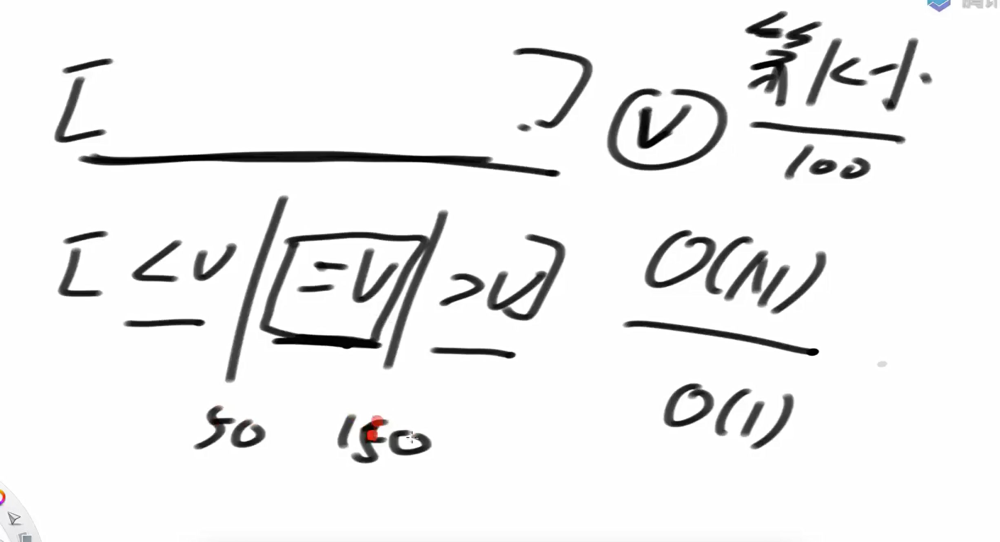
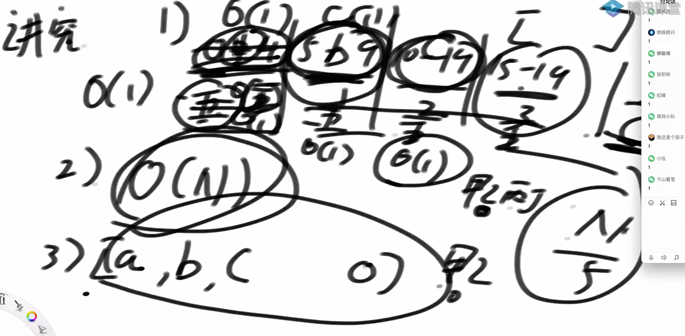
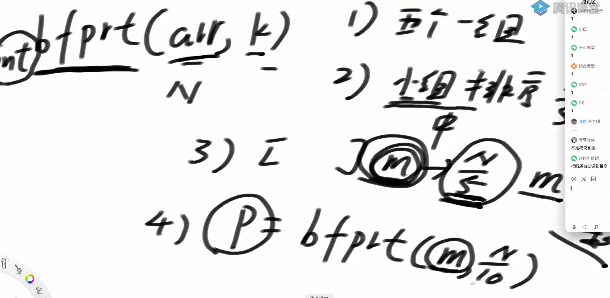
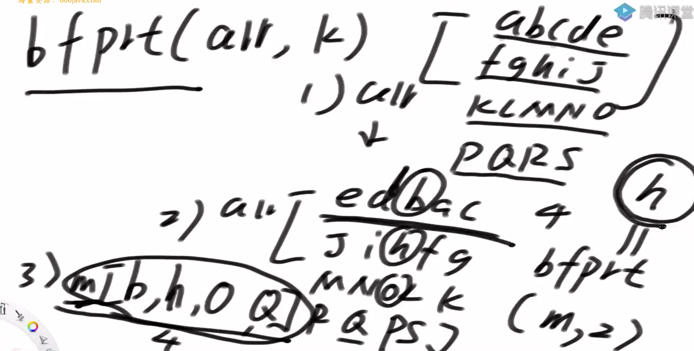
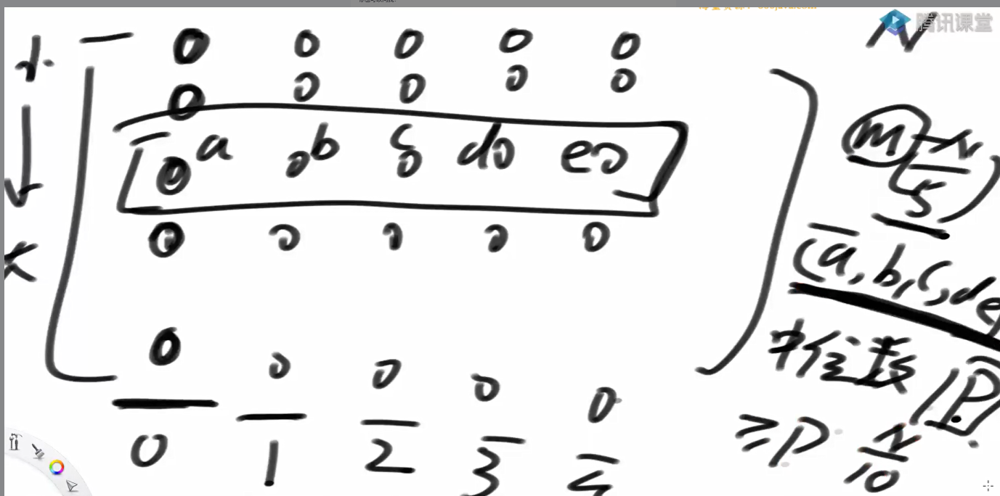

问题一

给定一个整数数组 arr 和一个正整数 k，找出这个数组中第 k 小的数（最小的数是第 1 小）。



命中说明第k小的数找到了

为什么快速排序的时间复杂度是O（N * logN） 而， 快速选择就是O（N）呢？

| 步骤 | 快速排序 | 快速选择 | 
| -- | -- | -- |
| 第1次 | partition(N) → 处理左右各 N/2 | partition(N) → 只处理一边 N/2 | 
| 第2次 | 左右各 partition(N/2) ×2 | 只处理一边 partition(N/2) | 
| 第3次 | 继续处理更小的部分 ×4 | 继续处理更小的部分 ×1 | 
| 总操作数 | N + 2×N/2 + 4×N/4 + ... = N logN | N + N/2 + N/4 + ... = 2N | 


bfprt算法



计算p的值



整理一下



bfprt在做什么？



你提到的图示和问题涉及到 BFPRT 算法（Blum-Floyd-Pratt-Rivest-Tarjan 算法），这是一种用于在最坏情况下线性时间复杂度内找到数组中第 k 小元素的算法。这个算法的核心思想是通过分组和选择中位数来确保每次划分都能得到较好的平衡，从而保证整体的时间复杂度为 O(N)。

**为什么 >= p 的元素至少有 N/10？**

这个问题的关键在于 BFPRT 算法中的一个关键步骤：选取中位数的中位数作为 pivot。让我们一步步分析：

🧠 BFPRT 算法的核心步骤：

分组：将数组分成每组 5 个元素的小组（最后一组可能不足 5 个）。

找每组的中位数：对每个小组内部排序，找出其中位数。

递归找中位数的中位数：将所有小组的中位数组成一个新的数组，递归地在这个新数组中找到中位数，作为整个数组的 pivot。

📊 关键点：为什么 >= p 的元素至少有 N/10？

假设我们有一个长度为 N 的数组，并且按照上述步骤进行处理：

步骤 1：分组

将数组分成每组 5 个元素的小组，共有 N/5 组（向上取整）。

步骤 2：找每组的中位数

每组内部排序后，选出中位数。这样我们得到了 N/5 个中位数。

步骤 3：递归找中位数的中位数

在这 N/5 个中位数中，递归地找到中位数，记为 p。

🎯 关键分析：

假设 p 是这些中位数中的第 (N/10) 大的数（即中位数的中位数）。

那么，在这 N/5 个中位数中，至少有 N/10 个中位数大于等于 p。

推广到原数组：

每个中位数代表一组 5 个元素，而这一组中至少有 3 个元素大于等于该中位数（因为它是中位数）。

因此，对于那 N/10 个大于等于 p 的中位数，它们所对应的 3 * (N/10) = 3N/10 个元素也大于等于 p。

所以，我们可以得出结论：在原数组中，大于等于 p 的元素至少有 3N/10 个。

代码实现

```java
package class29;

import java.util.Arrays;
import java.util.Comparator;
import java.util.PriorityQueue;

public class code01_FindMinKth {


    public static class maxHeapComparator implements Comparator<Integer>{


        @Override
        public int compare(Integer o1, Integer o2) {
            return o2 - o1;
        }
    }

    //利用大根堆
    public static int minKth1(int[] arr, int k){

        //维护一个最小的K个数
        PriorityQueue<Integer> maxHeap = new PriorityQueue<>(new maxHeapComparator());

        for (int i = 0; i < k; i++){
            maxHeap.add(arr[i]);
        }

        for (int i = k; i < arr.length; i++){
            if (arr[i] < maxHeap.peek()){
                maxHeap.poll();
                maxHeap.add(arr[i]);
            }
        }
        return maxHeap.peek();
    }

    //利用快速选择

    public static int minKth2(int[] arr, int k){
        int[] copy_arr = copyArray(arr);
        return process2(copy_arr, 0, arr.length - 1, k - 1);
    }

    public static int[] copyArray(int[] arr){
        int[] res = new int[arr.length];

        for (int i = 0; i < arr.length; i++){
            res[i] = arr[i];
        }
        return res;
    }

    public static int process2(int[] arr, int L, int R, int index){
        if (L == R){ // L == R == index
            return arr[L];
        }
        int pivot = arr[L + (int)(Math.random() * (R - L + 1))];
        int[] range = partition(arr, L, R, pivot);
        if (index >= range[0] && index <= range[1]){
            return arr[index];
        }else if (index < range[0]){
            return process2(arr, L, range[0] - 1, index);
        }else{
            return process2(arr, range[1] + 1, R, index);
        }
    }

    public static int[] partition(int[] arr, int L, int R, int p){
        int less = L - 1;
        int more = R + 1;
        int cur = L;
        while (cur < more){
            if (arr[cur] < p){
                swap(arr, ++less, cur++);
            }else if (arr[cur] > p){
                swap(arr, cur, --more);
            }else{
                cur++;
            }
        }
        return new int[] {less + 1, more - 1};
    }

    public static void swap(int[] arr, int i, int j){
        int temp = arr[i];
        arr[i] = arr[j];
        arr[j] = temp;
    }


    //快速选择非递归方法
    public static int minKth3(int[] arr, int k) {
        // ✅ 先复制一份数组，避免修改原数组
        int index = k - 1;
        int[] copy = copyArray(arr);


        int L = 0;
        int R = copy.length - 1;

        while (L < R) {
            int randomIndex = L + (int)(Math.random() * (R - L + 1));
            int pivot = copy[randomIndex];

            int[] range = partition(copy, L, R, pivot);

            if (index >= range[0] && index <= range[1]) {
                return copy[index];
            } else if (index < range[0]) {
                R = range[0] - 1;
            } else {
                L = range[1] + 1;
            }
        }

        return copy[L];
    }

    //bfprt算法
    public static int minKth4(int[] arr, int k){
       int[] copu_arr = copyArray(arr);
       return bfprt(arr, 0, arr.length - 1, k - 1);
    }

    public static int bfprt(int[] arr, int L, int R, int index){
        if (L == R){
            return arr[L];
        }

        int pivot = medianOfMedians(arr, L, R);
        int[] range = partition(arr, L, R, pivot);
        if (index >= range[0] && index <= range[1]){
            return arr[index];
        }else if (index < range[0]){
            return process2(arr, L, range[0]-1, index);
        }else{
            return process2(arr, range[1] + 1, R, index);
        }
    }

    public static int medianOfMedians(int[] arr, int L, int R){
        int size = R - L + 1;
        int offset = size % 5 == 0 ? 0 : 1;
        int[] mArr = new int[size / 5 + offset];
        for (int team = 0; team < mArr.length; team++){
            int teamOfL = L + team * 5;
            mArr[team] = getMedian(arr, teamOfL, Math.min(R, teamOfL + 4));
        }

        return bfprt(mArr, 0, mArr.length - 1, mArr.length / 2);
    }

    public static int getMedian(int[] arr, int L, int R){
        Arrays.sort(arr, L, R);
        return arr[ (L + R) / 2];
    }

    // for test
    public static int[] generateRandomArray(int maxSize, int maxValue) {
        int[] arr = new int[(int) (Math.random() * maxSize) + 1];
        for (int i = 0; i < arr.length; i++) {
            arr[i] = (int) (Math.random() * (maxValue + 1));
        }
        return arr;
    }

    public static void printArray(int[] arr){
        for (int i = 0; i < arr.length ; i++){
            System.out.print(arr[i] + " ");
        }
        System.out.println();
    }
    public static void main(String[] args) {
        int testTime = 1000000;
        int maxSize = 100;
        int maxValue = 100;
        System.out.println("test begin");
        for (int i = 0; i < testTime; i++) {
            int[] arr = generateRandomArray(maxSize, maxValue);
            if (arr == null || arr.length == 0){
                continue;
            }
            int k = (int) (Math.random() * arr.length) + 1;
            int ans1 = minKth1(arr, k);
            int ans2 = minKth2(arr, k);
            int ans3 = minKth3(arr, k);
            int ans4 = minKth4(arr, k);
            if (ans2 != ans4) {
                System.out.println("Oops!");
                Arrays.sort(arr);
                printArray(arr);
                System.out.println("k = " + k);
                System.out.println("res = " + arr[k-1]);
                System.out.println("ans2 = " + ans2);
                System.out.println("ans3 = " + ans4);
                break;
            }
        }
        System.out.println("test finish");
    }
}

```

问题二

给定一个无序数组 arr 中，给定一个正数 k，返回 top k 个最大的数。

不同时间复杂度的三种方法：

O(N*logN)*

*O(NlogK*)

*O(N + K*logN)

O(n + k*logk)

代码实现

```java
package class29;

import java.util.Arrays;
import java.util.PriorityQueue;

public class code02_maxTopK {

    public static int[] maxTopK1(int[] arr, int k) {
        if (arr == null || arr.length == 0) {
            return new int[0];
        }
        int N = arr.length;
        k = Math.min(N, k);
        Arrays.sort(arr);
        int[] ans = new int[k];
        for (int i = N - 1, j = 0; j < k; i--, j++) {
            ans[j] = arr[i];
        }
        return ans;
    }


    public static int[] maxTopK2(int[] arr, int k) {
        if (arr == null || arr.length == 0) {
            return new int[0];
        }
        PriorityQueue<Integer> minHeap = new PriorityQueue<>();

        for (int i = 0; i < k; i++){
            minHeap.add(arr[i]);
        }

        for (int i = k; i < arr.length; i++){
            if (arr[i] > minHeap.peek()){
                minHeap.poll();
                minHeap.add(arr[i]);
            }
        }
        int[] res = new int[k];
        for (int i = 0; i < k; i++){
            res[i] = minHeap.poll();
        }
        return res;
    }

    public static int[] maxTopK3(int[] arr, int k) {
        if (arr == null || arr.length == 0) {
            return new int[0];
        }

        int N = arr.length;
        k = Math.min(N, k);
        int nums = minKth(arr, N - k);
        int[] ans = new int[k];
        int index = 0;
        for (int i = 0; i < arr.length; i++){
            if (arr[i] > nums){
                ans[index++] = arr[i];
            }
        }

        for (; index < k; index++){
            ans[index] = nums;
        }

        Arrays.sort(ans);

        return ans;
    }

    //快速选择非递归方法
    public static int minKth(int[] arr, int index) {
        // ✅ 先复制一份数组，避免修改原数组
        int L = 0;
        int R = arr.length - 1;

        while (L < R) {
            int randomIndex = L + (int)(Math.random() * (R - L + 1));
            int pivot = arr[randomIndex];

            int[] range = partition(arr, L, R, pivot);

            if (index >= range[0] && index <= range[1]) {
                return arr[index];
            } else if (index < range[0]) {
                R = range[0] - 1;
            } else {
                L = range[1] + 1;
            }
        }

        return arr[L];
    }
    public static int[] partition(int[] arr, int L, int R, int p){
        int less = L - 1;
        int more = R + 1;
        int cur = L;
        while (cur < more){
            if (arr[cur] < p){
                swap(arr, ++less, cur++);
            }else if (arr[cur] > p){
                swap(arr, cur, --more);
            }else{
                cur++;
            }
        }
        return new int[] {less + 1, more - 1};
    }

    public static void swap(int[] arr, int i, int j){
        int temp = arr[i];
        arr[i] = arr[j];
        arr[j] = temp;
    }

    //思路相当于用大根堆的思路排k范围的序列
    public static int[] maxTopK4(int[] arr, int k) {
        if (arr == null || arr.length == 0) {
            return new int[0];
        }

        int N = arr.length;
        k = Math.min(k, N);

        //对arr构建大根堆
        for (int i = N - 1; i>=0; i--){
            heapifyDown(arr, i, N);
        }

        // 只把前K个数放在arr末尾，然后收集，O(K*logN)
        int heapSize = N;
        //count跟随swap
        swap(arr, 0, --heapSize);
        int count = 1;
        while (heapSize > 0 && count < k) {
            heapifyDown(arr, 0, heapSize);
            swap(arr, 0, --heapSize);
            count++;
        }
        int[] ans = new int[k];
        for (int i = N - 1, j = 0; j < k; i--, j++) {
            ans[k-j-1] = arr[i];
        }
        return ans;
    }

    public static void heapifyDown(int[] arr, int index, int heapSize){
        int left = index * 2 + 1;
        while (left < heapSize){
            int largest = left + 1 < heapSize && arr[left + 1] > arr[left] ? left + 1 : left;
            largest = arr[largest] > arr[index] ? largest : index;
            if (largest == index){
                break;
            }
            swap(arr, largest, index);
            index = largest;
            left = index * 2 + 1;
        }
    }
    // 生成随机数组测试
    // for test
    public static int[] generateRandomArray(int maxSize, int maxValue) {
        int[] arr = new int[(int) ((maxSize + 1) * Math.random())];
        for (int i = 0; i < arr.length; i++) {
            // [-? , +?]
            arr[i] = (int) ((maxValue + 1) * Math.random()) - (int) (maxValue * Math.random());
        }
        return arr;
    }

    // for test
    public static int[] copyArray(int[] arr) {
        if (arr == null) {
            return null;
        }
        int[] res = new int[arr.length];
        for (int i = 0; i < arr.length; i++) {
            res[i] = arr[i];
        }
        return res;
    }

    // for test
    public static boolean isEqual(int[] arr1, int[] arr2) {
        if ((arr1 == null && arr2 != null) || (arr1 != null && arr2 == null)) {
            return false;
        }
        if (arr1 == null && arr2 == null) {
            return true;
        }
        if (arr1.length != arr2.length) {
            return false;
        }
        for (int i = 0; i < arr1.length; i++) {
            if (arr1[i] != arr2[i]) {
                return false;
            }
        }
        return true;
    }

    // for test
    public static void printArray(int[] arr) {
        if (arr == null) {
            return;
        }
        for (int i = 0; i < arr.length; i++) {
            System.out.print(arr[i] + " ");
        }
        System.out.println();
    }

    public static void main(String[] args) {
        int testTime = 500000;
        int maxSize = 100;
        int maxValue = 100;
        boolean pass = true;
        System.out.println("测试开始，没有打印出错信息说明测试通过");
        for (int i = 0; i < testTime; i++) {
            int k = (int) (Math.random() * maxSize) + 1;
            int[] arr = generateRandomArray(maxSize, maxValue);

            int[] arr1 = copyArray(arr);
            int[] arr2 = copyArray(arr);
            int[] arr3 = copyArray(arr);
            int[] arr4 = copyArray(arr);

            int[] ans1 = maxTopK1(arr1, k);
            int[] ans2 = maxTopK2(arr2, k);
            int[] ans3 = maxTopK3(arr3, k);
            int[] ans4 = maxTopK4(arr4, k);
            if (!isEqual(ans1, ans2) || !isEqual(ans1, ans4)) {
                pass = false;
                System.out.println("出错了！");
                printArray(ans1);
                printArray(ans2);
                printArray(ans3);
                printArray(arr4);
                break;
            }
        }
        System.out.println("测试结束了，测试了" + testTime + "组，是否所有测试用例都通过？" + (pass ? "是" : "否"));
    }
}

```

问题三

蓄水池算法

假设有一个源源不断地吐出不同球的机器，我们只有一个能装下10个球的袋子。对于每一个从机器中吐出的球，我们要么将其放入袋子中，要么永远扔掉它。我们的目标是设计一种方法，使得在机器吐出每一个球之后，所有已经吐出的球都有相等的概率被放进袋子里。

这个问题可以通过**蓄水池抽样算法（Reservoir Sampling）**来解决。蓄水池抽样是一种随机算法，用于从一个大的数据流中随机选择固定数量的样本，且保证每个元素被选中的概率相同。

具体步骤如下：
初始化阶段：
当机器吐出前10个球时，直接将它们全部放入袋子中。此时袋子中有10个球，每个球被选中的概率都是100%。
后续处理：
对于第n个球（其中n > 10），按照以下步骤处理：
生成一个介于1和n之间的随机数r。
如果r小于或等于10，则用这个新球替换袋子中位置为r的球；否则，丢弃这个新球。


因此，无论何时，每个球被选中的概率都是相同的，即10/n。

没什么实际意义，无代码实现