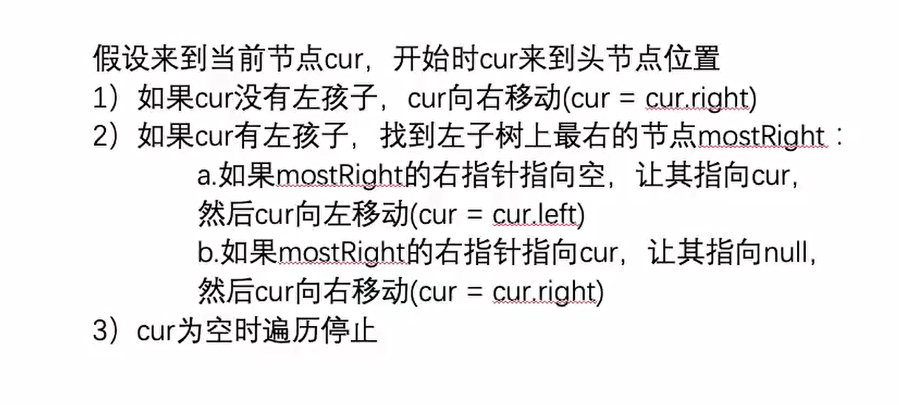
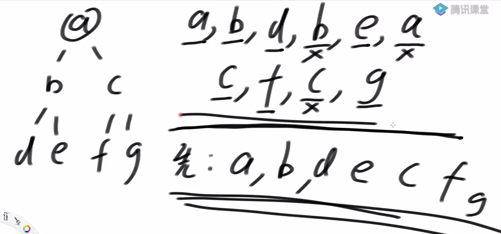
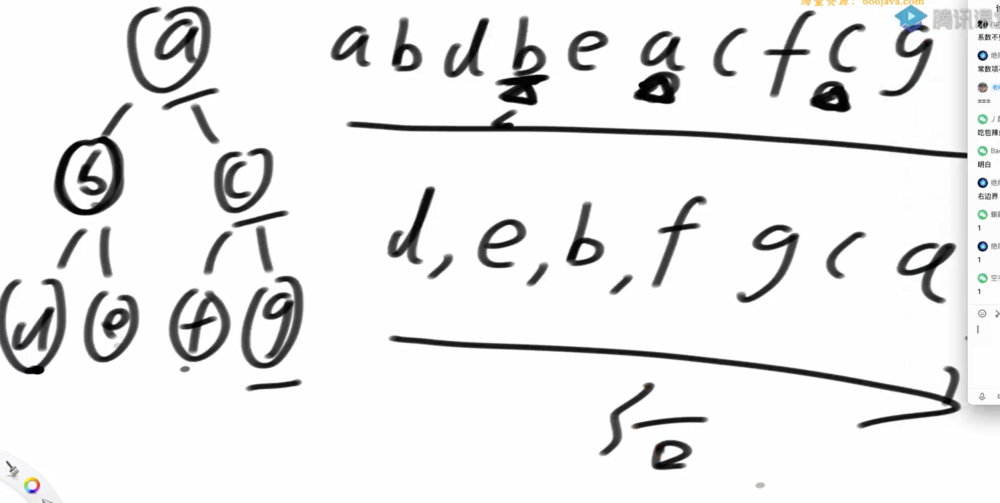
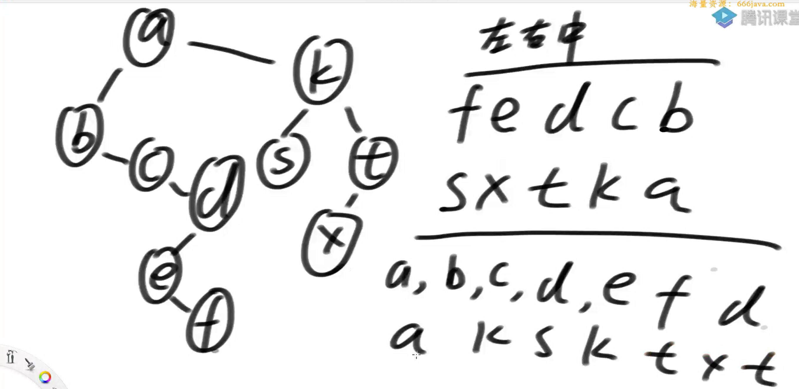
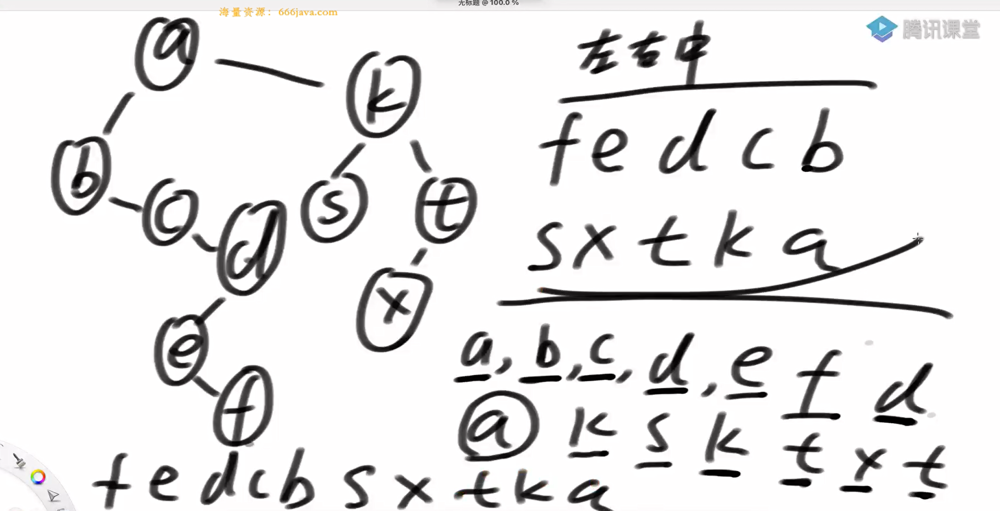

问题一

morris遍历实现

背景：为什么要使用morris遍历

递归或非递归遍历空间复杂度为O（H），H是树的高度

morris遍历是为了将空间复杂度降低到O（1）



通过morris得到先序



后续遍历



morris二次回归点的左树右边界的逆序

最后再把整棵树的左树右边界逆序打印



这里的morris序是基于二叉树的递归序得出来的



左序右边界用链表反转的方法进行操作

```java
package class30;

import java.util.*;

public class code01_MorrisTraversal {

    public static class Node{
        public int value;
        public Node left;
        public Node right;

        public Node(int v){
            value = v;
        }
    }

    public static void process(Node head){
        if (head == null){
            return;
        }

        //1
        process(head.left);
        //2
        process(head.right);
        //3
    }

    public static void processPre(Node head){
        if (head == null){
            return;
        }

        System.out.print(head.value + " ");
        processPre(head.left);
        //2
        processPre(head.right);
        //3
    }

    public static void processIns(Node head){
        if (head == null){
            return;
        }


        processIns(head.left);
        System.out.print(head.value + " ");
        processIns(head.right);
    }

    public static void processPro(Node head){
        if (head == null){
            return;
        }


        processPro(head.left);
        processPro(head.right);
        System.out.print(head.value + " ");
    }


    public static void morris(Node head){
        if (head == null){
            return;
        }
        Node cur = head;
        Node mostRight = null;
        while (cur != null){
            mostRight = cur.left;
            if (mostRight != null){
                while (mostRight.right != null && mostRight.right != cur){
                    mostRight = mostRight.right;
                }
                if (mostRight.right == null){
                    mostRight.right = cur;
                    cur = cur.left;
                    continue;
                }else{
                    mostRight.right = null;
                }
            }
            cur = cur.right;
        }
    }

    public static void morrisPre(Node head){
        if (head == null){
            return;
        }
        Node cur = head;
        Node mostRight = null;
        while (cur != null){
            mostRight = cur.left;
            if (mostRight != null){
                while (mostRight.right != null && mostRight.right != cur){
                    mostRight = mostRight.right;
                }
                if (mostRight.right == null){
                    System.out.print(cur.value + " ");
                    mostRight.right = cur;
                    cur = cur.left;
                    continue;
                }else{
                    mostRight.right = null;
                }
            }else{
                System.out.print(cur.value + " ");
            }
            cur = cur.right;
        }
        System.out.println();
    }

    public static void morrisIns(Node head){
        if (head == null){
            return;
        }
        Node cur = head;
        Node mostRight = null;
        while (cur != null){
            mostRight = cur.left;
            if (mostRight != null){
                while (mostRight.right != null && mostRight.right != cur){
                    mostRight = mostRight.right;
                }
                if (mostRight.right == null){
                    mostRight.right = cur;
                    cur = cur.left;
                    continue;
                }else{
                    mostRight.right = null;
                }
            }
            //1 没有左子树的情况下会打印
            //2 第二次来到cur的时候，并且准备往cur的右子树移动的时候打印
            System.out.print(cur.value + " ");
            cur = cur.right;
        }
        System.out.println();
    }

    public static void morrisPro(Node head){
        if (head == null){
            return;
        }
        Node cur = head;
        Node mostRight = null;
        while (cur != null){
            mostRight = cur.left;
            if (mostRight != null){
                while (mostRight.right != null && mostRight.right != cur){
                    mostRight = mostRight.right;
                }
                if (mostRight.right == null){
                    mostRight.right = cur;
                    cur = cur.left;
                    continue;
                }else{
                    mostRight.right = null;
                    printEdge(cur.left);

                }
            }
            cur = cur.right;
        }
        printEdge(head);
        System.out.println();
    }


    public static void printEdge(Node head){
        Node tail = reverseEdge(head);
        Node cur = tail;
        while (cur != null){
            System.out.print(cur.value + " ");
            cur = cur.right;
        }
        reverseEdge(tail);
    }
    public static Node reverseEdge(Node from){
        Node pre = null;
        Node next = null;
        while(from != null){
            next = from.right;
            from.right = pre;
            pre = from;
            from = next;
        }
        return pre;
    }


    public static boolean isBST(Node head){
        if (head == null){
            return true;
        }

        Node cur = head;
        Node mostRight = null;
        Integer pre = null;
        boolean ans = true;
        while (cur != null){
            mostRight = cur.left;
            if (mostRight != null){
                while (mostRight.right != null && mostRight.right != cur){
                    mostRight = mostRight.right;
                }
                if (mostRight.right == null){
                    mostRight.right = cur;
                    cur = cur.left;
                    continue;
                }else{
                    mostRight.right = null;
                }
            }
            System.out.print(cur.value + " ");
            if (pre != null && pre >= cur.value){
                ans = false;
            }
            pre = cur.value;
            cur = cur.right;
        }
        return ans;
    }

    public static Node generateRandomBST(int level, int maxLevel, int maxValue){
        if (level > maxLevel || new Random().nextDouble() < 0.5){
            return null;
        }
        Node head = new Node(new Random().nextInt(maxValue));
        head.left = generateRandomBST(level + 1, maxLevel, maxValue);
        head.right = generateRandomBST(level + 1, maxLevel, maxValue);
        return head;
    }


    public static void main(String[] args) {
        int testTimes = 5000;
        int maxLevel = 10;
        int maxValue = 10;

        Node head = generateRandomBST(1 , maxLevel, maxValue);
//        processPre(head);
//        System.out.println();
//        morrisPre(head);

//        processIns(head);
//        System.out.println();
//        morrisIns(head);

        processPro(head);
        System.out.println();
        morrisPro(head);

    }
}


```

问题二：

给定一棵二叉树的头节点head，求以head为头的树中，最小深度是多少？

代码实现

```java
package class30;

public class code02_MinHeight {
    public static class Node{
        public int value;
        public Node left;
        public Node right;

        public Node(int v){
            value = v;
        }
    }
    public static int MinHeight1(Node head){
        if (head == null){
            return 0;
        }
        return p1(head);
    }

    public static int p1(Node x){
        if (x.left == null && x.right == null){
            return 1;
        }

        int leftH = Integer.MAX_VALUE;
        if (x.left != null){
            leftH = p1(x.left);
        }

        int rightH = Integer.MAX_VALUE;
        if (x.right != null){
            rightH = p1(x.right);
        }

        return 1 + Math.min(leftH, rightH);
    }


    //morris遍历实现

//    morris遍历需要解决两个问题
//    1)cur变化, level跟随变化
//    2)发现叶节点
    public static int MinHeight2(Node head){
        if (head == null){
            return 0;
        }

        Node mostRight = null;
        Node cur = head;
        int curLevel = 0;
        int minHeight = Integer.MAX_VALUE;
        while (cur != null){
            mostRight = cur.left;
            if (mostRight != null){
                int rightBoardSize = 1;
                while (mostRight.right != null && mostRight.right != cur){
                    rightBoardSize++;
                    mostRight = mostRight.right;
                }

                if (mostRight.right == null){//第一次到cur
                    curLevel++;
                    mostRight.right = cur;
                    cur = cur.left;
                    continue;
                }else{//第二次到cur
                    if (mostRight.left == null){
                        minHeight = Math.min(minHeight, curLevel);
                    }
                    curLevel -= rightBoardSize;
                    mostRight.right = null;
                }
            }else{
                curLevel++;
            }
            cur = cur.right;
        }
        int finalHeight = 1;
        cur = head;
        while(cur.right != null){
            finalHeight++;
            cur = cur.right;
        }
        if (cur.left == null && cur.right == null){
            minHeight = Math.min(minHeight, finalHeight);
        }

        return minHeight;
    }

    // for test
    public static Node generateRandomBST(int maxLevel, int maxValue) {
        return generate(1, maxLevel, maxValue);
    }

    // for test
    public static Node generate(int level, int maxLevel, int maxValue) {
        if (level > maxLevel || Math.random() < 0.5) {
            return null;
        }
        Node head = new Node((int) (Math.random() * maxValue));
        head.left = generate(level + 1, maxLevel, maxValue);
        head.right = generate(level + 1, maxLevel, maxValue);
        return head;
    }

    public static void main(String[] args) {
        int treeLevel = 7;
        int nodeMaxValue = 5;
        int testTimes = 100000;
        System.out.println("test begin");
        for (int i = 0; i < testTimes; i++) {
            Node head = generateRandomBST(treeLevel, nodeMaxValue);
            int ans1 = MinHeight1(head);
            int ans2 = MinHeight2(head);
            if (ans1 != ans2) {
                System.out.println("Oops!");
            }
        }
        System.out.println("test finish!");

    }

}

```