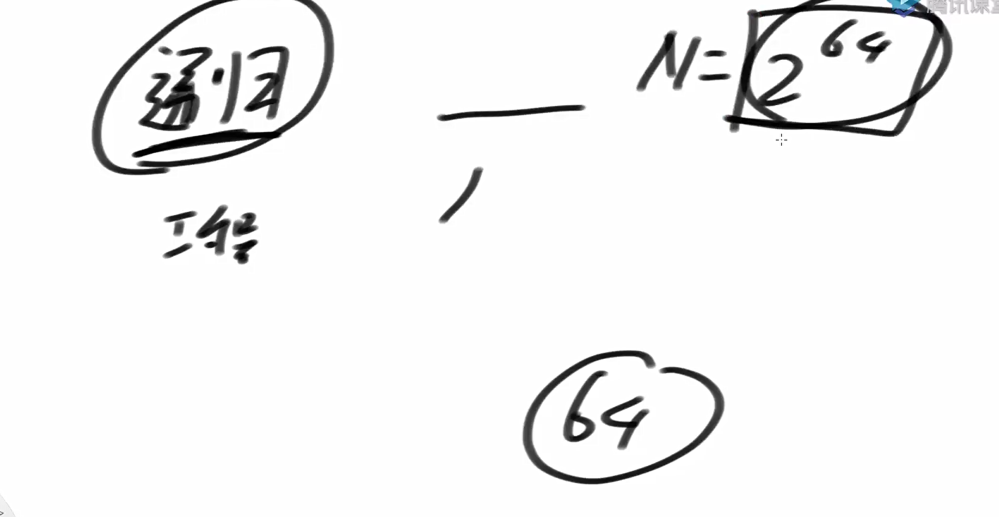
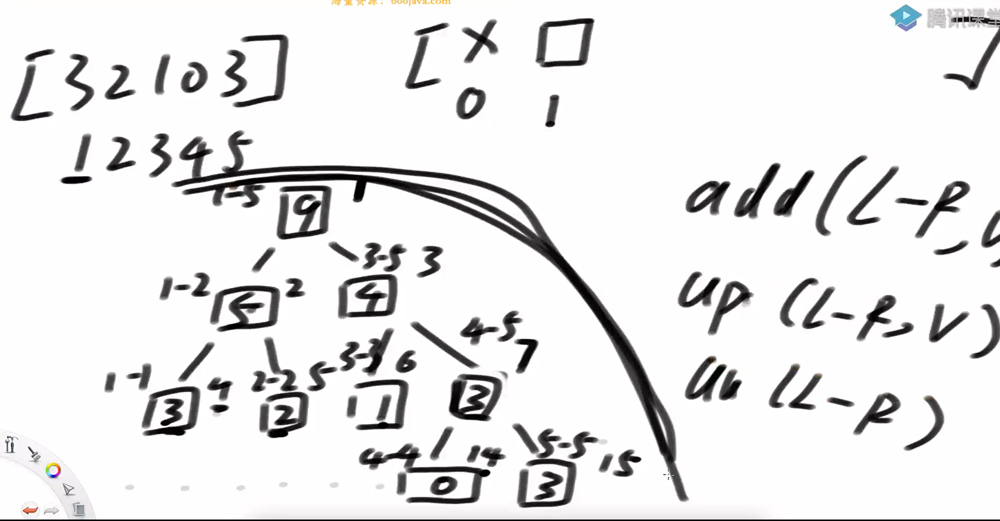
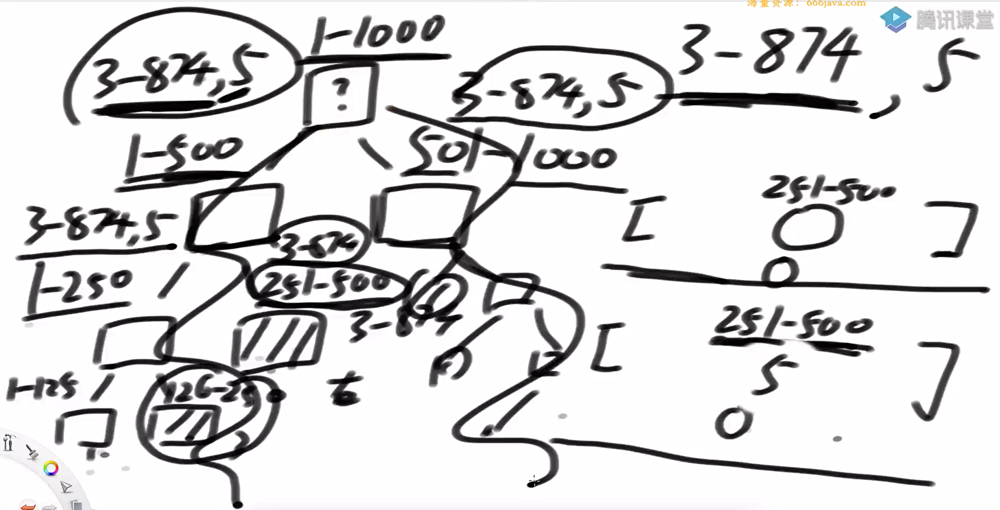
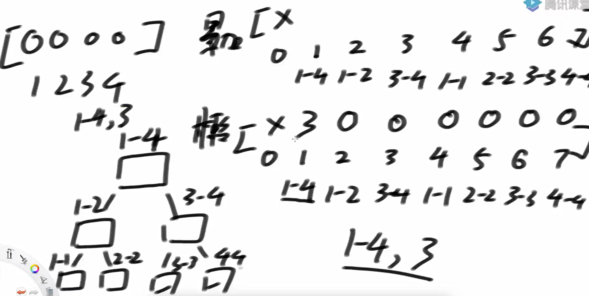
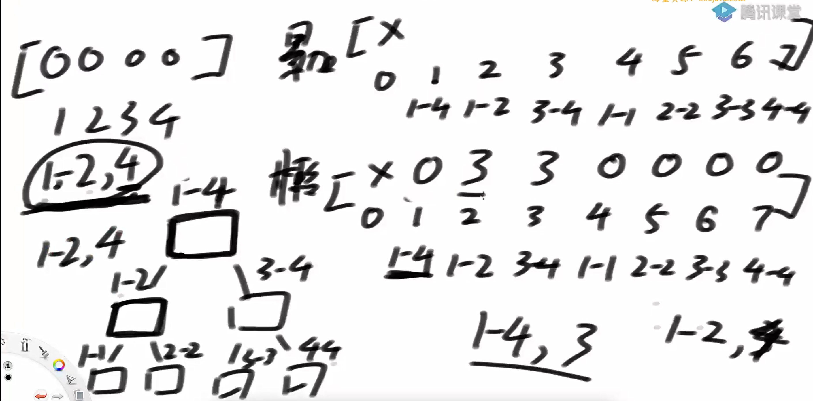
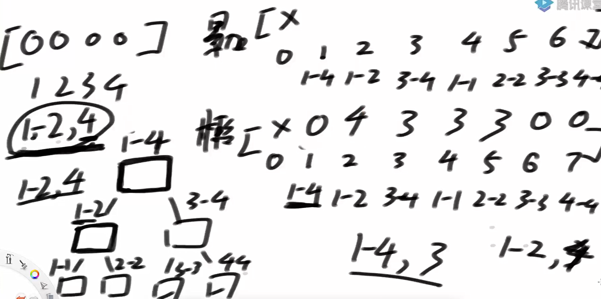
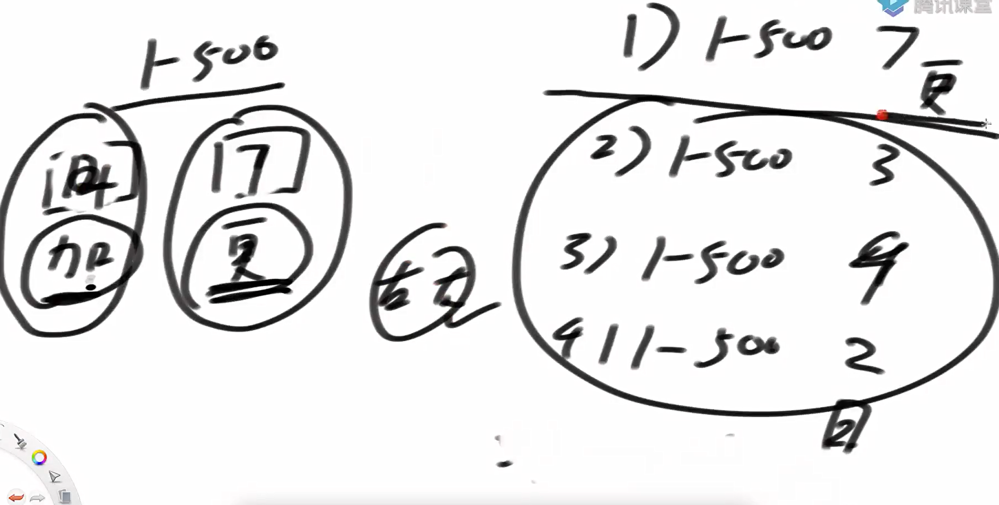

问题一

线段树实现

线段树是一种高级数据结构，主要用于处理以下三类常见的数组区间操作问题：

1. 区间更新

把某个区间** [L, R]** 中的所有数都加上一个值 **C**

或者把整个区间 **[L, R]** 的所有数设置为某个值 **C**

2. 区间查询

查询某个区间** [L, R]** 内所有数的和（也可以是最大值、最小值等）

3. 支持多次操作

在大规模数据上进行大量上述操作时，使用暴力方法效率极低

线段树可以将每次操作的时间复杂度优化到 O(log N) 级别

数据量为2^(64), 空间复杂度也就O(64），所以，不用担心递归导致的空间开销



线段树的结构



如何处理更新

如果全覆盖，就揽住否则下发



时间复杂度两次边界, O（logN）

举例



揽信息变化





关于lazy揽住的值的问题

lazy 揽住的值会被立刻加到当前节点的 sum 上，表示该区间已经被更新；但它不会立即下发给子节点，而是等到后续需要访问子节点时才通过 pushDown() 下发，并同时更新子节点的 sum 和 lazy。

为什么先发更新任务，再发累加任务

因为当1-500范围内，既有更新信息，又有累加信息。那么说明更新信息在前，累加信息在后。

如果先处理累加，再处理更新。就会会导致数据错误，比如下例中，更新的7会覆盖掉累加值导致数据错误。



```java
                   private void pushDown(int rt, int ln, int rn) {
			if (update[rt]) {
				update[rt << 1] = true;
				update[rt << 1 | 1] = true;
				change[rt << 1] = change[rt];
				change[rt << 1 | 1] = change[rt];
				lazy[rt << 1] = 0;
				lazy[rt << 1 | 1] = 0;
				sum[rt << 1] = change[rt] * ln;
				sum[rt << 1 | 1] = change[rt] * rn;
				update[rt] = false;
			}
			if (lazy[rt] != 0) {
				lazy[rt << 1] += lazy[rt];
				sum[rt << 1] += lazy[rt] * ln;
				lazy[rt << 1 | 1] += lazy[rt];
				sum[rt << 1 | 1] += lazy[rt] * rn;
				lazy[rt] = 0;
			}
		}
```

基本思想：

通过lazy将本用于进行递归到底部的过程，在根节点进行揽住，减少递归

```java
package class31;

public class code01_SegmentTree {

    public static class SegmentTree{
        private int MAXN;
        //origin为原始数组， arr是origin搬过来，但起始点是1
        private int[] arr;
        private int[] sum;
        private int[] lazy;
        private int[] change;
        private boolean[] update;

        public SegmentTree(int[] origin){
            MAXN = origin.length + 1;
            arr = new int[MAXN];

            for (int i = 1; i < MAXN; i++){
                arr[i] = origin[i - 1];
            }
            sum = new int[MAXN * 4];//当MAXN = 2^(?) + 1时， 对应sums需要4 * MAXN，这是最糟糕的情况
            lazy = new int[MAXN * 4];
            change = new int[MAXN * 4];
            update = new boolean[MAXN * 4];
        }

        //[l, r]范围对应的sums的索引为rt
        private void build(int l, int r, int rt){
            if (l == r){ //l = r的时候， sums[rt]对应arr[l]
                sum[rt] = arr[l];
                return;
            }
            int mid = (l + r) / 2;
            build(l, mid, rt * 2);
            build(mid + 1, r,rt * 2 + 1);
            pushUp(rt);
        }

        private void pushUp(int rt){
            sum[rt] = sum[rt * 2] + sum[rt * 2 + 1];
        }

//          每个节点都有一个布尔数组 update[]，用来记录它是否有一个“覆盖更新”的懒惰任务。
//          change[rt] 的作用是保存当前节点的覆盖更新值。
//              当你在 pushDown 中处理了 update 标记后，
//              意味着这个覆盖操作已经被下传给了子节点，因此对于当前节点来说，
//              它已经完成了它的任务。但是，并不需要将 change[rt] 设为 0 或者任何特定值，因为一旦
//              update[rt] 被设置为 false，表示当前节点不再持有未下传的覆盖更新任务，
//              此时 change[rt] 的具体值就变得无关紧要了，除非有新的覆盖更新操作再次修改它。

        //pushDown是懒惰标记下传函数
        //在进行区间查询和操作之前，将"未完成任务"下发给子节点，保证后面操作的数据是正确的
        private void pushDown(int rt, int ln, int rn){
            if (update[rt]){
                update[rt * 2] = true;
                update[rt * 2 + 1] = true;
                change[rt * 2] = change[rt];
                change[rt * 2 + 1] = change[rt];
                lazy[rt * 2] = 0;
                lazy[rt * 2 + 1] = 0;
                sum[rt * 2] = change[rt] * ln;
                sum[rt * 2 + 1] = change[rt] * rn;
                update[rt] = false;

            }
            if (lazy[rt] != 0){
                lazy[rt * 2] += lazy[rt];
                sum[rt * 2] += lazy[rt] * ln;
                lazy[rt * 2 + 1] += lazy[rt];
                sum[rt * 2 + 1] += lazy[rt] * rn;
                lazy[rt] = 0;
            }
        }


        //L ~ R 所有的值都变成C
        //l ~ r是arr的实际的范围，rt为sum的索引点
        public  void update(int L, int R, int C, int l, int r, int rt){
            //完全覆盖
//            完全覆盖（Current Task Can Be Lazy）：
//            如果当前节点的区间 [l, r] 完全被待更新区间 [L, R]
//            包含（即 L <= l && r <= R），则可以直接在这个节点上应用更新操作，
//            并设置相应的懒惰标记。
//            在这种情况下，不需要进一步下传更新，因为整个区间的值都被替换了
//            任何之前的懒惰标记都不再适用。
            if (L <= l && r <= R){
                update[rt] = true;
                change[rt] = C;
                sum[rt] = (r - l + 1) * C;
                lazy[rt] = 0;
                return;
            }
//            部分覆盖
//            如果当前节点的区间 [l, r] 只是部分包含在待更新区间
//                    [L, R] 中，则需要将更新操作分解并传递给子节点。
//            在这种情况下，必须调用 pushDown 函数来确保当前节点的懒惰标记被正确地下
//        传给子节点，然后再分别对左右子节点进行递归更新。
            int mid = (l + r) / 2;
            pushDown(rt, mid - l + 1, r - mid);
            if (L <= mid){
                update(L, R, C, l, mid, rt * 2);
            }

            if (R > mid){
                update(L, R, C, mid+1, r, rt * 2 + 1);
            }
            pushUp(rt);
        }

        public void add(int L, int R, int C, int l, int r, int rt){
            if (L <= l && r <= R){
                sum[rt] += C * (r - l + 1);
                lazy[rt] += C;
                return;
            }

            int mid = (l + r) / 2;
            pushDown(rt, mid - l + 1, r - mid);

            if (L <= mid) {
                add(L, R, C, l, mid, rt << 1);
            }
            if (R > mid) {
                add(L, R, C, mid + 1, r, rt << 1 | 1);
            }
            pushUp(rt);
        }

        public long query(int L, int R, int l, int r, int rt) {
            if (L <= l && r <= R) {
                return sum[rt];
            }
            int mid = (l + r) >> 1;
            pushDown(rt, mid - l + 1, r - mid);
            long ans = 0;
            if (L <= mid) {
                ans += query(L, R, l, mid, rt << 1);
            }
            if (R > mid) {
                ans += query(L, R, mid + 1, r, rt << 1 | 1);
            }
            return ans;
        }
    }

    public static class Right {
        public int[] arr;

        public Right(int[] origin) {
            arr = new int[origin.length + 1];
            for (int i = 0; i < origin.length; i++) {
                arr[i + 1] = origin[i];
            }
        }

        public void update(int L, int R, int C) {
            for (int i = L; i <= R; i++) {
                arr[i] = C;
            }
        }

        public void add(int L, int R, int C) {
            for (int i = L; i <= R; i++) {
                arr[i] += C;
            }
        }

        public long query(int L, int R) {
            long ans = 0;
            for (int i = L; i <= R; i++) {
                ans += arr[i];
            }
            return ans;
        }

    }

    public static int[] genarateRandomArray(int len, int max) {
        int size = (int) (Math.random() * len) + 1;
        int[] origin = new int[size];
        for (int i = 0; i < size; i++) {
            origin[i] = (int) (Math.random() * max) - (int) (Math.random() * max);
        }
        return origin;
    }

    public static boolean test() {
        int len = 100;
        int max = 1000;
        int testTimes = 5000;
        int addOrUpdateTimes = 1000;
        int queryTimes = 500;
        for (int i = 0; i < testTimes; i++) {
            int[] origin = genarateRandomArray(len, max);
            SegmentTree seg = new SegmentTree(origin);
            int S = 1;
            int N = origin.length;
            int root = 1;
            seg.build(S, N, root);
            Right rig = new Right(origin);
            for (int j = 0; j < addOrUpdateTimes; j++) {
                int num1 = (int) (Math.random() * N) + 1;
                int num2 = (int) (Math.random() * N) + 1;
                int L = Math.min(num1, num2);
                int R = Math.max(num1, num2);
                int C = (int) (Math.random() * max) - (int) (Math.random() * max);
                if (Math.random() < 0.5) {
                    seg.add(L, R, C, S, N, root);
                    rig.add(L, R, C);
                } else {
                    seg.update(L, R, C, S, N, root);
                    rig.update(L, R, C);
                }
            }
            for (int k = 0; k < queryTimes; k++) {
                int num1 = (int) (Math.random() * N) + 1;
                int num2 = (int) (Math.random() * N) + 1;
                int L = Math.min(num1, num2);
                int R = Math.max(num1, num2);
                long ans1 = seg.query(L, R, S, N, root);
                long ans2 = rig.query(L, R);
                if (ans1 != ans2) {
                    return false;
                }
            }
        }
        return true;
    }

    public static void main(String[] args) {
        System.out.println("对数器测试开始...");
        System.out.println("测试结果 : " + (test() ? "通过" : "未通过"));
    }
}

```

问题二：lc699

你从空中按顺序掉落一些正方形方块，每个方块 i 掉落在水平坐标轴 [start_i, start_i + size_i - 1] 的区间上。

方块会“堆叠”在之前方块的顶部；

每个方块落下后，整个结构的最大高度是多少？

你需要返回一个列表，记录每次方块落下后当前整体结构的最大高度。

本题的思路：

1.通过离散化进行数组压缩

int L = map.get(arr[0]);

              int R = map.get(arr[0] + arr[1] - 1);

上面这个是将来到的方块，映射到离散化的数组上面，这样可以大幅度减少空间损耗

2.然后通过线段树进行优化即可

基本原理是lazy方法

代码实现

```java
package class31;

import java.util.*;

public class code02_FallingSquares {


    public static HashMap<Integer,Integer> index(int[][] position){
        TreeSet<Integer> pos = new TreeSet<>();
        for (int[] arr : position){
            pos.add(arr[0]);
            pos.add(arr[0] + arr[1] - 1);
        }

        HashMap<Integer, Integer> map = new HashMap<>();
        int count = 0;
        for (Integer index : pos){
            map.put(index, ++count);
        }

        return map;
    }

    public static class Right{
       private int[] max;


        public Right(int N) {
            max = new int[N + 1];
        }

        public void update(int L, int R, int C) {
            for (int i = L; i <= R; i++) {
                max[i] = C;
            }
        }

        public int query(int L, int R) {
            int res = 0;
            for (int i = L; i <= R; i++) {
                res = Math.max(res, max[i]);
            }
            return res;
        }
    }

    public List<Integer> fallingSquares1(int[][] positions) {
        HashMap<Integer, Integer> map = index(positions);
        int N = map.size();

        Right right = new Right(N);
        int max = 0;
        List<Integer> res = new ArrayList<>();
        for (int[] arr : positions) {
            int L = map.get(arr[0]);
            int R = map.get(arr[0] + arr[1] - 1);
            int height = right.query(L, R) + arr[1];
            max = Math.max(max, height);
            res.add(max);
            right.update(L, R, height);
        }
        return res;
    }

    public static class SegmentTree{
        private int[] max;
        private int[] change;
        private boolean[] update;

        public SegmentTree(int size){
            int N = size + 1;
            max = new int[4 * N];
            change = new int[4 * N];
            update = new boolean[4 * N];
        }

        public void pushUp(int rt){
            max[rt] = Math.max(max[rt * 2],max[rt * 2 + 1]);
        }

        private void pushDown(int rt, int ln, int rn){
            if (update[rt]){
                update[rt * 2] = true;
                update[rt * 2 + 1] = true;
                change[rt * 2] = change[rt];
                change[rt * 2 + 1] = change[rt];
                max[rt * 2] = change[rt];
                max[rt * 2 + 1] = change[rt];
                update[rt] = false;
            }
        }


        public void update(int L, int R, int C, int l, int r, int rt){
            if (L <= l && r <= R){
                update[rt] = true;
                change[rt] = C;
                max[rt] = C;
                return;
            }
            int mid = (l + r) / 2;
            pushDown(rt, mid - l + 1, l - mid);
            if (L <= mid){
                update(L, R, C, l, mid, rt * 2);
            }

            if (R > mid){
                update(L, R, C, mid+1, r, rt * 2 + 1);
            }

            pushUp(rt);
        }

        public int query(int L, int R, int l, int r, int rt) {
            if (L <= l && r <= R) {
                return max[rt];
            }
            int mid = (l + r) >> 1;
            pushDown(rt, mid - l + 1, r - mid);
            int left = 0;
            int right = 0;
            if (L <= mid) {
                left = query(L, R, l, mid, rt << 1);
            }
            if (R > mid) {
                right = query(L, R, mid + 1, r, rt << 1 | 1);
            }
            return Math.max(left, right);
        }
    }


    public List<Integer> fallingSquares2(int[][] positions) {
        HashMap<Integer, Integer> map = index(positions);
        int N = map.size();
        SegmentTree segmentTree = new SegmentTree(N);
        int max = 0;
        List<Integer> res = new ArrayList<>();
        // 每落一个正方形，收集一下，所有东西组成的图像，最高高度是什么
        for (int[] arr : positions) {
            int L = map.get(arr[0]);
            int R = map.get(arr[0] + arr[1] - 1);
            int height = segmentTree.query(L, R, 1, N, 1) + arr[1];
            max = Math.max(max, height);
            res.add(max);
            segmentTree.update(L, R, height, 1, N, 1);
        }
        return res;
    }

    public static void main(String[] args) {
        int testCases = 100; // 测试案例的数量
        int maxSize = 10; // 每个测试案例中方块的最大数量

        Random random = new Random();

        code02_FallingSquares solver = new code02_FallingSquares();

        for (int i = 0; i < testCases; i++) {
            // 生成随机测试案例
            int size = random.nextInt(maxSize) + 1;
            int[][] positions = new int[size][2];
            for (int j = 0; j < size; j++) {
                positions[j][0] = random.nextInt(10) + 1; // 随机起点位置
                positions[j][1] = random.nextInt(5) + 1; // 随机长度
            }

            // 分别调用两种方法
            List<Integer> result1 = solver.fallingSquares1(positions);
            List<Integer> result2 = solver.fallingSquares2(positions);

            // 比较结果
            if (!result1.equals(result2)) {
                System.out.println("Test case " + (i + 1) + " failed.");
                printArray(positions);
                System.out.println("Result 1: " + result1);
                System.out.println("Result 2: " + result2);
                return;
            }
        }
        System.out.println("All tests passed!");
    }

    private static void printArray(int[][] array) {
        for (int[] row : array) {
            for (int val : row) {
                System.out.print(val + " ");
            }
            System.out.println();
        }
    }
}

```