问题一(indexTree实现)

特点：

1. 支持区间查询
这种数据结构能够有效地处理和回答关于特定区间的问题，比如求某个区间的最大值、最小值或总和等。

1. 没有线段树那么强，但是非常容易改成一维、二维、三维的结构
相比于功能更为强大的线段树，这种数据结构在某些方面可能稍显不足。然而，它的优势在于其灵活性和可扩展性，可以轻松地从一维扩展到二维甚至三维，适用于不同维度的数据处理需求。

1. 只支持单点更新
该数据结构仅允许对单个点进行更新操作，而不支持批量或区间更新。这意味着每次只能修改一个特定位置的值，对于需要频繁进行区间更新的应用场景可能不够高效。

help数组怎么设置

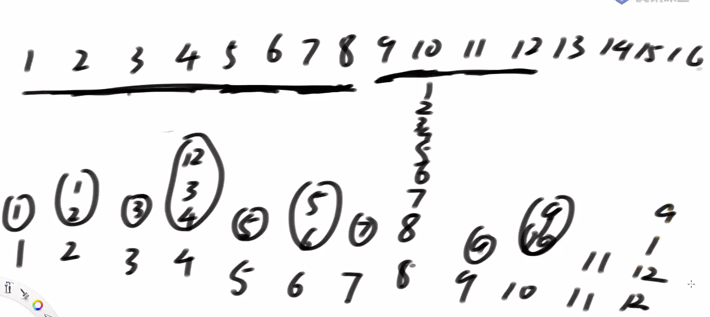

index覆盖的范围

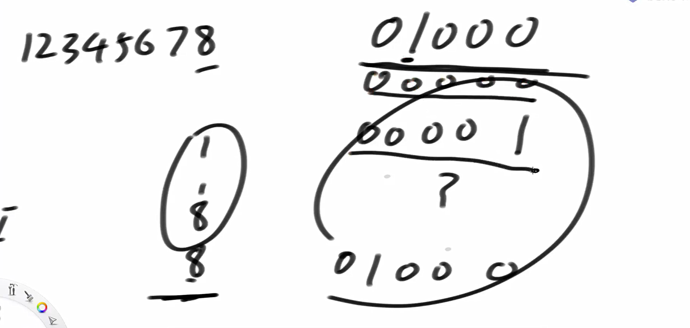

前缀和的计算

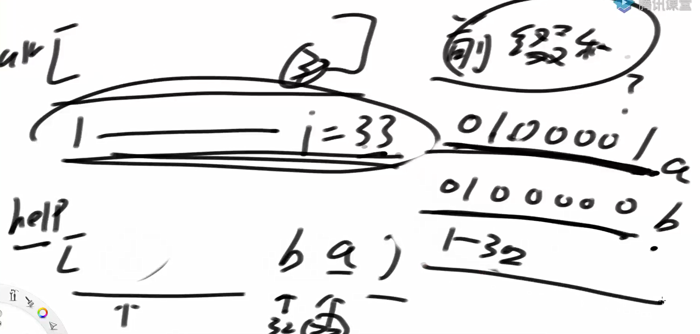

怎么计算1-i位置的累加和

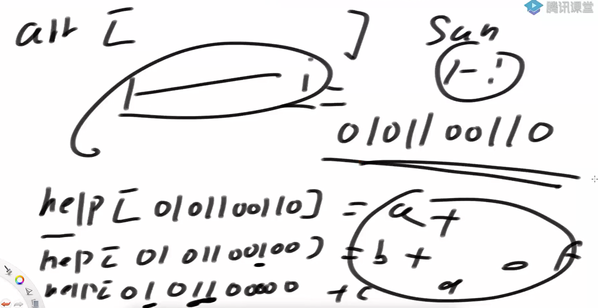

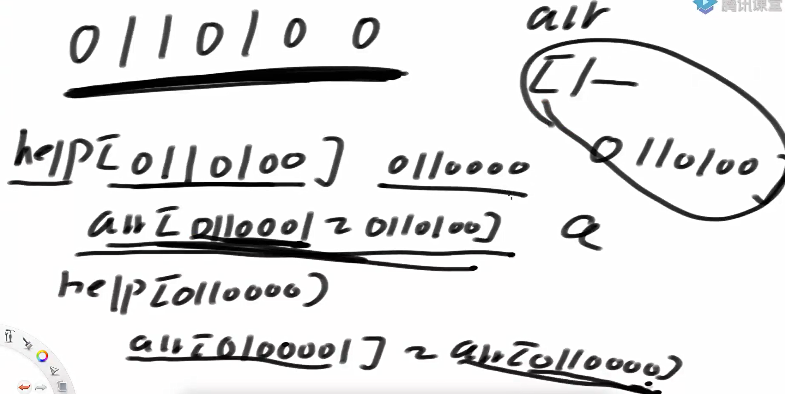

若修改3导致牵连，牵连关系是什么

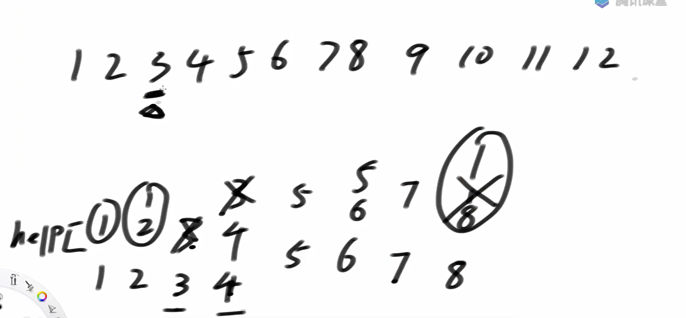

以需要改动的位置为根基

然后找到最右侧的1加个1就可以找到牵连位置

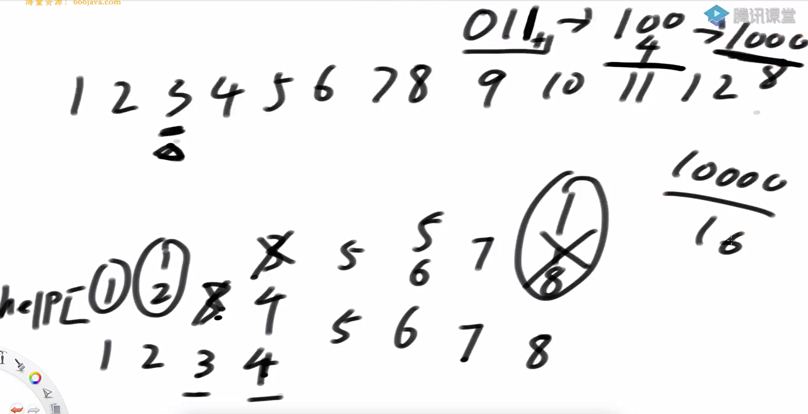

代码实现

```java
package class32;

public class code01_IndexTree {


    public static class IndexTree{
        private int[] tree;
        private int N;


        public IndexTree(int size){
            N = size;
            tree = new int[N + 1];
        }
        //index是tree[1~N]
        public void add(int index, int d){
            while (index <= N){
                tree[index] += d;
                index += index & (-index);
            }
        }

        public int sum(int index){
            int ret = 0;
            while (index >= 1){
                ret += tree[index];
                index -= index & (-index);
            }
            return ret;
        }
    }

    public static class Right {
        private int[] nums;
        private int N;

        public Right(int size) {
            N = size + 1;
            nums = new int[N + 1];
        }

        public int sum(int index) {
            int ret = 0;
            for (int i = 1; i <= index; i++) {
                ret += nums[i];
            }
            return ret;
        }

        public void add(int index, int d) {
            nums[index] += d;
        }

    }

    public static void main(String[] args) {
        int N = 100;
        int V = 100;
        int testTime = 2000000;
        IndexTree tree = new IndexTree(N);
        Right test = new Right(N);
        System.out.println("test begin");
        for (int i = 0; i < testTime; i++) {
            int index = (int) (Math.random() * N) + 1;
            if (Math.random() <= 0.5) {
                int add = (int) (Math.random() * V);
                tree.add(index, add);
                test.add(index, add);
            } else {
                if (tree.sum(index) != test.sum(index)) {
                    System.out.println("Oops!");
                }
            }
        }
        System.out.println("test finish");
    }
}

```

使用indexTree是因为相较于线段树，indexTree的可以非常方便的扩展的二维

二维indexTree

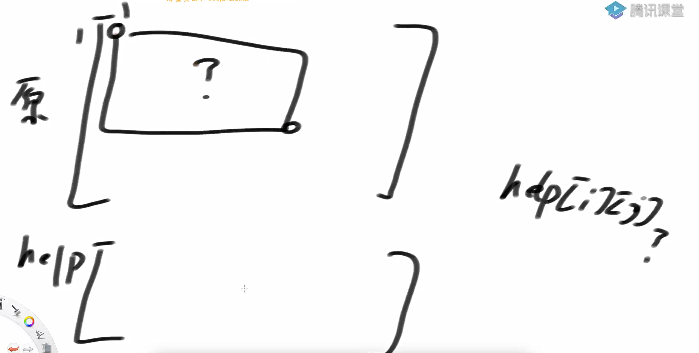

help点的位置的关联

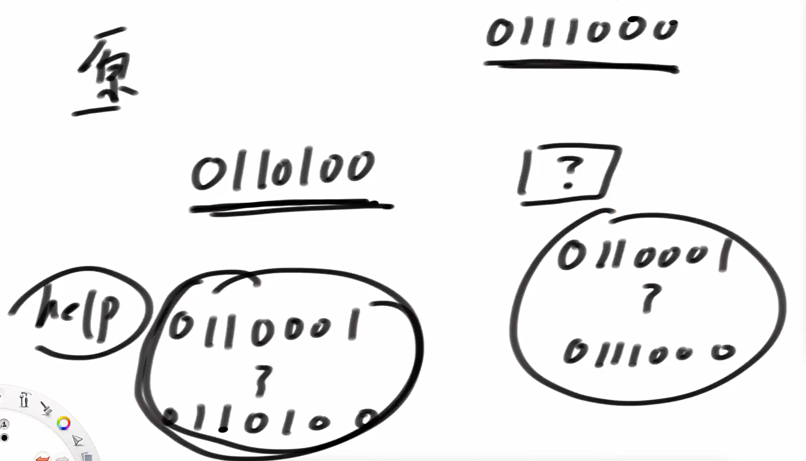

三维

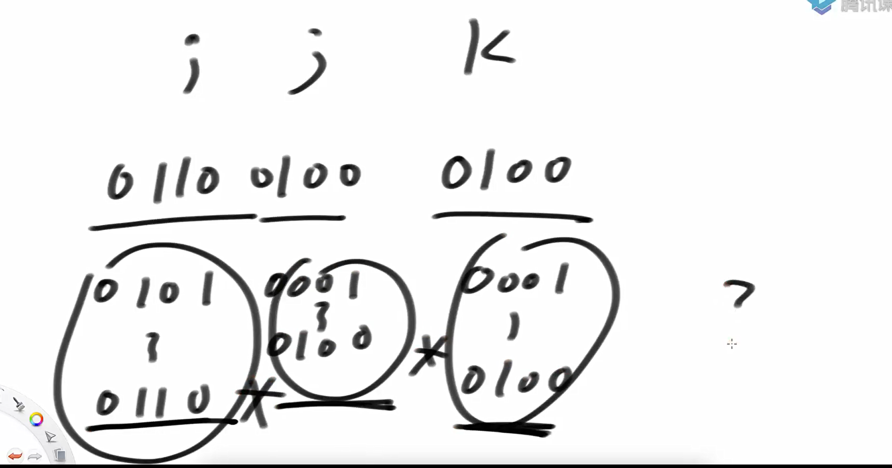

问题二：

二维indexTree实现

// 测试链接：[https://leetcode.com/problems/range-sum-query-2d-mutable](https://leetcode.com/problems/range-sum-query-2d-mutable)

// 但这个题是付费题目

// 提交时把类名、构造函数名从Code02_IndexTree2D改成NumMatrix

代码实现

```java
package class32;

public class code02_IndexTree2D {


    public static class IndexTree2D{
        private int[][] tree;
        private int[][] nums;
        private int N;
        private int M;

        public IndexTree2D(int[][] matrix){
            if (matrix.length == 0 || matrix[0].length == 0){
                return;
            }
            N = matrix.length;
            M = matrix[0].length;
            tree = new int[N + 1][M + 1];
            nums = new int[N][M];
            for (int i = 0; i < N; i++){
                for (int j = 0; j < M; j++){
                    update(i, j, matrix[i][j]);
                }
            }
        }

        public void update(int row, int col, int val){
            if (N == 0 || M == 0){
                return;
            }
            int add = val - nums[row][col];
            nums[row][col] = val;
            for (int i = row + 1; i <= N; i += i & (-i)){
                for (int j = col + 1; j <= M; j += j & (-j)){
                    tree[i][j] += add;
                }
            }
        }


        public int sum(int row, int col){
            int sum = 0;
            for (int i = row + 1; i > 0; i -= i & (-i)){
                for (int j = col + 1; j > 0; j -= j & (-j)){
                    sum += tree[i][j];
                }
            }
            return sum;
        }


        public int sumRegion(int row1, int col1, int row2, int col2) {
            return sum(row2, col2) + sum(row1, col1) - sum(row1 - 1, col2) - sum(row2, col1-1);
        }
    }

}

```

问题三：

ac自动机实现

前缀树

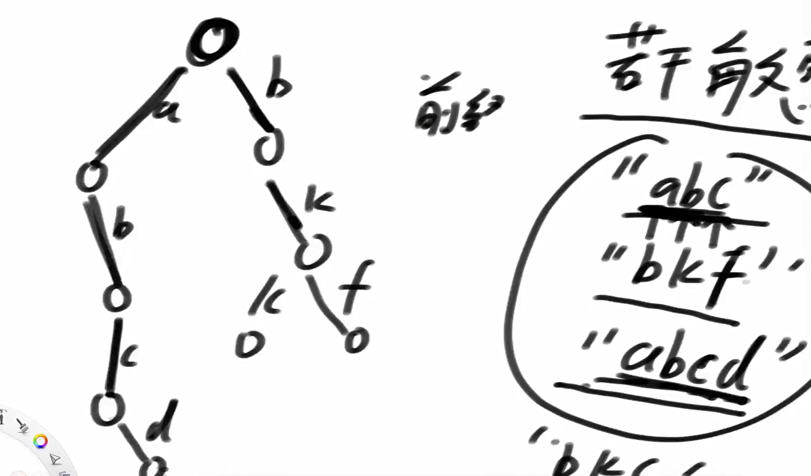

fail指针的指向

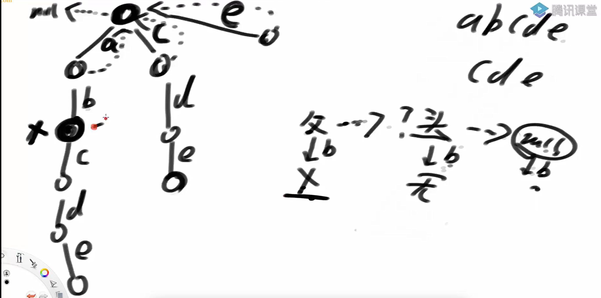

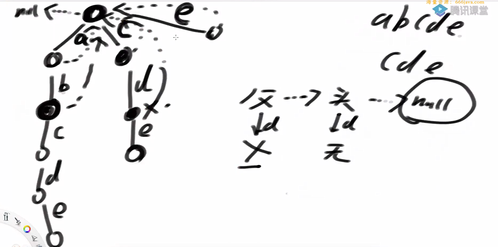

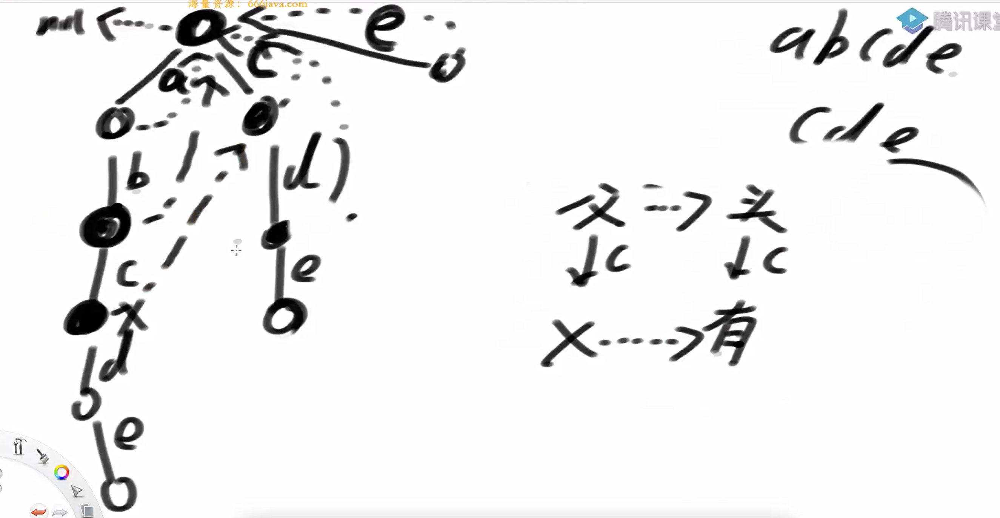

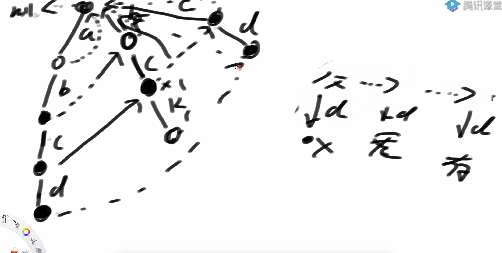

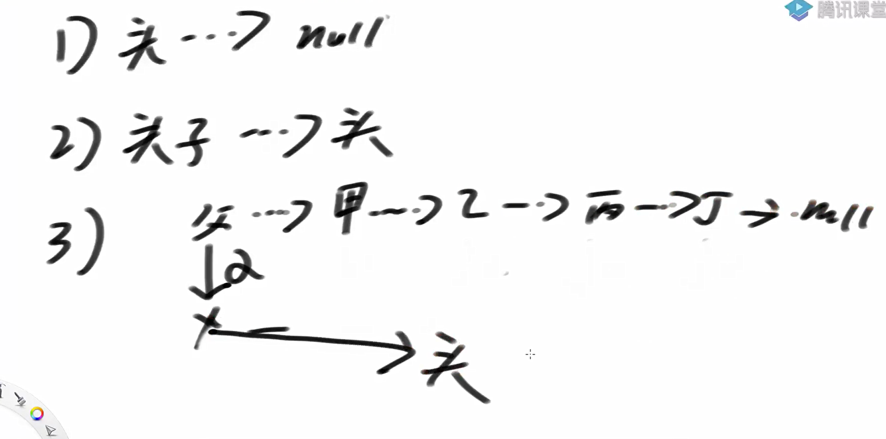

ac自动机淘汰策略

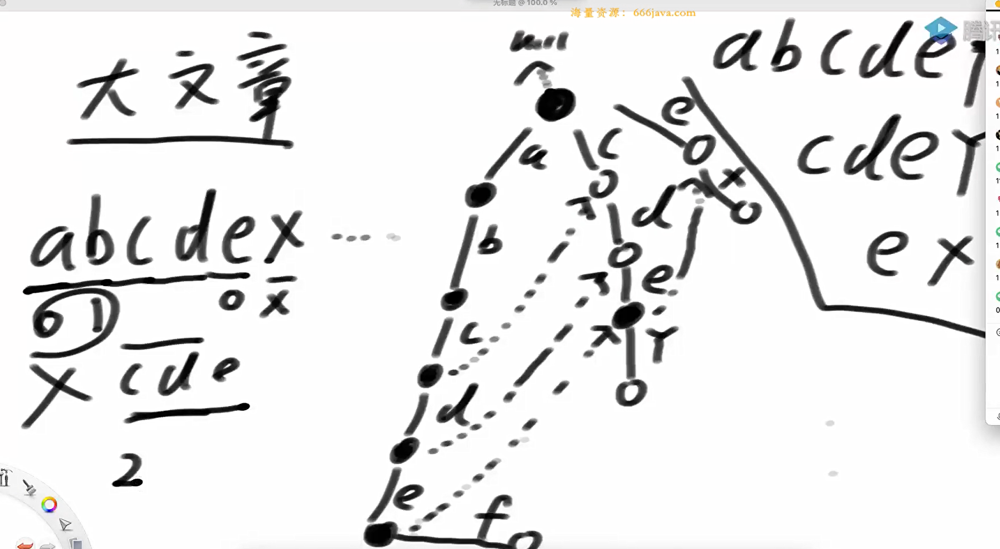

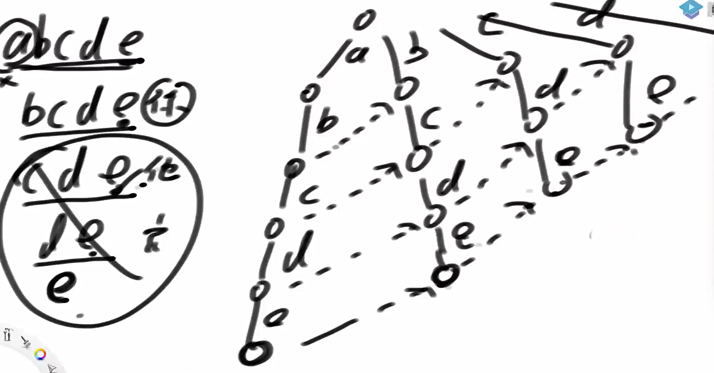

如何保证最长

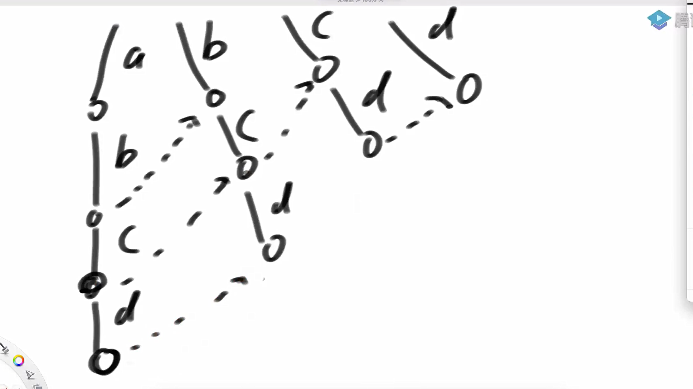

x节点的父节点就已经保证了最长，这样就可以保证x是最长

最长部分不依赖于具体的画法

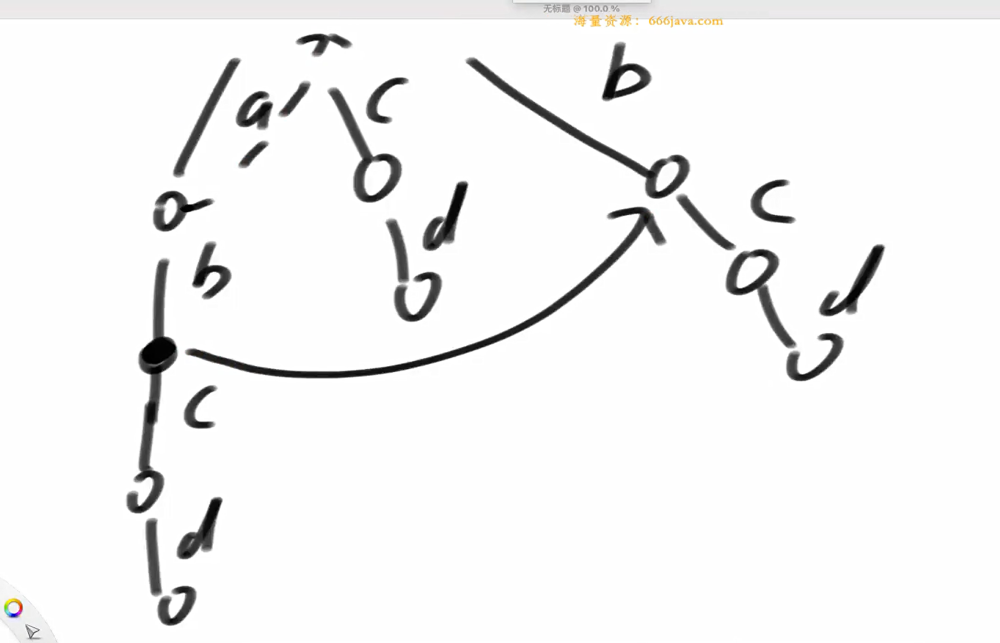

收集的方法

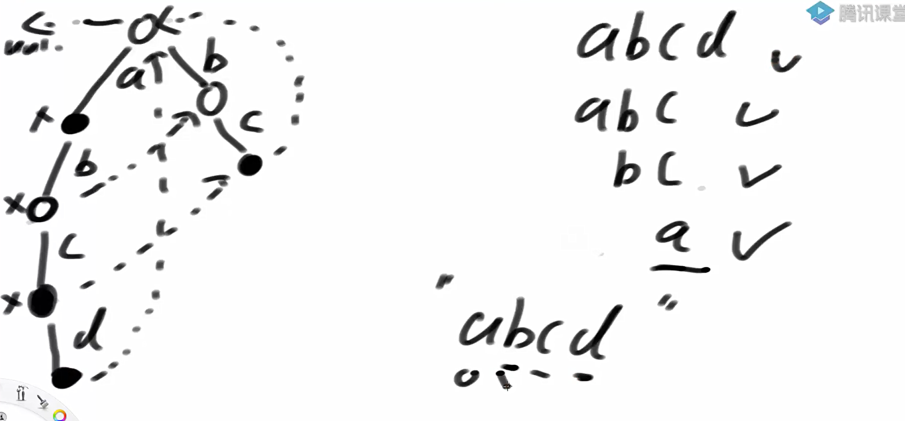

代码实现

```java
package class32;

import java.util.ArrayList;
import java.util.LinkedList;
import java.util.List;
import java.util.Queue;

public class code03_AC {

    public static class Node{
        public String end;
        public boolean endUse;
        public Node fail;
        public Node[] nexts;


        public Node(){
            endUse = false;
            end = null;
            fail = null;
            nexts = new Node[26];
        }
    }

    public static class ACAutomation{
        private Node root;


        public ACAutomation(){
            root = new Node();
        }

        public void insert(String s){
            char[] str = s.toCharArray();
            Node cur = root;
            int index = 0;
            for (int i = 0; i < str.length; i++){
                index = str[i] - 'a';
                if (cur.nexts[index] == null){
                    cur.nexts[index] = new Node();
                }
                cur = cur.nexts[index];
            }
            cur.end = s;
        }

        public void build(){
            Queue<Node> queue = new LinkedList<>();
            queue.add(root);
            Node cur = null;
            Node cfail = null;
            while (!queue.isEmpty()){
                cur = queue.poll();
                for (int i = 0; i < 26; i++){
                    //cur是当前父节点， cur.next[i] != null的时候cur.next[i]是cur的子节点
                    if (cur.nexts[i] != null){
                        //先假设子节点找不到
                        cur.nexts[i].fail = root;
                        cfail = cur.fail;
                        while (cfail != null){
                            if (cfail.nexts[i] != null){
                                cur.nexts[i].fail = cfail.nexts[i];
                                break;
                            }
                            cfail = cfail.fail;
                        }

                        queue.add(cur.nexts[i]);
                    }
                }
            }
        }

        public List<String> containWords(String content) {
            char[] str = content.toCharArray();
            Node cur = root;
            Node follow = null;
            int index = 0;
            List<String> ans = new ArrayList<>();
            for (int i = 0; i < str.length; i++){
                index = str[i] - 'a';
                //类似kmp中的失败重试部分
                //str1[x] != str2[y] -> y` = next[y], cur.nexts[index] != null 类似
                //str1[x] == str2[y`] 
                while (cur.nexts[index] == null && cur != root){
                    cur = cur.fail;
                }
                cur = cur.nexts[index] != null ? cur.nexts[index] : root;
                follow = cur;
                while (follow != null){
                    if (follow.endUse){
                        break;
                    }

                    if (follow.end != null){
                        ans.add(follow.end);
                        follow.endUse = true;
                    }
                    follow = follow.fail;
                }
            }
            return ans;
        }
    }

    public static void main(String[] args) {
        ACAutomation ac = new ACAutomation();
        ac.insert("dhe");
        ac.insert("he");
        ac.insert("abcdheks");
        // 设置fail指针
        ac.build();

        List<String> contains = ac.containWords("abcdhekskdjfafhasldkflskdjhwqaeruv");
        for (String word : contains) {
            System.out.println(word);
        }
    }
}

```