问题一

avl树的实现

🧠 解决的问题

✅ 主要功能：

键值对存储结构

支持插入 (put)、删除 (remove)、查找 (get) 键值对。

每个键是唯一的，并且实现了 Comparable 接口，确保可以进行大小比较。

有序性支持

基于 AVL 树的特性，键是按照自然顺序排序的。

提供了以下有序操作：

firstKey()：返回最小的键。

lastKey()：返回最大的键。

floorKey(K key)：返回小于等于给定键的最大键。

ceilingKey(K key)：返回大于等于给定键的最小键。

自平衡机制

插入和删除操作后自动调用 maintain() 方法，通过 左旋、右旋 来保持树的高度平衡。

这样保证了所有操作的时间复杂度为 O(log n)。

左旋

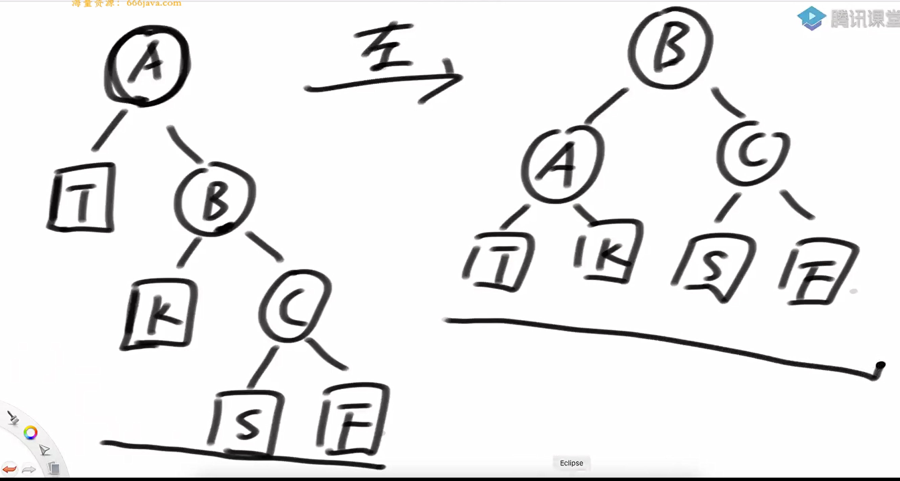

右旋

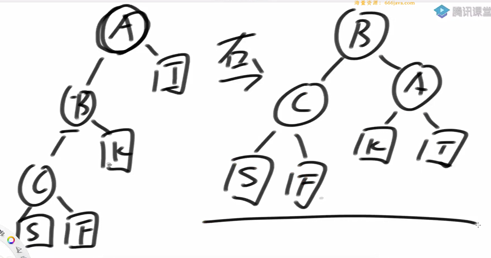

avl树的平衡

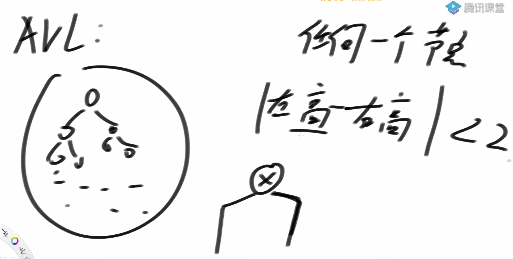

二叉搜索树怎么删除

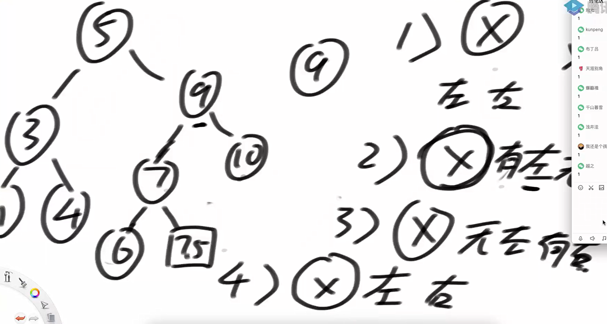

1 x单独无左右子树，那么直接删就可以

2 x有左无右，那么可以将x作替代x本身

3 x有左有右，删除方法时找到x的右子树的最左节点替代x（左树上的最右节点也是可以的）

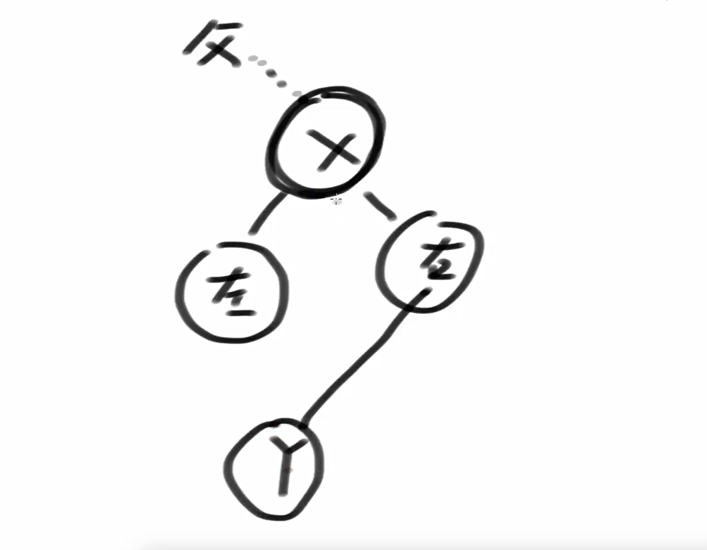

需要操作的类型

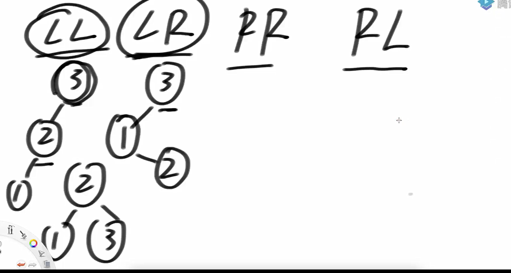

lr型的失衡

左树的右树导致的失衡就是lr型

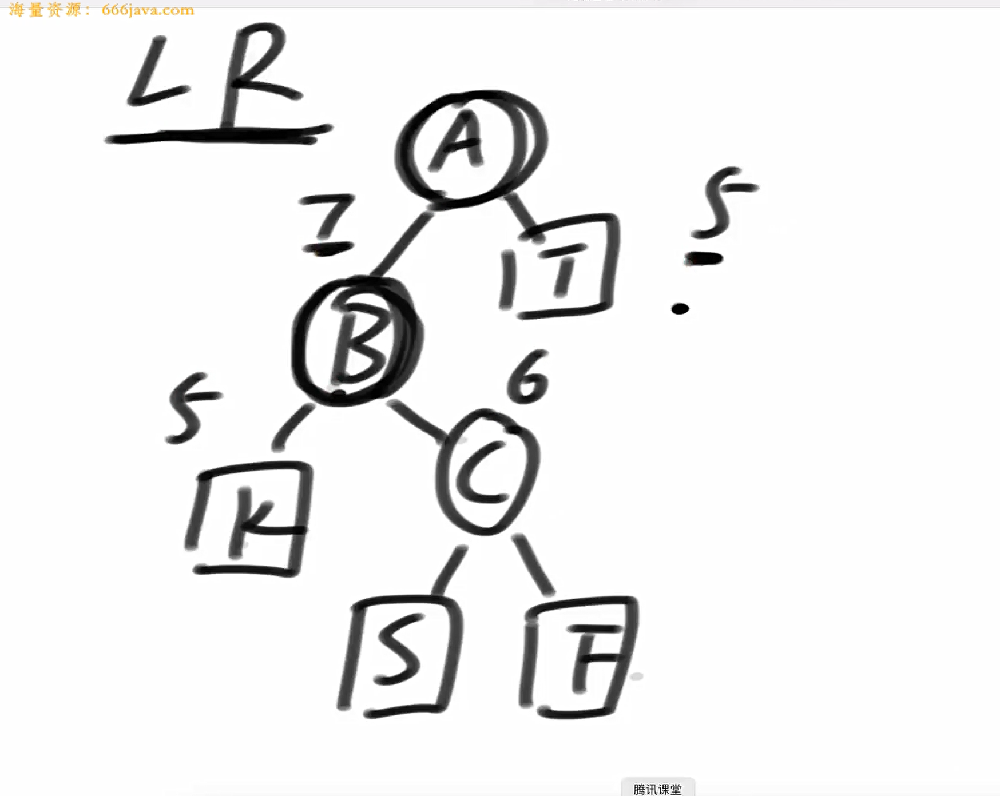

对于lr型，先对a的子树来个左旋

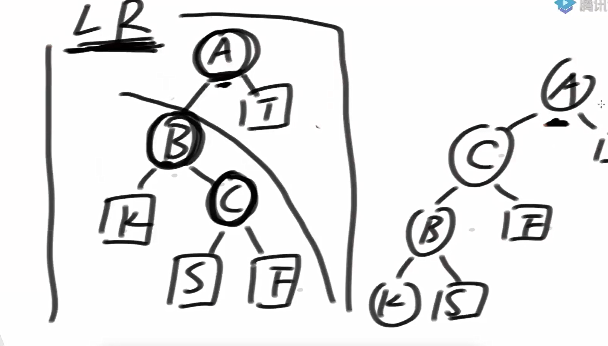

再对a整棵树来个右旋

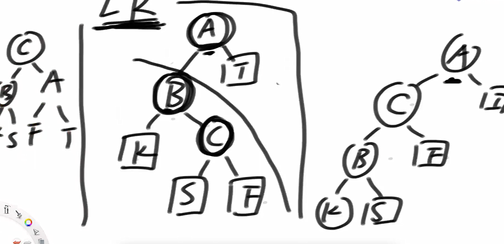

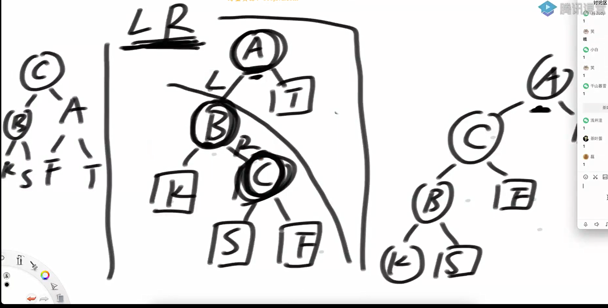

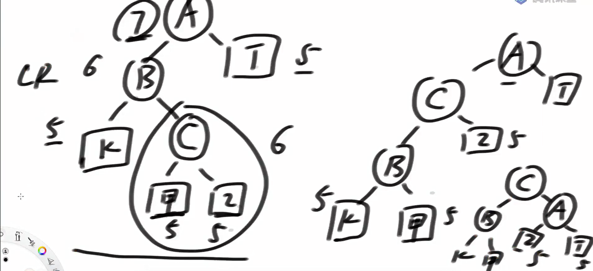

既是ll型右是rr型

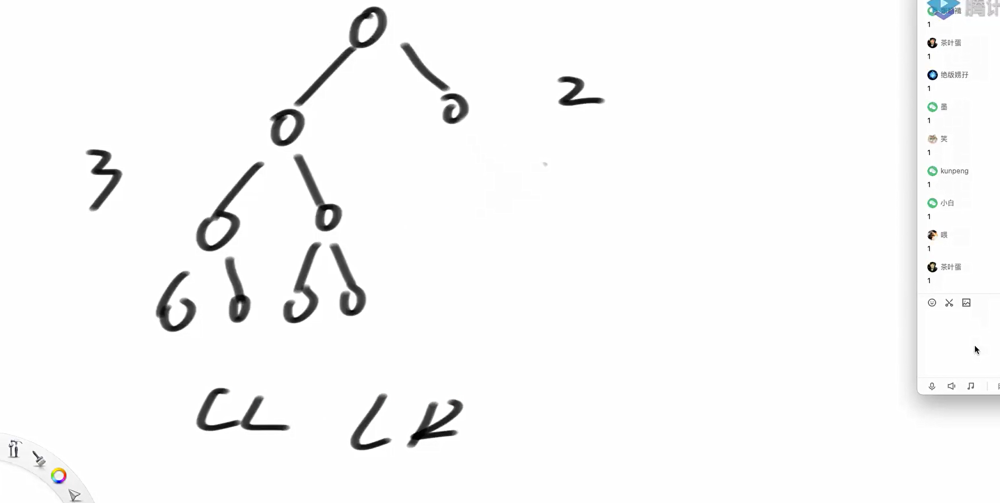

在树满足ll型和lr型的时候，用ll型总对

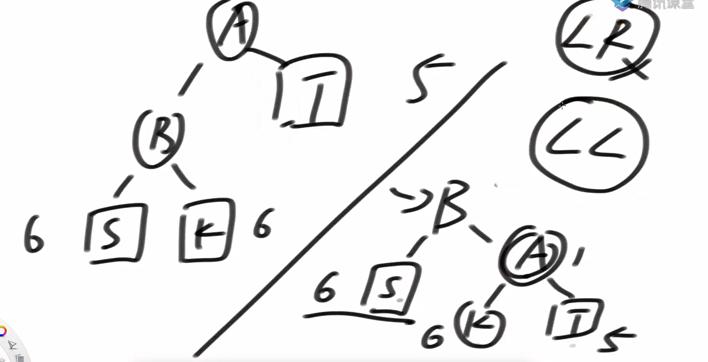

用lr型并不总是对

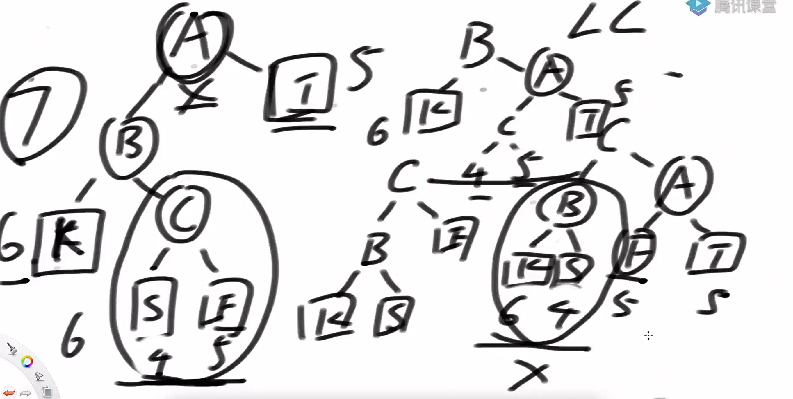

调整的复杂度

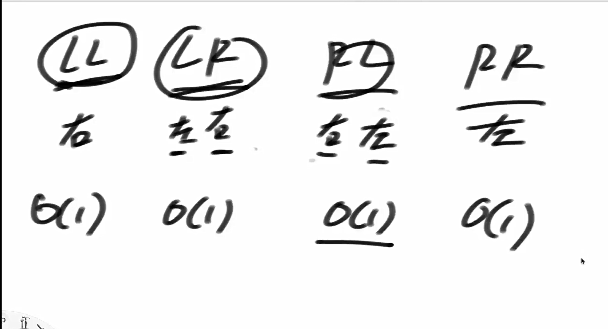

当删除的x左右都有子树的时候，从x的后继节点开始查平衡性

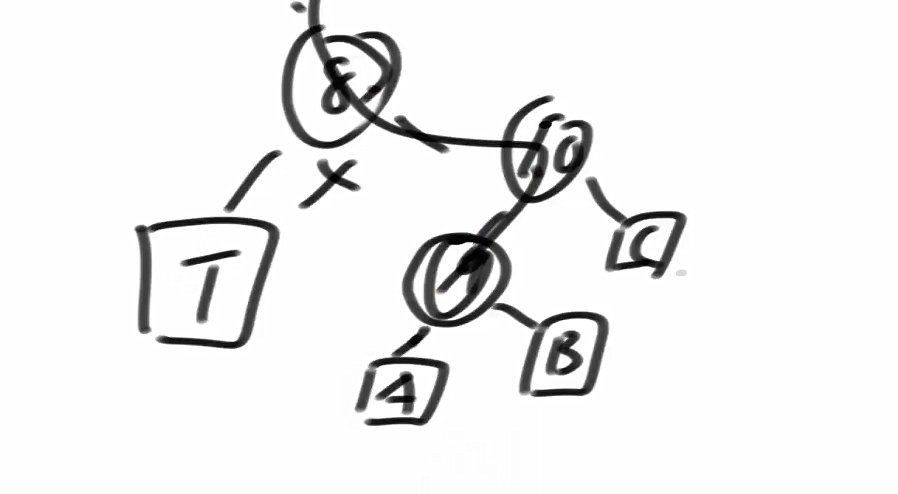

右旋的具体细节

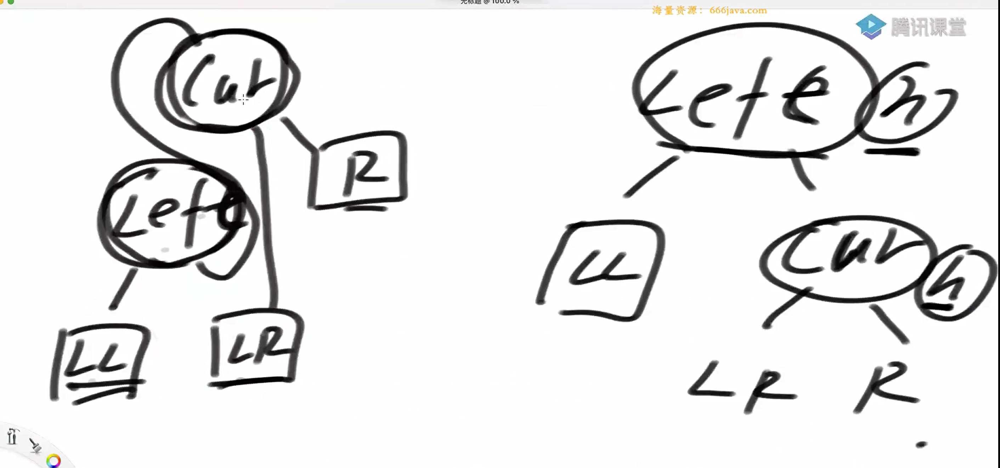

由于cur和left的位置变了，需要将高度重置

代码实现

```java
package class35;

public class code01_AVLTreeMap {

    public static class AVLNode<K extends Comparable<K>, V>{
        public K k;
        public V v;
        public AVLNode<K, V> l;
        public AVLNode<K, V> r;
        public int h;

        public AVLNode(K key, V value){
            k = key;
            v = value;
            h = 1;
        }
    }

    public static class AVLTreeMap<K extends Comparable<K>, V>{
        private AVLNode<K, V> root;
        private int size;

        public AVLTreeMap(){
            root = null;
            size = 0;
        }

        private AVLNode<K, V> rightRotate(AVLNode<K, V> cur){
            AVLNode<K, V> left = cur.l;
            cur.l = left.r;
            left.r = cur;
            cur.h = Math.max((cur.l != null ? cur.l.h : 0), (cur.r != null ? cur.r.h : 0)) + 1;
            left.h = Math.max((left.l != null ? left.l.h : 0), (left.r != null ? left.r.h : 0)) + 1;

            return left;
        }

        private AVLNode<K, V> leftRotate(AVLNode<K, V> cur){
            AVLNode<K, V> right = cur.r;
            cur.r = right.l;
            right.l = cur;
            cur.h = Math.max((cur.l != null ? cur.l.h : 0), (cur.r != null ? cur.r.h : 0)) + 1;
            right.h = Math.max((right.l != null ? right.l.h : 0), (right.r != null ? right.r.h : 0)) + 1;

            return right;
        }

        private AVLNode<K, V> maintain(AVLNode<K, V> cur){
            if (cur == null){
                return null;
            }
            int leftHeight = cur.l != null ? cur.l.h : 0;
            int rightHeight = cur.r != null ? cur.r.h : 0;

            if (Math.abs(leftHeight - rightHeight) > 1){
                if (leftHeight > rightHeight){
                    int leftLeftHeight = cur.l != null && cur.l.l != null ? cur.l.l.h : 0;
                    int leftRightHeight = cur.l != null && cur.l.r != null ? cur.l.r.h : 0;
                    if (leftLeftHeight >= leftRightHeight){
                        cur = rightRotate(cur);
                    }else{
                        cur.l = leftRotate(cur.l);
                        cur = rightRotate(cur);
                    }
                }else{
                    int rightLeftHeight = cur.r != null && cur.r.l != null ? cur.r.l.h : 0;
                    int rightRightHeight = cur.r != null && cur.r.r != null ? cur.r.r.h : 0;
                    if (rightRightHeight >= rightLeftHeight) {
                        cur = leftRotate(cur);
                    } else {
                        cur.r = rightRotate(cur.r);
                        cur = leftRotate(cur);
                    }
                }
            }
            return cur;
        }


        private AVLNode<K, V> add(AVLNode<K, V> cur, K key, V value){
            if (cur == null){
                return new AVLNode(key, value);
            }else{
                if (key.compareTo(cur.k) < 0){
                    cur.l = add(cur.l, key, value);
                }else{
                    cur.r = add(cur.r, key, value);
                }

                cur.h = Math.max(cur.l != null ? cur.l.h : 0, cur.r != null ? cur.r.h : 0) + 1;
                return maintain(cur);
            }
        }

        // 在cur这棵树上，删掉key所代表的节点
        // 返回cur这棵树的新头部
        private AVLNode<K, V> delete(AVLNode<K, V> cur, K key) {
            if (key.compareTo(cur.k) > 0){
                cur.r = delete(cur.r, key);
            }else if (key.compareTo(cur.k) < 0){
                cur.l = delete(cur.l, key);
            }else{
                if (cur.r == null && cur.l == null){
                    return null;
                }else if (cur.l == null && cur.r != null){
                    cur = cur.r;
                }else if (cur.r == null && cur.l != null){
                    cur = cur.l;
                }else{
                    AVLNode<K, V> des = cur.r;
                    while (des != null){
                        des = des.l;
                    }
                    cur.r = delete(cur.r, des.k);
                    des.l = cur.l;
                    des.r = cur.r;
                    cur = des;
                }
            }
            if (cur != null){
                cur.h = Math.max(cur.l != null ? cur.l.h : 0, cur.r != null ? cur.r.h : 0) + 1;
            }
            return maintain(cur);
        }
        //查找与给定键相等的节点（如果存在），否则返回最后访问的节点（插入位置的父节点）
        private AVLNode<K, V> findLastIndex(K key){
            AVLNode<K, V> pre = root;
            AVLNode<K, V> cur = root;

            while(cur != null){
                pre = cur;
                if (key.compareTo(cur.k) == 0){
                    break;
                }else if (key.compareTo(cur.k) < 0){
                    cur = cur.l;
                }else{
                    cur = cur.r;
                }
            }
            return pre;
        }

        //查找“不小于”给定键的最大下界节点（即：大于等于 key 中最小的那个）

        private AVLNode<K, V> findLastNoSmallIndex(K key){
            AVLNode<K, V> ans = null;
            AVLNode<K, V> cur = root;
            while (cur != null){
                if (key.compareTo(cur.k) == 0){
                    ans = cur;
                    break;
                }else if (key.compareTo(cur.k) < 0){
                    ans = cur;
                    cur = cur.l;
                }else {
                    cur = cur.r;
                }
            }

            return ans;
        }

        //查找“不大于”给定键的最大上界节点（即：小于等于 key 中最大的那个）

        private AVLNode<K, V> findLastNoBigIndex(K key) {
            AVLNode<K, V> ans = null;
            AVLNode<K, V> cur = root;
            while (cur != null){
                if (key.compareTo(cur.k) == 0){
                    ans = cur;
                    break;
                }else if (key.compareTo(cur.k) < 0){
                    cur = cur.l;
                }else{
                    ans = cur;
                    cur = cur.r;
                }
            }
            return ans;
        }

        public int size(){
            return size;
        }

        public boolean containsKey(K key){
            if (key == null){
                return false;
            }
            AVLNode<K, V> lastNode = findLastIndex(key);
            return lastNode != null && key.compareTo(lastNode.k) == 0 ? true : false;
        }

        public void put(K key, V value){
            if (key == null){
                return;
            }
            AVLNode<K, V> lastNode = findLastIndex(key);
            if (lastNode != null && key.compareTo(lastNode.k) == 0) {
                lastNode.v = value;
            } else {
                size++;
                root = add(root, key, value);
            }
        }

        public void remove(K key) {
            if (key == null) {
                return;
            }
            if (containsKey(key)) {
                size--;
                root = delete(root, key);
            }
        }

        public V get(K key) {
            if (key == null) {
                return null;
            }
            AVLNode<K, V> lastNode = findLastIndex(key);
            if (lastNode != null && key.compareTo(lastNode.k) == 0) {
                return lastNode.v;
            }
            return null;
        }

        public K firstKey() {
            if (root == null) {
                return null;
            }
            AVLNode<K, V> cur = root;
            while (cur.l != null) {
                cur = cur.l;
            }
            return cur.k;
        }

        public K lastKey() {
            if (root == null) {
                return null;
            }
            AVLNode<K, V> cur = root;
            while (cur.r != null) {
                cur = cur.r;
            }
            return cur.k;
        }


        public K floorKey(K key) {
            if (key == null) {
                return null;
            }
            AVLNode<K, V> lastNoBigNode = findLastNoBigIndex(key);
            return lastNoBigNode == null ? null : lastNoBigNode.k;
        }

        public K ceilingKey(K key) {
            if (key == null) {
                return null;
            }
            AVLNode<K, V> lastNoSmallNode = findLastNoSmallIndex(key);
            return lastNoSmallNode == null ? null : lastNoSmallNode.k;
        }
    }

}

```