问题一

sbt（大小平衡树）的实现

主要解决的问题

✅ 1. 实现一个支持高效操作的有序映射（Ordered Map）

支持插入、删除、查找、更新键值对的操作；

键是可比较的（K extends Comparable<K>），保证有序性；

所有操作的时间复杂度接近 O(log N)，因为 SBT 是一种自平衡二叉搜索树。

✅ 2. 保持树的平衡，避免退化成链表

使用了 maintain 方法 来在插入或删除节点后进行结构调整，确保整棵树始终保持良好的平衡性。

平衡依据：通过比较子树的 size（节点数量）来决定是否旋转，而不是像 AVL 树那样依赖高度。

✅ 3. 提供丰富的有序集合功能

查找某个键是否存在（containsKey(K key)）

获取某个键对应的值（get(K key)）

更新或新增键值对（put(K key, V value)）

删除指定键（remove(K key)）

按顺序获取第 i 个键/值（getIndexKey(i) / getIndexValue(i)）

获取最小/最大键（firstKey() / lastKey()）

向上/向下取整查找（ceilingKey(K key) / floorKey(K key)）

✅ 4. 支持索引访问（类似 List）

通过维护每个节点的 size 属性（以该节点为根的子树的节点数），可以快速定位第 k 小的元素。

实现了类似数组下标访问的功能（getIndex(...)）。

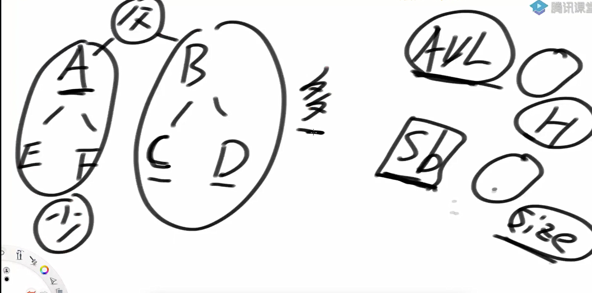

如果a树的节点较少，b树的节点较多，由于a树的节点数量不比c或d其中任意一颗树的节点少，所以b树节点较多也不会超过a树的两倍

这样说明，整棵树的高度大概是logN水平

如果是这样的类似单链表的结构，也是违规的

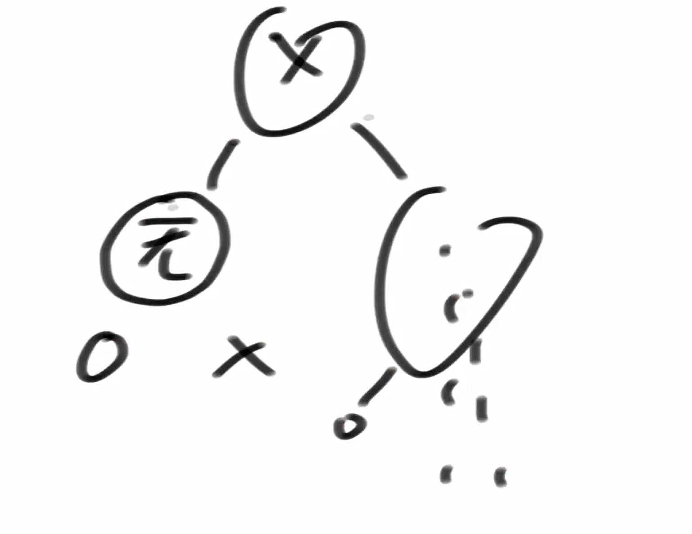

LL型的错误

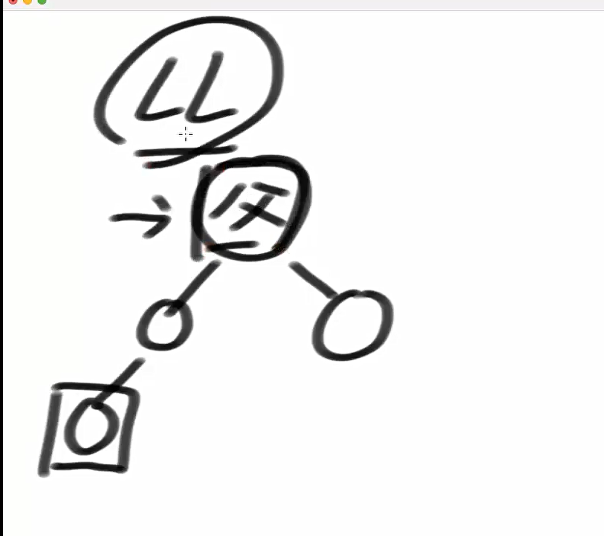

父节点的左儿子的儿子大于父节点右儿子的节点个数就是LL型的错误

LR型

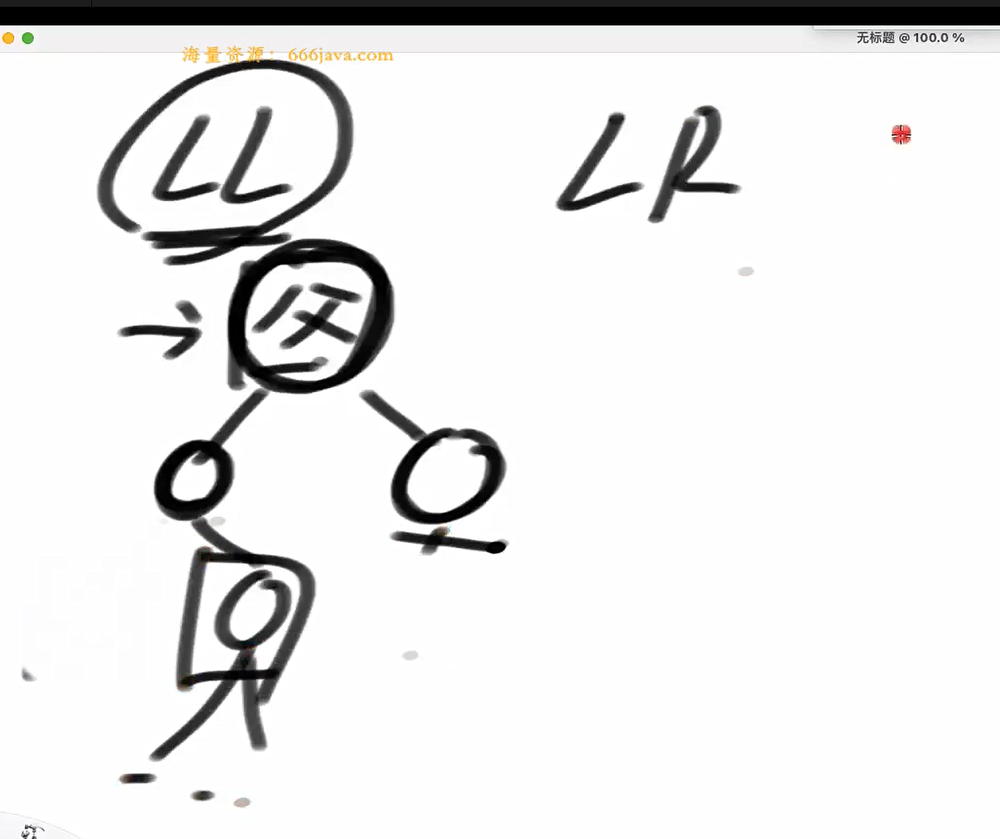

父节点的左儿子的右儿子的节点数大于父节点右儿子的节点数

RL型

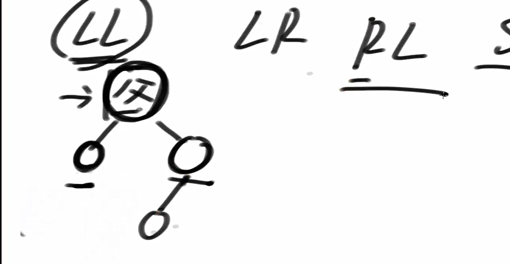

父节点的左儿子比父节点右节点的左儿子的节点数量少

RR型同理就是

父节点的左儿子少于右儿子的右儿子的节点个数


相较于avl树，sb树需要在发生变化的节点上继续调整

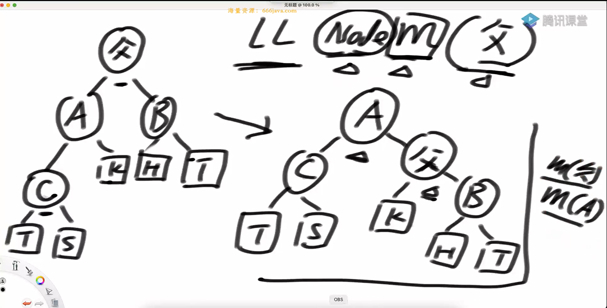

这是由于avl树非常的敏感（调整次数比较多）而sb树会出现雪崩，雪崩的时候需要进行整体的调整

选择触发条件总结

1 LL (Left-Left) 旋转

条件：当一个节点的左子树的左子树的大小超过其右子树的大小。

数学表达式：leftLeftSize > rightSize

含义：这表明当前节点的左子树过重，特别是左子树的左子树部分，因此需要通过一次右旋转（rightRotate）来调整。

2. LR (Left-Right) 旋转

条件：当一个节点的左子树的右子树的大小超过其右子树的大小。

数学表达式：leftRightSize > rightSize

含义：这种情况表示左子树的右子树部分过重，需要先对左子树执行一次左旋转（leftRotate），然后对当前节点执行一次右旋转（rightRotate），以恢复平衡。

3. RR (Right-Right) 旋转

条件：当一个节点的右子树的右子树的大小超过其左子树的大小。

数学表达式：rightRightSize > leftSize

含义：这意味着当前节点的右子树过重，尤其是右子树的右子树部分，因此需要通过一次左旋转（leftRotate）来调整。

4. RL (Right-Left) 旋转

条件：当一个节点的右子树的左子树的大小超过其左子树的大小。

数学表达式：rightLeftSize > leftSize

含义：在这种情况下，右子树的左子树部分过重，需要先对右子树执行一次右旋转（rightRotate），然后对当前节点执行一次左旋转（leftRotate），以恢复平衡。

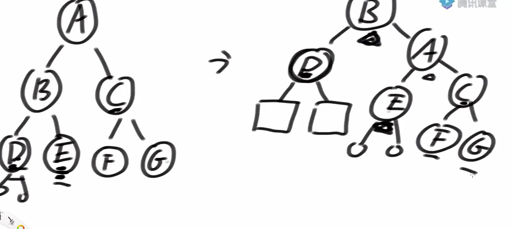

由于树的形态的改变，导致不知道后面的节点是否还符合要求，所以需要递归调整

sbt和avlt对比中，为什么sbt可以删除的时候不调整树结构，只在添加的时候调整树结构。avl却在删除的时候要maintain（重调整），这是为什么？

VL 树

平衡定义

在 AVL 树中，平衡是通过每个节点的左右子树**高度差不超过1**来定义的。这意味着 AVL 树严格保持了高度平衡，从而确保了查找、插入和删除操作的时间复杂度为 O(log N)。

为什么删除需要调整？

当从 AVL 树中删除一个节点时，可能会破坏原有的高度平衡条件。由于 AVL 树依赖于严格的高度平衡来保证性能，因此即使是一个看似简单的删除操作也可能导致整个路径上的多个节点失去平衡。这就要求在删除后沿着受影响的路径向上进行一系列旋转（maintain 或者称为 rebalance），以恢复所有节点的高度平衡状态。

删除操作可能导致不平衡不仅限于直接删除的那个节点，还可能影响到其祖先节点的高度关系，因此需要回溯并检查直至根节点或找到已经平衡的部分为止。

Size Balanced Tree (SBT)

平衡定义

SBT 的平衡基于节点数量而非高度。具体来说，SBT 要求每个节点的左右子树大小满足特定的关系（例如，左子树大小不超过右子树大小加上某个常数）。这种基于节点计数的方法使得 SBT 对于某些类型的不平衡更加容忍。

为什么删除可以不调整？

由于 SBT 主要关注的是子树大小而非高度，因此删除操作通常不会立即导致严重的不平衡问题。只要删除后的子树仍然大致符合原有的大小关系，就不需要立即进行调整。

更进一步地，因为 SBT 的平衡标准相对宽松（相对于高度而言），所以在添加新节点时进行调整足以保证整体结构的平衡性。也就是说，在大多数情况下，删除操作不会显著改变子树大小之间的关系到需要立即重新平衡的程度。

另外，SBT 设计上允许一定程度的不平衡存在，并且通过后续的插入操作自然地恢复平衡，这与 AVL 树的严格高度平衡形成了对比。

 

代码实现

```java
package class36;

public class code01_SizeBalancedTreeMap {
        //  sbt和avlt差不多，区别主要在于remove时的pre部分

    public static class SBTNode<K extends Comparable<K>, V>{
        public K key;
        public V value;
        public SBTNode<K, V> l;
        public SBTNode<K, V> r;
        public int size;

        public SBTNode(K key, V value){
            this.key = key;
            this.value = value;
            size = 1;
        }
    }


    public static class SizeBalancedTreeMap<K extends Comparable<K>, V>{
        private SBTNode<K, V> root;

        private SBTNode<K, V> rightRotate(SBTNode<K, V> cur){
            SBTNode<K, V> leftNode = cur.l;
            cur.l = leftNode.r;
            leftNode.r = cur;
            leftNode.size = cur.size;
            cur.size = (cur.l != null ? cur.l.size : 0) + (cur.r != null ? cur.r.size : 0) + 1;
            return leftNode;
        }

        private SBTNode<K, V> leftRotate(SBTNode<K, V> cur){
            SBTNode<K, V> rightNode = cur.r;
            cur.r = rightNode.l;
            rightNode.l = cur;
            rightNode.size = cur.size;
            cur.size = (cur.l != null ? cur.l.size : 0) + (cur.r != null ? cur.r.size : 0) + 1;
            return rightNode;
        }

        private SBTNode<K, V> maintain(SBTNode<K, V> cur){
            if (cur == null){
                return null;
            }

            int leftSize = cur.l != null ? cur.l.size : 0;
            int leftLeftSize = cur.l != null && cur.l.l != null ? cur.l.l.size : 0;
            int leftRightSize = cur.l != null && cur.l.r != null ? cur.l.r.size : 0;
            int rightSize = cur.r != null ? cur.r.size : 0;
            int rightLeftSize = cur.r != null && cur.r.l != null ? cur.r.l.size : 0;
            int rightRightSize = cur.r != null && cur.r.r != null ? cur.r.r.size : 0;

            if (leftLeftSize > rightSize){
                cur = rightRotate(cur);
                cur.r = maintain(cur.r);
                cur = maintain(cur);
            }else if (leftRightSize > rightSize){
                cur.l = leftRotate(cur.l);
                cur = rightRotate(cur);
                cur.l = maintain(cur.l);
                cur.r = maintain(cur.r);
                cur = maintain(cur);
            }else if (rightRightSize > leftSize){
                cur = leftRotate(cur);
                cur.l = maintain(cur.l);
                cur = maintain(cur);
            }else if(rightLeftSize > leftSize){
                cur.r = rightRotate(cur.r);
                cur = leftRotate(cur);
                cur.l = maintain(cur.l);
                cur.r = maintain(cur.r);
                cur = maintain(cur);
            }

            return cur;
        }

        private SBTNode<K, V> add(SBTNode<K, V> cur, K key, V val){
            if (cur == null){
                return new SBTNode<>(key, val);
            }else{
                cur.size++;
                if (key.compareTo(cur.key) < 0){
                    cur.l = add(cur.l, key, val);
                }else{
                    cur.r = add(cur.r, key, val);
                }
                return maintain(cur);
            }
        }

        private SBTNode<K, V> delete(SBTNode<K, V> cur, K key){
            cur.size--;
            if (key.compareTo(cur.key) > 0){
                cur.r = delete(cur.r, key);
            }else if (key.compareTo(cur.key) < 0){
                cur.l = delete(cur.l, key);
            }else {
                if (cur.l == null && cur.r == null){
                    cur = null;
                }else if (cur.l == null && cur.r != null){
                    cur = cur.r;
                }else if (cur.r == null && cur.l != null){
                    cur = cur.l;
                }else{
                    SBTNode<K, V> pre = null;
                    SBTNode<K, V> des = cur.r;
                    des.size--;
                    while (des.l != null){
                        pre = des;
                        des = des.l;
                        des.size--;
                    }
                    if (pre != null){
                        pre.l = des.r;
                        des.r = cur.r;
                    }
                    des.l = cur.l;
                    des.size = des.l.size + (des.r == null ? 0 : des.r.size) + 1;
                    cur = des;
                }
            }
            return cur;
        }


        private SBTNode<K, V> findLastIndex(K key){
            SBTNode<K, V> pre = root;
            SBTNode<K, V> cur = root;
            while (cur != null){
                pre = cur;
                if (key.compareTo(cur.key) == 0){
                    break;
                }else if (key.compareTo(cur.key) < 0){
                    cur = cur.l;
                }else{
                    cur = cur.r;
                }
            }
            return pre;
        }

        private SBTNode<K, V> findLastNoSmallIndex(K key){
            SBTNode<K, V> ans = null;
            SBTNode<K, V> cur = root;

            while (cur != null){
                if (key.compareTo(cur.key) == 0){
                    ans = cur;
                    break;
                }else if (key.compareTo(cur.key) < 0){
                    ans = cur;
                    cur = cur.l;
                }else {
                    cur = cur.r;
                }
            }
            return ans;
        }

        private SBTNode<K, V> findLastNoBigIndex(K key) {
            SBTNode<K, V> ans = null;
            SBTNode<K, V> cur = root;
            while (cur != null) {
                if (key.compareTo(cur.key) == 0) {
                    ans = cur;
                    break;
                } else if (key.compareTo(cur.key) < 0) {
                    cur = cur.l;
                } else {
                    ans = cur;
                    cur = cur.r;
                }
            }
            return ans;
        }

//        根据排名（k-th smallest key）来查找对应节点的函数。查找第 k 小节点 的递归实现。
        private SBTNode<K, V> getIndex(SBTNode<K, V> cur, int kth){
            if (kth == (cur.l != null ? cur.l.size : 0) + 1){
                return cur;
            }else if (kth <= (cur.l != null ? cur.l.size : 0) + 1){
                return getIndex(cur.l, kth);
            }else{
                return getIndex(cur.r, kth - (cur.l != null ? cur.l.size : 0) - 1);
            }
        }

        public int size(){
            return root == null ? 0 : root.size;
        }

        public boolean containKey(K key){
            if (key == null){
                throw new RuntimeException("invalid paratrment");
            }
            SBTNode<K, V> lastNode = findLastIndex(key);
            return lastNode != null && key.compareTo(lastNode.key) == 0 ? true : false;
        }

        public void put(K key, V value){
            if (key == null){
                throw  new RuntimeException("invalid parameter.");
            }
            SBTNode<K, V> lastNode = findLastIndex(key);
            if (lastNode != null && key.compareTo(lastNode.key) == 0){
                lastNode.value = value;
            }else{
                root = add(root, key, value);
            }
        }

        public void remove(K key){
            if (key == null){
                throw new RuntimeException("invalid parameter.");
            }
            if (containKey(key)){
                root = delete(root, key);
            }
        }
//        index：要查询的是第几个 key（从 0 开始）
//        如果超出范围，抛异常
        public K getIndexKey(int index){
            if (index < 0 || index >= this.size()){
                throw new RuntimeException("invalid parameter.");
            }
            return getIndex(root, index + 1).key;
        }

        public V getIndexValue(int index){
            if (index < 0 || index >= this.size()){
                throw new RuntimeException("invalid parameter.");
            }
            return getIndex(root, index + 1).value;
        }

//        根据 key 查找对应的 value，标准 Map 接口操作之一
        public V get(K key){
            if (key == null){
                throw new RuntimeException("invalid parameter.");
            }
            SBTNode<K, V> lastNode = findLastIndex(key);
            if (lastNode != null && key.compareTo(lastNode.key) == 0){
                return lastNode.value;
            }else{
                return null;
            }
        }

        public K firstKey(){
            if (root == null){
                return null;
            }
            SBTNode<K, V> cur = root;
            while (cur.l != null){
                cur = cur.l;
            }
            return cur.key;
        }

        public K lastKey(){
            if (root == null){
                return null;
            }
            SBTNode<K, V> cur = root;
            while (cur.r != null) {
                cur = cur.r;
            }
            return cur.key;
        }

        public K floorKey(K key){
            if (key == null){
                throw new RuntimeException("invalid parameter.");
            }
            SBTNode<K, V> lastNoBigNode = findLastNoBigIndex(key);
            return lastNoBigNode == null ? null : lastNoBigNode.key;
        }

        public K ceilingKey(K key){
            if (key == null){
                throw new RuntimeException("invalid parameter.");
            }
            SBTNode<K, V> lastNoSmallNode = findLastNoSmallIndex(key);
            return lastNoSmallNode == null ? null : lastNoSmallNode.key;
        }

    }
    // for test
    public static void printAll(SBTNode<String, Integer> head) {
        System.out.println("Binary Tree:");
        printInOrder(head, 0, "H", 17);
        System.out.println();
    }

    // for test
    public static void printInOrder(SBTNode<String, Integer> head, int height, String to, int len) {
        if (head == null) {
            return;
        }
        printInOrder(head.r, height + 1, "v", len);
        String val = to + "(" + head.key + "," + head.value + ")" + to;
        int lenM = val.length();
        int lenL = (len - lenM) / 2;
        int lenR = len - lenM - lenL;
        val = getSpace(lenL) + val + getSpace(lenR);
        System.out.println(getSpace(height * len) + val);
        printInOrder(head.l, height + 1, "^", len);
    }

    // for test
    public static String getSpace(int num) {
        String space = " ";
        StringBuffer buf = new StringBuffer("");
        for (int i = 0; i < num; i++) {
            buf.append(space);
        }
        return buf.toString();
    }

    public static void main(String[] args) {
        SizeBalancedTreeMap<String, Integer> sbt = new SizeBalancedTreeMap<String, Integer>();
        sbt.put("d", 4);
        sbt.put("c", 3);
        sbt.put("a", 1);
        sbt.put("b", 2);
        // sbt.put("e", 5);
        sbt.put("g", 7);
        sbt.put("f", 6);
        sbt.put("h", 8);
        sbt.put("i", 9);
        sbt.put("a", 111);
        System.out.println(sbt.get("a"));
        sbt.put("a", 1);
        System.out.println(sbt.get("a"));
        for (int i = 0; i < sbt.size(); i++) {
            System.out.println(sbt.getIndexKey(i) + " , " + sbt.getIndexValue(i));
        }
        printAll(sbt.root);
        System.out.println(sbt.firstKey());
        System.out.println(sbt.lastKey());
        System.out.println(sbt.floorKey("g"));
        System.out.println(sbt.ceilingKey("g"));
        System.out.println(sbt.floorKey("e"));
        System.out.println(sbt.ceilingKey("e"));
        System.out.println(sbt.floorKey(""));
        System.out.println(sbt.ceilingKey(""));
        System.out.println(sbt.floorKey("j"));
        System.out.println(sbt.ceilingKey("j"));
        sbt.remove("d");
        printAll(sbt.root);
        sbt.remove("f");
        printAll(sbt.root);

    }

}

```

为什么 AVL 不需要像 SBT 这样“反复 maintain”？

AVL 的平衡标准：高度平衡

AVL 树通过每个节点的左右子树高度差不超过 1 来保证平衡。

插入或删除后，最多只需要一次旋转（单旋或双旋）就可以恢复平衡。

并且 AVL 的旋转操作是 自底向上修复 的，在递归返回时进行调整。

因为旋转只影响局部结构，不会破坏上层结构的平衡性，所以不需要“再递归 maintain”。

 SBT 的平衡标准：大小平衡

SBT 是以子树的 size（节点数量） 作为平衡依据。

它要求：

java

深色版本

size(left child's left/right) > size(right)

或者

size(right child's right/left) > size(left)

当这种不平衡出现时，可能不只是当前节点不平衡，其父节点甚至更高层也可能失衡。

所以在旋转之后，还需要 再次对当前节点调用 maintain 函数，以确保整体结构依然满足 SBT 的性质。

二、为什么 SBT 需要大量 maintain 调用？

来看你贴出的代码片段：

java

深色版本

if (leftLeftSize > rightSize){

cur = rightRotate(cur);

cur.r = maintain(cur.r);

cur = maintain(cur);

}

cur.r = maintain(cur.r);

旋转后右子树可能又不平衡了，所以需要对其递归维护。

2. cur = maintain(cur);

整个子树经过旋转和子树维护后，结构发生了变化，当前节点本身也可能再次失衡，所以还要再调一次 maintain。

总结一句话：

**AVL 是基于“高度”的平衡，旋转后不影响祖先；**

**SBT 是基于“size”的平衡，旋转后可能导致整个路径上的节点都失衡，所以需要多次递归维护。**

问题二

跳表如何实现？

跳表加节点的方式

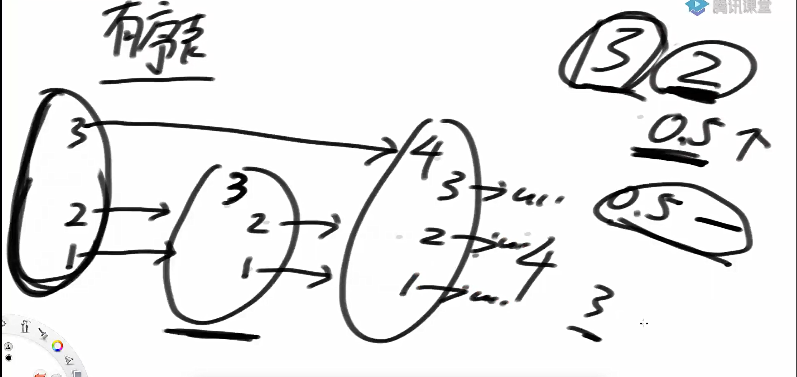

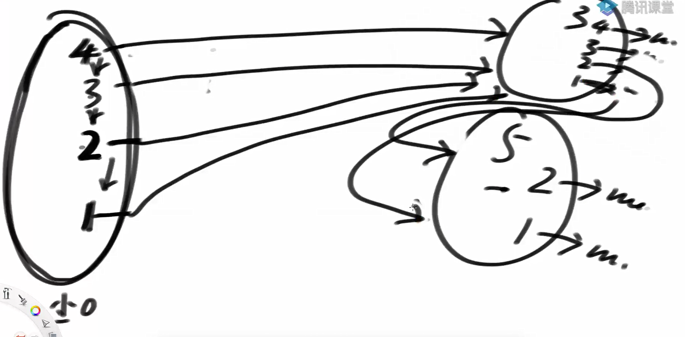

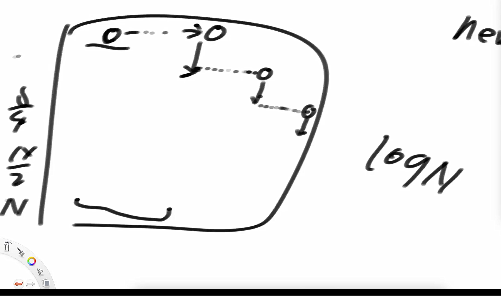

跳表的算法

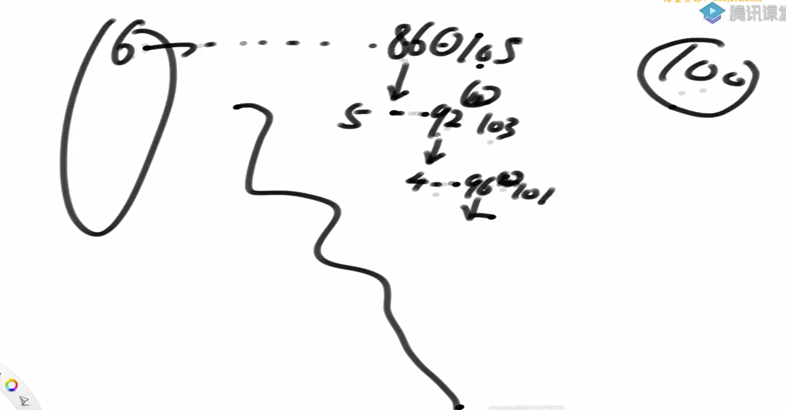

跳表初始化的状态

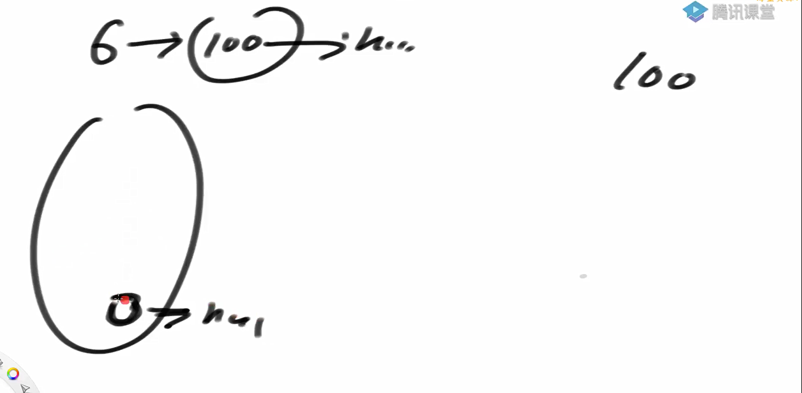

跳表的实际结构

```
层级 2: H ------> 5 --------------> 15 -----> null
层级 1: H --> 3 --> 5 ----> 10 --> 15 -> 20 -> null
层级 0: H --> 3 --> 5 --> 7 --> 10 --> 15 --> 18 --> 20 --> null
```

我们要插入 key=12，从高层往下找：

层级 2：H → 5 → 15（15 > 12），所以下跳

层级 1：从 5 开始找 → 10 < 12，下一个 15 > 12，所以停在 10

层级 0：从 10 开始找 → 10 < 12，下一个 15 > 12，所以停在 10

最终返回的是 第 0 层的 10 节点，它就是插入 12 的前驱节点。

```java
                private SkipListNode<K, V> mostRightLessNodeInTree(K key) {
			if (key == null) {
				return null;
			}
			int level = maxLevel;
			SkipListNode<K, V> cur = head;
			while (level >= 0) { // 从上层跳下层
				//  cur  level  -> level-1
				cur = mostRightLessNodeInLevel(key, cur, level--);
			}
			return cur;
		}
```

使用这一部分是为了快速找到第0层的前驱节点方便后续插入

删除的时候需要注意的点

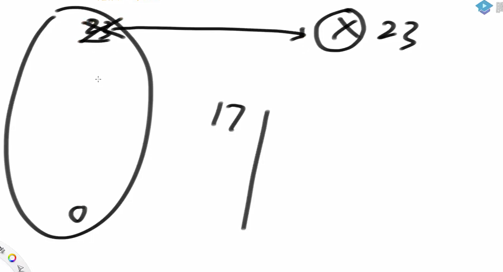

跳表（Skip List）中所说的查找、插入、删除的时间复杂度是 O(log N)，这里的 N 是指什么？

这里的 N 指的是跳表中已有的节点数量，也就是你存储的 key 的数量。	

跳表的实现

```java
package class36;

import java.util.ArrayList;

public class code02_SkipListMap {
//    跳表的大概形状是
//    层级 2: H ------> 5 --------------> 15 -----> null
//    层级 1: H --> 3 --> 5 ----> 10 --> 15 -> 20 -> null
//    层级 0: H --> 3 --> 5 --> 7 --> 10 --> 15 --> 18 --> 20 --> null

    public static class SkipListNode<K extends Comparable<K>, V>{
        public K key;
        public V val;
        public ArrayList<SkipListNode<K, V>> nextNodes;

        public SkipListNode(K k, V v){
            key = k;
            val = v;
            nextNodes = new ArrayList<>();
        }
        //判断一下key是否小于otherkey
        public boolean isLessKey(K otherKey){
            return otherKey != null && (key == null || key.compareTo(otherKey) < 0);
        }
        //判断一下key是否等于otherkey
        public boolean isKeyEqual(K otherKey){
            return (key == null && otherKey == null)
                    || (key != null && otherKey != null && key.compareTo(otherKey) == 0);
        }
    }

    public static class SkipListMap<K extends Comparable<K>, V>{
        private static final double  PROBABILITY = 0.5;
        private SkipListNode<K, V> head;
        private int size;
        private int maxLevel;


        public SkipListMap(){
            head = new SkipListNode<>(null, null);
            head.nextNodes.add(null);
            size = 0;
            maxLevel = 0;
        }

        //key在第0层小于key最右的位置
        private SkipListNode<K, V> mostRightLessNodeInTree(K key){
            if (key == null){
                return null;
            }
            int level = maxLevel;
            SkipListNode<K, V> cur = head;
            while (level >= 0){
                cur = mostRightLessNodeInLevel(key, cur, level--);
            }

            return cur;
        }

        private SkipListNode<K, V> mostRightLessNodeInLevel(
                K key,
                SkipListNode<K, V> cur,
                int level){
            SkipListNode<K, V> next = cur.nextNodes.get(level);
            while (next != null && next.isLessKey(key)){
                cur = next;
                next = next.nextNodes.get(level);
            }
            return cur;
        }


        public boolean containsKey(K key){
            if (key == null){
                return false;
            }
            SkipListNode<K, V> less = mostRightLessNodeInTree(key);
            SkipListNode<K, V> next = less.nextNodes.get(0);
            return next != null && next.isKeyEqual(key);
        }

        public void put(K key, V val){
            if (key == null){
                return;
            }

            SkipListNode<K, V> less = mostRightLessNodeInTree(key);
            SkipListNode<K, V> find = less.nextNodes.get(0);
            if (find != null && find.isKeyEqual(key)){
                find.val = val;
            }else{
                size++;
                int newNodeLevel = 0;
                while (Math.random() < PROBABILITY){
                    newNodeLevel++;
                }

                while (newNodeLevel > maxLevel){
                    head.nextNodes.add(null);
                    maxLevel++;
                }

                SkipListNode<K, V> newNode = new SkipListNode<>(key, val);

                for (int i = 0; i <= newNodeLevel; i++){
                    newNode.nextNodes.add(null);
                }

                int level = maxLevel;
                SkipListNode<K, V> pre = head;
                while (level >= 0){
                    pre = mostRightLessNodeInLevel(key, pre, level);
                    if (level <= newNodeLevel){
                        newNode.nextNodes.set(level, pre.nextNodes.get(level));
                        pre.nextNodes.set(level, newNode);
                    }
                    level--;
                }
            }
        }


        public void remove(K key){
            if (containsKey(key)){
                size--;
                int level = maxLevel;
                SkipListNode<K, V> pre = head;

                while (level >= 0){
                    pre = mostRightLessNodeInLevel(key, pre, level);
                    SkipListNode<K, V> next = pre.nextNodes.get(level);

                    if (next != null && next.isKeyEqual(key)){
                        pre.nextNodes.set(level, next.nextNodes.get(level));
                    }

                    if (level != 0 && pre == head && pre.nextNodes.get(level) == null){
                        head.nextNodes.remove(level);
                        maxLevel--;
                    }
                    level--;
                }
            }
        }

        public K firstKey(){
            return head.nextNodes.get(0) != null ? head.nextNodes.get(0).key : null;
        }


        public K lastKey(){
            int level = maxLevel;
            SkipListNode<K, V> cur = head;
            while (level >= 0){
                SkipListNode<K, V> next = cur.nextNodes.get(level);
                while (next != null){
                    cur = next;
                    next = next.nextNodes.get(level);
                }
                level--;
            }
            return cur.key;
        }
//        返回跳表中 大于等于给定 key 的最小键（即“天花板”键），如果没有这样的键，则返回 null。
        public K ceilingKey(K key){
            if (key == null){
                return null;
            }

            SkipListNode<K, V> less = mostRightLessNodeInTree(key);
            SkipListNode<K, V> next = less.nextNodes.get(0);
            return next != null ? next.key : null;
        }

//        返回跳表中 小于等于给定 key 的最大键（即“地板”键），如果没有这样的键，则返回 null。
        public K floorKey(K key){
            if (key == null){
                return null;
            }

            SkipListNode<K, V> less = mostRightLessNodeInTree(key);
            SkipListNode<K, V> next = less.nextNodes.get(0);

            return next != null && next.isKeyEqual(key) ? next.key : less.key;
        }

        public V get(K key) {
            if (key == null) {
                return null;
            }
            SkipListNode<K, V> less = mostRightLessNodeInTree(key);
            SkipListNode<K, V> next = less.nextNodes.get(0);
            if (next != null && next.isKeyEqual(key)) {
                return next.val;
            }
            return null;
        }

    }

    // for test
    public static void printAll(SkipListMap<String, String> obj) {
        for (int i = obj.maxLevel; i >= 0; i--) {
            System.out.print("Level " + i + " : ");
            SkipListNode<String, String> cur = obj.head;
            while (cur.nextNodes.get(i) != null) {
                SkipListNode<String, String> next = cur.nextNodes.get(i);
                System.out.print("(" + next.key + " , " + next.val + ") ");
                cur = next;
            }
            System.out.println();
        }
    }

    public static void main(String[] args) {
        SkipListMap<String, String> test = new SkipListMap<>();
        printAll(test);
        System.out.println("======================");
        test.put("A", "10");
        printAll(test);
        System.out.println("======================");
        test.remove("A");
        printAll(test);
        System.out.println("======================");
        test.put("E", "E");
        test.put("B", "B");
        test.put("A", "A");
        test.put("F", "F");
        test.put("C", "C");
        test.put("D", "D");
        printAll(test);
        System.out.println("======================");
        System.out.println(test.containsKey("B"));
        System.out.println(test.containsKey("Z"));
        System.out.println(test.firstKey());
        System.out.println(test.lastKey());
        System.out.println(test.floorKey("D"));
        System.out.println(test.ceilingKey("D"));
        System.out.println("======================");
        test.remove("D");
        printAll(test);
        System.out.println("======================");
        System.out.println(test.floorKey("D"));
        System.out.println(test.ceilingKey("D"));


    }


}

```