问题一 count-of-range-sum

	[https://leetcode.cn/problems/count-of-range-sum/](https://leetcode.cn/problems/count-of-range-sum/)

给定一个数组 arr，和两个整数 a 和 b（a <= b）。

求 arr 中有多少个子数组，累加和在 [a, b] 这个范围上。返回达标的子数组数量。

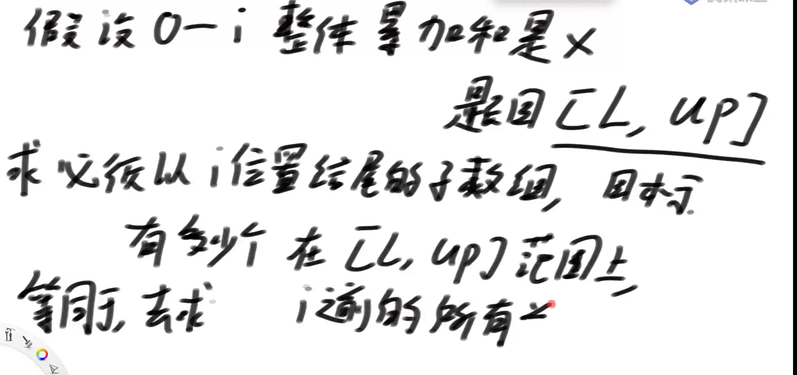

归并+动态窗口解答

```java
// 这道题直接在leetcode测评：
// https://leetcode.com/problems/count-of-range-sum/
public class countOfRangeSum {

 public static int countRangeSum(int[] nums, int lower, int upper) {
		if (nums == null || nums.length == 0) {
			return 0;
		}
		long[] sum = new long[nums.length];
		sum[0] = nums[0];
		for (int i = 1; i < nums.length; i++) {
			sum[i] = sum[i - 1] + nums[i];
		}
		return process(sum, 0, sum.length - 1, lower, upper);
	}

	public static int process(long[] sum, int L, int R, int lower, int upper) {
		if (L == R) {
			return sum[L] >= lower && sum[L] <= upper ? 1 : 0;
		}
		int M = L + ((R - L) >> 1);
		return process(sum, L, M, lower, upper) + process(sum, M + 1, R, lower, upper)
				+ merge(sum, L, M, R, lower, upper);
	}

	public static int merge(long[] arr, int L, int M, int R, int lower, int upper) {
		int ans = 0;
		int windowL = L;
		int windowR = L;
		// [windowL, windowR)
		for (int i = M + 1; i <= R; i++) {
			long min = arr[i] - upper;
			long max = arr[i] - lower;
			while (windowR <= M && arr[windowR] <= max) {
				windowR++;
			}
			while (windowL <= M && arr[windowL] < min) {
				windowL++;
			}
			ans += windowR - windowL;
		}
		long[] help = new long[R - L + 1];
		int i = 0;
		int p1 = L;
		int p2 = M + 1;
		while (p1 <= M && p2 <= R) {
			help[i++] = arr[p1] <= arr[p2] ? arr[p1++] : arr[p2++];
		}
		while (p1 <= M) {
			help[i++] = arr[p1++];
		}
		while (p2 <= R) {
			help[i++] = arr[p2++];
		}
		for (i = 0; i < help.length; i++) {
			arr[L + i] = help[i];
		}
		return ans;
	}

}
```

问题转化

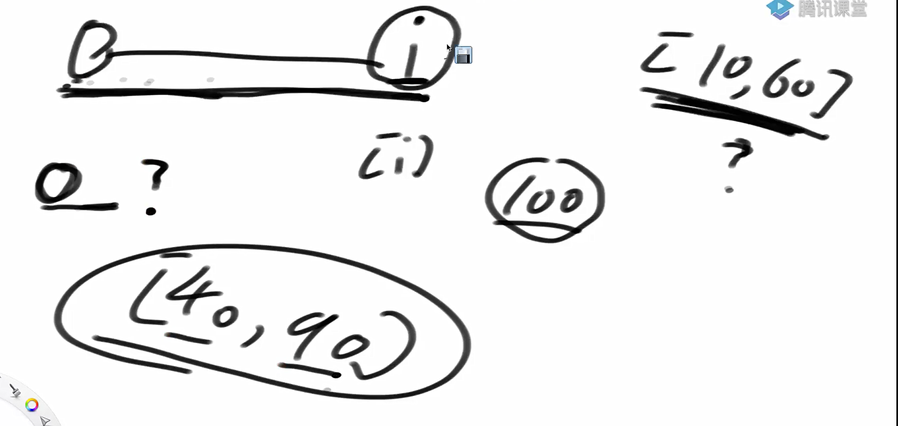

问题转化

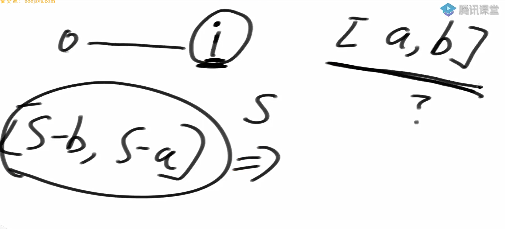

以0开头的前缀和有多少个前缀和掉入[S - b, S - a]，

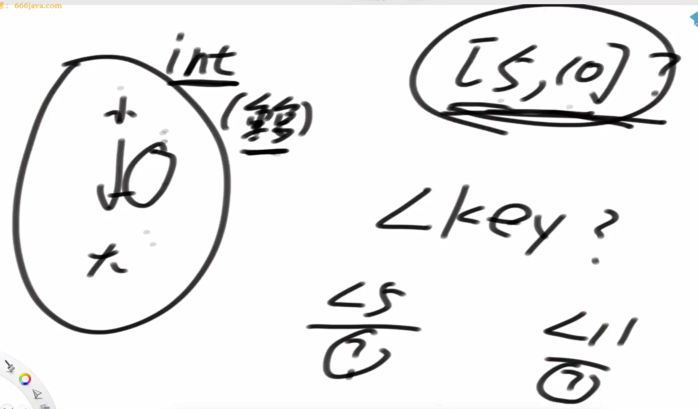

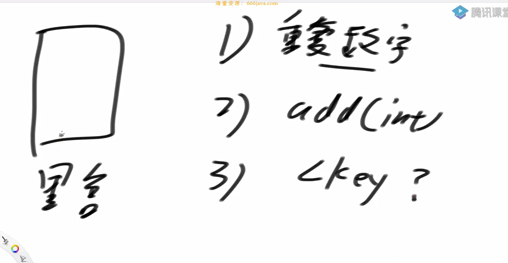

有序表不能接受重复数字怎么办？压在一起

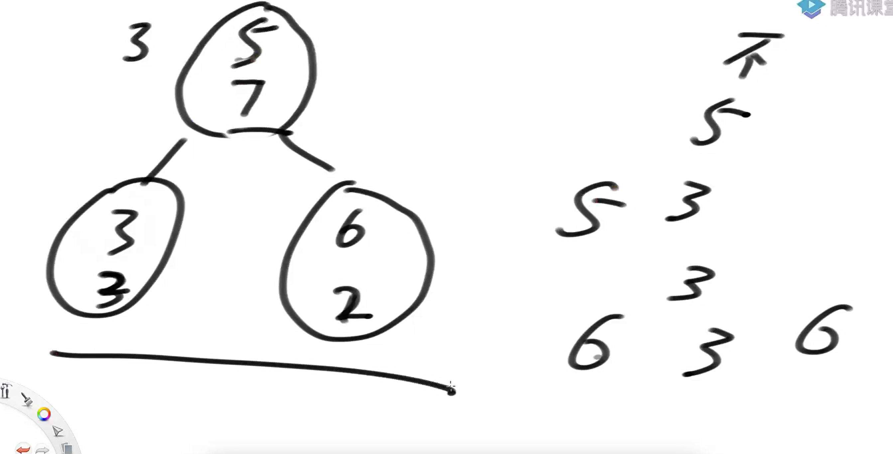

具体举例

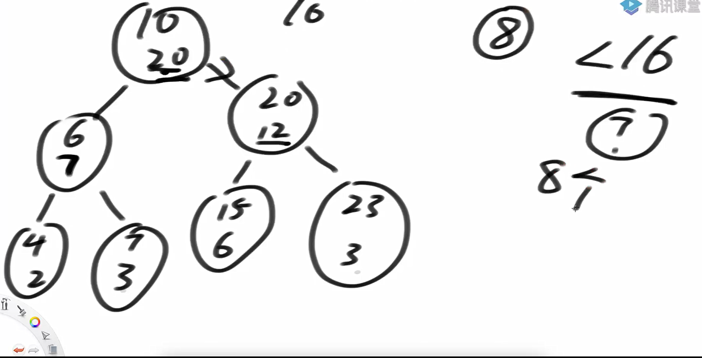

< i的计算方法

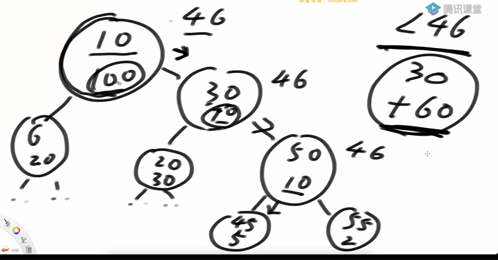

往右划累加，往左滑不累加

代码实现·

```java
package class37;

import java.util.HashSet;

public class code01_CountofRangeSum {

   public static class countOfRangeSum1{

       public  int countRangeSum(int[] nums, int lower, int upper) {
           if (nums == null || nums.length == 0) {
               return 0;
           }
           long[] sum = new long[nums.length];
           sum[0] = nums[0];
           for (int i = 1; i < nums.length; i++) {
               sum[i] = sum[i - 1] + nums[i];
           }
           return process(sum, 0, sum.length - 1, lower, upper);
       }

       public int process(long[] sum, int L, int R, int lower, int upper) {
           if (L == R) {
               return sum[L] >= lower && sum[L] <= upper ? 1 : 0;
           }
           int M = L + ((R - L) >> 1);
           return process(sum, L, M, lower, upper) + process(sum, M + 1, R, lower, upper)
                   + merge(sum, L, M, R, lower, upper);
       }

       public int merge(long[] arr, int L, int M, int R, int lower, int upper) {
           int ans = 0;
           int windowL = L;
           int windowR = L;
           // [windowL, windowR)
           for (int i = M + 1; i <= R; i++) {
               long min = arr[i] - upper;
               long max = arr[i] - lower;
               while (windowR <= M && arr[windowR] <= max) {
                   windowR++;
               }
               while (windowL <= M && arr[windowL] < min) {
                   windowL++;
               }
               ans += windowR - windowL;
           }
           long[] help = new long[R - L + 1];
           int i = 0;
           int p1 = L;
           int p2 = M + 1;
           while (p1 <= M && p2 <= R) {
               help[i++] = arr[p1] <= arr[p2] ? arr[p1++] : arr[p2++];
           }
           while (p1 <= M) {
               help[i++] = arr[p1++];
           }
           while (p2 <= R) {
               help[i++] = arr[p2++];
           }
           for (i = 0; i < help.length; i++) {
               arr[L + i] = help[i];
           }
           return ans;
       }
   }

    public static class SBTNode{
       public long key;
       public SBTNode l;
       public SBTNode r;
       public long size; //不同key的size（不重复的）
       public long all; //不同key的size（可重复的）

       public SBTNode(long k){
           key = k;
           size = 1;
           all = 1;
       }
    }


    public static class SizeBalancedTreeSet{
       private SBTNode root;
       private HashSet<Long> set = new HashSet<>();

       private SBTNode rightRotate(SBTNode cur){
           long same = cur.all - (cur.l != null ? cur.l.all : 0) - (cur.r != null ? cur.r.all : 0);
           SBTNode leftNode = cur.l;
           cur.l = leftNode.r;
           leftNode.r = cur;
           leftNode.size = cur.size;
           cur.size = (cur.l != null ? cur.l.size : 0) + (cur.r != null ? cur.r.size : 0) + 1;
           leftNode.all = cur.all;
           cur.all = (cur.l != null ? cur.l.all : 0) + (cur.r != null ? cur.r.all : 0) + same;

           return leftNode;
       }

        private SBTNode leftRotate(SBTNode cur) {
            long same = cur.all - (cur.l != null ? cur.l.all : 0) - (cur.r != null ? cur.r.all : 0);
            SBTNode rightNode = cur.r;
            cur.r = rightNode.l;
            rightNode.l = cur;
            rightNode.size = cur.size;
            cur.size = (cur.l != null ? cur.l.size : 0) + (cur.r != null ? cur.r.size : 0) + 1;
            // all modify
            rightNode.all = cur.all;
            cur.all = (cur.l != null ? cur.l.all : 0) + (cur.r != null ? cur.r.all : 0) + same;
            return rightNode;
        }

        private SBTNode maintain(SBTNode cur){
           if (cur == null){
               return null;
           }

            long leftSize = cur.l != null ? cur.l.size : 0;
            long leftLeftSize = cur.l != null && cur.l.l != null ? cur.l.l.size : 0;
            long leftRightSize = cur.l != null && cur.l.r != null ? cur.l.r.size : 0;
            long rightSize = cur.r != null ? cur.r.size : 0;
            long rightLeftSize = cur.r != null && cur.r.l != null ? cur.r.l.size : 0;
            long rightRightSize = cur.r != null && cur.r.r != null ? cur.r.r.size : 0;

            if (leftLeftSize > rightSize) {
                cur = rightRotate(cur);
                cur.r = maintain(cur.r);
                cur = maintain(cur);
            } else if (leftRightSize > rightSize) {
                cur.l = leftRotate(cur.l);
                cur = rightRotate(cur);
                cur.l = maintain(cur.l);
                cur.r = maintain(cur.r);
                cur = maintain(cur);
            } else if (rightRightSize > leftSize) {
                cur = leftRotate(cur);
                cur.l = maintain(cur.l);
                cur = maintain(cur);
            } else if (rightLeftSize > leftSize) {
                cur.r = rightRotate(cur.r);
                cur = leftRotate(cur);
                cur.l = maintain(cur.l);
                cur.r = maintain(cur.r);
                cur = maintain(cur);
            }
            return cur;
        }

        private SBTNode add(SBTNode cur, long key, boolean contains){
           if (cur == null){
               return new SBTNode(key);
           }else {
               cur.all++;
               if (key == cur.key){
                   return cur;
               }else {
                   if (!contains){
                       cur.size++;
                   }
                   if (key < cur.key){
                       cur.l = add(cur.l, key, contains);
                   }else{
                       cur.r = add(cur.r, key, contains);
                   }
                   return maintain(cur);
               }
           }
        }

        public void add(long sum){
           boolean contains = set.contains(sum);
           root = add(root, sum, contains);
           set.add(sum);
        }

        public long lessKeySize(long key){
           SBTNode cur = root;
           long ans = 0;

           while (cur != null){
               if (key == cur.key){
                   return ans += (cur.l != null ? cur.l.all : 0);
               }else if (key < cur.key){
                   cur = cur.l;
               }else if (key > cur.key){
                   ans += cur.all - (cur.r != null ? cur.r.all : 0);
                   cur = cur.r;
               }
           }
           return ans;
        }
        // > 7 8...
        // <8 ...<=7
//        lessKeySize(key + 1) 实际上等于：小于等于 key 的元素数量
        public long moreKeySize(long key) {
            return root != null ? (root.all - lessKeySize(key + 1)) : 0;
        }
    }


    public static int countRangeSum2(int[] nums, int lower, int upper) {
        SizeBalancedTreeSet treeSet = new SizeBalancedTreeSet();
        long sum = 0;
        int ans = 0;
        treeSet.add(0);// 一个数都没有的时候，就已经有一个前缀和累加和为0，
        for (int i = 0; i < nums.length; i++) {
            sum += nums[i];
            // sum    i结尾的时候[lower, upper]
            // 之前所有前缀累加和中，有多少累加和落在[sum - upper, sum - lower]
            // 查 ？ < sum - lower + 1   a
            // 查 ?  < sum - upper    b
            // a - b
            //a 是小于等于sum - lower的数量
            long a = treeSet.lessKeySize(sum - lower + 1);
            //b是小于等于sum - upper - 1的数量,  那么要求的[l, r]的数量原本是r - l + 1
            //变成[l-1, r], 所以就是r - (l-1)也就说 a - b
            long b = treeSet.lessKeySize(sum - upper);
            ans += a - b;
            treeSet.add(sum);
        }
        return ans;
    }

    // for test
    public static void printArray(int[] arr) {
        for (int i = 0; i < arr.length; i++) {
            System.out.print(arr[i] + " ");
        }
        System.out.println();
    }

    // for test
    public static int[] generateArray(int len, int varible) {
        int[] arr = new int[len];
        for (int i = 0; i < arr.length; i++) {
            arr[i] = (int) (Math.random() * varible);
        }
        return arr;
    }

    public static void main(String[] args) {
        int len = 10;
        int varible = 50;
        for (int i = 0; i < 10000; i++) {
            int[] test = generateArray(len, varible);
            int lower = (int) (Math.random() * varible) - (int) (Math.random() * varible);
            int upper = lower + (int) (Math.random() * varible);
            countOfRangeSum1 countOfRangeSum1 = new countOfRangeSum1();
            int ans1 = countOfRangeSum1.countRangeSum(test, lower, upper);
            int ans2 = countRangeSum2(test, lower, upper);
            if (ans1 != ans2) {
                printArray(test);
                System.out.println("[" + lower + ", " + upper + "]");
                System.out.println(ans1);
                System.out.println(ans2);
                break;
            }
        }

    }

}

```

问题二：

有一个滑动窗口（讲过的）：

L是滑动窗口最左位置、R是滑动窗口最右位置，一开始LR都在数组左侧

任何一步都可能R往右动，表示某个数进了窗口

任何一步都可能L往右动，表示某个数出了窗口

想知道每个窗口状态的中位数

原来的方法，加强堆实现（如果是系统堆，balance平衡以及delayRemoveMap十分容易错且很难写）

加强堆代码实现

```java
package class37;

import class07.HeapGreater;

import java.util.Arrays;

public class code02_SlidingWindowMedian {


    public static double[] medianSlidingWindow(int[] nums, int k) {
        double[] result = new double[nums.length - k + 1];
        HeapGreater<Integer> maxHeap = new HeapGreater<>((a, b) -> b - a);
        HeapGreater<Integer> minHeap = new HeapGreater<>((a, b) -> a - b);

        // 初始化窗口
        for (int i = 0; i < k; i++) {
            addNum(nums[i], maxHeap, minHeap);
        }
        balanceHeaps(maxHeap, minHeap);
        result[0] = getMedian(maxHeap, minHeap, k);

        // 滑动窗口
        for (int i = k; i < nums.length; i++) {
            removeNum(nums[i - k], maxHeap, minHeap);
            addNum(nums[i], maxHeap, minHeap);
            balanceHeaps(maxHeap, minHeap);
            result[i - k + 1] = getMedian(maxHeap, minHeap, k);
        }

        return result;
    }

    private static void addNum(int num, HeapGreater<Integer> maxHeap, HeapGreater<Integer> minHeap) {
        if (maxHeap.isEmpty() || num <= maxHeap.peek()) {
            maxHeap.push(num);
        } else {
            minHeap.push(num);
        }
    }

    private static  void balanceHeaps(HeapGreater<Integer> maxHeap, HeapGreater<Integer> minHeap) {
        while (maxHeap.size() > minHeap.size() + 1) {
            minHeap.push(maxHeap.pop());
        }
        while (minHeap.size() > maxHeap.size()) {
            maxHeap.push(minHeap.pop());
        }
    }

    private static  void removeNum(int num, HeapGreater<Integer> maxHeap, HeapGreater<Integer> minHeap) {
        if (maxHeap.contain(num)) {
            maxHeap.remove(num);
        } else {
            minHeap.remove(num);
        }
    }

    private static  double getMedian(HeapGreater<Integer> maxHeap, HeapGreater<Integer> minHeap, int k) {
        if (k % 2 == 1) {
            return (double) maxHeap.peek();
        } else {
            return (maxHeap.peek() + minHeap.peek()) / 2.0;
        }
    }


    public static void main(String[] args) {
        int[] nums = {1, 3, -1, -3, 5, 3, 6, 7};
        int k = 3;
        double[]  medians = medianSlidingWindow(nums, k);
        System.out.println(Arrays.toString(medians));
    }
}
```

其中加强堆实现

代码实现

```java
package class07;

import java.util.ArrayList;
import java.util.Comparator;
import java.util.HashMap;

public class HeapGreater<T>{
    private ArrayList<T> heap;
    private int heapSize;
    private HashMap<T, Integer> indexMap;
    private Comparator<? super T> comp;

    public HeapGreater(Comparator<T> c){
        heap = new ArrayList<>();
        heapSize = 0;
        indexMap = new HashMap<>();
        comp = c;
    }

    public boolean isEmpty(){
        return heapSize == 0;
    }

    public int size(){
        return heapSize;
    }

    public boolean contain(T item){
        return indexMap.containsKey(item);
    }

    public T peek(){
        return heap.get(0);
    }

    public T pop(){
       T ans = heap.get(0);
       swap(0, heapSize-1);
       indexMap.remove(ans);
       heap.remove(heapSize-1);
       heapSize--;

       heapIfyDown(0);
       return ans;
    }

    public void push(T item){
        heap.add(item);
        indexMap.put(item, heapSize);
        heapIfyUp(heapSize++);
    }


    public void remove(T item){
        T lastItem = heap.get(heapSize - 1);
        int index = indexMap.get(item);
        heap.remove(heapSize-1);
        heapSize--;
        indexMap.remove(item);
        if (lastItem != item){
            heap.set(index, lastItem);
            indexMap.put(lastItem, index);
            resign(lastItem);
        }
    }

    public ArrayList<T> getAllElement(){
        ArrayList<T> arr = new ArrayList<>();
        for (T c : heap){
            arr.add(c);
        }
        return arr;
    }

    public void resign(T c){
        heapIfyUp(indexMap.get(c));
        heapIfyDown(indexMap.get(c));
    }
    public void heapIfyDown(int index){
        int left = 2 * index + 1;
        while(left < heapSize){
            int best = left;
            best = left + 1 < heapSize && comp.compare(heap.get(left + 1), heap.get(left)) < 0 ? left + 1 : left;
            if (comp.compare(heap.get(index), heap.get(best)) < 0){
                break;
            }
            swap(index, best);
            index = best;
            left = 2 * index + 1;
        }
    }

    public void heapIfyUp(int index){
        while (comp.compare(heap.get(index), heap.get((index - 1) / 2)) < 0){
            swap(index, (index - 1) / 2);
            index = (index - 1) / 2;
        }
    }

    private void swap(int i, int j){
        T o1 = heap.get(i);
        T o2 = heap.get(j);
        heap.set(i, o2);
        heap.set(j, o1);
        indexMap.put(o2, i);
        indexMap.put(o1, j);
    }
}

```

有序表实现

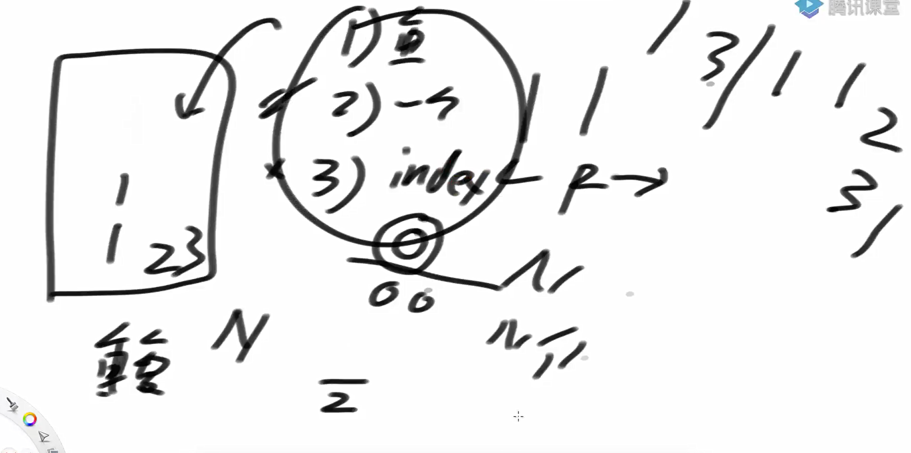

这里面有个潜台词是，排完序的

怎么在sbt中取数？

index = 25，那么怎么取数？

如下

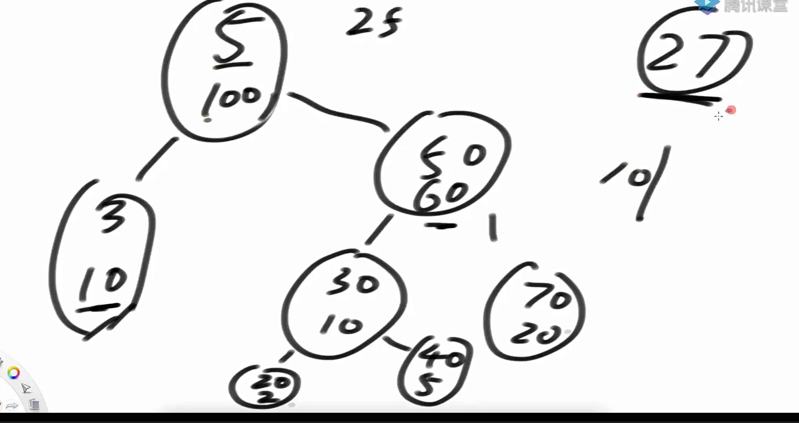

第77个数，必定是右树上的第37个数

有序表实现

```java
package class37;

import class07.HeapGreater;

import java.util.Arrays;

public class code02_SlidingWindowMedian {


    public static double[] medianSlidingWindow1(int[] nums, int k) {
        double[] result = new double[nums.length - k + 1];
        HeapGreater<Integer> maxHeap = new HeapGreater<>((a, b) -> b - a);
        HeapGreater<Integer> minHeap = new HeapGreater<>((a, b) -> a - b);

        // 初始化窗口
        for (int i = 0; i < k; i++) {
            addNum(nums[i], maxHeap, minHeap);
        }
        balanceHeaps(maxHeap, minHeap);
        result[0] = getMedian(maxHeap, minHeap, k);

        // 滑动窗口
        for (int i = k; i < nums.length; i++) {
            removeNum(nums[i - k], maxHeap, minHeap);
            addNum(nums[i], maxHeap, minHeap);
            balanceHeaps(maxHeap, minHeap);
            result[i - k + 1] = getMedian(maxHeap, minHeap, k);
        }

        return result;
    }

    private static void addNum(int num, HeapGreater<Integer> maxHeap, HeapGreater<Integer> minHeap) {
        if (maxHeap.isEmpty() || num <= maxHeap.peek()) {
            maxHeap.push(num);
        } else {
            minHeap.push(num);
        }
    }

    private static  void balanceHeaps(HeapGreater<Integer> maxHeap, HeapGreater<Integer> minHeap) {
        while (maxHeap.size() > minHeap.size() + 1) {
            minHeap.push(maxHeap.pop());
        }
        while (minHeap.size() > maxHeap.size()) {
            maxHeap.push(minHeap.pop());
        }
    }

    private static  void removeNum(int num, HeapGreater<Integer> maxHeap, HeapGreater<Integer> minHeap) {
        if (maxHeap.contain(num)) {
            maxHeap.remove(num);
        } else {
            minHeap.remove(num);
        }
    }

    private static  double getMedian(HeapGreater<Integer> maxHeap, HeapGreater<Integer> minHeap, int k) {
        if (k % 2 == 1) {
            return (double) maxHeap.peek();
        } else {
            return (maxHeap.peek() + minHeap.peek()) / 2.0;
        }
    }

    public static class SBTNode<K extends Comparable<K>>{
        public K key;
        public SBTNode<K> l;
        public SBTNode<K> r;
        public int size;

        public SBTNode(K k){
            key = k;
            size = 1;
        }
    }

    public static class SizeBalancedTreeMap<K extends Comparable<K>>{
        private SBTNode<K> root;

        private SBTNode<K> rightRotate(SBTNode<K> cur){
            SBTNode<K> leftNode = cur.l;
            cur.l = leftNode.r;
            leftNode.r = cur;
            leftNode.size = cur.size;
            cur.size = (cur.l != null ? cur.l.size : 0) + (cur.r != null ? cur.r.size : 0) + 1;

            return leftNode;
        }

        private SBTNode<K> leftRotate(SBTNode<K> cur){
            SBTNode<K> rightNode = cur.r;
            cur.r = rightNode.l;
            rightNode.l = cur;
            rightNode.size = cur.size;
            cur.size = (cur.l != null ? cur.l.size : 0) + (cur.r != null ? cur.r.size : 0) + 1;

            return rightNode;
        }

        private SBTNode<K> maintain(SBTNode<K> cur){
            if (cur == null){
                return null;
            }
            int leftSize = cur.l != null ? cur.l.size : 0;
            int leftLeftSize = cur.l != null && cur.l.l != null ? cur.l.l.size : 0;
            int leftRightSize = cur.l != null && cur.l.r != null ? cur.l.r.size : 0;
            int rightSize = cur.r != null ? cur.r.size : 0;
            int rightLeftSize = cur.r != null && cur.r.l != null ? cur.r.l.size : 0;
            int rightRightSize = cur.r != null && cur.r.r != null ? cur.r.r.size : 0;

            if (leftLeftSize > rightSize){
                cur = rightRotate(cur);
                cur.r = maintain(cur.r);
                cur = maintain(cur);
            }else if (leftRightSize > rightSize){
                cur.l = leftRotate(cur.l);
                cur = rightRotate(cur);
                cur.l = maintain(cur.l);
                cur.r = maintain(cur.r);
                cur = maintain(cur);
            }else if (leftSize < rightRightSize){
                cur = leftRotate(cur);
                cur.l = maintain(cur.l);
                cur = maintain(cur);
            }else if (rightLeftSize > leftSize){
                cur.r = rightRotate(cur.r);
                cur = leftRotate(cur);
                cur.l = maintain(cur.l);
                cur.r = maintain(cur.r);
                cur = maintain(cur);
            }
            return cur;
        }
        //在sbt中查找与cur相等或最接近的节点，用于后续删除和插入操作
        private SBTNode<K> findLastIndex(K key){
            SBTNode<K> pre = root;
            SBTNode<K> cur = root;
            while (cur != null){
                pre = cur;
                if (key.compareTo(cur.key) == 0){
                    break;
                }else if (key.compareTo(cur.key) < 0){
                    cur = cur.l;
                }else{
                    cur = cur.r;
                }
            }
            return pre;
        }

        private SBTNode<K> add(SBTNode<K> cur, K key){
            if (cur == null){
                return new SBTNode<K>(key);
            }else {
                cur.size++;
                if (key.compareTo(cur.key) < 0){
                    cur.l = add(cur.l, key);
                }else {
                    cur.r = add(cur.r, key);
                }
                return maintain(cur);
            }
        }

        private SBTNode<K> delete(SBTNode<K> cur, K key){
            cur.size--;
            if (key.compareTo(cur.key) > 0){
                cur.r = delete(cur.r, key);
            }else if (key.compareTo(cur.key) < 0){
                cur.l = delete(cur.l, key);
            }else {
                if (cur.l == null && cur.r == null) {
                    // free cur memory -> C++
                    cur = null;
                } else if (cur.l == null && cur.r != null) {
                    // free cur memory -> C++
                    cur = cur.r;
                } else if (cur.l != null && cur.r == null) {
                    // free cur memory -> C++
                    cur = cur.l;
                } else {

//                    pre不为空的时候的情况
//                            cur
//                               \
//                                nodeA
//                                 \
//                                 nodeB
//                                /
//                              des ← 最左节点
//                    pre为空的时候
//                            des = cur.r
                    SBTNode<K> pre = null;
                    SBTNode<K> des = cur.r;
                    des.size--;
                    while (des.l != null){
                        pre = des;
                        des = des.l;
                        des.size--;
                    }
                    if (pre != null){
                        pre.l = des.r;
                        des.r = cur.r;
                    }
                    des.l = cur.l;
                    des.size = des.l.size + (des.r != null ? des.r.size : 0) + 1;

                    cur = des;
                }
            }
            return cur;
        }

        //从1开始的第k小的数
        private SBTNode<K> getIndex(SBTNode<K> cur, int kth){
            if (kth == (cur.l != null ? cur.l.size : 0) + 1){
                return cur;
            }else if (kth <= (cur.l != null ? cur.l.size : 0)){
                return getIndex(cur.l, kth);
            }else{
                return getIndex(cur.r, kth - (cur.l != null ? cur.l.size : 0) -1);
            }
        }

        public int size(){
            return root == null ? 0 : root.size;
        }

        public boolean containKey(K key){
            if (key == null){
                throw new RuntimeException("invalid parameter.");
            }
            SBTNode<K> lastNode = findLastIndex(key);
            return lastNode != null && key.compareTo(lastNode.key) == 0 ? true : false;
         }

         public void add(K key){
            if (key == null){
                throw new RuntimeException("invalid parameter.");
            }
            SBTNode<K> lastNode = findLastIndex(key);
            if (lastNode == null || key.compareTo(lastNode.key) != 0){
                root = add(root, key);
            }
         }

         public void remove(K key){
            if (key == null){
                throw new RuntimeException("invalid parameter.");
            }
            if (containKey(key)){
                root = delete(root, key);
            }
         }
        //index 从0开始
         public K getIndexKey(int index){
             if (index < 0 || index >= this.size()) {
                 throw new RuntimeException("invalid parameter.");
             }
             return getIndex(root, index + 1).key;
         }
    }

    public static class Node implements Comparable<Node> {
        public int index;
        public int value;

        public Node(int i, int n) {
            index = i;
            value = n;
        }

        @Override
        public int compareTo(Node o) {
            return  value != o.value?
                        Integer.valueOf(value).compareTo(o.value)
                    :   Integer.valueOf(index).compareTo(o.index);
        }
    }

    public static double[] medianSlidingWindow2(int[] nums, int k){
        SizeBalancedTreeMap<Node> map = new SizeBalancedTreeMap<>();
        for (int i = 0; i < k - 1; i++){
            map.add(new Node(i, nums[i]));
        }
        double[] ans = new double[nums.length - k + 1];
        int index = 0;

        for (int i = k - 1; i < nums.length; i++){
            map.add(new Node(i, nums[i]));
            if (map.size() % 2 == 0){
                Node upmid = map.getIndexKey(map.size() / 2 - 1);
                Node downmid = map.getIndexKey(map.size() / 2);
                ans[index++] = ((double) upmid.value + (double) downmid.value) / 2;
            }else{
                Node mid = map.getIndexKey(map.size() / 2);
                ans[index++] = (double) mid.value;
            }
            map.remove(new Node(i - k + 1, nums[i - k + 1]));
        }
        return ans;
    }


    public static void main(String[] args) {
        int[] nums = {1, 3, -1, -3, 5, 3, 6, 7};
        int k = 3;
        double[]  medians1 = medianSlidingWindow1(nums, k);
        double[] medians2 = medianSlidingWindow2(nums, k);
        System.out.println(Arrays.toString(medians1));
        System.out.println(Arrays.toString(medians2));
    }


}
```

问题三：

自然时序sbt的实现

左右旋不会影响自然时序

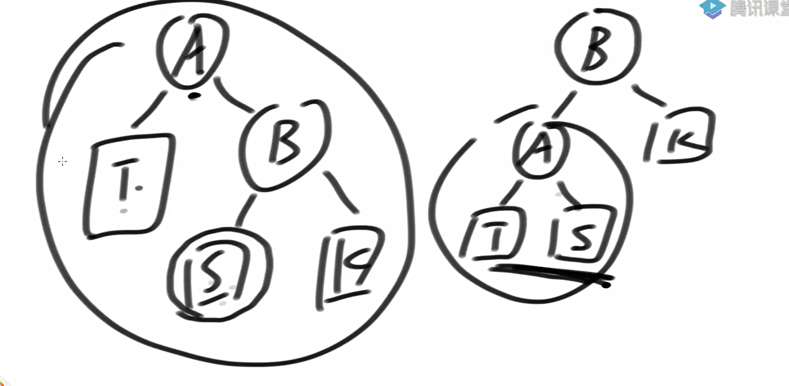

它是一棵支持 按索引插入、删除和查找 的平衡树；

而不是传统意义上的 基于值大小比较的 BST（如 AVL、红黑树、SBT 原始用途）；

所以它本质上是一个 有序序列（List）的高效实现，并不是一个用于排序或查找值的搜索树。

这个sbt的并非由value创建的，而是根据index创建的。

特性		基于值排序的 SBT（原始用途）	基于索引的 SBT（本例用途）

排序依据	value.compareTo(...)		插入时的 index

插入方式	根据值大小选择左右子树	根据 index 和 size 决定方向

是否支持查找某值	✅ 是	❌ 否（除非遍历）

是否支持求第 k 小	❌ 否	✅ 是（通过 index）

主要用途：	快速查找、排序	快速插入、删除、访问任意位置

代码实现

```java
package class37;

import java.util.ArrayList;

public class code03_AddRemoveGetIndexGreat {


    public static class SBTNode<V>{
        public V value;
        public SBTNode<V> l;
        public SBTNode<V> r;
        public int size;


        public SBTNode(V v){
            value = v;
            size = 1;
        }
    }

    public static class SbtList<V>{
        private SBTNode<V> root;

        private SBTNode<V> rightRotate(SBTNode<V> cur){
            SBTNode<V> leftNode = cur.l;
            cur.l = leftNode.r;
            leftNode.r = cur;
            leftNode.size = cur.size;
            cur.size = (cur.l != null ? cur.l.size : 0) + (cur.r != null ? cur.r.size : 0) +1;
            return leftNode;
        }

        private SBTNode<V> leftRotate(SBTNode<V> cur) {
            SBTNode<V> rightNode = cur.r;
            cur.r = rightNode.l;
            rightNode.l = cur;
            rightNode.size = cur.size;
            cur.size = (cur.l != null ? cur.l.size : 0) + (cur.r != null ? cur.r.size : 0) + 1;
            return rightNode;
        }

        private SBTNode<V> maintain(SBTNode<V> cur){
            if (cur == null){
                return null;
            }

            int leftSize = cur.l != null ? cur.l.size : 0;
            int leftLeftSize = cur.l != null && cur.l.l != null ? cur.l.l.size : 0;
            int leftRightSize = cur.l != null && cur.l.r != null ? cur.l.r.size : 0;
            int rightSize = cur.r != null ? cur.r.size : 0;
            int rightLeftSize = cur.r != null && cur.r.l != null ? cur.r.l.size : 0;
            int rightRightSize = cur.r != null && cur.r.r != null ? cur.r.r.size : 0;

            if (leftLeftSize > rightSize){
                cur = rightRotate(cur);
                cur.r = maintain(cur.r);
                cur = maintain(cur);
            }else if (leftRightSize > rightSize){
                cur.l = leftRotate(cur.l);
                cur = rightRotate(cur);
                cur.l = maintain(cur.l);
                cur.r = maintain(cur.r);
                cur = maintain(cur);
            }else if (rightRightSize > leftSize){
                cur = leftRotate(cur);
                cur.l = maintain(cur.l);
                cur = maintain(cur);
            }else if (rightLeftSize > leftSize){
                cur.r = rightRotate(cur.r);
                cur = leftRotate(cur);
                cur.l = maintain(cur.l);
                cur.r = maintain(cur.r);
                cur = maintain(cur);
            }
            return cur;
        }

        private SBTNode<V> add(SBTNode<V> root, int index, SBTNode<V> cur){
            if (root == null){
                return cur;
            }
            root.size++;
            int leftAndHeadSize = (root.l != null ? root.l.size : 0) + 1;
            if (index < leftAndHeadSize){
                root.l = add(root.l, index, cur);
            }else{
                root.r = add(root.r, index - leftAndHeadSize, cur);
            }
            root = maintain(root);
            return root;
        }

        private SBTNode<V> remove(SBTNode<V> root, int index){

            root.size--;
            int rootIndex = root.l != null ? root.l.size : 0;
            if (rootIndex != index){
                if (index < rootIndex){
                    root.l = remove(root.l, index);
                }else{
                    root.r = remove(root.r, index - rootIndex - 1);
                }
                return root;
            }
            if (root.l == null && root.r == null){
                return null;
            }
            if (root.l == null){
                return root.r;
            }
            if (root.r == null){
                return root.l;
            }
            SBTNode<V> pre = null;
            SBTNode<V> suc = root.r;
            suc.size--;
            while (suc.l != null) {
                pre = suc;
                suc = suc.l;
                suc.size--;
            }
            if (pre != null) {
                pre.l = suc.r;
                suc.r = root.r;
            }
            suc.l = root.l;
            suc.size = suc.l.size + (suc.r == null ? 0 : suc.r.size) + 1;
            return suc;
        }

        //index从0开始
        private SBTNode<V> get(SBTNode<V> root, int index){
            int leftSize = root.l != null ? root.l.size : 0;
            if (index < leftSize){
                return get(root.l, index);
            }else if (index == leftSize){
                return root;
            }else {
                return get(root.r, index - leftSize - 1);
            }
        }

        public void add(int index, V num){
            SBTNode<V> cur = new SBTNode<V>(num);
            if (root == null){
                root = cur;
            }else{
                if (index <= root.size){
                    root = add(root, index, cur);
                }
            }
        }

        public V get(int index){
            SBTNode<V> ans = get(root, index);
            return ans.value;
        }

        public void remove(int index){
            if (index >= 0 && size() > index) {
                root = remove(root, index);
            }
        }

        public int size() {
            return root == null ? 0 : root.size;
        }

    }

    public static void main(String[] args) {
        // 功能测试
        int test = 50000;
        int max = 1000000;
        boolean pass = true;
        ArrayList<Integer> list = new ArrayList<>();
        SbtList<Integer> sbtList = new SbtList<>();
        for (int i = 0; i < test; i++) {
            if (list.size() != sbtList.size()) {
                pass = false;
                break;
            }
            if (list.size() > 1 && Math.random() < 0.5) {
                int removeIndex = (int) (Math.random() * list.size());
                list.remove(removeIndex);
                sbtList.remove(removeIndex);
            } else {
                int randomIndex = (int) (Math.random() * (list.size() + 1));
                int randomValue = (int) (Math.random() * (max + 1));
                list.add(randomIndex, randomValue);
                sbtList.add(randomIndex, randomValue);
            }
        }
        for (int i = 0; i < list.size(); i++) {
            if (!list.get(i).equals(sbtList.get(i))) {
                pass = false;
                break;
            }
        }
        System.out.println("功能测试是否通过 : " + pass);

        // 性能测试
        test = 500000;
        list = new ArrayList<>();
        sbtList = new SbtList<>();
        long start = 0;
        long end = 0;

        start = System.currentTimeMillis();
        for (int i = 0; i < test; i++) {
            int randomIndex = (int) (Math.random() * (list.size() + 1));
            int randomValue = (int) (Math.random() * (max + 1));
            list.add(randomIndex, randomValue);
        }
        end = System.currentTimeMillis();
        System.out.println("ArrayList插入总时长(毫秒) ： " + (end - start));

        start = System.currentTimeMillis();
        for (int i = 0; i < test; i++) {
            int randomIndex = (int) (Math.random() * (i + 1));
            list.get(randomIndex);
        }
        end = System.currentTimeMillis();
        System.out.println("ArrayList读取总时长(毫秒) : " + (end - start));

        start = System.currentTimeMillis();
        for (int i = 0; i < test; i++) {
            int randomIndex = (int) (Math.random() * list.size());
            list.remove(randomIndex);
        }
        end = System.currentTimeMillis();
        System.out.println("ArrayList删除总时长(毫秒) : " + (end - start));

        start = System.currentTimeMillis();
        for (int i = 0; i < test; i++) {
            int randomIndex = (int) (Math.random() * (sbtList.size() + 1));
            int randomValue = (int) (Math.random() * (max + 1));
            sbtList.add(randomIndex, randomValue);
        }
        end = System.currentTimeMillis();
        System.out.println("SbtList插入总时长(毫秒) : " + (end - start));

        start = System.currentTimeMillis();
        for (int i = 0; i < test; i++) {
            int randomIndex = (int) (Math.random() * (i + 1));
            sbtList.get(randomIndex);
        }
        end = System.currentTimeMillis();
        System.out.println("SbtList读取总时长(毫秒) :  " + (end - start));

        start = System.currentTimeMillis();
        for (int i = 0; i < test; i++) {
            int randomIndex = (int) (Math.random() * sbtList.size());
            sbtList.remove(randomIndex);
        }
        end = System.currentTimeMillis();
        System.out.println("SbtList删除总时长(毫秒) :  " + (end - start));

    }

}

```

红黑树


最长的链和最短的链的长度差不超过两倍

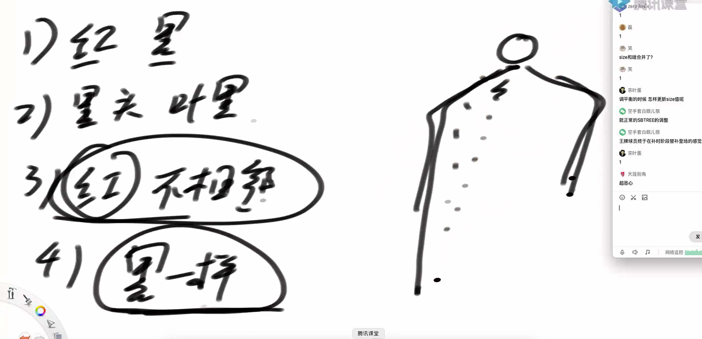

防止像avl一样加减节点频繁操作。