问题一

小虎去买苹果，商店只提供两种类型的塑料袋，每种类型都有任意数量。1）能装下6个苹果的袋子2）能装下8个苹果的袋子

小虎可以自由使用两种袋子来装苹果，但是小虎有强迫症，他要求自己使用的袋子数量必须最少，且使用的每个袋子必须装满。

给定一个正整数N，返回至少使用多少袋子。如果N无法让使用的每个袋子必须装满，返回-1

为什么要有rest < 24的判断？那是因为rest > 24的时候，用6号可能不如用8号好

通过输出归纳方法

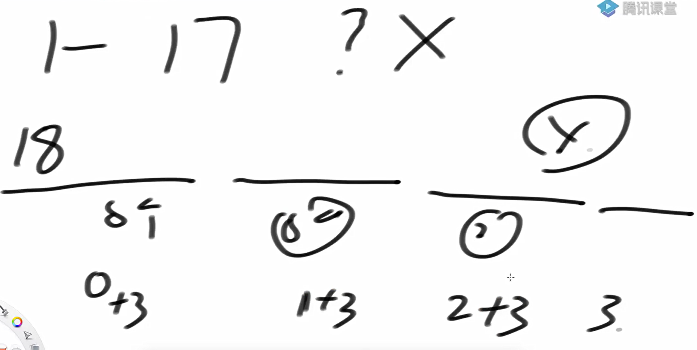

```java
package class38;

public class code01_AppleMinBags {

    public static int minBags(int apple){
       if (apple < 0){
           return -1;
       }
       int bag6 = -1;
       int bag8 = apple / 8;
       int rest = apple - bag8 * 8;
       while (bag8 >= 0 && rest < 24){
           bag6 = minBagBase6(rest);
           if (bag6 != -1){
               break;
           }
           rest = apple - 8 * (--bag8);
       }
       return bag6 == -1 ? -1 : bag6 + bag8;
    }

    public static int minBagBase6(int rest){
        return rest % 6 == 0 ? (rest / 6) : -1;
    }


    public static int minBagAwesome(int apple) {
        if ((apple & 1) != 0) { // 如果是奇数，返回-1
            return -1;
        }
        if (apple < 18) {
            return apple == 0 ? 0 : (apple == 6 || apple == 8) ? 1
                    : (apple == 12 || apple == 14 || apple == 16) ? 2 : -1;
        }
        return (apple - 18) / 8 + 3;
    }


    public static void main(String[] args) {
        for(int apple = 1; apple < 200;apple++) {
            if (minBags(apple) != minBagAwesome(apple)){
                System.out.println("oops");
                break;
            }
            System.out.println(apple + " : "+ minBags(apple));
        }

    }
}

```

问题二：

给定一个正整数N，表示有N份青草统一堆放在仓库里。有一只牛和一只羊，牛先吃，羊后吃，它们轮流吃草。不管是牛还是羊，每一轮能吃的草量必须是：1, 4, 16, 64…（4的某次方）。谁最先把草吃完，谁获胜。

假设牛和羊都绝顶聪明，都想赢，都会做出理性的决定。根据唯一的参数N，返回谁会赢。

hardcode

当N= 0的时候，牛无草可吃，说明羊把草吃完了，所以羊赢了

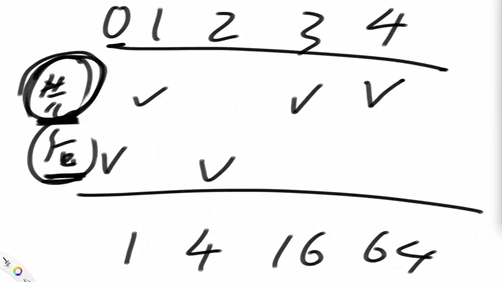

先后手的逻辑

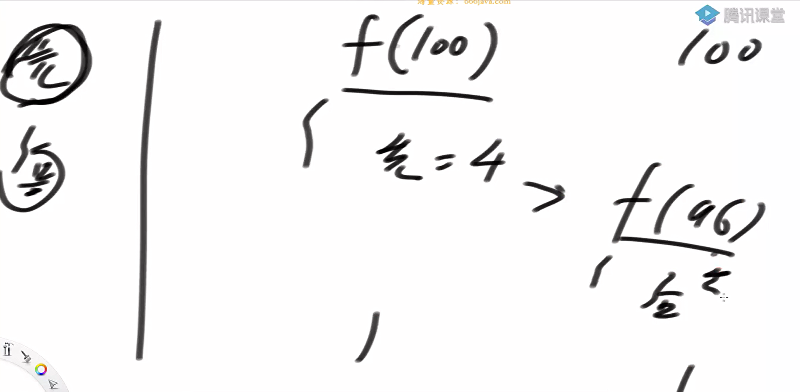

问题三

定义一种数：可以表示成若干（数量>1）连续正数和的数

比如：5 = 2+3，5就是这样的数12 = 3+4+5，12就是这样的数1不是这样的数，因为要求数量大于1个、连续正数和2 = 1 + 1，2也不是，因为等号右边不是连续正数给定一个参数N，返回是不是可以表示成若干连续正数和的数

```java
package class38;

public class code03_MSumToN {

    public static boolean isMSum1(int num){
        for (int start = 1; start <= num; start++){
            int sum = start;
            for (int j = start + 1; j <= num; j++){
                if (sum + j > num){
                    break;
                }else if (sum + j == num){
                    return true;
                }
                sum += j;
            }
        }
        return false;
    }

    public static boolean isMSum2(int num){
        if (num == 0 || num == 1 || num == 2){
            return false;
        }
        return isPowerOfTwo(num) ? false : true;
    }

    public static boolean isPowerOfTwo(int n) {

        return n > 0 && (n & (n - 1)) == 0;
    }

    public static void main(String[] args) {
        int testTimes = 100;
        int maxValue = 50;
        for (int i = 0; i < testTimes; i++){
            System.out.println(i + " " + isMSum1(i) + " " + isMSum2(i));
        }
    }
}

```

问题四

int[] d, d[i]：i号怪兽的能力

int[] p, p[i]：i号怪兽要求的钱

开始时你的能力是0，你的目标是从0号怪兽开始，通过所有的怪兽。

如果你当前的能力，小于i号怪兽的能力，你必须付出p[i]的钱，贿赂这个怪兽，然后怪兽就会加入你，他的能力直接累加到你的能力上；如果你当前的能力，大于等于i号怪兽的能力，你可以选择直接通过，你的能力并不会下降，你也可以选择贿赂这个怪兽，然后怪兽就会加入你，他的能力直接累加到你的能力上。

返回通过所有的怪兽，需要花的最小钱数。

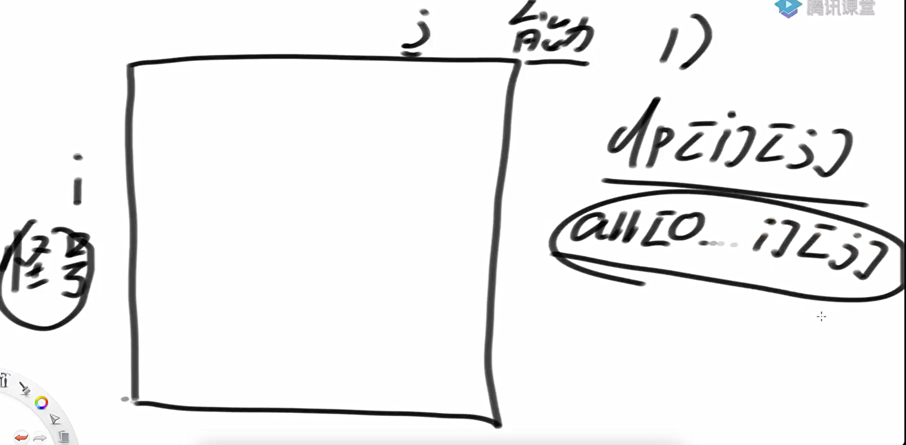

范围划分

为什么使用这样的划分，这是因为当使用怪兽的能力值作为范围的时候，可能导致能力值过大

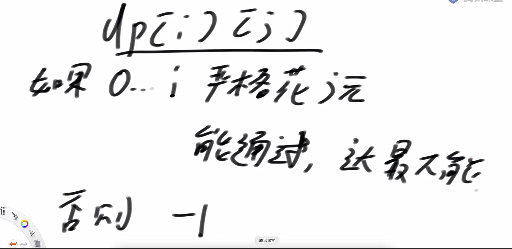

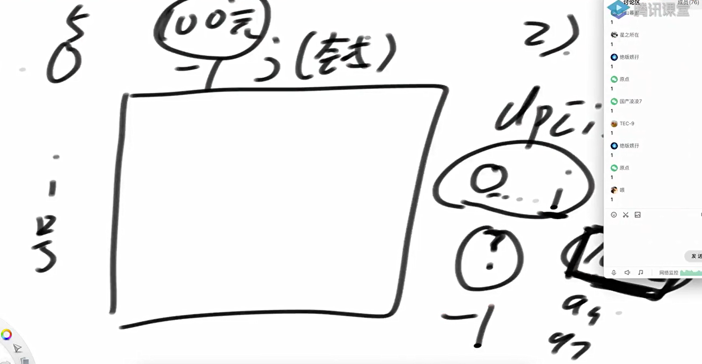

具体描述dpij

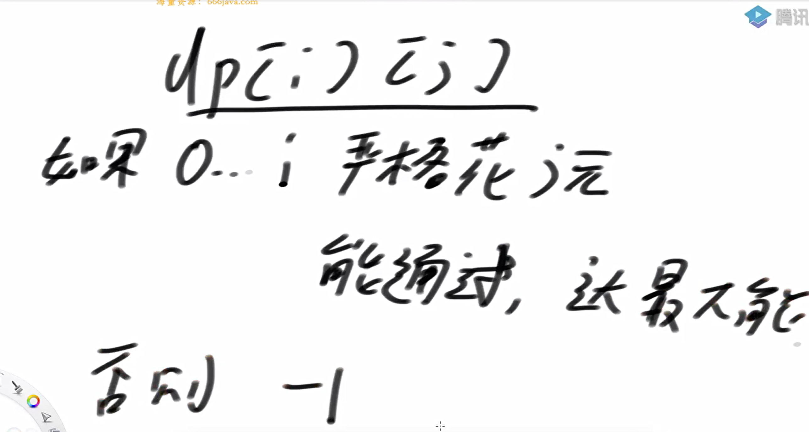

如何取得最优值？

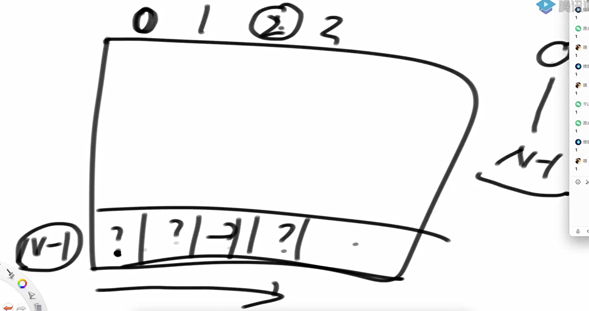

转移条件

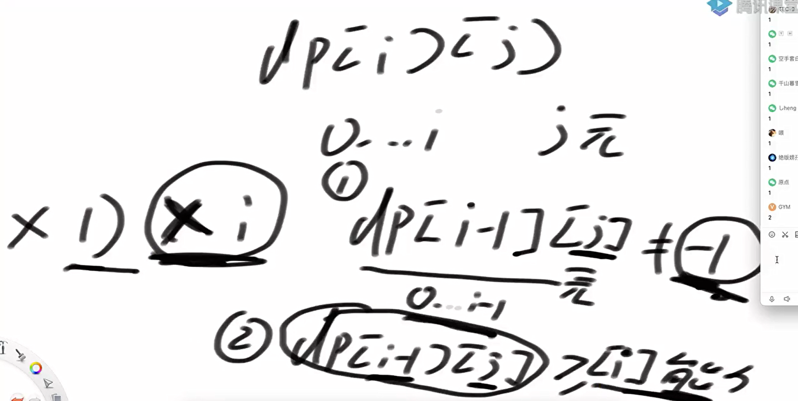

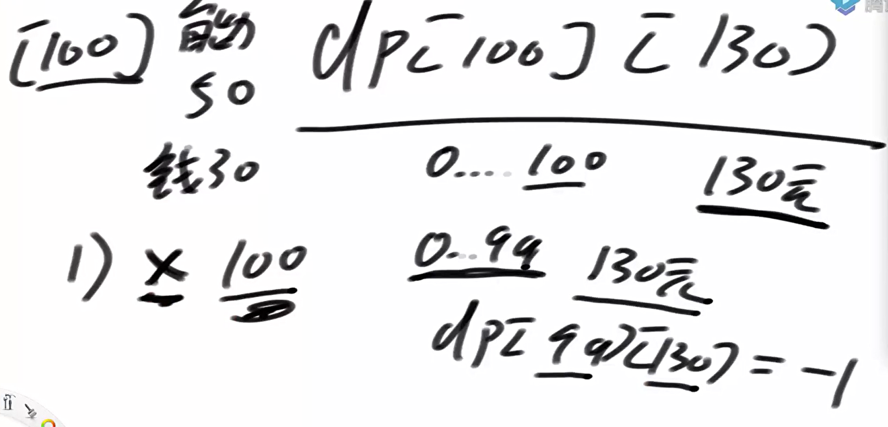

转移条件是什么?

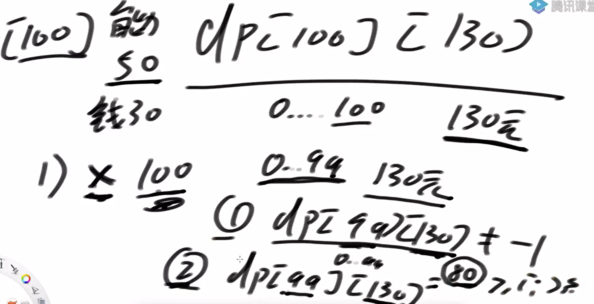

选择的时候的转移条件

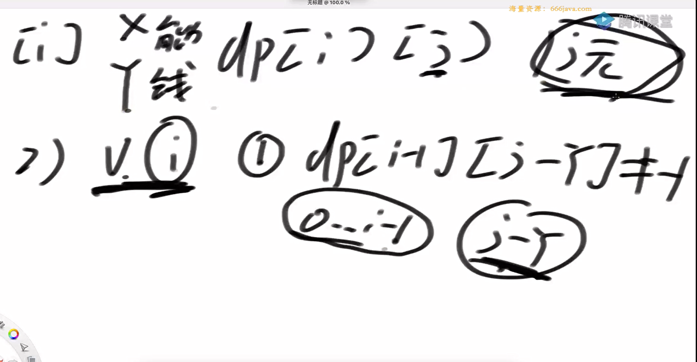

两种递归的方式应对的是两种情况

第一种递归应对的是：能力值比较小，但花费较大

第二种递归应对的是：能力值较大，花费较小

代码实现

```java
package class38;

public class code04_MoneyProblem {


    //目前的能力值是ability, 来到index位置的怪兽, 如果要通过后续怪兽
    //请返回最少花的钱数
    public static long process1(int[] d, int[] p, int index, int ability){
        if (index == d.length){
            return 0;
        }
        //能力值小于当前的怪兽，只能贿赂
        if (ability < d[index]){
            return p[index] + process1(d, p, index+1, ability + d[index]);
        }else{
            //能力值大于等于当前的怪兽选择贿赂与不贿赂两种
            //贿赂花费
            long p1 = p[index] + process1(d, p, index+1, ability + d[index]);
            long p2 = process1(d, p, index+1, ability);
            return Math.min(p1, p2);
        }
    }

    public static long func1(int[] d, int[] p){
        return process1(d, p, 0, 0);
    }


    //func1的dp版本
    //dp[cur][hp]从第 cur 个怪兽开始，当前武力值为 hp，
    // 打完所有怪兽所需要的最小花费。
    public static long func2(int[] d, int[] p){
        int sum = 0;
        for (int num : d){
            sum += num;
        }

        long[][] dp = new long[d.length + 1][sum + 1];
        for (int i = 0; i <= sum; i++){
            dp[0][i] = 0;
        }
        //初始化dp[d.length][?] = 0;
        for (int cur = d.length - 1; cur >= 0; cur--){
            for (int hp = 0; hp <= sum; hp++){
                if (hp + d[cur] > sum){
                    continue;
                }

                if (hp < d[cur]){
                    dp[cur][hp] = p[cur] + dp[cur + 1][hp + d[cur]];
                }else{
                    dp[cur][hp] = Math.min(p[cur] + dp[cur + 1][hp + d[cur]], dp[cur + 1][hp]);
                }
            }
        }
        return dp[0][0];
    }

    //第一种情况是 p[?] >> d[?]
    //考虑第二种情况，就是d[?] >> p[?]

    public static long func3(int[] d, int[] p){
        int allMoney = 0;
        for (int i = 0; i < p.length; i++){
            allMoney += p[i];
        }
        int N = d.length;
        for (int money = 0; money < allMoney; money++){
            if (process3(d, p, N-1, money) != -1){
                return money;
            }
        }
        return allMoney;
    }


    //从0..index号怪兽，花的钱，必须严格==money
    //如果通过不了，返回-1
    //如果可以通过, 返回能通过情况下的最大能力值

    public static long process3(int[] d, int[] p, int index, int money){
        //一个怪兽都没遇到
        if (index == -1){
           return money == 0 ? 0 : -1;
        }
        // index >= 0
        //1)不贿赂怪兽
        long preMaxAbility1 = process3(d, p, index - 1, money);
        long p1 = -1;
        if (preMaxAbility1 != -1 && preMaxAbility1 >= d[index]){
            p1 = preMaxAbility1;
        }

        //2)贿赂当前怪兽
        long preMaxAbility2 = process3(d, p, index - 1, money - p[index]);
        long p2 = -1;
        if (preMaxAbility2 != -1){
            p2 = preMaxAbility2 + d[index];
        }

        return Math.max(p1, p2);
    }


    //第二种情况的dp算法
// dp[i][j]含义：
    // 能经过0～i的怪兽，且花钱为j（花钱的严格等于j）时的武力值最大是多少？
    // 如果dp[i][j]==-1，表示经过0～i的怪兽，花钱为j是无法通过的，
    // 或者之前的钱怎么组合也得不到正好为j的钱数
    public static long  func4(int[] d,int[] p){
        int sum = 0;
        for (int num : p){
            sum += num;
        }

        int[][] dp = new int[d.length][sum+1];
        for (int i = 0; i < dp.length; i++){
            for (int j = 0; j <= sum; j++){
                dp[i][j] = -1;
            }
        }

        dp[0][p[0]] = d[0];
        for (int i = 1; i <d.length; i++){
            for (int j = 0; j <= sum; j++){
                // 可能性一，为当前怪兽花钱
                // 存在条件：
                // j - p[i]要不越界，并且在钱数为j - p[i]时，
                // 要能通过0～i-1的怪兽，并且钱数组合是有效的。
                if(j - p[i] >= 0 && dp[i - 1][j - p[i]] != -1){
                    dp[i][j] = dp[i - 1][j - p[i]] + d[i];
                }
                // 可能性二，不为当前怪兽花钱
                // 存在条件：
                // 0~i-1怪兽在花钱为j的情况下，能保证通过当前i位置的怪兽
                if(dp[i - 1][j] >= d[i]){
                    // 两种可能性中，选武力值最大的
                    dp[i][j] = Math.max(dp[i][j], dp[i - 1][j]);
                }
            }
        }
        int ans = 0;
        for (int j = 0; j <=sum; j++){
            if(dp[d.length - 1][j] != -1){
                ans = j;
                break;
            }
        }
        return ans;
    }

    public static int[][] generateTwoRandomArray(int len, int value) {
        int size = (int) (Math.random() * len) + 1;
        int[][] arrs = new int[2][size];
        for (int i = 0; i < size; i++) {
            arrs[0][i] = (int) (Math.random() * value) + 1;
            arrs[1][i] = (int) (Math.random() * value) + 1;
        }
        return arrs;
    }

    public static void main(String[] args) {
        int len = 10;
        int value = 20;
        int testTimes = 10000;
        for (int i = 0; i < testTimes; i++) {
            int[][] arrs = generateTwoRandomArray(len, value);
            int[] d = arrs[0];
            int[] p = arrs[1];
            long ans1 = func1(d, p);
            long ans2 = func2(d, p);
            long ans3 = func3(d, p);
            long ans4 = func4(d,p);
            if (ans1 != ans4){
                System.out.println("oops!");
                break;
            }
        }

    }


}

```