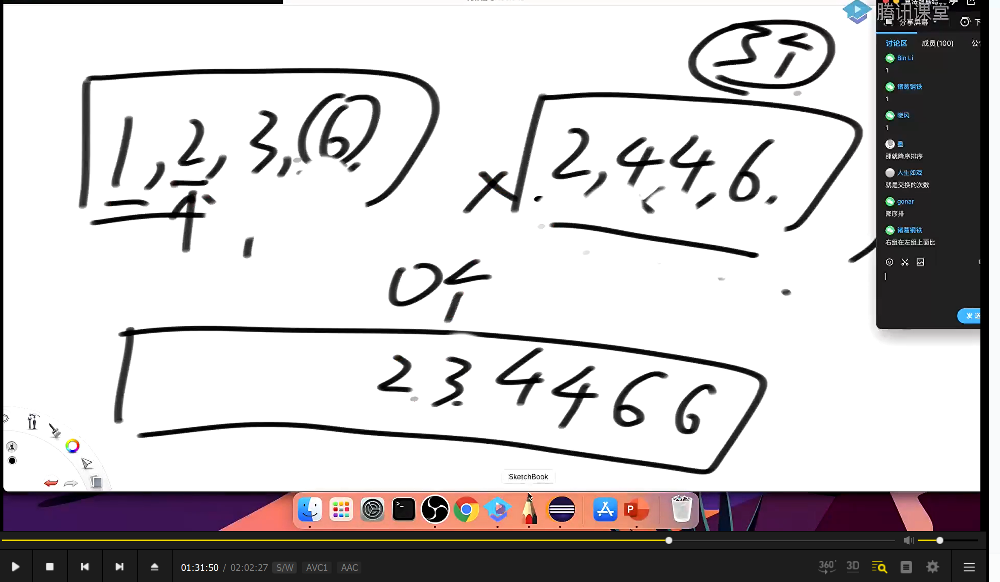

###### 归并排序的递归和非递归实现

```java
package class04;

import java.util.Arrays;
import java.util.Random;

public class mergeSort {

    public static void mergeSort1(int[] arr){
        if (arr == null || arr.length < 2){
            return;
        }
        process(arr, 0, arr.length - 1);
    }

    private static void process(int[] arr, int l, int r) {
        if (l == r){
            return;
        }
        int mid = l + (r - l) / 2;
        process(arr, l, mid);
        process(arr, mid + 1, r);
        merge(arr, l, mid, r);
    }

    private static void merge(int[] arr, int l, int mid, int r) {
        int[] help = new int[r - l + 1];
        int index = 0;
        int p1 = l;
        int p2 = mid + 1;
        while (p1 <= mid && p2 <= r){
            help[index++] = arr[p1] <= arr[p2] ? arr[p1++] : arr[p2++];
        }

        while(p1 <= mid){
            help[index++] = arr[p1++];
        }

        while (p2 <= r){
            help[index++] = arr[p2++];
        }

        for (int i = 0; i < help.length; i++){
            arr[l + i] = help[i];
        }
    }

    public static void mergeSort2(int[] arr){
        if (arr == null || arr.length < 2){
            return;
        }
        int mergeSize = 1;
        int N = arr.length;
        while(mergeSize < N){
            int l = 0;
            while(l < N){
                if (mergeSize >= N - l){
                    break;
                }
                int m = l + mergeSize - 1;
                int r = m + Math.min(mergeSize, N-1-m);
                merge(arr, l, m, r);
                l = r + 1;
            }
            mergeSize *= 2;
        }
    }

    public static void testSort(int[] arr){
        Arrays.sort(arr);
    }


    public static int[] copyArray(int[] arr){
        if (arr == null){
            return null;
        }
        int[] newArray = new int[arr.length];
        for (int i = 0; i < arr.length; i++){
            newArray[i] = arr[i];
        }
        return newArray;
    }

    public static int[] generateArray(int maxLen, int maxValue){
        Random random = new Random();
        int len = random.nextInt(maxLen + 1);
        if (len == 0){
            return null;
        }
        int[] arr = new int[len];
        for (int i = 0; i < len; i++){
            int num = random.nextInt(2 * maxValue + 1) - maxValue;
            arr[i] = num;
        }
        return arr;
    }
    public static void main(String[] args) {
        int testTimes = 5000;
        int maxLen = 10;
        int maxValue = 10;
        for (int i = 0; i < testTimes; i++){
            int[] arr1 = generateArray(maxLen, maxValue);
            int[] arr2 = copyArray(arr1);
            int[] arr3 = copyArray(arr1);

            if (arr1 == null){
                continue;
            }

            mergeSort1(arr1);
            mergeSort2(arr2);
            testSort(arr3);

            if (!isEquals(arr1, arr3)){
                System.out.println("oops1");
            }
            if (!isEquals(arr2, arr3)){
                System.out.println("oops2");
            }

        }
    }

    private static boolean isEquals(int[] arr1, int[] arr2) {
        if (arr1 == null && arr2 == null){
            return true;
        }
        if (arr1 != null && arr2 != null){
            for (int i = 0; i < arr1.length; i++){
                if (arr1[i] != arr2[i]){
                    return false;
                }
            }
            return true;
        }
        return false;
    }


}

```

###### 小和问题

给定一个整数数组 arr，计算数组中每个元素左边所有比它小的元素之和。即对于每个元素 arr[i]，找到所有满足 j < i 且 arr[j] < arr[i] 的元素，并将这些元素相加。最终结果是所有这些和的总和。

解决思路：x比一个小数组（已经排序好了）中的数i小，相当小和中有r-p2+1个数x

```java
package class04;

import java.util.Random;

public class smallSum {


   public static int smallSum(int[] arr){
       if (arr == null || arr.length < 2){
           return 0;
       }
       return process(arr, 0, arr.length - 1);
   }

    private static int process(int[] arr, int l, int r) {
       if (l == r){
            return 0;
       }
       int mid = l + (r - l) / 2;
       return process(arr, l, mid) + process(arr, mid + 1, r) + merge(arr, l, mid, r);
    }

    private static int merge(int[] arr, int l, int mid, int r) {
       int[] help = new int[r - l + 1];
       int p1 = l;
       int p2 = mid + 1;
       int res = 0;
       int index = 0;
       while(p1 <= mid && p2 <= r){
           res += arr[p1] < arr[p2] ? arr[p1] * (r - p2 + 1) : 0;
           help[index++] = arr[p1] < arr[p2] ? arr[p1++] : arr[p2++];
       }

       while(p1 <= mid){
           help[index++] = arr[p1++];
       }

       while(p2 <= r){
           help[index++] = arr[p2++];
       }

       for (int i = 0 ; i < help.length; i++){
           arr[l + i] = help[i];
       }

       return res;
    }


    public static void main(String[] args) {
        int testTimes = 5000;
        int maxLen = 10;
        int maxValue = 10;

        for (int i = 0; i < testTimes; i++){
            int[] arr = generateRandomArray(maxLen, maxValue);
            int[] copyArr = copyArray(arr);

            if (arr == null){
                continue;
            }
            if (smallSum(arr) != test(copyArr)){
                System.out.println("oops");
                break;
            }
        }

        return;
    }

    private static int test(int[] arr) {
       int res = 0;
       for (int i = 1; i < arr.length; i++){
           for (int j = 0; j < i; j++){
               if (arr[j] < arr[i]){
                   res += arr[j];
               }
           }
       }
       return res;
    }

    private static int[] copyArray(int[] arr) {
       if (arr == null){
           return null;
       }
       int[] list = new int[arr.length];
       for (int i = 0; i < arr.length; i++){
           list[i] = arr[i];
       }
       return list;
    }

    private static int[] generateRandomArray(int maxLen, int maxValue) {
        Random random = new Random();
        int len = random.nextInt(maxLen + 1);
        if (len == 0){
            return null;
        }
        int[] arr = new int[len];
        for (int i=0; i < len; i++){
            int num = random.nextInt(maxValue * 2 + 1) - maxValue;
            arr[i] = num;
        }
        return arr;
    }


}

```

逆序对数量

一个数组中逆序对的数量的计算



经典方法是采用的归并排序的改版

从右往左进行，p1和p2   p1和p2相等的时候，先让p2进入，这样做的目的是p1为基准，判断p2中小于p1的个数

代码如下

```java
package class04;

import java.util.Random;

public class reversePair {


    public static int reversePairNum(int[] arr){
        if (arr == null || arr.length < 2){
            return 0;
        }
        int l = 0;
        int r = arr.length - 1;
        int mid = l + (r - l) / 2;
        return process(arr, l, mid) + process(arr, mid+1, r) + merge(arr, l, mid, r);
    }


    private static int process(int[] arr, int l, int r){
        if (l == r){
            return 0;
        }
        int mid = l + (r - l) / 2;
        return process(arr, l, mid) + process(arr, mid+1, r) + merge(arr, l, mid, r);
    }


    private static int merge(int[] arr, int l, int mid,int r) {

        int[] help = new int[r - l + 1];
        int p1 = mid;
        int p2 = r;
        int ans = 0;
        int index = r;
        while(p1 >= l && p2 > mid){
            ans += arr[p1] > arr[p2] ? p2 - mid + 1 : 0;
            help[r--] = arr[p2] >= arr[p1] ? arr[p2--] : arr[p1--];
        }

        while(p1 >= l){
            help[index--] = arr[p1--];
        }

        while(p2 > mid){
            help[index--] = arr[p2--];
        }

        for(int i = 0; i < help.length; i++){
            arr[l + i] = help[i];
        }

        return ans;
    }

    private static int[] generateRandomArray(int maxLen, int maxValue) {
        Random random = new Random();
        int len = random.nextInt(maxLen + 1);
        if (len == 0){
            return null;
        }
        int[] arr = new int[len];
        for (int i=0; i < len; i++){
            int num = random.nextInt(maxValue * 2 + 1) - maxValue;
            arr[i] = num;
        }
        return arr;
    }

    public static void main(String[] args) {
        int testTimes = 5000;
        int maxValue = 10;
        int maxLen = 10;

        for (int i = 0; i < testTimes; i++){
            int[] arr = generateRandomArray(maxLen, maxValue);
            int[] copy = copyArray(arr);

            if (arr == null){
                continue;
            }

            if (reversePairNum(arr) != test(copy)){

            }
        }
    }

    private static int test(int[] arr) {
        int res = 0;
        for (int i = 0; i < arr.length; i++){
            for (int j = i+1; j < arr.length; j++){
                if (arr[i] > arr[j]){
                    res++;
                }
            }
        }
        return res;
    }

    private static int[] copyArray(int[] arr) {
        if (arr == null){
            return null;
        }
        int[] list = new int[arr.length];
        for (int i = 0; i < arr.length; i++){
            list[i] = arr[i];
        }
        return list;
    }
}

```

###### 逆序对计算

经典思路：用归并排序（逆序归并的时候）计算逆序对数

```java
package class04;

import java.util.Random;

public class reversePair {


    public static int reversePairNum(int[] arr){
        if (arr == null || arr.length < 2){
            return 0;
        }

        return process(arr, 0, arr.length - 1);
    }


    private static int process(int[] arr, int l, int r){
        if (l == r){
            return 0;
        }
        int mid = l + (r - l) / 2;
        return process(arr, l, mid) + process(arr, mid+1, r) + merge(arr, l, mid, r);
    }


    private static int merge(int[] arr, int l, int mid,int r) {

        int[] help = new int[r - l + 1];
        int p1 = mid;
        int p2 = r;
        int ans = 0;
        int index = help.length - 1;
        while(p1 >= l && p2 > mid){
            ans += arr[p1] > arr[p2] ? (p2 - mid): 0;
            help[index--] = arr[p2] >= arr[p1] ? arr[p2--] : arr[p1--];
        }

        while(p1 >= l){
            help[index--] = arr[p1--];
        }

        while(p2 > mid){
            help[index--] = arr[p2--];
        }

        for(int i = 0; i < help.length; i++){
            arr[l + i] = help[i];
        }

        return ans;
    }

    private static int[] generateRandomArray(int maxLen, int maxValue) {
        Random random = new Random();
        int len = random.nextInt(maxLen + 1);
        if (len == 0){
            return null;
        }
        int[] arr = new int[len];
        for (int i=0; i < len; i++){
            int num = random.nextInt(maxValue * 2 + 1) - maxValue;
            arr[i] = num;
        }
        return arr;
    }

    public static void main(String[] args) {
        int testTimes = 5000;
        int maxValue = 10;
        int maxLen = 10;

        for (int i = 0; i < testTimes; i++){
            int[] arr = generateRandomArray(maxLen, maxValue);
            int[] copy = copyArray(arr);

            if (arr == null){
                continue;
            }

            int o1 = reversePairNum(arr);
            int o2 = test(copy);
            if (o1 != o2){
                System.out.println("o1 = " + o1 + " o2 = " + o2);
                System.out.println("oops");
                break;
            }
        }
    }

    private static int test(int[] arr) {
        int res = 0;
        for (int i = 0; i < arr.length; i++){
            for (int j = i+1; j < arr.length; j++){
                if (arr[i] > arr[j]){
                    res++;
                }
            }
        }
        return res;
    }

    private static int[] copyArray(int[] arr) {
        if (arr == null){
            return null;
        }
        int[] list = new int[arr.length];
        for (int i = 0; i < arr.length; i++){
            list[i] = arr[i];
        }
        return list;
    }
}

```

###### 给定一个整数数组 arr，计算数组中所有满足以下条件的逆序对的数量：

- 对于任意两个元素 arr[i] 和 arr[j]，如果满足 i < j 且 arr[i] > 2 * arr[j]，则称 (arr[i], arr[j]) 为一个有效的逆序对。

- 计算整个数组中所有这样的有效逆序对的数量。

方法一

 双指针法

```java
package class04;


import java.util.Random;

public class biggerThanRightTwice {

    public static int reversePairNum(int[] arr) {
        if (arr == null || arr.length < 2) {
            return 0;
        }
        return process(arr, 0, arr.length - 1);
    }

    private static int process(int[] arr, int l, int r) {
        if (l == r) {
            return 0;
        }
        int mid = l + (r - l) / 2;
        return process(arr, l, mid) + process(arr, mid + 1, r) + merge(arr, l, mid, r);
    }

    private static int merge(int[] arr, int l, int mid, int r) {
        int ans = 0;
        int p1 = l;
        int p2 = mid + 1;

        // 统计逆序对数量
        while (p1 <= mid && p2 <= r) {
            if (arr[p1] > (arr[p2] << 1)) {
                ans += mid - p1 + 1; // arr[p1] 到 arr[mid] 都大于 arr[p2]
                p2++;
            } else {
                p1++;
            }
        }

        // 归并排序部分
        p1 = l;
        p2 = mid + 1;
        int[] help = new int[r - l + 1];
        int index = 0;
        while (p1 <= mid && p2 <= r) {
            help[index++] = arr[p1] <= arr[p2] ? arr[p1++] : arr[p2++];
        }
        while (p1 <= mid) {
            help[index++] = arr[p1++];
        }
        while (p2 <= r) {
            help[index++] = arr[p2++];
        }
        for (int i = 0; i < help.length; i++) {
            arr[l + i] = help[i];
        }

        return ans;
    }

    private static int[] generateRandomArray(int maxLen, int maxValue) {
        Random random = new Random();
        int len = random.nextInt(maxLen + 1);
        if (len == 0) {
            return null;
        }
        int[] arr = new int[len];
        for (int i = 0; i < len; i++) {
            int num = random.nextInt(maxValue * 2 + 1) - maxValue;
            arr[i] = num;
        }
        return arr;
    }

    public static void main(String[] args) {
        int testTimes = 5000;
        int maxValue = 10;
        int maxLen = 10;

        for (int i = 0; i < testTimes; i++) {
            int[] arr = generateRandomArray(maxLen, maxValue);
            int[] copy = copyArray(arr);

            if (arr == null) {
                continue;
            }

            int o1 = reversePairNum(arr);
            int o2 = test(copy);
            if (o1 != o2) {
                System.out.println("o1 = " + o1 + " o2 = " + o2);
                System.out.println("oops");
                printArray(arr);
                printArray(copy);
                break;
            }
        }
        System.out.println("All tests passed!");
    }

    private static int test(int[] arr) {
        int res = 0;
        for (int i = 0; i < arr.length; i++) {
            for (int j = i + 1; j < arr.length; j++) {
                if (arr[i] > (arr[j] << 1)) {
                    res++;
                }
            }
        }
        return res;
    }

    private static int[] copyArray(int[] arr) {
        if (arr == null) {
            return null;
        }
        int[] list = new int[arr.length];
        for (int i = 0; i < arr.length; i++) {
            list[i] = arr[i];
        }
        return list;
    }

    private static void printArray(int[] arr) {
        if (arr == null) {
            return;
        }
        for (int i = 0; i < arr.length; i++) {
            System.out.print(arr[i] + " ");
        }
        System.out.println();
    }
}


```

方法二  

滑动窗口

```java
  // 统计逆序对数量  双指针法
//        while (p1 <= mid && p2 <= r) {
//            if (arr[p1] > (arr[p2] << 1)) {
//                ans += mid - p1 + 1; // arr[p1] 到 arr[mid] 都大于 arr[p2]
//                p2++;
//            } else {
//                p1++;
//            }
//        }
        //滑动窗口法
        int window = mid + 1;
        for (int i = l; i <= mid; i++){
            //[mid + 1, window - 1] 满足   window这个位置并不满足条件，否则也不会停在这里
            if (arr[i] > (2 * arr[window]) && window <= r){
                window++;
            }
            //window - 1 - (mid + 1) + 1 = window - mid - 1
            ans += window - mid - 1;
        }
```