问题一

给定一个非负数组 arr，和一个正数 m。

返回 arr 的所有子序列中累加和 % m 之后的最大值。

简化空间的算法

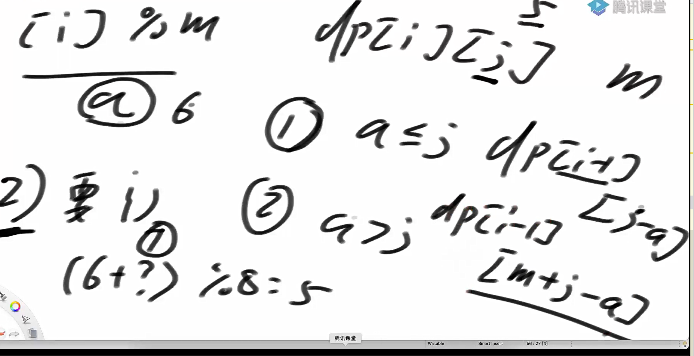

代码实现

```java
package class40;

import java.util.HashSet;
import java.util.TreeSet;

public class code01_SubsquenceMaxModM {

    public static int max1(int[] arr, int m){
        HashSet<Integer> set = new HashSet<>();
        process1(arr, 0, 0, set);
        int max = Integer.MIN_VALUE;
        for (Integer n : set){
            max = Math.max(max, n % m);
        }
        return max;
    }

    public static void process1(int[] arr, int index, int sum, HashSet<Integer> set){
        if (index == arr.length){
            set.add(sum);
        }
        process1(arr, index + 1, sum, set);
        process1(arr, index +1, sum + arr[index], set);
    }


    public static int max2(int[] arr, int m){
       int N = arr.length;
        for (int j = m-1; j >= 0; j--){
            if (process2(arr, m, N-1, j)){
                return j;
            }
        }
        return 0;
    }

//    0..index中
//    是否存在一个子序列，使得它的和对 m 取模等于 target。
    public static boolean process2(int[] arr, int m, int index, int target){
        if (index == 0){
            return (target == 0 || (arr[0] % m) == target);
        }

        //不选
        boolean noTake = process2(arr, m, index - 1, target);
        //选
        int curMod  = arr[index] % m;


        // ( 前面的和 + 当前的mod(curMode) ) % m = target
        // 前面的和 = (target - curMode) % m
        //保证正数  newTarget =  (target - curMode + m) % m
        int newTarget = (target - curMod + m) % m;
        boolean take = process2(arr, m, index - 1, newTarget);

        return take || noTake;
    }

    //dp[i][j]的含义是arr[0]~arr[i]上的和模m正好为j
    public static int max3(int[] arr, int m){
        int N = arr.length;

        boolean[][] dp = new boolean[N][m];

        //dp[0][?] = (j == 0 || (arr[0] % m) == j);

        for (int j = 0; j < m; j++){
            dp[0][j] = (j == 0 || (arr[0] % m) == j);
        }


        for (int i = 1; i < N; i++){
            for (int j = 0; j < m; j++){
                //不选
                dp[i][j] = dp[i - 1][j];
                //选
                int cur = arr[i] % m;
                dp[i][j] = dp[i][j] || dp[i-1][(j - cur + m) % m];
            }
        }


        for (int j = m-1; j >= 0; j--){
            if (dp[N-1][j]){
                return j;
            }
        }
        return 0;
    }

    //dp[i][j]的含义是arr[0]~arr[i]上的和模m正好为j
    public static int max(int[] arr, int m){
        int N = arr.length;

        boolean[] dp1 = new boolean[m];
        boolean[] dp2 = new boolean[m];


        //dp[0][?] = (j == 0 || (arr[0] % m) == j);

        for (int j = 0; j < m; j++){
            dp1[j] = (j == 0 || (arr[0] % m) == j);
        }

        for (int i = 1; i < N; i++){
            for (int j = 0; j < m; j++){
                dp2[j] = dp1[j];
                int cur = arr[i] % m;
                dp2[j] = dp1[j] || dp1[(j - cur + m) % m];
            }
            boolean[] temp = dp1;
            dp1 = dp2;
            dp2 = temp;
        }

        int ans = 0;
        for (int j = m-1; j >=0; j--){
            if (dp1[j]){
                return j;
            }
        }


        return 0;
    }


    public static int max4(int[] arr, int m){
        int sum = 0;
        for (int num : arr) {
            sum += num;
        }

        int ans = 0;
        for (int j = 0; j <= sum; j++) {
            if (process4(arr, arr.length - 1, j)) {
                ans = Math.max(ans, j % m);
            }
        }
        return ans;
    }

    //递归函数：前 i+1 个元素能否组成和为 target
    public static boolean process4(int[] arr, int index, int target){
        if (target == 0){
            return true;
        }
        if (index < 0){
            return false;//无元素可选
        }
        //不选当前元素
        boolean notTake = process4(arr, index - 1, target);
        //选当前元素
        boolean take = false;
        if (target >= arr[index]){
            take = process4(arr, index - 1, target - arr[index]);
        }
        return notTake || take;
    }


    public static int max5(int[] arr, int m){
        int sum = 0;
        int N = arr.length;
        for (int i = 0; i < N; i++) {
            sum += arr[i];
        }
        boolean[][] dp = new boolean[N][sum + 1];
        for (int i = 0; i < N; i++) {
            dp[i][0] = true;
        }
        dp[0][arr[0]] = true;
        for (int i = 1; i < N; i++) {
            for (int j = 1; j <= sum; j++) {
                dp[i][j] = dp[i - 1][j];
                if (j - arr[i] >= 0) {
                    dp[i][j] |= dp[i - 1][j - arr[i]];
                }
            }
        }
        int ans = 0;
        for (int j = 0; j <= sum; j++) {
            if (dp[N - 1][j]) {
                ans = Math.max(ans, j % m);
            }
        }
        return ans;
    }


//    TreeSet.floor : floor(E e) 方法用于返回当前 TreeSet 中小于或等于给定元素的最大元素。

    public static int max6(int[] arr, int m){
        if (arr.length == 1) {
            return arr[0] % m;
        }
        int mid = (arr.length - 1) / 2;
        TreeSet<Integer> sortSet1 = new TreeSet<>();
        process6(arr, 0, 0, mid, m, sortSet1);
        TreeSet<Integer> sortSet2 = new TreeSet<>();
        process6(arr, mid + 1, 0, arr.length - 1, m, sortSet2);
        int ans = 0;
        for (Integer leftMod : sortSet1) {
            Integer rightMod = sortSet2.floor((m - 1 - leftMod));
            if (rightMod != null) {
                ans = Math.max(ans, (leftMod + rightMod) % m);
            }
        }
        return ans;
    }


    // 从index出发，最后有边界是end+1，arr[index...end]
    public static void process6(int[] arr, int index, int sum, int end, int m, TreeSet<Integer> sortSet) {
        if (index > end) {
            sortSet.add(sum % m);
        } else {
            process6(arr, index + 1, sum, end, m, sortSet);
            process6(arr, index + 1, sum + arr[index], end, m, sortSet);
        }
    }

}

```

问题二：

牛牛家里一共有n袋零食，第i袋零食体积为v[i]，背包容量为w。牛牛想知道在总体积不超过背包容量的情况下，一共有多少种零食放法，体积为0也算一种放法

1 <= n <= 30, 1 <= w <= 2 * 10^9

v[i] (0 <= v[i] <= 10^9)

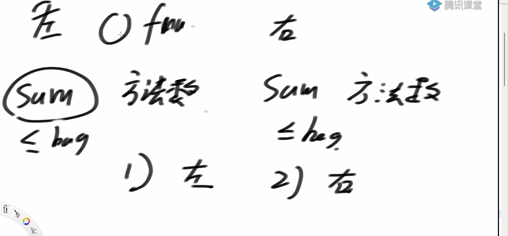

如何处理左右取值的情况

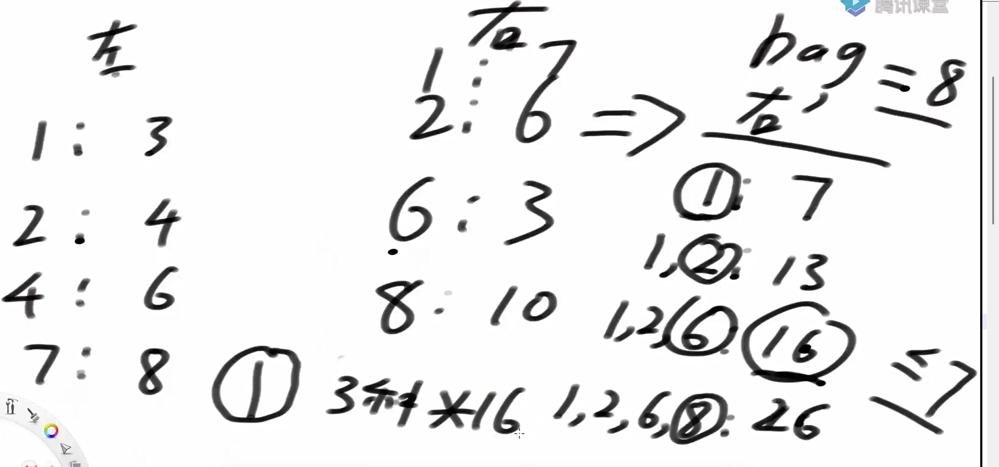

可以保证方法不被重算

问题三：

卡特兰数

卡特兰数又称卡塔兰数，英文名Catalan number，是组合数学中一个常出现在各种计数问题中出现的数列。其前几项为：1, 1, 2, 5, 14, 42, 132, 429, 1430, 4862, 16796, 58786, 208012, 742900, 2674440, 9694845, 35357670, 129644790, 477638700, 1767263190, 6564120420, 24466267020, 91482563640, 343059613650, 1289904147324, 4861946401452, ...

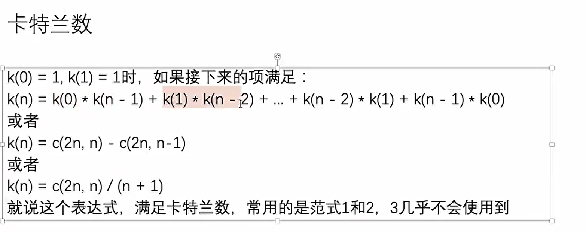

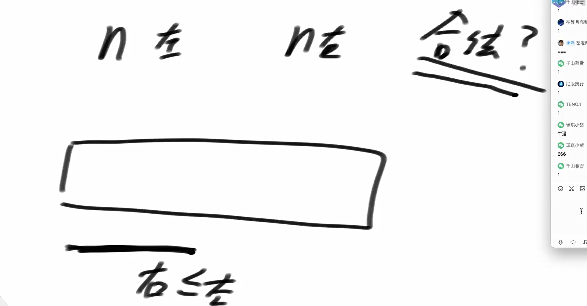

如何判断a和b集合是否相等

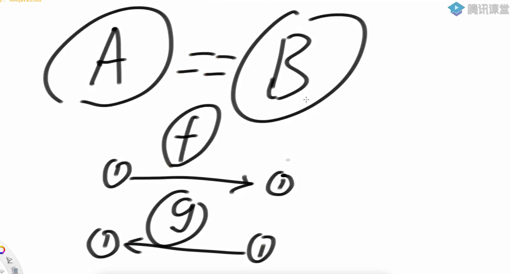

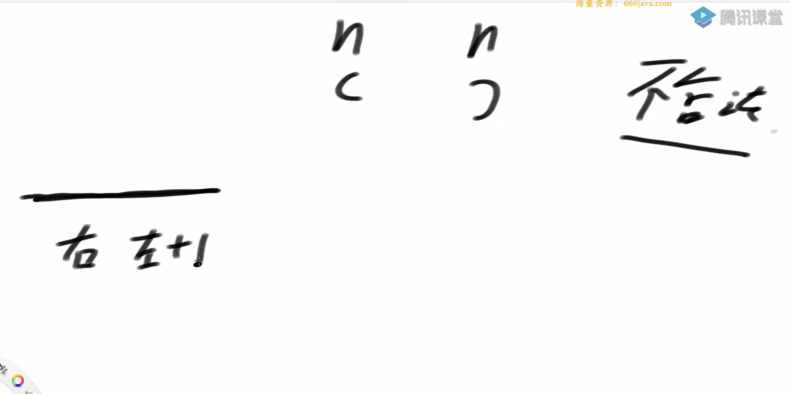

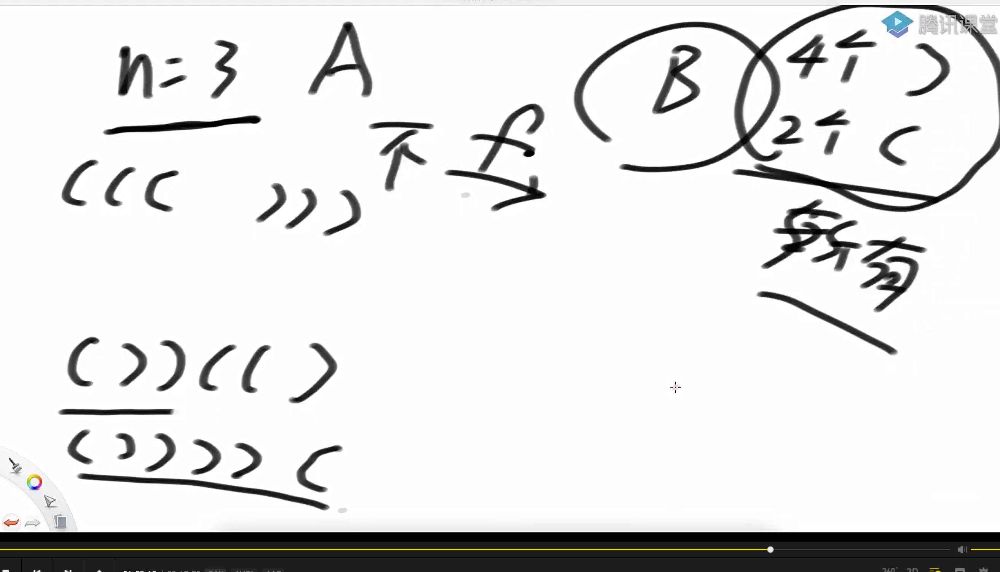

由于a集合和b集合存在相互且唯一的一一映射的关系，所以a集合和b集合相等

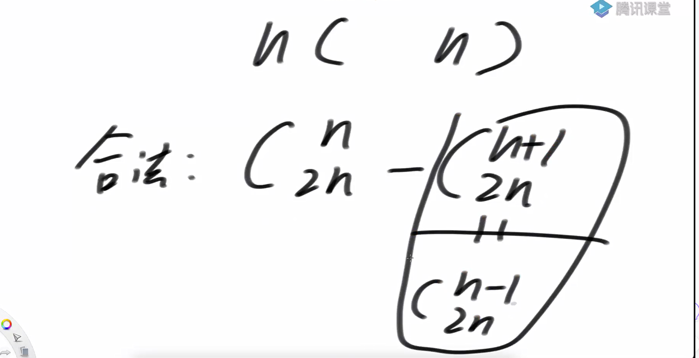

如何计算合法的数量

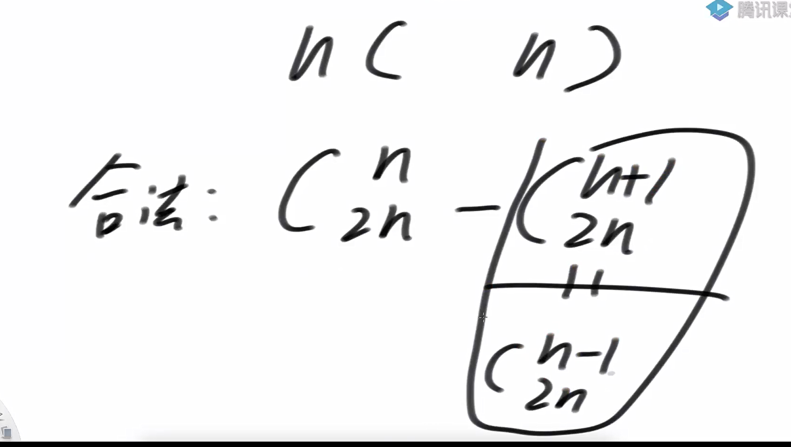

进出栈方法数

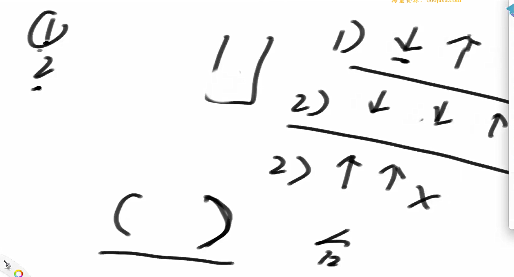

新的划分下的方法数

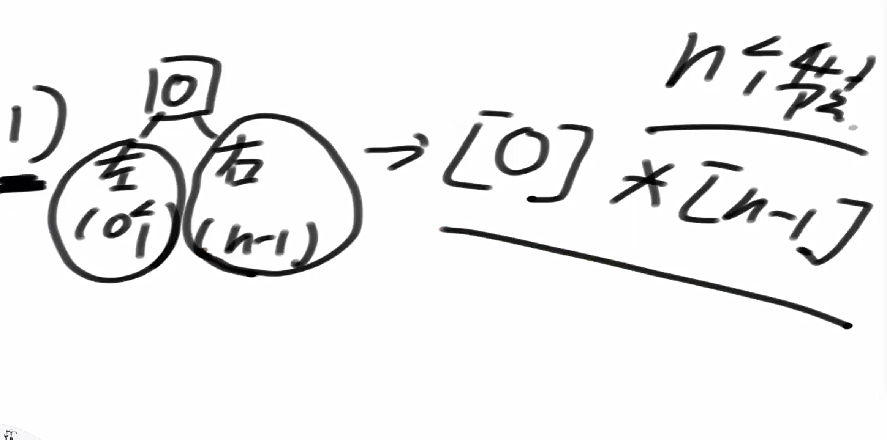

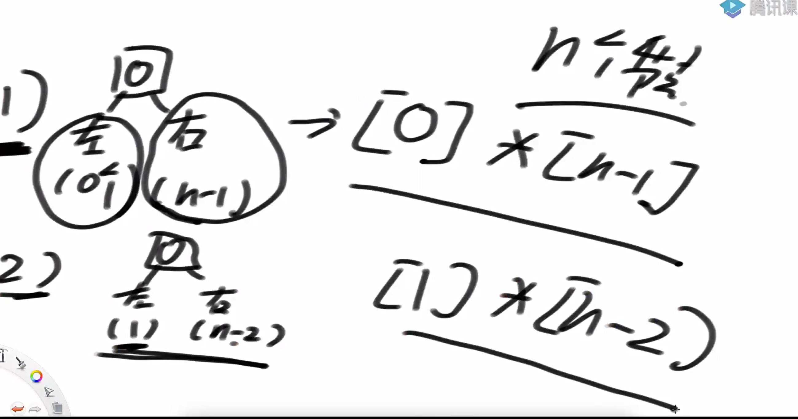

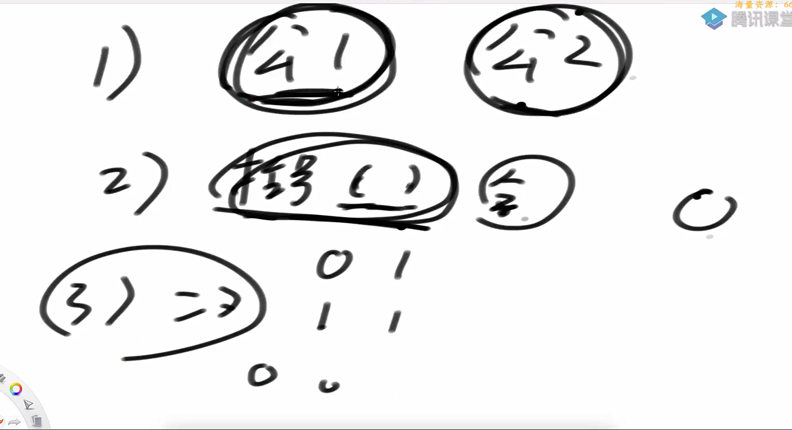

数量关系

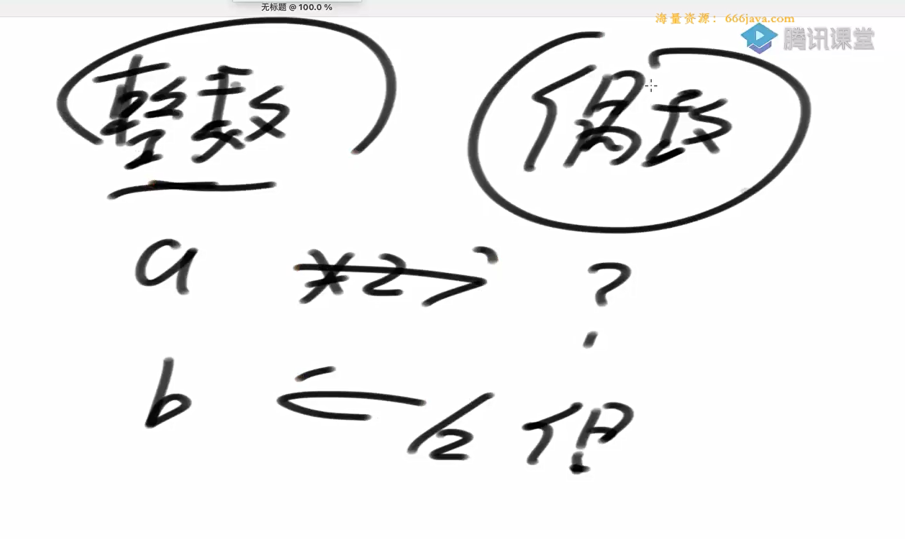

二叉树量的划分

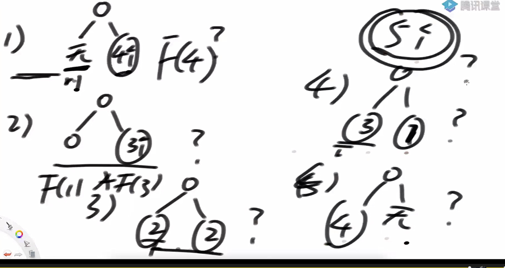