**问题一：**

给定一个**正整数**组成的无序数组arr，给定一个正整数值K

找到arr的所有子数组里，哪个子数组（注意其连续性）的累加和等于K，并且是长度最大的返回其长度

滑动窗口解法

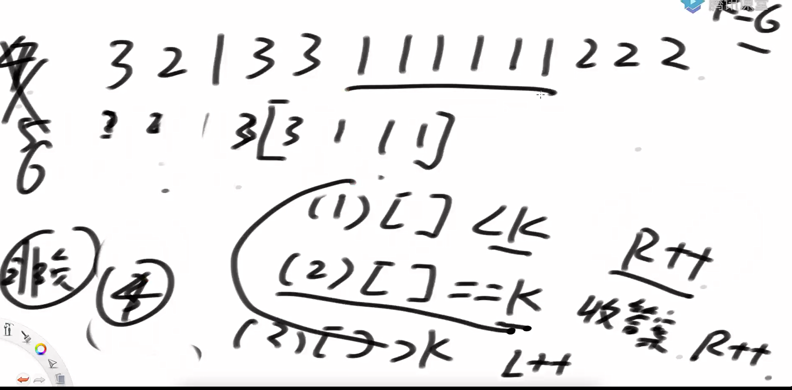

其计算逻辑是定一议二（注意，数组是非负的）

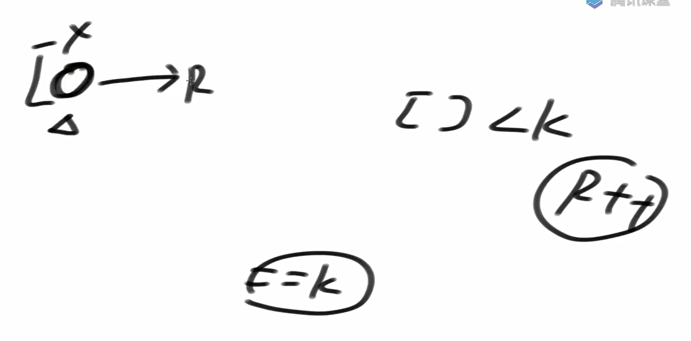

窗口能解决的问题一定有某种单调性

```java
package class40;

public class code01_LongestSumSubArrayLengthInPositiveArray {


    public static int getMaxLength(int[] arr, int K){
        if (arr == null || arr.length == 0 || K < 0){
            return 0;
        }
        int left = 0;
        int right = 0;
        int sum = arr[0];
        int maxLen = 0;
        while (right < arr.length){
            if (sum == K){
                maxLen = Math.max(maxLen, right - left + 1);
                sum -= arr[left++];
            }else if (sum < K){
                right++;
                if (right == arr.length){
                    break;
                }
                sum += arr[right];
            }else{
                sum -= arr[left++];
            }
        }
        return maxLen;
    }

    // for test
    public static int right(int[] arr, int K) {
        int max = 0;
        int[] sums = new int[arr.length + 1];

        for (int i = 0; i < arr.length; i++){
            sums[i + 1] = sums[i] + arr[i];
        }

        for (int i = 0; i < arr.length; i++) {
            for (int j = i; j < arr.length; j++) {
                if (valid(sums, i, j, K)) {
                    max = Math.max(max, j - i + 1);
                }
            }
        }
        return max;
    }

    // for test
    public static boolean valid(int[] arr, int L, int R, int K) {
        int sum = arr[R + 1] - arr[L];
        return sum == K;
    }

    // for test
    public static int[] generatePositiveArray(int size, int value) {
        int[] ans = new int[size];
        for (int i = 0; i != size; i++) {
            ans[i] = (int) (Math.random() * value) + 1;
        }
        return ans;
    }

    // for test
    public static void printArray(int[] arr) {
        for (int i = 0; i != arr.length; i++) {
            System.out.print(arr[i] + " ");
        }
        System.out.println();
    }

    public static void main(String[] args) {
        int len = 50;
        int value = 100;
        int testTime = 500000;
        System.out.println("test begin");
        for (int i = 0; i < testTime; i++) {
            int[] arr = generatePositiveArray(len, value);
            int K = (int) (Math.random() * value) + 1;
            int ans1 = getMaxLength(arr, K);
            int ans2 = right(arr, K);
            if (ans1 != ans2) {
                System.out.println("Oops!");
                printArray(arr);
                System.out.println("K : " + K);
                System.out.println(ans1);
                System.out.println(ans2);
                break;
            }
        }
        System.out.println("test end");
    }
}

```

**问题二：**

给定一个整数组成的无序数组arr，值可能正、可能负、可能0

给定一个整数值K。找到arr的所有子数组里，哪个子数组的累加和等于K，并且是长度最大的返回其长度

需要注意的是：没有单调性就没有窗口法

看到子数组要用：定一议二

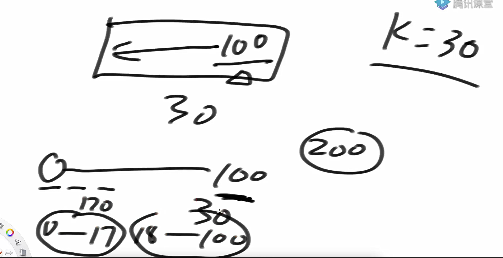

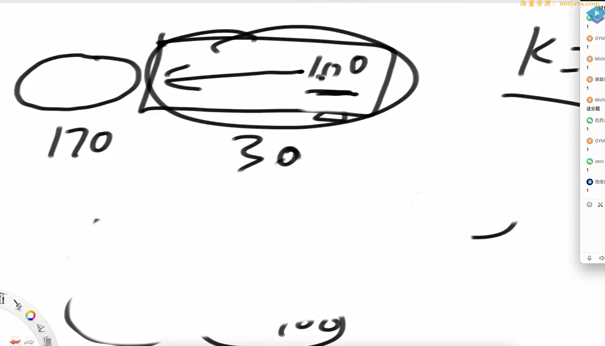

判断哪一个子数组是最早出现170的，就可以知道一100结尾（索引）的最长的子数组

解题思路:

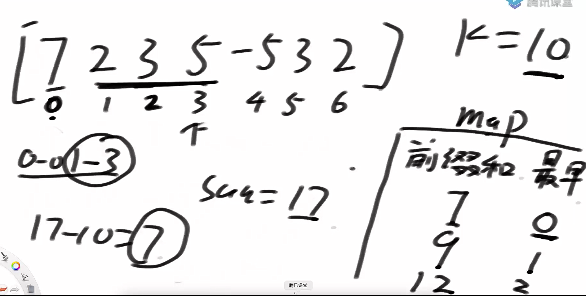

特殊情况的处理。

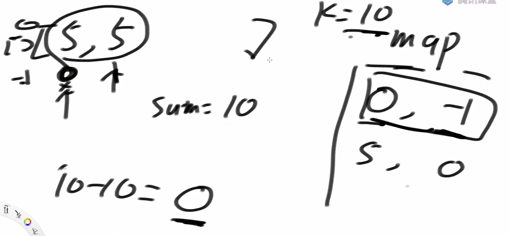

代码实现

```java
package class40;

import java.util.HashMap;

public class code02_LongestSumSubArrayLength {

    public static int maxLength(int[] arr, int k){
        if (arr == null || arr.length == 0 || k < 0) {
            return 0;
        }

        HashMap<Integer, Integer> map = new HashMap<>();
        map.put(0, -1);
        int len = 0;
        int sum = 0;
        for (int i = 0; i < arr.length; i++){
            sum += arr[i];
            if (map.containsKey(sum - k)){
                len = Math.max(len,i - map.get(sum - k));
            }
            if (!map.containsKey(sum)){
                map.put(sum, i);
            }
        }
        return len;
    }

    public static int right(int[] arr, int k){
        if (arr == null || arr.length == 0 || k < 0) {
            return 0;
        }
        int[] sums = new int[arr.length + 1];
        for (int i = 0; i < arr.length; i++){
            sums[i + 1] = sums[i] + arr[i];
        }

        int len = 0;
        for (int i = 0; i < arr.length ;i++){
            for (int j = i; j < arr.length; j++){
                if (valid(sums, i, j, k)){
                    len = Math.max(len, j - i + 1);
                }
            }
        }
        return len;
    }

    public static boolean valid(int[] arr, int L, int R, int K){
        int sums = arr[R+1] - arr[L];
        return sums == K;
    }

    // for test
    public static int[] generateRandomArray(int size, int value) {
        int[] ans = new int[(int) (Math.random() * size) + 1];
        for (int i = 0; i < ans.length; i++) {
            ans[i] = (int) (Math.random() * value) - (int) (Math.random() * value);
        }
        return ans;
    }

    // for test
    public static void printArray(int[] arr) {
        for (int i = 0; i != arr.length; i++) {
            System.out.print(arr[i] + " ");
        }
        System.out.println();
    }

    public static void main(String[] args) {
        int len = 50;
        int value = 100;
        int testTime = 500000;

        System.out.println("test begin");
        for (int i = 0; i < testTime; i++) {
            int[] arr = generateRandomArray(len, value);
            int K = (int) (Math.random() * value) - (int) (Math.random() * value);
            int ans1 = maxLength(arr, K);
            int ans2 = right(arr, K);
            if (ans1 != ans2) {
                System.out.println("Oops!");
                printArray(arr);
                System.out.println("K : " + K);
                System.out.println(ans1);
                System.out.println(ans2);
                break;
            }
        }
        System.out.println("test end");

    }
}

```

**问题三：**

给定一个整数组成的无序数组arr，值可能正、可能负、可能0

给定一个整数值K，找到arr的所有子数组里，哪个子数组的累加和<=K，并且是长度最大的，返回其长度

操作方法

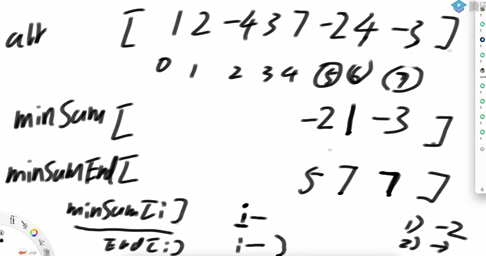

根据依赖顺序（由于要求的是从i位置开始，往右扩的位置，那么说明i位置依赖的是i+1位置的信息，所以从右往左扩） 所以从右往左

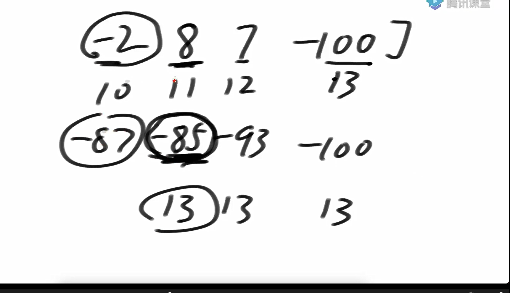

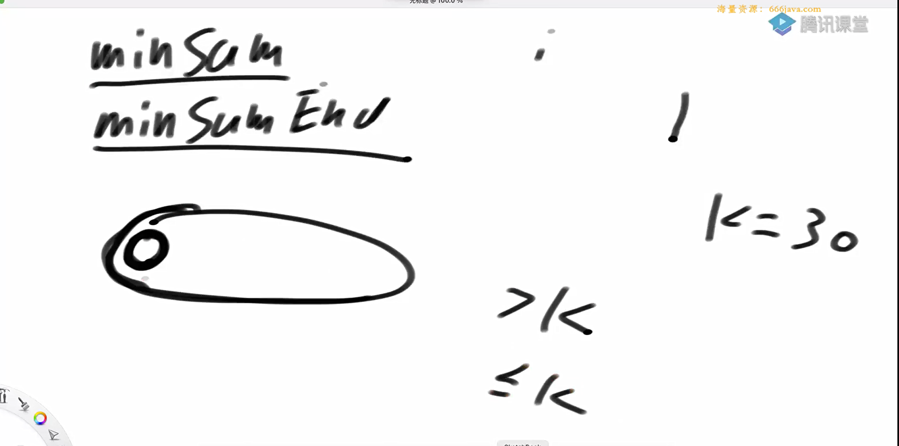

以0开始扩到最右的累加和 > K，那么说明以0开始的任何累加和都不会 <= k。这是由于minSum的性质决定的。

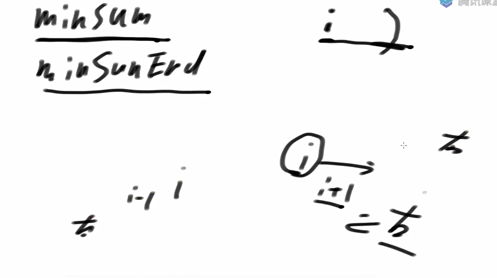

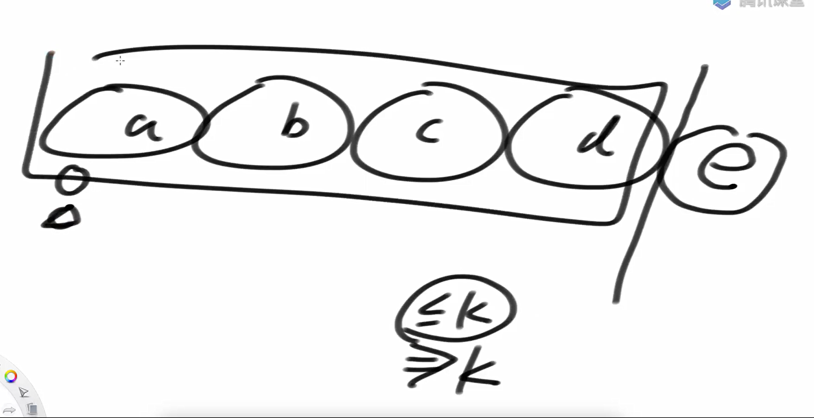

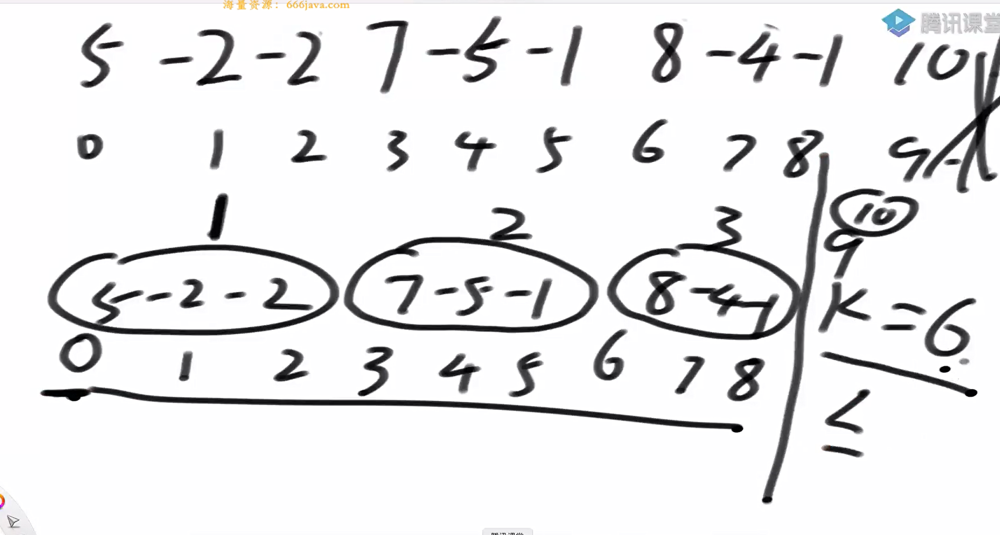

如果采用下面这种方式（也就导致O（N^2））

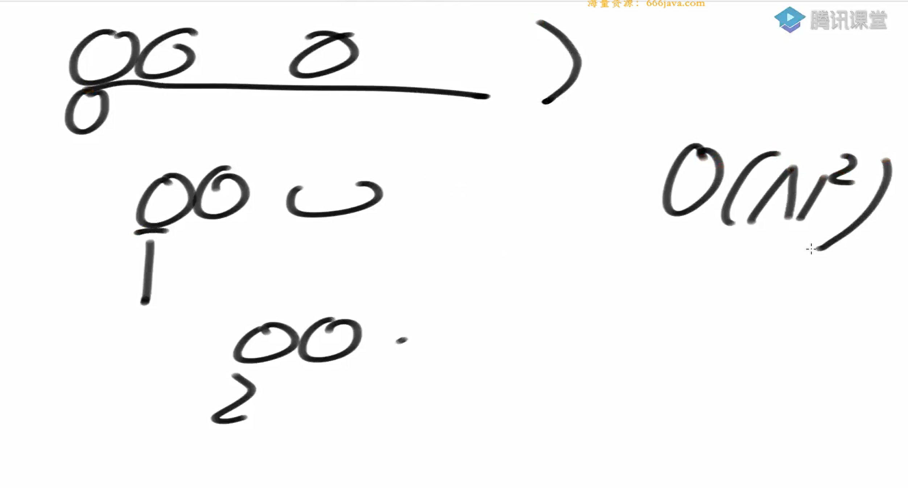

那么如何保证不会退呢？

当

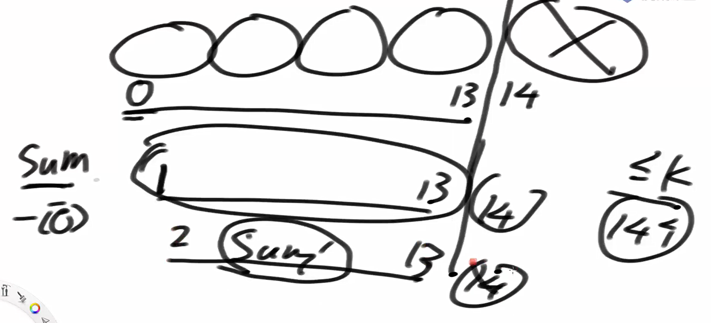

加入0到13满足了条件。为了保证不会退，可以收回0位置在sum（0~14）的累加和，然后看新的sum（1~13）的累加和是否可以将14吸进来.这样就保证了窗口不回退

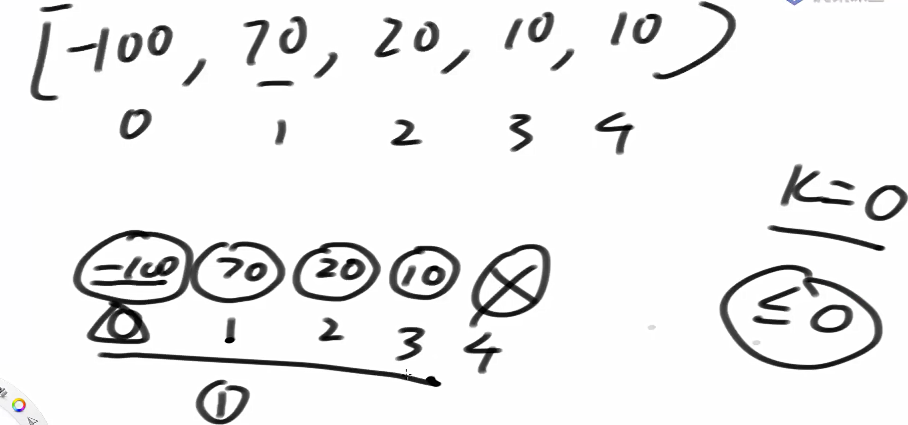

如果舍弃0位置之后，sum（1， 3）中也可能有满足要求的，但由于已经获得了sum（1,4）的较大值，那么，就可以将这部分的可能性舍弃

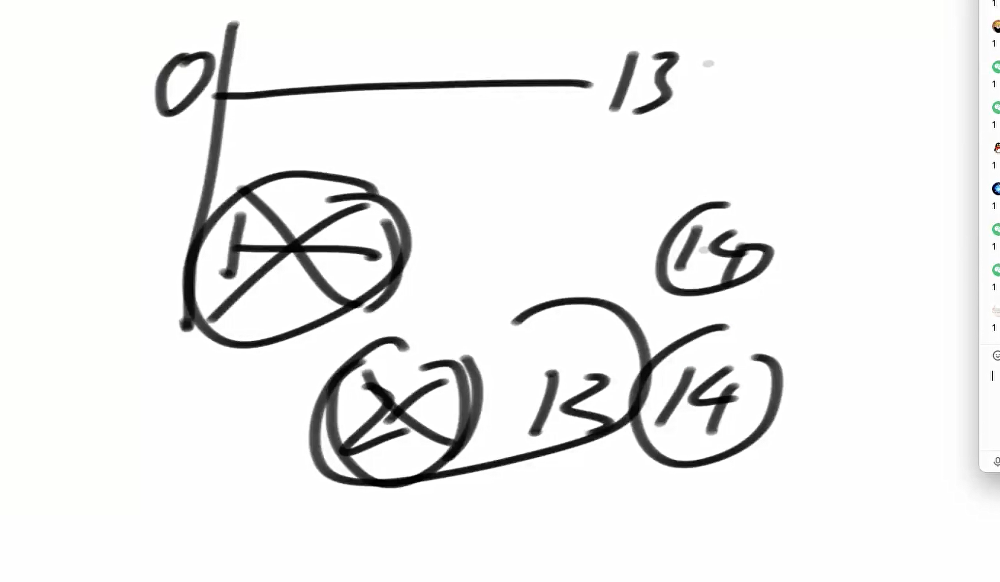

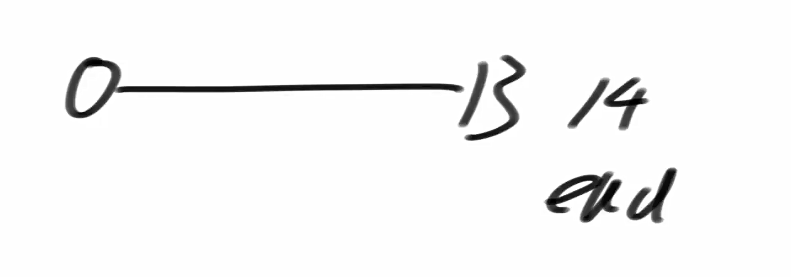

minSums 数组：这个数组用来存储从当前位置i到数组末尾之间所有元素组成的子数组的最小累加和。换句话说，对于每一个位置** i，minSums[i] **表示从** i** 到数组末尾这段范围内能够找到的具有最小累加和的连续子数组的**和**。这有助于快速确定某个位置开始的子数组是否可以扩展到更远的位置而不超过给定的限制 k。

minSumEnds 数组：这个数组与** minSums** 配合使用，记录了对于每个位置** i，**上述最小累加和对应的子数组结束的位置（即最远的索引）。这意味着 **minSumEnds[i] **存储的是取得** minSums[i] **这个最小累加和时的子数组的最后一个元素的位置。通过这种方式，算法可以在后续步骤中迅速跳过那些不会影响最终结果的元素。

边界部分

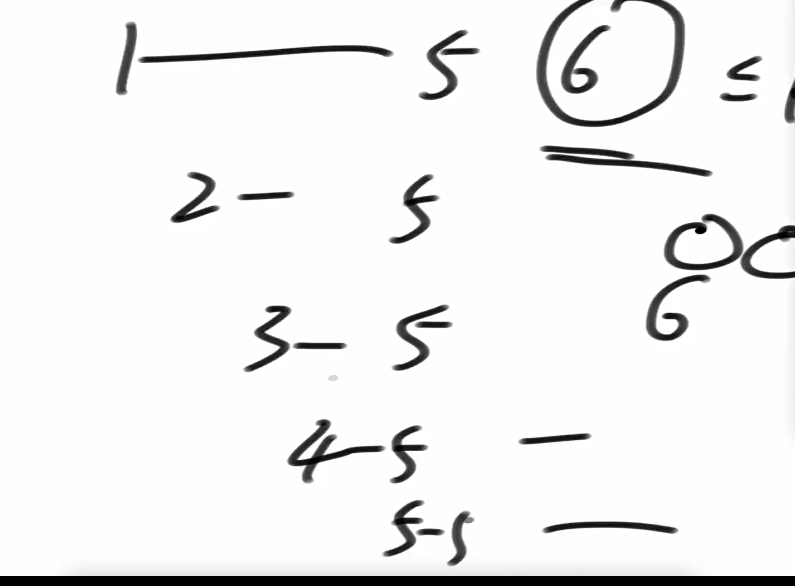

我的理解：

我知道了 minSums的操作是，如果当前位置i向右扩，能够使得累加值降低，那么就向右扩直到不能扩并记录en，这样做的目的是假如先定下i位开始位置，那么从minSumEnd中可以得到向右扩最大的最小的累加和，如果这个累加和 <= k， 那么就继续使用minSumEnd确定累加和最小而长度最大的地方。这样就实现窗口不断向右移动的操作

边界的设置

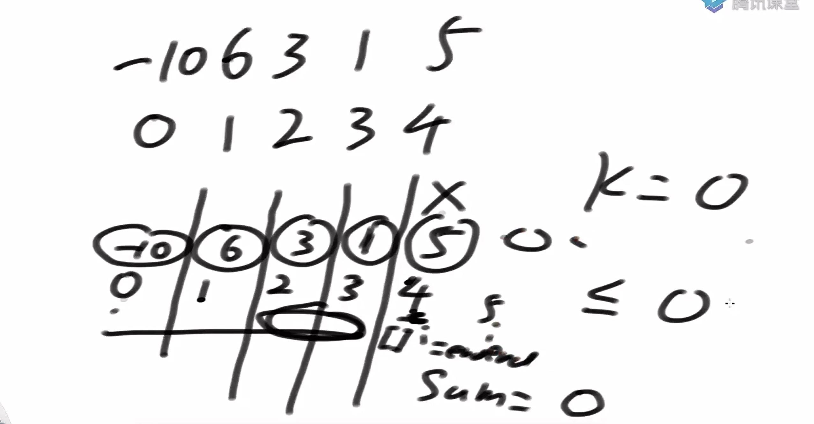

这个是O（N * logN）的算法的h数组为什么是单调非递减的设置

假设要找的是preFixSum中第一个大于等于target的索引。我想要找到prefixSum中大于num的第一个位置，由于prefixSum可能为负数，而产生跳变也是就preFixSum只跟第一次遇到数num比以往的数更大（其中以往的数都小于target）而假设遇到num的时候刚好比target大，那么当前的索引index就是满足条件的索引。

前缀和数组为什么要从零开始？

为了简化计算

```
sum(arr[i..j]) = prefixSum[j+1] - prefixSum[i]
i 是起点（包含）
j 是终点（包含）
j+1 是前缀和数组的索引

arr[1..3] 的和 = prefixSum[4] - prefixSum[1] = 0 - 3 = -3 ✅
```

sum(arr[i..j]) = prefixSum[j+1] - prefixSum[i]

任何一个sum都可以通过前缀和相减得到结果。

还有一件事是为什么要怎么操作假设j是固定的，prefixSum[j+1] - prefixSum[pre] >= k 。

其中sum(arr[pre..j]) = prefixSum[j+1] - prefixSum[pre]， 为了pre和j尽可能的远，需要在固定j的前提下让pre尽可能的远

当j是固定的时候，prefixsum[pre] >= k - prefixSum[j+1] = num

所以我们要找到prefixsum中第一个大于等于num的数。

由于prefixsum可能有负数，所以将其改为h数组

为什么用h数组？

假设要找的是preFixSum中第一个大于等于target的索引。我想要找到prefixSum中大于num的第一个位置，由于prefixSum可能为负数，而产生跳变也是就preFixSum只跟第一次遇到数num比以往的数更大（其中以往的数都小于target）而假设遇到num的时候刚好比target大，那么当前的索引index就是满足条件的索引。

代码实现

```java
package class40;

public class code03_LongestLessSumSubArrayLength {


    //    假设要找的是preFixSum中第一个大于等于target的索引。我想要找到prefixSum中大于num的第一个位置，
//    由于prefixSum可能为负数，而产生跳变也是就preFixSum只跟
//    第一次遇到数num比以往的数更大（其中以往的数都小于target）
//    而假设遇到num的时候刚好比target大，那么当前的索引index就是满足条件的索引。
    public static int maxLength1(int[] arr, int k){
        int[] h = new int[arr.length + 1];
        int sum = 0;
        h[0] = 0;
//        sum(arr[i..j]) = prefixSum[j+1] - prefixSum[i]
//        任何一个sum都可以通过前缀和相减得到结果。
        for (int i = 0; i < arr.length; i++){
            sum += arr[i];
            h[i + 1] = Math.max(sum, h[i]);
        }

        sum = 0;
        int res = 0;
        int pre = 0;
        int len = 0;

        for (int i = 0; i < arr.length; i++){
            sum += arr[i];
            pre = getLessIndex(h, sum - k);
            len = pre == -1? 0 : i - pre + 1;
            res = Math.max(res, len);
        }
        return res;
    }

    public static int getLessIndex(int[] arr, int num){
        int low = 0;
        int height = arr.length - 1;
        int mid = 0;
        int res = -1;
        while (low <= height){
            mid = (low + height) / 2;
            if (arr[mid] >= num){
                res = mid;
                height = mid - 1;
            }else{
                low = mid + 1;
            }
        }
        return res;
    }

   public static int maxLength2(int[] arr, int K){
        int[] minSums = new int[arr.length];
        int[] minSumsEnds = new int[arr.length];

        minSums[arr.length - 1] = arr[arr.length - 1];
        minSumsEnds[arr.length - 1] = arr.length - 1;

        for (int i = arr.length -2; i >= 0; i--){
            if (minSums[i + 1] < 0){
                minSums[i] = arr[i] + minSums[i + 1];
                minSumsEnds[i] = minSumsEnds[i + 1];
            }else{
                minSums[i] = arr[i];
                minSumsEnds[i] = i;
            }
        }

        int end = 0;
        int sum = 0;
        int ans = 0;

        for (int i = 0; i < arr.length; i++){

            while (end < arr.length && sum + minSums[end] <= K){
                sum += minSums[end];
                end = minSumsEnds[end] + 1;
            }
            ans = Math.max(ans, end - i);
            if (end > i){
                sum -= arr[i];
            }else{
                end = i + 1;
            }
        }
        return ans;
   }

    // for test
    public static int[] generateRandomArray(int len, int maxValue) {
        int[] res = new int[len];
        for (int i = 0; i != res.length; i++) {
            res[i] = (int) (Math.random() * maxValue) - (maxValue / 3);
        }
        return res;
    }

    public static void main(String[] args) {
        System.out.println("test begin");
        for (int i = 0; i < 10000000; i++) {
            int[] arr = generateRandomArray(10, 20);
            int k = (int) (Math.random() * 20) - 5;
            if (maxLength1(arr, k) != maxLength2(arr, k)) {
                System.out.println("Oops!");
            }
        }
        System.out.println("test finish");
    }
}

```

**问题四：**

给定一个数组 arr，给定一个值 v。求子数组平均值小于等于 v 的最长子数组长度。

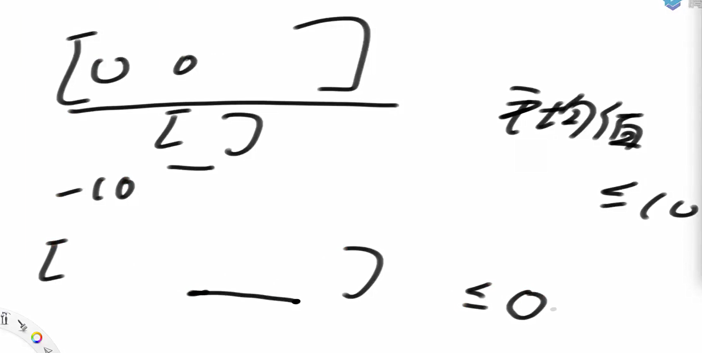

子数组总和/子数组长度 <= V

子数组总和  - v * 子数组长度 <= 0

子数组每个值-v <= 0 

代码实现

```java
package class40;

public class code04_AvgLessEqualValueLongestSubarray {
    //对数器

    public static int ways1(int[] arr, int v){

        int[] sums = new int[arr.length + 1];
        for (int i = 0; i < arr.length; i++){
            sums[i + 1] = arr[i] + sums[i];
        }

        int ans = 0;
        for (int L = 0; L < arr.length; L++){
            for (int R = L; R < arr.length; R++){
                int sum = 0;
                int k = R - L + 1;
                sum = sums[R + 1] - sums[L];
                double avg = (double) sum / (double) k;
                if (avg <= v) {
                    ans = Math.max(ans, k);
                }
            }
        }
        return ans;
    }


    public static int ways3(int[] arr, int v){
        if (arr == null || arr.length == 0){
            return 0;
        }

        for (int i = 0; i < arr.length; i++){
            arr[i] -= v;
        }

        return maxLength(arr, 0);
    }

    public static int maxLength(int[] arr, int k){
        if (arr == null || arr.length == 0 || k < 0){
            return 0;
        }
        int[] minSums = new int[arr.length];
        int[] minSumEnds = new int[arr.length];

        minSums[arr.length - 1] = arr[arr.length - 1];
        minSumEnds[arr.length - 1] = arr.length - 1;

        for (int i = arr.length - 2; i >= 0; i--){
            if (minSums[i + 1] < 0){
                minSums[i] = arr[i] + minSums[i + 1];
                minSumEnds[i] = minSumEnds[i + 1];
            }else{
                minSums[i] = arr[i];
                minSumEnds[i] = i;
            }
        }

        int end = 0;
        int len = 0;
        int sum = 0;

        for (int i = 0; i < arr.length; i++){

            while (end < arr.length && sum + minSums[end] <= k){
                sum += minSums[end];
                end = minSumEnds[end] + 1;
            }
            len = Math.max(len, end - i);

            if (end > i){
                sum -= arr[i];
            }else{
                end = i+1;
            }
        }
        return len;
    }

    // 用于测试
    public static int[] randomArray(int maxLen, int maxValue) {
        int len = (int) (Math.random() * maxLen) + 1;
        int[] ans = new int[len];
        for (int i = 0; i < len; i++) {
            ans[i] = (int) (Math.random() * maxValue);
        }
        return ans;
    }

    // 用于测试
    public static int[] copyArray(int[] arr) {
        int[] ans = new int[arr.length];
        for (int i = 0; i < arr.length; i++) {
            ans[i] = arr[i];
        }
        return ans;
    }

    // 用于测试
    public static void printArray(int[] arr) {
        for (int i = 0; i < arr.length; i++) {
            System.out.print(arr[i] + " ");
        }
        System.out.println();
    }

    // 用于测试
    public static void main(String[] args) {
        System.out.println("测试开始");
        int maxLen = 20;
        int maxValue = 100;
        int testTime = 500000;
        for (int i = 0; i < testTime; i++) {
            int[] arr = randomArray(maxLen, maxValue);
            int value = (int) (Math.random() * maxValue);
            int[] arr1 = copyArray(arr);
            int[] arr2 = copyArray(arr);
            int[] arr3 = copyArray(arr);
            int ans1 = ways1(arr1, value);
            int ans3 = ways3(arr3, value);
            if (ans1 != ans3) {
                System.out.println("测试出错！");
                System.out.print("测试数组：");
                printArray(arr);
                System.out.println("子数组平均值不小于 ：" + value);
                System.out.println("方法1得到的最大长度：" + ans1);
                System.out.println("方法3得到的最大长度：" + ans3);
                System.out.println("=========================");
                break;
            }
        }
        System.out.println("测试结束");
    }
}

```

总结：

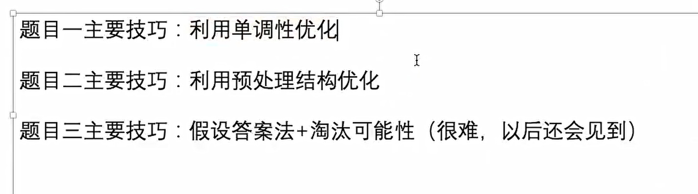

**问题五:**

按顺时针螺旋顺序打印一个二维矩阵的所有元素。

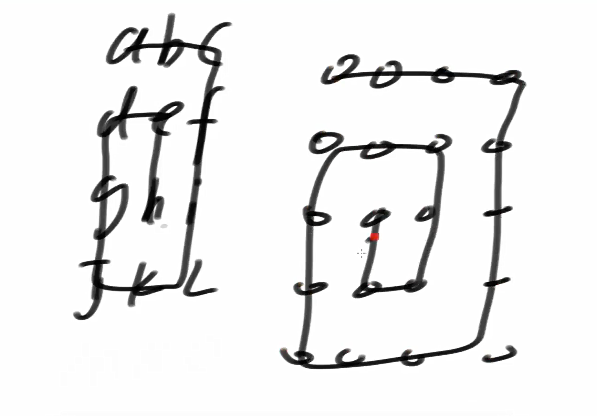

```
int[][] matrix = {
    { 1, 2, 3, 4 },
    { 5, 6, 7, 8 },
    { 9, 10, 11, 12 },
    {13, 14, 15, 16 }
};
```

输出

```java
1 2 3 4 8 12 16 15 14 13 9 5 6 7 11 10 
```

主要方法是确定没轮打印矩阵的边界

比如(tR++, tC++, dR--, dC--) 范围是tR <= dR && tC <= dC

```java
package class40;

import java.util.Random;

public class code05_PrintMatrixSpiralOrder {

    public static void printatrixSpiralOrder1(int[][] matrix){
        int tR = 0;
        int tC = 0;
        int dR = matrix.length - 1;
        int dC = matrix[0].length - 1;
        while (tR <= dR && tC <= dC) {
            printEdge(matrix, tR++, tC++, dR--, dC--);
        }
    }

    public static void printEdge(int[][] matrix, int tR, int tC, int dR, int dC){

        if (tR == dR){
            for (int i = tC; i <= dC; i++){
                System.out.print(matrix[tR][i] + " ");
            }
        }else if (tC == dC){
            for (int i = tR; i <= dR; i++){
                System.out.print(matrix[i][tC] +" ");
            }
        }else{
            int curC = tC;
            int curR = tR;
            while (curC != dC){
                System.out.print(matrix[curR][curC] + " ");
                curC++;
            }
            while (curR != dR){
                System.out.print(matrix[curR][curC] + " ");
                curR++;
            }
            while (curC != tC){
                System.out.print(matrix[curR][curC] + " ");
                curC--;
            }
            while (curR != tR){
                System.out.print(matrix[curR][curC] + " ");
                curR--;
            }
        }
    }
    // 随机生成矩阵的方法
    public static int[][] randomMatrix(int rows, int cols, int maxValue) {
        Random random = new Random();
        int[][] matrix = new int[rows][cols];
        for (int i = 0; i < rows; i++) {
            for (int j = 0; j < cols; j++) {
                matrix[i][j] = random.nextInt(maxValue); // 生成从0到maxValue-1之间的随机整数
            }
        }
        return matrix;
    }


    // 打印矩阵的方法
    public static void printMatrix(int[][] matrix) {
        for (int[] row : matrix) {
            for (int val : row) {
                System.out.printf("%3d ", val);
            }
            System.out.println();
        }
    }
    public static void main(String[] args) {
        // 定义矩阵的行数和列数
        int rows = 4; // 可以根据需要更改
        int cols = 5; // 可以根据需要更改

        // 随机生成矩阵
        int[][] matrix = randomMatrix(rows, cols, 100); // 100是每个元素的最大值

        // 打印原始矩阵
        System.out.println("Original Matrix:");
        printMatrix(matrix);

        // 按顺时针螺旋顺序打印矩阵
        System.out.println("\nSpiral Order Print:");
        printatrixSpiralOrder1(matrix);
    }
}

```

**问题六：**

矩阵顺时针旋转90度

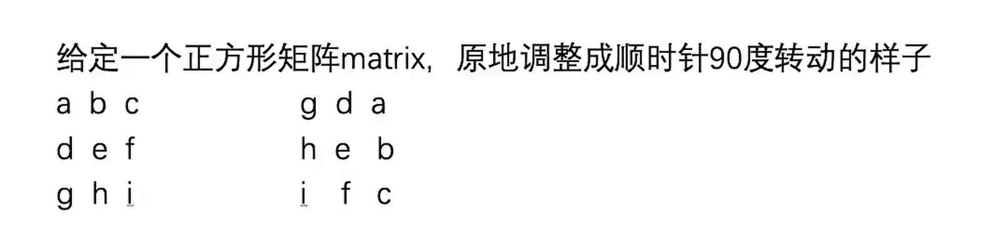

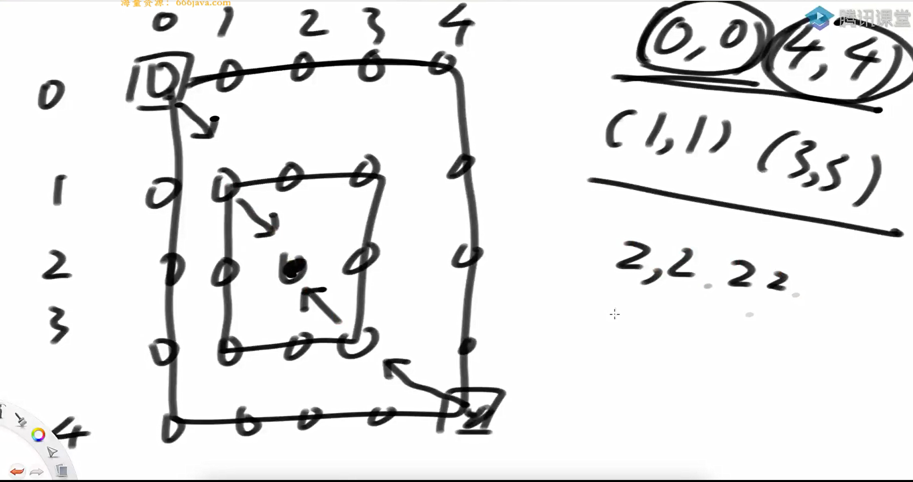

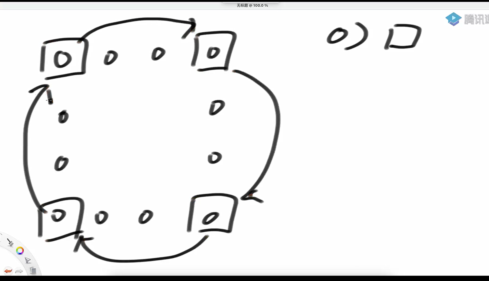

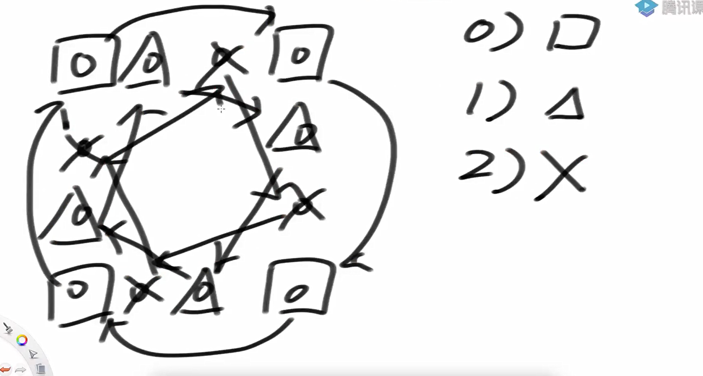

比较核心的部分在确定矩阵的表示之后，找到各个位置变化的关系，然后在抽象化

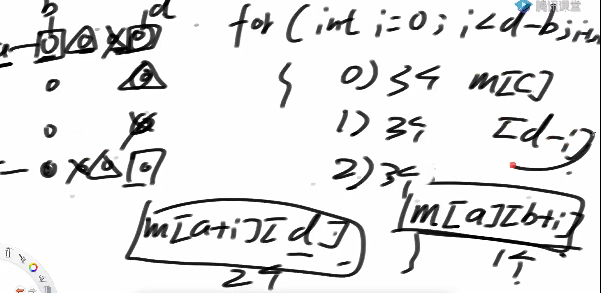

代码实现

```java
package class40;

public class code06_RotateMatrix {
    public static void rotate(int[][] matrix) {
        int a = 0;
        int b = 0;
        int c = matrix.length - 1;
        int d = matrix[0].length - 1;
        while (a < c) {
            rotateEdge(matrix, a++, b++, c--, d--);
        }
    }

    public static void rotateEdge(int[][] matrix, int a, int b, int c, int d){

        for (int i = 0; i < d-b; i++){
            int temp = matrix[a][b + i];
            matrix[a][b + i] = matrix[c - i][b];
            matrix[c - i][b] = matrix[c][d - i];
            matrix[c][d - i] = matrix[a + i][d];
            matrix[a + i][d] = temp;
        }
    }

    public static void printMatrix(int[][] matrix) {
        for (int i = 0; i != matrix.length; i++) {
            for (int j = 0; j != matrix[0].length; j++) {
                System.out.print(matrix[i][j] + " ");
            }
            System.out.println();
        }
    }

    public static void main(String[] args) {
        int[][] matrix = { { 1, 2, 3, 4 }, { 5, 6, 7, 8 }, { 9, 10, 11, 12 }, { 13, 14, 15, 16 } };
        printMatrix(matrix);
        rotate(matrix);
        System.out.println("=========");
        printMatrix(matrix);

    }
}

```

**问题七：**

打印

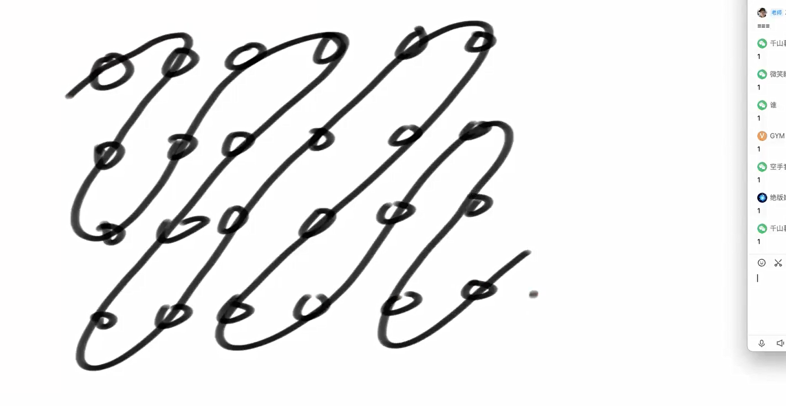

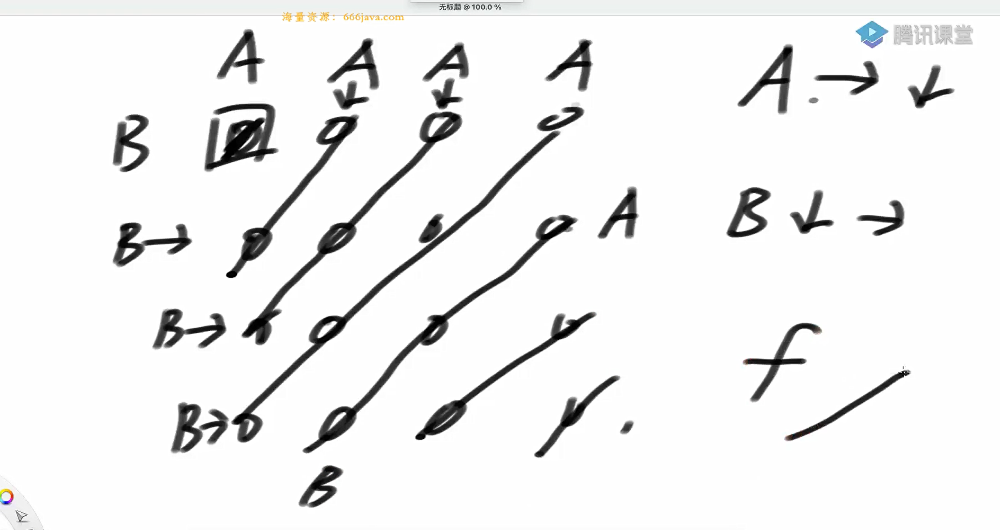

tR, tC：当前层的右上角（起点）

dR, dC：当前层的左下角（终点）

问题八：

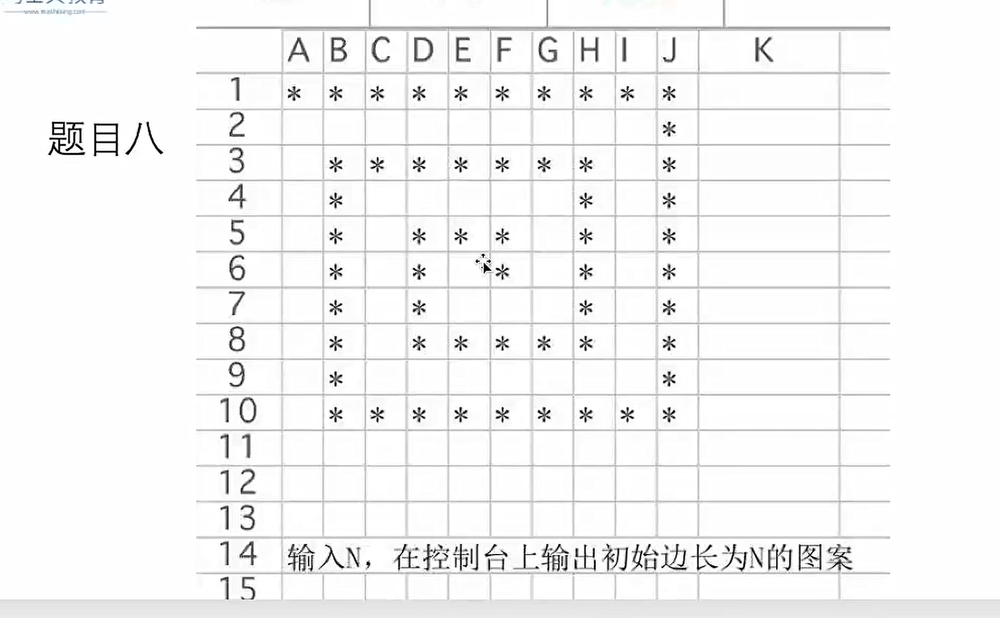

代码实现

```java
package class40;

public class code08_PrintStar {


    public static void printStart(int N){

        char[][] martix = new char[N][N];


        for(int i = 0; i < N; i++){
            for (int j = 0; j < N; j++){
                martix[i][j] = ' ';
            }
        }

        int leftUp = 0;
        int rightDown = N - 1;

        while (leftUp <= rightDown){
            set(martix, leftUp, rightDown);
            leftUp += 2;
            rightDown -= 2;
        }

        for (int i = 0; i < N; i++){
            for (int j = 0; j < N; j++){
                System.out.print(martix[i][j] + " ");
            }
            System.out.println();
        }
    }

    public static void set(char[][] m, int leftUp, int rightDown){
        //从左往右
        for (int col = leftUp; col <= rightDown; col++){
            m[leftUp][col] = '*';
        }
        //从上到下,跳过右面第一个
        for (int row = leftUp + 1; row <= rightDown; row++){
            m[row][rightDown] = '*';
        }
        //从右下往左，跳过右下第一个，截止到left的前一个
        for (int col = rightDown - 1; col >= leftUp + 1; col--){
            m[rightDown][col] = '*';
        }
        //从左下往上,跳过左下第一个
        for (int row = rightDown - 1; row >= leftUp + 2; row--){
            m[row][leftUp + 1] = '*';
        }
    }

    public static void main(String[] args) {
        printStart(20);
    }
}

```

其中最关键的是把leftUp和rightDown定下来。