**问题一**

给定一个**非负数组** arr，长度为 N。那么有 N-1 种方案可以把 arr 切成左右两部分。每一种方案都有：min{左部分累加和, 右部分累加和}

求这么多方案中，min{左部分累加和, 右部分累加和} 的最大值是多少？整个过程要求时间复杂度 O(N)。

最优解思路：

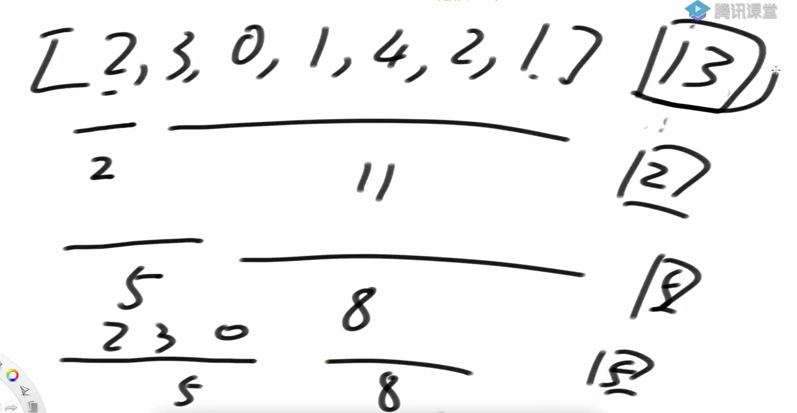

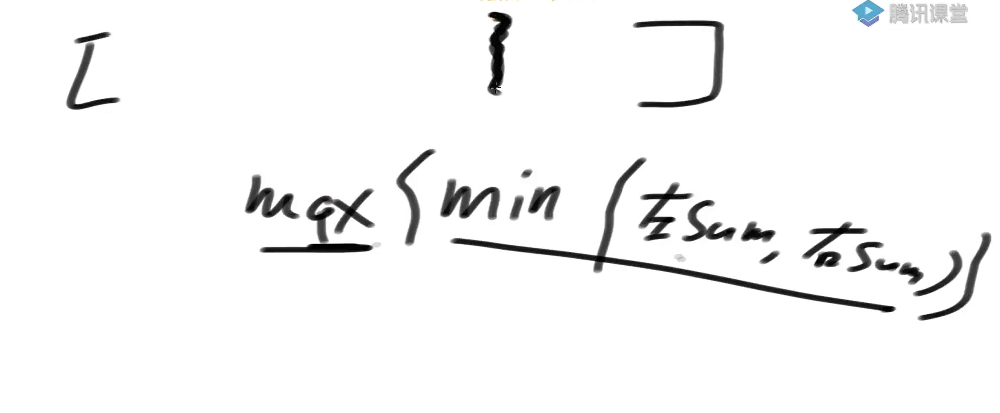

代码实现

```java
package class41;

public class code01_bestSplit1 {

    public static int bestSplit1(int[] arr){
        if (arr == null || arr.length < 2) {
            return 0;
        }
        int N = arr.length;
        int ans = 0;

        for (int s = 0; s < N - 1; s++){
            int sumL = 0;
            for (int i = 0; i <= s; i++){
                sumL += arr[i];
            }

            int sumR = 0;

            for (int j = s + 1; j < N; j++){
                sumR += arr[j];
            }

            ans = Math.max(ans, Math.min(sumL, sumR));
        }

        return ans;
    }

    public static int bestSplit2(int[] arr){
        if (arr == null || arr.length == 0){
            return 0;
        }

        int N = arr.length;
        int sumAll = 0;
        for (int i = 0; i < N; i++){
            sumAll += arr[i];
        }

        int sumL = 0;
        int ans = 0;
        for (int i = 0; i < N - 1; i++){
            sumL += arr[i];
            int sumR = sumAll - sumL;
            ans = Math.max(ans, Math.min(sumL, sumR));
        }
        return ans;
    }

    public static int[] randomArray(int len, int max) {
        int[] ans = new int[len];
        for (int i = 0; i < len; i++) {
            ans[i] = (int) (Math.random() * max);
        }
        return ans;
    }

    public static void main(String[] args) {
        int N = 20;
        int max = 30;
        int testTime = 1000000;
        System.out.println("测试开始");
        for (int i = 0; i < testTime; i++) {
            int len = (int) (Math.random() * N);
            int[] arr = randomArray(len, max);
            int ans1 = bestSplit1(arr);
            int ans2 = bestSplit2(arr);
            if (ans1 != ans2) {
                System.out.println(ans1);
                System.out.println(ans2);
                System.out.println("Oops!");
            }
        }
        System.out.println("测试结束");
    }

}

```

**问题二：**

给定一个数组 arr，对于每一个位置 i（从 0 到 n-1），我们需要找到将数组 arr[0..i] 切分成两部分的所有方案中，使得 min(左部分累加和, 右部分累加和) 最大的那个值，并将这个值记录在结果数组 ans 中。

详细描述

给定一个数组 arr，长度为 N。

对于每一个 range = i（即 arr[0..i] 的子数组），我们有 i 种切分方式（即从 0 到 i-1 的每一个位置 s 作为分割点）。

每次切分后，我们计算：

左边部分的累加和 sumL = arr[0] + ... + arr[s]

右边部分的累加和 sumR = arr[s+1] + ... + arr[i]

取 min(sumL, sumR)，然后在所有切分方案中取最大值。

最终，我们为每个 i 生成一个 ans[i]，表示在 arr[0..i] 的所有切分方式中，最大的 min(sumL, sumR)。

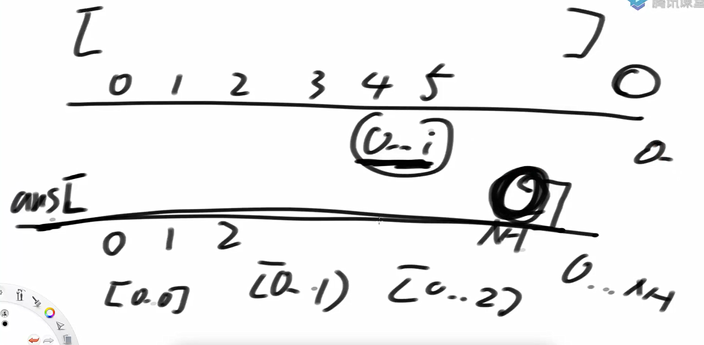

如果可以证明之前的划分点是不会退的，就就可以将复杂度降到O（N）

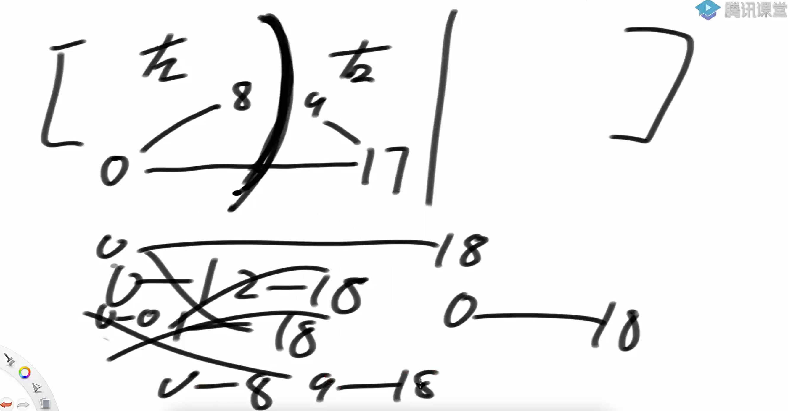

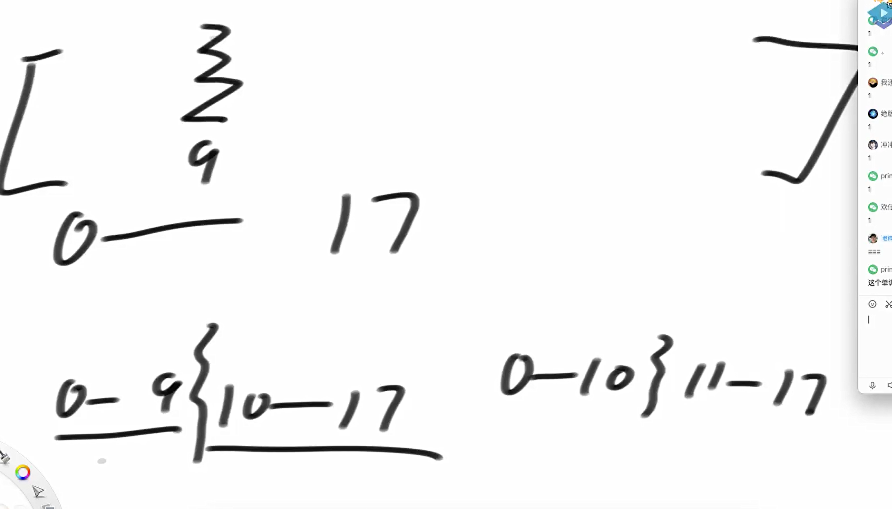

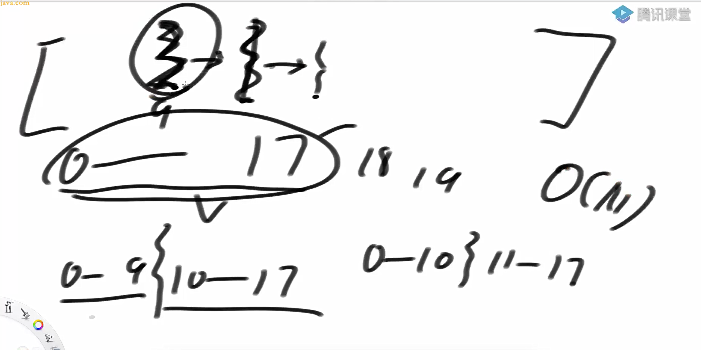

证明i+1不回退


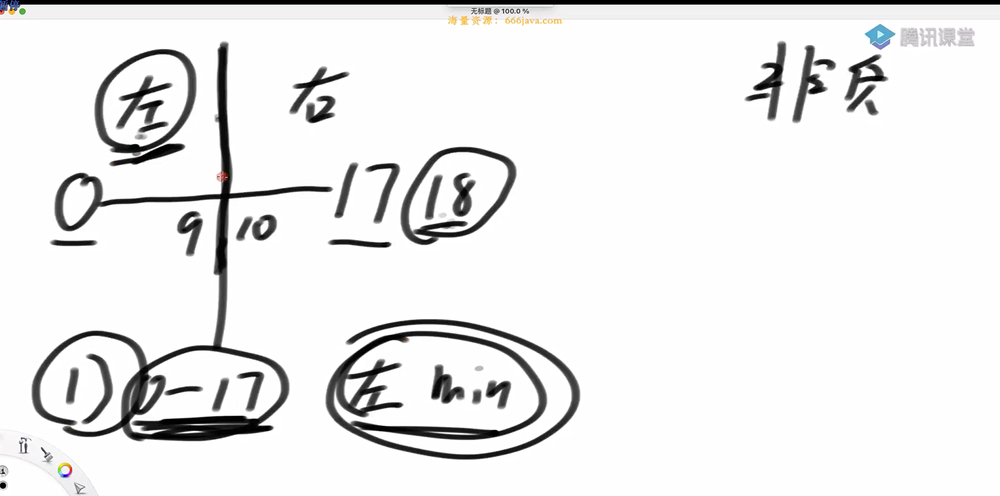

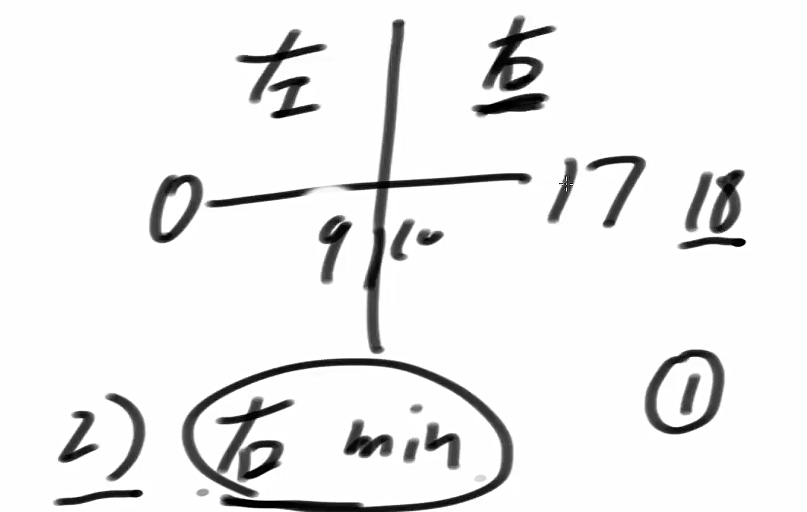

1. 假设在0-17部分，完成了一个划分，划分值在9到10之间。假设瓶颈由左面限制。如果数组扩到18位置的时候，右部分在0-17划分的基础上，如果向左移动，那么瓶颈就更小了，所以划分不会往左移动（我们假设每个区间对应的划分值都是当前区间最优的）

1. 当瓶颈是右部分的时候，当18进入右部分之后

1. 右部分不再是瓶颈，左部分称为瓶颈，那么原来0-17部分划的点，就让左部分称为瓶颈，如果回退，左部分称为瓶颈后（其值变小，不满足条件）

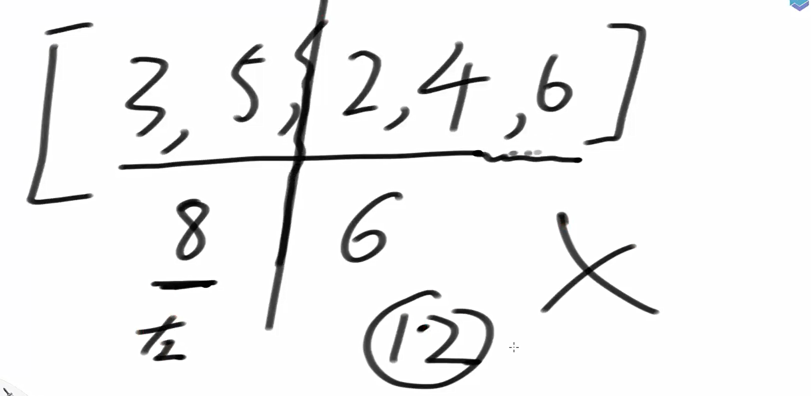

如上，当6来到的时候，5和2之间的划分不用移动

第二种情况，就是当18来到的时候，右部分依然是瓶颈，那么基于0-17的划分点是否需要往左飘？

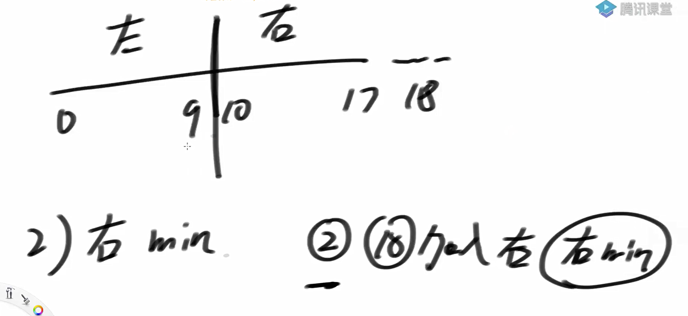

不会退是因为，当初划的部分，就是因为不能回退，所以才划分到那里。所以，当右面继续为min部分的时候，无法回退。

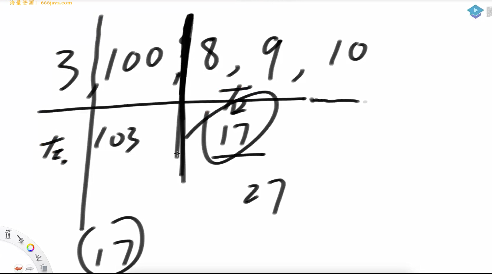

所以，在所有可能性中，满足条件的划分值都不回退

通过对数器确定有时候不需要证明

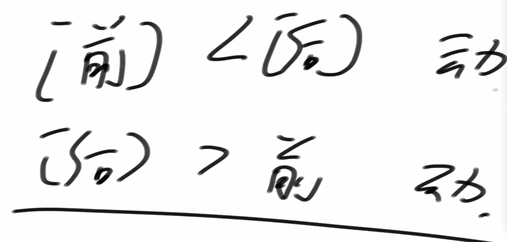

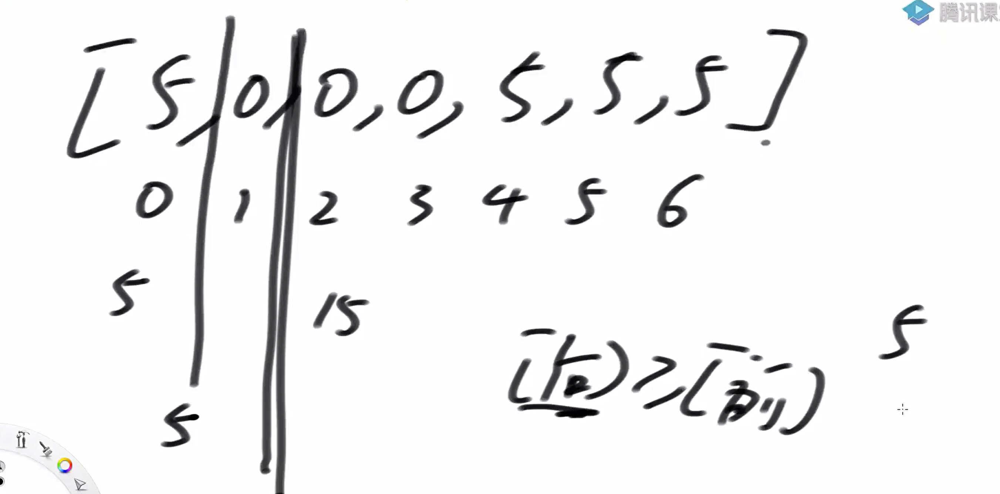

等于的时候一定要动，不然划不下去

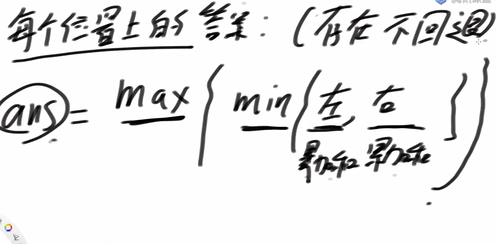

一个思考的方向（可能存在不回退现象）

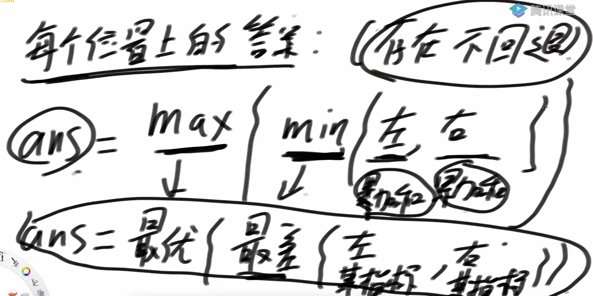

另一种不会退现象

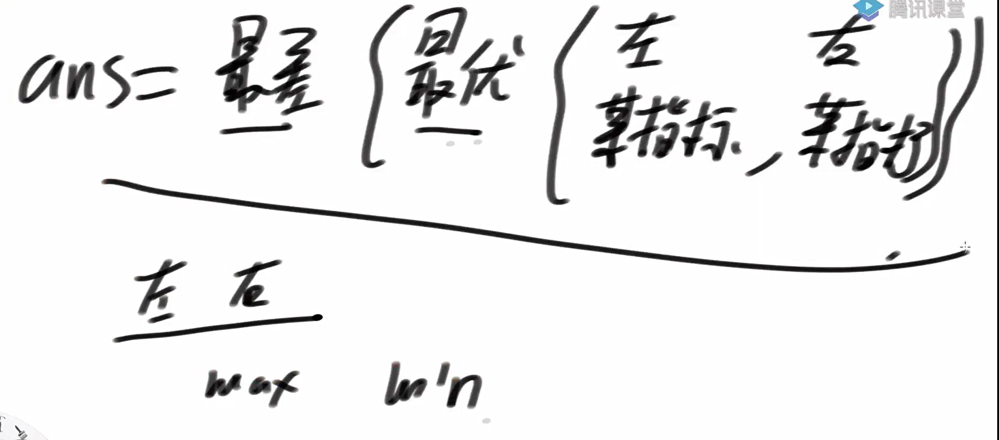

如果我们的条件时，左右各个部分的较大值，如果尽可能的小。

实际情况上来看，划分点依然是不会退的

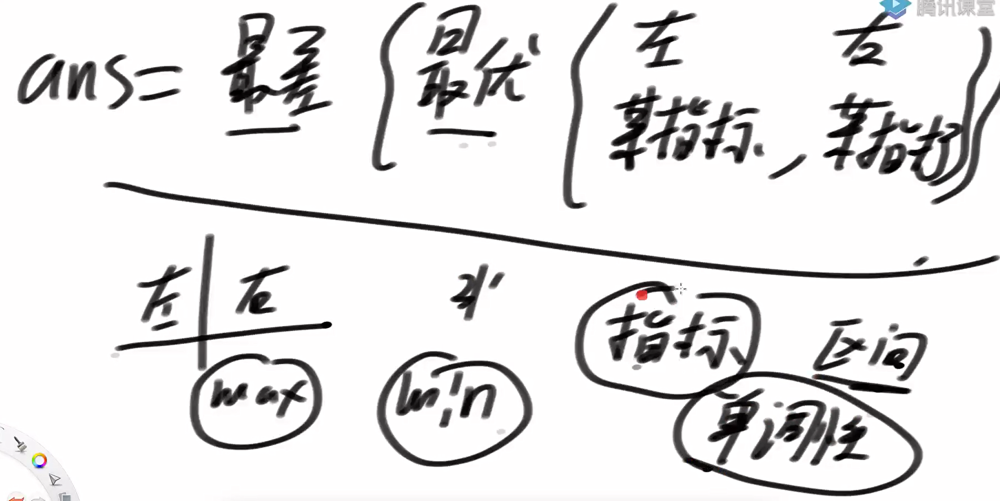

代码实现

```java
package class41;

public class code02_BestSplitForEveryPosition {

    public static int[] bestSplit1(int[] arr){
        if (arr == null || arr.length == 0){
            return new int[0];
        }
        int[] ans = new int[arr.length];
        ans[0] = 0;

       int N = arr.length;

       for (int range = 1; range < N; range++){
           for (int s = 0; s < range; s++){
               int sumL = 0;
               for (int L = 0; L <= s; L++){
                   sumL += arr[L];
               }
               int sumR = 0;
               for (int R = s+1; R <= range; R++){
                   sumR += arr[R];
               }

               ans[range] = Math.max(ans[range], Math.min(sumL, sumR));
           }
       }
       return ans;
    }


    public static int[] bestSplit2(int[] arr){
        if (arr == null || arr.length == 0){
            return new int[0];
        }
        int[] ans = new int[arr.length];
        ans[0] = 0;

        int N = arr.length;
        int[] sums = new int[N + 1];


        sums[0] = 0;
        for (int i = 0; i < N; i++){
            sums[i + 1] = sums[i] + arr[i];
        }

        for (int range = 1; range < N; range++){
            for (int s = 0; s < range; s++){
                int sumL = sum(sums, 0, s);
                int sumR = sum(sums, s+1, range);
                ans[range] = Math.max(ans[range], Math.min(sumL, sumR));
            }
        }
        return ans;
    }

    public static int sum(int[] sums, int L, int R){
        return sums[R + 1] - sums[L];
    }

    public static int[] bestSplit3(int[] arr){
        if (arr == null || arr.length == 0){
            return new int[0];
        }
        int[] ans = new int[arr.length];
        ans[0] = 0;

        int N = arr.length;
        int[] sums = new int[N + 1];


        sums[0] = 0;
        for (int i = 0; i < N; i++){
            sums[i + 1] = sums[i] + arr[i];
        }

        int best = 0;
        //best的划分，左部分[0, best], 右部分[best + 1, range]
        for (int range = 1; range < N; range++){
            while (best + 1 < range){//best + 1 = range的时候无刀可试
                int before = Math.min(sum(sums, 0, best), sum(sums, best + 1, range));
                int after = Math.min(sum(sums, 0, best + 1), sum(sums, best + 2, range));

                if (after >= before){
                    best++;
                }else{
                    break;
                }
            }
            ans[range] = Math.min(sum(sums, 0, best), sum(sums, best + 1, range));
        }
        return ans;
    }

    public static int[] randomArray(int len, int max) {
        int[] ans = new int[len];
        for (int i = 0; i < len; i++) {
            ans[i] = (int) (Math.random() * max);
        }
        return ans;
    }

    public static boolean isSameArray(int[] arr1, int[] arr2) {
        if (arr1.length != arr2.length) {
            return false;
        }
        int N = arr1.length;
        for (int i = 0; i < N; i++) {
            if (arr1[i] != arr2[i]) {
                return false;
            }
        }
        return true;
    }

    public static void main(String[] args) {
        int N = 20;
        int max = 30;
        int testTime = 1000000;
        System.out.println("测试开始");
        for (int i = 0; i < testTime; i++) {
            int len = (int) (Math.random() * N);
            int[] arr = randomArray(len, max);
            int[] ans1 = bestSplit1(arr);
            int[] ans2 = bestSplit2(arr);
            int[] ans3 = bestSplit3(arr);
            if (!isSameArray(ans1, ans2) || !isSameArray(ans1, ans3)) {
                System.out.println("Oops!");
            }
        }
        System.out.println("测试结束");
    }

}

```

**问题三：**

摆放着 n 堆石子。现要将石子有次序地合并成一堆。规定每次只能选相邻的 2 堆石子合并成新的一堆，并将新的一堆石子数记为该次合并的得分。求出将 n 堆石子合并成一堆的**最小得分**（或最大得分）合并方案。

我们需要找到一种方法，将 n*n* 堆石子通过每次只合并相邻两堆的方式，最终合并成一堆，并且在这一过程中，使得所有合并操作的得分之和达到最小（或最大）。

举例

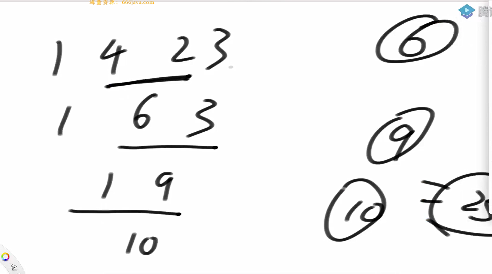

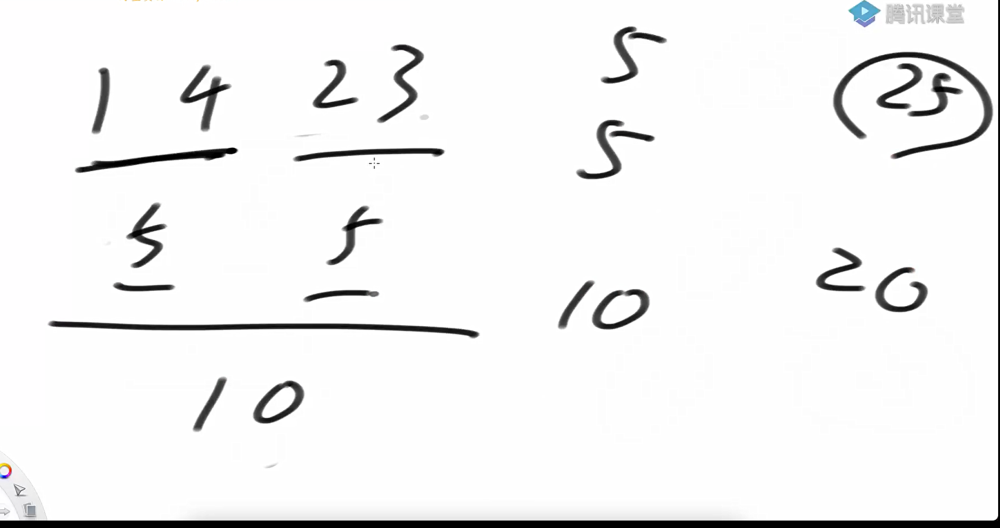

考虑怎么划分

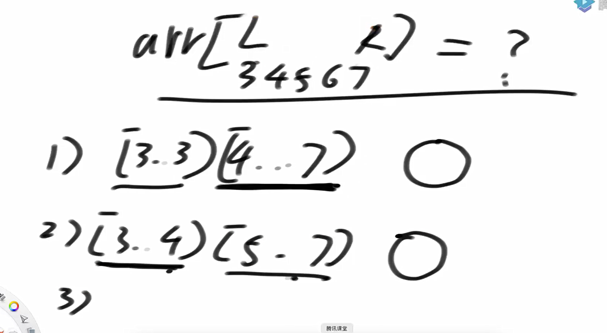

动态规划

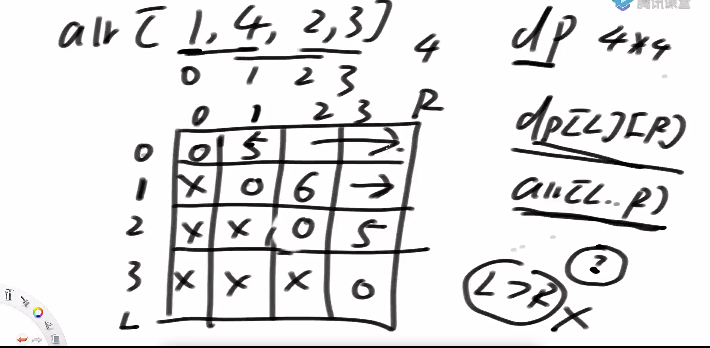

其中dp[L][R]代表的是arr[L]~arr[R]的最优划分值

划分的方式在上面

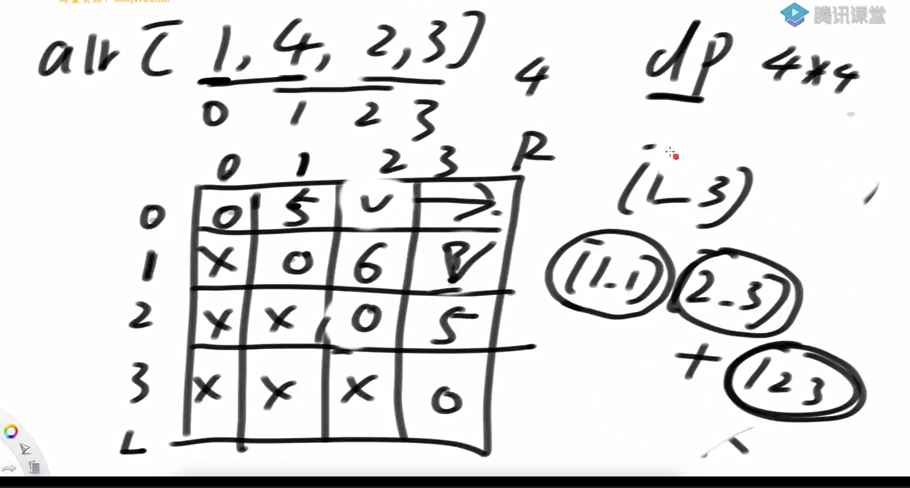

dp[L][R]的依赖关系，从左往右，从下往上。

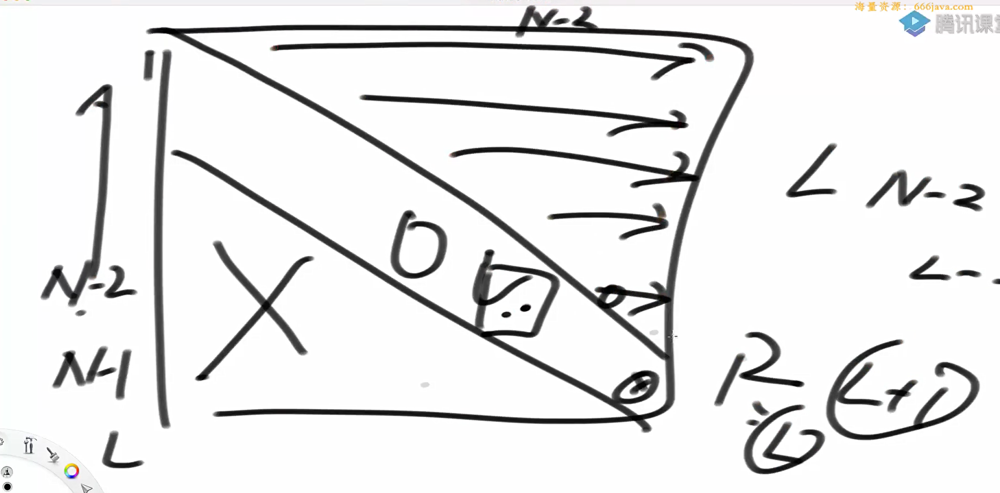

优化的部分

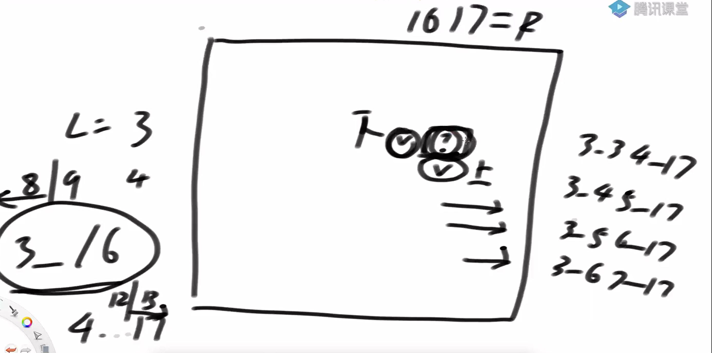

这里的最优划分点是最后一次合并前的情况。

当要求dp[L][R]的时候，已经将左面和下面的位置填好了。

考虑这样的情况，当左面和下面的最优划分已经确定的情况下，能否通过左和下这两个数据缩减范围？

best的含义是将(L~R)的最优划分点记录下来

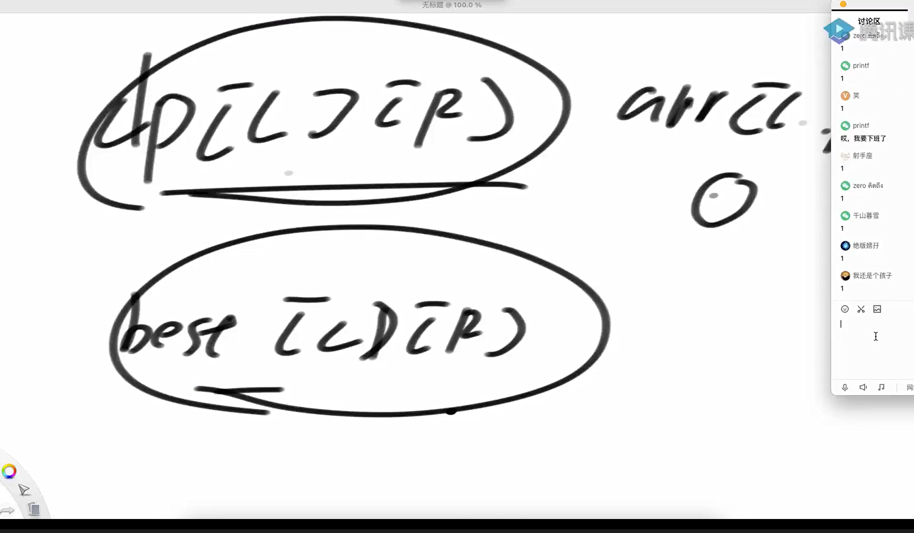

在best中，对角线无意义

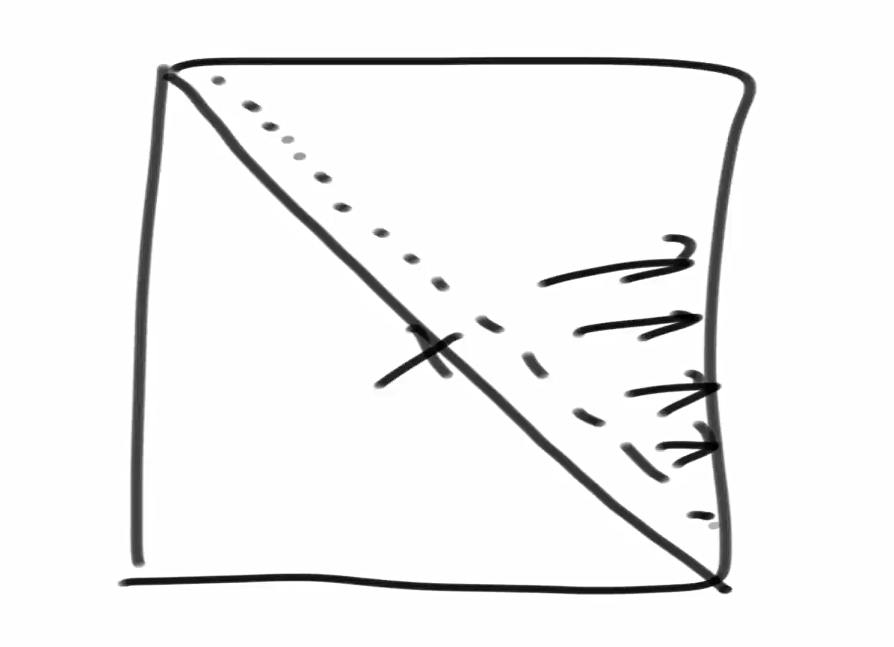

best的细节部分

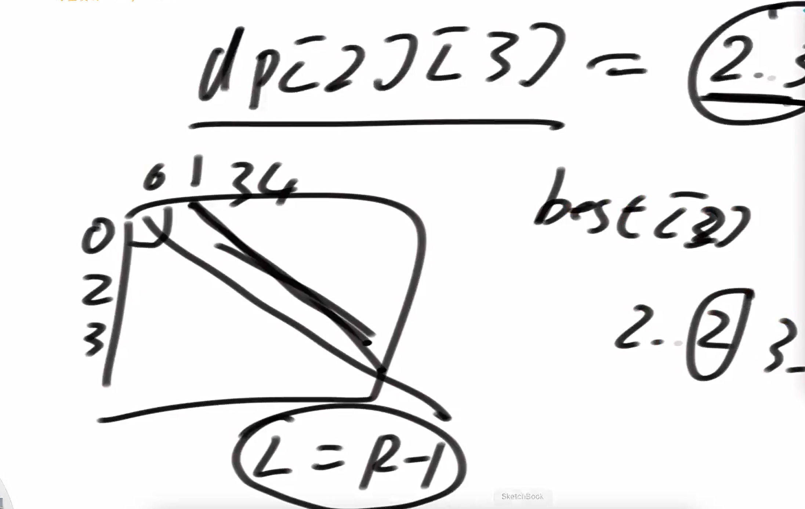

第二条对角线可以立刻确定best的划分点

填对角线的细节

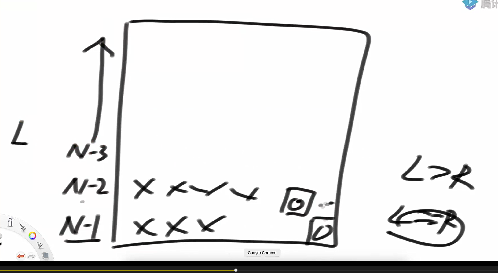

第一条对角线确定之后，填入第二条对角线

那么填dp的时候，实际上是从倒数第三行开始填也就说N-3开始

四边形不等式如何使用

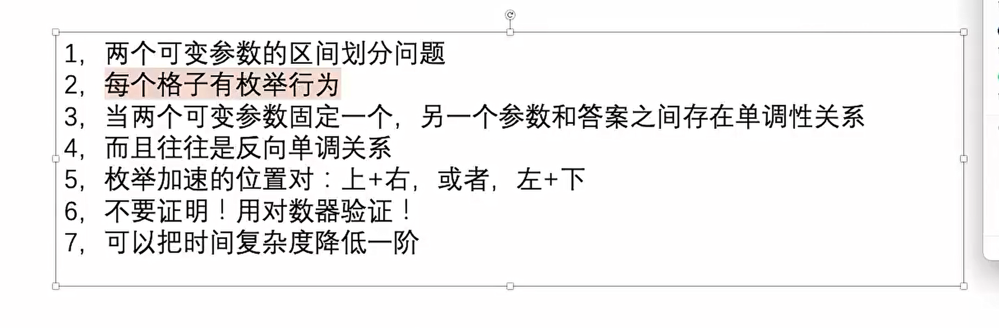

固定3或17的时候

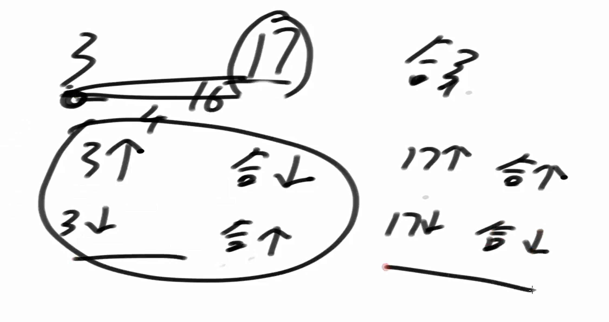

这样由于固定3和17的时候存在反向单调的关系

所以基于区间划分问题的背景下，参数和答案具有反向单调的关系

在动态规划问题中，当我们有两个可变参数（比如 L 和 R），并且固定其中一个参数时，另一个参数和答案之间存在一种特殊的关系——**反向单调关系**。

如上的例子

1 在固定L或R其中一个的时候，另一个变化导致结果变化，使得L或R与结果（如上导致合并结果变大或变小）存在单调关系

2 L（固定R）与结果的单调关系F1  与  R（骨钉L）与结果的单调关系F2  使得F1和F2是反向单调的

上面第一个图所示

这种关系被称为**反向单调关系**。

2. **每个格子有枚举行为**

比如上面的例子

dp[L][R]  往往要枚举所有情况

```java
                                for (int leftEnd = L; leftEnd < R; leftEnd++) {
					next = Math.min(next, dp[L][leftEnd] + dp[leftEnd + 1][R]);
				}
```

3. **当两个可变参数固定一个，另一个参数和答案之间存在单调性关系**


4. **而且往往是反向单调关系**

5. **枚举加速的位置对：上+右，或者，左+下**

这意味着我们在枚举分割点 k 时，可以利用这种反向单调关系来缩小枚举范围，从而加速计算过程。

- 如果我们从左上角开始填表（即从小到大枚举 L 和 R），我们可以利用 best[L][R-1] ≤ best[L][R] 这种关系来剪枝。

- 如果我们从右下角开始填表（即从大到小枚举 L 和 R），我们可以利用 best[L+1][R] ≥ best[L][R] 这种关系来剪枝。

6. **不要证明！用对数器验证！**

正如你所说，在实际编程中，我们可以通过编写对数器（暴力方法）来验证这种假设是否正确，而不是去严格证明它。

7. **可以把时间复杂度降低一阶**

通过利用这种反向单调关系进行剪枝，我们可以显著减少枚举的次数，从而把时间复杂度降低一阶。

5. **枚举加速的位置对：上+右，或者，左+下**

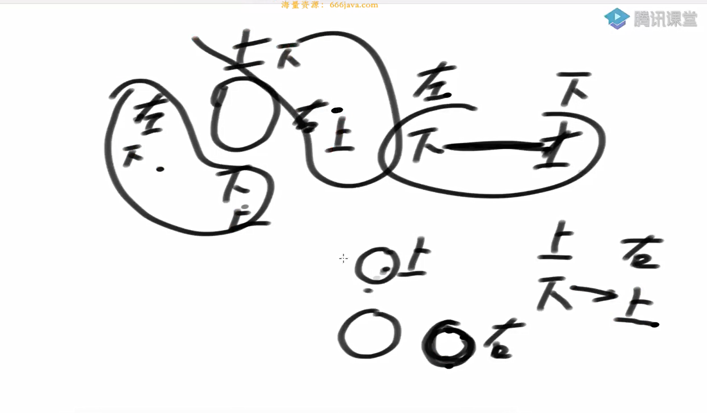

**符合前五个特征，就用对数器验证，如果验证不通过，就不可以用。**

**采用四变形不等式可以将O（N^3）降到O（N^2）**

代码实现

```java
package class41;

public class code03_StoneMerge {

    public static int[] sum(int[] arr) {
        int N = arr.length;
        int[] s = new int[N + 1];
        s[0] = 0;
        for (int i = 0; i < N; i++) {
            s[i + 1] = s[i] + arr[i];
        }
        return s;
    }

    public static int w(int[] arr, int L, int R){
        return arr[R + 1] - arr[L];
    }

    public static int min1(int[] arr){
        if (arr == null || arr.length < 2) {
            return 0;
        }
        int N = arr.length;
        int[] s = sum(arr);
        return process(0, N - 1, s);
    }

    public static int process(int L, int R, int[] s){
        if (L == R){
            return 0;
        }
        int next = Integer.MAX_VALUE;
        for (int leftEnd = L; leftEnd < R; leftEnd++){
            next = Math.min(next, process(L, leftEnd, s) + process(leftEnd + 1, R, s));
        }
        return next + w(s, L, R);
    }

    //动态规划版本
    public static int min2(int[] arr){
        if (arr == null || arr.length < 2) {
            return 0;
        }
        int N = arr.length;
        int[] s = sum(arr);

        //L(0~N-1), R(0~N-1) 其中L <= R
        //dp[L][R]表示的是在arr[L, R]区间上，最小的合并代价是多少
//        for (int leftEnd = L; leftEnd < R; leftEnd++){
//            next = Math.min(next, process(L, leftEnd, s) + process(leftEnd + 1, R, s));
//        }
//        由上面的递推关系式得出：dp[L][R]依赖的是dp[L, ?] 到dp[?, R]的值（?）
        int[][] dp = new int[N][N];
        //dp[i][i] = 0;
        for (int L = N - 2; L >= 0; L--){
            for (int R = L + 1; R < N; R++){
                int next = Integer.MAX_VALUE;
                for (int leftEnd = L; leftEnd < R; leftEnd++){
                    next = Math.min(next, dp[L][leftEnd] + dp[leftEnd + 1][R]);
                }
                dp[L][R] = next + w(s, L, R);
            }
        }
        return dp[0][N - 1];
    }


    public static int min3(int[] arr){
        if (arr == null || arr.length < 2) {
            return 0;
        }
        int N = arr.length;
        int[] s = sum(arr);
        int[][] dp = new int[N][N];
        int[][] best = new int[N][N];

        for (int i = 0; i < N - 1; i++){
            best[i][i + 1] = i;
            dp[i][i + 1] = w(s, i, i+1);
        }

        for (int L = N - 3; L >= 0; L--){
            for (int R = L + 2; R < N; R++){
                int next = Integer.MAX_VALUE;
                int choose = -1;
                for (int leftEnd = best[L][R - 1]; leftEnd <= best[L + 1][R]; leftEnd++){
                    int cur = dp[L][leftEnd] + dp[leftEnd + 1][R];
                    if (cur <= next){
                        next = cur;
                        choose = leftEnd;
                    }
                }
                best[L][R] = choose;
                dp[L][R] = next + w(s, L, R);
            }
        }
        return dp[0][N-1];
    }

    public static int[] randomArray(int len, int maxValue) {
        int[] arr = new int[len];
        for (int i = 0; i < len; i++) {
            arr[i] = (int) (Math.random() * maxValue);
        }
        return arr;
    }

    public static void main(String[] args) {
        int N = 15;
        int maxValue = 100;
        int testTime = 1000;
        System.out.println("测试开始");
        for (int i = 0; i < testTime; i++) {
            int len = (int) (Math.random() * N);
            int[] arr = randomArray(len, maxValue);
            int ans1 = min1(arr);
            int ans2 = min2(arr);
            int ans3 = min3(arr);
            if (ans1 != ans2 || ans1 != ans3) {
                System.out.println("Oops!");
            }
        }
        System.out.println("测试结束");
    }


}

```

**问题四**： [https://leetcode.com/problems/split-array-largest-sum/](https://leetcode.com/problems/split-array-largest-sum/)

给定一个**非负整数数组** nums 和一个整数 k ，你需要将这个数组分成 k* *个非空的连续子数组，使得这 k* *个子数组各自和的最大值 **最小**。

返回分割后最小的和的最大值。

**子数组** 是数组中连续的部份。

 

**示例 1：**

**输入：**nums = [7,2,5,10,8], k = 2**输出：**18**解释：**一共有四种方法将 nums 分割为 2 个子数组。 其中最好的方式是将其分为 [7,2,5] 和 [10,8] 。因为此时这两个子数组各自的和的最大值为18，在所有情况中最小。

**示例 2：**

**输入：**nums = [1,2,3,4,5], k = 2**输出：**9

**示例 3：**

**输入：**nums = [1,4,4], k = 3**输出：**4

 

**提示：**

- 1 <= nums.length <= 1000

- 0 <= nums[i] <= 106

- 1 <= k <= min(50, nums.length)

给定一个整型数组 arr，数组中的每个值都为正数，表示完成一幅画作需要的时间，再给定一个整数 num，表示画匠的数量，每个画匠只能画连在一起的画作。所有的画家并行工作，请返回完成所有的画作需要的最少时间。

【举例】

arr=[3,1,4]，num=2。最好的分配方式为第一个画匠画 3 和 1，所需时间为 4。第二个画匠画 4，所需时间为 4。因为并行工作，所以最少时间为 4。如果分配方式为第一个画匠画 3，所需时间为 3。第二个画匠画 1 和 4，所需的时间为 5。那么最少时间为 5，显然没有第一种分配方式好。所以返回 4。

arr=[1,1,1,4,3]，num=3。最好的分配方式为第一个画匠画前三个 1，所需时间为 3。第二个画匠画 4，所需时间为 4。第三个画匠画 3，所需时间为 3。返回 4。

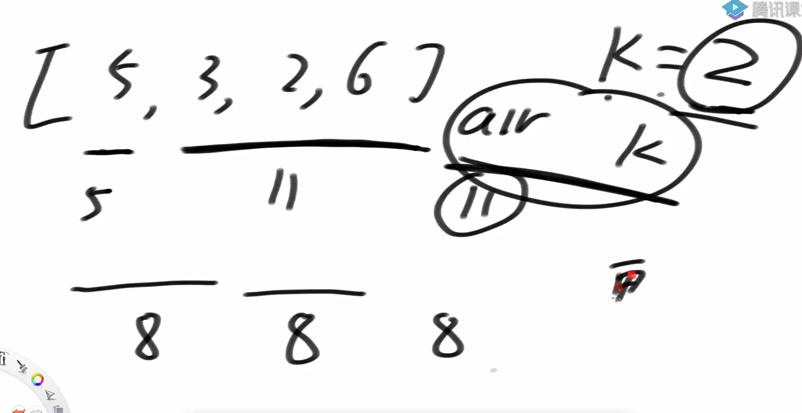

dp逻辑

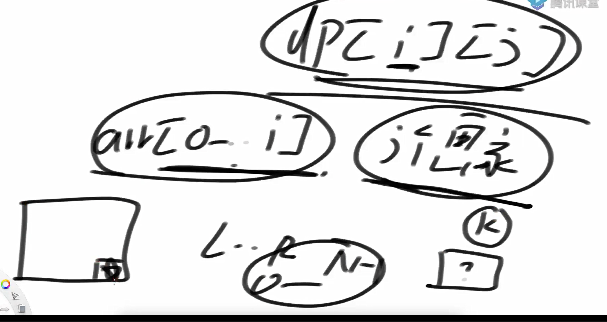

怎么划分

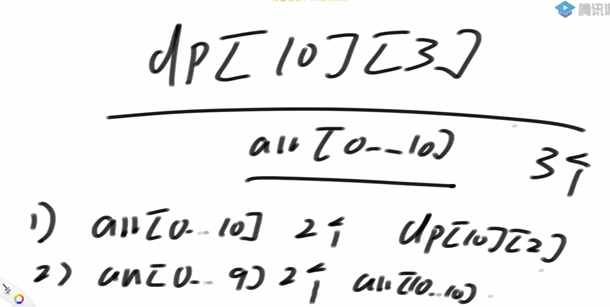

划分方式为最后一个画家负责的范围

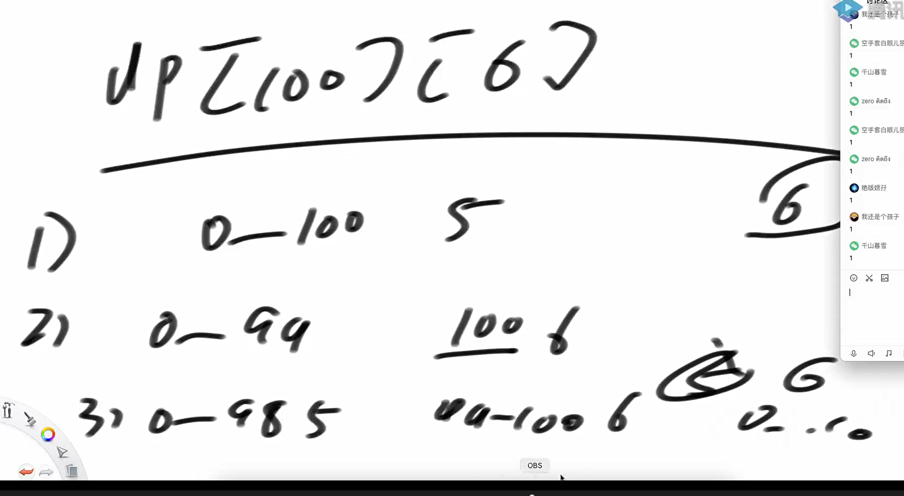

dp表的初始化

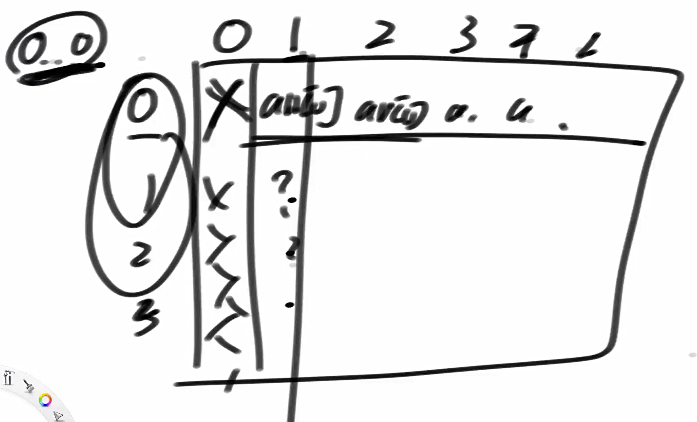

dp表的依赖关系

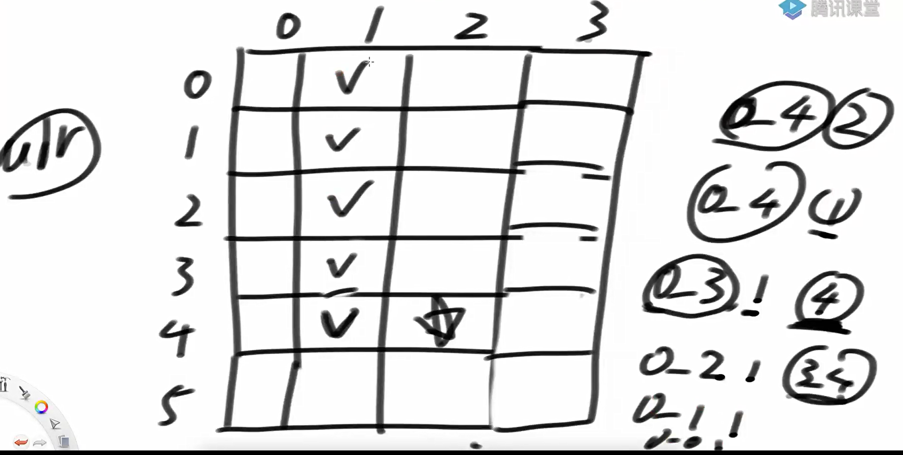

dp状态转移

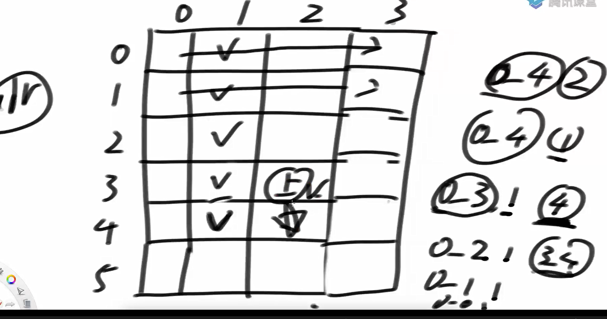

单调性问题

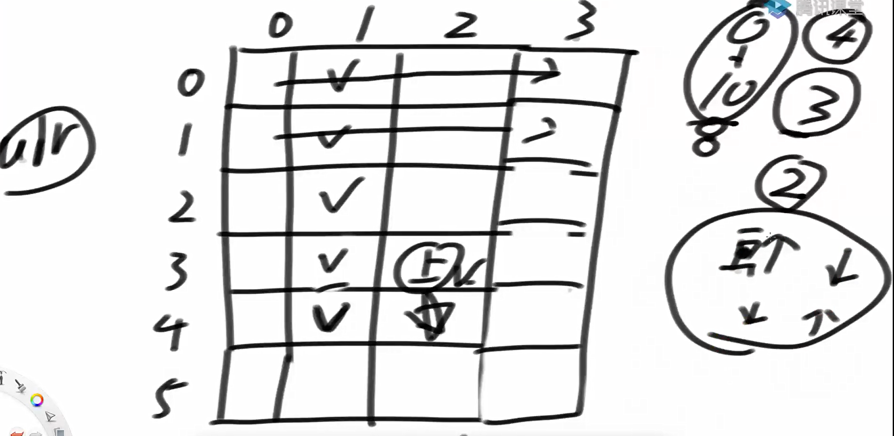

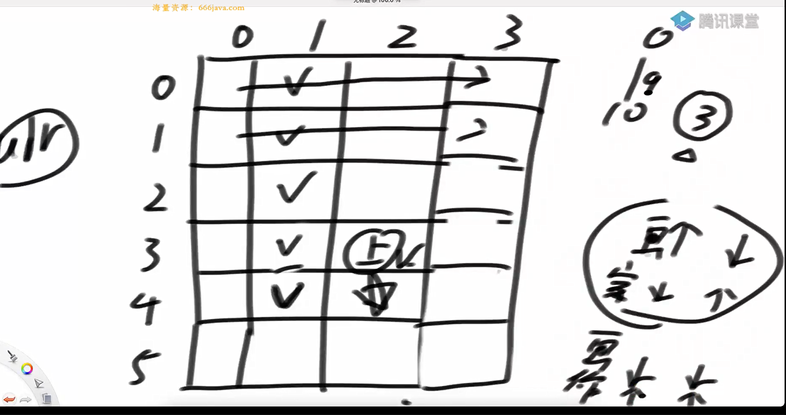

满足反向单调关系


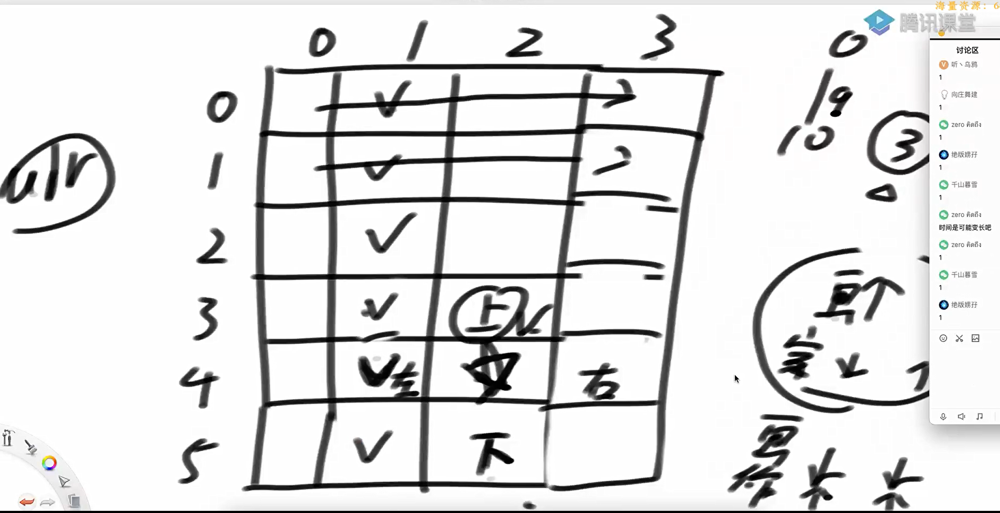

满足四边形不等式前提后  剪枝

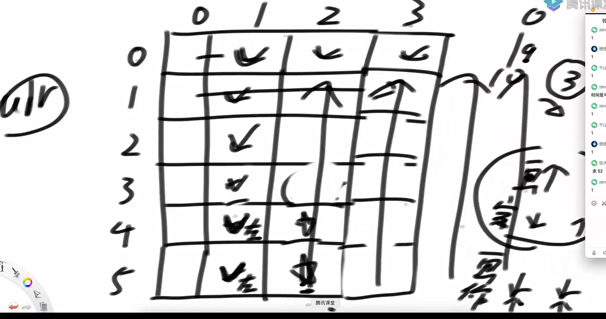

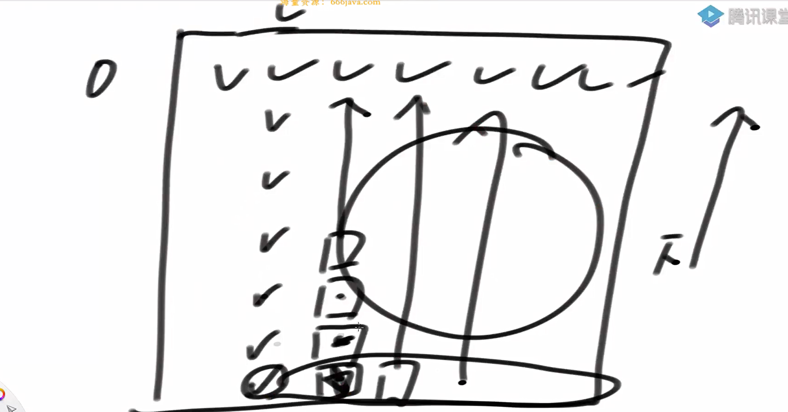

先确定底部，然后再通过左面和下面确定上下限

best的值

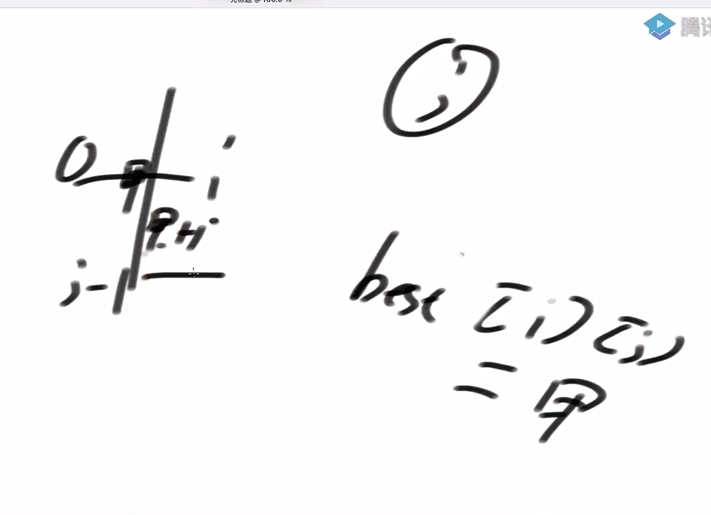

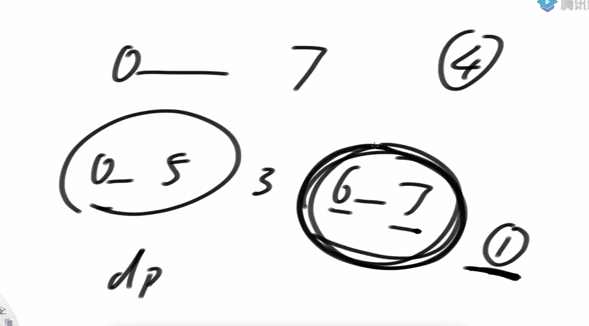

你的解析并不十分清楚。首先dp[i][j]的实际含义是在arr[0]~arr[i]上，画家数量为j的最优选择

那么dp的初始化：

行初始化

for (int j = 1; j <= K; j++) {

dp[0][j] = arr[0];

}

列初始化

for (int i = 1; i < N; i++) {

dp[i][1] = sum(sum, 0, i);

}

其中

public static int sum(int[] sum, int L, int R) {

return sum[R + 1] - sum[L];

}

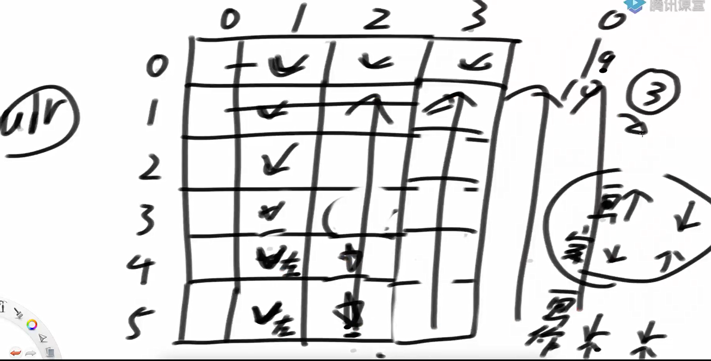

dp的依赖关系如下.

为了计算 dp[i][k]，我们需要考虑所有可能的前一段结束位置 j (0 <= j < i)，并将 nums[0...i] 分为两部分：

	- nums[0...j] 分割成 k-1 段

	- nums[j+1...i] 作为第 k 段

dp[i][k] = min{ max(dp[j][k-1], sum(nums, j+1, i)) } 对于所有 0 <= j < i

第k个画家，它的花费是nums[j+1...i], 剩下的k-1个画家花费在nums[0...j]上的最优花费（dp[k-1][j]）然后得到其中的最大值，然后通过这个范围0 <= j < i得到其中的最小值就是dp[i][k]的值。

这样就搞明白了dp本身。

best可以使用的判断依据

这就是关键点：当我们固定 L 并增加 R 时，最优分割点 k 是非递减的；而当我们固定 R 并减少 L 时，最优分割点 k 是非递增的。  

当我固定数组长度i的时候，画家k增加，那么结果ans必然减小。

```
dp[i][k] <= dp[i][k-1]
```

当我固定画家k的时候，数组长度增加i，那么结果页增加。这样dp满足反向单调性，所以每次划分的定都不会退

这样构成决策的单调性

决策单调的具体判定

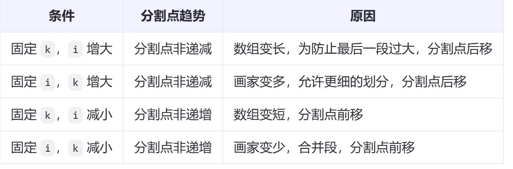

这样确定best是不回退的

其中对固定k，i增大进行讨论

如果说在best[i][k]中最优的划分点是leftEnd.  最优值是ans

当加入arr[i]的时候，也就说k不动，i增大。那么best[i+1][k]的最优值ans· >= ans是一定的。

那么ans可能取值为[0~left]  或[left, i+1]， 如果瓶颈在[0~left]上，那么i+1的leftEnd就会在leftEnd保持不动

如果瓶颈在[left, i+1]上，那么要让i+1的第k画家的花费尽可能的小，尝试的结果是leftEnd右移或者不动

所以，综合所有情况leftend只能右移或者不动

背景和设定

- 目标：将一个数组 arr 分割成 k 段，使得这 k 段的最大值之和最小。

- dp[i][k]：表示将前 i 个元素分成 k 段时的最小最大值之和。

- bestend[i][k] 或 leftEnd：达到 dp[i][k] 时的最优分割点，即第 k 段的起始位置。

当加入 arr[i] 时的变化分析

假设我们已经知道了 best[i][k] 的最优划分点是 leftEnd，并且其对应的最优值是 ans。

新增元素的影响

1. 瓶颈在 [0, leftEnd] 上：

	- 如果当前最优解的瓶颈位于 [0, leftEnd] 这一段，那么新增加的元素 arr[i+1] 对这段区域的影响较小。

	- 在这种情况下，为了保持最优解的稳定性，最优划分点 leftEnd 可能不会发生变化，即新问题的 leftEnd 将保持原位。

1. 瓶颈在 [leftEnd, i+1] 上：

	- 如果瓶颈出现在 [leftEnd, i+1] 区间内，那么为了让新的第 k 段（包括新加入的元素 arr[i+1]）的花费尽可能小，我们需要重新考虑如何分配这些元素。

	- 此时，为了减少最后一段的最大值，可能需要调整 leftEnd，使其向右移动，以包含更多前面的较小元素，从而降低最后一段的最大值。

	- 重要的是，即使在这种情况下，leftEnd 也可能保持不变，但绝不可能左移，因为那样会违反我们的目标——使最大值之和尽可能小。

结论

因此，在固定 k 的前提下，随着 i 的增大，bestend[i+1][k]（或 leftEnd）的移动趋势只能是：

- 右移：当新增加的元素导致需要重新平衡各段的最大值时，leftEnd 向右移动以优化整体结果。

- 保持不变：如果新增加的元素对当前最优解的影响不大，leftEnd 可能保持不变。

综上所述，**leftEnd**** 不可能左移，它要么向右移动，要么保持原地不动，以确保我们始终朝着最小化最大值之和的目标前进。**这个结论与你提供的分析完全一致，并且进一步强化了对于动态规划中这类问题的理解。

如果我们固定i，让k变大，因为结果变小或者不变（非负包含零）

如果不变，那么可以确定k变大后，最优划分点可能不动或者右移。

如果变小，那么为了保证结果变小了，最优划分点必须向右一定以保证（第k份的和不超过变小的值）

“不能左移是因为我设定的best是最优结构，如果左移那么best的结构就会被破坏。”

下面这个需要特别注意

这句话可以理解为：

- **最优子结构要求**：如果我们从 i+1 往前推，那么它的**最优划分点必须是在前面某个“局部最优”的基础上做出的，不能违背前面的最优选择。**

- 单调性保证了动态规划的效率：我们可以利用 best[i][k] <= best[i+1][k] 来限制搜索范围，避免暴力枚举所有可能的 j。

```
//                    在使用决策单调性优化时，只有在当前方案严格优于已有方案时，才更新划分点。（可以统一这样认为）
如果不想证明，那么可以通过对数器验证是否在遇到更优的情况下才更新
```

最优的思路

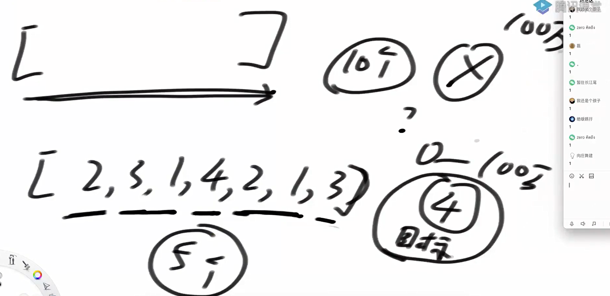

假设需要画家花费小于4，最少需要几个画家

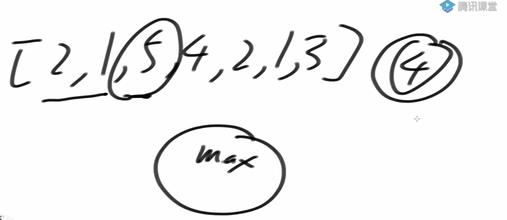

若单点突破，就返回最大值

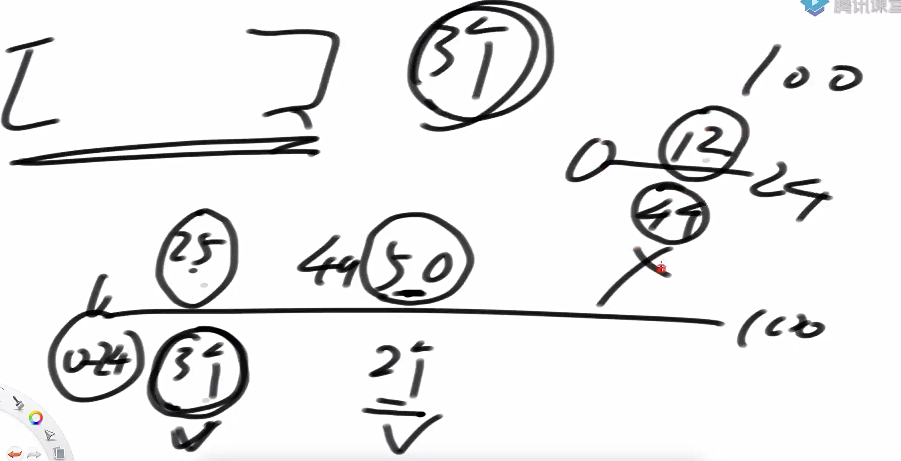

最晚画对号的就是答案

代码实现

```java
package class42;

public class code04_SplitArrayLargestSum {

    //计算arr[l]~arr[r]的累加和
    public static int w(int[] sum, int L, int R){
        return sum[R + 1] - sum[L];
    }

    //不使用枚举的动态规划方法,O(N^2 * K){
    public static int splitArray1(int[] arr, int K){
        int N = arr.length;
        int[] sum  = new int[N + 1];
        for (int i = 0; i < N; i++){
            sum[i + 1] = sum[i] + arr[i];
        }
        int[][] dp = new int[N][K + 1];
        for (int j = 1; j <= K; j++){
            dp[0][j] = arr[0];
        }

        for (int i = 1; i < N; i++){
            dp[i][1] = w(sum, 0, i);
        }


        for (int k = 2; k <= K; k++){
            for (int i = 1; i < N; i++){
                //枚举所有j ∈ [0, i-1]的可能性，j为划分点
                int minCost = Integer.MAX_VALUE;

                for (int j = 0; j <= i-1; j++){
                    int leftCost = dp[j][k-1];
                    int rightCost = w(sum, j+1, i);
                    int curCost = Math.max(leftCost, rightCost);
                    minCost = Math.min(minCost, curCost);
                }
                dp[i][k] = minCost;
            }
        }
        return dp[N-1][K];
    }
    //best实现的逻辑是将上文中的j记录一下，复用以降低时间复杂度。

    public static int splitArray2(int[] arr, int K){
        int N = arr.length;
        int[] sum = new int[N + 1];
        for (int i = 0; i < N; i++){
            sum[i + 1] = sum[i] + arr[i];
        }

        int[][] dp = new int[N][K + 1];
        int [][] best = new int[N][K + 1];

        for (int j = 1; j <= K; j++){
            dp[0][j] = arr[0];
            best[0][j] = -1;
        }

        for (int i = 1; i < N; i++){
            dp[i][1] = w(sum, 0, i);
            best[i][1] = -1;
        }
        for (int k = 2; k <= K; k++){
            for (int i = N - 1; i >= 1; i--){
                int down = best[i][k-1];
                int up = i == N - 1 ? N - 1 : best[i+1][k];

                int ans = Integer.MAX_VALUE;
                int bestChoose = -1;
                for (int leftEnd = down; leftEnd <= up; leftEnd++){
                    int leftCost = leftEnd == -1 ? 0 : dp[leftEnd][k-1];
                    int rightCost = leftEnd == i ? 0 : w(sum, leftEnd + 1, i);
                    int cur = Math.max(leftCost, rightCost);
//                    在使用决策单调性优化时，只有在当前方案严格优于已有方案时，才更新划分点。
                    if (cur < ans){
                        ans = cur;
                        bestChoose = leftEnd;
                    }
                    dp[i][k] = ans;
                    best[i][k] = bestChoose;
                }
            }
        }
        return dp[N-1][K];
    }
    public static int[] randomArray(int len, int maxValue) {
        int[] arr = new int[len];
        for (int i = 0; i < len; i++) {
            arr[i] = (int) (Math.random() * maxValue);
        }
        return arr;
    }

    public static void printArray(int[] arr) {
        for (int i = 0; i < arr.length; i++) {
            System.out.print(arr[i] + " ");
        }
        System.out.println();
    }

    public static int splitArray3(int[] arr, int K){
        int N = arr.length;
        long sum = 0;
        for (int i = 0; i < N; i++) {
            sum += arr[i];
        }

        long l = 0;
        long r = sum;
        long ans = 0;
        while (l <= r){
            long mid = (l + r) / 2;
            long cur = getNeedParts(arr, mid);
            if (cur <= K){
                ans = mid;
                r = mid - 1;
            }else{
                l = mid + 1;
            }
        }
        return (int)ans;
    }

    public static int getNeedParts(int[] arr, long aim) {
        for (int i = 0; i < arr.length; i++) {
            if (arr[i] > aim) {
                return Integer.MAX_VALUE;
            }
        }
        int parts = 1;
        int all = arr[0];
        for (int i = 1; i < arr.length; i++) {
            if (all + arr[i] > aim) {
                parts++;
                all = arr[i];
            } else {
                all += arr[i];
            }
        }
        return parts;
    }


    // 测试用例
    public static void main(String[] args) {


            int N = 10;
            int maxValue = 100;
            int testTime = 10000;
            System.out.println("测试开始");
            for (int i = 0; i < testTime; i++) {
                int len = (int) (Math.random() * N) + 1;
                int M = (int) (Math.random() * N) + 1;
                int[] arr = randomArray(len, maxValue);
                int ans1 = splitArray1(arr, M);
                int ans2 = splitArray2(arr, M);
                int ans3 = splitArray3(arr, M);

                if (ans1 != ans2 || ans1 != ans3) {
                    System.out.print("arr : ");
                    printArray(arr);
                    System.out.println("M : " + M);
                    System.out.println("ans1 : " + ans1);
                    System.out.println("ans2 : " + ans2);
                    System.out.println("ans2 : " + ans3);
                    System.out.println("Oops!");
                    break;
                }
            }
            System.out.println("测试结束");
        }
}

```

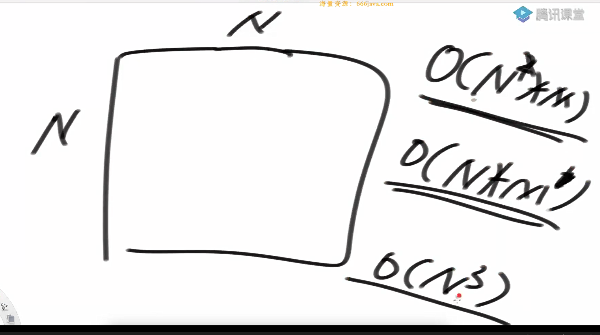

**可以把时间复杂度降低一阶**

通过利用这种反向单调关系进行剪枝，我们可以显著减少枚举的次数，从而把时间复杂度降低一阶。