**问题一：**

你有一排排成一条直线的村庄，它们的坐标是已经排序好的整数数组 arr（表示每个村庄的位置），你要在这些村庄中选择 k 个村庄建立邮局，使得所有村庄到最近邮局的距离之和最小。

目标是：找出最小的总距离和。

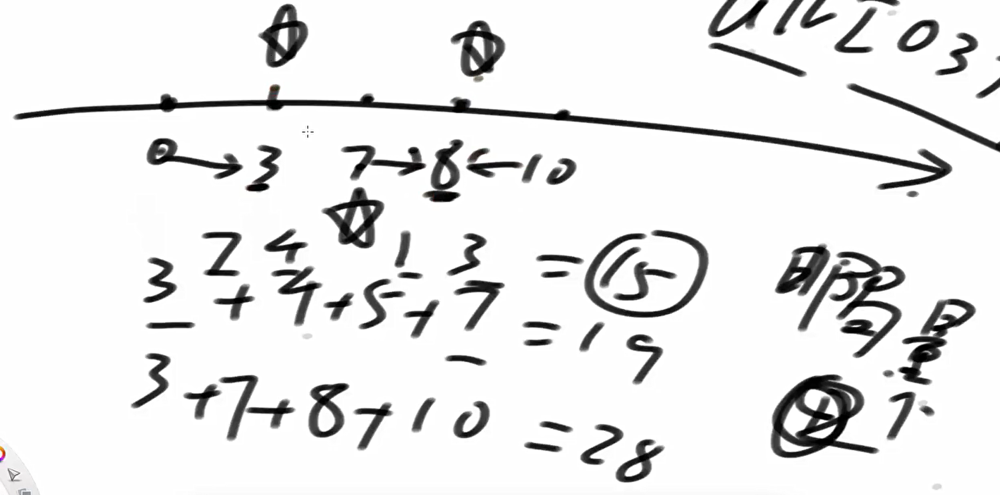

假设只有一个邮局。那么在arr上的中点位置是最优的。（结论，记住即可）

如果是奇数，那么选在中点位置。如果为偶数，那么上中点和下中点都是一样的。

dp部分

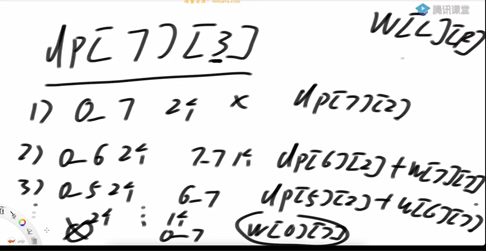

w的范围设置为N+1而不是N是为了简化边界讨论

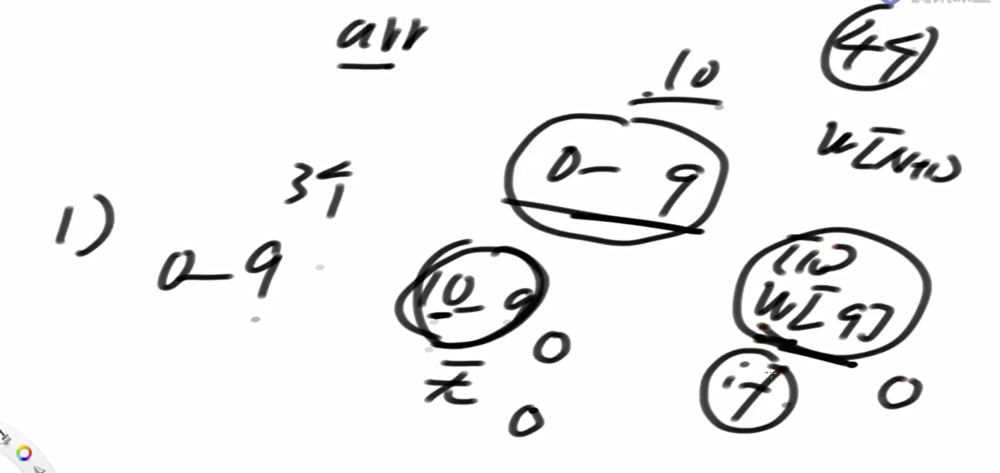

dp的预处理部分  先填入第一列

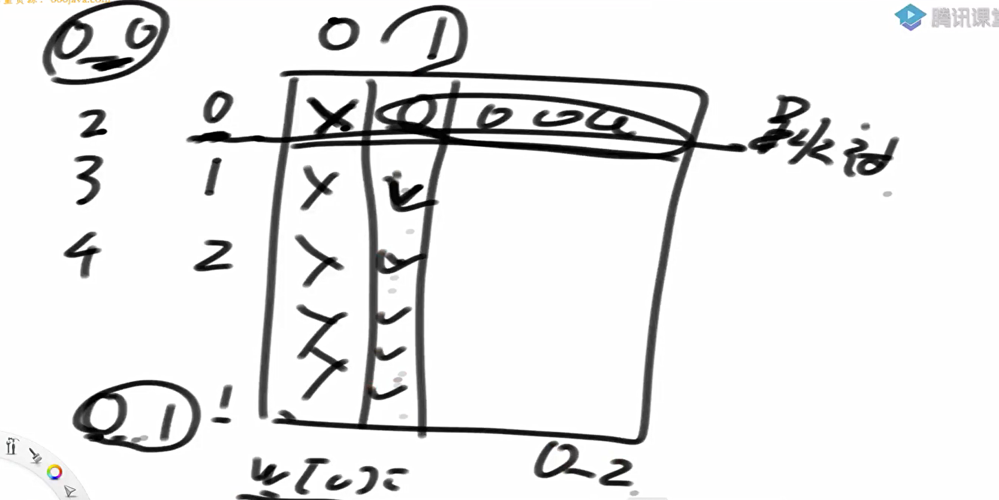

不优化的尝试

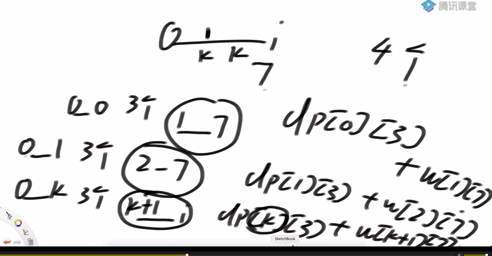

分析单调关系

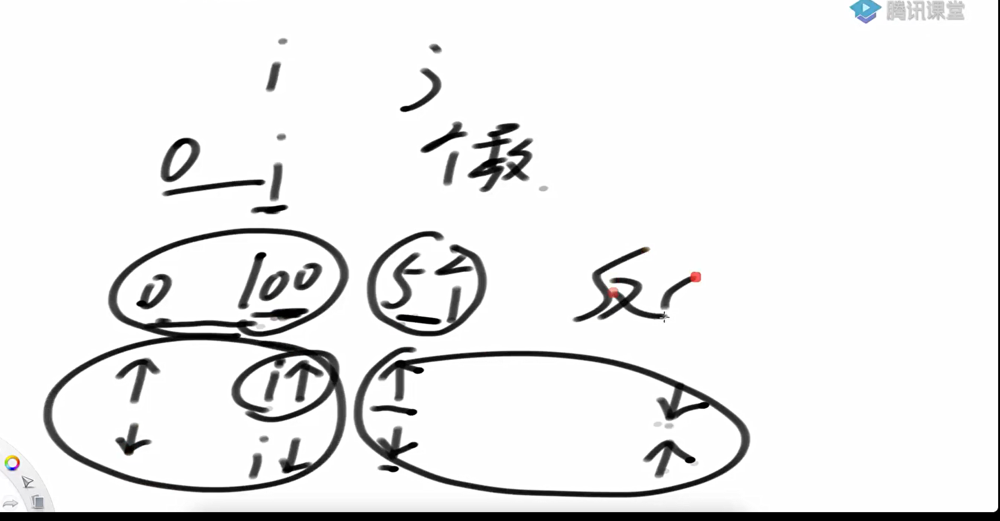

依赖关系

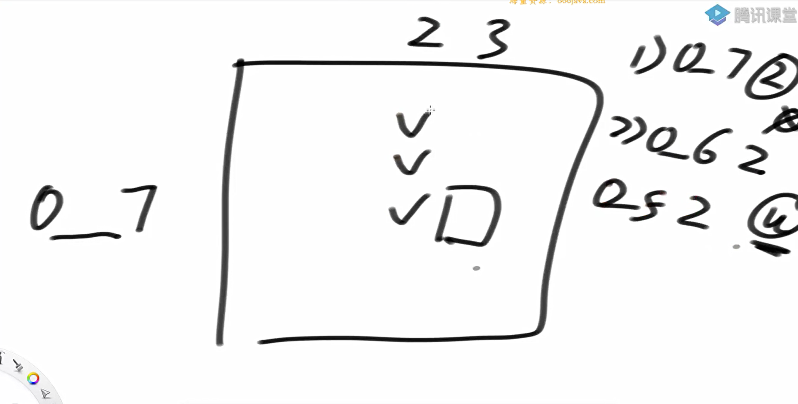

这样就确定了左下的依赖，可以进行缩减边界尝试

代码实现

```java
package class42;

import java.util.Arrays;

public class code01_PostOfficeProblem {

    public static int min2(int[] arr, int k){
        if (arr == null || k < 1 || arr.length < k) {
            return 0;
        }
        int n = arr.length;
        //dp[i][j]表示在arr[0,i]上，邮局为j的时候的最优解
        int[][] dp = new int[n][k + 1];
        for (int i = 0; i < n; i++) {
            Arrays.fill(dp[i], -1); // 初始化为 -1 表示未计算
        }
        return process(arr, n - 1, k, dp);

    }
    //计算arr上[l, r]只有一个邮局时的cost
    public static int cost(int[] arr, int l, int r){
        int res = 0;
        int mid = (l + r) / 2;
        for (int i = l; i <= r; i++){
            res += Math.abs(arr[i] - arr[mid]);
        }
        return res;
    }
//  表示在arr[0,i]上，有j个邮局的最小代价
    public static int process(int[] arr, int i, int j, int[][] dp){
        if (j == 0){
            return Integer.MAX_VALUE / 2;//不能建邮局非法
        }
        if (j == 1){
            return cost(arr, 0, i);
        }
        if (i < 0){
            return Integer.MAX_VALUE / 2; //越界非法
        }
        if (dp[i][j] != -1){
            return dp[i][j];
        }

        int res = Integer.MAX_VALUE;
        for (int p = 0; p < i; p++){
            int curCost = process(arr, p, j -1, dp) + cost(arr, p + 1, i);
            res = Math.min(res, curCost);
        }
        dp[i][j] = res;
        return res;
    }

    public static int min1(int[] arr, int num) {
        if (arr == null || num < 1 || arr.length < num) {
            return 0;
        }

        int N = arr.length;
        int[][] w = new int[N+1][N+1];
        //i, 有i+1个居民，那么邮局的数量最多不超过i+1， 所以w[i][i+1] = 0;邮局占据全部的居民点
        //w[L][R]的含义是在[L, R]上，一个邮局耗费的最小代价
        for (int L = 0; L < N; L++){
            for (int R = L + 1; R < N; R++){
                w[L][R] = w[L][R - 1] + arr[R] - arr[(L + R) / 2];
            }
        }

        int[][] dp = new int[N][num + 1];


        //dp第一列为无效列, 从第二列开始为有效列。
        //从第二列开始，第0行全为0
        //从第二列开始，顺序填写第一列
        for (int i = 1; i < N; i++){
            dp[i][1] = w[0][i];
        }
        //dp[L][R]依赖于 dp[k][R-1] + w(k+1, R), dp[L][R]依赖于前面的一列
        //其中k <= 行数
        //i代表居民编号，j代表邮局数量
        for (int i = 1; i < N; i++){
            for (int j = 2; j <= i+1 && j <= num; j++){
                int ans = Integer.MAX_VALUE;
                for (int k = 0; k <= i; k++){
                    ans = Math.min(ans, dp[k][j-1] + w[k+1][i]);
                }
                dp[i][j] = ans;
            }
        }
        return dp[N-1][num];
    }

    public static int min3(int[] arr, int num){
        if (arr == null || num < 1 || arr.length < num) {
            return 0;
        }

        int N = arr.length;
        int[][] w = new int[N+1][N+1];
        for (int L = 0; L < N; L++){
            for (int R = L + 1; R < N; R++){
                w[L][R] = w[L][R - 1] + arr[R] - arr[(L + R) / 2];
            }
        }

        int[][] dp = new int[N][num + 1];
        int[][] best = new int[N][num + 1];


        //dp第一列为无效列, 从第二列开始为有效列。
        //从第二列开始，第0行全为0
        //从第二列开始，顺序填写第一列
        for (int i = 1; i < N; i++){
            dp[i][1] = w[0][i];
            best[i][1] = -1;
        }

        for (int j = 2; j <= num; j++){
            for (int i = N - 1; j <= i + 1; i--){
                int up = i == N - 1 ? N - 1 : dp[i + 1][j];
                int down = best[j-1][i];
                int ans = Integer.MAX_VALUE;
                int bestChoose = -1;
                for (int leftEnd = down; leftEnd <= up; leftEnd++){
                    int leftCost = leftEnd == -1 ? 0 : dp[leftEnd][j-1];
                    int rightCost = leftEnd == i ? 0 : w[leftEnd + 1][i];
                    int cur = leftCost + rightCost;
                    if (cur < ans){
                        ans = cur;
                        bestChoose = leftEnd;
                    }
                }
                dp[i][j] = ans;
                best[i][j] = bestChoose;
            }
        }
        return dp[N-1][num];
    }

    // for test
    public static int[] randomSortedArray(int len, int range) {
        int[] arr = new int[len];
        for (int i = 0; i != len; i++) {
            arr[i] = (int) (Math.random() * range);
        }
        Arrays.sort(arr);
        return arr;
    }

    // for test
    public static void printArray(int[] arr) {
        for (int i = 0; i != arr.length; i++) {
            System.out.print(arr[i] + " ");
        }
        System.out.println();
    }

    // for test
    public static void main(String[] args) {
        int N = 30;
        int maxValue = 100;
        int testTime = 10000;
        System.out.println("测试开始");
        for (int i = 0; i < testTime; i++) {
            int len = (int) (Math.random() * N) + 1;
            int[] arr = randomSortedArray(len, maxValue);
            int num = (int) (Math.random() * N) + 1;
            int ans1 = min1(arr, num);
            int ans3 = min3(arr, num);
            if (ans1 != ans3) {
                printArray(arr);
                System.out.println(num);
                System.out.println(ans1);
                System.out.println(ans3);
                System.out.println("Oops!");
            }
        }
        System.out.println("测试结束");

    }
}

```

**问题二**

[887. 鸡蛋掉落 - 力扣（LeetCode）](https://leetcode.cn/problems/super-egg-drop/description/)

给你 k 枚相同的鸡蛋，并可以使用一栋从第 1 层到第 n 层共有 n 层楼的建筑。

已知存在楼层 f ，满足 0 <= f <= n ，任何从** 高于** f 的楼层落下的鸡蛋都会碎，从 f 楼层或比它低的楼层落下的鸡蛋都不会破。

每次操作，你可以取一枚没有碎的鸡蛋并把它从任一楼层 x 扔下（满足 1 <= x <= n）。如果鸡蛋碎了，你就不能再次使用它。如果某枚鸡蛋扔下后没有摔碎，则可以在之后的操作中 **重复使用** 这枚鸡蛋。

请你计算并返回要确定 f **确切的值** 的 **最小操作次数** 是多少？ 

**示例 1：**

**输入：**k = 1, n = 2**输出：**2**解释：**鸡蛋从 1 楼掉落。如果它碎了，肯定能得出 f = 0 。 否则，鸡蛋从 2 楼掉落。如果它碎了，肯定能得出 f = 1 。 如果它没碎，那么肯定能得出 f = 2 。 因此，在最坏的情况下我们需要移动 2 次以确定 f 是多少。 

**示例 2：**

**输入：**k = 2, n = 6**输出：**3

**示例 3：**

**输入：**k = 3, n = 14**输出：**4

 

**提示：**

- 1 <= k <= 100

- 1 <= n <= 104

一座大楼有 0~N 层，地面算作第 0 层，最高的一层为第 N 层。已知棋子从第 0 层掉落肯定不会摔碎，从第 j 层掉落可能会摔碎，也可能不会摔碎(1≤i≤N)。给定整数 N 作为楼层数，再给定整数 K 作为棋子数，**返回如果想找到棋子不会摔碎的最高层数**，**即使在最差的情况下扔的最少次数。**一次只能扔一个棋子。

【举例】

N=10，K=1。

返回 10。因为只有 1 棵棋子，所以不得不从第 1 层开始一直试到第 10 层，在最差的情况 下，即第 10 层是不会摔坏的最高层，最少也要扔 10 次。

N=3，K=2。

返回 2。先在 2 层扔 1 棵棋子，如果碎了，试第 1 层，如果没碎，试第 3 层。 N=105，K=2

返回 14。

第一个棋子先在 14 层扔，碎了则用仅存的一个棋子试 1−13。若没碎，第一个棋子继续在 27 层扔，碎了则用仅存的一个棋子试 15−26。若没碎，第一个棋子继续在 39 层扔，碎了则用仅存的一个棋子试 28−38。若没碎，第一个棋子继续在 50 层扔，碎了则用仅存的一个棋子试 40−49。若没碎，第一个棋子继续在 60 层扔，碎了则用仅存的一个棋子试 51−59。若没碎，第一个棋子继续在 69 层扔，碎了则用仅存的一个棋子试 61−68。若没碎，第一个棋子继续在 77 层扔，碎了则用仅存的一个棋子试 70−76。若没碎，第一个棋子继续在 84 层扔，碎了则用仅存的一个棋子试 78−83。若没碎，第一个棋子继续在 90 层扔，碎了则用仅存的一个棋子试 85−89。若没碎，第一个棋子继续在 95 层扔，碎了则用仅存的一个棋子试 91−94。若没碎，第一个棋子继续在 99 层扔，碎了则用仅存的一个棋子试 96−98。若没碎，第一个棋子继续在 102 层扔，碎了则用仅存的一个棋子试 100、101。若没碎，第一个棋子继续在 104 层扔，碎了则用仅存的一个棋子试 103。若没碎，第一个棋子继续在 105 层扔，若到这一步还没碎，那么 105 便是结果。

递归处理

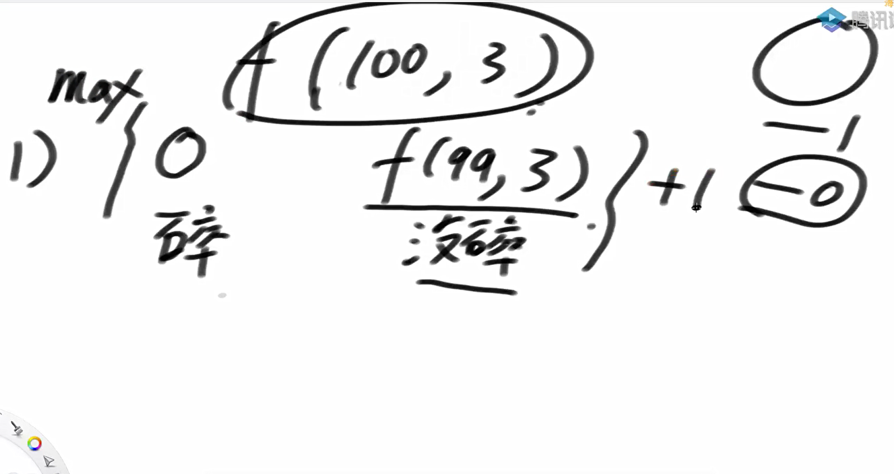

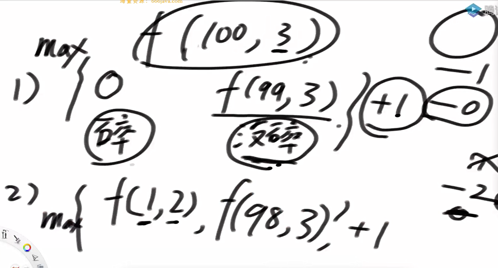

抽象化

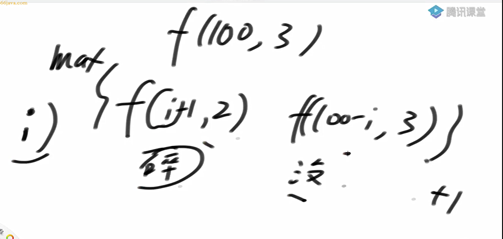

依赖关系

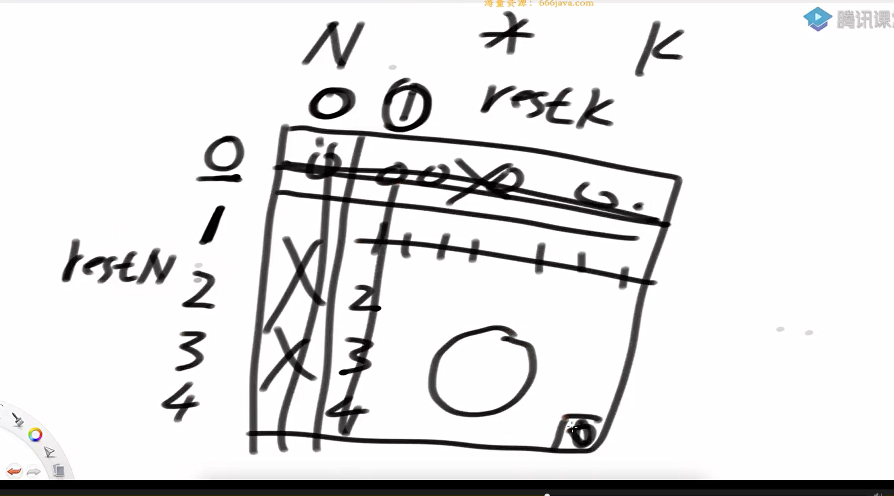

普遍位置的依赖关系

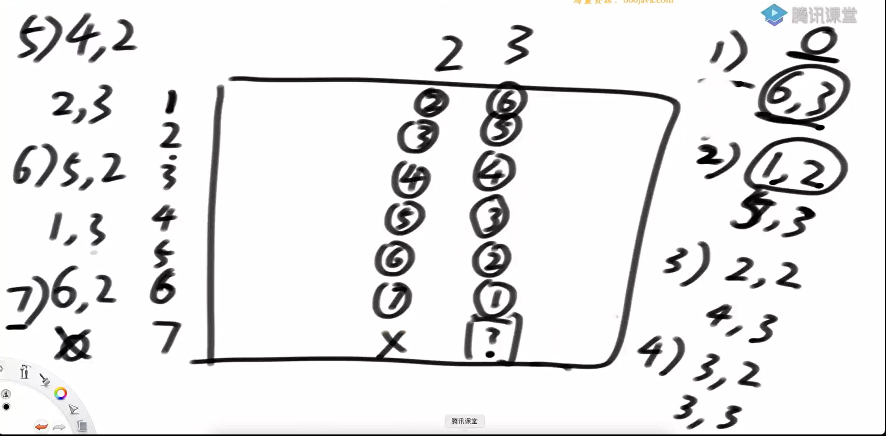

通过举特定的例子来确定普遍位置的依赖关系

分析单调关系

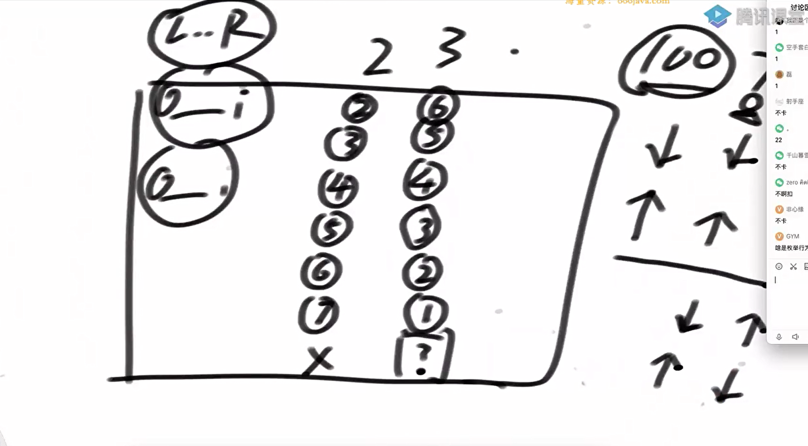

满足上右的关联关系

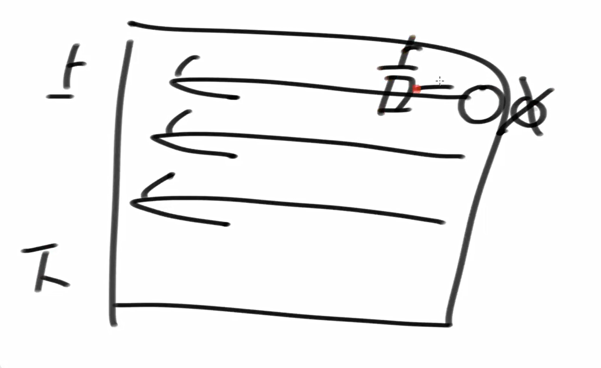

四边型不等式的注意点

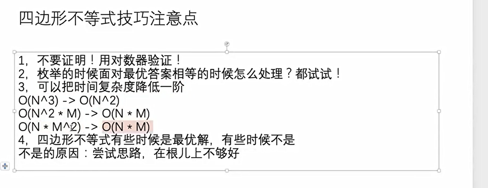

最优解

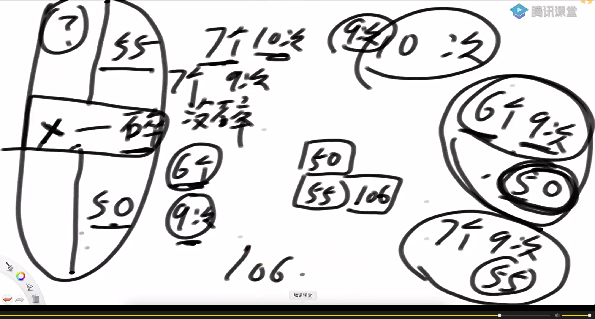

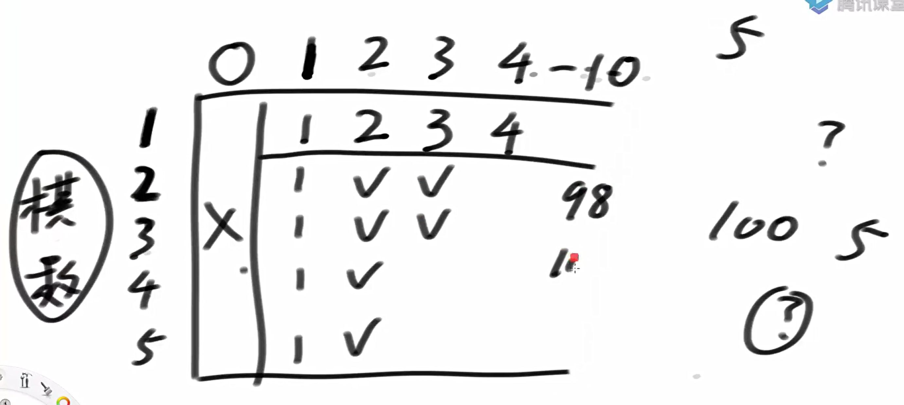

代码实现

```java
package class42;

public class code02_ThrowChessPiecesProblem {
    public static int superEggDrop1(int kChess, int nLevel) {
        if (nLevel < 1 || kChess < 1) {
            return 0;
        }
        return Process1(nLevel, kChess);
    }

    public static int Process1(int rest, int k){
        if (rest == 0){
            return 0;
        }
        if (k == 1){
            return rest;
        }
        int ans = Integer.MIN_VALUE;
        for (int i = 1; i <= rest; i++){// 第一次扔在了第i层
            ans = Math.min(ans, Math.max(Process1(i - 1, k - 1), Process1(rest - i, k)));
        }
        return ans + 1;
    }

    public static int superEggDrop2(int kChess, int nLevel) {
        if (nLevel < 1 || kChess < 1) {
            return 0;
        }
        if (kChess == 1) {
            return nLevel;
        }
        int[][] dp = new int[nLevel + 1][kChess + 1];


        for (int i = 1; i != dp.length; i++) {
            dp[i][1] = i;
        }

        for (int j = 1; j <= nLevel; j++){
            dp[1][j] = 1;
        }

        //dp[l][r] 代表arr[0, l]层，棋子个数为r的最坏情况下的最小尝试次数
        for (int i = 2; i != dp.length; i++) {
            for (int j = 2; j != dp[0].length; j++) {
                int min = Integer.MAX_VALUE;
                for (int k = 1; k != i + 1; k++) {
                    min = Math.min(min, Math.max(dp[k - 1][j - 1], dp[i - k][j]));
                }
                dp[i][j] = min + 1;
            }
        }
        return dp[nLevel][kChess];
    }


    public static int superEggDrop3(int kChess, int nLevel) {
        if (nLevel < 1 || kChess < 1) {
            return 0;
        }
        if (kChess == 1) {
            return nLevel;
        }
        int[][] dp = new int[nLevel + 1][kChess + 1];
        for (int i = 1; i != dp.length; i++) {
            dp[i][1] = i;
        }
        int[][] best = new int[nLevel + 1][kChess + 1];
        for (int i = 1; i != dp[0].length; i++) {
            dp[1][i] = 1;
            best[1][i] = 1;
        }
        for (int i = 2; i < nLevel + 1; i++) {
            for (int j = kChess; j > 1; j--) {
                int ans = Integer.MAX_VALUE;
                int bestChoose = -1;
                int down = best[i - 1][j];
                int up = j == kChess ? i : best[i][j + 1];
                for (int first = down; first <= up; first++) {
                    int cur = Math.max(dp[first - 1][j - 1], dp[i - first][j]);
                    if (cur <= ans) {
                        ans = cur;
                        bestChoose = first;
                    }
                }
                dp[i][j] = ans + 1;
                best[i][j] = bestChoose;
            }
        }
        return dp[nLevel][kChess];
    }

    //在最坏情况下，固定棋子获取最多楼层的最少尝试次数 转化成 固定棋子固定尝试次数的最多楼层。

    public static int superEggDrop4(int kChess, int nLevel) {
        if (nLevel < 1 || kChess < 1) {
            return 0;
        }
        int res = 0;//楼层
        int[] dp = new int[kChess + 1];
        //注意dp[i]是i+1个棋子在res尝试次数下的最多楼层
        while (true){
            int previous = 0;
            res++;
            //i虽然从零开始， 但是代表的是i+1的棋子数
            for (int i = 1; i < dp.length; i++){
                int temp = dp[i];
                dp[i] = dp[i] + previous + 1;
                previous = temp;
                if (dp[i] >= nLevel){
                    return res;
                }
            }
        }
    }
    public static void main(String[] args) {
        int maxN = 500;
        int maxK = 30;
        int testTime = 1000;
        System.out.println("测试开始");
        for (int i = 0; i < testTime; i++) {
            int N = (int) (Math.random() * maxN) + 1;
            int K = (int) (Math.random() * maxK) + 1;
//            int ans1 = superEggDrop1(K, N);
//            int ans2 = superEggDrop2(K, N);
            int ans3 = superEggDrop3(K, N);
            int ans4 = superEggDrop4(K, N);
            if (ans3 != ans4) {
                System.out.println("出错了!");
            }
        }
        System.out.println("测试结束");
    }


}

```

最优方法和41节的问题三的getLessIndex（也是对偶的思想方法）的方法是一样的。通过对立转换得出来的

也就是说这是一种对偶的思想。

在最坏情况下，固定棋子获取最多楼层的最少尝试次数 转化成 固定棋子固定尝试次数的最多楼层。

其中最坏情况下

固定棋子获取最多楼层的最少尝试次数 

固定棋子固定尝试次数的最多楼层。

相互为对偶关系，共享一个最优值

另一个对偶的例子

想象你在找一个最短路径：

	- 原问题是：从 A 到 B，最短路径是哪条？

	- 对偶问题可能是：从 B 到 A，最多能经过多少个点？