**问题一：**

[464. 我能赢吗 - 力扣（LeetCode）](https://leetcode.cn/problems/can-i-win/description/)

在 "100 game" 这个游戏中，两名玩家轮流选择从 1 到 10 的任意整数，累计整数和，先使得累计整数和 **达到或超过**  100 的玩家，即为胜者。

如果我们将游戏规则改为 “玩家 **不能** 重复使用整数” 呢？

例如，两个玩家可以轮流从公共整数池中抽取从 1 到 15 的整数（不放回），直到累计整数和 >= 100。

给定两个整数 maxChoosableInteger （整数池中可选择的最大数）和 desiredTotal（累计和），若先出手的玩家能稳赢则返回 true ，否则返回 false 。假设两位玩家游戏时都表现 **最佳** 。

 

**示例 1：**

**输入：**maxChoosableInteger = 10, desiredTotal = 11**输出：**false**解释：**无论第一个玩家选择哪个整数，他都会失败。第一个玩家可以选择从 1 到 10 的整数。如果第一个玩家选择 1，那么第二个玩家只能选择从 2 到 10 的整数。第二个玩家可以通过选择整数 10（那么累积和为 11 >= desiredTotal），从而取得胜利.同样地，第一个玩家选择任意其他整数，第二个玩家都会赢。

**示例 2:**

**输入：**maxChoosableInteger = 10, desiredTotal = 0**输出：**true

**示例 3:**

**输入：**maxChoosableInteger = 10, desiredTotal = 1**输出：**true

 

**提示:**

- 1 <= maxChoosableInteger <= 20

- 0 <= desiredTotal <= 300

```
public static boolean CanIWin0(int choose, int total){
    //先手第一次遇到0，赢了
    if (total == 0){
        return true;
    }
    //choose的可选范围太小，全选完也达不到
    if ((choose * (choose + 1)) / 2 < total){
        return false;
    }

    int[] arr = new int[choose + 1];
    for (int i = 1; i < arr.length; i++){
        arr[i] = i;
    }
    return process0(arr, total);
}

public static boolean process0(int[] arr, int rest){
    if (rest <= 0){
        return true;
    }
    //-1表示选过了，否则就是没选过
    for (int i = 1; i < arr.length; i++){
        if (arr[i] != -1){
            int cur = arr[i];
            arr[i] = -1;
            boolean next = process0(arr, rest - cur);
            arr[i] = cur;
            //这里的先手，是next中的后手，next中的先手输了，这里的先手也就赢了
            if (!next){
                return true;
            }
        }
    }
    return false;
}
```

暴力递归写出来的时候，考虑使用动态规划。

但是arr的状态实在是太多了，没有办法用一个整形表示。

那么为什么说arr[]的状态突破了整形？

假设 choose = 20：

- arr 数组表示的状态数量是：有多少种选数字的方式？即从 20 个数中选任意子集，总共有 2^20 ≈ 1,048,576 种状态。

- 虽然这个数量还可以用一个整型（int）表示（因为 2^32 > 1M），但如果是 choose = 30，状态数量就达到了 2^30 ≈ 10 亿，已经接近 int 的极限。

- 如果 choose = 32，状态数量是 2^32 ≈ 42 亿，**已经超出了 Java 中 int 的最大值（21 亿左右）**。

- 所以说，**数组 ****arr[]**** 的状态数量爆炸，突破了整型的表示能力**。

两条分支面对同一个分支过程得到的结果一样

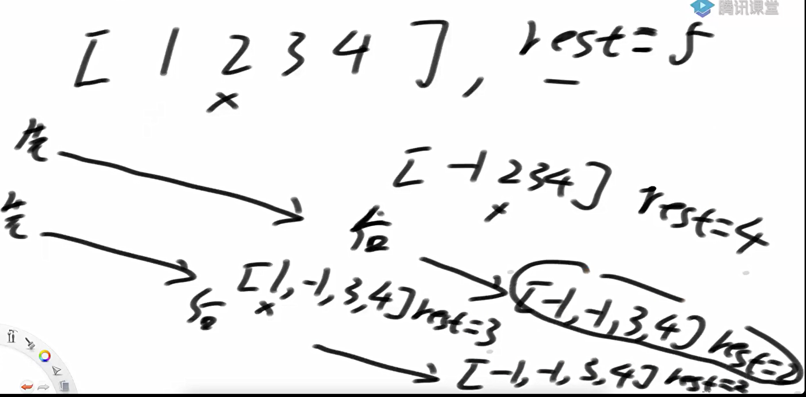

说明做缓存有利可图

这道题和以往动态规划题不同的地方在于，以往动态规划都是某个范围的变化

而这道题是的可变参数是某种状态的变化。

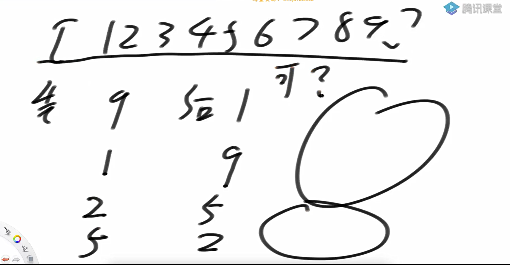

由于在

```
public static boolean canIWin1(int choose, int total) {
    if (total == 0) {
        return true;
    }
    if ((choose * (choose + 1) >> 1) < total) {
        return false;
    }
    return process1(choose, 0, total);
}

public static boolean process1(int choose, int status, int rest){
    if (rest <= 0){
        return true;
    }
    //0表示没拿，1表示拿了
    for (int i = 1; i <= choose; i++){
        if (((1 << i) & status) == 0){
            if (!process1(choose, ((1 << i) | status), rest - i)){
                return true;
            }
        }
    }
    return false;
}
```

中，我们可以得到的是status和rest为可变参数，并且记忆化搜索有利可图

由于状态status可以决定rest，

但是rest无法决定status

那就说明，无需关注rest，只需要关注status，这是由于status可以决定rest使得知道了status，就知道了rest

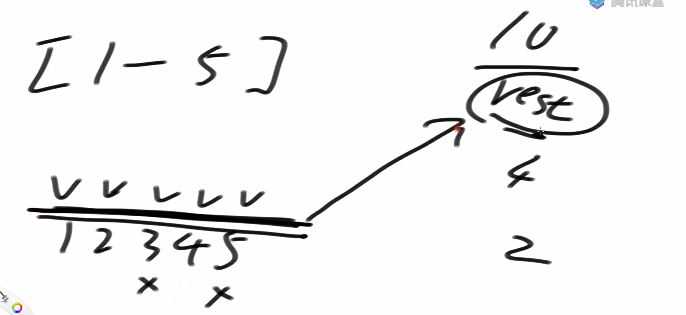

也就是说status和rest不独立，前面的动态规划表都是两个或者一个独立的参数。

dp表大小如何设定？

由于choose的设定是小于20，所以可以用int型数组表示状态的变化

```java
package class43;

public class code01_CanIWin {

    public static boolean CanIWin0(int choose, int total){
        //先手第一次遇到0，赢了
        if (total == 0){
            return true;
        }
        //choose的可选范围太小，全选完也达不到
        if ((choose * (choose + 1)) / 2 < total){
            return false;
        }

        int[] arr = new int[choose + 1];
        for (int i = 1; i < arr.length; i++){
            arr[i] = i;
        }
        return process0(arr, total);
    }

    public static boolean process0(int[] arr, int rest){
        if (rest <= 0){
            return true;
        }
        //-1表示选过了，否则就是没选过
        for (int i = 1; i < arr.length; i++){
            if (arr[i] != -1){
                int cur = arr[i];
                arr[i] = -1;
                boolean next = process0(arr, rest - cur);
                arr[i] = cur;
                //这里的先手，是next中的后手，next中的先手输了，这里的先手也就赢了
                if (!next){
                    return true;
                }
            }
        }
        return false;
    }

    // 这个是暴力尝试，思路是正确的，超时而已
    public static boolean canIWin1(int choose, int total) {
        if (total == 0) {
            return true;
        }
        if ((choose * (choose + 1) >> 1) < total) {
            return false;
        }
        return process1(choose, 0, total);
    }

    public static boolean process1(int choose, int status, int rest){
        if (rest <= 0){
            return true;
        }
        //0表示没拿，1表示拿了
        for (int i = 1; i <= choose; i++){
            if (((1 << i) & status) == 0){
                if (!process1(choose, ((1 << i) | status), rest - i)){
                    return true;
                }
            }
        }
        return false;
    }
    // 这个是暴力尝试，思路是正确的，超时而已
    public static boolean canIWin2(int choose, int total) {
        if (total == 0) {
            return true;
        }
        if ((choose * (choose + 1) >> 1) < total) {
            return false;
        }
        //0位置不要了
        int[] dp = new int[1 << (choose + 1)];
        //dp中各个值的含义
        //1代表 赢了 true
        //-1代表输了 false
        //0 代表没算过 要计算一下
        return process2(choose, 0, total, dp);
    }

    public static boolean process2(int choose, int status, int rest, int[] dp){
        if (dp[status] != 0){
            return dp[status] == 1 ? true : false;
        }

        boolean ans = false;
        for (int i = 1; i <= choose; i++){
            if (((1 << i) & status) == 0){
                if (!process1(choose, ((1 << i) | status), rest - i)){
                    ans = true;
                    break;
                }
            }
        }
        dp[status] = ans ? 1 : -1;
        return ans;
    }

}

```

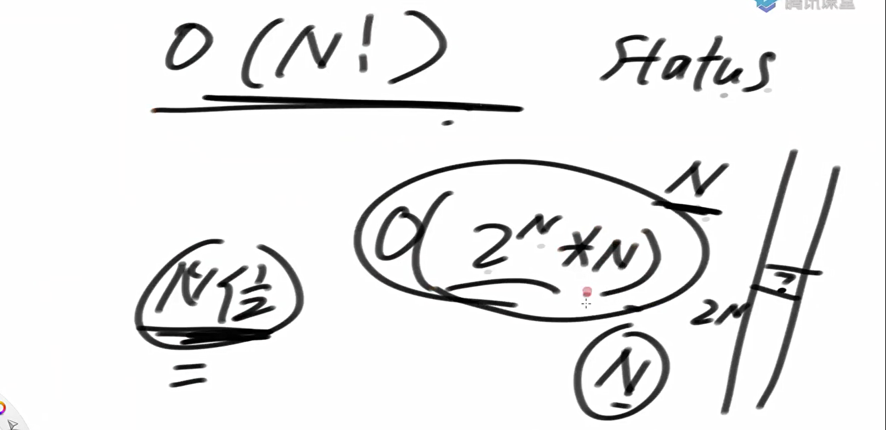

复杂度分析

暴力递归过程的原则

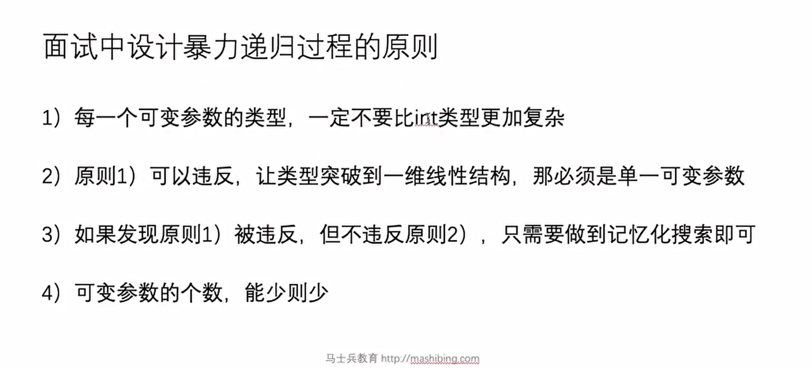

暴力递归原则被突破了之后呢

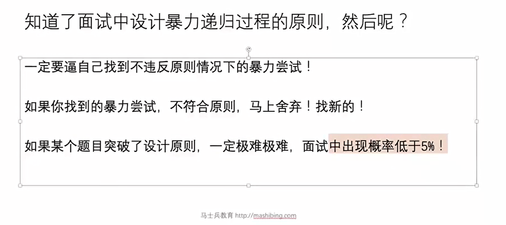

类的题目的特征

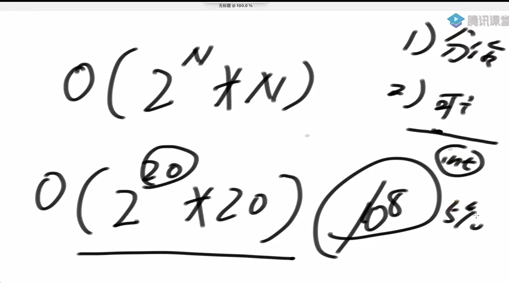

问题二：

TSP问题 有N个城市，任何两个城市之间的都有距离，任何一座城市到自己的距离都为0。所有点到点的距离都存在一个N*N的二维数组matrix里，也就是整张图由邻接矩阵表示。现要求一旅行商从k城市 出发必须经过每一个城市且只在一个城市逗留一次，最后回到出发的k城，返回总距离最短的路的 距离。参数给定一个matrix，给定k。

问题简化描述

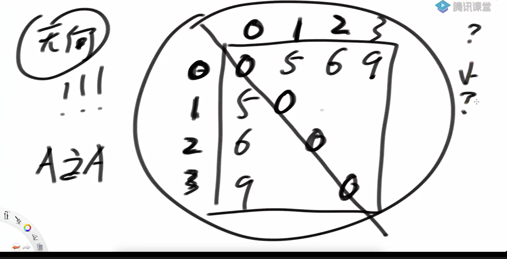

 

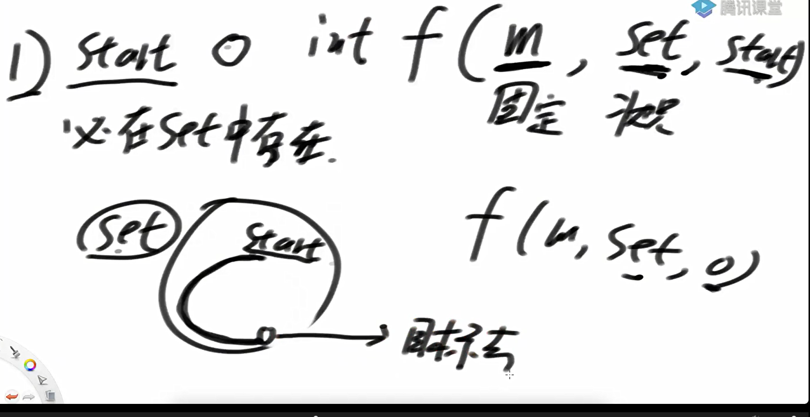

暴力怎么写？

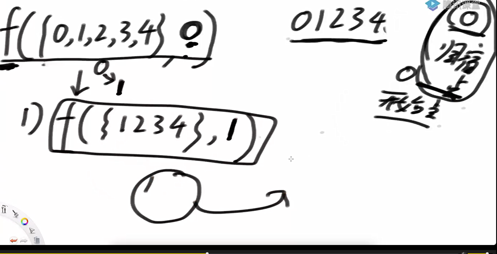

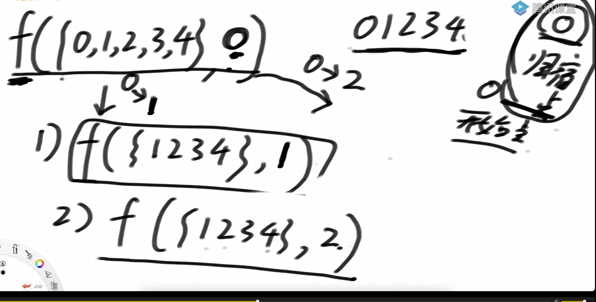

注意无论是走1还是2，最终都要回到总归宿点

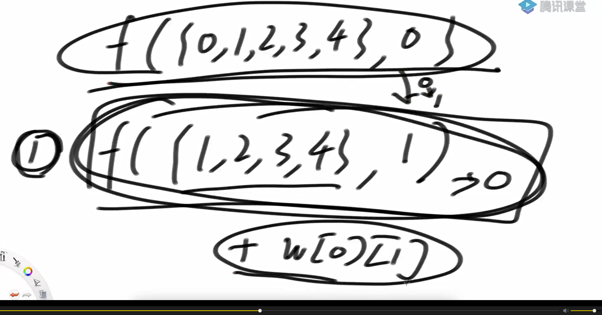

注意答案收集的细节

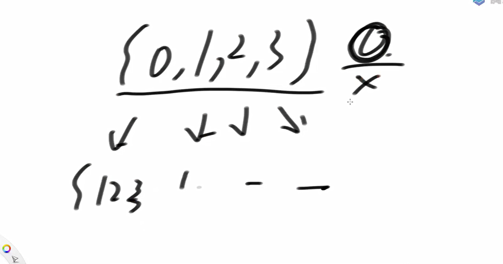

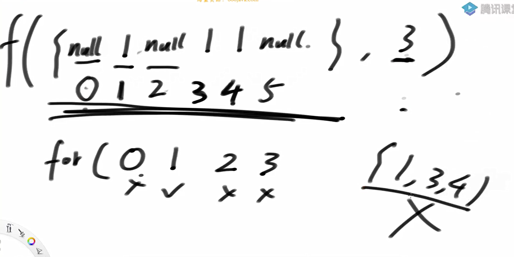

用这样的集合表示是为了还原现场

是否可以状态结果共享？

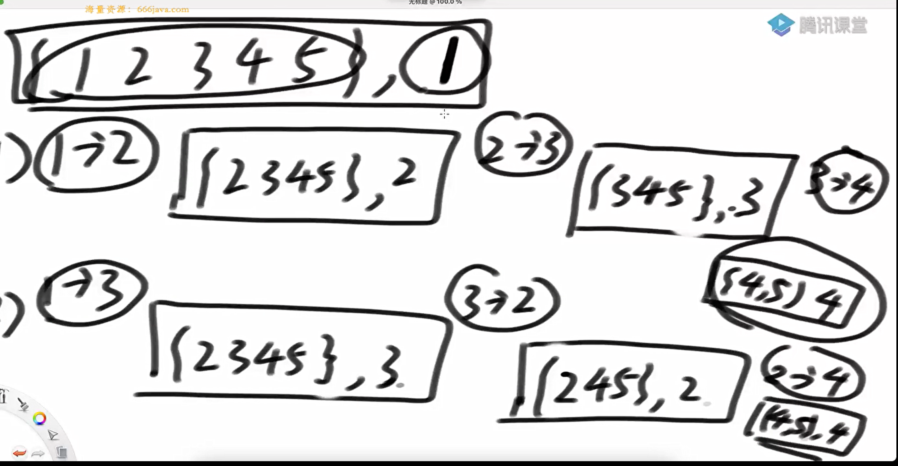

如果dp的可变参数是存在或者不存在的情况，那么可以使用剪枝优化

如果dp中的可变参数是范围，那么说明试法有问题

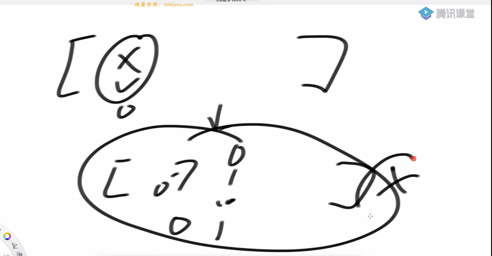

代码实现

```java
package class43;

import java.util.ArrayList;
import java.util.List;

public class code02_TSP {

    public static int t1(int[][] matrix){
        int N = matrix.length;

        List<Integer> set = new ArrayList<>();
        for (int i = 0; i < N; i++){
            set.add(1);
        }
        return process1(matrix, set, 0);
    }

    public static int process1(int[][] matrix, List<Integer> set, int stay){
        int nowCityNum = 0;
        for (int i = 0; i < set.size(); i++){
            if (set.get(i) != null){
                nowCityNum++;
            }
        }
        if (nowCityNum == 1){
            return matrix[stay][0];
        }

        set.set(stay, null);
        int min = Integer.MIN_VALUE;
        for (int i = 0; i < set.size(); i++){
            if (set.get(i) != null){
                int cur = matrix[stay][i] + process1(matrix, set, i);
                min = Math.min(min, cur);
            }
        }
        set.set(stay, 1);
        return min;
    }

    public static int t2(int[][] matrix){
        int N = matrix.length;
        int allCityStatus = 1 << N - 1;
        return process2(matrix, allCityStatus, 0);
    }

    public static int process2(int[][] matrix, int cityStatus, int stay){
        if (cityStatus == (~cityStatus + 1)){
            return matrix[stay][0];
        }

        // 把start位的1去掉，
        cityStatus &= (~(1 << stay));
        int min = Integer.MIN_VALUE;
        for (int move = 0; move < matrix.length; move++){
            if ((cityStatus & (1 << move)) != 0){
                int cur = matrix[stay][move] + process2(matrix, cityStatus, move);
                min = Math.min(min, cur);
            }
        }
        //还原现场
        cityStatus |= (1 << stay);
        return min;
    }

    public static int t3(int[][] matrix){
        int N = matrix.length;
        int allCityStatus = 1 << N - 1;
        int[][] dp = new int[1 << N][N];

        for (int i = 0; i < 1 << N; i++){
            for (int j = 0; j < N; j++){
                dp[i][j] = -1;
            }
        }
        return process3(matrix, allCityStatus, 0, dp);
    }

    public static int process3(int[][] matrix, int cityStatus, int stay, int[][] dp){
        if (dp[cityStatus][stay] != -1){
            return dp[cityStatus][stay];
        }
        if (cityStatus == (cityStatus & (~cityStatus + 1))) {
            dp[cityStatus][stay] = matrix[stay][0];
        } else {
            // 把start位的1去掉，
            cityStatus &= (~(1 << stay));
            int min = Integer.MAX_VALUE;
            // 枚举所有的城市
            for (int move = 0; move < matrix.length; move++) {
                if ((cityStatus & (1 << move)) != 0) {
                    int cur = matrix[stay][move] + process3(matrix, cityStatus, move, dp);
                    min = Math.min(min, cur);
                }
            }
            cityStatus |= (1 << stay);
            dp[cityStatus][stay] = min;
        }
        return dp[cityStatus][stay];
    }
}

```

状态转移即算了，遇到的很少，并且和复杂

**问题三：**

你有无限的1*2的砖块，要铺满M*N的区域，不同的铺法有多少种？

为什么只规定一个瓷砖只可以往上铺和往右铺而不影响结果？

也就说用上下左右方向的铺法，都可以转化为向上铺和向右铺的框架内，由于是等价的所以不会影响结果

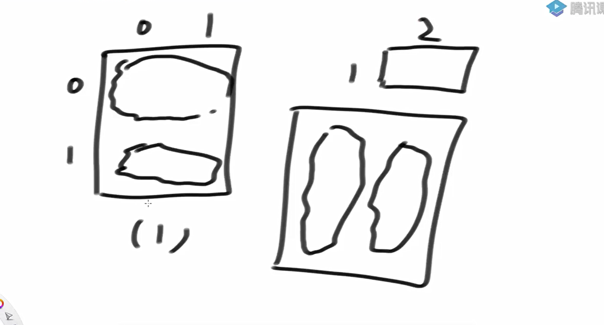

如果缺了那一块都记下来，肯定挂

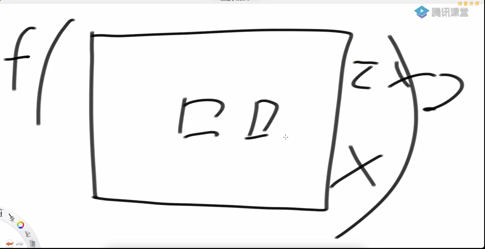

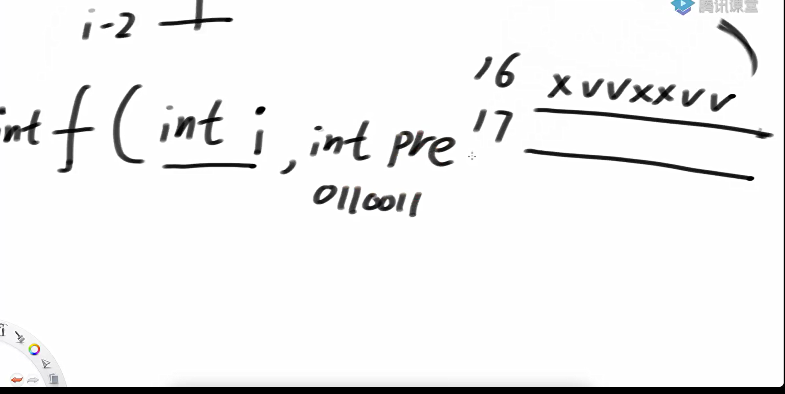

i-2及以上都是满的。i-1行标记状态

第i行，是把i及其以上的行都填满的方法数

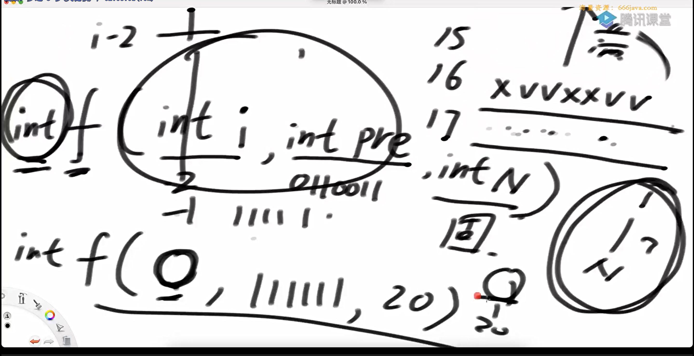

截止条件：

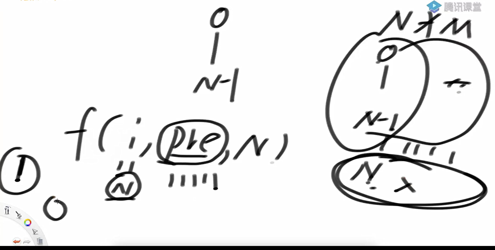

怎么做决定？

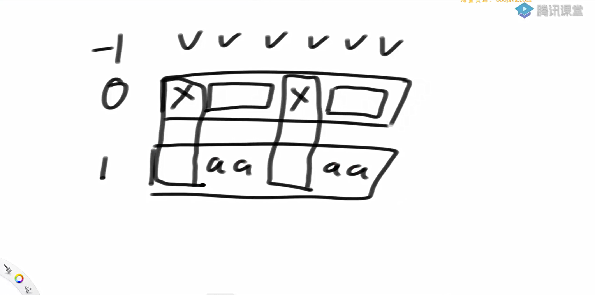

深度优先遍历处理

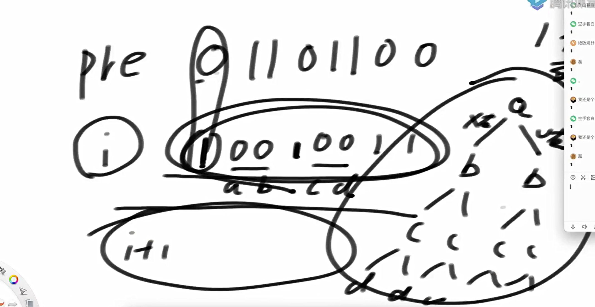

然后把状态转到i+1部分

dfs怎么做决定？

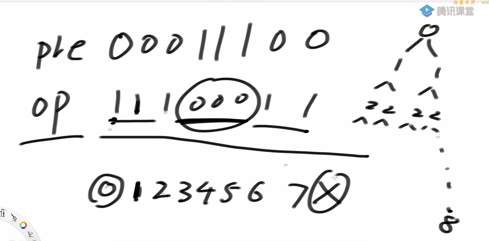

做决定的时候，dfs和process的关系

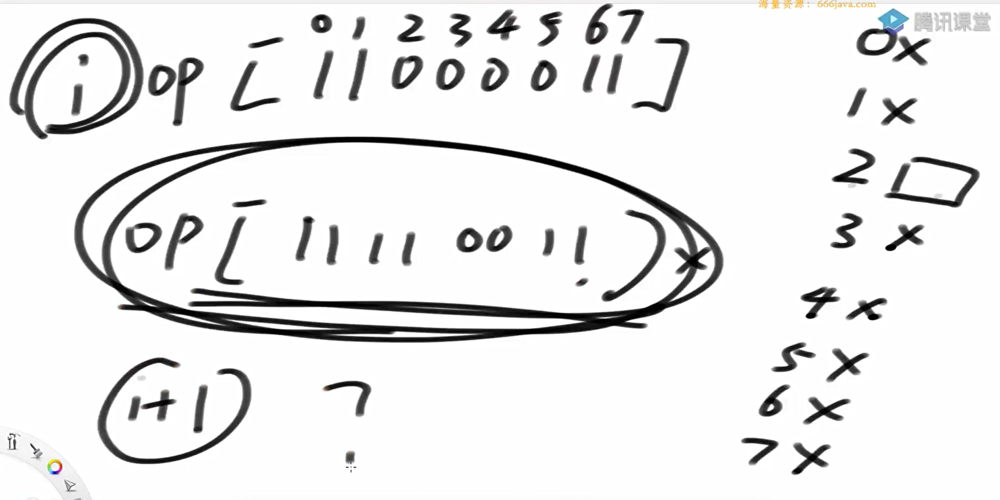

位计算 pre

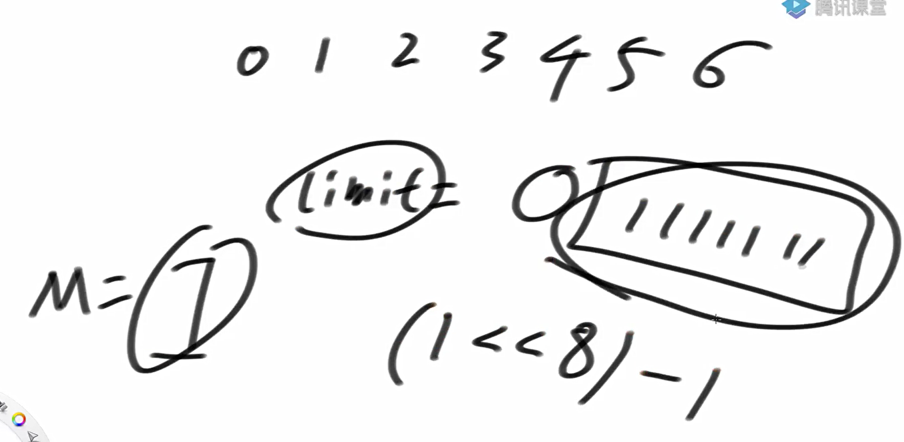

位运算做决定时候的细节

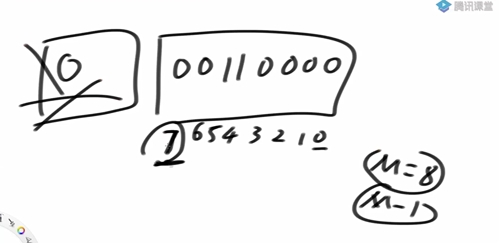