后缀数组

后缀字符串

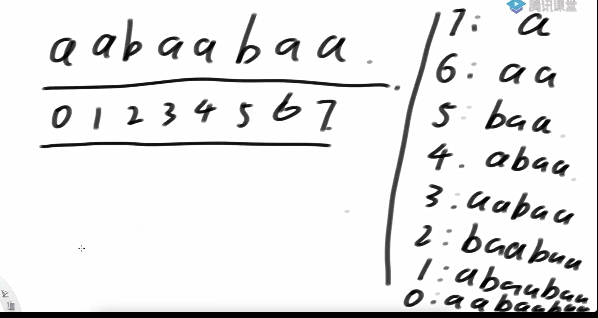

后缀数组


就是所有的后缀进行字典序的排序，然后放入一个数组中

暴力生成所有后缀串

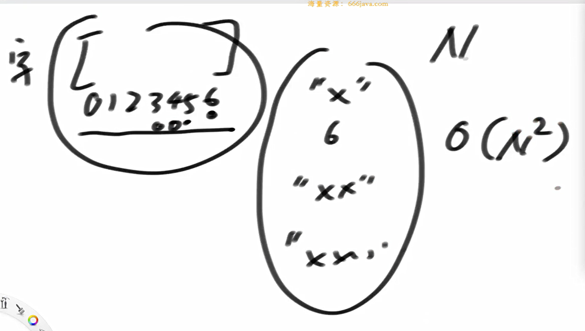

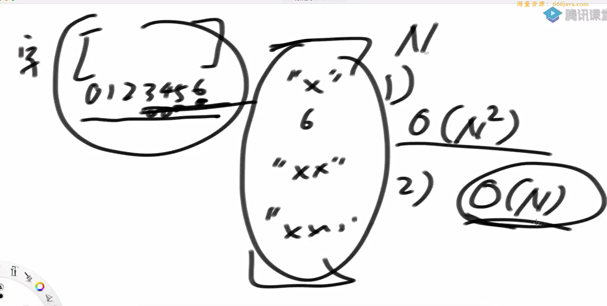

生成所有后缀的复杂度是O（N^2），而所有后缀数组的规模是O（N）（一个后缀数组是一个位置）


计算的代价

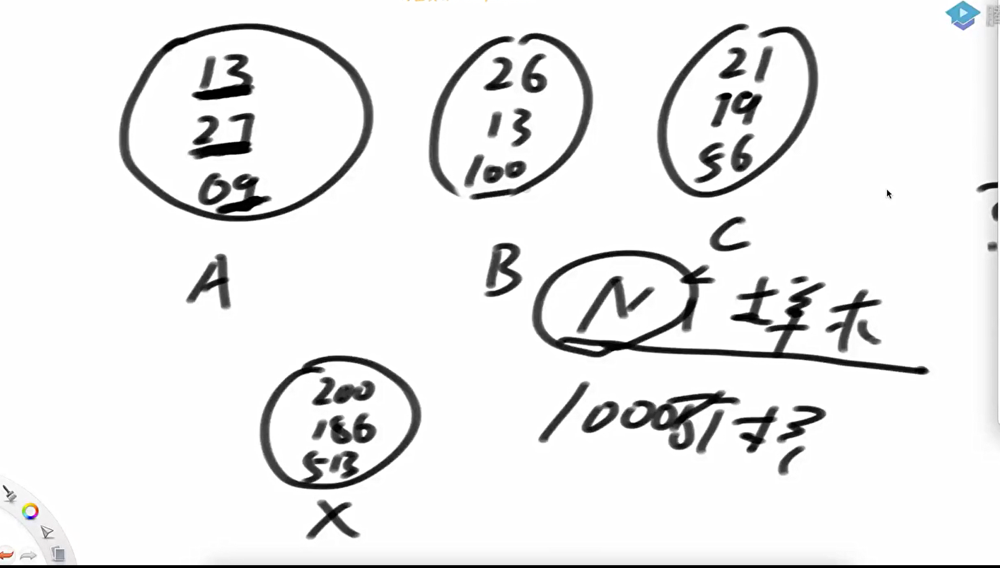

基数排序


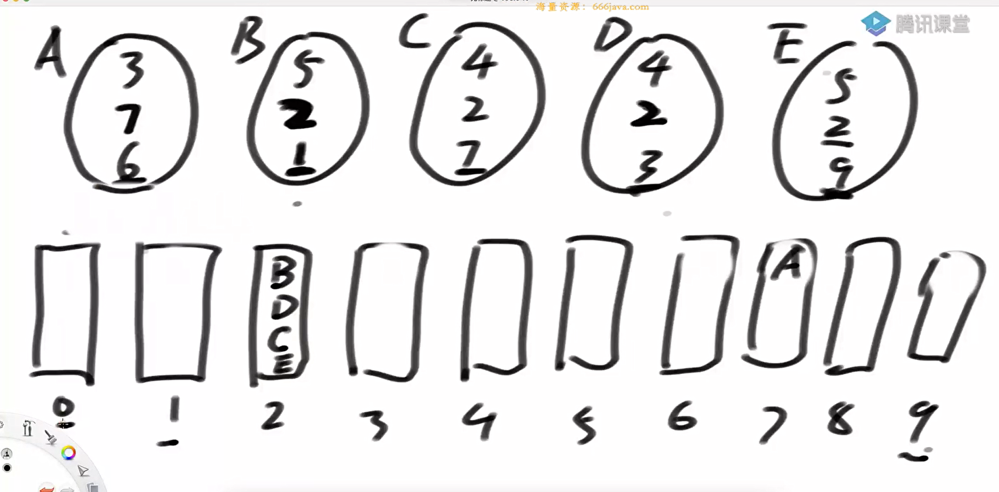

先进去的先出来


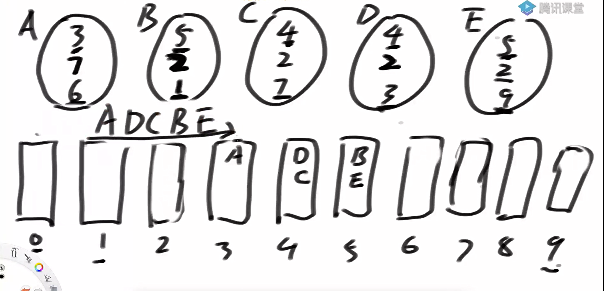

基数排序的注意点


由于算字符数组实际上是在算起ascii码，所以，如果数组是数字的话，也可以算字符数组


将数组分为3类


dc3算法具体操作

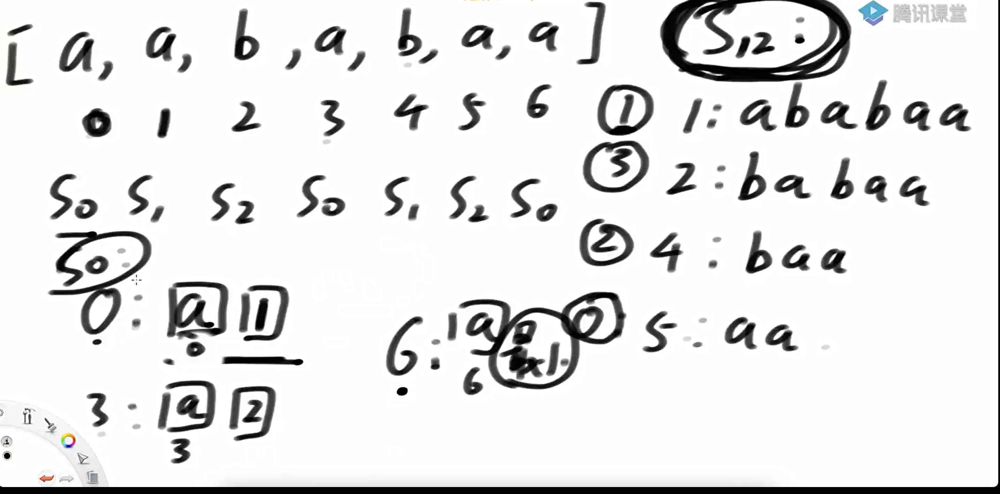

这样s0就可以用基数排序了


merge

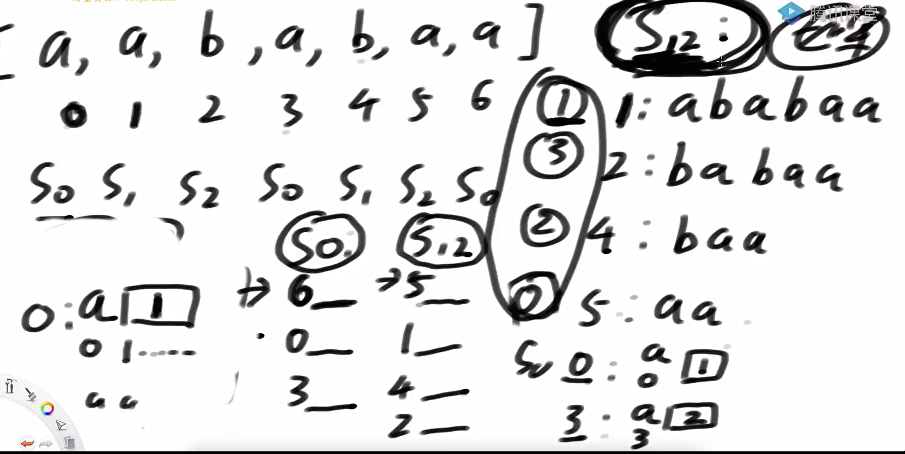

merge过程

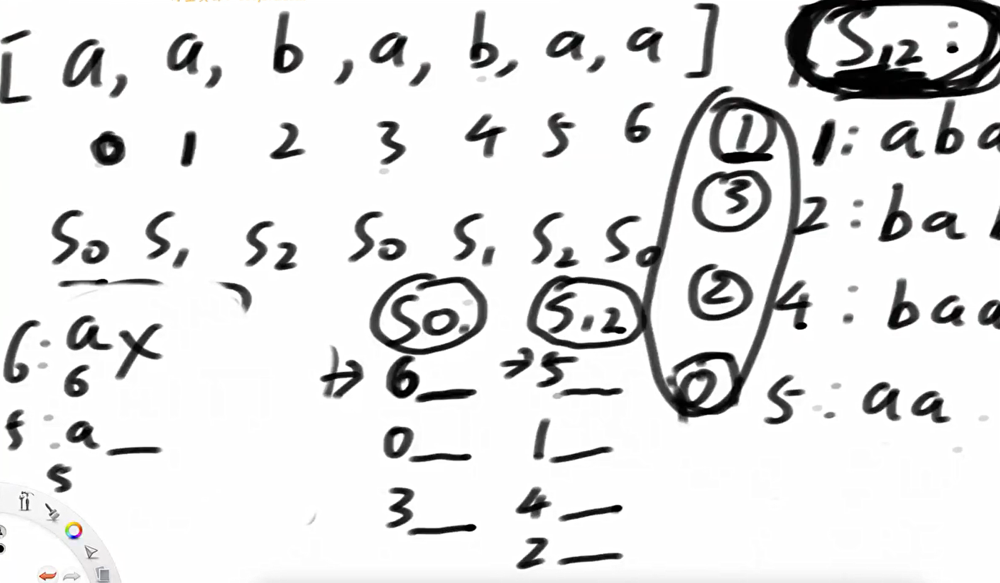

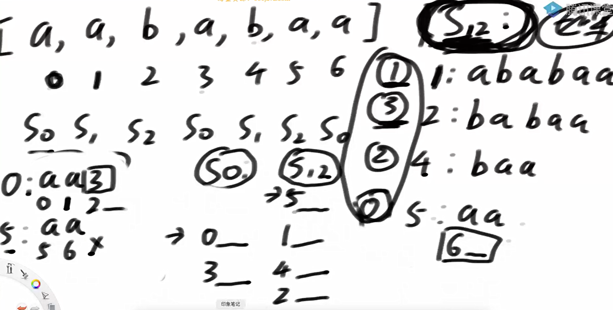

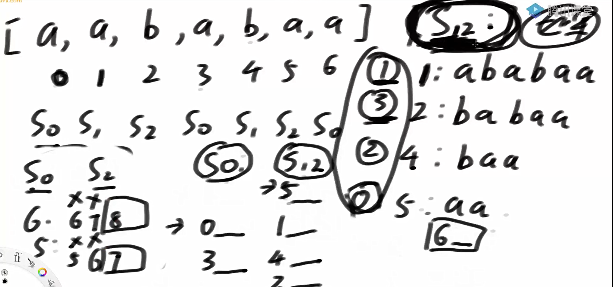


最多比三维


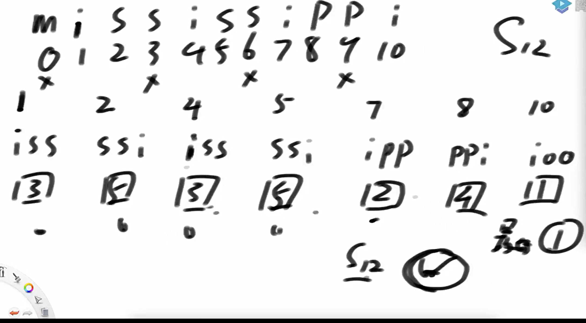

s12的比较结果得出之后，如果遇到排名相同的名次。

那么可以通过数组递归得到同样的情况下的排名


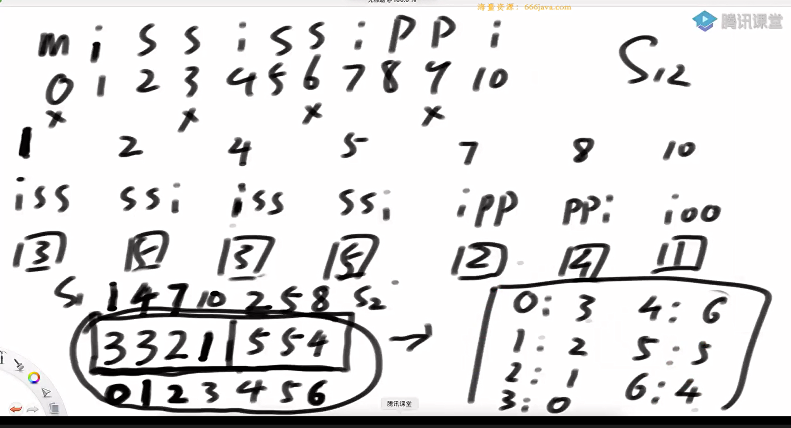

可以让s12悬而未决的排名全部精确


巧妙的将缺少的字符排名得到了

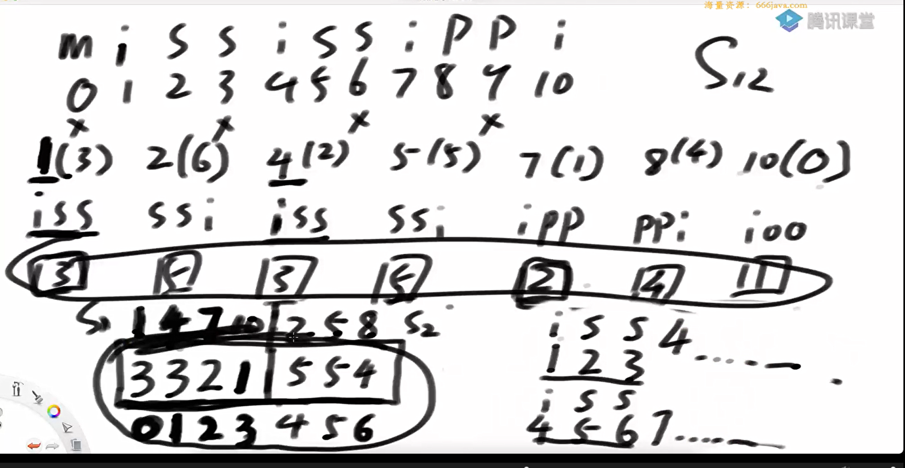


即便两个3的位置不同，也能解决


边界问题，比如7后面啥也没有了，但是在新数组中7后面的是2。这个时候，就在7后面补一个很小的数，保证合理性，防止7后面是2这种不合理的情况发生


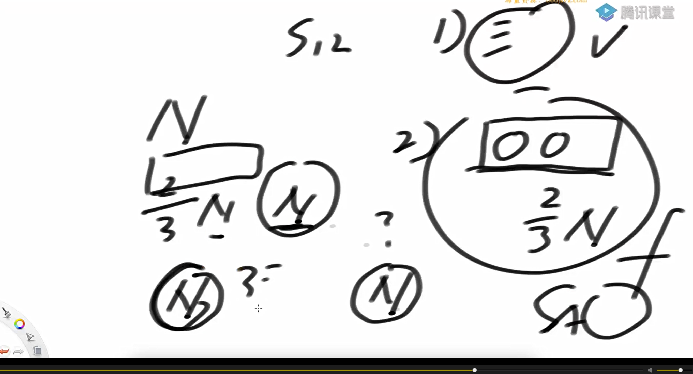

复杂度分析

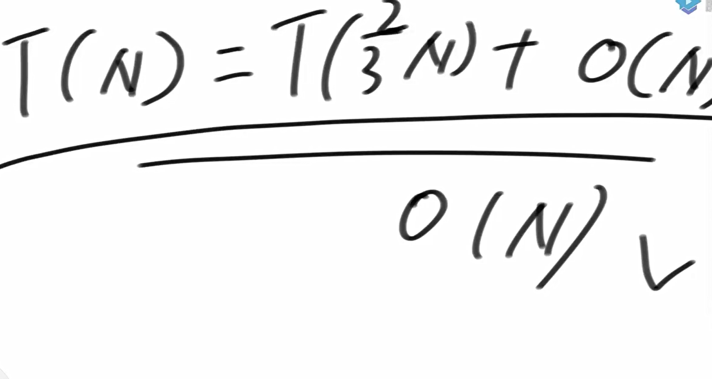

7为什么要加比较小的数和后面的2隔开，是为了保证得到排名和老数组一样


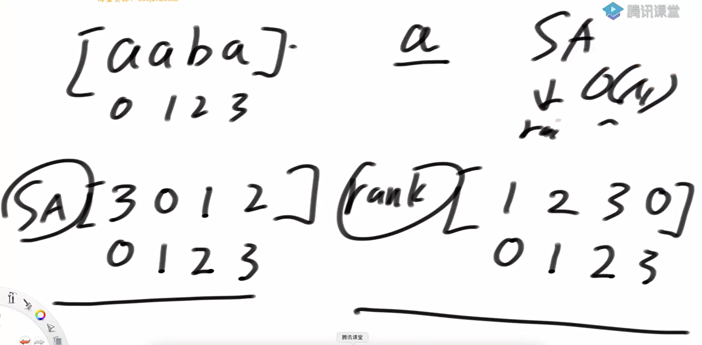

DC3限制条件

// 构造方法的约定:

	// 数组叫nums，如果你是字符串，请转成整型数组nums

	// 数组中，最小值>=1

	// 如果不满足，处理成满足的，也不会影响使用

	// max, nums里面最大值是多少

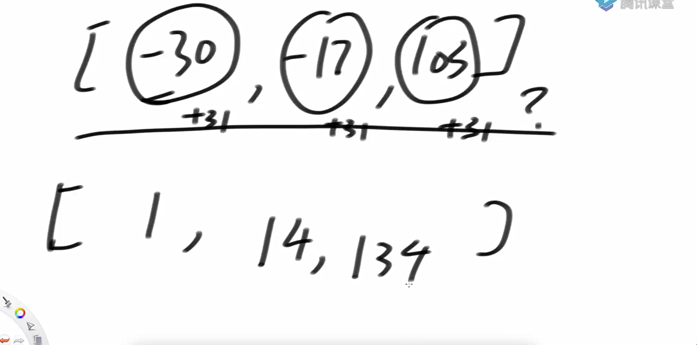

DC3算法实现，老师说当成黑盒就行

```java
package class44;

public class DC3 {

        public int[] sa;

        public int[] rank;

        public int[] height;

        // 构造方法的约定:
        // 数组叫nums，如果你是字符串，请转成整型数组nums
        // 数组中，最小值>=1
        // 如果不满足，处理成满足的，也不会影响使用
        // max, nums里面最大值是多少
        public DC3(int[] nums, int max) {
            sa = sa(nums, max);
            rank = rank();
            height = height(nums);
        }

        private int[] sa(int[] nums, int max) {
            int n = nums.length;
            int[] arr = new int[n + 3];
            for (int i = 0; i < n; i++) {
                arr[i] = nums[i];
            }
            return skew(arr, n, max);
        }

        private int[] skew(int[] nums, int n, int K) {
            int n0 = (n + 2) / 3, n1 = (n + 1) / 3, n2 = n / 3, n02 = n0 + n2;
            int[] s12 = new int[n02 + 3], sa12 = new int[n02 + 3];
            for (int i = 0, j = 0; i < n + (n0 - n1); ++i) {
                if (0 != i % 3) {
                    s12[j++] = i;
                }
            }
            radixPass(nums, s12, sa12, 2, n02, K);
            radixPass(nums, sa12, s12, 1, n02, K);
            radixPass(nums, s12, sa12, 0, n02, K);
            int name = 0, c0 = -1, c1 = -1, c2 = -1;
            for (int i = 0; i < n02; ++i) {
                if (c0 != nums[sa12[i]] || c1 != nums[sa12[i] + 1] || c2 != nums[sa12[i] + 2]) {
                    name++;
                    c0 = nums[sa12[i]];
                    c1 = nums[sa12[i] + 1];
                    c2 = nums[sa12[i] + 2];
                }
                if (1 == sa12[i] % 3) {
                    s12[sa12[i] / 3] = name;
                } else {
                    s12[sa12[i] / 3 + n0] = name;
                }
            }
            if (name < n02) {
                sa12 = skew(s12, n02, name);
                for (int i = 0; i < n02; i++) {
                    s12[sa12[i]] = i + 1;
                }
            } else {
                for (int i = 0; i < n02; i++) {
                    sa12[s12[i] - 1] = i;
                }
            }
            int[] s0 = new int[n0], sa0 = new int[n0];
            for (int i = 0, j = 0; i < n02; i++) {
                if (sa12[i] < n0) {
                    s0[j++] = 3 * sa12[i];
                }
            }
            radixPass(nums, s0, sa0, 0, n0, K);
            int[] sa = new int[n];
            for (int p = 0, t = n0 - n1, k = 0; k < n; k++) {
                int i = sa12[t] < n0 ? sa12[t] * 3 + 1 : (sa12[t] - n0) * 3 + 2;
                int j = sa0[p];
                if (sa12[t] < n0 ? leq(nums[i], s12[sa12[t] + n0], nums[j], s12[j / 3])
                        : leq(nums[i], nums[i + 1], s12[sa12[t] - n0 + 1], nums[j], nums[j + 1], s12[j / 3 + n0])) {
                    sa[k] = i;
                    t++;
                    if (t == n02) {
                        for (k++; p < n0; p++, k++) {
                            sa[k] = sa0[p];
                        }
                    }
                } else {
                    sa[k] = j;
                    p++;
                    if (p == n0) {
                        for (k++; t < n02; t++, k++) {
                            sa[k] = sa12[t] < n0 ? sa12[t] * 3 + 1 : (sa12[t] - n0) * 3 + 2;
                        }
                    }
                }
            }
            return sa;
        }

        private void radixPass(int[] nums, int[] input, int[] output, int offset, int n, int k) {
            int[] cnt = new int[k + 1];
            for (int i = 0; i < n; ++i) {
                cnt[nums[input[i] + offset]]++;
            }
            for (int i = 0, sum = 0; i < cnt.length; ++i) {
                int t = cnt[i];
                cnt[i] = sum;
                sum += t;
            }
            for (int i = 0; i < n; ++i) {
                output[cnt[nums[input[i] + offset]]++] = input[i];
            }
        }

        private boolean leq(int a1, int a2, int b1, int b2) {
            return a1 < b1 || (a1 == b1 && a2 <= b2);
        }

        private boolean leq(int a1, int a2, int a3, int b1, int b2, int b3) {
            return a1 < b1 || (a1 == b1 && leq(a2, a3, b2, b3));
        }

        private int[] rank() {
            int n = sa.length;
            int[] ans = new int[n];
            for (int i = 0; i < n; i++) {
                ans[sa[i]] = i;
            }
            return ans;
        }

        private int[] height(int[] s) {
            int n = s.length;
            int[] ans = new int[n];
            for (int i = 0, k = 0; i < n; ++i) {
                if (rank[i] != 0) {
                    if (k > 0) {
                        --k;
                    }
                    int j = sa[rank[i] - 1];
                    while (i + k < n && j + k < n && s[i + k] == s[j + k]) {
                        ++k;
                    }
                    ans[rank[i]] = k;
                }
            }
            return ans;
        }

        // 为了测试
        public static int[] randomArray(int len, int maxValue) {
            int[] arr = new int[len];
            for (int i = 0; i < len; i++) {
                arr[i] = (int) (Math.random() * maxValue) + 1;
            }
            return arr;
        }

        // 为了测试
        public static void main(String[] args) {
            int len = 100000;
            int maxValue = 100;
            long start = System.currentTimeMillis();
            new DC3(randomArray(len, maxValue), maxValue);
            long end = System.currentTimeMillis();
            System.out.println("数据量 " + len + ", 运行时间 " + (end - start) + " ms");
        }


}

```

问题一：

	[1163. 按字典序排在最后的子串 - 力扣（LeetCode）](https://leetcode.cn/problems/last-substring-in-lexicographical-order/description/)

给你一个字符串 s ，找出它的所有子串并按字典序排列，返回排在最后的那个子串。

示例 1:

```
深色版本输入: s = "abab"
输出: "bab"
解释: 我们可以找出 7 个子串 ["a", "ab", "aba", "abab", "b", "ba", "bab"]。按字典序排在最后的子串是 "bab"。
```

示例 2:

```
深色版本输入: s = "leetcode"
输出: "tcode"
```

提示:

- 1 <= s.length <= 4 * 10^5

- s 仅含有小写英文字符。

代码实现

```java
package class44;


public class code01_LastSubstringInLexicographicalOrder {
    public static String lastSubstring(String s) {
        if (s == null || s.length() == 0) {
            return s;
        }
        int N = s.length();
        char[] str = s.toCharArray();
        int min = Integer.MAX_VALUE;
        int max = Integer.MIN_VALUE;
        for (char cha : str) {
            min = Math.min(min, cha);
            max = Math.max(max, cha);
        }
        int[] arr = new int[N];
        for (int i = 0; i < N; i++) {
            arr[i] = str[i] - min + 1;
        }
        DC3 dc3 = new DC3(arr, max - min + 1);
        return s.substring(dc3.sa[N - 1]);
    }

    public static class DC3 {

        public int[] sa;

        public DC3(int[] nums, int max) {
            sa = sa(nums, max);
        }

        private int[] sa(int[] nums, int max) {
            int n = nums.length;
            int[] arr = new int[n + 3];
            for (int i = 0; i < n; i++) {
                arr[i] = nums[i];
            }
            return skew(arr, n, max);
        }

        private int[] skew(int[] nums, int n, int K) {
            int n0 = (n + 2) / 3, n1 = (n + 1) / 3, n2 = n / 3, n02 = n0 + n2;
            int[] s12 = new int[n02 + 3], sa12 = new int[n02 + 3];
            for (int i = 0, j = 0; i < n + (n0 - n1); ++i) {
                if (0 != i % 3) {
                    s12[j++] = i;
                }
            }
            radixPass(nums, s12, sa12, 2, n02, K);
            radixPass(nums, sa12, s12, 1, n02, K);
            radixPass(nums, s12, sa12, 0, n02, K);
            int name = 0, c0 = -1, c1 = -1, c2 = -1;
            for (int i = 0; i < n02; ++i) {
                if (c0 != nums[sa12[i]] || c1 != nums[sa12[i] + 1] || c2 != nums[sa12[i] + 2]) {
                    name++;
                    c0 = nums[sa12[i]];
                    c1 = nums[sa12[i] + 1];
                    c2 = nums[sa12[i] + 2];
                }
                if (1 == sa12[i] % 3) {
                    s12[sa12[i] / 3] = name;
                } else {
                    s12[sa12[i] / 3 + n0] = name;
                }
            }
            if (name < n02) {
                sa12 = skew(s12, n02, name);
                for (int i = 0; i < n02; i++) {
                    s12[sa12[i]] = i + 1;
                }
            } else {
                for (int i = 0; i < n02; i++) {
                    sa12[s12[i] - 1] = i;
                }
            }
            int[] s0 = new int[n0], sa0 = new int[n0];
            for (int i = 0, j = 0; i < n02; i++) {
                if (sa12[i] < n0) {
                    s0[j++] = 3 * sa12[i];
                }
            }
            radixPass(nums, s0, sa0, 0, n0, K);
            int[] sa = new int[n];
            for (int p = 0, t = n0 - n1, k = 0; k < n; k++) {
                int i = sa12[t] < n0 ? sa12[t] * 3 + 1 : (sa12[t] - n0) * 3 + 2;
                int j = sa0[p];
                if (sa12[t] < n0 ? leq(nums[i], s12[sa12[t] + n0], nums[j], s12[j / 3])
                        : leq(nums[i], nums[i + 1], s12[sa12[t] - n0 + 1], nums[j], nums[j + 1], s12[j / 3 + n0])) {
                    sa[k] = i;
                    t++;
                    if (t == n02) {
                        for (k++; p < n0; p++, k++) {
                            sa[k] = sa0[p];
                        }
                    }
                } else {
                    sa[k] = j;
                    p++;
                    if (p == n0) {
                        for (k++; t < n02; t++, k++) {
                            sa[k] = sa12[t] < n0 ? sa12[t] * 3 + 1 : (sa12[t] - n0) * 3 + 2;
                        }
                    }
                }
            }
            return sa;
        }

        private void radixPass(int[] nums, int[] input, int[] output, int offset, int n, int k) {
            int[] cnt = new int[k + 1];
            for (int i = 0; i < n; ++i) {
                cnt[nums[input[i] + offset]]++;
            }
            for (int i = 0, sum = 0; i < cnt.length; ++i) {
                int t = cnt[i];
                cnt[i] = sum;
                sum += t;
            }
            for (int i = 0; i < n; ++i) {
                output[cnt[nums[input[i] + offset]]++] = input[i];
            }
        }

        private boolean leq(int a1, int a2, int b1, int b2) {
            return a1 < b1 || (a1 == b1 && a2 <= b2);
        }

        private boolean leq(int a1, int a2, int a3, int b1, int b2, int b3) {
            return a1 < b1 || (a1 == b1 && leq(a2, a3, b2, b3));
        }

    }
}

```