**问题一 **[https://leetcode.com/problems/burst-balloons/](https://leetcode.com/problems/burst-balloons/)

给定一个数组 arr，代表一排有分数的气球。每打爆一个气球都能获得分数，假设打爆气球的分数为 X，获得分数的规则如下: 1)如果被打爆气球的左边有没被打爆的气球，找到离被打爆气球最近的气球，假设分数为 L;如果被打爆气球的右边有没被打爆的气球，找到离被打爆气球最近的气球，假设分数为 R。获得分数为 L*X*R。2)如果被打爆气球的左边有没被打爆的气球，找到离被打爆气球最近的气球，假设分数为 L;如果被打爆气球的右边所有气球都已经被打爆。获得分数为 L*X。3)如果被打爆气球的左边所有的气球都已经被打爆;如果被打爆气球的右边有没被打爆的气球，找到离被打爆气球最近的气球，假设分数为 R;如果被打爆气球的右边所有气球都已经被打爆。获得分数为 X*R。4)如果被打爆气球的左边和右边所有的气球都已经被打爆。获得分数为 X。

目标是打爆所有气球，获得每次打爆的分数。通过选择打爆气球的顺序，可以得到不同的总分，请返回能获得的最大分数。

【举例】

arr = {3,2,5} 如果先打爆3，获得3*2;再打爆2，获得2*5;最后打爆5，获得5;最后总分21 如果先打爆3，获得3*2;再打爆5，获得2*5;最后打爆2，获得2;最后总分18 如果先打爆2，获得3*2*5;再打爆3，获得3*5;最后打爆5，获得5;最后总分50 如果先打爆2，获得3*2*5;再打爆5，获得3*5;最后打爆3，获得3;最后总分48 如果先打爆5，获得2*5;再打爆3，获得3*2;最后打爆2，获得2;最后总分18 如果先打爆5，获得2*5;再打爆2，获得3*2;最后打爆3，获得3;最后总分19 返回能获得的最大分数为50

举例

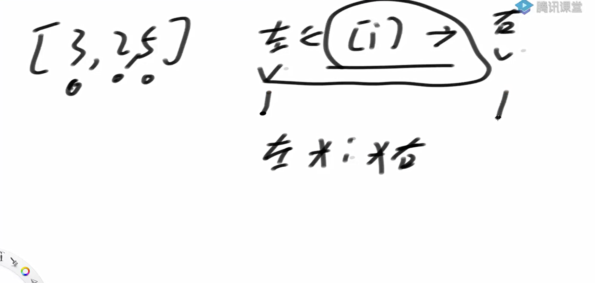

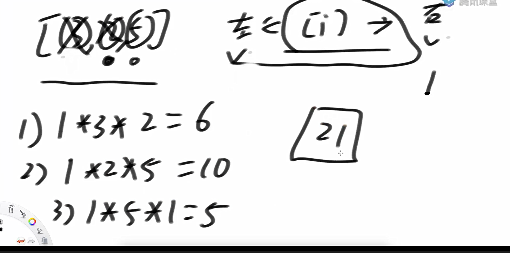

举例

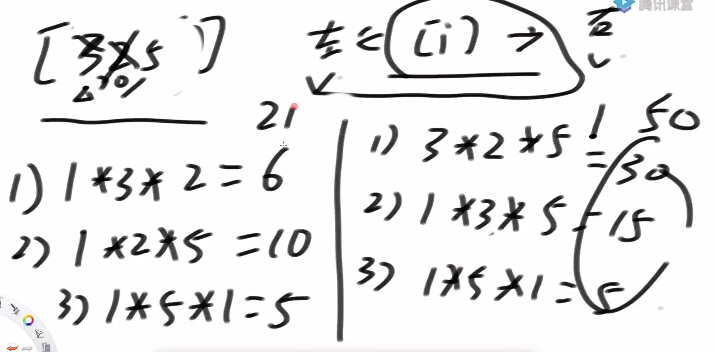

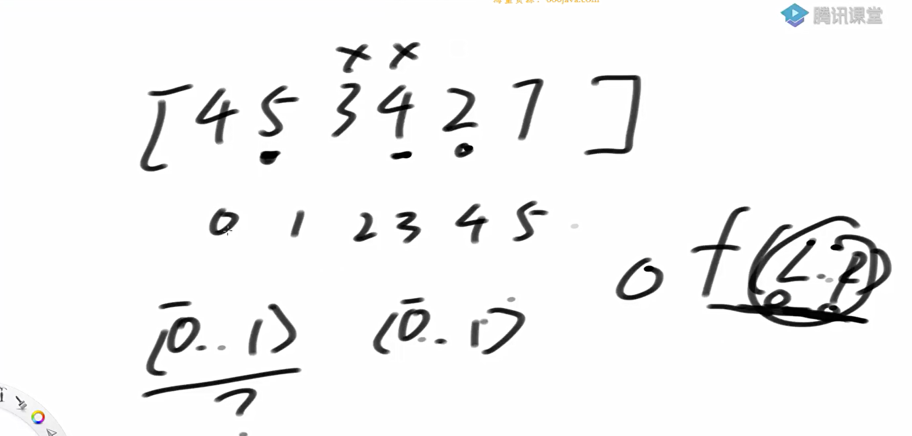

假设如果可以有一个f(L, R)的函数可以得到任意值，那么题目就可以解了

但是，由于L到R范围上处理的时候，比如R位置的数受L..R之外的因素影响，这样参数就是不够的

所以，需要加参数

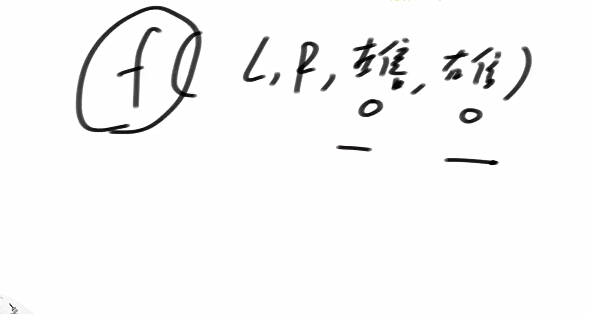

加入参数后发现可能性太多了

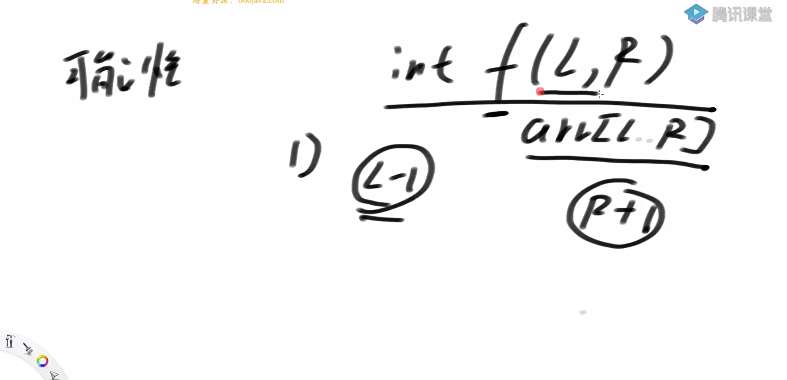

潜台词是：L-1，R+1没爆的时候，调用f(L, R)之前

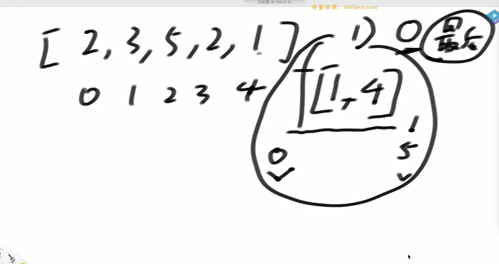

这个时候调用f（L, R）的时候，可以认为0和5处的气球都没有爆

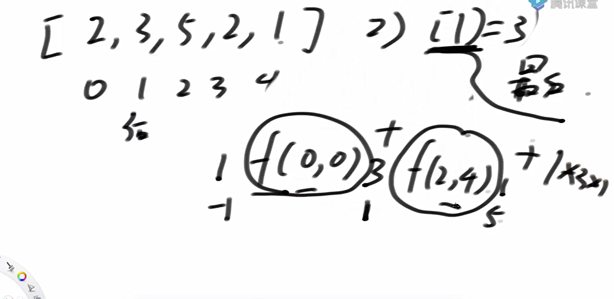

这里假设1位置的气球最后打爆，计算方法是先爆炸f（0,0）的气球，再爆炸f（2,4）的气球

然后加上最后爆炸的1位置的气球，就是得到的1位置最后爆炸的气球的总分值

为什么第一个打爆就是不可以，而最后一个打爆就可以呢？

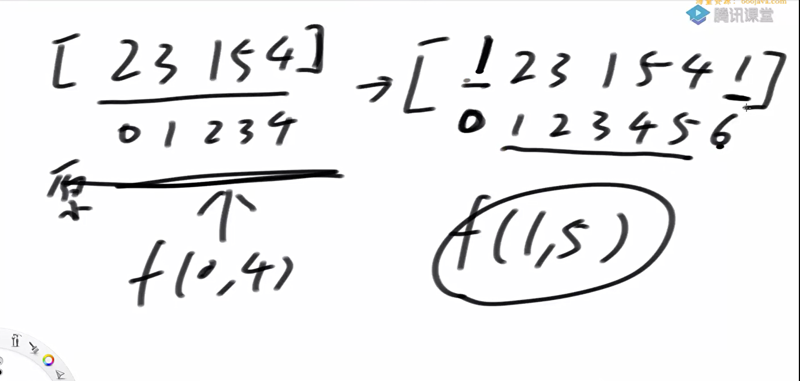

dp表的依赖关系

```
dp[2][4] 依赖:
    dp[3][4]   (下面)
    dp[2][3]   (左面)
    dp[2][2]   (左面)
    dp[4][4]   (下面)
```

可以发现，dp[2][4]依赖的都是其左以及下部分（他们的区间长度都小于[2, 4]）

      | 1   2   3   4   5

------+--------------------

1     | **.   .    .       .       .**

2     | **.   . **  [2,2]   [2,3]   **[2,4]**

3     | **.   .    .   **     [3,3]    [3,4]

4     |** .   .    .         .  **       [4,4]

5     |** .   .    .         .             .**

所有填表顺序可知以对角线为基准，从左往右，从下往上

代码实现

```java
package class46;

public class code01_BurstBalloons {

    public static int maxCoins0(int[] arr){
        int N = arr.length;
        int[] help = new int[N + 2];
        for (int i = 0; i < N; i++){
            help[i + 1] = arr[i];
        }
        help[0] = 1;
        help[N + 1] = 1;
        return func(help, 1, N);
    }

    // L-1位置，和R+1位置，永远不越界，并且，[L-1] 和 [R+1] 一定没爆呢！
    // 返回，arr[L...R]打爆所有气球，最大得分是什么
    public static int func(int[] arr, int L, int R){
        if (L == R){
            return arr[L - 1] * arr[L] * arr[R + 1];
        }

        //尝试每一种情况
        //L最后爆
        int max = func(arr, L - 1, R) + arr[L - 1] * arr[L] * arr[R + 1];
        //R最后爆
        max = Math.max(max, func(arr, L, R-1) + arr[L - 1] * arr[R] * arr[R + 1]);
        //i最后爆
        for (int i = L + 1; i < R; i++){
            Math.max(max, func(arr, L, i-1) + arr[L-1] * arr[i] * arr[R + 1] + func(arr, i+1, R));
        }

        return max;
    }

    public static int maxCoins2(int[] arr){
        if (arr == null || arr.length == 0) {
            return 0;
        }
        if (arr.length == 1) {
            return arr[0];
        }
        int N = arr.length;
        int[] help = new int[N + 2];
        help[0] = 1;
        help[N + 1] = 1;
        for (int i = 0; i < N; i++) {
            help[i + 1] = arr[i];
        }
        int[][] dp = new int[N + 2][N + 2];
        for (int i = 1; i <= N; i++) {
            dp[i][i] = help[i - 1] * help[i] * help[i + 1];
        }
        //dp[L][R]是引爆[L, R]上的所有气球后得到的最大的分数
        for (int L = N; L >= 1; L--){
            for (int R = L+1; R <= N; R++){
                int ans = help[L - 1] * help[L] * help[R + 1] + dp[L + 1][R];
                ans = Math.max(ans, help[L - 1] * help[R] * help[R + 1] + dp[L][R - 1]);
                for (int i = L + 1; i < R; i++){
                    ans = Math.max(ans, dp[L][i-1] + arr[L-1] * arr[i] * arr[R + 1] + dp[i+1][R]);
                }
                dp[L][R] = ans;
            }
        }
        //dp[1][N]的含义是将1到N的所有气球全部戳破后得到的分数
        return dp[1][N];
    }
}

```

怎么想到的

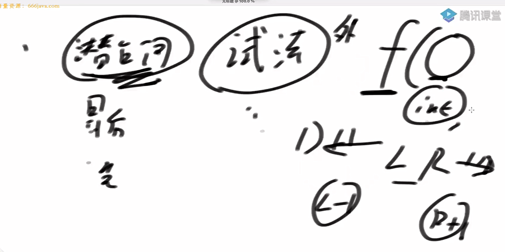

通过各种尝试来使得f中的参数尽可能的少

如果发现尝试的参数越来越多了，那么就说明尝试的方式有问题

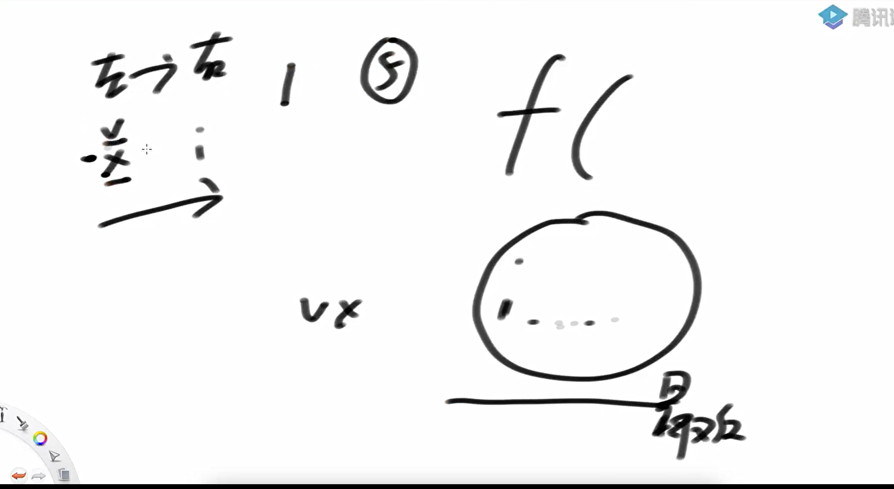

从左往右的尝试模型在这里不能生效的原因是因为该模型成立的前提是前面做的决定后面不能再改变

在这里，如果打爆了5位置，再打爆1位置，就改变了原来做的决定

**问题二：**

给出一些不同颜色的盒子 boxes ，盒子的颜色由不同的正数表示。

你将经过若干轮操作去去掉盒子，直到所有的盒子都去掉为止。每一轮你可以移除具有相同颜色的连续 k 个盒子（k >= 1），这样一轮之后你将得到 k * k 个积分。

返回 *你能获得的最大积分和* 。

 

**示例 1：**

**输入：**boxes = [1,3,2,2,2,3,4,3,1 ] **输出：**23**解释：**[1, 3, 2, 2, 2, 3, 4, 3, 1] ----> [1, 3, 3, 4, 3, 1] (3*3=9 分) ----> [1, 3, 3, 3, 1] (1*1=1 分) ----> [1, 1] (3*3=9 分) ----> [] (2*2=4 分)

**示例 2：**

**输入：**boxes = [1,1,1]**输出：**9

**示例 3：**

**输入：**boxes = [1]**输出：**1

 

**提示：**

- 1 <= boxes.length <= 100

- 1 <= boxes[i] <= 100

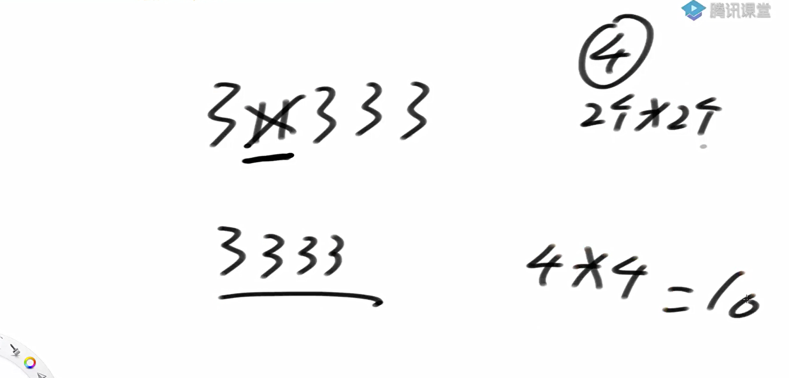

连续消的个数*个数的最大值，一起消掉的前提是数字需要一样

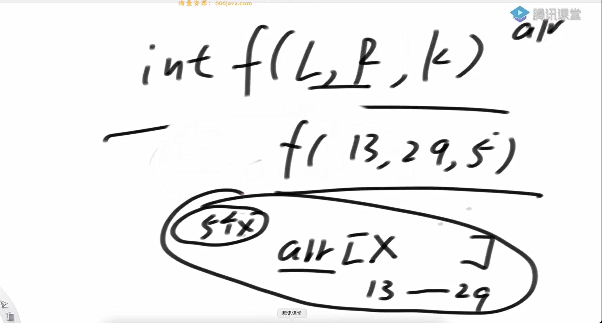

f的含义是x紧贴着的5个x，arr13到29位置上的函数消掉最大值是多少

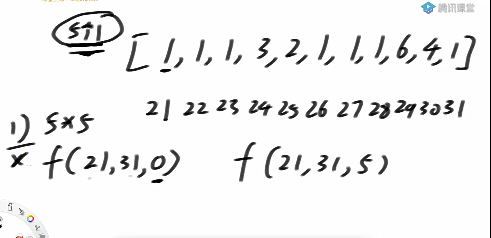

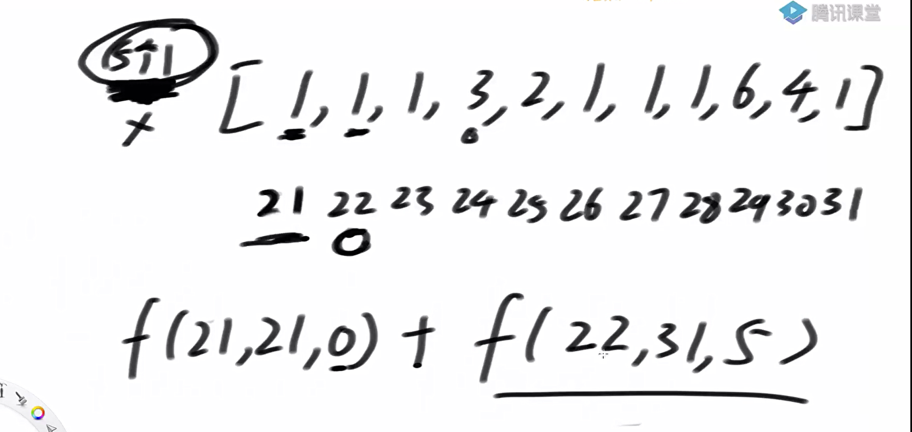

如果只消掉22位置如何表示

f(21,21,0)+ f(22, 31, 5)之所以k为0，是因为确保5个1和22贴在一块

如果只消掉22,23位置的数

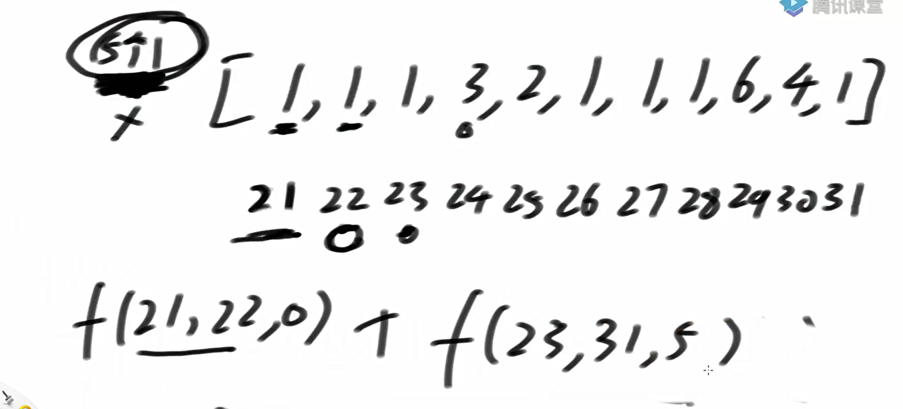

通过这种方法来解决所有可能性

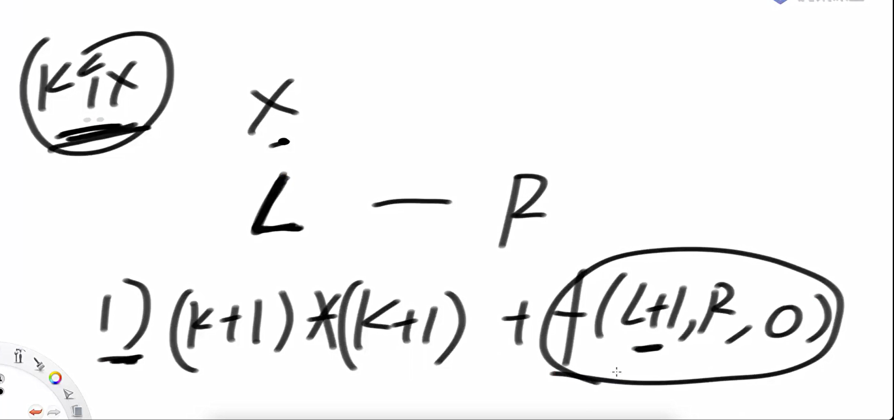

第一种可能性是前面k个x是和L位置的x一起消去的

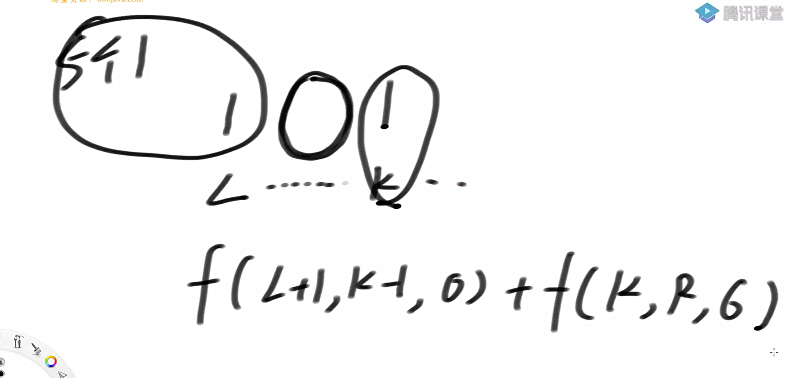

第二种就是普遍的可能性

先消去L+1，K-1区间的数，将k位置的1和前面的5个1与L位置的1一起消

再次举例

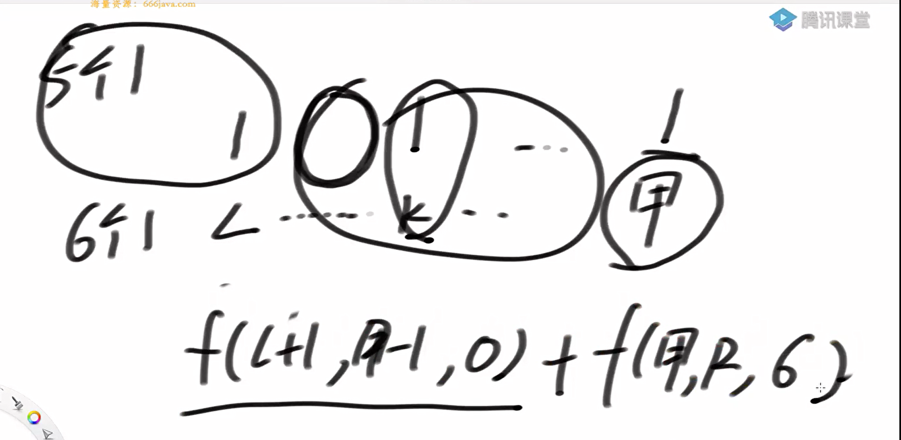

优化部分

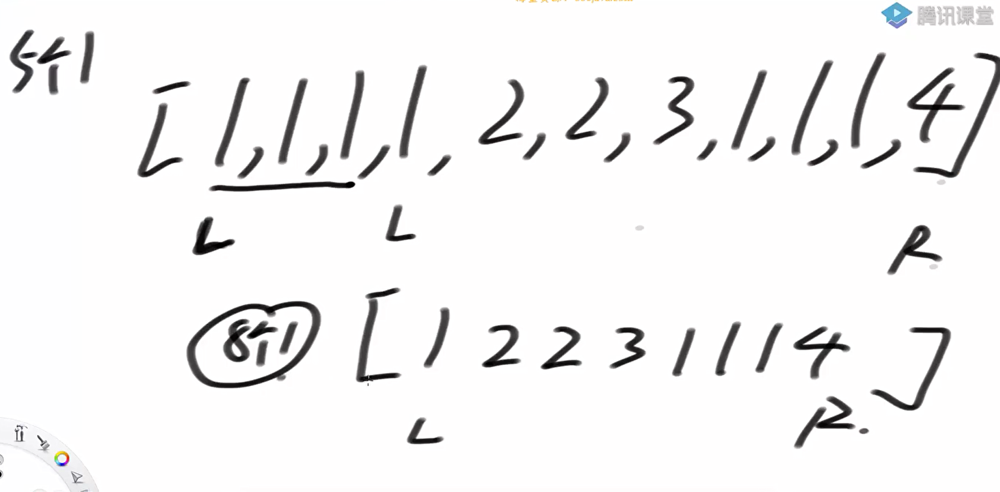

连续的1放一起

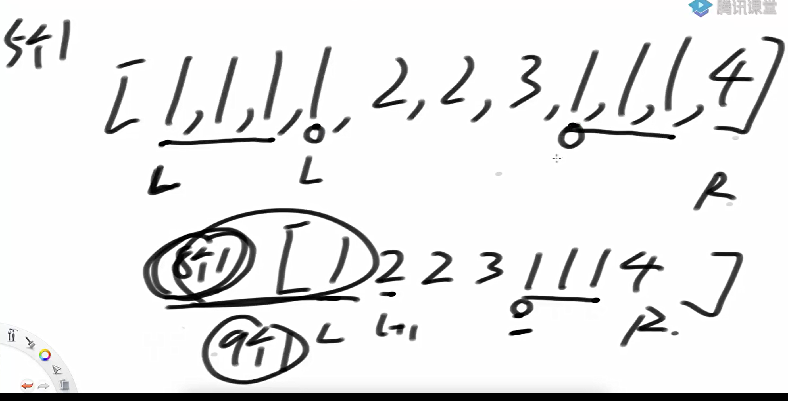

开头一样的部分只试最后一个

中间连成一片的只试第一个

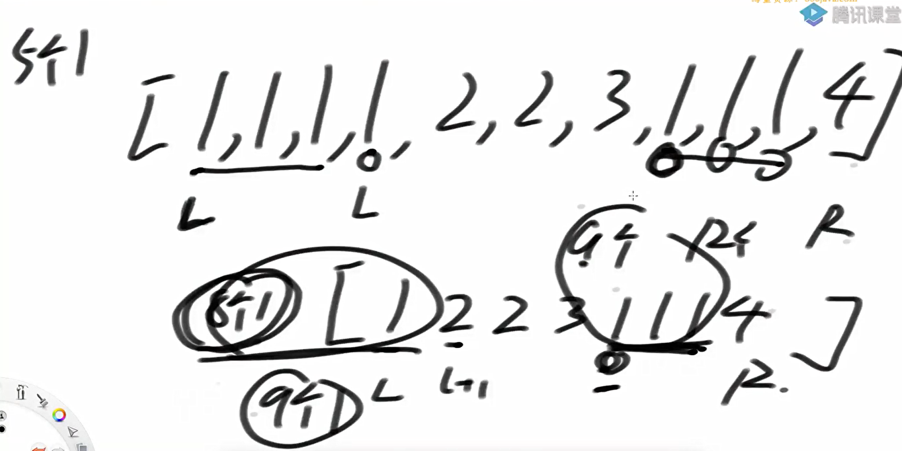

为什么连成一片只试第一个

这是因为前面的9个1

我是这样认为的中间连成一片的1只需要试第一个 其实是因为对于中间连成一片的部分，因为函数递归的缘故，无论从中间练成一片的部分取哪个，得到的最优结果都是一样的，而选择只试开头第一个，可以使得优化后函数的处理简单些

你说：

> “无论从中间连成一片的部分取哪个，得到的最优结果都是一样的”


这基本正确，但更准确的说法是：

> **从这个连续块中的任意一个位置开始尝试合并，最终能获得的最大得分是相同的**，因为它们颜色相同、位置连续，最终都会被一起删除。


但为什么我们**只选择“第一个”**？你说“为了使处理简单”，这也是对的，但背后有更深的**避免重复计算**的考量。

🎯 为什么只试“第一个”就够了？（关键解释）

我们来看递归函数的设计：

```
for (int i = L + 1; i <= R; i++) {
    if (arr[i] == arr[L]) {
        ans = Math.max(ans, 
            func1(arr, L+1, i-1, 0) + 
            func1(arr, i, R, K+1)
        );
    }
}
```

这个循环的意思是：**找后面和 ****arr[L]**** 颜色相同的盒子 ****i****，尝试把 ****L**** 和 ****i**** 合并删除（延迟删除）**。

举个例子：

数组：[1, 1, 1, 2, 2, 1, 1]

当前 L=0，颜色是 1，后面有两个连续的 1（位置 5 和 6）

如果我们不优化，会尝试：

- i=5：把 L=0 和 i=5 合并

- i=6：把 L=0 和 i=6 合并

但注意：**i=5**** 和 ****i=6**** 是连续且同色的**，所以：

- 当你尝试 i=5 时，递归会自然处理从 5 开始的整个 1,1 块（包括 6）

- 当你再尝试 i=6 时，其实已经包含了 i=5 的情况，属于重复尝试

> 就像你已经尝试了“和第一个 1 合并”，就没必要再尝试“和第二个 1 合并”，因为后者的情况已经被前者覆盖了。


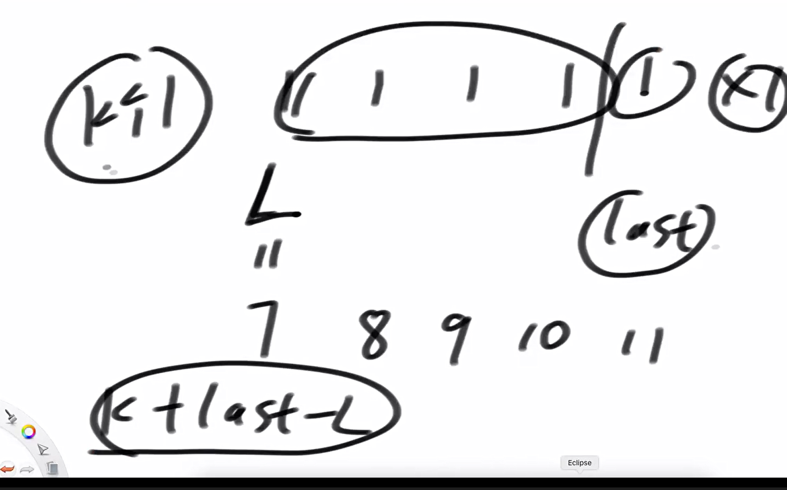

前面部分相同的按一个来算

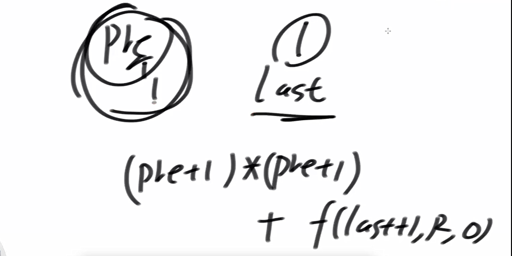

前面的pre个1是跟着last一起消去的

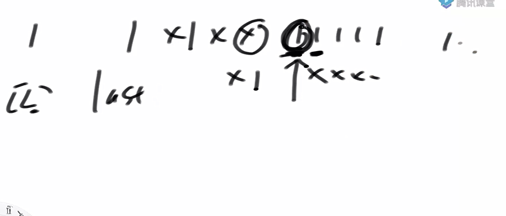

得到与前面连续的第一个位置

代码实现

```java
package class46;

public class code02_RemoveBoxes {


    //arr中有K个与arr[L]相同的数
    public static int func1(int[] arr, int L, int R, int K){
        if (L > R){
            return 0;
        }

        int ans = func1(arr, L + 1, R, 0) + (K + 1) * (K + 1);

        for (int i = L + 1; i <= R; i++){
           if (arr[i] == arr[L]){
               ans = Math.max(ans, func1(arr, L + 1, i - 1, 0) + func1(arr, i, R, K + 1));
           }
        }
        return ans;
    }

    public static int removeBoxes1(int[] arr){
        if (arr == null || arr.length == 0){
            return 0;
        }
        return func1(arr, 0, arr.length - 1, 0);
    }


    public static int removeBoxes2(int[] boxes) {
        int N = boxes.length;
        int[][][] dp = new int[N][N][N];
        int ans = process2(boxes, 0, N - 1, 0, dp);
        return ans;
    }

    public static int process2(int[] boxes, int L, int R, int K, int[][][] dp){
        if (L > R) {
            return 0;
        }
        if (dp[L][R][K] > 0) {
            return dp[L][R][K];
        }

        int last = L;
        while (last + 1 <= R && boxes[last + 1] == boxes[L]){
            last++;
        }
        int pre = K + last - L;
        int ans = (pre + 1) * (pre + 1) + process2(boxes, last + 1, R, 0, dp);

        for (int i = last + 2; i <= R; i++){
            ans = Math.max(process2(boxes, last + 1, i-1, 0, dp), process2(boxes, i, R, pre + 1, dp));
        }
        dp[L][R][K] = ans;
        return ans;
    }
}

```

**问题二：**

如果一个字符相邻的位置没有相同字符，那么这个位置的字符出现不能被消掉

比如:"ab"，其中a和b都不能被消掉

如果一个字符相邻的位置有相同字符，就可以一起消掉

比如:"abbbc"，中间一串的b是可以被消掉的，消除之后剩下"ac"

某些字符如果消掉了，剩下的字符认为重新靠在一起

给定一个字符串，你可以决定每一步消除的顺序，目标是请尽可能多的消掉字符，返回最少的剩余字符数量

比如："aacca", 如果先消掉最左侧的"aa"，那么将剩下"cca"，然后把"cc"消掉，剩下的"a"将无法再消除，返回1

但是如果先消掉中间的"cc"，那么将剩下"aaa"，最后都消掉就一个字符也不剩了，返回0，这才是最优解。

再比如："baaccabb"，

如果先消除最左侧的两个a，剩下"bccabb"，

如果再消除最左侧的两个c，剩下"babb"，

最后消除最右侧的两个b，剩下"ba"无法再消除，返回2

而最优策略是：

如果先消除中间的两个c，剩下"baaabb"，

如果再消除中间的三个a，剩下"bbb"，

最后消除三个b，不留下任何字符，返回0，这才是最优解

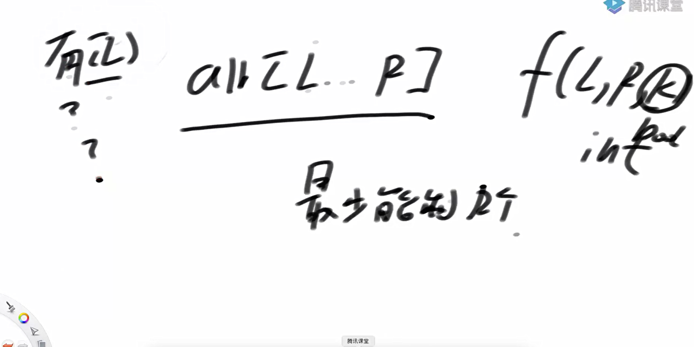

这道题和第二题一样，不需要知道前面有多少个，只需要知道前面有就可以了

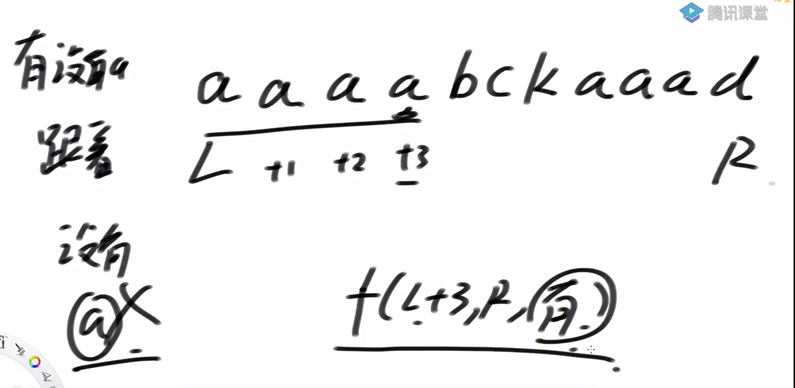

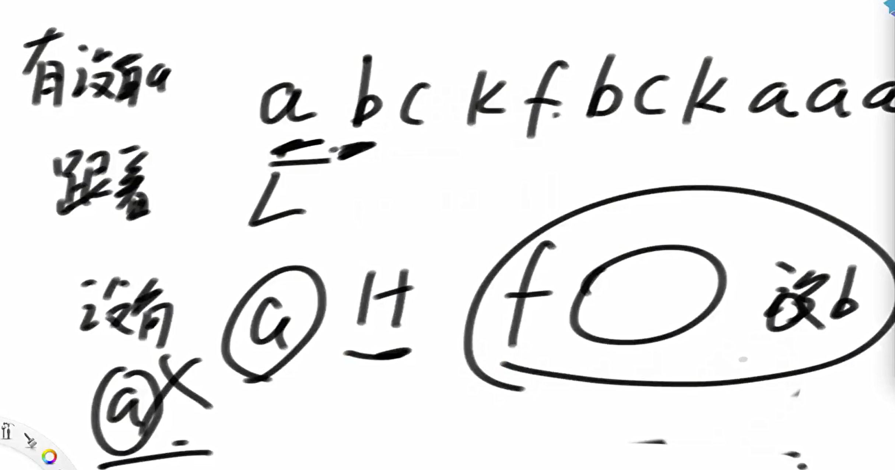

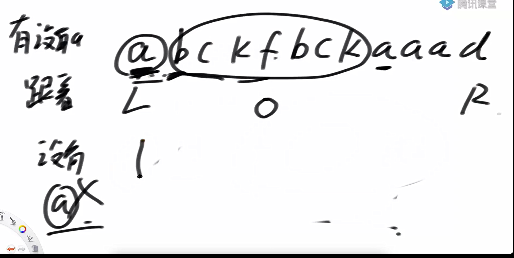

上面是三个分支

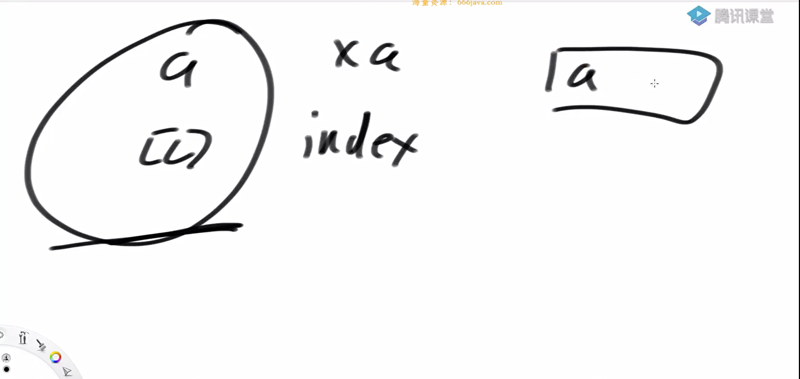

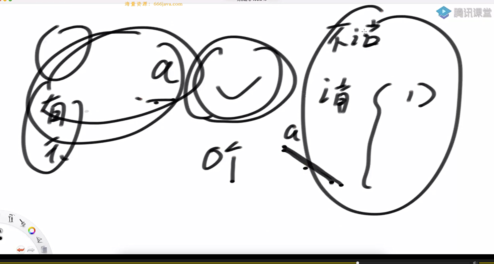

前面的a的可能性

a要看一下前面是否可以消。如果可以消除那么可以选择消除或不消除

a可以消，直接消或看选择和后面的一起消

a不可消，那就当前+1向后继续子问题

代码实现

```java
package class46;

public class code03_DeleteAdjacentSameCharacter {
// 如果一个字符相邻的位置没有相同字符，那么这个位置的字符出现不能被消掉
// 比如:"ab"，其中a和b都不能被消掉
// 如果一个字符相邻的位置有相同字符，就可以一起消掉
// 比如:"abbbc"，中间一串的b是可以被消掉的，消除之后剩下"ac"
// 某些字符如果消掉了，剩下的字符认为重新靠在一起
// 给定一个字符串，你可以决定每一步消除的顺序，目标是请尽可能多的消掉字符，返回最少的剩余字符数量
// 比如："aacca", 如果先消掉最左侧的"aa"，那么将剩下"cca"，然后把"cc"消掉，剩下的"a"将无法再消除，返回1
// 但是如果先消掉中间的"cc"，那么将剩下"aaa"，最后都消掉就一个字符也不剩了，返回0，这才是最优解。
// 再比如："baaccabb"，
// 如果先消除最左侧的两个a，剩下"bccabb"，
// 如果再消除最左侧的两个c，剩下"babb"，
// 最后消除最右侧的两个b，剩下"ba"无法再消除，返回2
// 而最优策略是：
// 如果先消除中间的两个c，剩下"baaabb"，
// 如果再消除中间的三个a，剩下"bbb"，
// 最后消除三个b，不留下任何字符，返回0，这才是最优解

    // 优良尝试的暴力递归版本
    public static int restMin1(String s) {
        if (s == null) {
            return 0;
        }
        if (s.length() < 2) {
            return s.length();
        }
        char[] str = s.toCharArray();
        return process(str, 0, str.length - 1, false);
    }

    public static int process(char[] str, int L, int R, boolean has){
        if (L > R){
            return 0;
        }
        if (L == R){
            return has ? 0 : 1;
        }
        int K = has ? 1 : 0;
        int index = L;
        while (index <= R && str[index] == str[L]){
            index++;
            K++;
        }
        //index至少从L+1开始
        //index停止的位置是str[index] != str[L]的位置
        int way1 = (K > 1 ? 0 : 1) + process(str, index, R, false);
        int way2 = Integer.MAX_VALUE;
        for (int split = index; split <= R; split++){
            if (str[split] == str[L] && str[split] != str[split - 1]){
                if (process(str, index, split - 1, false) == 0){
                    way2 = Math.min(way2, process(str, split, R, K != 0));
                }
            }
        }
        return Math.min(way1, way2);
    }

    // 优良尝试的动态规划版本
    public static int restMin2(String s) {
        if (s == null) {
            return 0;
        }
        if (s.length() < 2) {
            return s.length();
        }
        char[] str = s.toCharArray();
        int N = str.length;
        int[][][] dp = new int[N][N][2];
        for (int i = 0; i < N; i++) {
            for (int j = 0; j < N; j++) {
                for (int k = 0; k < 2; k++) {
                    dp[i][j][k] = -1;
                }
            }
        }
        return dpProcess(str, 0, N - 1, false, dp);
    }

//    当左侧存在相同的字符时，可以将当前区间 [L, R] 的处理与左侧字符合并考虑。
//    如果没有这样的字符，则只能独立处理当前区间。
    public static int dpProcess(char[] str, int L, int R, boolean has, int[][][] dp){
        if (L > R){
            return 0;
        }
        int K = has ? 1 : 0;
        if (dp[L][R][K] != -1) {
            return dp[L][R][K];
        }
        int ans = 0;
        if (L == R){
            ans = (K == 0 ? 1 : 0);
        }else{
            int index = L;
            int all = K;
            while (index <= R && str[index] == str[L]) {
                all++;
                index++;
            }
            int way1 = (all > 1 ? 0 : 1) + dpProcess(str, index, R, false, dp);
            int way2 = Integer.MAX_VALUE;
            for (int split = index; split <= R; split++) {
                if (str[split] == str[L] && str[split] != str[split - 1]) {
                    if (dpProcess(str, index, split - 1, false, dp) == 0) {
                        way2 = Math.min(way2, dpProcess(str, split, R, all > 0, dp));
                    }
                }
            }
            ans = Math.min(way1, way2);
        }
        dp[L][R][K] = ans;
        return ans;
    }
    public static String randomString(int len, int variety) {
        char[] str = new char[len];
        for (int i = 0; i < len; i++) {
            str[i] = (char) ((int) (Math.random() * variety) + 'a');
        }
        return String.valueOf(str);
    }

    public static void main(String[] args) {
        int maxLen = 16;
        int variety = 3;
        int testTime = 100000;
        System.out.println("测试开始");
        for (int i = 0; i < testTime; i++) {
            int len = (int) (Math.random() * maxLen);
            String str = randomString(len, variety);
            int ans1 = restMin1(str);
            int ans2 = restMin2(str);
            if (ans1 != ans2) {
                System.out.println(str);
                System.out.println(ans1);
                System.out.println(ans2);
                System.out.println("出错了！");
                break;
            }
        }
        System.out.println("测试结束");
    }
}

```


每道题尝试都不一样

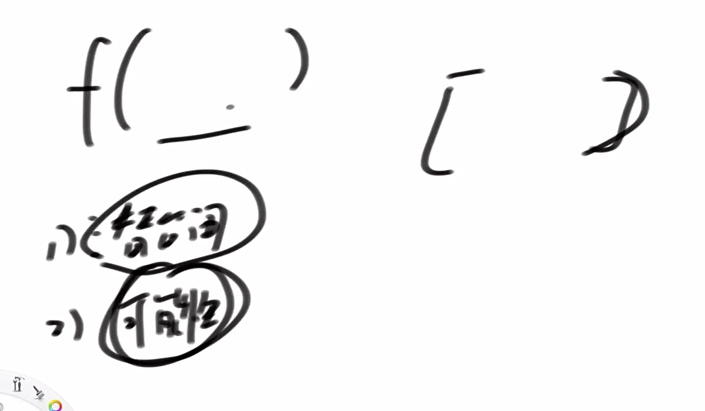

但基本思路就是潜台词和可能性

**问题四：**

给定一个数组arr，和一个正数M，

返回在arr的子数组在长度不超过M的情况下，最大的累加和

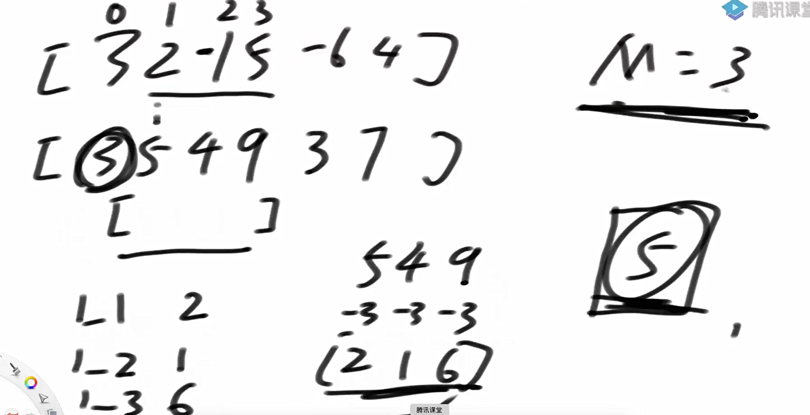

使用的方法是窗口内的最大值

代码实现

```java
package class46;

import java.util.LinkedList;

public class code04_MaxSumLengthNoMore {

    // O(N^2)的解法，暴力解，用作对数器
    public static int test(int[] arr, int M) {
        if (arr == null || arr.length == 0 || M < 1) {
            return 0;
        }
        int N = arr.length;
        int max = Integer.MIN_VALUE;
        for (int L = 0; L < N; L++) {
            int sum = 0;
            for (int R = L; R < N; R++) {
                if (R - L + 1 > M) {
                    break;
                }
                sum += arr[R];
                max = Math.max(max, sum);
            }
        }
        return max;
    }

    public static int maxSum(int[] arr, int M){
        if (arr == null || arr.length == 0 || M < 1) {
            return 0;
        }
        int N = arr.length;
        int[] sum = new int[N];
        sum[0] = arr[0];
        for (int i = 1; i < N; i++) {
            sum[i] = sum[i - 1] + arr[i];
        }
        LinkedList<Integer> qmax = new LinkedList<>();
        int R = 0;
        int end = Math.min(N, M);
        for (; R < end; R++){
            while (!qmax.isEmpty() && sum[qmax.peekLast()] <= sum[R]){
                qmax.pollLast();
            }
            qmax.add(R);
        }
        int max = sum[qmax.peekFirst()];
        int L = 0;
        for (; R < N; L++, R++){
            if (qmax.peekFirst() == L){
                qmax.pollFirst();
            }
            while (!qmax.isEmpty() && sum[qmax.peekLast()] <= sum[R]){
                qmax.pollLast();
            }
            qmax.add(R);
            max = Math.max(max, sum[qmax.peekFirst()] - sum[L]);
        }
        for (; L < N -1; L++){
            if (qmax.peekFirst() == L){
                qmax.pollFirst();
            }
            max = Math.max(max, sum[qmax.peekFirst()] - sum[L]);
        }
        return max;
    }

    // 用作测试
    public static int[] randomArray(int len, int max) {
        int[] arr = new int[len];
        for (int i = 0; i < len; i++) {
            arr[i] = (int) (Math.random() * max) - (int) (Math.random() * max);
        }
        return arr;
    }

    // 用作测试
    public static void main(String[] args) {
        int maxN = 50;
        int maxValue = 100;
        int testTime = 1000000;
        System.out.println("测试开始");
        for (int i = 0; i < testTime; i++) {
            int N = (int) (Math.random() * maxN);
            int M = (int) (Math.random() * maxN);
            int[] arr = randomArray(N, maxValue);
            int ans1 = test(arr, M);
            int ans2 = maxSum(arr, M);
            if (ans1 != ans2) {
                System.out.println(ans1);
                System.out.println(ans2);
                System.out.println("Oops!");
            }
        }
        System.out.println("测试结束");
    }
}

```

**问题五：**

哈夫曼编码实现

词频统计和编码

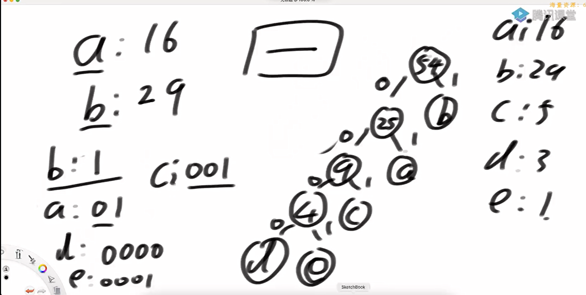

词频统计通过建立频率树来得到

解码过程使用前缀树可快速得到，而不必区分各个011010中的分区，十分的方便

代码实现

```java
package class46;

import java.util.Comparator;
import java.util.HashMap;
import java.util.Map;
import java.util.PriorityQueue;

public class HuffmanTree {
    // 怎么转byte自己来，我只负责huffman算法本身的正确实现
    // 字符串为空的时候，自己处理边界吧


    //根据文章str，生成词频统计表
    public static HashMap<Character, Integer> countMap(String str){
        HashMap<Character, Integer> ans = new HashMap<>();
        char[] s = str.toCharArray();
        for (char cha : s){
            if (!ans.containsKey(cha)){
                ans.put(cha, 1);
            }else{
                ans.put(cha, ans.get(cha) + 1);
            }
        }
        return ans;
    }

    public static class Node {
        public int count;
        public Node left;
        public Node right;

        public Node(int c) {
            count = c;
        }
    }

    //小跟堆
    public static class NodeComp implements Comparator<Node> {

        @Override
        public int compare(Node o1, Node o2) {
            return o1.count - o2.count;
        }

    }
    // 根据由文章生成词频表countMap，生成哈夫曼编码表
    // key : 字符
    // value: 该字符编码后的二进制形式
    // 比如，频率表 A：60, B:45, C:13 D:69 E:14 F:5 G:3
    // A 10
    // B 01
    // C 0011
    // D 11
    // E 000
    // F 00101
    // G 00100

    public static HashMap<Character, String> huffmanForm(HashMap<Character, Integer> countMap){
        HashMap<Character, String> ans = new HashMap<>();
        if (countMap.size() == 1) {
            for (char key : countMap.keySet()) {
                ans.put(key, "0");
            }
            return ans;
        }

        HashMap<Node, Character> nodes = new HashMap<>();
        PriorityQueue<Node> heap = new PriorityQueue<>(new NodeComp());

        for (Map.Entry<Character, Integer> entry : countMap.entrySet()){
            Node cur = new Node(entry.getValue());
            char cha = entry.getKey();
            nodes.put(cur, cha);
            heap.add(cur);
        }

        while (heap.size() != 1){
            Node a = heap.poll();
            Node b = heap.poll();
            Node h = new Node(a.count + b.count);
            h.left = a;
            h.right = b;
            heap.add(h);
        }
        Node head = heap.poll();
        fillForm(head, "", nodes, ans);
        return ans;
    }

    public static void fillForm(Node head, String pre, HashMap<Node, Character> nodes, HashMap<Character, String> ans){
        if (nodes.containsKey(head)){
            ans.put(nodes.get(head), pre);
        }else{
            fillForm(head.left, pre + "0", nodes, ans);
            fillForm(head.right, pre + "1", nodes, ans);
        }
    }

    // 原始字符串str，根据哈夫曼编码表，转译成哈夫曼编码返回
    public static String huffmanEncode(String str, HashMap<Character, String> huffmanForm) {
        char[] s = str.toCharArray();
        StringBuilder builder = new StringBuilder();
        for (char cha : s) {
            builder.append(huffmanForm.get(cha));
        }
        return builder.toString();
    }


    // 原始字符串的哈夫曼编码huffmanEncode，根据哈夫曼编码表，还原成原始字符串
    public static String huffmanDecode(String huffmanEncode, HashMap<Character, String> huffmanForm) {
        TrieNode root = createTrie(huffmanForm);
        TrieNode cur = root;
        char[] encode = huffmanEncode.toCharArray();
        StringBuilder builder = new StringBuilder();
        for (int i = 0; i < encode.length; i++) {
            int index = encode[i] == '0' ? 0 : 1;
            cur = cur.nexts[index];
            if (cur.nexts[0] == null && cur.nexts[1] == null) {
                builder.append(cur.value);
                cur = root;
            }
        }
        return builder.toString();
    }

    public static TrieNode createTrie(HashMap<Character, String> huffmanForm) {
        TrieNode root = new TrieNode();
        for (char key : huffmanForm.keySet()) {
            char[] path = huffmanForm.get(key).toCharArray();
            TrieNode cur = root;
            for (int i = 0; i < path.length; i++) {
                int index = path[i] == '0' ? 0 : 1;
                if (cur.nexts[index] == null) {
                    cur.nexts[index] = new TrieNode();
                }
                cur = cur.nexts[index];
            }
            cur.value = key;
        }
        return root;
    }

    public static class TrieNode {
        public char value;
        public TrieNode[] nexts;

        public TrieNode() {
            value = 0;
            nexts = new TrieNode[2];
        }
    }


    // 为了测试
    public static String randomNumberString(int len, int range) {
        char[] str = new char[len];
        for (int i = 0; i < len; i++) {
            str[i] = (char) ((int) (Math.random() * range) + 'a');
        }
        return String.valueOf(str);
    }

    // 为了测试
    public static void main(String[] args) {
        // 根据词频表生成哈夫曼编码表
        HashMap<Character, Integer> map = new HashMap<>();
        map.put('A', 60);
        map.put('B', 45);
        map.put('C', 13);
        map.put('D', 69);
        map.put('E', 14);
        map.put('F', 5);
        map.put('G', 3);
        HashMap<Character, String> huffmanForm = huffmanForm(map);
        for (Map.Entry<Character, String> entry : huffmanForm.entrySet()) {
            System.out.println(entry.getKey() + " : " + entry.getValue());
        }
        System.out.println("====================");
        // str是原始字符串
        String str = "CBBBAABBACAABDDEFBA";
        System.out.println(str);
        // countMap是根据str建立的词频表
        HashMap<Character, Integer> countMap = countMap(str);
        // hf是根据countMap生成的哈夫曼编码表
        HashMap<Character, String> hf = huffmanForm(countMap);
        // huffmanEncode是原始字符串转译后的哈夫曼编码
        String huffmanEncode = huffmanEncode(str, hf);
        System.out.println(huffmanEncode);
        // huffmanDecode是哈夫曼编码还原成的原始字符串
        String huffmanDecode = huffmanDecode(huffmanEncode, hf);
        System.out.println(huffmanDecode);
        System.out.println("====================");
        System.out.println("大样本随机测试开始");
        // 字符串最大长度
        int len = 500;
        // 所含字符种类
        int range = 26;
        // 随机测试进行的次数
        int testTime = 100000;
        for (int i = 0; i < testTime; i++) {
            int N = (int) (Math.random() * len) + 1;
            String test = randomNumberString(N, range);
            HashMap<Character, Integer> counts = countMap(test);
            HashMap<Character, String> form = huffmanForm(counts);
            String encode = huffmanEncode(test, form);
            String decode = huffmanDecode(encode, form);
            if (!test.equals(decode)) {
                System.out.println(test);
                System.out.println(encode);
                System.out.println(decode);
                System.out.println("出错了!");
            }
        }
        System.out.println("大样本随机测试结束");
    }
}

```