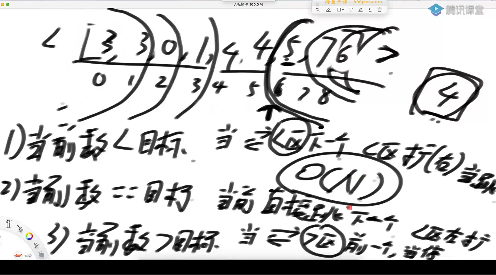

给你一个整数数组 nums 以及两个整数 lower 和 upper 。求数组中，值位于范围 [lower, upper] （包含 lower 和 upper）之内的 **区间和的个数** 。

**区间和** S(i, j) 表示在 nums 中，位置从 i 到 j 的元素之和，包含 i 和 j (i ≤ j)。

为什么这里使用滑动窗口，[min, max]是单调递增的，所以[windowL, windowR]只能向右移动，这样就保证了window窗口不会回退，时间复杂的就控制在了n上，

代码如下

```java
package class05;

// 这道题直接在leetcode测评：
// https://leetcode.com/problems/count-of-range-sum/

public class countOfRangeSum {

 public static int countRangeSum(int[] nums, int lower, int upper) {
		if (nums == null || nums.length == 0) {
			return 0;
		}
		long[] sum = new long[nums.length];
		sum[0] = nums[0];
		for (int i = 1; i < nums.length; i++) {
			sum[i] = sum[i - 1] + nums[i];
		}
		return process(sum, 0, sum.length - 1, lower, upper);
	}

	public static int process(long[] sum, int L, int R, int lower, int upper) {
		if (L == R) {
			return sum[L] >= lower && sum[L] <= upper ? 1 : 0;
		}
		int M = L + ((R - L) >> 1);
		return process(sum, L, M, lower, upper) + process(sum, M + 1, R, lower, upper)
				+ merge(sum, L, M, R, lower, upper);
	}

	public static int merge(long[] arr, int L, int M, int R, int lower, int upper) {
		int ans = 0;
		int windowL = L;
		int windowR = L;
		// [windowL, windowR)
		for (int i = M + 1; i <= R; i++) {
			long min = arr[i] - upper;
			long max = arr[i] - lower;
			while (windowR <= M && arr[windowR] <= max) {
				windowR++;
			}
			while (windowL <= M && arr[windowL] < min) {
				windowL++;
			}
			ans += windowR - windowL;
		}
		long[] help = new long[R - L + 1];
		int i = 0;
		int p1 = L;
		int p2 = M + 1;
		while (p1 <= M && p2 <= R) {
			help[i++] = arr[p1] <= arr[p2] ? arr[p1++] : arr[p2++];
		}
		while (p1 <= M) {
			help[i++] = arr[p1++];
		}
		while (p2 <= R) {
			help[i++] = arr[p2++];
		}
		for (i = 0; i < help.length; i++) {
			arr[L + i] = help[i];
		}
		return ans;
	}

}

```

###### 随机快速排序

荷兰国旗问题



截止条件是左指针碰上右扩边界

荷兰国旗的函数转化为快速排序的函数包括其非递归实现

非递归实现其实就是把递归中栈的操作显示的写出来

```java
package class05;

import java.util.Arrays;
import java.util.Random;
import java.util.Stack;

public class partitionAndQuickSort {


    public static int[] netherLandsFlag(int[] arr, int L, int R){
        if (L > R){
            return new int[]{-1, -1};
        }
        if (L == R){
            return new int[]{1, 1};
        }
        int less = L - 1;
        int more = R;
        int index = L;
        while(index < more){
            if (arr[index] < arr[R]){
                swap(arr, index, less + 1);
                index++;
                less++;
            }else if (arr[index] == arr[R]){
                index++;
            }else if (arr[index] > arr[R]){
                swap(arr, index, more - 1);
                more--;
            }
        }
        swap(arr, more, R);
        return new int[]{less + 1, more};
    }

    private static void swap(int[] arr, int i, int j) {
        int temp = arr[i];
        arr[i] = arr[j];
        arr[j] = temp;
    }

    public static void quickSort(int[] arr){
        if (arr == null && arr.length < 2){
            return;
        }
        process(arr, 0, arr.length - 1);
    }

    public static void process(int[] arr, int l, int r) {
        if (l >= r){
            return;
        }
        int[] ans = netherLandsFlag(arr, l, r);
        process(arr, l, ans[0] - 1);
        process(arr, ans[0] + 1, r);
    }


    public static int partition(int[] arr, int L, int R){
       if (L > R){
           return -1;
       }
       if (L == R){
           return L;
       }
       int index = L;
       int less = L - 1;
       while(index < R){
           if (arr[index] <= arr[R]) {
               swap(arr, index, less + 1);
               less++;
           }
           index++;
       }
       swap(arr, less+1, R);
       return less;
    }

    public static void quickSort2(int[] arr){
        if (arr == null || arr.length < 2){
            return;
        }
        process2(arr, 0, arr.length - 1);
    }

    public static void process2(int[] arr, int L, int R){
        if (L >= R){
            return;
        }
        int M = partition(arr, L, R);
        process(arr, L, M);
        process(arr, M + 1, R);
    }


    private static int[] generateRandomArray(int maxLen, int maxValue) {
        Random random = new Random();
        int len = random.nextInt(maxLen + 1);
        if (len == 0) {
            return null;
        }
        int[] arr = new int[len];
        for (int i = 0; i < len; i++) {
            int num = random.nextInt(maxValue * 2 + 1) - maxValue;
            arr[i] = num;
        }
        return arr;
    }

    private static int[] copyArray(int[] arr) {
        if (arr == null) {
            return null;
        }
        int[] list = new int[arr.length];
        for (int i = 0; i < arr.length; i++) {
            list[i] = arr[i];
        }
        return list;
    }


    public static boolean test(int[] arr1, int[] arr2){
        for (int i = 0 ; i < arr1.length; i++){
            if (arr1[i] != arr2[i]){
                return false;
            }
        }
        return true;
    }


    public static class Op {
        public int left;
        public int right;

        public Op(int left, int right){
            this.left = left;
            this.right = right;
        }
    }

    public static void quickSort3(int[] arr){
        if (arr == null || arr.length < 2){
            return;
        }
        int N = arr.length;
        Random random = new Random();
        swap(arr, random.nextInt(N), N - 1);
        int[] equalArea = netherLandsFlag(arr, 0, arr.length - 1);
        Stack<Op> stack = new Stack();
        stack.push(new Op(0, equalArea[0] - 1));
        stack.push(new Op(equalArea[1] + 1, N - 1));
        while(stack.isEmpty()){
            Op op = stack.pop();
            if (op.left < op.right){
                swap(arr, op.left + random.nextInt(op.right - op.left + 1), op.right);
                equalArea = netherLandsFlag(arr, op.left, op.right);
                stack.push(new Op(op.left, equalArea[0] - 1));
                stack.push(new Op(equalArea[1] + 1, op.right));
            }
        }

    }
    public static void main(String[] args) {
        int testTimes = 5000;
        int maxLen = 10;
        int maxValue = 10;
        for (int i = 0; i < testTimes; i++){
            int[] arr = generateRandomArray(maxLen, maxValue);
            int[] copy2 = copyArray(arr);
            int[] copy3 = copyArray(arr);
            int[] copy4 = copyArray(arr);

            if (arr == null){
                continue;
            }

            quickSort(arr);
            quickSort2(copy2);
            Arrays.sort(copy3);
            quickSort3(copy4);

            boolean o1 = test(arr, copy3);
            boolean o2 = test(copy2, copy3);
            boolean o3 = test(copy4, copy3);

            if (o1 && o2 && o3){
                continue;
            }else{
                System.out.println("oops");
            }
        }
    }


}

```