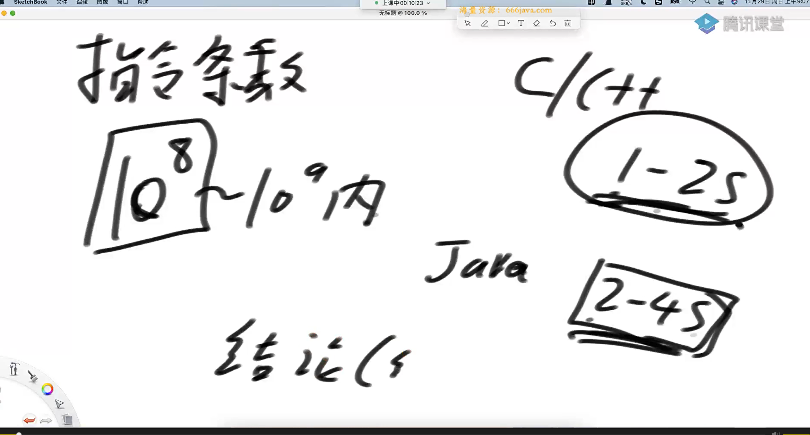
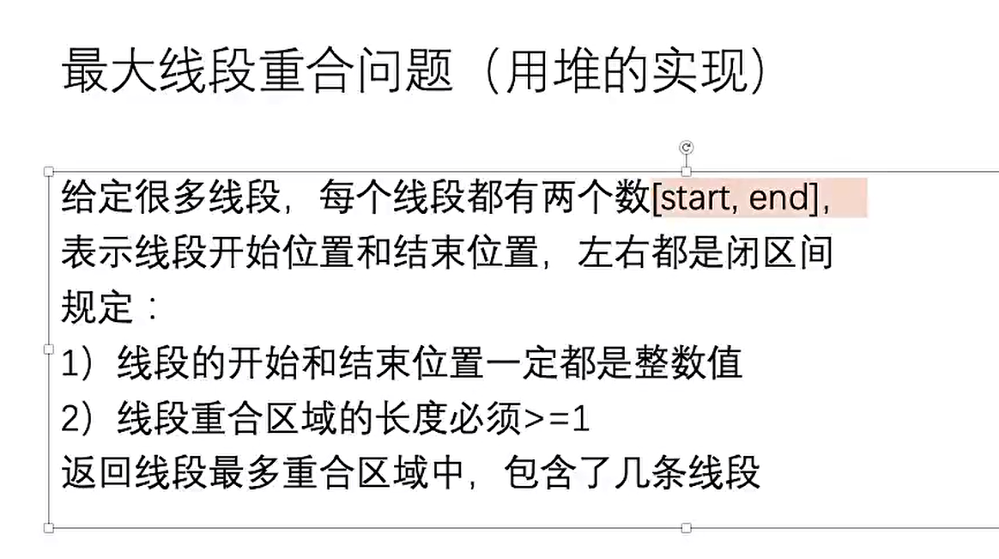
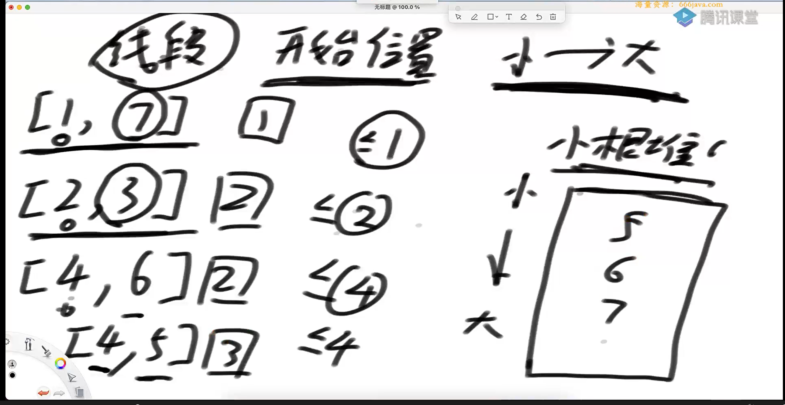
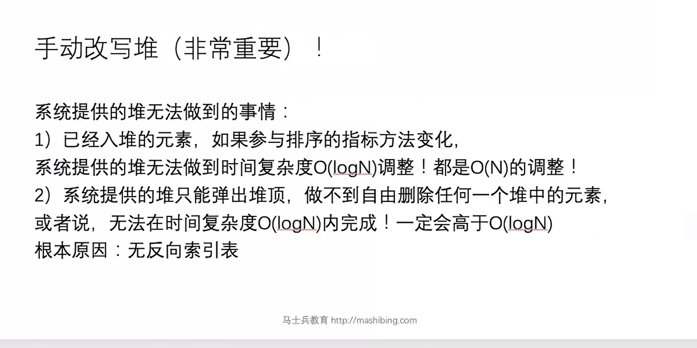
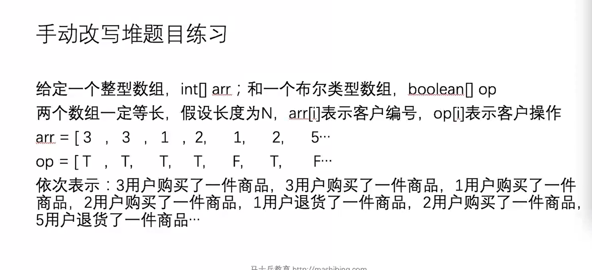
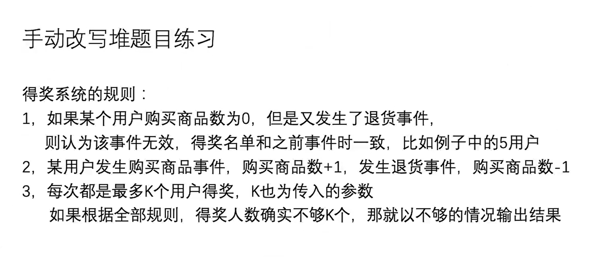
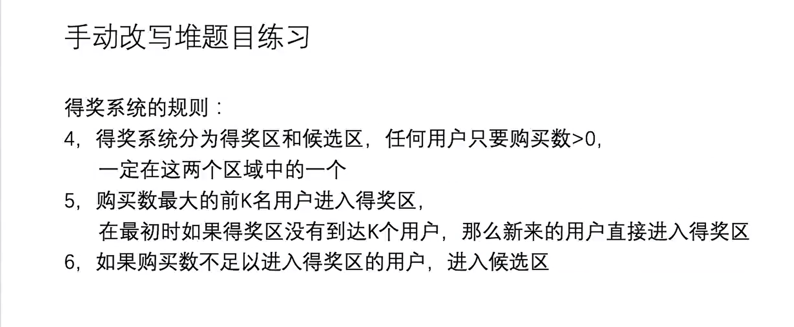
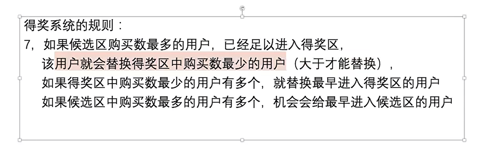
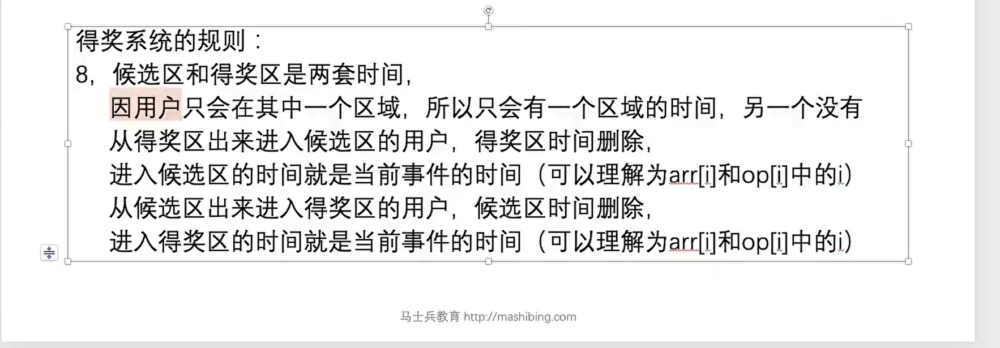
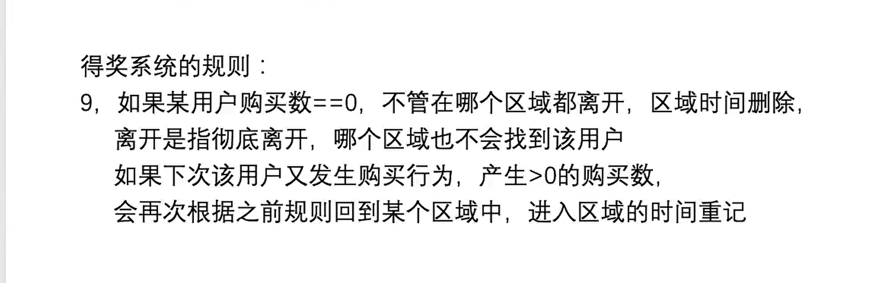

指令数量级的限制判断



最大线段重合问题



暴力做法是：在min和max上1.5 2.5 这样没个.5遍历一遍数组，算一下有几个线段重合

其时间复杂度是o（（max-min） * N）

用小根堆的方法



小根堆实现的代码

```java
package class07;

import java.util.Arrays;
import java.util.Comparator;
import java.util.PriorityQueue;
import java.util.Random;

public class code01_maxCover {

    public static void main(String[] args) {
        int testTimes = 5000;
        int maxLen = 100;
        int L = 10;
        int R = 10;
        for (int i = 0; i < testTimes; i++){
            int[][] arr = generateRandomArray(maxLen, L, R);

            if (arr == null || arr.length == 0){
                continue;
            }

            int o1 = maxCover1(arr);
            int o2 = maxCover2(arr);

            if (o1 != o2){
                System.out.println("oops");
                break;
            }
        }
    }


    public static  class LComparator implements Comparator<Line> {

        @Override
        public int compare(Line o1, Line o2) {
            return o1.L - o2.L;
        }
    }


    public static class Line{
        private int L;
        private int R;

        public Line(int l, int r){
            this.L = l;
            this.R = r;
        }
    }


    private static int maxCover2(int[][] arr) {
        Line[] line = new Line[arr.length];

        for (int i = 0; i < arr.length; i++){
            line[i] = new Line(arr[i][0], arr[i][1]);
        }

        Arrays.sort(line, new LComparator());

        PriorityQueue<Integer> heap = new PriorityQueue<>();

        int max = 0;

        for (int i = 0; i < line.length; i++){
            while (!heap.isEmpty() && heap.peek() <= line[i].L){
                heap.poll();
            }
            heap.add(line[i].R);
            max = Math.max(max, heap.size());
        }

        return max;
    }

    private static int maxCover1(int[][] arr) {
        int len = arr.length;
        int max = Integer.MIN_VALUE;
        int min = Integer.MAX_VALUE;

        for (int i = 0; i < len; i++){
            min = Math.min(arr[i][0], min);
            max = Math.max(arr[i][1], max);
        }

        int coverNum = 0;
        for (double p = min + 0.5; p < max; p++){
            int cur = 0;
            for (int i = 0; i < len; i++){
                if (arr[i][0] < p && arr[i][1] > p){
                    cur++;
                }
            }
            coverNum = Math.max(coverNum, cur);
        }
        
        return coverNum;
    }

    private static int[][] generateRandomArray(int maxLen, int L, int R) {
        Random random = new Random();

        int len = random.nextInt(maxLen + 1);

        int[][] arr = new int[len][2];

        for (int i = 0; i < len; i++){
            int a = L + random.nextInt(R - L + 1);
            int b = L + random.nextInt(R - L + 1);
            if (a == b){
                b = a + 1;
            }
            arr[i][0] = Math.min(a, b);
            arr[i][1] = Math.max(a, b);
        }
        return arr;
    }
}

```

手写堆



手写堆其实就是在原来堆的基础上加了个反向索引表，和重新调整函数，重新调整函数的内容是heapifyDown heapifyUp 

实现如下

```java
package class07;

import java.util.ArrayList;
import java.util.Comparator;
import java.util.HashMap;

public class heapGreater<T>{
    private ArrayList<T> heap;
    private int heapSize;
    private HashMap<T, Integer> indexMap;
    private Comparator<? super T> comp;

    public heapGreater(Comparator<T> c){
        heap = new ArrayList<>();
        heapSize = 0;
        indexMap = new HashMap<>();
        comp = c;
    }

    public boolean isEmpty(){
        return heapSize == 0;
    }

    public int size(){
        return heapSize;
    }

    public boolean contain(T item){
        return indexMap.containsKey(item);
    }

    public T peek(){
        return heap.get(0);
    }

    public T pop(){
       T ans = heap.get(0);
       swap(0, heapSize-1);
       indexMap.remove(ans);
       heap.remove(heapSize-1);
       heapSize--;

       heapIfyDown(0);
       return ans;
    }

    public void push(T item){
        heap.add(item);
        indexMap.put(item, heapSize);
        heapIfyUp(heapSize++);
    }


    public void remove(T item){
        T lastItem = heap.get(heapSize - 1);
        int index = indexMap.get(item);
        heap.remove(heapSize-1);
        heapSize--;
        indexMap.remove(item);
        if (lastItem != item){
            heap.set(index, lastItem);
            indexMap.put(lastItem, index);
            resign(lastItem);
        }
    }

    public ArrayList<T> getAllElement(){
        ArrayList<T> arr = new ArrayList<>();
        for (T c : heap){
            arr.add(c);
        }
        return arr;
    }

    public void resign(T c){
        heapIfyUp(indexMap.get(c));
        heapIfyDown(indexMap.get(c));
    }
    public void heapIfyDown(int index){
        int left = 2 * index + 1;
        while(left < heapSize){
            int best = left;
            best = left + 1 < heapSize && comp.compare(heap.get(left + 1), heap.get(left)) < 0 ? left + 1 : left;
            if (comp.compare(heap.get(index), heap.get(best)) < 0){
                break;
            }
            swap(index, best);
            index = best;
            left = 2 * index + 1;
        }
    }

    public void heapIfyUp(int index){
        while (comp.compare(heap.get(index), heap.get((index - 1) / 2)) < 0){
            swap(index, (index - 1) / 2);
            index = (index - 1) / 2;
        }
    }

    private void swap(int i, int j){
        T o1 = heap.get(i);
        T o2 = heap.get(j);
        heap.set(i, o2);
        heap.set(j, o1);
        indexMap.put(o2, i);
        indexMap.put(o1, j);
    }
}

```

手写堆的练习



题目的一些细节











注意使用peek的时候一定要判空

```java
package class07;

import java.util.*;


public class code02_topK{


    public static class Customer{
        public int id;
        public int buy;
        public int enterTime;

        public Customer(int i, int b, int e){
            id = i;
            buy = b;
            enterTime = e;
        }

        public Customer(){

        }
    }

    public static class candsComparator implements Comparator<Customer> {

        @Override
        public int compare(Customer o1, Customer o2) {
            return o1.buy != o2.buy ? o2.buy - o1.buy : o1.enterTime - o2.enterTime;
        }
    }

    public static class awardsComparator implements  Comparator<Customer>{

        @Override
        public int compare(Customer o1, Customer o2) {
            return o1.buy != o2.buy ? o1.buy - o2.buy : o1.enterTime - o2.enterTime;
        }
    }

    public static ArrayList<ArrayList<Integer>> test(int[] arr, boolean[] ops, int k){
        //map是购买商品数不为0的客户信息
        HashMap<Integer, Customer> map = new HashMap<>();
        ArrayList<Customer> cands = new ArrayList<>();
        ArrayList<Customer> awards = new ArrayList<>();
        ArrayList<ArrayList<Integer>> ans = new ArrayList<>();

        for (int i = 0; i < arr.length; i++){

            int id = arr[i];
            boolean buy = ops[i];

            //当前的时间点的值无效
            //购买数为零并且退货
            if (!buy && !map.containsKey(id)){
                ans.add(getCurAwards(awards));
                continue;
            }
            //当前时间点有效
            //购买数为零但这次购买
            //购买数不为零但这次购买或者退货
            if (!map.containsKey(id)){
                map.put(id, new Customer(id, 0, 0));
            }

            Customer c = map.get(id);
            if (buy){
                c.buy++;
            }else{
                c.buy--;
            }

            if (c.buy == 0){
                map.remove(id);
            }

            if (!cands.contains(c) && ! awards.contains(c)){
                if (awards.size() < k){
                    c.enterTime = i;
                    awards.add(c);
                }else{
                    c.enterTime = i;
                    cands.add(c);
                }
            }

            cleanZero(cands);
            cleanZero(awards);
            cands.sort(new candsComparator());
            awards.sort(new awardsComparator());
            move(cands, awards, i, k);
            ans.add(getCurAwards(awards));
        }

        return ans;
    }

    public static ArrayList<Integer> getCurAwards(ArrayList<Customer> arr){
        ArrayList<Integer> ans = new ArrayList<>();
        for (Customer c : arr){
            ans.add(c.id);
        }
        return ans;
    }

    public static void cleanZero(ArrayList<Customer> arr){
        List<Customer> noZero = new ArrayList<Customer>();
        for (Customer c : arr) {
            if (c.buy != 0) {
                noZero.add(c);
            }
        }
        arr.clear();
        for (Customer c : noZero) {
            arr.add(c);
        }
    }
    //move的作用是整理两个区域的内容
    public static void move(ArrayList<Customer> cands, ArrayList<Customer> awards, int enterTime, int k) {
        if (cands.isEmpty()){
            return;
        }

        if (awards.size() < k){
            Customer c = cands.get(0);
            c.enterTime = enterTime;
            awards.add(c);
            cands.remove(c);
        }else{
            if (!awards.isEmpty() && cands.get(0).buy > awards.get(0).buy){
                Customer oldC = awards.get(0);
                awards.remove(0);
                Customer newC = cands.get(0);
                cands.remove(0);
                oldC.enterTime = enterTime;
                newC.enterTime = enterTime;
                awards.add(newC);
                cands.add(oldC);
            }
        }

    }


    public static class getTopK{
        private HashMap<Integer, Customer> map;
        private heapGreater<Customer> candsHeap;
        private heapGreater<Customer> awardsHeap;
        private final int k;


        public getTopK(int k) {
            map = new HashMap<>();
            candsHeap = new heapGreater<>(new candsComparator());
            awardsHeap = new heapGreater<>(new awardsComparator());
            this.k = k;
        }

        public void operate(int id, boolean buy, int time) {

            //没有购买过并且退货
            if (!map.containsKey(id) && !buy) {
                return;
            }
            //购买过退货或继续购买
            //没购买过单购买
            if (!map.containsKey(id)) {
                map.put(id, new Customer(id, 0, 0));
            }

            Customer c = map.get(id);
            if (buy) {
                c.buy++;
            } else {
                c.buy--;
            }

            if (c.buy == 0) {
                map.remove(id);
            }

            if (!candsHeap.contain(c) && !awardsHeap.contain(c)) {
                if (awardsHeap.size() < k) {
                    c.enterTime = time;
                    awardsHeap.push(c);
                } else {
                    c.enterTime = time;
                    candsHeap.push(c);
                }
            } else if (candsHeap.contain(c)) {
                if (c.buy == 0) {
                    candsHeap.remove(c);
                } else {
                    candsHeap.resign(c);
                }
            } else if (awardsHeap.contain(c)) {
                if (c.buy == 0) {
                    awardsHeap.remove(c);
                } else {
                    awardsHeap.resign(c);
                }
            }
            awardsMove(time);
        }

        private void awardsMove(int enterTime){
            if (candsHeap.isEmpty()){
                return;
            }
            if (awardsHeap.size() < k){
                Customer p = candsHeap.pop();
                p.enterTime = enterTime;
                awardsHeap.push(p);
            }else{
                if (!candsHeap.isEmpty() && !awardsHeap.isEmpty() && candsHeap.peek().buy > awardsHeap.peek().buy){
                    Customer newAward = candsHeap.pop();
                    newAward.enterTime = enterTime;
                    Customer oldAward = awardsHeap.pop();
                    oldAward.enterTime = enterTime;
                    awardsHeap.push(newAward);
                    candsHeap.push(oldAward);
                }
            }
        }

        public ArrayList<Integer> getNowAwards(){
            ArrayList<Customer> arr = awardsHeap.getAllElement();
            ArrayList<Integer> ans = new ArrayList<>();
            for (Customer c : arr){
                ans.add(c.id);
            }
            return ans;
        }
    }

    //用加强堆实现
    public static ArrayList<ArrayList<Integer>> topK(int[] arr, boolean[] ops, int k){
        ArrayList<ArrayList<Integer>> ans = new ArrayList<>();
        getTopK now = new getTopK(k);
        for (int i = 0; i < arr.length; i++){
            now.operate(arr[i], ops[i], i);
            ans.add(now.getNowAwards());
        }
        return ans;
    }


    public static class  Data{
        private int[] arr;
        private boolean[] ops;

        public Data(int[] arr, boolean[] ops){
            this.arr = arr;
            this.ops = ops;
        }

    }

    public static Data generateRandomData(int maxLen, int maxId){
        Random random = new Random();
        int len = random.nextInt(maxLen + 1);
        int[] arr = new int[len];
        boolean[] ops = new boolean[len];
        for (int i = 0; i < len; i++){
            arr[i] = random.nextInt(maxId + 1);
            ops[i] = random.nextDouble() < 0.5 ? true : false;
        }

        Data ans = new Data(arr, ops);

        return ans;
    }


    public static boolean same(ArrayList<ArrayList<Integer>> arr1, ArrayList<ArrayList<Integer>> arr2){
        if (arr1.size() != arr2.size()){
            return false;
        }

        for (int i = 0 ; i < arr1.size(); i++){
            ArrayList<Integer> cur1 = arr1.get(i);
            ArrayList<Integer> cur2 = arr2.get(i);
            if (cur1.size() != cur2.size()){
                return false;
            }
            cur1.sort((o1, o2) -> o1 - o2);
            cur2.sort((o1, o2) -> o1 - o2);


            for (int j = 0; j < cur1.size(); j++){
                if (!cur1.get(j).equals(cur2.get(j))){
                    return false;
                }
            }
        }
        return true;
    }


    public static void main(String[] args) {
        int testTimes = 5000;
        int maxLen = 10;
        int maxId = 10;
        int maxK = 3;
        for (int i = 0 ; i < testTimes; i++){
            Data data = generateRandomData(maxLen, maxId);
            int[] arr = data.arr;
            boolean[] ops = data.ops;
            Random random = new Random();
            int k = random.nextInt(maxK + 1);
            ArrayList<ArrayList<Integer>> ans1 = topK(arr, ops, k);
            ArrayList<ArrayList<Integer>> ans2 = test(arr, ops, k);

            if (!same(ans1, ans2)){
                for (int j = 0 ; j < ans1.size(); j++){
                    System.out.println(arr[j] + ", " + ops[j] + " ");
                }
                System.out.println("k = " + k);
                System.out.println("topK = "+ ans1);
                System.out.println("test = " + ans2);
                break;
            }
        }

    }
}

```